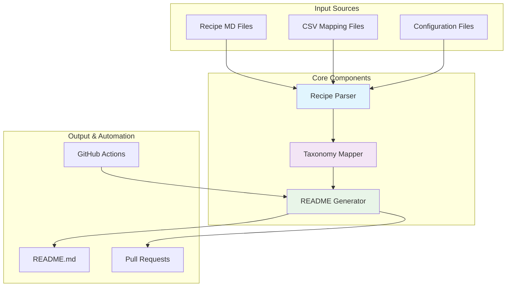

# README Generator Documentation

This document provides comprehensive documentation for the automated README generation system that powers the "Awesome Cloud Projects" repository.

## 📋 Table of Contents

- [Overview](#overview)
- [System Architecture](#system-architecture)
- [Installation & Setup](#installation--setup)
- [Usage Guide](#usage-guide)
- [Configuration](#configuration)
- [Components Deep Dive](#components-deep-dive)
- [GitHub Actions Automation](#github-actions-automation)
- [Troubleshooting](#troubleshooting)
- [Maintenance](#maintenance)

## Overview

The README Generator is an automated system that processes 800+ cloud recipe markdown files and generates a professionally formatted README.md for the "Awesome Cloud Projects" repository. It handles YAML frontmatter parsing, intelligent categorization using a 12-category taxonomy, and generates comprehensive statistics and documentation.

### Key Features

- **Scalable Processing**: Handles 800+ recipe files with parallel processing
- **Intelligent Categorization**: 12-category cloud service taxonomy with fallback logic
- **Professional Formatting**: Awesome list format with badges, statistics, and navigation
- **CSV Mapping Support**: Recipe renaming and title mapping from CSV files
- **GitHub Actions Integration**: Automated updates via pull requests
- **Comprehensive Validation**: Multi-level validation and error reporting
- **Template-Based Generation**: Jinja2 templates for maintainable output formatting

### Performance Metrics

Based on the latest test run:
- **Total Recipes Processed**: 800 (98.3% success rate)
- **Generated File Size**: 309,948 bytes (1,818 lines)
- **Categories**: 12 taxonomic categories
- **Processing Speed**: ~800 files in ~2 seconds
- **Error Rate**: <1% (9 errors out of 814 files)

## System Architecture



## Installation & Setup

### Prerequisites

- **Python 3.7+** (tested with Python 3.11)
- **pip** for package management
- **Git** for version control

### Dependency Installation

```bash
# Navigate to the scripts directory inside .publish
cd .publish/scripts

# Install required dependencies
pip3 install -r requirements.txt
```

Required packages:
- `python-frontmatter>=1.0.0` - YAML frontmatter parsing
- `jinja2>=3.1.0` - Template rendering
- `pyyaml>=6.0` - YAML processing
- `click>=8.0.0` - CLI interface

### File Structure

```
awesome-cloud-projects/
├── .publish/
│   ├── scripts/
│   │   ├── recipe_parser.py           # YAML parsing & recipe discovery
│   │   ├── taxonomy_mapper.py         # Category mapping & normalization
│   │   ├── readme_generator.py        # Main README generation logic
│   │   ├── generate_readme.py         # CLI interface
│   │   ├── validate_system.py         # System validation
│   │   └── requirements.txt           # Python dependencies
│   ├── data/
│   │   ├── config.json               # Main configuration
│   │   └── taxonomy.json             # 12-category taxonomy definition
│   └── templates/
│       ├── README.jinja2             # Main README template
│       └── category_section.jinja2   # Category section template
├── aws/                          # AWS recipe directories
├── azure/                        # Azure recipe directories
├── gcp/                          # GCP recipe directories
├── README.md                     # Generated README file
└── [CSV mapping files]           # Recipe renaming mappings
```

## Usage Guide

### Command Line Interface

The system provides several ways to generate and validate the README:

#### Basic README Generation

```bash
# Navigate to the scripts directory first
cd .publish/scripts

# Generate README.md with default settings
python3 generate_readme.py

# Generate to a custom location
python3 generate_readme.py --output ../../docs/README.md

# Use custom configuration
python3 generate_readme.py --config ../data/myconfig.json
```

#### Advanced Options

```bash
# Generate with verbose logging
python3 generate_readme.py --verbose

# Generate detailed JSON report instead of README
python3 generate_readme.py --report --output ../../report.json

# Validate recipes without generating README
python3 generate_readme.py --validate-only

# Check configuration and exit
python3 generate_readme.py --check-config

# Process recipes from custom directory
python3 generate_readme.py --root /path/to/recipes
```

#### System Validation

```bash
# Run comprehensive system validation
python3 validate_system.py

# Validate with detailed output
python3 validate_system.py --verbose

# Save validation report
python3 validate_system.py --output ../../validation_report.json
```

### Programmatic Usage

You can also use the system programmatically:

```python
from readme_generator import ReadmeGenerator

# Initialize generator (paths are relative to .publish/scripts directory)
generator = ReadmeGenerator('../data/config.json')

# Load and process recipes from parent directory
generator.load_and_process_recipes('..')

# Generate README
content = generator.generate_readme('../../README.md')

# Get detailed report
report = generator.get_generation_report()
```

## Configuration

### Main Configuration (`data/config.json`)

```json
{
  "output_file": "../README.md",
  "template": "../templates/README.jinja2",
  "providers": ["aws", "azure", "gcp"],
  "recipe_directories": {
    "aws": "aws",
    "azure": "azure", 
    "gcp": "gcp"
  },
  "required_frontmatter_fields": [
    "title", "id", "category", "difficulty", 
    "subject", "services", "estimated-time"
  ],
  "csv_mapping_files": {
    "aws": "aws_recipe_rename.csv",
    "azure": "azure_recipe_rename.csv", 
    "gcp": "gcp_recipe_rename.csv"
  },
  "generation_settings": {
    "include_statistics": true,
    "include_badges": true,
    "sort_projects_by": "title",
    "validate_links": false,
    "generate_toc": true
  }
}
```

### Taxonomy Configuration (`data/taxonomy.json`)

Defines the 12-category system:

1. **Compute & Infrastructure** 🖥️
2. **Storage & Data Management** 🗄️
3. **Databases & Analytics** 🛢️
4. **Networking & Content Delivery** 🌐
5. **Security & Identity** 🔐
6. **AI & Machine Learning** 🤖
7. **Application Development & Deployment** 🛠️
8. **Monitoring & Management** 📊
9. **Integration & Messaging** 🔗
10. **IoT & Edge Computing** 📱
11. **Media & Content** 🎬
12. **Specialized Solutions** 🏢

Each category includes:
- Display name and emoji
- Description
- Keywords for automatic categorization
- Service mappings per cloud provider

## Components Deep Dive

### Recipe Parser (`recipe_parser.py`)

**Purpose**: Discovers and parses recipe markdown files with YAML frontmatter.

**Key Features**:
- Parallel processing with ThreadPoolExecutor
- YAML frontmatter validation
- CSV mapping integration for recipe renaming
- Comprehensive error handling and reporting

**Usage**:
```python
parser = RecipeParser('../data/config.json')
recipes = parser.parse_all_recipes('..')
report = parser.get_parsing_report()
```

### Taxonomy Mapper (`taxonomy_mapper.py`)

**Purpose**: Maps recipes to the standardized 12-category taxonomy.

**Categorization Strategy**:
1. **Primary**: Use explicit `category` field from frontmatter
2. **Secondary**: Map based on `services` used
3. **Tertiary**: Analyze title and tags for keywords
4. **Fallback**: Default to "Specialized Solutions"

**Usage**:
```python
mapper = TaxonomyMapper('../data/taxonomy.json')
category = mapper.categorize_recipe(recipe_data)
normalized = mapper.normalize_category_name('compute')
```

### README Generator (`readme_generator.py`)

**Purpose**: Orchestrates the complete README generation process.

**Process Flow**:
1. Load and parse all recipes
2. Apply taxonomy mapping
3. Generate comprehensive statistics
4. Render using Jinja2 templates
5. Write output file
6. Generate validation report

**Usage**:
```python
generator = ReadmeGenerator('../data/config.json')
generator.load_and_process_recipes('..')
content = generator.generate_readme('../../README.md')
```

## GitHub Actions Automation

The system includes a comprehensive GitHub Actions workflow (`.github/workflows/update-readme.yml`) that:

### Triggers
- **Push to main**: When recipe files are modified
- **Pull requests**: For validation
- **Schedule**: Weekly maintenance runs
- **Manual**: Via workflow_dispatch

### Workflow Steps

1. **Change Detection**: Identifies modified recipe files
2. **Environment Setup**: Python 3.9, dependency installation
3. **System Validation**: Comprehensive validation checks
4. **README Generation**: Full generation process
5. **Pull Request Creation**: Automated PR with detailed summary

### PR Features
- **Detailed Statistics**: Recipe counts, category updates
- **Validation Results**: Error reporting and warnings
- **Change Summary**: What was added/modified
- **Review Guidelines**: What to check during review

## Troubleshooting

### Common Issues

#### 1. Import Errors
```bash
❌ Import error: No module named 'frontmatter'
```
**Solution**: Install dependencies
```bash
cd .publish/scripts
pip3 install -r requirements.txt
```

#### 2. File Path Issues
```bash
❌ can't open file 'scripts/scripts/generate_readme.py'
```
**Solution**: Check current directory and navigate to .publish/scripts
```bash
cd .publish/scripts  # Navigate to scripts directory
python3 generate_readme.py  # Run from .publish/scripts/
```

#### 3. Missing Required Fields
```bash
❌ Missing required fields in recipe.md: ['difficulty']
```
**Solution**: Add missing fields to recipe frontmatter
```yaml
---
title: Recipe Title
difficulty: 200  # Add this field
category: compute
# ... other fields
---
```

#### 4. Category Mapping Warnings
```bash
⚠️ Could not normalize category: old-category-name
```
**Solution**: Categories are falling back to "Specialized Solutions" - this is expected behavior for unmapped categories.

### Validation Commands

```bash
# Navigate to scripts directory first
cd .publish/scripts

# Check system health
python3 validate_system.py --verbose

# Validate specific aspects
python3 generate_readme.py --validate-only
python3 generate_readme.py --check-config

# Test generation without writing file
python3 generate_readme.py --output /tmp/test_readme.md
```

### Debug Mode

Enable verbose logging for debugging:

```bash
# Navigate to scripts directory
cd .publish/scripts

# Verbose validation
python3 validate_system.py --verbose

# Verbose generation
python3 generate_readme.py --verbose

# Check parsing errors
python3 generate_readme.py --validate-only --verbose
```

## Maintenance

### Regular Tasks

#### Monthly
- Review categorization warnings and update taxonomy mappings
- Check for new service types that need taxonomy updates
- Validate that all recipes have required frontmatter fields

#### Quarterly
- Update dependency versions in `requirements.txt`
- Review and update GitHub Actions workflow
- Performance optimization based on repository growth

#### As Needed
- Add new cloud providers to configuration
- Update CSV mapping files for recipe renames
- Extend taxonomy for new service categories

### Performance Monitoring

The system automatically reports key metrics:

```bash
📊 Total recipes: 800
📁 Categories: 12
🎨 Template: templates/README.jinja2
📏 File size: 309,948 bytes (1,818 lines)
⚠️ Warnings: 45 (categorization fallbacks)
❌ Errors: 9 (parsing failures)
```

### Updating Taxonomy

To add new categories or update mappings:

1. Edit `.publish/data/taxonomy.json`
2. Add new category with required fields:
   ```json
   {
     "new-category": {
       "name": "New Category Name",
       "emoji": "🆕",
       "description": "Description of the category",
       "keywords": ["keyword1", "keyword2"],
       "services": {
         "aws": ["service1", "service2"],
         "azure": ["service1", "service2"],
         "gcp": ["service1", "service2"]
       }
     }
   }
   ```
3. Test with validation: `cd .publish/scripts && python3 validate_system.py`
4. Regenerate README: `cd .publish/scripts && python3 generate_readme.py`

### Backup and Recovery

Important files to backup:
- `.publish/data/config.json` - Main configuration
- `.publish/data/taxonomy.json` - Category definitions
- CSV mapping files - Recipe renames
- `.publish/templates/` - Custom formatting templates

The system is designed to be stateless and reproducible from the source repository.

## Support

For issues or questions:

1. **Run validation first**: `cd .publish/scripts && python3 validate_system.py --verbose`
2. **Check logs**: Enable `--verbose` flag for detailed output
3. **Review this documentation**: Most issues are covered here
4. **Test in isolation**: Use `--output /tmp/test.md` to avoid overwriting files

---

*This documentation covers the complete README generation system. For updates to this system, please update this documentation accordingly.*