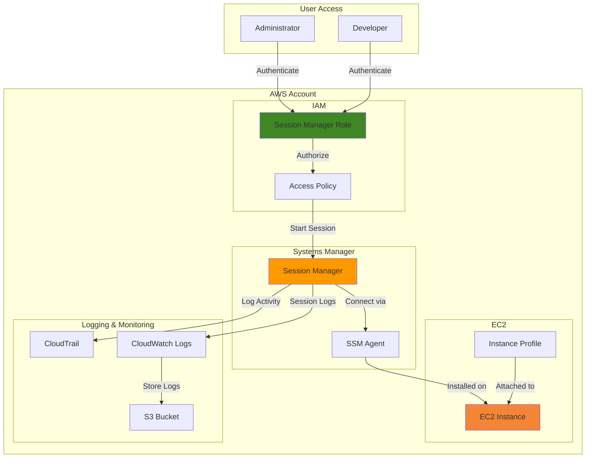

# Accessing Instances with Session Manager

## Problem

Organizations struggle with secure remote access to EC2 instances, often relying on SSH keys, bastion hosts, or opened inbound ports that create security vulnerabilities. Traditional approaches require key management, network complexity, and expose attack surfaces through public-facing access points. Security teams need auditable, controlled access that eliminates the operational overhead of managing SSH keys while maintaining compliance with zero-trust principles.

## Solution

AWS Systems Manager Session Manager provides a fully managed, secure remote access solution that eliminates the need for SSH keys, bastion hosts, or open inbound ports. This serverless approach uses IAM for access control, encrypts all traffic, and provides comprehensive audit logging. The solution integrates with existing AWS security services to deliver enterprise-grade remote access with minimal operational overhead.

## Architecture Diagram



## Prerequisites

1. AWS account with administrative permissions to create IAM roles and policies
2. AWS CLI installed and configured (version 2.0 or later)
3. Session Manager plugin installed for AWS CLI (for interactive sessions)
4. Basic understanding of IAM roles and EC2 instance management
5. EC2 instance running Amazon Linux 2 or Windows Server (for testing)
6. Estimated cost: $0.50-$2.00 per hour for EC2 instances (depends on instance type)

> **Note**: Session Manager requires no additional charges beyond standard EC2 instance costs and CloudWatch/S3 logging fees.

## Preparation

```bash
# Set environment variables
export AWS_REGION=$(aws configure get region)
export AWS_ACCOUNT_ID=$(aws sts get-caller-identity \
    --query Account --output text)

# Generate unique identifiers for resources
RANDOM_SUFFIX=$(aws secretsmanager get-random-password \
    --exclude-punctuation --exclude-uppercase \
    --password-length 6 --require-each-included-type \
    --output text --query RandomPassword)

# Set resource names
export INSTANCE_ROLE_NAME="SessionManagerInstanceRole-${RANDOM_SUFFIX}"
export INSTANCE_PROFILE_NAME="SessionManagerInstanceProfile-${RANDOM_SUFFIX}"
export USER_POLICY_NAME="SessionManagerUserPolicy-${RANDOM_SUFFIX}"
export LOG_GROUP_NAME="/aws/sessionmanager/sessions-${RANDOM_SUFFIX}"
export LOG_BUCKET_NAME="sessionmanager-logs-${RANDOM_SUFFIX}"

echo "✅ AWS environment configured with region: ${AWS_REGION}"
echo "✅ Resource suffix: ${RANDOM_SUFFIX}"
```

## Steps

1. **Create IAM Role for EC2 Instance**:

   The EC2 instance requires an IAM role to communicate with Session Manager. This role enables the SSM Agent to register the instance as a managed node and receive session requests. The `AmazonSSMManagedInstanceCore` policy provides the essential permissions for Session Manager functionality without granting excessive privileges.

   ```bash
   # Create trust policy for EC2 service
   cat > trust-policy.json << EOF
   {
     "Version": "2012-10-17",
     "Statement": [
       {
         "Effect": "Allow",
         "Principal": {
           "Service": "ec2.amazonaws.com"
         },
         "Action": "sts:AssumeRole"
       }
     ]
   }
   EOF
   
   # Create IAM role for EC2 instance
   aws iam create-role \
       --role-name ${INSTANCE_ROLE_NAME} \
       --assume-role-policy-document file://trust-policy.json
   
   # Attach AWS managed policy for Session Manager
   aws iam attach-role-policy \
       --role-name ${INSTANCE_ROLE_NAME} \
       --policy-arn arn:aws:iam::aws:policy/AmazonSSMManagedInstanceCore
   
   echo "✅ IAM role created: ${INSTANCE_ROLE_NAME}"
   ```

   This role follows the principle of least privilege, granting only the permissions necessary for Session Manager to function. The managed policy includes permissions for Systems Manager to manage the instance and send session data to CloudWatch.

2. **Create Instance Profile and Attach Role**:

   An instance profile serves as a container for the IAM role, enabling EC2 instances to assume the role automatically. This abstraction layer allows applications running on the instance to use temporary credentials without manual credential management.

   ```bash
   # Create instance profile
   aws iam create-instance-profile \
       --instance-profile-name ${INSTANCE_PROFILE_NAME}
   
   # Add role to instance profile
   aws iam add-role-to-instance-profile \
       --instance-profile-name ${INSTANCE_PROFILE_NAME} \
       --role-name ${INSTANCE_ROLE_NAME}
   
   # Wait for instance profile to be ready
   aws iam wait instance-profile-exists \
       --instance-profile-name ${INSTANCE_PROFILE_NAME}
   
   echo "✅ Instance profile created: ${INSTANCE_PROFILE_NAME}"
   ```

   The instance profile automatically rotates credentials and provides them to applications through the EC2 instance metadata service, eliminating the need for long-term access keys.

3. **Create S3 Bucket for Session Logs**:

   Session Manager can optionally store session logs in S3 for long-term retention and compliance requirements. This bucket serves as a centralized repository for session audit trails that can be analyzed for security monitoring and forensic investigations.

   ```bash
   # Create S3 bucket for session logs
   aws s3 mb s3://${LOG_BUCKET_NAME} --region ${AWS_REGION}
   
   # Enable versioning and encryption
   aws s3api put-bucket-versioning \
       --bucket ${LOG_BUCKET_NAME} \
       --versioning-configuration Status=Enabled
   
   aws s3api put-bucket-encryption \
       --bucket ${LOG_BUCKET_NAME} \
       --server-side-encryption-configuration \
       'Rules=[{ApplyServerSideEncryptionByDefault:{SSEAlgorithm:AES256}}]'
   
   # Block public access
   aws s3api put-public-access-block \
       --bucket ${LOG_BUCKET_NAME} \
       --public-access-block-configuration \
       "BlockPublicAcls=true,IgnorePublicAcls=true,BlockPublicPolicy=true,RestrictPublicBuckets=true"
   
   echo "✅ S3 bucket created for session logs: ${LOG_BUCKET_NAME}"
   ```

   The bucket is configured with encryption, versioning, and public access blocking to ensure session logs are stored securely and comply with data protection requirements.

4. **Launch EC2 Instance with Session Manager Role**:

   Creating an EC2 instance with the Session Manager role enables secure remote access without SSH keys or open ports. The instance automatically registers with Systems Manager upon launch, making it immediately available for secure sessions.

   ```bash
   # Get latest Amazon Linux 2 AMI ID
   AMI_ID=$(aws ec2 describe-images \
       --owners amazon \
       --filters "Name=name,Values=amzn2-ami-hvm-*-x86_64-gp2" \
       --query 'sort_by(Images, &CreationDate)[-1].ImageId' \
       --output text)
   
   # Launch EC2 instance with Session Manager role
   INSTANCE_ID=$(aws ec2 run-instances \
       --image-id ${AMI_ID} \
       --instance-type t3.micro \
       --iam-instance-profile Name=${INSTANCE_PROFILE_NAME} \
       --tag-specifications \
       'ResourceType=instance,Tags=[{Key=Name,Value=SessionManagerDemo-'${RANDOM_SUFFIX}'},{Key=Purpose,Value=SessionManagerTesting}]' \
       --user-data '#!/bin/bash
   yum update -y
   yum install -y amazon-ssm-agent
   systemctl enable amazon-ssm-agent
   systemctl start amazon-ssm-agent' \
       --query 'Instances[0].InstanceId' \
       --output text)
   
   # Wait for instance to be running
   aws ec2 wait instance-running --instance-ids ${INSTANCE_ID}
   
   echo "✅ EC2 instance launched: ${INSTANCE_ID}"
   ```

   The instance launches without security groups that allow inbound SSH access, demonstrating the zero-trust approach where Session Manager provides secure access through AWS APIs rather than network connectivity.

5. **Configure Session Manager Logging**:

   Session Manager logging captures all session activity for compliance and security monitoring. Logs are stored in CloudWatch Logs and can be forwarded to S3 for long-term retention and analysis.

   ```bash
   # Create CloudWatch log group for session logs
   aws logs create-log-group \
       --log-group-name ${LOG_GROUP_NAME} \
       --retention-in-days 30
   
   # Create session manager logging configuration
   cat > logging-config.json << EOF
   {
     "schemaVersion": "1.0",
     "description": "Session Manager logging configuration",
     "sessionType": "Standard_Stream",
     "inputs": {
       "s3BucketName": "${LOG_BUCKET_NAME}",
       "s3KeyPrefix": "session-logs/",
       "s3EncryptionEnabled": true,
       "cloudWatchLogGroupName": "${LOG_GROUP_NAME}",
       "cloudWatchEncryptionEnabled": true,
       "cloudWatchStreamingEnabled": true
     }
   }
   EOF
   
   # Apply logging configuration using Session Manager preferences
   aws ssm update-document \
       --name "SSM-SessionManagerRunShell" \
       --content file://logging-config.json \
       --document-version "\$LATEST" || \
   aws ssm create-document \
       --name "SessionManagerLoggingDocument-${RANDOM_SUFFIX}" \
       --document-type "Session" \
       --document-format "JSON" \
       --content file://logging-config.json
   
   echo "✅ Session Manager logging configured"
   ```

   This configuration enables real-time streaming of session activity to CloudWatch and S3, providing immediate visibility into user actions and supporting automated security monitoring.

6. **Create User Policy for Session Manager Access**:

   A custom IAM policy controls which users can start sessions and access specific instances. This policy implements fine-grained access control based on instance tags, supporting multi-tenancy and role-based access.

   ```bash
   # Create user policy for Session Manager access
   cat > user-policy.json << EOF
   {
     "Version": "2012-10-17",
     "Statement": [
       {
         "Effect": "Allow",
         "Action": [
           "ssm:StartSession"
         ],
         "Resource": [
           "arn:aws:ec2:${AWS_REGION}:${AWS_ACCOUNT_ID}:instance/*"
         ],
         "Condition": {
           "StringEquals": {
             "ssm:resourceTag/Purpose": "SessionManagerTesting"
           }
         }
       },
       {
         "Effect": "Allow",
         "Action": [
           "ssm:DescribeInstanceInformation",
           "ssm:DescribeInstanceAssociationsStatus",
           "ssm:GetConnectionStatus"
         ],
         "Resource": "*"
       },
       {
         "Effect": "Allow",
         "Action": [
           "ssm:DescribeDocumentParameters",
           "ssm:DescribeDocument",
           "ssm:GetDocument"
         ],
         "Resource": "arn:aws:ssm:*:*:document/*"
       },
       {
         "Effect": "Allow",
         "Action": [
           "ssm:TerminateSession",
           "ssm:ResumeSession"
         ],
         "Resource": "arn:aws:ssm:*:*:session/\${aws:username}-*"
       }
     ]
   }
   EOF
   
   # Create the policy
   POLICY_ARN=$(aws iam create-policy \
       --policy-name ${USER_POLICY_NAME} \
       --policy-document file://user-policy.json \
       --query 'Policy.Arn' \
       --output text)
   
   echo "✅ User policy created: ${USER_POLICY_NAME}"
   echo "✅ Policy ARN: ${POLICY_ARN}"
   ```

   This policy demonstrates attribute-based access control (ABAC) by using resource tags to control access, enabling scalable permission management without modifying policies for each new instance.

7. **Wait for Instance to Register with Systems Manager**:

   The SSM Agent automatically registers the instance with Systems Manager after launch. This registration process establishes the secure communication channel required for Session Manager functionality.

   ```bash
   # Wait for instance to appear in Systems Manager
   echo "Waiting for instance to register with Systems Manager..."
   
   while true; do
     STATUS=$(aws ssm describe-instance-information \
         --filters "Key=InstanceIds,Values=${INSTANCE_ID}" \
         --query 'InstanceInformationList[0].PingStatus' \
         --output text 2>/dev/null)
     
     if [ "$STATUS" = "Online" ]; then
       echo "✅ Instance registered with Systems Manager"
       break
     fi
     
     echo "Instance status: ${STATUS:-NotFound}. Waiting..."
     sleep 10
   done
   
   # Verify SSM Agent version
   aws ssm describe-instance-information \
       --filters "Key=InstanceIds,Values=${INSTANCE_ID}" \
       --query 'InstanceInformationList[0].[InstanceId,PingStatus,AgentVersion]' \
       --output table
   ```

   The registration process verifies that the instance has the correct IAM permissions and can communicate with the Systems Manager service endpoints.

8. **Start Session Manager Session**:

   Starting a session demonstrates the secure remote access capability without requiring SSH keys or open ports. The session is authenticated through AWS IAM and encrypted in transit.

   ```bash
   # Display session instructions
   echo "Starting Session Manager session..."
   echo "Use 'exit' to end the session"
   echo "All session activity will be logged to CloudWatch and S3"
   
   # Start interactive session
   aws ssm start-session --target ${INSTANCE_ID}
   ```

   This command establishes a secure shell session that functions identically to SSH but uses AWS APIs for authentication and authorization, eliminating the need for network-level access controls.

## Validation & Testing

1. **Verify IAM Role Configuration**:

   ```bash
   # Check IAM role exists and has correct policy
   aws iam get-role --role-name ${INSTANCE_ROLE_NAME} \
       --query 'Role.[RoleName,CreateDate]' \
       --output table
   
   # List attached policies
   aws iam list-attached-role-policies \
       --role-name ${INSTANCE_ROLE_NAME} \
       --query 'AttachedPolicies[].PolicyName' \
       --output table
   ```

   Expected output: Role details with `AmazonSSMManagedInstanceCore` policy attached.

2. **Verify Instance Registration**:

   ```bash
   # Check instance is registered with Systems Manager
   aws ssm describe-instance-information \
       --filters "Key=InstanceIds,Values=${INSTANCE_ID}" \
       --query 'InstanceInformationList[0].[InstanceId,PingStatus,LastPingDateTime,AgentVersion]' \
       --output table
   ```

   Expected output: Instance listed with "Online" status and recent ping timestamp.

3. **Test Session Manager Access**:

   ```bash
   # Test session without starting interactive shell
   aws ssm start-session \
       --target ${INSTANCE_ID} \
       --document-name AWS-StartNonInteractiveCommand \
       --parameters command="echo 'Session Manager is working'"
   ```

   Expected output: Session started successfully with command output.

4. **Verify Logging Configuration**:

   ```bash
   # Check CloudWatch log group exists
   aws logs describe-log-groups \
       --log-group-name-prefix ${LOG_GROUP_NAME} \
       --query 'logGroups[0].[logGroupName,retentionInDays]' \
       --output table
   
   # Check S3 bucket configuration
   aws s3api get-bucket-encryption \
       --bucket ${LOG_BUCKET_NAME} \
       --query 'ServerSideEncryptionConfiguration.Rules[0].ApplyServerSideEncryptionByDefault.SSEAlgorithm'
   ```

   Expected output: Log group exists with 30-day retention and S3 bucket has AES256 encryption.

5. **Test Session Logging**:

   ```bash
   # Start a test session and run a command
   aws ssm start-session \
       --target ${INSTANCE_ID} \
       --document-name AWS-StartNonInteractiveCommand \
       --parameters command="whoami && date"
   
   # Wait a moment for logs to appear
   sleep 30
   
   # Check for log streams
   aws logs describe-log-streams \
       --log-group-name ${LOG_GROUP_NAME} \
       --order-by LastEventTime \
       --descending \
       --max-items 3 \
       --query 'logStreams[*].[logStreamName,creationTime]' \
       --output table
   ```

   Expected output: Recent log streams showing session activity.

## Cleanup

1. **Terminate EC2 Instance**:

   ```bash
   # Terminate the test instance
   aws ec2 terminate-instances --instance-ids ${INSTANCE_ID}
   
   # Wait for termination to complete
   aws ec2 wait instance-terminated --instance-ids ${INSTANCE_ID}
   
   echo "✅ EC2 instance terminated"
   ```

2. **Delete S3 Bucket and Contents**:

   ```bash
   # Delete all objects in the bucket
   aws s3 rm s3://${LOG_BUCKET_NAME} --recursive
   
   # Delete the bucket
   aws s3 rb s3://${LOG_BUCKET_NAME}
   
   echo "✅ S3 bucket deleted"
   ```

3. **Delete IAM Resources**:

   ```bash
   # Remove role from instance profile
   aws iam remove-role-from-instance-profile \
       --instance-profile-name ${INSTANCE_PROFILE_NAME} \
       --role-name ${INSTANCE_ROLE_NAME}
   
   # Delete instance profile
   aws iam delete-instance-profile \
       --instance-profile-name ${INSTANCE_PROFILE_NAME}
   
   # Detach policy from role
   aws iam detach-role-policy \
       --role-name ${INSTANCE_ROLE_NAME} \
       --policy-arn arn:aws:iam::aws:policy/AmazonSSMManagedInstanceCore
   
   # Delete IAM role
   aws iam delete-role --role-name ${INSTANCE_ROLE_NAME}
   
   echo "✅ IAM resources cleaned up"
   ```

4. **Delete User Policy**:

   ```bash
   # Delete user policy
   aws iam delete-policy \
       --policy-arn arn:aws:iam::${AWS_ACCOUNT_ID}:policy/${USER_POLICY_NAME}
   
   echo "✅ User policy deleted"
   ```

5. **Remove Logging Resources**:

   ```bash
   # Delete CloudWatch log group
   aws logs delete-log-group \
       --log-group-name ${LOG_GROUP_NAME}
   
   # Clean up local files
   rm -f trust-policy.json user-policy.json logging-config.json
   
   echo "✅ Logging resources cleaned up"
   ```

## Discussion

AWS Systems Manager Session Manager represents a paradigm shift from traditional bastion host architectures to a serverless, API-driven approach for secure remote access. By eliminating the need for SSH keys, open inbound ports, and bastion hosts, Session Manager reduces the attack surface while providing superior auditing and access control capabilities. The service leverages AWS IAM for authentication and authorization, ensuring that access decisions are centralized and consistent with existing AWS security policies.

The implementation follows AWS Well-Architected Framework principles, particularly the Security pillar's emphasis on defense-in-depth and the Operational Excellence pillar's focus on automation and monitoring. Session Manager's integration with CloudTrail, CloudWatch, and EventBridge enables comprehensive security monitoring and alerting, supporting compliance requirements and incident response procedures. The service's ability to forward session logs to S3 provides long-term retention and analysis capabilities essential for forensic investigations.

From a cost perspective, Session Manager eliminates the operational overhead of maintaining bastion hosts while providing superior security and compliance features. The service scales automatically based on demand, ensuring optimal performance without requiring capacity planning or infrastructure management. Organizations can implement fine-grained access controls using IAM conditions and resource tags, enabling multi-tenant environments and role-based access without complex network configurations.

The zero-trust nature of Session Manager aligns with modern security frameworks that assume network compromise and verify every access request. By routing all traffic through AWS APIs, the service provides consistent security controls regardless of the user's location or network configuration. This approach is particularly valuable for remote work scenarios and hybrid cloud environments where traditional VPN-based solutions may introduce complexity or security gaps.

> **Tip**: Use Session Manager with AWS CloudShell for a completely browser-based administration experience that requires no local software installation. This combination provides secure, auditable access from any device with web browser access.

For more information, see the [AWS Systems Manager Session Manager User Guide](https://docs.aws.amazon.com/systems-manager/latest/userguide/session-manager.html), [AWS Security Best Practices for Systems Manager](https://docs.aws.amazon.com/systems-manager/latest/userguide/security-best-practices.html), [IAM Roles for Amazon EC2](https://docs.aws.amazon.com/IAM/latest/UserGuide/id_roles_use_switch-role-ec2.html), and [AWS Well-Architected Framework Security Pillar](https://docs.aws.amazon.com/wellarchitected/latest/security-pillar/welcome.html).

## Challenge

Extend this solution by implementing these enhancements:

1. **Port Forwarding Configuration**: Implement Session Manager port forwarding to securely access applications running on EC2 instances without exposing additional ports. Configure forwarding for database connections and web applications.

2. **Multi-Region Session Management**: Deploy Session Manager across multiple AWS regions with centralized logging and cross-region session monitoring. Implement automated failover and regional compliance controls.

3. **Advanced Logging and Monitoring**: Integrate Session Manager with AWS Security Hub and Amazon GuardDuty for automated threat detection. Create custom CloudWatch dashboards and EventBridge rules for real-time security monitoring.

4. **Automated Compliance Reporting**: Develop Lambda functions to generate compliance reports from Session Manager logs, including user activity summaries, access patterns, and security violations. Integrate with AWS Config for continuous compliance monitoring.

5. **Custom Session Documents**: Create custom Session Manager documents for specific administrative tasks, implementing parameterized operations and approval workflows. Integrate with AWS Systems Manager Change Calendar for maintenance windows.

## Infrastructure Code

*Infrastructure code will be generated after recipe approval.*