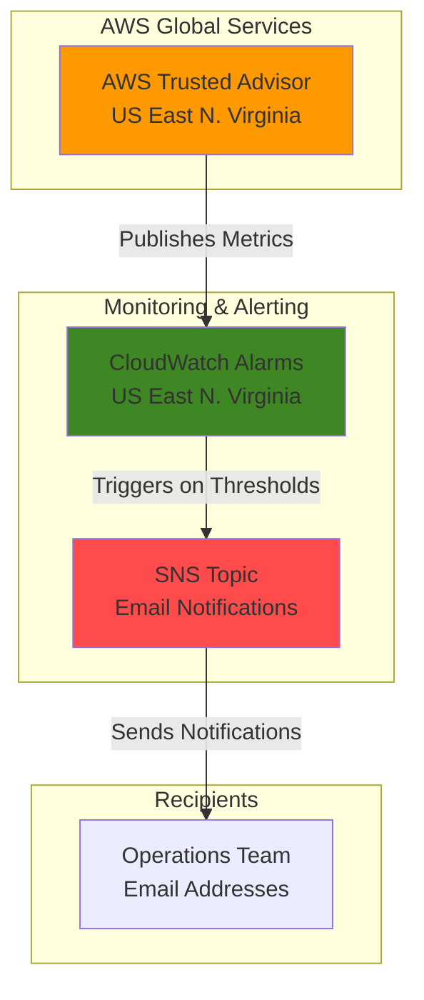

# Account Optimization Monitoring with Trusted Advisor and CloudWatch

## Problem

Organizations struggle to proactively monitor their AWS account health and optimization opportunities, often discovering cost savings, security issues, or performance recommendations too late when manual reviews are infrequent. Without automated monitoring of AWS Trusted Advisor checks, teams miss critical alerts about underutilized resources, security vulnerabilities, and service limit approaches that could impact business continuity and increase operational costs.

## Solution

Create an automated monitoring system that leverages AWS Trusted Advisor's built-in optimization checks with CloudWatch alarms and SNS notifications to proactively alert teams when account optimization opportunities arise. This solution monitors Trusted Advisor metrics in real-time, automatically triggering email notifications when cost savings, security improvements, or performance optimizations are identified, enabling immediate action on recommendations.

## Architecture Diagram



## Prerequisites

1. AWS account with Business, Enterprise On-Ramp, or Enterprise Support plan for full Trusted Advisor access
2. AWS CLI v2 installed and configured with appropriate permissions
3. IAM permissions for CloudWatch, SNS, and Trusted Advisor operations
4. Valid email address for receiving optimization alerts  
5. Estimated cost: $0.50-$2.00/month for SNS email notifications (based on alert frequency)

> **Note**: All Trusted Advisor events are only available in the US East (N. Virginia) region, so this recipe must be executed in us-east-1.

## Preparation

AWS Trusted Advisor is a global service that continuously monitors your AWS environment across all regions but publishes all metrics and events exclusively to the US East (N. Virginia) region. This centralized approach ensures consistent monitoring regardless of where your resources are deployed while providing a single point of alert management.

```bash
# Set environment variables for US East region (required for Trusted Advisor)
export AWS_REGION=us-east-1
export AWS_ACCOUNT_ID=$(aws sts get-caller-identity \
    --query Account --output text)

# Generate unique identifier for resources
RANDOM_SUFFIX=$(aws secretsmanager get-random-password \
    --exclude-punctuation --exclude-uppercase \
    --password-length 6 --require-each-included-type \
    --output text --query RandomPassword)

# Set resource names
export SNS_TOPIC_NAME="trusted-advisor-alerts-${RANDOM_SUFFIX}"
export CLOUDWATCH_ALARM_NAME="trusted-advisor-cost-optimization-${RANDOM_SUFFIX}"

echo "✅ Environment configured for Trusted Advisor monitoring in ${AWS_REGION}"
echo "Topic Name: ${SNS_TOPIC_NAME}"
echo "Alarm Name: ${CLOUDWATCH_ALARM_NAME}"
```

## Steps

1. **Set Up SNS Topic for Alert Notifications**:

   Amazon SNS provides a highly available, durable, secure, fully managed pub/sub messaging service that enables you to decouple microservices, distributed systems, and serverless applications. Creating an SNS topic establishes the communication channel that will deliver Trusted Advisor optimization alerts directly to your operations team's email addresses.

   ```bash
   # Create SNS topic for Trusted Advisor notifications
   aws sns create-topic \
       --name ${SNS_TOPIC_NAME} \
       --attributes DisplayName="AWS Account Optimization Alerts"
   
   # Get the topic ARN for later use
   export SNS_TOPIC_ARN=$(aws sns get-topic-attributes \
       --topic-arn arn:aws:sns:${AWS_REGION}:${AWS_ACCOUNT_ID}:${SNS_TOPIC_NAME} \
       --query Attributes.TopicArn --output text)
   
   echo "✅ SNS topic created: ${SNS_TOPIC_ARN}"
   ```

   The SNS topic is now available and ready to distribute notifications. This foundational messaging infrastructure will ensure that optimization recommendations reach the right stakeholders immediately when Trusted Advisor identifies opportunities for improvement.

2. **Subscribe Email Address to SNS Topic**:

   Email subscriptions in SNS provide immediate notification delivery with built-in unsubscribe protection and delivery confirmation. This step establishes the human notification endpoint that will receive actionable alerts about account optimization opportunities discovered by Trusted Advisor.

   ```bash
   # Subscribe your email to the SNS topic (replace with your email)
   read -p "Enter your email address for notifications: " EMAIL_ADDRESS
   
   aws sns subscribe \
       --topic-arn ${SNS_TOPIC_ARN} \
       --protocol email \
       --notification-endpoint ${EMAIL_ADDRESS}
   
   echo "✅ Email subscription created. Check your inbox and confirm the subscription."
   echo "Note: You must confirm the subscription via email before notifications will be delivered."
   ```

   An email confirmation will be sent to the specified address. This two-step verification process ensures that only authorized recipients receive sensitive account optimization information while preventing accidental subscriptions.

3. **Create CloudWatch Alarm for Cost Optimization Checks**:

   CloudWatch alarms monitor Trusted Advisor metrics in real-time and trigger notifications when thresholds are breached. This alarm focuses on the "Low Utilization Amazon EC2 Instances" check, which identifies EC2 instances with low CPU utilization that could be downsized or terminated to reduce costs.

   ```bash
   # Create CloudWatch alarm for cost optimization recommendations
   aws cloudwatch put-metric-alarm \
       --alarm-name ${CLOUDWATCH_ALARM_NAME} \
       --alarm-description "Alert when Trusted Advisor identifies cost optimization opportunities" \
       --metric-name YellowResources \
       --namespace AWS/TrustedAdvisor \
       --statistic Average \
       --period 300 \
       --threshold 1 \
       --comparison-operator GreaterThanOrEqualToThreshold \
       --evaluation-periods 1 \
       --alarm-actions ${SNS_TOPIC_ARN} \
       --dimensions Name=CheckName,Value="Low Utilization Amazon EC2 Instances"
   
   echo "✅ CloudWatch alarm created for EC2 cost optimization monitoring"
   ```

   The alarm is now actively monitoring for underutilized EC2 instances. When Trusted Advisor detects one or more EC2 instances with low utilization (yellow status), the alarm triggers immediately and sends detailed information to your SNS topic for prompt action.

4. **Create Security Monitoring Alarm**:

   Security monitoring through Trusted Advisor helps identify potential vulnerabilities and misconfigurations that could expose your AWS environment to threats. This alarm monitors the "Security Groups - Specific Ports Unrestricted" check, which identifies security groups that allow unrestricted access to specific ports.

   ```bash
   # Create alarm for security recommendations
   export SECURITY_ALARM_NAME="trusted-advisor-security-${RANDOM_SUFFIX}"
   
   aws cloudwatch put-metric-alarm \
       --alarm-name ${SECURITY_ALARM_NAME} \
       --alarm-description "Alert when Trusted Advisor identifies security recommendations" \
       --metric-name RedResources \
       --namespace AWS/TrustedAdvisor \
       --statistic Average \
       --period 300 \
       --threshold 1 \
       --comparison-operator GreaterThanOrEqualToThreshold \
       --evaluation-periods 1 \
       --alarm-actions ${SNS_TOPIC_ARN} \
       --dimensions Name=CheckName,Value="Security Groups - Specific Ports Unrestricted"
   
   echo "✅ Security monitoring alarm created"
   ```

   This alarm provides immediate notification when Trusted Advisor identifies security groups with unrestricted access to common ports, enabling rapid remediation of potential security exposures before they can be exploited.

5. **Create Service Limits Monitoring Alarm**:

   AWS service quotas (formerly called service limits) define the maximum number of resources you can create in your AWS account. Monitoring these limits prevents service disruptions caused by reaching capacity constraints and enables proactive quota increase requests when approaching thresholds.

   ```bash
   # Create alarm for service limit utilization
   export LIMITS_ALARM_NAME="trusted-advisor-limits-${RANDOM_SUFFIX}"
   
   aws cloudwatch put-metric-alarm \
       --alarm-name ${LIMITS_ALARM_NAME} \
       --alarm-description "Alert when service usage approaches limits" \
       --metric-name ServiceLimitUsage \
       --namespace AWS/TrustedAdvisor \
       --statistic Average \
       --period 300 \
       --threshold 80 \
       --comparison-operator GreaterThanThreshold \
       --evaluation-periods 1 \
       --alarm-actions ${SNS_TOPIC_ARN} \
       --dimensions Name=ServiceName,Value=EC2 \
                    Name=ServiceLimit,Value="Running On-Demand EC2 Instances" \
                    Name=Region,Value=${AWS_REGION}
   
   echo "✅ Service limits monitoring alarm created"
   ```

   The alarm monitors EC2 On-Demand instance usage and triggers when utilization exceeds 80% of your quota. This proactive approach prevents service disruptions by alerting you before reaching capacity limits, allowing time to request quota increases through AWS Support.

6. **Verify Trusted Advisor Check Status**:

   Trusted Advisor continuously evaluates your AWS environment and updates check results multiple times daily. Verifying current check status helps understand your account's optimization baseline and confirms that the monitoring system will detect changes when they occur.

   ```bash
   # List available Trusted Advisor metrics to verify monitoring coverage
   aws cloudwatch list-metrics \
       --namespace AWS/TrustedAdvisor \
       --metric-name YellowResources \
       --query 'Metrics[?contains(Dimensions[?Name==`CheckName`].Value, `Low Utilization`)]' \
       --output table
   
   # Check current alarm states
   aws cloudwatch describe-alarms \
       --alarm-names ${CLOUDWATCH_ALARM_NAME} ${SECURITY_ALARM_NAME} ${LIMITS_ALARM_NAME} \
       --query 'MetricAlarms[*].[AlarmName,StateValue,StateReason]' \
       --output table
   
   echo "✅ Monitoring configuration verified and active"
   ```

   The monitoring system is now operational and will automatically detect changes in Trusted Advisor check results. All alarms start in the "INSUFFICIENT_DATA" state until Trusted Advisor publishes fresh metrics, which typically occurs within a few hours.

## Validation & Testing

1. **Verify SNS Topic Configuration**:

   ```bash
   # Check SNS topic attributes and subscriptions
   aws sns get-topic-attributes \
       --topic-arn ${SNS_TOPIC_ARN} \
       --query 'Attributes.[DisplayName,SubscriptionsConfirmed,SubscriptionsPending]' \
       --output table
   
   # List topic subscriptions
   aws sns list-subscriptions-by-topic \
       --topic-arn ${SNS_TOPIC_ARN} \
       --query 'Subscriptions[*].[Protocol,Endpoint,SubscriptionArn]' \
       --output table
   ```

   Expected output: Should show confirmed email subscription with valid subscription ARN.

2. **Test Notification Delivery**:

   ```bash
   # Send test notification to verify email delivery
   aws sns publish \
       --topic-arn ${SNS_TOPIC_ARN} \
       --message "Test notification: AWS Account Optimization Monitoring is active" \
       --subject "AWS Trusted Advisor - Test Alert"
   
   echo "✅ Test notification sent. Check your email inbox."
   ```

3. **Verify CloudWatch Alarms Status**:

   ```bash
   # Check detailed alarm configuration
   aws cloudwatch describe-alarms \
       --alarm-names ${CLOUDWATCH_ALARM_NAME} \
       --query 'MetricAlarms[0].[AlarmName,MetricName,Threshold,ComparisonOperator,Dimensions[0].Value]' \
       --output table
   
   # View recent alarm history
   aws cloudwatch describe-alarm-history \
       --alarm-name ${CLOUDWATCH_ALARM_NAME} \
       --max-records 5 \
       --query 'AlarmHistoryItems[*].[Timestamp,HistorySummary]' \
       --output table
   ```

4. **Check Trusted Advisor Metrics Availability**:

   ```bash
   # Verify Trusted Advisor is publishing metrics to CloudWatch
   aws cloudwatch get-metric-statistics \
       --namespace AWS/TrustedAdvisor \
       --metric-name YellowResources \
       --dimensions Name=CheckName,Value="Low Utilization Amazon EC2 Instances" \
       --start-time $(date -u -d '1 day ago' +%Y-%m-%dT%H:%M:%S) \
       --end-time $(date -u +%Y-%m-%dT%H:%M:%S) \
       --period 3600 \
       --statistics Average \
       --query 'Datapoints[*].[Timestamp,Average]' \
       --output table
   ```

## Cleanup

1. **Delete CloudWatch Alarms**:

   ```bash
   # Remove all created CloudWatch alarms
   aws cloudwatch delete-alarms \
       --alarm-names ${CLOUDWATCH_ALARM_NAME} ${SECURITY_ALARM_NAME} ${LIMITS_ALARM_NAME}
   
   echo "✅ CloudWatch alarms deleted"
   ```

2. **Remove SNS Subscriptions and Topic**:

   ```bash
   # Get all subscriptions for the topic
   SUBSCRIPTION_ARNS=$(aws sns list-subscriptions-by-topic \
       --topic-arn ${SNS_TOPIC_ARN} \
       --query 'Subscriptions[*].SubscriptionArn' \
       --output text)
   
   # Unsubscribe all endpoints
   for arn in ${SUBSCRIPTION_ARNS}; do
       if [ "$arn" != "PendingConfirmation" ]; then
           aws sns unsubscribe --subscription-arn ${arn}
       fi
   done
   
   # Delete SNS topic
   aws sns delete-topic --topic-arn ${SNS_TOPIC_ARN}
   
   echo "✅ SNS topic and subscriptions removed"
   ```

3. **Clean Up Environment Variables**:

   ```bash
   # Remove environment variables
   unset SNS_TOPIC_NAME
   unset SNS_TOPIC_ARN
   unset CLOUDWATCH_ALARM_NAME
   unset SECURITY_ALARM_NAME
   unset LIMITS_ALARM_NAME
   unset RANDOM_SUFFIX
   
   echo "✅ Environment variables cleaned up"
   ```

## Discussion

This monitoring solution leverages AWS Trusted Advisor's comprehensive account optimization checks to create a proactive alerting system that helps teams maintain healthy, cost-effective AWS environments. By integrating Trusted Advisor with CloudWatch and SNS, organizations can automatically detect and respond to optimization opportunities without manual intervention.

AWS Trusted Advisor performs continuous monitoring across five key pillars: Cost Optimization, Performance, Security, Fault Tolerance, and Service Limits. The service evaluates your AWS environment against AWS best practices and publishes metrics to CloudWatch whenever check statuses change. This integration enables real-time alerting on critical findings such as underutilized resources, security vulnerabilities, and approaching service quotas. The automated nature of this solution ensures that optimization opportunities are identified immediately rather than during periodic manual reviews.

The solution demonstrates the AWS Well-Architected Framework's Operational Excellence pillar by automating operations and monitoring systems to deliver business value. CloudWatch alarms provide reliable, scalable monitoring infrastructure that can handle high-frequency metric evaluations without manual oversight. SNS ensures that notifications reach stakeholders immediately, enabling rapid response to optimization recommendations. This approach follows cloud-native monitoring patterns that scale automatically with your AWS environment growth.

Implementation considerations include understanding that Trusted Advisor requires Business, Enterprise On-Ramp, or Enterprise Support plans for full functionality, and all events are published exclusively to the US East (N. Virginia) region regardless of where your resources are deployed. Organizations should customize alarm thresholds based on their operational requirements and establish clear escalation procedures for different types of optimization recommendations.

> **Tip**: Configure multiple SNS subscriptions for different stakeholder groups (operations, security, finance) to ensure optimization recommendations reach the appropriate teams for fast resolution.

For comprehensive implementation guidance, reference the [AWS Trusted Advisor User Guide](https://docs.aws.amazon.com/awssupport/latest/user/trusted-advisor.html), [CloudWatch Monitoring Documentation](https://docs.aws.amazon.com/AmazonCloudWatch/latest/monitoring/cloudwatch-ta.html), [SNS Developer Guide](https://docs.aws.amazon.com/sns/latest/dg/welcome.html), [AWS Cost Optimization Best Practices](https://docs.aws.amazon.com/awssupport/latest/user/cost-optimization-checks.html), and [AWS Well-Architected Framework](https://docs.aws.amazon.com/wellarchitected/latest/framework/welcome.html).

## Challenge

Extend this solution by implementing these enhancements:

1. **Multi-Check Monitoring**: Create additional alarms for other important Trusted Advisor checks like "IAM Access Key Rotation", "Amazon RDS Security Group Access Risk", and "Amazon S3 Bucket Permissions" to provide comprehensive account monitoring coverage.

2. **Automated Remediation**: Implement Lambda functions triggered by SNS notifications that automatically remediate common optimization findings, such as deleting unattached EBS volumes or stopping underutilized EC2 instances after business hours.

3. **Cost Impact Analysis**: Integrate with AWS Cost Explorer APIs to quantify the financial impact of optimization recommendations and prioritize actions based on potential savings amounts.

4. **Dashboard Visualization**: Create CloudWatch dashboards that display Trusted Advisor metrics trends over time, enabling teams to track optimization improvements and identify recurring issues across different AWS services.

5. **Cross-Account Monitoring**: Extend the solution to monitor Trusted Advisor findings across multiple AWS accounts using AWS Organizations integration and centralized alerting for enterprise-wide optimization management.

## Infrastructure Code

### Available Infrastructure as Code:

- [Infrastructure Code Overview](code/README.md) - Detailed description of all infrastructure components
- [AWS CDK (Python)](code/cdk-python/) - AWS CDK Python implementation
- [AWS CDK (TypeScript)](code/cdk-typescript/) - AWS CDK TypeScript implementation
- [CloudFormation](code/cloudformation.yaml) - AWS CloudFormation template
- [Bash CLI Scripts](code/scripts/) - Example bash scripts using AWS CLI commands to deploy infrastructure
- [Terraform](code/terraform/) - Terraform configuration files