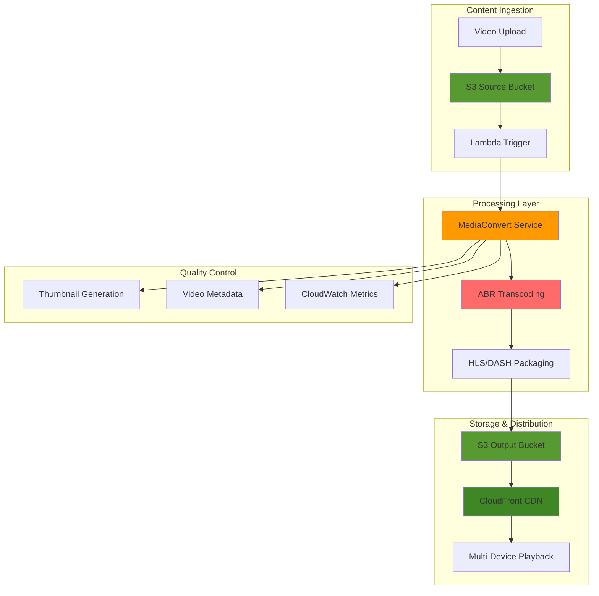

# Adaptive Bitrate Video Streaming with CloudFront

## Problem

Video streaming services need to deliver consistent viewing experiences across devices with varying screen sizes, processing capabilities, and network conditions. Static bitrate videos cause buffering on slower connections and waste bandwidth on faster ones, leading to poor user experiences, increased churn, and higher content delivery costs. Traditional solutions require complex infrastructure management and manual encoding for multiple formats.

## Solution

Create an automated adaptive bitrate (ABR) streaming solution using AWS Elemental MediaConvert to transcode videos into multiple bitrates and resolutions, package them for HLS and DASH delivery, and distribute globally through CloudFront. This approach automatically adjusts video quality based on viewer conditions while optimizing bandwidth usage and maintaining seamless playback experiences.

## Architecture Diagram



## Prerequisites

1. AWS account with appropriate permissions for MediaConvert, S3, CloudFront, Lambda, and IAM
2. AWS CLI v2 installed and configured (or AWS CloudShell)
3. Understanding of video encoding concepts (bitrate, resolution, codecs)
4. Knowledge of adaptive streaming protocols (HLS, DASH)
5. Basic familiarity with AWS Lambda and S3 events
6. Estimated cost: $10-30 for testing (varies by video duration and output formats)

## Preparation

```bash
# Set environment variables
export AWS_REGION=$(aws configure get region)
export AWS_ACCOUNT_ID=$(aws sts get-caller-identity \
    --query Account --output text)

# Generate unique identifiers for resources
RANDOM_SUFFIX=$(aws secretsmanager get-random-password \
    --exclude-punctuation --exclude-uppercase \
    --password-length 6 --require-each-included-type \
    --output text --query RandomPassword)

export SOURCE_BUCKET="video-source-${RANDOM_SUFFIX}"
export OUTPUT_BUCKET="video-abr-output-${RANDOM_SUFFIX}"
export LAMBDA_FUNCTION="video-abr-processor-${RANDOM_SUFFIX}"
export MEDIACONVERT_ROLE="MediaConvertABRRole-${RANDOM_SUFFIX}"
export JOB_TEMPLATE="ABRStreamingTemplate-${RANDOM_SUFFIX}"

# Create S3 buckets for source and output content
aws s3 mb s3://${SOURCE_BUCKET} --region ${AWS_REGION}
aws s3 mb s3://${OUTPUT_BUCKET} --region ${AWS_REGION}

# Enable CORS on output bucket for web playback
cat > cors-config.json << EOF
{
    "CORSRules": [
        {
            "AllowedOrigins": ["*"],
            "AllowedHeaders": ["*"],
            "AllowedMethods": ["GET", "HEAD"],
            "MaxAgeSeconds": 3000
        }
    ]
}
EOF

aws s3api put-bucket-cors \
    --bucket ${OUTPUT_BUCKET} \
    --cors-configuration file://cors-config.json

echo "✅ Created S3 buckets and configured CORS for streaming"
```

## Steps

1. **Create IAM Role for MediaConvert**:

   MediaConvert requires an IAM role to access your S3 buckets for reading source videos and writing transcoded outputs. This role implements least privilege access, granting only the specific S3 permissions needed for video processing while maintaining security boundaries.

   ```bash
   # Create trust policy for MediaConvert
   cat > mediaconvert-trust-policy.json << EOF
   {
       "Version": "2012-10-17",
       "Statement": [
           {
               "Effect": "Allow",
               "Principal": {
                   "Service": "mediaconvert.amazonaws.com"
               },
               "Action": "sts:AssumeRole"
           }
       ]
   }
   EOF
   
   # Create MediaConvert service role
   aws iam create-role \
       --role-name ${MEDIACONVERT_ROLE} \
       --assume-role-policy-document file://mediaconvert-trust-policy.json
   
   # Create policy for S3 access
   cat > mediaconvert-s3-policy.json << EOF
   {
       "Version": "2012-10-17",
       "Statement": [
           {
               "Effect": "Allow",
               "Action": [
                   "s3:GetObject",
                   "s3:PutObject",
                   "s3:DeleteObject",
                   "s3:ListBucket",
                   "s3:GetBucketLocation"
               ],
               "Resource": [
                   "arn:aws:s3:::${SOURCE_BUCKET}",
                   "arn:aws:s3:::${SOURCE_BUCKET}/*",
                   "arn:aws:s3:::${OUTPUT_BUCKET}",
                   "arn:aws:s3:::${OUTPUT_BUCKET}/*"
               ]
           }
       ]
   }
   EOF
   
   # Attach S3 policy to MediaConvert role
   aws iam put-role-policy \
       --role-name ${MEDIACONVERT_ROLE} \
       --policy-name S3AccessPolicy \
       --policy-document file://mediaconvert-s3-policy.json
   
   # Get MediaConvert role ARN
   MEDIACONVERT_ROLE_ARN=$(aws iam get-role \
       --role-name ${MEDIACONVERT_ROLE} \
       --query Role.Arn --output text)
   
   export MEDIACONVERT_ROLE_ARN
   
   echo "✅ Created MediaConvert IAM role: ${MEDIACONVERT_ROLE_ARN}"
   ```

   The IAM role configuration allows MediaConvert to securely access your S3 buckets without exposing long-term credentials. The trust policy ensures only the MediaConvert service can assume this role, while the S3 policy grants precisely the permissions needed for video transcoding operations.

   > **Note**: For production environments, consider using more restrictive S3 policies that limit access to specific bucket paths. See [IAM Security Best Practices](https://docs.aws.amazon.com/IAM/latest/UserGuide/best-practices.html).

2. **Get MediaConvert Endpoint**:

   MediaConvert uses customer-specific endpoints that are assigned per AWS account and region. This endpoint discovery is essential because MediaConvert API calls must target your specific endpoint rather than the generic regional endpoint used by other AWS services.

   ```bash
   # Get MediaConvert endpoint for the region
   MEDIACONVERT_ENDPOINT=$(aws mediaconvert describe-endpoints \
       --region ${AWS_REGION} \
       --query Endpoints[0].Url --output text)
   
   export MEDIACONVERT_ENDPOINT
   
   echo "✅ MediaConvert endpoint: ${MEDIACONVERT_ENDPOINT}"
   ```

   The endpoint URL uniquely identifies your MediaConvert service instance and must be used for all subsequent API calls. This customer-specific endpoint ensures proper routing and isolation of your transcoding jobs within the MediaConvert infrastructure.

3. **Create Comprehensive ABR Job Template**:

   Adaptive bitrate streaming enables seamless video playback by providing multiple quality variants that automatically adjust based on network conditions and device capabilities. This MediaConvert job template creates a comprehensive ABR ladder with QVBR (Quality-defined Variable Bitrate) encoding, which optimizes visual quality while maintaining target bitrates. The template generates both HLS and DASH outputs for maximum device compatibility across all streaming platforms.

   ```bash
   # Create job template with multiple bitrate outputs
   cat > abr-job-template.json << EOF
   {
       "Name": "${JOB_TEMPLATE}",
       "Description": "Adaptive bitrate streaming template with HLS and DASH outputs",
       "Settings": {
           "OutputGroups": [
               {
                   "Name": "HLS_ABR_Package",
                   "OutputGroupSettings": {
                       "Type": "HLS_GROUP_SETTINGS",
                       "HlsGroupSettings": {
                           "Destination": "s3://${OUTPUT_BUCKET}/hls/",
                           "HlsCdnSettings": {
                               "HlsBasicPutSettings": {
                                   "ConnectionRetryInterval": 1,
                                   "FilecacheDuration": 300,
                                   "NumRetries": 10
                               }
                           },
                           "ManifestDurationFormat": "FLOATING_POINT",
                           "OutputSelection": "MANIFESTS_AND_SEGMENTS",
                           "SegmentControl": "SEGMENTED_FILES",
                           "SegmentLength": 6,
                           "TimedMetadataId3Frame": "PRIV",
                           "TimedMetadataId3Period": 10,
                           "MinSegmentLength": 0,
                           "DirectoryStructure": "SINGLE_DIRECTORY"
                       }
                   },
                   "Outputs": [
                       {
                           "NameModifier": "_1080p",
                           "ContainerSettings": {
                               "Container": "M3U8",
                               "M3u8Settings": {
                                   "PcrControl": "PCR_EVERY_PES_PACKET",
                                   "PmtPid": 480,
                                   "PrivateMetadataPid": 503,
                                   "ProgramNumber": 1,
                                   "PatInterval": 0,
                                   "PmtInterval": 0,
                                   "VideoPid": 481,
                                   "AudioPids": [482, 483, 484, 485, 486, 487, 488, 489, 490, 491, 492]
                               }
                           },
                           "VideoDescription": {
                               "Width": 1920,
                               "Height": 1080,
                               "CodecSettings": {
                                   "Codec": "H_264",
                                   "H264Settings": {
                                       "RateControlMode": "QVBR",
                                       "QvbrSettings": {
                                           "QvbrQualityLevel": 8
                                       },
                                       "MaxBitrate": 5000000,
                                       "FramerateControl": "INITIALIZE_FROM_SOURCE",
                                       "GopClosedCadence": 1,
                                       "GopSize": 90,
                                       "GopSizeUnits": "FRAMES",
                                       "ParControl": "INITIALIZE_FROM_SOURCE",
                                       "QualityTuningLevel": "SINGLE_PASS",
                                       "SceneChangeDetect": "ENABLED"
                                   }
                               }
                           },
                           "AudioDescriptions": [
                               {
                                   "AudioTypeControl": "FOLLOW_INPUT",
                                   "CodecSettings": {
                                       "Codec": "AAC",
                                       "AacSettings": {
                                           "Bitrate": 128000,
                                           "CodingMode": "CODING_MODE_2_0",
                                           "SampleRate": 48000
                                       }
                                   }
                               }
                           ]
                       },
                       {
                           "NameModifier": "_720p",
                           "ContainerSettings": {
                               "Container": "M3U8",
                               "M3u8Settings": {
                                   "PcrControl": "PCR_EVERY_PES_PACKET",
                                   "PmtPid": 480,
                                   "PrivateMetadataPid": 503,
                                   "ProgramNumber": 1,
                                   "PatInterval": 0,
                                   "PmtInterval": 0,
                                   "VideoPid": 481,
                                   "AudioPids": [482, 483, 484, 485, 486, 487, 488, 489, 490, 491, 492]
                               }
                           },
                           "VideoDescription": {
                               "Width": 1280,
                               "Height": 720,
                               "CodecSettings": {
                                   "Codec": "H_264",
                                   "H264Settings": {
                                       "RateControlMode": "QVBR",
                                       "QvbrSettings": {
                                           "QvbrQualityLevel": 7
                                       },
                                       "MaxBitrate": 3000000,
                                       "FramerateControl": "INITIALIZE_FROM_SOURCE",
                                       "GopClosedCadence": 1,
                                       "GopSize": 90,
                                       "GopSizeUnits": "FRAMES",
                                       "ParControl": "INITIALIZE_FROM_SOURCE",
                                       "QualityTuningLevel": "SINGLE_PASS",
                                       "SceneChangeDetect": "ENABLED"
                                   }
                               }
                           },
                           "AudioDescriptions": [
                               {
                                   "AudioTypeControl": "FOLLOW_INPUT",
                                   "CodecSettings": {
                                       "Codec": "AAC",
                                       "AacSettings": {
                                           "Bitrate": 128000,
                                           "CodingMode": "CODING_MODE_2_0",
                                           "SampleRate": 48000
                                       }
                                   }
                               }
                           ]
                       },
                       {
                           "NameModifier": "_480p",
                           "ContainerSettings": {
                               "Container": "M3U8",
                               "M3u8Settings": {
                                   "PcrControl": "PCR_EVERY_PES_PACKET",
                                   "PmtPid": 480,
                                   "PrivateMetadataPid": 503,
                                   "ProgramNumber": 1,
                                   "PatInterval": 0,
                                   "PmtInterval": 0,
                                   "VideoPid": 481,
                                   "AudioPids": [482, 483, 484, 485, 486, 487, 488, 489, 490, 491, 492]
                               }
                           },
                           "VideoDescription": {
                               "Width": 854,
                               "Height": 480,
                               "CodecSettings": {
                                   "Codec": "H_264",
                                   "H264Settings": {
                                       "RateControlMode": "QVBR",
                                       "QvbrSettings": {
                                           "QvbrQualityLevel": 6
                                       },
                                       "MaxBitrate": 1500000,
                                       "FramerateControl": "INITIALIZE_FROM_SOURCE",
                                       "GopClosedCadence": 1,
                                       "GopSize": 90,
                                       "GopSizeUnits": "FRAMES",
                                       "ParControl": "INITIALIZE_FROM_SOURCE",
                                       "QualityTuningLevel": "SINGLE_PASS",
                                       "SceneChangeDetect": "ENABLED"
                                   }
                               }
                           },
                           "AudioDescriptions": [
                               {
                                   "AudioTypeControl": "FOLLOW_INPUT",
                                   "CodecSettings": {
                                       "Codec": "AAC",
                                       "AacSettings": {
                                           "Bitrate": 96000,
                                           "CodingMode": "CODING_MODE_2_0",
                                           "SampleRate": 48000
                                       }
                                   }
                               }
                           ]
                       },
                       {
                           "NameModifier": "_360p",
                           "ContainerSettings": {
                               "Container": "M3U8",
                               "M3u8Settings": {
                                   "PcrControl": "PCR_EVERY_PES_PACKET",
                                   "PmtPid": 480,
                                   "PrivateMetadataPid": 503,
                                   "ProgramNumber": 1,
                                   "PatInterval": 0,
                                   "PmtInterval": 0,
                                   "VideoPid": 481,
                                   "AudioPids": [482, 483, 484, 485, 486, 487, 488, 489, 490, 491, 492]
                               }
                           },
                           "VideoDescription": {
                               "Width": 640,
                               "Height": 360,
                               "CodecSettings": {
                                   "Codec": "H_264",
                                   "H264Settings": {
                                       "RateControlMode": "QVBR",
                                       "QvbrSettings": {
                                           "QvbrQualityLevel": 5
                                       },
                                       "MaxBitrate": 800000,
                                       "FramerateControl": "INITIALIZE_FROM_SOURCE",
                                       "GopClosedCadence": 1,
                                       "GopSize": 90,
                                       "GopSizeUnits": "FRAMES",
                                       "ParControl": "INITIALIZE_FROM_SOURCE",
                                       "QualityTuningLevel": "SINGLE_PASS",
                                       "SceneChangeDetect": "ENABLED"
                                   }
                               }
                           },
                           "AudioDescriptions": [
                               {
                                   "AudioTypeControl": "FOLLOW_INPUT",
                                   "CodecSettings": {
                                       "Codec": "AAC",
                                       "AacSettings": {
                                           "Bitrate": 64000,
                                           "CodingMode": "CODING_MODE_2_0",
                                           "SampleRate": 48000
                                       }
                                   }
                               }
                           ]
                       }
                   ]
               },
               {
                   "Name": "DASH_ABR_Package",
                   "OutputGroupSettings": {
                       "Type": "DASH_ISO_GROUP_SETTINGS",
                       "DashIsoGroupSettings": {
                           "Destination": "s3://${OUTPUT_BUCKET}/dash/",
                           "FragmentLength": 2,
                           "SegmentControl": "SEGMENTED_FILES",
                           "SegmentLength": 30,
                           "MpdProfile": "ON_DEMAND_PROFILE",
                           "HbbtvCompliance": "NONE"
                       }
                   },
                   "Outputs": [
                       {
                           "NameModifier": "_dash_1080p",
                           "ContainerSettings": {
                               "Container": "MP4",
                               "Mp4Settings": {
                                   "CslgAtom": "INCLUDE",
                                   "FreeSpaceBox": "EXCLUDE",
                                   "MoovPlacement": "PROGRESSIVE_DOWNLOAD"
                               }
                           },
                           "VideoDescription": {
                               "Width": 1920,
                               "Height": 1080,
                               "CodecSettings": {
                                   "Codec": "H_264",
                                   "H264Settings": {
                                       "RateControlMode": "QVBR",
                                       "QvbrSettings": {
                                           "QvbrQualityLevel": 8
                                       },
                                       "MaxBitrate": 5000000,
                                       "FramerateControl": "INITIALIZE_FROM_SOURCE",
                                       "GopClosedCadence": 1,
                                       "GopSize": 90,
                                       "GopSizeUnits": "FRAMES",
                                       "ParControl": "INITIALIZE_FROM_SOURCE",
                                       "QualityTuningLevel": "SINGLE_PASS",
                                       "SceneChangeDetect": "ENABLED"
                                   }
                               }
                           },
                           "AudioDescriptions": [
                               {
                                   "AudioTypeControl": "FOLLOW_INPUT",
                                   "CodecSettings": {
                                       "Codec": "AAC",
                                       "AacSettings": {
                                           "Bitrate": 128000,
                                           "CodingMode": "CODING_MODE_2_0",
                                           "SampleRate": 48000
                                       }
                                   }
                               }
                           ]
                       },
                       {
                           "NameModifier": "_dash_720p",
                           "ContainerSettings": {
                               "Container": "MP4",
                               "Mp4Settings": {
                                   "CslgAtom": "INCLUDE",
                                   "FreeSpaceBox": "EXCLUDE",
                                   "MoovPlacement": "PROGRESSIVE_DOWNLOAD"
                               }
                           },
                           "VideoDescription": {
                               "Width": 1280,
                               "Height": 720,
                               "CodecSettings": {
                                   "Codec": "H_264",
                                   "H264Settings": {
                                       "RateControlMode": "QVBR",
                                       "QvbrSettings": {
                                           "QvbrQualityLevel": 7
                                       },
                                       "MaxBitrate": 3000000,
                                       "FramerateControl": "INITIALIZE_FROM_SOURCE",
                                       "GopClosedCadence": 1,
                                       "GopSize": 90,
                                       "GopSizeUnits": "FRAMES",
                                       "ParControl": "INITIALIZE_FROM_SOURCE",
                                       "QualityTuningLevel": "SINGLE_PASS",
                                       "SceneChangeDetect": "ENABLED"
                                   }
                               }
                           },
                           "AudioDescriptions": [
                               {
                                   "AudioTypeControl": "FOLLOW_INPUT",
                                   "CodecSettings": {
                                       "Codec": "AAC",
                                       "AacSettings": {
                                           "Bitrate": 128000,
                                           "CodingMode": "CODING_MODE_2_0",
                                           "SampleRate": 48000
                                       }
                                   }
                               }
                           ]
                       }
                   ]
               },
               {
                   "Name": "Thumbnail_Output",
                   "OutputGroupSettings": {
                       "Type": "FILE_GROUP_SETTINGS",
                       "FileGroupSettings": {
                           "Destination": "s3://${OUTPUT_BUCKET}/thumbnails/"
                       }
                   },
                   "Outputs": [
                       {
                           "NameModifier": "_thumb_%04d",
                           "ContainerSettings": {
                               "Container": "RAW"
                           },
                           "VideoDescription": {
                               "Width": 1280,
                               "Height": 720,
                               "CodecSettings": {
                                   "Codec": "FRAME_CAPTURE",
                                   "FrameCaptureSettings": {
                                       "FramerateNumerator": 1,
                                       "FramerateDenominator": 10,
                                       "MaxCaptures": 10,
                                       "Quality": 80
                                   }
                               }
                           }
                       }
                   ]
               }
           ],
           "Inputs": [
               {
                   "FileInput": "s3://${SOURCE_BUCKET}/",
                   "AudioSelectors": {
                       "Audio Selector 1": {
                           "Tracks": [1],
                           "DefaultSelection": "DEFAULT"
                       }
                   },
                   "VideoSelector": {
                       "ColorSpace": "FOLLOW"
                   },
                   "TimecodeSource": "EMBEDDED"
               }
           ]
       }
   }
   EOF
   
   # Create the job template in MediaConvert
   aws mediaconvert create-job-template \
       --endpoint-url ${MEDIACONVERT_ENDPOINT} \
       --cli-input-json file://abr-job-template.json
   
   echo "✅ Created comprehensive ABR job template: ${JOB_TEMPLATE}"
   
   # The job template defines multiple quality variants for adaptive streaming
   # QVBR encoding optimizes quality while maintaining target bitrates
   # Template supports both HLS and DASH output formats for maximum compatibility
   ```

   The ABR template creates four quality levels (360p to 1080p) with optimized bitrates that follow industry best practices. Each variant uses H.264 encoding with progressive quality settings and appropriate audio bitrates, ensuring smooth switching between quality levels during playback.

   > **Tip**: Adjust quality levels and bitrates based on your content type. Sports content may need higher bitrates, while talking-head videos can use lower settings. Learn more about [MediaConvert encoding optimization](https://docs.aws.amazon.com/mediaconvert/latest/ug/working-with-job-templates.html).

4. **Create Lambda Function for Video Processing**:

   ```bash
   # Create Lambda function code for ABR processing
   cat > lambda_function.py << 'EOF'
   import json
   import boto3
   import os
   from urllib.parse import unquote_plus
   
   def lambda_handler(event, context):
       # Initialize MediaConvert client
       mediaconvert = boto3.client('mediaconvert', 
           endpoint_url=os.environ['MEDIACONVERT_ENDPOINT'])
       
       # Process S3 event
       for record in event['Records']:
           bucket = record['s3']['bucket']['name']
           key = unquote_plus(record['s3']['object']['key'])
           
           # Only process video files
           video_extensions = ('.mp4', '.mov', '.avi', '.mkv', '.mxf', '.mts', '.m2ts')
           if not key.lower().endswith(video_extensions):
               print(f"Skipping non-video file: {key}")
               continue
           
           # Extract filename without extension for output naming
           file_name = key.split('/')[-1].split('.')[0]
           
           # Create MediaConvert job for ABR processing
           job_settings = {
               "JobTemplate": os.environ['JOB_TEMPLATE'],
               "Role": os.environ['MEDIACONVERT_ROLE_ARN'],
               "Settings": {
                   "Inputs": [
                       {
                           "FileInput": f"s3://{bucket}/{key}",
                           "AudioSelectors": {
                               "Audio Selector 1": {
                                   "Tracks": [1],
                                   "DefaultSelection": "DEFAULT"
                               }
                           },
                           "VideoSelector": {
                               "ColorSpace": "FOLLOW"
                           },
                           "TimecodeSource": "EMBEDDED"
                       }
                   ],
                   "OutputGroups": [
                       {
                           "OutputGroupSettings": {
                               "Type": "HLS_GROUP_SETTINGS",
                               "HlsGroupSettings": {
                                   "Destination": f"s3://{os.environ['OUTPUT_BUCKET']}/hls/{file_name}/"
                               }
                           }
                       },
                       {
                           "OutputGroupSettings": {
                               "Type": "DASH_ISO_GROUP_SETTINGS", 
                               "DashIsoGroupSettings": {
                                   "Destination": f"s3://{os.environ['OUTPUT_BUCKET']}/dash/{file_name}/"
                               }
                           }
                       },
                       {
                           "OutputGroupSettings": {
                               "Type": "FILE_GROUP_SETTINGS",
                               "FileGroupSettings": {
                                   "Destination": f"s3://{os.environ['OUTPUT_BUCKET']}/thumbnails/{file_name}/"
                               }
                           }
                       }
                   ]
               },
               "StatusUpdateInterval": "SECONDS_60",
               "UserMetadata": {
                   "SourceFile": key,
                   "ProcessingType": "ABR_Streaming"
               }
           }
           
           try:
               response = mediaconvert.create_job(**job_settings)
               job_id = response['Job']['Id']
               
               print(f"Created ABR processing job {job_id} for {key}")
               
               return {
                   'statusCode': 200,
                   'body': json.dumps({
                       'message': f'Successfully started ABR processing job {job_id}',
                       'jobId': job_id,
                       'sourceFile': key,
                       'hlsOutput': f"s3://{os.environ['OUTPUT_BUCKET']}/hls/{file_name}/",
                       'dashOutput': f"s3://{os.environ['OUTPUT_BUCKET']}/dash/{file_name}/"
                   })
               }
           except Exception as e:
               print(f"Error creating MediaConvert job: {str(e)}")
               return {
                   'statusCode': 500,
                   'body': json.dumps({
                       'error': str(e),
                       'sourceFile': key
                   })
               }
   EOF
   
   # Create deployment package
   zip lambda-abr-function.zip lambda_function.py
   
   # Create Lambda execution role
   cat > lambda-trust-policy.json << EOF
   {
       "Version": "2012-10-17",
       "Statement": [
           {
               "Effect": "Allow",
               "Principal": {
                   "Service": "lambda.amazonaws.com"
               },
               "Action": "sts:AssumeRole"
           }
       ]
   }
   EOF
   
   # Create Lambda role
   aws iam create-role \
       --role-name ${LAMBDA_FUNCTION}-role \
       --assume-role-policy-document file://lambda-trust-policy.json
   
   # Attach basic execution policy
   aws iam attach-role-policy \
       --role-name ${LAMBDA_FUNCTION}-role \
       --policy-arn arn:aws:iam::aws:policy/service-role/AWSLambdaBasicExecutionRole
   
   # Create policy for MediaConvert access
   cat > lambda-mediaconvert-policy.json << EOF
   {
       "Version": "2012-10-17",
       "Statement": [
           {
               "Effect": "Allow",
               "Action": [
                   "mediaconvert:CreateJob",
                   "mediaconvert:GetJob",
                   "mediaconvert:ListJobs",
                   "mediaconvert:GetJobTemplate"
               ],
               "Resource": "*"
           },
           {
               "Effect": "Allow",
               "Action": [
                   "iam:PassRole"
               ],
               "Resource": "${MEDIACONVERT_ROLE_ARN}"
           }
       ]
   }
   EOF
   
   # Attach MediaConvert policy
   aws iam put-role-policy \
       --role-name ${LAMBDA_FUNCTION}-role \
       --policy-name MediaConvertAccessPolicy \
       --policy-document file://lambda-mediaconvert-policy.json
   
   # Get Lambda role ARN
   LAMBDA_ROLE_ARN=$(aws iam get-role \
       --role-name ${LAMBDA_FUNCTION}-role \
       --query Role.Arn --output text)
   
   # Wait for role propagation
   sleep 10
   
   # Create Lambda function
   aws lambda create-function \
       --function-name ${LAMBDA_FUNCTION} \
       --runtime python3.9 \
       --role ${LAMBDA_ROLE_ARN} \
       --handler lambda_function.lambda_handler \
       --zip-file fileb://lambda-abr-function.zip \
       --timeout 300 \
       --environment Variables="{MEDIACONVERT_ENDPOINT=${MEDIACONVERT_ENDPOINT},JOB_TEMPLATE=${JOB_TEMPLATE},MEDIACONVERT_ROLE_ARN=${MEDIACONVERT_ROLE_ARN},OUTPUT_BUCKET=${OUTPUT_BUCKET}}"
   
   echo "✅ Created Lambda function for ABR processing: ${LAMBDA_FUNCTION}"
   
   # Lambda automatically triggers MediaConvert jobs when videos are uploaded
   # The function extracts metadata and configures output paths dynamically
   # Environment variables store MediaConvert configuration for reusability
   ```

5. **Configure S3 Event Notification**:

   ```bash
   # Add permission for S3 to invoke Lambda
   aws lambda add-permission \
       --function-name ${LAMBDA_FUNCTION} \
       --principal s3.amazonaws.com \
       --statement-id s3-video-trigger \
       --action lambda:InvokeFunction \
       --source-arn arn:aws:s3:::${SOURCE_BUCKET}
   
   # Create S3 notification configuration for video files
   cat > s3-video-notification.json << EOF
   {
       "LambdaConfigurations": [
           {
               "Id": "VideoABRProcessingTrigger",
               "LambdaFunctionArn": "arn:aws:lambda:${AWS_REGION}:${AWS_ACCOUNT_ID}:function:${LAMBDA_FUNCTION}",
               "Events": ["s3:ObjectCreated:*"],
               "Filter": {
                   "Key": {
                       "FilterRules": [
                           {
                               "Name": "suffix",
                               "Value": ".mp4"
                           }
                       ]
                   }
               }
           },
           {
               "Id": "VideoABRProcessingTriggerMOV",
               "LambdaFunctionArn": "arn:aws:lambda:${AWS_REGION}:${AWS_ACCOUNT_ID}:function:${LAMBDA_FUNCTION}",
               "Events": ["s3:ObjectCreated:*"],
               "Filter": {
                   "Key": {
                       "FilterRules": [
                           {
                               "Name": "suffix",
                               "Value": ".mov"
                           }
                       ]
                   }
               }
           }
       ]
   }
   EOF
   
   # Apply notification configuration
   aws s3api put-bucket-notification-configuration \
       --bucket ${SOURCE_BUCKET} \
       --notification-configuration file://s3-video-notification.json
   
   echo "✅ Configured S3 event notifications for video processing"
   
   # S3 events trigger Lambda immediately when video files are uploaded
   # Multiple file format triggers ensure compatibility with various video types
   # Event filtering prevents processing of non-video files
   ```

   > **Warning**: Ensure your source bucket receives only video files to prevent unnecessary Lambda invocations and MediaConvert charges.

6. **Create CloudFront Distribution for Streaming**:

   ```bash
   # Create CloudFront distribution for ABR streaming
   cat > cloudfront-abr-distribution.json << EOF
   {
       "CallerReference": "ABR-Streaming-${RANDOM_SUFFIX}-$(date +%s)",
       "Comment": "Adaptive Bitrate Streaming Distribution",
       "DefaultCacheBehavior": {
           "TargetOriginId": "S3-ABR-Output",
           "ViewerProtocolPolicy": "redirect-to-https",
           "CachePolicyId": "4135ea2d-6df8-44a3-9df3-4b5a84be39ad",
           "Compress": false,
           "AllowedMethods": {
               "Quantity": 2,
               "Items": ["GET", "HEAD"],
               "CachedMethods": {
                   "Quantity": 2,
                   "Items": ["GET", "HEAD"]
               }
           },
           "TrustedSigners": {
               "Enabled": false,
               "Quantity": 0
           },
           "MinTTL": 0,
           "DefaultTTL": 86400,
           "MaxTTL": 31536000
       },
       "Origins": {
           "Quantity": 1,
           "Items": [
               {
                   "Id": "S3-ABR-Output",
                   "DomainName": "${OUTPUT_BUCKET}.s3.${AWS_REGION}.amazonaws.com",
                   "S3OriginConfig": {
                       "OriginAccessIdentity": ""
                   }
               }
           ]
       },
       "CacheBehaviors": {
           "Quantity": 3,
           "Items": [
               {
                   "PathPattern": "*.m3u8",
                   "TargetOriginId": "S3-ABR-Output",
                   "ViewerProtocolPolicy": "redirect-to-https",
                   "CachePolicyId": "4135ea2d-6df8-44a3-9df3-4b5a84be39ad",
                   "Compress": false,
                   "AllowedMethods": {
                       "Quantity": 2,
                       "Items": ["GET", "HEAD"],
                       "CachedMethods": {
                           "Quantity": 2,
                           "Items": ["GET", "HEAD"]
                       }
                   },
                   "TrustedSigners": {
                       "Enabled": false,
                       "Quantity": 0
                   },
                   "MinTTL": 0,
                   "DefaultTTL": 5,
                   "MaxTTL": 60
               },
               {
                   "PathPattern": "*.mpd",
                   "TargetOriginId": "S3-ABR-Output",
                   "ViewerProtocolPolicy": "redirect-to-https",
                   "CachePolicyId": "4135ea2d-6df8-44a3-9df3-4b5a84be39ad",
                   "Compress": false,
                   "AllowedMethods": {
                       "Quantity": 2,
                       "Items": ["GET", "HEAD"],
                       "CachedMethods": {
                           "Quantity": 2,
                           "Items": ["GET", "HEAD"]
                       }
                   },
                   "TrustedSigners": {
                       "Enabled": false,
                       "Quantity": 0
                   },
                   "MinTTL": 0,
                   "DefaultTTL": 5,
                   "MaxTTL": 60
               },
               {
                   "PathPattern": "*.ts",
                   "TargetOriginId": "S3-ABR-Output",
                   "ViewerProtocolPolicy": "redirect-to-https",
                   "CachePolicyId": "4135ea2d-6df8-44a3-9df3-4b5a84be39ad",
                   "Compress": false,
                   "AllowedMethods": {
                       "Quantity": 2,
                       "Items": ["GET", "HEAD"],
                       "CachedMethods": {
                           "Quantity": 2,
                           "Items": ["GET", "HEAD"]
                       }
                   },
                   "TrustedSigners": {
                       "Enabled": false,
                       "Quantity": 0
                   },
                   "MinTTL": 0,
                   "DefaultTTL": 86400,
                   "MaxTTL": 86400
               }
           ]
       },
       "Enabled": true,
       "PriceClass": "PriceClass_All",
       "ViewerCertificate": {
           "CloudFrontDefaultCertificate": true,
           "MinimumProtocolVersion": "TLSv1.2_2021",
           "CertificateSource": "cloudfront"
       },
       "HttpVersion": "http2",
       "IsIPV6Enabled": true
   }
   EOF
   
   # Create CloudFront distribution
   DISTRIBUTION_ID=$(aws cloudfront create-distribution \
       --distribution-config file://cloudfront-abr-distribution.json \
       --query 'Distribution.Id' --output text)
   
   export DISTRIBUTION_ID
   
   # Get distribution domain name
   DISTRIBUTION_DOMAIN=$(aws cloudfront get-distribution \
       --id ${DISTRIBUTION_ID} \
       --query 'Distribution.DomainName' --output text)
   
   export DISTRIBUTION_DOMAIN
   
   echo "✅ Created CloudFront distribution: ${DISTRIBUTION_ID}"
   echo "Distribution domain: ${DISTRIBUTION_DOMAIN}"
   
   # CloudFront provides global content delivery with optimized caching
   # Different cache behaviors for manifests (short TTL) and segments (long TTL)
   # HTTPS redirection ensures secure video delivery
   ```

7. **Create Test Video Player**:

   ```bash
   # Create HTML5 video player with ABR support
   cat > abr-test-player.html << EOF
   <!DOCTYPE html>
   <html lang="en">
   <head>
       <meta charset="UTF-8">
       <meta name="viewport" content="width=device-width, initial-scale=1.0">
       <title>Adaptive Bitrate Streaming Test Player</title>
       <script src="https://vjs.zencdn.net/8.0.4/video.min.js"></script>
       <link href="https://vjs.zencdn.net/8.0.4/video-js.css" rel="stylesheet">
       <script src="https://cdn.jsdelivr.net/npm/videojs-contrib-hls@5.15.0/dist/videojs-contrib-hls.min.js"></script>
       <script src="https://cdn.jsdelivr.net/npm/videojs-contrib-dash@5.1.1/dist/videojs-contrib-dash.min.js"></script>
       <style>
           body {
               font-family: Arial, sans-serif;
               max-width: 1200px;
               margin: 0 auto;
               padding: 20px;
               background: #f5f5f5;
           }
           .container {
               background: white;
               padding: 30px;
               border-radius: 10px;
               box-shadow: 0 2px 10px rgba(0,0,0,0.1);
           }
           .player-wrapper {
               margin: 20px 0;
           }
           .controls {
               display: flex;
               gap: 10px;
               margin: 20px 0;
               flex-wrap: wrap;
           }
           .btn {
               padding: 10px 20px;
               border: none;
               border-radius: 5px;
               cursor: pointer;
               font-weight: bold;
               transition: background-color 0.3s;
           }
           .btn-primary {
               background: #007bff;
               color: white;
           }
           .btn-primary:hover {
               background: #0056b3;
           }
           .btn-secondary {
               background: #6c757d;
               color: white;
           }
           .btn-secondary:hover {
               background: #545b62;
           }
           .stats {
               display: grid;
               grid-template-columns: repeat(auto-fit, minmax(200px, 1fr));
               gap: 15px;
               margin: 20px 0;
           }
           .stat-card {
               background: #f8f9fa;
               padding: 15px;
               border-radius: 8px;
               border-left: 4px solid #007bff;
           }
           .url-input {
               width: 100%;
               padding: 10px;
               margin: 10px 0;
               border: 1px solid #ddd;
               border-radius: 5px;
               font-family: monospace;
           }
           .format-selector {
               margin: 10px 0;
           }
           select {
               padding: 8px 12px;
               border-radius: 5px;
               border: 1px solid #ddd;
               margin-left: 10px;
           }
           .info-panel {
               background: #e9f7ff;
               padding: 15px;
               border-radius: 5px;
               margin: 20px 0;
               border-left: 4px solid #007bff;
           }
       </style>
   </head>
   <body>
       <div class="container">
           <h1>🎥 Adaptive Bitrate Streaming Test Player</h1>
           <p>Test your ABR streaming setup with HLS and DASH playback support</p>
           
           <div class="info-panel">
               <h3>Test URLs</h3>
               <p><strong>HLS Manifest:</strong> https://${DISTRIBUTION_DOMAIN}/hls/[video-name]/index.m3u8</p>
               <p><strong>DASH Manifest:</strong> https://${DISTRIBUTION_DOMAIN}/dash/[video-name]/index.mpd</p>
           </div>
           
           <div class="format-selector">
               <label for="streamFormat">Streaming Format:</label>
               <select id="streamFormat" onchange="updateInputPlaceholder()">
                   <option value="hls">HLS (HTTP Live Streaming)</option>
                   <option value="dash">DASH (Dynamic Adaptive Streaming)</option>
               </select>
           </div>
           
           <input type="text" id="streamUrl" class="url-input" 
                  placeholder="Enter stream URL..." 
                  value="">
           
           <div class="controls">
               <button class="btn btn-primary" onclick="loadStream()">Load Stream</button>
               <button class="btn btn-secondary" onclick="toggleFullscreen()">Fullscreen</button>
               <button class="btn btn-secondary" onclick="toggleMute()">Mute/Unmute</button>
               <button class="btn btn-secondary" onclick="showStats()">Show Stats</button>
           </div>
           
           <div class="player-wrapper">
               <video
                   id="abr-player"
                   class="video-js vjs-default-skin"
                   controls
                   preload="auto"
                   width="1120"
                   height="630"
                   data-setup='{"fluid": true, "responsive": true}'>
                   <p class="vjs-no-js">
                       To view this video please enable JavaScript, and consider upgrading to a web browser that
                       <a href="https://videojs.com/html5-video-support/" target="_blank">supports HTML5 video</a>.
                   </p>
               </video>
           </div>
           
           <div class="stats">
               <div class="stat-card">
                   <h4>Current Bitrate</h4>
                   <p id="currentBitrate">Not available</p>
               </div>
               <div class="stat-card">
                   <h4>Resolution</h4>
                   <p id="currentResolution">Not available</p>
               </div>
               <div class="stat-card">
                   <h4>Buffer Health</h4>
                   <p id="bufferHealth">Not available</p>
               </div>
               <div class="stat-card">
                   <h4>Dropped Frames</h4>
                   <p id="droppedFrames">Not available</p>
               </div>
           </div>
           
           <div class="info-panel">
               <h3>How to Test</h3>
               <ol>
                   <li>Upload a video file (.mp4, .mov) to your source S3 bucket</li>
                   <li>Wait for MediaConvert processing to complete (check AWS Console)</li>
                   <li>Enter the generated HLS or DASH URL in the input field above</li>
                   <li>Click "Load Stream" to test adaptive bitrate playback</li>
               </ol>
           </div>
       </div>
       
       <script>
           const player = videojs('abr-player', {
               html5: {
                   vhs: {
                       enableLowInitialPlaylist: true,
                       experimentalBufferBasedABR: true,
                       useDevicePixelRatio: true
                   }
               },
               playbackRates: [0.5, 1, 1.25, 1.5, 2],
               responsive: true,
               fluid: true
           });
           
           const distributionDomain = "${DISTRIBUTION_DOMAIN}";
           
           function updateInputPlaceholder() {
               const format = document.getElementById('streamFormat').value;
               const urlInput = document.getElementById('streamUrl');
               
               if (format === 'hls') {
                   urlInput.placeholder = \`https://\${distributionDomain}/hls/[video-name]/index.m3u8\`;
               } else {
                   urlInput.placeholder = \`https://\${distributionDomain}/dash/[video-name]/index.mpd\`;
               }
           }
           
           function loadStream() {
               const url = document.getElementById('streamUrl').value;
               const format = document.getElementById('streamFormat').value;
               
               if (!url) {
                   alert('Please enter a stream URL');
                   return;
               }
               
               const mimeType = format === 'hls' ? 'application/x-mpegURL' : 'application/dash+xml';
               
               player.src({
                   src: url,
                   type: mimeType
               });
               
               player.ready(() => {
                   console.log('Stream loaded:', url);
                   updateStats();
               });
           }
           
           function toggleFullscreen() {
               if (player.isFullscreen()) {
                   player.exitFullscreen();
               } else {
                   player.requestFullscreen();
               }
           }
           
           function toggleMute() {
               player.muted(!player.muted());
           }
           
           function showStats() {
               const tech = player.tech();
               if (tech && tech.vhs) {
                   const stats = tech.vhs.stats;
                   alert(\`
                       Bandwidth: \${stats.bandwidth ? (stats.bandwidth / 1000).toFixed(0) + ' kbps' : 'N/A'}
                       Buffer: \${player.bufferedPercent() ? (player.bufferedPercent() * 100).toFixed(1) + '%' : 'N/A'}
                       Resolution: \${player.videoWidth()}x\${player.videoHeight()}
                       Current Time: \${player.currentTime().toFixed(2)}s
                   \`);
               }
           }
           
           function updateStats() {
               const tech = player.tech();
               if (tech && tech.vhs) {
                   const stats = tech.vhs.stats;
                   document.getElementById('currentBitrate').textContent = 
                       stats.bandwidth ? (stats.bandwidth / 1000).toFixed(0) + ' kbps' : 'N/A';
                   document.getElementById('currentResolution').textContent = 
                       player.videoWidth() + 'x' + player.videoHeight();
                   document.getElementById('bufferHealth').textContent = 
                       player.bufferedPercent() ? (player.bufferedPercent() * 100).toFixed(1) + '%' : 'N/A';
                   document.getElementById('droppedFrames').textContent = 
                       stats.droppedVideoFrames || '0';
               }
           }
           
           // Update stats every 2 seconds
           setInterval(updateStats, 2000);
           
           // Initialize placeholder
           updateInputPlaceholder();
           
           // Event listeners
           player.on('error', (e) => {
               console.error('Player error:', e);
               alert('Error loading stream. Please check the URL and try again.');
           });
           
           player.on('loadstart', () => {
               console.log('Stream loading started');
           });
           
           player.on('canplay', () => {
               console.log('Stream ready to play');
               updateStats();
           });
       </script>
   </body>
   </html>
   EOF
   
   # Upload test player to output bucket
   aws s3 cp abr-test-player.html s3://${OUTPUT_BUCKET}/test-player.html \
       --content-type "text/html" \
       --cache-control "max-age=300"
   
   echo "✅ Created ABR test player"
   echo "Test player URL: http://${OUTPUT_BUCKET}.s3-website.${AWS_REGION}.amazonaws.com/test-player.html"
   
   # The test player uses Video.js with HLS and DASH support
   # Real-time statistics show adaptive bitrate switching behavior
   # Quality metrics help validate optimal streaming performance
   ```

8. **Display Setup Information**:

   ```bash
   echo ""
   echo "=================================================="
   echo "ADAPTIVE BITRATE STREAMING SETUP COMPLETE"
   echo "=================================================="
   echo ""
   echo "🎯 UPLOAD INSTRUCTIONS:"
   echo "Upload video files to: s3://${SOURCE_BUCKET}/"
   echo "Supported formats: .mp4, .mov, .avi, .mkv"
   echo ""
   echo "📋 PROCESSING OUTPUTS:"
   echo "HLS Streams: s3://${OUTPUT_BUCKET}/hls/"
   echo "DASH Streams: s3://${OUTPUT_BUCKET}/dash/"
   echo "Thumbnails: s3://${OUTPUT_BUCKET}/thumbnails/"
   echo ""
   echo "🌐 CLOUDFRONT DISTRIBUTION:"
   echo "Domain: ${DISTRIBUTION_DOMAIN}"
   echo "Distribution ID: ${DISTRIBUTION_ID}"
   echo ""
   echo "🎮 TEST PLAYER:"
   echo "URL: http://${OUTPUT_BUCKET}.s3-website.${AWS_REGION}.amazonaws.com/test-player.html"
   echo ""
   echo "📊 MONITORING:"
   echo "Lambda Function: ${LAMBDA_FUNCTION}"
   echo "Job Template: ${JOB_TEMPLATE}"
   echo ""
   echo "⏱️ NEXT STEPS:"
   echo "1. Upload a test video file to the source bucket"
   echo "2. Monitor processing in MediaConvert console"
   echo "3. Test playback using the generated URLs"
   echo "4. Configure CloudFront for production use"
   echo "=================================================="
   ```

## Validation & Testing

1. **Verify Infrastructure Setup**:

   ```bash
   # Check S3 buckets
   aws s3 ls | grep -E "(${SOURCE_BUCKET}|${OUTPUT_BUCKET})"
   
   # Verify Lambda function
   aws lambda get-function --function-name ${LAMBDA_FUNCTION} \
       --query 'Configuration.{FunctionName:FunctionName,Runtime:Runtime,State:State}'
   
   # Check job template
   aws mediaconvert get-job-template \
       --endpoint-url ${MEDIACONVERT_ENDPOINT} \
       --name ${JOB_TEMPLATE} \
       --query 'JobTemplate.{Name:Name,Description:Description}'
   ```

   Expected output: All resources should be created and accessible

2. **Test Video Upload and Processing**:

   ```bash
   # Create a test video file (or use an existing one)
   echo "To test the ABR pipeline:"
   echo "1. Upload a video file to s3://${SOURCE_BUCKET}/"
   echo "2. Monitor the Lambda function logs:"
   echo "   aws logs tail /aws/lambda/${LAMBDA_FUNCTION} --follow"
   echo "3. Check MediaConvert job status:"
   echo "   aws mediaconvert list-jobs --endpoint-url ${MEDIACONVERT_ENDPOINT} --max-results 5"
   ```

3. **Verify ABR Output Generation**:

   ```bash
   # After uploading a test video, check for outputs
   echo "Check for ABR outputs after processing:"
   echo "HLS outputs: aws s3 ls s3://${OUTPUT_BUCKET}/hls/ --recursive"
   echo "DASH outputs: aws s3 ls s3://${OUTPUT_BUCKET}/dash/ --recursive"
   echo "Thumbnails: aws s3 ls s3://${OUTPUT_BUCKET}/thumbnails/ --recursive"
   ```

4. **Test CloudFront Distribution**:

   ```bash
   # Check CloudFront distribution status
   aws cloudfront get-distribution \
       --id ${DISTRIBUTION_ID} \
       --query 'Distribution.{Status:Status,DomainName:DomainName}'
   
   # Test a manifest file access (after processing)
   echo "Test manifest accessibility:"
   echo "curl -I https://${DISTRIBUTION_DOMAIN}/hls/[video-name]/index.m3u8"
   echo "curl -I https://${DISTRIBUTION_DOMAIN}/dash/[video-name]/index.mpd"
   ```

5. **Validate Streaming Quality**:

   ```bash
   # Check generated bitrates and resolutions
   echo "To validate ABR ladder:"
   echo "1. Download and inspect manifest files"
   echo "2. Verify multiple bitrate variants are present"
   echo "3. Test adaptive switching in the web player"
   echo "4. Monitor CloudWatch metrics for MediaConvert jobs"
   ```

## Cleanup

1. **Stop Any Running MediaConvert Jobs**:

   ```bash
   # List and cancel any running jobs
   aws mediaconvert list-jobs \
       --endpoint-url ${MEDIACONVERT_ENDPOINT} \
       --status PROGRESSING \
       --query 'Jobs[].Id' --output text | \
   while read job_id; do
       if [ ! -z "$job_id" ]; then
           aws mediaconvert cancel-job \
               --endpoint-url ${MEDIACONVERT_ENDPOINT} \
               --id $job_id
           echo "Cancelled job: $job_id"
       fi
   done
   ```

2. **Remove S3 Event Notifications**:

   ```bash
   # Clear S3 bucket notifications
   aws s3api put-bucket-notification-configuration \
       --bucket ${SOURCE_BUCKET} \
       --notification-configuration '{}'
   
   echo "✅ Removed S3 event notifications"
   ```

3. **Delete Lambda Function and Role**:

   ```bash
   # Delete Lambda function
   aws lambda delete-function --function-name ${LAMBDA_FUNCTION}
   
   # Delete Lambda role policies
   aws iam delete-role-policy \
       --role-name ${LAMBDA_FUNCTION}-role \
       --policy-name MediaConvertAccessPolicy
   
   # Detach managed policies
   aws iam detach-role-policy \
       --role-name ${LAMBDA_FUNCTION}-role \
       --policy-arn arn:aws:iam::aws:policy/service-role/AWSLambdaBasicExecutionRole
   
   # Delete Lambda role
   aws iam delete-role --role-name ${LAMBDA_FUNCTION}-role
   
   echo "✅ Deleted Lambda function and role"
   ```

4. **Delete MediaConvert Resources**:

   ```bash
   # Delete job template
   aws mediaconvert delete-job-template \
       --endpoint-url ${MEDIACONVERT_ENDPOINT} \
       --name ${JOB_TEMPLATE}
   
   echo "✅ Deleted MediaConvert job template"
   ```

5. **Delete IAM Role**:

   ```bash
   # Delete MediaConvert role policy
   aws iam delete-role-policy \
       --role-name ${MEDIACONVERT_ROLE} \
       --policy-name S3AccessPolicy
   
   # Delete MediaConvert role
   aws iam delete-role --role-name ${MEDIACONVERT_ROLE}
   
   echo "✅ Deleted MediaConvert IAM role"
   ```

6. **Delete CloudFront Distribution**:

   ```bash
   # Get distribution configuration
   aws cloudfront get-distribution-config \
       --id ${DISTRIBUTION_ID} \
       --query 'DistributionConfig' > temp-dist-config.json
   
   # Disable distribution
   cat temp-dist-config.json | jq '.Enabled = false' > disabled-dist-config.json
   
   # Get ETag for update
   ETAG=$(aws cloudfront get-distribution-config \
       --id ${DISTRIBUTION_ID} \
       --query 'ETag' --output text)
   
   # Update distribution to disable
   aws cloudfront update-distribution \
       --id ${DISTRIBUTION_ID} \
       --distribution-config file://disabled-dist-config.json \
       --if-match ${ETAG}
   
   echo "✅ Disabled CloudFront distribution (manual deletion required after propagation)"
   ```

7. **Delete S3 Buckets and Contents**:

   ```bash
   # Delete all objects in buckets
   aws s3 rm s3://${SOURCE_BUCKET} --recursive
   aws s3 rm s3://${OUTPUT_BUCKET} --recursive
   
   # Delete buckets
   aws s3 rb s3://${SOURCE_BUCKET}
   aws s3 rb s3://${OUTPUT_BUCKET}
   
   # Clean up local files
   rm -f *.json *.py *.zip *.html
   
   echo "✅ Deleted S3 buckets and cleaned up local files"
   ```

## Discussion

Adaptive bitrate streaming represents a fundamental shift from traditional static video delivery to intelligent, responsive content distribution that automatically adjusts to viewer conditions. This AWS-based solution leverages [MediaConvert's advanced transcoding capabilities](https://docs.aws.amazon.com/mediaconvert/latest/ug/what-is.html) to create multiple quality variants of each video, enabling seamless playback experiences across diverse devices and network conditions. The [QVBR (Quality-defined Variable Bitrate) encoding approach](https://docs.aws.amazon.com/mediaconvert/latest/ug/qvbr-guidelines.html) ensures optimal quality at each bitrate level while maintaining consistent viewer experiences.

The implementation creates both [HLS and DASH outputs](https://docs.aws.amazon.com/mediaconvert/latest/ug/choosing-your-streaming-output-groups.html) to maximize device compatibility. HLS dominates iOS and Safari environments, while DASH provides broader codec support and more flexible manifest structures for web and Android platforms. The multiple bitrate ladder (360p to 1080p) follows industry best practices, with quality levels spaced approximately 2x apart to provide smooth adaptive switching without excessive overhead.

[CloudFront integration](https://docs.aws.amazon.com/AmazonCloudFront/latest/DeveloperGuide/live-streaming.html) provides global content distribution with intelligent caching strategies optimized for streaming workloads. Manifest files have short cache lifespans to enable rapid quality switching, while video segments are cached longer to reduce origin requests. The CDN's adaptive algorithms automatically route requests to optimal edge locations, reducing latency and improving playback reliability for global audiences.

The serverless architecture ensures cost efficiency and automatic scaling. Lambda functions only execute when videos are uploaded, MediaConvert charges only for actual processing time, and CloudFront operates on a pay-per-request model. This approach eliminates idle infrastructure costs while providing enterprise-scale processing capabilities when needed. This [video-on-demand streaming pattern](https://docs.aws.amazon.com/wellarchitected/latest/streaming-media-lens/scenario-video-on-demand-streaming.html) represents AWS best practices for scalable media delivery.

> **Tip**: Monitor MediaConvert job completion times and adjust the Lambda timeout accordingly. Complex videos with many quality variants may require longer processing times, especially for 4K content or videos with advanced features.

## Challenge

Extend this adaptive bitrate streaming solution by implementing these enhancements:

1. **Advanced Quality Optimization**: Implement per-title encoding analysis to optimize bitrate ladders based on content complexity, automatically adjusting quality levels for sports, animation, or talking-head content to maximize efficiency while maintaining visual quality.

2. **Multi-CDN Orchestration**: Deploy content across multiple CDNs (CloudFront, Fastly, Cloudflare) with intelligent failover and load balancing, implementing real-time performance monitoring to route viewers to the optimal CDN based on current conditions.

3. **AI-Powered Content Analysis**: Integrate Amazon Rekognition Video to automatically detect scene changes, motion complexity, and content types, using this data to optimize encoding parameters and generate intelligent thumbnail selections for enhanced viewer engagement.

4. **Advanced Analytics and QoS Monitoring**: Implement comprehensive quality of service monitoring using CloudWatch custom metrics, tracking buffering events, bitrate switching patterns, and viewer engagement metrics to continuously optimize the streaming experience.

5. **Dynamic Packaging and Just-in-Time Transcoding**: Build an on-demand transcoding system that generates quality variants only when requested, reducing storage costs while maintaining fast start times through predictive analysis of viewing patterns.

## Infrastructure Code

*Infrastructure code will be generated after recipe approval.*