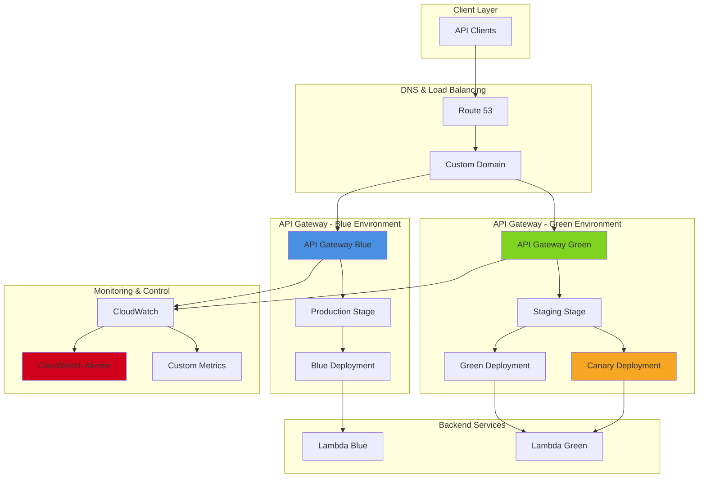

# Advanced API Gateway Deployment Strategies

## Problem

Enterprise API deployments require sophisticated release strategies to minimize business impact and ensure service reliability. Traditional all-at-once deployments create significant risks including service outages, performance degradation, and customer-facing errors. Organizations need controlled deployment mechanisms that enable gradual traffic shifting, automated rollback capabilities, and comprehensive monitoring to detect issues before they affect all users.

## Solution

Implement advanced API Gateway deployment patterns using blue-green and canary release strategies with automated traffic shifting and monitoring. This solution leverages API Gateway stages, weighted routing, and CloudWatch metrics to provide zero-downtime deployments with automated rollback capabilities based on error rates and latency thresholds.

## Architecture Diagram



## Prerequisites

1. AWS account with API Gateway, Lambda, CloudWatch, and Route 53 permissions
2. AWS CLI v2 installed and configured (or AWS CloudShell)
3. Understanding of API Gateway stages, deployments, and Lambda functions
4. Familiarity with DNS concepts and weighted routing
5. Estimated cost: $10-20 for testing (includes API Gateway calls, Lambda executions, Route 53 queries)

> **Note**: This recipe uses advanced API Gateway features including canary deployments and custom domain names which may incur additional charges.

## Preparation

```bash
# Set environment variables
export AWS_REGION=$(aws configure get region)
export AWS_ACCOUNT_ID=$(aws sts get-caller-identity \
    --query Account --output text)

# Generate unique identifiers
RANDOM_SUFFIX=$(aws secretsmanager get-random-password \
    --exclude-punctuation --exclude-uppercase \
    --password-length 6 --require-each-included-type \
    --output text --query RandomPassword)

export API_NAME="advanced-deployment-api-${RANDOM_SUFFIX}"
export DOMAIN_NAME="api-${RANDOM_SUFFIX}.yourdomain.com"
export BLUE_FUNCTION_NAME="blue-api-function-${RANDOM_SUFFIX}"
export GREEN_FUNCTION_NAME="green-api-function-${RANDOM_SUFFIX}"

# Create IAM role for Lambda functions
aws iam create-role \
    --role-name api-deployment-lambda-role-${RANDOM_SUFFIX} \
    --assume-role-policy-document '{
        "Version": "2012-10-17",
        "Statement": [
            {
                "Effect": "Allow",
                "Principal": {
                    "Service": "lambda.amazonaws.com"
                },
                "Action": "sts:AssumeRole"
            }
        ]
    }'

# Attach basic execution policy
aws iam attach-role-policy \
    --role-name api-deployment-lambda-role-${RANDOM_SUFFIX} \
    --policy-arn arn:aws:iam::aws:policy/service-role/AWSLambdaBasicExecutionRole

# Wait for role propagation
sleep 10

export LAMBDA_ROLE_ARN="arn:aws:iam::${AWS_ACCOUNT_ID}:role/api-deployment-lambda-role-${RANDOM_SUFFIX}"

echo "✅ Environment prepared with API name: ${API_NAME}"
```

## Steps

1. **Create Blue and Green Lambda Functions**:

   Lambda functions serve as the backend compute layer for our API Gateway deployment strategy. AWS Lambda provides serverless compute that automatically scales and manages infrastructure, making it ideal for blue-green deployments where we need identical environments with different code versions. Creating separate functions allows us to maintain production stability while testing new features in isolation.

   ```bash
   # Create Blue version Lambda function
   # This represents the current production version running stable code
   cat > blue-function.py << 'EOF'
   import json
   import os
   
   def lambda_handler(event, context):
       return {
           'statusCode': 200,
           'headers': {
               'Content-Type': 'application/json',
               'Access-Control-Allow-Origin': '*'
           },
           'body': json.dumps({
               'message': 'Hello from Blue environment!',
               'version': 'v1.0.0',
               'environment': 'blue',
               'timestamp': context.aws_request_id
           })
       }
   EOF
   
   # Create Green version Lambda function  
   # This represents the new version with enhanced features for testing
   cat > green-function.py << 'EOF'
   import json
   import os
   
   def lambda_handler(event, context):
       return {
           'statusCode': 200,
           'headers': {
               'Content-Type': 'application/json',
               'Access-Control-Allow-Origin': '*'
           },
           'body': json.dumps({
               'message': 'Hello from Green environment!',
               'version': 'v2.0.0',
               'environment': 'green',
               'timestamp': context.aws_request_id,
               'new_feature': 'Enhanced response format'
           })
       }
   EOF
   
   # Package and deploy Blue function
   zip blue-function.zip blue-function.py
   aws lambda create-function \
       --function-name ${BLUE_FUNCTION_NAME} \
       --runtime python3.9 \
       --role ${LAMBDA_ROLE_ARN} \
       --handler blue-function.lambda_handler \
       --zip-file fileb://blue-function.zip \
       --description "Blue environment API function"
   
   # Package and deploy Green function
   zip green-function.zip green-function.py
   aws lambda create-function \
       --function-name ${GREEN_FUNCTION_NAME} \
       --runtime python3.9 \
       --role ${LAMBDA_ROLE_ARN} \
       --handler green-function.lambda_handler \
       --zip-file fileb://green-function.zip \
       --description "Green environment API function"
   
   export BLUE_FUNCTION_ARN=$(aws lambda get-function \
       --function-name ${BLUE_FUNCTION_NAME} \
       --query Configuration.FunctionArn --output text)
   
   export GREEN_FUNCTION_ARN=$(aws lambda get-function \
       --function-name ${GREEN_FUNCTION_NAME} \
       --query Configuration.FunctionArn --output text)
   
   echo "✅ Created Blue and Green Lambda functions"
   ```

   The Lambda functions are now ready to serve as backend processors for our API Gateway deployment strategy. Each function represents a different version of our application logic, enabling us to test new features without affecting production traffic.

   > **Note**: Blue-green deployments require maintaining two identical environments. The blue environment represents the current production version while green hosts the new release candidate. This pattern enables instant rollback capabilities with zero downtime during deployments. Learn more about deployment best practices in the [AWS Lambda Developer Guide](https://docs.aws.amazon.com/lambda/latest/dg/services-apigateway-tutorial.html).

2. **Create API Gateway and Blue Environment Setup**:

   Amazon API Gateway serves as the managed frontend for our serverless application, providing capabilities like request routing, authentication, throttling, and monitoring. Creating a REST API establishes the foundation for our deployment strategy by providing the interface through which clients access our backend services. The API Gateway's integration with Lambda enables us to route traffic between different function versions seamlessly.

   ```bash
   # Create REST API
   export API_ID=$(aws apigateway create-rest-api \
       --name ${API_NAME} \
       --description "Advanced deployment patterns demo API" \
       --query id --output text)
   
   # Get root resource ID
   export ROOT_RESOURCE_ID=$(aws apigateway get-resources \
       --rest-api-id ${API_ID} \
       --query 'items[?path==`/`].id' --output text)
   
   # Create /hello resource
   export HELLO_RESOURCE_ID=$(aws apigateway create-resource \
       --rest-api-id ${API_ID} \
       --parent-id ${ROOT_RESOURCE_ID} \
       --path-part hello \
       --query id --output text)
   
   # Create GET method for Blue environment
   aws apigateway put-method \
       --rest-api-id ${API_ID} \
       --resource-id ${HELLO_RESOURCE_ID} \
       --http-method GET \
       --authorization-type NONE
   
   # Create Lambda integration for Blue environment
   aws apigateway put-integration \
       --rest-api-id ${API_ID} \
       --resource-id ${HELLO_RESOURCE_ID} \
       --http-method GET \
       --type AWS_PROXY \
       --integration-http-method POST \
       --uri "arn:aws:apigateway:${AWS_REGION}:lambda:path/2015-03-31/functions/${BLUE_FUNCTION_ARN}/invocations"
   
   # Grant API Gateway permission to invoke Blue Lambda
   aws lambda add-permission \
       --function-name ${BLUE_FUNCTION_NAME} \
       --statement-id api-gateway-blue-${RANDOM_SUFFIX} \
       --action lambda:InvokeFunction \
       --principal apigateway.amazonaws.com \
       --source-arn "arn:aws:execute-api:${AWS_REGION}:${AWS_ACCOUNT_ID}:${API_ID}/*/*"
   
   echo "✅ Created API Gateway with Blue environment integration"
   ```

   The API Gateway is now configured with the Blue Lambda function as its backend. This establishes our production baseline and creates the foundation for implementing advanced deployment patterns. The proxy integration simplifies request handling by automatically forwarding all request details to Lambda.

   > **Tip**: API Gateway's AWS_PROXY integration automatically handles request and response transformations, passing the entire request to Lambda and expecting a properly formatted response. This integration type reduces configuration complexity and provides flexibility in handling different request patterns. Learn more about [Lambda proxy integration](https://docs.aws.amazon.com/apigateway/latest/developerguide/set-up-lambda-proxy-integrations.html) in the AWS documentation.

3. **Create Production Stage with Blue Deployment**:

   API Gateway stages represent different environments or versions of your API, each with its own configuration, throttling limits, and monitoring settings. Creating stages enables you to manage multiple deployment environments and implement sophisticated deployment strategies. The production stage serves live traffic while staging provides a testing environment for validating changes before promotion.

   ```bash
   # Create initial deployment
   export BLUE_DEPLOYMENT_ID=$(aws apigateway create-deployment \
       --rest-api-id ${API_ID} \
       --stage-name production \
       --stage-description "Production stage with Blue environment" \
       --description "Initial Blue deployment" \
       --query id --output text)
   
   # Configure stage settings with caching and throttling
   aws apigateway update-stage \
       --rest-api-id ${API_ID} \
       --stage-name production \
       --patch-operations \
           'op=replace,path=/cacheClusterEnabled,value=false' \
           'op=replace,path=/tracingEnabled,value=true' \
           'op=replace,path=/*/*/throttling/rateLimit,value=1000' \
           'op=replace,path=/*/*/throttling/burstLimit,value=2000' \
           'op=replace,path=/*/*/logging/loglevel,value=INFO' \
           'op=replace,path=/*/*/logging/dataTrace,value=true' \
           'op=replace,path=/*/*/metricsEnabled,value=true'
   
   # Create staging stage for Green environment testing
   export GREEN_DEPLOYMENT_ID=$(aws apigateway create-deployment \
       --rest-api-id ${API_ID} \
       --stage-name staging \
       --stage-description "Staging stage for Green environment testing" \
       --description "Green environment deployment" \
       --query id --output text)
   
   export API_ENDPOINT="https://${API_ID}.execute-api.${AWS_REGION}.amazonaws.com"
   
   echo "✅ Created production stage with Blue deployment"
   echo "✅ API Endpoint: ${API_ENDPOINT}"
   ```

   The production and staging stages are now configured with appropriate monitoring and throttling settings. These stages provide the foundation for implementing canary deployments by allowing us to control traffic distribution between different backend versions.

4. **Update Integration for Green Environment**:

   Updating API Gateway integrations allows us to point different stages to different backend services, enabling blue-green deployment patterns. This step reconfigures the staging environment to use the Green Lambda function while maintaining the Blue function in production, providing a safe testing ground for the new version before any production traffic exposure.

   ```bash
   # Update the integration to point to Green Lambda for staging
   aws apigateway update-integration \
       --rest-api-id ${API_ID} \
       --resource-id ${HELLO_RESOURCE_ID} \
       --http-method GET \
       --patch-operations "op=replace,path=/uri,value=arn:aws:apigateway:${AWS_REGION}:lambda:path/2015-03-31/functions/${GREEN_FUNCTION_ARN}/invocations"
   
   # Grant API Gateway permission to invoke Green Lambda
   aws lambda add-permission \
       --function-name ${GREEN_FUNCTION_NAME} \
       --statement-id api-gateway-green-${RANDOM_SUFFIX} \
       --action lambda:InvokeFunction \
       --principal apigateway.amazonaws.com \
       --source-arn "arn:aws:execute-api:${AWS_REGION}:${AWS_ACCOUNT_ID}:${API_ID}/*/*"
   
   # Create new deployment for staging with Green environment
   export GREEN_DEPLOYMENT_ID_UPDATED=$(aws apigateway create-deployment \
       --rest-api-id ${API_ID} \
       --stage-name staging \
       --description "Updated Green deployment" \
       --query id --output text)
   
   echo "✅ Updated staging environment with Green Lambda integration"
   ```

   The staging environment now points to the Green Lambda function, allowing comprehensive testing of the new version before any production exposure. This separation ensures that production traffic remains unaffected while we validate new functionality, performance, and integration behavior.

   > **Warning**: Always test new integrations in a staging environment before promoting to production. This validation step is critical for identifying integration issues, permission problems, or configuration errors that could cause service disruptions. Follow AWS deployment best practices outlined in the [API Gateway deployment documentation](https://docs.aws.amazon.com/apigateway/latest/developerguide/how-to-deploy-api.html).

5. **Implement Canary Deployment Strategy**:

   Canary deployments provide a risk mitigation strategy by gradually exposing new code versions to a small percentage of production traffic. This approach allows early detection of issues with minimal user impact, enabling data-driven decisions about deployment promotion or rollback. API Gateway's canary functionality automatically handles traffic splitting and provides isolated metrics for each version.

   ```bash
   # Create a canary deployment on production stage (10% traffic to Green)
   aws apigateway create-deployment \
       --rest-api-id ${API_ID} \
       --stage-name production \
       --description "Canary deployment - 10% Green traffic" \
       --canary-settings '{
           "percentTraffic": 10,
           "deploymentId": "'${GREEN_DEPLOYMENT_ID_UPDATED}'",
           "stageVariableOverrides": {
               "environment": "canary"
           },
           "useStageCache": false
       }'
   
   # Wait for deployment propagation
   sleep 5
   
   # Verify canary deployment status
   aws apigateway get-stage \
       --rest-api-id ${API_ID} \
       --stage-name production \
       --query 'canarySettings' --output json
   
   echo "✅ Created canary deployment with 10% traffic to Green environment"
   ```

   The canary deployment is now active, routing 10% of production traffic to the Green environment while maintaining 90% on the stable Blue version. This configuration enables real-world testing with actual user traffic while minimizing risk exposure. CloudWatch metrics will track the performance of both versions independently.

6. **Set Up CloudWatch Monitoring and Alarms**:

   CloudWatch monitoring provides the observability foundation for automated deployment decisions. Setting up alarms for key metrics like error rates and latency enables objective criteria for determining deployment success or failure. These alarms can trigger automated rollback procedures, ensuring rapid response to issues without manual intervention.

   ```bash
   # Create CloudWatch alarm for 4XX errors
   aws cloudwatch put-metric-alarm \
       --alarm-name "${API_NAME}-4xx-errors" \
       --alarm-description "API Gateway 4XX errors" \
       --metric-name 4XXError \
       --namespace AWS/ApiGateway \
       --statistic Sum \
       --period 300 \
       --threshold 10 \
       --comparison-operator GreaterThanThreshold \
       --evaluation-periods 2 \
       --dimensions Name=ApiName,Value=${API_NAME} Name=Stage,Value=production
   
   # Create CloudWatch alarm for 5XX errors
   aws cloudwatch put-metric-alarm \
       --alarm-name "${API_NAME}-5xx-errors" \
       --alarm-description "API Gateway 5XX errors" \
       --metric-name 5XXError \
       --namespace AWS/ApiGateway \
       --statistic Sum \
       --period 300 \
       --threshold 5 \
       --comparison-operator GreaterThanThreshold \
       --evaluation-periods 1 \
       --dimensions Name=ApiName,Value=${API_NAME} Name=Stage,Value=production
   
   # Create CloudWatch alarm for latency
   aws cloudwatch put-metric-alarm \
       --alarm-name "${API_NAME}-high-latency" \
       --alarm-description "API Gateway high latency" \
       --metric-name Latency \
       --namespace AWS/ApiGateway \
       --statistic Average \
       --period 300 \
       --threshold 5000 \
       --comparison-operator GreaterThanThreshold \
       --evaluation-periods 2 \
       --dimensions Name=ApiName,Value=${API_NAME} Name=Stage,Value=production
   
   echo "✅ Created CloudWatch alarms for monitoring deployment health"
   ```

   The CloudWatch alarms are now monitoring critical API health metrics including 4XX/5XX error rates and response latency. These alarms provide automated detection of deployment issues and can trigger rollback procedures when thresholds are exceeded, ensuring rapid response to problems.

7. **Implement Automated Traffic Shifting**:

   Automated traffic shifting implements progressive deployment by gradually increasing the percentage of traffic sent to the new version while monitoring key performance indicators. This approach reduces risk by validating each traffic increase step before proceeding, with built-in rollback capabilities when issues are detected. The automation eliminates human error in deployment management while maintaining safety controls.

   ```bash
   # Function to gradually increase canary traffic
   increase_canary_traffic() {
       local target_percentage=$1
       echo "Increasing canary traffic to ${target_percentage}%..."
       
       aws apigateway update-stage \
           --rest-api-id ${API_ID} \
           --stage-name production \
           --patch-operations "op=replace,path=/canarySettings/percentTraffic,value=${target_percentage}"
       
       # Wait and monitor for 2 minutes
       echo "Monitoring for 2 minutes..."
       sleep 120
       
       # Check error rates
       local error_count=$(aws cloudwatch get-metric-statistics \
           --namespace AWS/ApiGateway \
           --metric-name 5XXError \
           --dimensions Name=ApiName,Value=${API_NAME} Name=Stage,Value=production \
           --start-time $(date -u -d '5 minutes ago' +%Y-%m-%dT%H:%M:%S) \
           --end-time $(date -u +%Y-%m-%dT%H:%M:%S) \
           --period 300 \
           --statistics Sum \
           --query 'Datapoints[0].Sum' --output text 2>/dev/null || echo "0")
       
       if [ "${error_count}" != "null" ] && [ "${error_count}" != "None" ] && [ $(echo "${error_count} > 0" | bc) -eq 1 ]; then
           echo "❌ Error detected! Rolling back..."
           rollback_deployment
           return 1
       fi
       
       echo "✅ Traffic shift to ${target_percentage}% successful"
       return 0
   }
   
   # Function to rollback deployment
   rollback_deployment() {
       echo "🔄 Rolling back to Blue environment..."
       aws apigateway update-stage \
           --rest-api-id ${API_ID} \
           --stage-name production \
           --patch-operations "op=remove,path=/canarySettings"
       echo "✅ Rollback completed"
   }
   
   # Gradually increase traffic: 10% -> 25% -> 50% -> 100%
   increase_canary_traffic 25 && \
   increase_canary_traffic 50 && \
   increase_canary_traffic 100
   
   echo "✅ Automated traffic shifting completed successfully"
   ```

   The automated traffic shifting process has successfully validated the Green environment across multiple traffic levels. This progressive validation approach ensures the new version can handle increasing load while maintaining quality metrics, providing confidence for full production promotion.

8. **Promote Green to Production (Blue-Green Swap)**:

   The blue-green swap represents the final step in our deployment strategy, promoting the validated Green environment to handle all production traffic. This operation maintains the Blue environment as a standby for instant rollback capabilities, ensuring business continuity even after the promotion. The swap operation is atomic, minimizing the window for potential issues.

   ```bash
   # After successful canary testing, promote Green to full production
   echo "🚀 Promoting Green environment to full production..."
   
   # Remove canary settings and deploy Green to production
   aws apigateway update-stage \
       --rest-api-id ${API_ID} \
       --stage-name production \
       --patch-operations \
           "op=replace,path=/deploymentId,value=${GREEN_DEPLOYMENT_ID_UPDATED}" \
           "op=remove,path=/canarySettings"
   
   # Update Blue environment to point to Green Lambda for rollback capability
   # This step maintains the ability to quickly rollback if needed
   echo "✅ Green environment promoted to production"
   echo "✅ Blue environment maintained for instant rollback capability"
   ```

   The deployment promotion is complete, with Green now serving all production traffic. The Blue environment remains available for immediate rollback if any issues are discovered post-deployment, maintaining our zero-downtime deployment capability for future releases.

9. **Create Custom Deployment Automation Script**:

   Creating reusable automation scripts enables consistent deployment processes and reduces the potential for human error. This script encapsulates the deployment logic and can be integrated into CI/CD pipelines, enabling teams to implement sophisticated deployment strategies without manual intervention. The script provides a foundation for enterprise deployment automation.

   ```bash
   # Create deployment automation script
   cat > deploy-api.sh << 'EOF'
   #!/bin/bash
   
   # API Gateway Advanced Deployment Script
   set -e
   
   API_ID=$1
   NEW_LAMBDA_ARN=$2
   STAGE_NAME=${3:-production}
   CANARY_PERCENTAGE=${4:-10}
   
   if [ -z "$API_ID" ] || [ -z "$NEW_LAMBDA_ARN" ]; then
       echo "Usage: $0 <api-id> <new-lambda-arn> [stage-name] [canary-percentage]"
       exit 1
   fi
   
   echo "🚀 Starting deployment to API Gateway..."
   echo "API ID: $API_ID"
   echo "New Lambda ARN: $NEW_LAMBDA_ARN"
   echo "Stage: $STAGE_NAME"
   echo "Canary Traffic: $CANARY_PERCENTAGE%"
   
   # Create new deployment
   DEPLOYMENT_ID=$(aws apigateway create-deployment \
       --rest-api-id $API_ID \
       --stage-name staging \
       --description "Automated deployment $(date)" \
       --query id --output text)
   
   echo "✅ Created deployment: $DEPLOYMENT_ID"
   
   # Start canary deployment
   aws apigateway create-deployment \
       --rest-api-id $API_ID \
       --stage-name $STAGE_NAME \
       --description "Canary deployment $(date)" \
       --canary-settings "{
           \"percentTraffic\": $CANARY_PERCENTAGE,
           \"deploymentId\": \"$DEPLOYMENT_ID\",
           \"useStageCache\": false
       }"
   
   echo "✅ Canary deployment started with $CANARY_PERCENTAGE% traffic"
   echo "🔍 Monitor your CloudWatch alarms for deployment health"
   echo "📊 Metrics available at: https://console.aws.amazon.com/cloudwatch/"
   EOF
   
   chmod +x deploy-api.sh
   
   echo "✅ Created deployment automation script: deploy-api.sh"
   ```

   The deployment automation script provides a reusable foundation for implementing canary deployments across multiple APIs and environments. This script can be integrated into CI/CD pipelines and customized for specific deployment requirements, enabling teams to implement consistent deployment practices.

## Validation & Testing

1. **Test Blue Environment**:

   ```bash
   # Test production endpoint (should show Blue environment)
   echo "Testing Blue environment..."
   curl -s "${API_ENDPOINT}/production/hello" | jq '.'
   ```

   Expected output: JSON response with `"environment": "blue"` and `"version": "v1.0.0"`

2. **Test Green Environment via Staging**:

   ```bash
   # Test staging endpoint (should show Green environment)
   echo "Testing Green environment via staging..."
   curl -s "${API_ENDPOINT}/staging/hello" | jq '.'
   ```

   Expected output: JSON response with `"environment": "green"` and `"version": "v2.0.0"`

3. **Test Canary Traffic Distribution**:

   ```bash
   # Test canary traffic distribution
   echo "Testing canary traffic distribution (run multiple times)..."
   for i in {1..20}; do
       response=$(curl -s "${API_ENDPOINT}/production/hello")
       environment=$(echo $response | jq -r '.environment')
       echo "Request $i: Environment = $environment"
       sleep 1
   done
   ```

   Expected output: Approximately 10% of requests should show `"environment": "green"` and 90% should show `"environment": "blue"`

4. **Verify CloudWatch Metrics**:

   ```bash
   # Check API Gateway metrics
   aws cloudwatch get-metric-statistics \
       --namespace AWS/ApiGateway \
       --metric-name Count \
       --dimensions Name=ApiName,Value=${API_NAME} Name=Stage,Value=production \
       --start-time $(date -u -d '10 minutes ago' +%Y-%m-%dT%H:%M:%S) \
       --end-time $(date -u +%Y-%m-%dT%H:%M:%S) \
       --period 300 \
       --statistics Sum
   ```

5. **Test Rollback Functionality**:

   ```bash
   # Test automated rollback
   echo "Testing rollback functionality..."
   ./deploy-api.sh ${API_ID} ${BLUE_FUNCTION_ARN} production 0
   
   # Verify rollback worked
   curl -s "${API_ENDPOINT}/production/hello" | jq '.environment'
   ```

## Cleanup

1. **Remove API Gateway resources**:

   ```bash
   # Delete API Gateway
   aws apigateway delete-rest-api \
       --rest-api-id ${API_ID}
   
   echo "✅ Deleted API Gateway"
   ```

2. **Remove Lambda functions**:

   ```bash
   # Delete Lambda functions
   aws lambda delete-function \
       --function-name ${BLUE_FUNCTION_NAME}
   
   aws lambda delete-function \
       --function-name ${GREEN_FUNCTION_NAME}
   
   echo "✅ Deleted Lambda functions"
   ```

3. **Remove CloudWatch alarms**:

   ```bash
   # Delete CloudWatch alarms
   aws cloudwatch delete-alarms \
       --alarm-names \
           "${API_NAME}-4xx-errors" \
           "${API_NAME}-5xx-errors" \
           "${API_NAME}-high-latency"
   
   echo "✅ Deleted CloudWatch alarms"
   ```

4. **Remove IAM role**:

   ```bash
   # Detach policies and delete IAM role
   aws iam detach-role-policy \
       --role-name api-deployment-lambda-role-${RANDOM_SUFFIX} \
       --policy-arn arn:aws:iam::aws:policy/service-role/AWSLambdaBasicExecutionRole
   
   aws iam delete-role \
       --role-name api-deployment-lambda-role-${RANDOM_SUFFIX}
   
   echo "✅ Deleted IAM role"
   ```

5. **Clean up local files**:

   ```bash
   # Remove local files
   rm -f blue-function.py green-function.py
   rm -f blue-function.zip green-function.zip
   rm -f deploy-api.sh
   
   echo "✅ Cleaned up local files"
   ```

## Discussion

This recipe demonstrates sophisticated API Gateway deployment strategies that are essential for enterprise-grade applications. The implementation combines blue-green deployments with canary releases to provide multiple layers of risk mitigation during API updates.

**Blue-Green Deployment Benefits**: This pattern maintains two identical production environments, allowing instant rollback capabilities and zero-downtime deployments. The blue environment serves current production traffic while the green environment hosts the new version. Once validated, traffic switches completely to green, making blue available for the next deployment cycle.

**Canary Release Strategy**: By gradually shifting traffic percentages (10% → 25% → 50% → 100%), canary deployments enable early detection of issues with minimal user impact. The automated monitoring integration with CloudWatch alarms provides objective criteria for promotion or rollback decisions based on error rates and latency metrics.

**Advanced Monitoring Integration**: The CloudWatch alarms monitor critical metrics including 4XX/5XX error rates and response latency. These metrics drive automated decision-making in the deployment pipeline, ensuring that problematic deployments are detected and rolled back before affecting a significant portion of users. The integration with API Gateway's built-in metrics provides comprehensive visibility into API performance and health.

**Production Considerations**: For production use, consider implementing additional features such as custom domain names with SSL certificates, API keys for authentication, request/response logging to CloudWatch Logs, and integration with CI/CD pipelines. The deployment automation script provides a foundation for integration with tools like AWS CodePipeline, Jenkins, or GitHub Actions.

> **Tip**: Use API Gateway's stage variables to parameterize backend integrations, enabling dynamic configuration changes without requiring new deployments.

## Challenge

Extend this deployment strategy by implementing these advanced features:

1. **Multi-Region Deployment**: Implement cross-region blue-green deployments using Route 53 health checks and weighted routing policies for global API availability and disaster recovery.

2. **Automated Testing Integration**: Add automated testing phases to the deployment pipeline including smoke tests, integration tests, and load tests that must pass before traffic shifting continues.

3. **Custom Domain Management**: Integrate SSL certificate management with AWS Certificate Manager and implement custom domain switching for true blue-green URL swapping.

4. **Advanced Metrics and Dashboards**: Create custom CloudWatch dashboards with business metrics, implement custom metrics from Lambda functions, and integrate with AWS X-Ray for distributed tracing.

5. **Database Migration Coordination**: Extend the pattern to handle database schema migrations and data consistency requirements during blue-green deployments with backward compatibility strategies.

## Infrastructure Code

*Infrastructure code will be generated after recipe approval.*