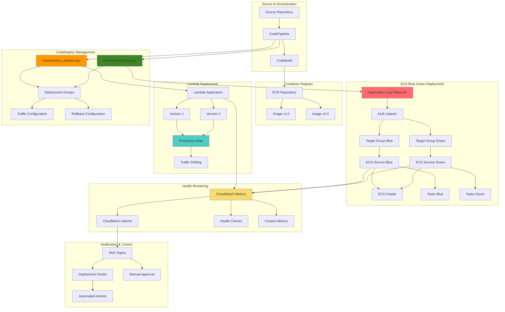

# Implementing Advanced Blue-Green Deployments with ECS, Lambda, and CodeDeploy

## Problem

Modern containerized applications require sophisticated deployment strategies that minimize downtime, reduce deployment risk, and enable rapid rollback capabilities. Traditional rolling deployments can lead to inconsistent application states, longer rollback times, and complex troubleshooting when issues occur. Organizations need deployment strategies that support both containerized microservices (ECS) and serverless functions (Lambda) while providing comprehensive monitoring, automated rollback triggers, and integration with existing CI/CD pipelines. Manual deployment processes are error-prone and don't scale with the velocity demands of modern development teams.

## Solution

AWS CodeDeploy provides advanced blue-green deployment capabilities for both ECS services and Lambda functions, enabling zero-downtime deployments with automatic traffic shifting and rollback mechanisms. This solution demonstrates how to implement sophisticated blue-green deployment patterns with automated health checks, custom deployment hooks, intelligent traffic management, and comprehensive monitoring. The approach integrates multiple deployment targets within a unified workflow while maintaining independent rollback capabilities and detailed observability across all deployment phases.

## Architecture Diagram



## Prerequisites

1. AWS account with CodeDeploy, ECS, Lambda, ALB, and IAM permissions
2. AWS CLI v2 installed and configured (or AWS CloudShell)
3. Understanding of containerization, ECS services, and Lambda functions
4. Knowledge of blue-green deployment concepts and traffic shifting
5. Experience with Application Load Balancers and target groups
6. Estimated cost: $30-60 for testing ALB, ECS tasks, Lambda executions, and monitoring

> **Note**: This recipe creates multiple AWS resources including ECS clusters, ALB, and Lambda functions. Monitor costs and clean up resources after testing to avoid ongoing charges.

## Preparation

```bash
# Set environment variables
export AWS_REGION=$(aws configure get region)
export AWS_ACCOUNT_ID=$(aws sts get-caller-identity \
    --query Account --output text)

# Generate unique identifiers for resources
RANDOM_SUFFIX=$(aws secretsmanager get-random-password \
    --exclude-punctuation --exclude-uppercase \
    --password-length 8 --require-each-included-type \
    --output text --query RandomPassword)

export PROJECT_NAME="advanced-deployment-${RANDOM_SUFFIX}"
export ECS_CLUSTER_NAME="deployment-cluster-${RANDOM_SUFFIX}"
export ECS_SERVICE_NAME="web-service-${RANDOM_SUFFIX}"
export LAMBDA_FUNCTION_NAME="api-function-${RANDOM_SUFFIX}"
export ALB_NAME="deployment-alb-${RANDOM_SUFFIX}"
export ECR_REPOSITORY="web-app-${RANDOM_SUFFIX}"

# CodeDeploy application names
export CD_ECS_APP_NAME="ecs-deployment-${RANDOM_SUFFIX}"
export CD_LAMBDA_APP_NAME="lambda-deployment-${RANDOM_SUFFIX}"

# IAM role names
export ECS_TASK_ROLE="ECSTaskRole-${RANDOM_SUFFIX}"
export ECS_EXECUTION_ROLE="ECSExecutionRole-${RANDOM_SUFFIX}"
export CODEDEPLOY_ROLE="CodeDeployRole-${RANDOM_SUFFIX}"
export LAMBDA_ROLE="LambdaRole-${RANDOM_SUFFIX}"

echo "✅ Environment variables configured"
echo "Project Name: ${PROJECT_NAME}"
echo "ECS Cluster: ${ECS_CLUSTER_NAME}"
echo "Lambda Function: ${LAMBDA_FUNCTION_NAME}"
echo "ALB Name: ${ALB_NAME}"
```

## Steps

1. **Create VPC Infrastructure and Load Balancer**:

   Blue-green deployments require sophisticated network infrastructure that can route traffic between multiple environments safely. Application Load Balancers (ALB) provide the foundation for this by supporting multiple target groups that represent our blue and green environments. The ALB acts as the traffic controller, enabling seamless transitions between application versions while maintaining high availability and performance.

   Understanding target group management is crucial for blue-green deployments because it enables independent health checking and traffic routing for each environment. This separation ensures that new versions are thoroughly validated before receiving production traffic, reducing deployment risk and enabling rapid rollback capabilities.

   ```bash
   # Get default VPC and subnets
   export DEFAULT_VPC_ID=$(aws ec2 describe-vpcs \
       --filters "Name=is-default,Values=true" \
       --query 'Vpcs[0].VpcId' --output text)
   
   export SUBNET_IDS=$(aws ec2 describe-subnets \
       --filters "Name=vpc-id,Values=${DEFAULT_VPC_ID}" \
       --query 'Subnets[*].SubnetId' --output text)
   
   export SUBNET_ID_1=$(echo $SUBNET_IDS | cut -d' ' -f1)
   export SUBNET_ID_2=$(echo $SUBNET_IDS | cut -d' ' -f2)
   
   # Create security group for ALB
   export ALB_SG_ID=$(aws ec2 create-security-group \
       --group-name "${ALB_NAME}-sg" \
       --description "Security group for ALB" \
       --vpc-id $DEFAULT_VPC_ID \
       --query 'GroupId' --output text)
   
   # Allow HTTP and HTTPS traffic
   aws ec2 authorize-security-group-ingress \
       --group-id $ALB_SG_ID \
       --protocol tcp --port 80 --cidr 0.0.0.0/0
   
   aws ec2 authorize-security-group-ingress \
       --group-id $ALB_SG_ID \
       --protocol tcp --port 443 --cidr 0.0.0.0/0
   
   # Create security group for ECS tasks
   export ECS_SG_ID=$(aws ec2 create-security-group \
       --group-name "${ECS_SERVICE_NAME}-sg" \
       --description "Security group for ECS tasks" \
       --vpc-id $DEFAULT_VPC_ID \
       --query 'GroupId' --output text)
   
   # Allow traffic from ALB
   aws ec2 authorize-security-group-ingress \
       --group-id $ECS_SG_ID \
       --protocol tcp --port 8080 \
       --source-group $ALB_SG_ID
   
   # Create Application Load Balancer
   export ALB_ARN=$(aws elbv2 create-load-balancer \
       --name $ALB_NAME \
       --subnets $SUBNET_ID_1 $SUBNET_ID_2 \
       --security-groups $ALB_SG_ID \
       --scheme internet-facing \
       --type application \
       --ip-address-type ipv4 \
       --query 'LoadBalancers[0].LoadBalancerArn' --output text)
   
   # Get ALB DNS name
   export ALB_DNS=$(aws elbv2 describe-load-balancers \
       --load-balancer-arns $ALB_ARN \
       --query 'LoadBalancers[0].DNSName' --output text)
   
   # Create target groups for blue-green deployment
   export TG_BLUE_ARN=$(aws elbv2 create-target-group \
       --name "${ECS_SERVICE_NAME}-blue" \
       --protocol HTTP --port 8080 \
       --vpc-id $DEFAULT_VPC_ID \
       --target-type ip \
       --health-check-path /health \
       --health-check-interval-seconds 30 \
       --health-check-timeout-seconds 5 \
       --healthy-threshold-count 2 \
       --unhealthy-threshold-count 3 \
       --query 'TargetGroups[0].TargetGroupArn' --output text)
   
   export TG_GREEN_ARN=$(aws elbv2 create-target-group \
       --name "${ECS_SERVICE_NAME}-green" \
       --protocol HTTP --port 8080 \
       --vpc-id $DEFAULT_VPC_ID \
       --target-type ip \
       --health-check-path /health \
       --health-check-interval-seconds 30 \
       --health-check-timeout-seconds 5 \
       --healthy-threshold-count 2 \
       --unhealthy-threshold-count 3 \
       --query 'TargetGroups[0].TargetGroupArn' --output text)
   
   # Create ALB listener
   export LISTENER_ARN=$(aws elbv2 create-listener \
       --load-balancer-arn $ALB_ARN \
       --protocol HTTP --port 80 \
       --default-actions Type=forward,TargetGroupArn=$TG_BLUE_ARN \
       --query 'Listeners[0].ListenerArn' --output text)
   
   echo "✅ VPC infrastructure and load balancer created"
   echo "ALB DNS: ${ALB_DNS}"
   ```

   The ALB and target group infrastructure is now established as the traffic management foundation for our blue-green deployments. This configuration provides the network-level separation needed to safely test new application versions while maintaining production stability. The health check configuration ensures that only healthy instances receive traffic during deployment transitions.

   > **Note**: ALB target group health checks are critical for blue-green deployments. Learn more about configuring optimal health check settings in the [AWS documentation](https://docs.aws.amazon.com/elasticloadbalancing/latest/application/target-group-health-checks.html).

2. **Create IAM Roles for ECS and Lambda**:

   Security is paramount in blue-green deployments as they involve multiple environments and automated processes that require precise permissions. IAM roles implement the principle of least privilege, ensuring that each component has only the permissions necessary for its specific function. This approach reduces security attack surfaces while enabling the complex interactions required for automated deployments.

   ECS tasks require two distinct roles: the execution role for pulling container images and managing logs, and the task role for application-specific AWS service interactions. CodeDeploy requires broad permissions to manage both ECS services and Lambda functions during deployments. Understanding these role separations is essential for maintaining security while enabling deployment automation.

   ```bash
   # Create ECS task execution role
   cat > ecs-execution-trust-policy.json << 'EOF'
   {
     "Version": "2012-10-17",
     "Statement": [
       {
         "Effect": "Allow",
         "Principal": {
           "Service": "ecs-tasks.amazonaws.com"
         },
         "Action": "sts:AssumeRole"
       }
     ]
   }
   EOF
   
   aws iam create-role \
       --role-name $ECS_EXECUTION_ROLE \
       --assume-role-policy-document file://ecs-execution-trust-policy.json
   
   aws iam attach-role-policy \
       --role-name $ECS_EXECUTION_ROLE \
       --policy-arn arn:aws:iam::aws:policy/service-role/AmazonECSTaskExecutionRolePolicy
   
   # Create ECS task role
   aws iam create-role \
       --role-name $ECS_TASK_ROLE \
       --assume-role-policy-document file://ecs-execution-trust-policy.json
   
   # Create policy for ECS task role
   cat > ecs-task-policy.json << 'EOF'
   {
     "Version": "2012-10-17",
     "Statement": [
       {
         "Effect": "Allow",
         "Action": [
           "cloudwatch:PutMetricData",
           "logs:CreateLogStream",
           "logs:PutLogEvents"
         ],
         "Resource": "*"
       }
     ]
   }
   EOF
   
   aws iam create-policy \
       --policy-name ECSTaskPolicy-${RANDOM_SUFFIX} \
       --policy-document file://ecs-task-policy.json
   
   aws iam attach-role-policy \
       --role-name $ECS_TASK_ROLE \
       --policy-arn arn:aws:iam::${AWS_ACCOUNT_ID}:policy/ECSTaskPolicy-${RANDOM_SUFFIX}
   
   # Create CodeDeploy service role
   cat > codedeploy-trust-policy.json << 'EOF'
   {
     "Version": "2012-10-17",
     "Statement": [
       {
         "Effect": "Allow",
         "Principal": {
           "Service": "codedeploy.amazonaws.com"
         },
         "Action": "sts:AssumeRole"
       }
     ]
   }
   EOF
   
   aws iam create-role \
       --role-name $CODEDEPLOY_ROLE \
       --assume-role-policy-document file://codedeploy-trust-policy.json
   
   aws iam attach-role-policy \
       --role-name $CODEDEPLOY_ROLE \
       --policy-arn arn:aws:iam::aws:policy/AWSCodeDeployRoleForECS
   
   aws iam attach-role-policy \
       --role-name $CODEDEPLOY_ROLE \
       --policy-arn arn:aws:iam::aws:policy/service-role/AWSCodeDeployRoleForLambda
   
   # Create Lambda execution role
   cat > lambda-trust-policy.json << 'EOF'
   {
     "Version": "2012-10-17",
     "Statement": [
       {
         "Effect": "Allow",
         "Principal": {
           "Service": "lambda.amazonaws.com"
         },
         "Action": "sts:AssumeRole"
       }
     ]
   }
   EOF
   
   aws iam create-role \
       --role-name $LAMBDA_ROLE \
       --assume-role-policy-document file://lambda-trust-policy.json
   
   aws iam attach-role-policy \
       --role-name $LAMBDA_ROLE \
       --policy-arn arn:aws:iam::aws:policy/service-role/AWSLambdaBasicExecutionRole
   
   # Get role ARNs
   export ECS_EXECUTION_ROLE_ARN=$(aws iam get-role \
       --role-name $ECS_EXECUTION_ROLE \
       --query Role.Arn --output text)
   
   export ECS_TASK_ROLE_ARN=$(aws iam get-role \
       --role-name $ECS_TASK_ROLE \
       --query Role.Arn --output text)
   
   export CODEDEPLOY_ROLE_ARN=$(aws iam get-role \
       --role-name $CODEDEPLOY_ROLE \
       --query Role.Arn --output text)
   
   export LAMBDA_ROLE_ARN=$(aws iam get-role \
       --role-name $LAMBDA_ROLE \
       --query Role.Arn --output text)
   
   echo "✅ IAM roles created"
   ```

   The IAM role structure now provides secure, least-privilege access for all deployment components. This security foundation enables automated deployments while maintaining strict access controls. The role separation ensures that compromise of one component doesn't provide unnecessary access to other AWS services, following [AWS IAM security best practices](https://docs.aws.amazon.com/AmazonECS/latest/developerguide/security-iam-bestpractices.html).

3. **Create ECR Repository and Sample Application**:

   Container registries serve as the versioned artifact store for blue-green deployments, providing immutable application packages that can be reliably deployed across environments. ECR integrates seamlessly with ECS and CodeDeploy, enabling automated image pulling and vulnerability scanning. The sample application includes comprehensive health checks and metrics endpoints that are essential for deployment validation.

   Building applications with proper health endpoints is crucial for blue-green deployments because these endpoints enable automated validation of deployment success. The application includes version-specific behavior that demonstrates how blue-green deployments can safely introduce new features while providing rollback capabilities if issues are detected.

   ```bash
   # Create ECR repository
   aws ecr create-repository \
       --repository-name $ECR_REPOSITORY \
       --image-scanning-configuration scanOnPush=true
   
   export ECR_URI=$(aws ecr describe-repositories \
       --repository-names $ECR_REPOSITORY \
       --query 'repositories[0].repositoryUri' --output text)
   
   # Create sample web application
   mkdir -p sample-web-app
   cd sample-web-app
   
   # Create Node.js application
   cat > package.json << 'EOF'
   {
     "name": "blue-green-demo-app",
     "version": "1.0.0",
     "description": "Sample application for blue-green deployment",
     "main": "server.js",
     "scripts": {
       "start": "node server.js"
     },
     "dependencies": {
       "express": "^4.18.2",
       "prom-client": "^14.2.0"
     }
   }
   EOF
   
   # Create Express.js server with health checks and metrics
   cat > server.js << 'EOF'
   const express = require('express');
   const promClient = require('prom-client');
   
   const app = express();
   const port = process.env.PORT || 8080;
   const version = process.env.APP_VERSION || '1.0.0';
   const environment = process.env.ENVIRONMENT || 'blue';
   
   // Prometheus metrics
   const register = new promClient.Registry();
   promClient.collectDefaultMetrics({ register });
   
   const httpRequestsTotal = new promClient.Counter({
     name: 'http_requests_total',
     help: 'Total number of HTTP requests',
     labelNames: ['method', 'route', 'status_code'],
     registers: [register]
   });
   
   const httpRequestDuration = new promClient.Histogram({
     name: 'http_request_duration_seconds',
     help: 'Duration of HTTP requests in seconds',
     labelNames: ['method', 'route'],
     registers: [register]
   });
   
   // Middleware for metrics
   app.use((req, res, next) => {
     const startTime = Date.now();
     
     res.on('finish', () => {
       const duration = (Date.now() - startTime) / 1000;
       httpRequestsTotal.inc({
         method: req.method,
         route: req.route ? req.route.path : req.path,
         status_code: res.statusCode
       });
       httpRequestDuration.observe({
         method: req.method,
         route: req.route ? req.route.path : req.path
       }, duration);
     });
     
     next();
   });
   
   // Health check endpoint
   app.get('/health', (req, res) => {
     res.status(200).json({
       status: 'healthy',
       version: version,
       environment: environment,
       timestamp: new Date().toISOString(),
       uptime: process.uptime()
     });
   });
   
   // Ready check endpoint
   app.get('/ready', (req, res) => {
     // Add any readiness checks here
     res.status(200).json({
       status: 'ready',
       version: version,
       environment: environment
     });
   });
   
   // Metrics endpoint
   app.get('/metrics', async (req, res) => {
     try {
       res.set('Content-Type', register.contentType);
       res.end(await register.metrics());
     } catch (ex) {
       res.status(500).end(ex);
     }
   });
   
   // Main application endpoint
   app.get('/', (req, res) => {
     res.json({
       message: 'Blue-Green Deployment Demo',
       version: version,
       environment: environment,
       timestamp: new Date().toISOString(),
       hostname: require('os').hostname()
     });
   });
   
   // API endpoint with environment-specific behavior
   app.get('/api/data', (req, res) => {
     const data = {
       environment: environment,
       version: version,
       data: [
         { id: 1, value: Math.random(), environment: environment },
         { id: 2, value: Math.random(), environment: environment },
         { id: 3, value: Math.random(), environment: environment }
       ],
       timestamp: new Date().toISOString()
     };
     
     // Simulate version-specific features
     if (version === '2.0.0') {
       data.newFeature = 'Enhanced data processing';
       data.data.push({ id: 4, value: Math.random(), environment: environment });
     }
     
     res.json(data);
   });
   
   // Error simulation endpoint (for testing rollbacks)
   app.get('/error', (req, res) => {
     if (version === '2.0.0' && Math.random() < 0.3) {
       // Simulate higher error rate in v2.0.0
       res.status(500).json({ error: 'Simulated error in v2.0.0' });
     } else {
       res.json({ status: 'ok', version: version });
     }
   });
   
   // Graceful shutdown
   process.on('SIGTERM', () => {
     console.log('SIGTERM received, shutting down gracefully');
     server.close(() => {
       console.log('Process terminated');
     });
   });
   
   const server = app.listen(port, '0.0.0.0', () => {
     console.log(`Server running on port ${port}`);
     console.log(`Version: ${version}, Environment: ${environment}`);
   });
   EOF
   
   # Create Dockerfile for multi-version support
   cat > Dockerfile << 'EOF'
   FROM node:18-alpine
   
   WORKDIR /app
   
   # Copy package files
   COPY package*.json ./
   
   # Install dependencies
   RUN npm ci --only=production
   
   # Copy application code
   COPY server.js ./
   
   # Create non-root user
   RUN addgroup -g 1001 -S nodejs && \
       adduser -S nextjs -u 1001
   
   # Change ownership of the app directory
   RUN chown -R nextjs:nodejs /app
   USER nextjs
   
   EXPOSE 8080
   
   # Health check
   HEALTHCHECK --interval=30s --timeout=3s --start-period=5s --retries=3 \
     CMD node -e "const http=require('http');const options={hostname:'localhost',port:8080,path:'/health',timeout:2000};const req=http.request(options,(res)=>{process.exit(res.statusCode===200?0:1)});req.on('error',()=>process.exit(1));req.end();"
   
   CMD ["npm", "start"]
   EOF
   
   # Build and push Docker images (v1.0.0 and v2.0.0)
   aws ecr get-login-password --region $AWS_REGION | docker login --username AWS --password-stdin $ECR_URI
   
   # Build v1.0.0
   docker build -t $ECR_URI:1.0.0 .
   docker tag $ECR_URI:1.0.0 $ECR_URI:latest
   docker push $ECR_URI:1.0.0
   docker push $ECR_URI:latest
   
   # Build v2.0.0 (with modified package.json)
   sed -i 's/"version": "1.0.0"/"version": "2.0.0"/' package.json
   docker build -t $ECR_URI:2.0.0 .
   docker push $ECR_URI:2.0.0
   
   cd ..
   rm -rf sample-web-app
   
   echo "✅ ECR repository and sample application created"
   echo "ECR URI: ${ECR_URI}"
   ```

   The containerized application with multiple versions now provides the foundation for demonstrating blue-green deployment capabilities. The application's health endpoints and version-specific features enable comprehensive testing of deployment workflows, traffic shifting, and rollback scenarios. This establishes the application artifacts needed for the sophisticated deployment patterns we'll implement.

4. **Create ECS Cluster and Task Definition**:

   ECS Fargate provides the serverless container platform that eliminates infrastructure management while supporting blue-green deployments. Task definitions serve as the immutable deployment units that define container configuration, resource requirements, and networking settings. This abstraction enables CodeDeploy to manage container deployments without direct infrastructure concerns.

   The task definition includes comprehensive logging, health checks, and monitoring configuration that provides the observability needed for deployment validation. Understanding these configurations is essential because they determine how CodeDeploy validates deployment success and triggers rollback mechanisms when issues are detected.

   ```bash
   # Create ECS cluster
   aws ecs create-cluster \
       --cluster-name $ECS_CLUSTER_NAME \
       --capacity-providers FARGATE \
       --default-capacity-provider-strategy capacityProvider=FARGATE,weight=1
   
   # Create task definition for blue-green deployment
   cat > ecs-task-definition.json << EOF
   {
     "family": "${ECS_SERVICE_NAME}",
     "networkMode": "awsvpc",
     "requiresCompatibilities": ["FARGATE"],
     "cpu": "256",
     "memory": "512",
     "executionRoleArn": "${ECS_EXECUTION_ROLE_ARN}",
     "taskRoleArn": "${ECS_TASK_ROLE_ARN}",
     "containerDefinitions": [
       {
         "name": "web-app",
         "image": "${ECR_URI}:1.0.0",
         "portMappings": [
           {
             "containerPort": 8080,
             "protocol": "tcp"
           }
         ],
         "environment": [
           {
             "name": "APP_VERSION",
             "value": "1.0.0"
           },
           {
             "name": "ENVIRONMENT",
             "value": "blue"
           },
           {
             "name": "PORT",
             "value": "8080"
           }
         ],
         "logConfiguration": {
           "logDriver": "awslogs",
           "options": {
             "awslogs-group": "/ecs/${ECS_SERVICE_NAME}",
             "awslogs-region": "${AWS_REGION}",
             "awslogs-stream-prefix": "ecs"
           }
         },
         "healthCheck": {
           "command": [
             "CMD-SHELL",
             "curl -f http://localhost:8080/health || exit 1"
           ],
           "interval": 30,
           "timeout": 5,
           "retries": 3,
           "startPeriod": 60
         },
         "essential": true
       }
     ]
   }
   EOF
   
   # Create CloudWatch log group
   aws logs create-log-group \
       --log-group-name "/ecs/${ECS_SERVICE_NAME}" \
       --retention-in-days 7
   
   # Register task definition
   aws ecs register-task-definition \
       --cli-input-json file://ecs-task-definition.json
   
   # Create ECS service
   aws ecs create-service \
       --cluster $ECS_CLUSTER_NAME \
       --service-name $ECS_SERVICE_NAME \
       --task-definition $ECS_SERVICE_NAME \
       --desired-count 2 \
       --launch-type FARGATE \
       --network-configuration "awsvpcConfiguration={subnets=[$SUBNET_ID_1,$SUBNET_ID_2],securityGroups=[$ECS_SG_ID],assignPublicIp=ENABLED}" \
       --load-balancers targetGroupArn=$TG_BLUE_ARN,containerName=web-app,containerPort=8080 \
       --deployment-configuration "maximumPercent=200,minimumHealthyPercent=50" \
       --enable-execute-command
   
   echo "✅ ECS cluster and service created"
   ```

   The ECS service is now running with the initial application version and integrated with the ALB target group. This establishes the blue environment that will serve as the stable baseline during subsequent green deployments. The service configuration provides the foundation for CodeDeploy to manage traffic shifting and rollback operations.

5. **Create Lambda Function for API Backend**:

   Lambda functions complement containerized services in modern architectures by providing serverless compute for specific workloads. Blue-green deployments for Lambda use function aliases to manage traffic between versions, enabling gradual rollouts and instant rollbacks. This approach provides deployment consistency across both containerized and serverless components.

   The Lambda function includes version-specific behavior and error simulation that demonstrates how blue-green deployments handle both successful upgrades and failure scenarios. Understanding Lambda versioning and aliases is crucial for implementing effective serverless deployment strategies.

   ```bash
   # Create Lambda function code
   cat > lambda-function.py << 'EOF'
   import json
   import os
   import time
   import random
   from datetime import datetime
   
   def lambda_handler(event, context):
       """
       Lambda function for blue-green deployment demo
       """
       
       version = os.environ.get('VERSION', '1.0.0')
       environment = os.environ.get('ENVIRONMENT', 'blue')
       
       # Extract HTTP method and path
       http_method = event.get('httpMethod', 'GET')
       path = event.get('path', '/')
       
       # Route requests
       if path == '/health':
           return health_check(version, environment)
       elif path == '/api/lambda-data':
           return get_lambda_data(version, environment)
       elif path == '/':
           return home_response(version, environment)
       else:
           return {
               'statusCode': 404,
               'headers': {'Content-Type': 'application/json'},
               'body': json.dumps({'error': 'Not found'})
           }
   
   def health_check(version, environment):
       """Health check endpoint"""
       return {
           'statusCode': 200,
           'headers': {'Content-Type': 'application/json'},
           'body': json.dumps({
               'status': 'healthy',
               'version': version,
               'environment': environment,
               'timestamp': datetime.utcnow().isoformat(),
               'requestId': os.environ.get('AWS_REQUEST_ID', 'unknown')
           })
       }
   
   def get_lambda_data(version, environment):
       """API endpoint returning data"""
       
       data = {
           'version': version,
           'environment': environment,
           'lambda_data': [
               {'id': 1, 'type': 'lambda', 'value': random.random()},
               {'id': 2, 'type': 'lambda', 'value': random.random()},
               {'id': 3, 'type': 'lambda', 'value': random.random()}
           ],
           'timestamp': datetime.utcnow().isoformat(),
           'execution_time_ms': random.randint(50, 200)
       }
       
       # Version-specific features
       if version == '2.0.0':
           data['new_feature'] = 'Enhanced Lambda processing'
           data['lambda_data'].append({
               'id': 4, 'type': 'lambda-enhanced', 'value': random.random()
           })
           
           # Simulate occasional errors in v2.0.0 for rollback testing
           if random.random() < 0.1:  # 10% error rate
               return {
                   'statusCode': 500,
                   'headers': {'Content-Type': 'application/json'},
                   'body': json.dumps({
                       'error': 'Simulated error in Lambda v2.0.0',
                       'version': version
                   })
               }
       
       return {
           'statusCode': 200,
           'headers': {'Content-Type': 'application/json'},
           'body': json.dumps(data)
       }
   
   def home_response(version, environment):
       """Home endpoint response"""
       return {
           'statusCode': 200,
           'headers': {'Content-Type': 'application/json'},
           'body': json.dumps({
               'message': 'Lambda Blue-Green Deployment Demo',
               'version': version,
               'environment': environment,
               'timestamp': datetime.utcnow().isoformat()
           })
       }
   EOF
   
   # Package Lambda function
   zip lambda-function.zip lambda-function.py
   
   # Create Lambda function
   aws lambda create-function \
       --function-name $LAMBDA_FUNCTION_NAME \
       --runtime python3.9 \
       --role $LAMBDA_ROLE_ARN \
       --handler lambda-function.lambda_handler \
       --zip-file fileb://lambda-function.zip \
       --timeout 30 \
       --memory-size 256 \
       --environment Variables="{VERSION=1.0.0,ENVIRONMENT=blue}" \
       --description "Lambda function for blue-green deployment demo"
   
   # Create alias for production traffic
   aws lambda create-alias \
       --function-name $LAMBDA_FUNCTION_NAME \
       --name PROD \
       --function-version '$LATEST' \
       --description "Production alias for blue-green deployments"
   
   echo "✅ Lambda function created with production alias"
   ```

   The Lambda function with production alias provides the serverless component of our blue-green deployment demonstration. The alias mechanism enables CodeDeploy to gradually shift traffic between function versions, providing the same deployment safety and rollback capabilities available for containerized services.

6. **Create CodeDeploy Applications and Deployment Groups**:

   CodeDeploy applications organize deployments by compute platform (ECS, Lambda, EC2), while deployment groups define the specific configuration for blue-green deployments. The deployment group configuration includes rollback triggers, traffic shifting strategies, and infrastructure settings that control deployment behavior. This separation enables different deployment strategies for different application components.

   Auto-rollback configuration provides automated safety mechanisms that respond to deployment failures, alarm states, and manual stops. Understanding these configuration options is essential for implementing reliable deployment automation that can handle various failure scenarios without manual intervention.

   ```bash
   # Create CodeDeploy application for ECS
   aws deploy create-application \
       --application-name $CD_ECS_APP_NAME \
       --compute-platform ECS
   
   # Create deployment group for ECS blue-green
   aws deploy create-deployment-group \
       --application-name $CD_ECS_APP_NAME \
       --deployment-group-name "${ECS_SERVICE_NAME}-deployment-group" \
       --service-role-arn $CODEDEPLOY_ROLE_ARN \
       --auto-rollback-configuration enabled=true,events=DEPLOYMENT_FAILURE,events=DEPLOYMENT_STOP_ON_ALARM,events=DEPLOYMENT_STOP_ON_INSTANCE_FAILURE \
       --blue-green-deployment-configuration '{
         "deploymentReadyOption": {
           "actionOnTimeout": "CONTINUE_DEPLOYMENT"
         },
         "terminateBlueInstancesOnDeploymentSuccess": {
           "action": "TERMINATE",
           "terminationWaitTimeInMinutes": 5
         },
         "greenFleetProvisioningOption": {
           "action": "COPY_AUTO_SCALING_GROUP"
         }
       }' \
       --ecs-services clusterName=$ECS_CLUSTER_NAME,serviceName=$ECS_SERVICE_NAME \
       --load-balancer-info targetGroupInfoList='[{
         "name": "'$(basename $TG_BLUE_ARN)'"
       },{
         "name": "'$(basename $TG_GREEN_ARN)'"
       }]'
   
   # Create CodeDeploy application for Lambda
   aws deploy create-application \
       --application-name $CD_LAMBDA_APP_NAME \
       --compute-platform Lambda
   
   # Create deployment group for Lambda blue-green
   aws deploy create-deployment-group \
       --application-name $CD_LAMBDA_APP_NAME \
       --deployment-group-name "${LAMBDA_FUNCTION_NAME}-deployment-group" \
       --service-role-arn $CODEDEPLOY_ROLE_ARN \
       --auto-rollback-configuration enabled=true,events=DEPLOYMENT_FAILURE,events=DEPLOYMENT_STOP_ON_ALARM
   
   echo "✅ CodeDeploy applications and deployment groups created"
   ```

   CodeDeploy now manages both ECS and Lambda deployments with comprehensive blue-green configuration and automated rollback capabilities. This unified deployment management provides consistent deployment patterns across different compute platforms while maintaining platform-specific optimization. Learn more about CodeDeploy deployment strategies in the [AWS CodeDeploy documentation](https://docs.aws.amazon.com/codedeploy/latest/userguide/welcome.html).

7. **Create CloudWatch Alarms for Automated Rollback**:

   Intelligent monitoring is the foundation of reliable automated deployments. CloudWatch alarms provide the early warning system that detects performance degradation, error rate increases, and other indicators of deployment issues. These alarms integrate with CodeDeploy to trigger automatic rollbacks before problems impact users significantly.

   The alarm configuration balances sensitivity with stability, avoiding false positives while ensuring rapid detection of real issues. Understanding metric selection, threshold tuning, and evaluation periods is crucial for implementing effective deployment monitoring that provides confidence in automated rollback decisions.

   ```bash
   # Create SNS topic for deployment notifications
   export SNS_TOPIC_ARN=$(aws sns create-topic \
       --name "deployment-notifications-${RANDOM_SUFFIX}" \
       --output text --query TopicArn)
   
   # Create CloudWatch alarms for ECS service
   aws cloudwatch put-metric-alarm \
       --alarm-name "${ECS_SERVICE_NAME}-high-error-rate" \
       --alarm-description "High error rate in ECS service" \
       --metric-name "HTTPCode_Target_5XX_Count" \
       --namespace "AWS/ApplicationELB" \
       --statistic Sum \
       --period 60 \
       --threshold 10 \
       --comparison-operator GreaterThanThreshold \
       --evaluation-periods 3 \
       --alarm-actions $SNS_TOPIC_ARN \
       --dimensions Name=LoadBalancer,Value=$(basename $ALB_ARN) \
                   Name=TargetGroup,Value=$(basename $TG_GREEN_ARN)
   
   aws cloudwatch put-metric-alarm \
       --alarm-name "${ECS_SERVICE_NAME}-high-response-time" \
       --alarm-description "High response time in ECS service" \
       --metric-name "TargetResponseTime" \
       --namespace "AWS/ApplicationELB" \
       --statistic Average \
       --period 60 \
       --threshold 2.0 \
       --comparison-operator GreaterThanThreshold \
       --evaluation-periods 5 \
       --alarm-actions $SNS_TOPIC_ARN \
       --dimensions Name=LoadBalancer,Value=$(basename $ALB_ARN) \
                   Name=TargetGroup,Value=$(basename $TG_GREEN_ARN)
   
   # Create CloudWatch alarms for Lambda function
   aws cloudwatch put-metric-alarm \
       --alarm-name "${LAMBDA_FUNCTION_NAME}-high-error-rate" \
       --alarm-description "High error rate in Lambda function" \
       --metric-name "Errors" \
       --namespace "AWS/Lambda" \
       --statistic Sum \
       --period 60 \
       --threshold 5 \
       --comparison-operator GreaterThanThreshold \
       --evaluation-periods 3 \
       --alarm-actions $SNS_TOPIC_ARN \
       --dimensions Name=FunctionName,Value=$LAMBDA_FUNCTION_NAME
   
   aws cloudwatch put-metric-alarm \
       --alarm-name "${LAMBDA_FUNCTION_NAME}-high-duration" \
       --alarm-description "High duration in Lambda function" \
       --metric-name "Duration" \
       --namespace "AWS/Lambda" \
       --statistic Average \
       --period 60 \
       --threshold 5000 \
       --comparison-operator GreaterThanThreshold \
       --evaluation-periods 5 \
       --alarm-actions $SNS_TOPIC_ARN \
       --dimensions Name=FunctionName,Value=$LAMBDA_FUNCTION_NAME
   
   echo "✅ CloudWatch alarms created for automated rollback"
   ```

   The comprehensive monitoring framework now provides automated detection of deployment issues across both ECS and Lambda components. These alarms serve as the safety net that enables confident automated deployments by ensuring rapid detection and rollback of problematic releases.

8. **Create Deployment Automation and Hooks**:

   ```bash
   # Create pre-deployment validation Lambda
   cat > pre-deployment-hook.py << 'EOF'
   import json
   import boto3
   import logging
   
   logger = logging.getLogger()
   logger.setLevel(logging.INFO)
   
   codedeploy = boto3.client('codedeploy')
   ecs = boto3.client('ecs')
   lambda_client = boto3.client('lambda')
   
   def lambda_handler(event, context):
       """
       Pre-deployment validation hook
       """
       try:
           # Extract deployment information
           deployment_id = event['DeploymentId']
           lifecycle_event_hook_execution_id = event['LifecycleEventHookExecutionId']
           
           logger.info(f"Running pre-deployment validation for deployment: {deployment_id}")
           
           # Perform validation checks
           validation_result = validate_deployment_readiness(event)
           
           # Report back to CodeDeploy
           if validation_result['success']:
               codedeploy.put_lifecycle_event_hook_execution_status(
                   deploymentId=deployment_id,
                   lifecycleEventHookExecutionId=lifecycle_event_hook_execution_id,
                   status='Succeeded'
               )
               logger.info("Pre-deployment validation passed")
           else:
               codedeploy.put_lifecycle_event_hook_execution_status(
                   deploymentId=deployment_id,
                   lifecycleEventHookExecutionId=lifecycle_event_hook_execution_id,
                   status='Failed'
               )
               logger.error(f"Pre-deployment validation failed: {validation_result['reason']}")
           
           return {'statusCode': 200}
           
       except Exception as e:
           logger.error(f"Error in pre-deployment hook: {str(e)}")
           # Report failure to CodeDeploy
           try:
               codedeploy.put_lifecycle_event_hook_execution_status(
                   deploymentId=deployment_id,
                   lifecycleEventHookExecutionId=lifecycle_event_hook_execution_id,
                   status='Failed'
               )
           except:
               pass
           return {'statusCode': 500}
   
   def validate_deployment_readiness(event):
       """
       Validate that the deployment is ready to proceed
       """
       try:
           # Check if it's ECS or Lambda deployment
           if 'ECS' in event.get('ApplicationName', ''):
               return validate_ecs_readiness(event)
           else:
               return validate_lambda_readiness(event)
               
       except Exception as e:
           return {'success': False, 'reason': f'Validation error: {str(e)}'}
   
   def validate_ecs_readiness(event):
       """
       Validate ECS deployment readiness
       """
       try:
           # In a real implementation, you would:
           # 1. Check ECS cluster capacity
           # 2. Validate task definition
           # 3. Check ALB health
           # 4. Verify network connectivity
           # 5. Check dependent services
           
           logger.info("Validating ECS deployment readiness...")
           
           # Simulate validation checks
           checks = {
               'cluster_capacity': True,
               'task_definition_valid': True,
               'alb_healthy': True,
               'network_connectivity': True,
               'dependencies_available': True
           }
           
           all_passed = all(checks.values())
           
           if not all_passed:
               failed_checks = [k for k, v in checks.items() if not v]
               return {'success': False, 'reason': f'Failed checks: {failed_checks}'}
           
           return {'success': True, 'reason': 'All ECS validation checks passed'}
           
       except Exception as e:
           return {'success': False, 'reason': f'ECS validation error: {str(e)}'}
   
   def validate_lambda_readiness(event):
       """
       Validate Lambda deployment readiness
       """
       try:
           # In a real implementation, you would:
           # 1. Check Lambda function exists
           # 2. Validate function configuration
           # 3. Check IAM permissions
           # 4. Verify dependencies
           # 5. Test function with sample event
           
           logger.info("Validating Lambda deployment readiness...")
           
           # Simulate validation checks
           checks = {
               'function_exists': True,
               'configuration_valid': True,
               'permissions_valid': True,
               'dependencies_available': True,
               'test_execution_successful': True
           }
           
           all_passed = all(checks.values())
           
           if not all_passed:
               failed_checks = [k for k, v in checks.items() if not v]
               return {'success': False, 'reason': f'Failed checks: {failed_checks}'}
           
           return {'success': True, 'reason': 'All Lambda validation checks passed'}
           
       except Exception as e:
           return {'success': False, 'reason': f'Lambda validation error: {str(e)}'}
   EOF
   
   # Package and create pre-deployment hook Lambda
   zip pre-deployment-hook.zip pre-deployment-hook.py
   
   aws lambda create-function \
       --function-name "${PROJECT_NAME}-pre-deployment-hook" \
       --runtime python3.9 \
       --role $LAMBDA_ROLE_ARN \
       --handler pre-deployment-hook.lambda_handler \
       --zip-file fileb://pre-deployment-hook.zip \
       --timeout 300 \
       --memory-size 256 \
       --description "Pre-deployment validation hook"
   
   # Create post-deployment validation Lambda
   cat > post-deployment-hook.py << 'EOF'
   import json
   import boto3
   import logging
   import time
   import requests
   from urllib.parse import urlparse
   
   logger = logging.getLogger()
   logger.setLevel(logging.INFO)
   
   codedeploy = boto3.client('codedeploy')
   cloudwatch = boto3.client('cloudwatch')
   
   def lambda_handler(event, context):
       """
       Post-deployment validation hook
       """
       try:
           # Extract deployment information
           deployment_id = event['DeploymentId']
           lifecycle_event_hook_execution_id = event['LifecycleEventHookExecutionId']
           
           logger.info(f"Running post-deployment validation for deployment: {deployment_id}")
           
           # Perform post-deployment tests
           validation_result = validate_deployment_success(event)
           
           # Report back to CodeDeploy
           if validation_result['success']:
               codedeploy.put_lifecycle_event_hook_execution_status(
                   deploymentId=deployment_id,
                   lifecycleEventHookExecutionId=lifecycle_event_hook_execution_id,
                   status='Succeeded'
               )
               logger.info("Post-deployment validation passed")
           else:
               codedeploy.put_lifecycle_event_hook_execution_status(
                   deploymentId=deployment_id,
                   lifecycleEventHookExecutionId=lifecycle_event_hook_execution_id,
                   status='Failed'
               )
               logger.error(f"Post-deployment validation failed: {validation_result['reason']}")
           
           return {'statusCode': 200}
           
       except Exception as e:
           logger.error(f"Error in post-deployment hook: {str(e)}")
           # Report failure to CodeDeploy
           try:
               codedeploy.put_lifecycle_event_hook_execution_status(
                   deploymentId=deployment_id,
                   lifecycleEventHookExecutionId=lifecycle_event_hook_execution_id,
                   status='Failed'
               )
           except:
               pass
           return {'statusCode': 500}
   
   def validate_deployment_success(event):
       """
       Validate that the deployment was successful
       """
       try:
           # Check if it's ECS or Lambda deployment
           if 'ECS' in event.get('ApplicationName', ''):
               return validate_ecs_deployment(event)
           else:
               return validate_lambda_deployment(event)
               
       except Exception as e:
           return {'success': False, 'reason': f'Validation error: {str(e)}'}
   
   def validate_ecs_deployment(event):
       """
       Validate ECS deployment by testing endpoints
       """
       try:
           # In a real implementation, you would get the actual ALB DNS
           # from the deployment configuration
           alb_dns = os.environ.get('ALB_DNS', 'example.com')
           
           logger.info(f"Testing ECS deployment at: {alb_dns}")
           
           # Test health endpoint
           health_url = f"http://{alb_dns}/health"
           try:
               response = requests.get(health_url, timeout=10)
               if response.status_code != 200:
                   return {'success': False, 'reason': f'Health check failed: {response.status_code}'}
               
               health_data = response.json()
               if health_data.get('status') != 'healthy':
                   return {'success': False, 'reason': 'Health check returned unhealthy status'}
               
           except requests.RequestException as e:
               return {'success': False, 'reason': f'Health check request failed: {str(e)}'}
           
           # Test main endpoint
           main_url = f"http://{alb_dns}/"
           try:
               response = requests.get(main_url, timeout=10)
               if response.status_code != 200:
                   return {'success': False, 'reason': f'Main endpoint failed: {response.status_code}'}
               
           except requests.RequestException as e:
               return {'success': False, 'reason': f'Main endpoint request failed: {str(e)}'}
           
           # Record success metrics
           cloudwatch.put_metric_data(
               Namespace='Deployment/Validation',
               MetricData=[
                   {
                       'MetricName': 'PostDeploymentValidation',
                       'Value': 1,
                       'Unit': 'Count',
                       'Dimensions': [
                           {'Name': 'DeploymentType', 'Value': 'ECS'},
                           {'Name': 'Status', 'Value': 'Success'}
                       ]
                   }
               ]
           )
           
           return {'success': True, 'reason': 'ECS deployment validation passed'}
           
       except Exception as e:
           # Record failure metrics
           cloudwatch.put_metric_data(
               Namespace='Deployment/Validation',
               MetricData=[
                   {
                       'MetricName': 'PostDeploymentValidation',
                       'Value': 1,
                       'Unit': 'Count',
                       'Dimensions': [
                           {'Name': 'DeploymentType', 'Value': 'ECS'},
                           {'Name': 'Status', 'Value': 'Failure'}
                       ]
                   }
               ]
           )
           return {'success': False, 'reason': f'ECS validation error: {str(e)}'}
   
   def validate_lambda_deployment(event):
       """
       Validate Lambda deployment by invoking function
       """
       try:
           function_name = os.environ.get('LAMBDA_FUNCTION_NAME', 'unknown')
           
           logger.info(f"Testing Lambda deployment: {function_name}")
           
           # Test Lambda function directly
           lambda_client = boto3.client('lambda')
           
           # Test health endpoint
           test_event = {
               'httpMethod': 'GET',
               'path': '/health'
           }
           
           response = lambda_client.invoke(
               FunctionName=function_name,
               Payload=json.dumps(test_event)
           )
           
           if response['StatusCode'] != 200:
               return {'success': False, 'reason': f'Lambda invocation failed: {response["StatusCode"]}'}
           
           payload = json.loads(response['Payload'].read())
           
           if payload['statusCode'] != 200:
               return {'success': False, 'reason': f'Lambda health check failed: {payload["statusCode"]}'}
           
           # Record success metrics
           cloudwatch.put_metric_data(
               Namespace='Deployment/Validation',
               MetricData=[
                   {
                       'MetricName': 'PostDeploymentValidation',
                       'Value': 1,
                       'Unit': 'Count',
                       'Dimensions': [
                           {'Name': 'DeploymentType', 'Value': 'Lambda'},
                           {'Name': 'Status', 'Value': 'Success'}
                       ]
                   }
               ]
           )
           
           return {'success': True, 'reason': 'Lambda deployment validation passed'}
           
       except Exception as e:
           # Record failure metrics
           cloudwatch.put_metric_data(
               Namespace='Deployment/Validation',
               MetricData=[
                   {
                       'MetricName': 'PostDeploymentValidation',
                       'Value': 1,
                       'Unit': 'Count',
                       'Dimensions': [
                           {'Name': 'DeploymentType', 'Value': 'Lambda'},
                           {'Name': 'Status', 'Value': 'Failure'}
                       ]
                   }
               ]
           )
           return {'success': False, 'reason': f'Lambda validation error: {str(e)}'}
   
   import os
   EOF
   
   # Package and create post-deployment hook Lambda
   zip post-deployment-hook.zip post-deployment-hook.py
   
   aws lambda create-function \
       --function-name "${PROJECT_NAME}-post-deployment-hook" \
       --runtime python3.9 \
       --role $LAMBDA_ROLE_ARN \
       --handler post-deployment-hook.lambda_handler \
       --zip-file fileb://post-deployment-hook.zip \
       --timeout 300 \
       --memory-size 256 \
       --environment Variables="{ALB_DNS=${ALB_DNS},LAMBDA_FUNCTION_NAME=${LAMBDA_FUNCTION_NAME}}" \
       --description "Post-deployment validation hook"
   
   echo "✅ Deployment automation and hooks created"
   ```

9. **Create Deployment Orchestration Script**:

   ```bash
   # Create deployment orchestration script
   cat > deploy-blue-green.sh << EOF
   #!/bin/bash
   
   set -e
   
   # Configuration
   ECS_APP_NAME="${CD_ECS_APP_NAME}"
   LAMBDA_APP_NAME="${CD_LAMBDA_APP_NAME}"
   ECS_DEPLOYMENT_GROUP="${ECS_SERVICE_NAME}-deployment-group"
   LAMBDA_DEPLOYMENT_GROUP="${LAMBDA_FUNCTION_NAME}-deployment-group"
   
   # Function to deploy ECS service
   deploy_ecs() {
       local IMAGE_URI=\$1
       local VERSION=\$2
       
       echo "🚀 Starting ECS blue-green deployment..."
       echo "Image: \$IMAGE_URI"
       echo "Version: \$VERSION"
       
       # Create new task definition revision
       TASK_DEF=\$(aws ecs describe-task-definition \\
           --task-definition ${ECS_SERVICE_NAME} \\
           --query 'taskDefinition' \\
           --output json)
       
       # Update image and environment variables
       NEW_TASK_DEF=\$(echo "\$TASK_DEF" | jq --arg IMAGE "\$IMAGE_URI" --arg VERSION "\$VERSION" '
           .containerDefinitions[0].image = \$IMAGE |
           .containerDefinitions[0].environment = (.containerDefinitions[0].environment | map(
               if .name == "APP_VERSION" then .value = \$VERSION
               elif .name == "ENVIRONMENT" then .value = "green"
               else . end
           )) |
           del(.taskDefinitionArn, .revision, .status, .requiresAttributes, .placementConstraints, .compatibilities, .registeredAt, .registeredBy)
       ')
       
       # Register new task definition
       NEW_TASK_DEF_ARN=\$(echo "\$NEW_TASK_DEF" | aws ecs register-task-definition \\
           --cli-input-json file:///dev/stdin \\
           --query 'taskDefinition.taskDefinitionArn' \\
           --output text)
       
       echo "✅ New task definition registered: \$NEW_TASK_DEF_ARN"
       
       # Create deployment configuration
       cat > ecs-appspec.json << APPSPEC
   {
     "version": "0.0",
     "Resources": [
       {
         "TargetService": {
           "Type": "AWS::ECS::Service",
           "Properties": {
             "TaskDefinition": "\$NEW_TASK_DEF_ARN",
             "LoadBalancerInfo": {
               "ContainerName": "web-app",
               "ContainerPort": 8080
             }
           }
         }
       }
     ],
     "Hooks": [
       {
         "BeforeInstall": "arn:aws:lambda:${AWS_REGION}:${AWS_ACCOUNT_ID}:function:${PROJECT_NAME}-pre-deployment-hook"
       },
       {
         "AfterAllowTestTraffic": "arn:aws:lambda:${AWS_REGION}:${AWS_ACCOUNT_ID}:function:${PROJECT_NAME}-post-deployment-hook"
       }
     ]
   }
   APPSPEC
       
       # Start deployment
       DEPLOYMENT_ID=\$(aws deploy create-deployment \\
           --application-name \$ECS_APP_NAME \\
           --deployment-group-name \$ECS_DEPLOYMENT_GROUP \\
           --revision revisionType=AppSpecContent,appSpecContent='{
               "content": "'"\$(cat ecs-appspec.json | base64 -w 0)"'"
           }' \\
           --deployment-config-name CodeDeployDefault.ECSLinear10PercentEvery1Minutes \\
           --description "Blue-green deployment to version \$VERSION" \\
           --query 'deploymentId' \\
           --output text)
       
       echo "🔄 ECS deployment started: \$DEPLOYMENT_ID"
       
       # Monitor deployment
       monitor_deployment \$ECS_APP_NAME \$DEPLOYMENT_ID
       
       rm -f ecs-appspec.json
   }
   
   # Function to deploy Lambda function
   deploy_lambda() {
       local VERSION=\$1
       
       echo "🚀 Starting Lambda blue-green deployment..."
       echo "Version: \$VERSION"
       
       # Update Lambda function code and environment
       aws lambda update-function-code \\
           --function-name ${LAMBDA_FUNCTION_NAME} \\
           --zip-file fileb://lambda-function.zip \\
           --publish
       
       aws lambda update-function-configuration \\
           --function-name ${LAMBDA_FUNCTION_NAME} \\
           --environment Variables="{VERSION=\$VERSION,ENVIRONMENT=green}"
       
       # Create deployment configuration
       cat > lambda-appspec.json << APPSPEC
   {
     "version": "0.0",
     "Resources": [
       {
         "MyFunction": {
           "Type": "AWS::Lambda::Function",
           "Properties": {
             "Name": "${LAMBDA_FUNCTION_NAME}",
             "Alias": "PROD",
             "CurrentVersion": "\$LATEST",
             "TargetVersion": "\$LATEST"
           }
         }
       }
     ],
     "Hooks": [
       {
         "BeforeAllowTraffic": "arn:aws:lambda:${AWS_REGION}:${AWS_ACCOUNT_ID}:function:${PROJECT_NAME}-pre-deployment-hook"
       },
       {
         "AfterAllowTraffic": "arn:aws:lambda:${AWS_REGION}:${AWS_ACCOUNT_ID}:function:${PROJECT_NAME}-post-deployment-hook"
       }
     ]
   }
   APPSPEC
       
       # Start deployment
       DEPLOYMENT_ID=\$(aws deploy create-deployment \\
           --application-name \$LAMBDA_APP_NAME \\
           --deployment-group-name \$LAMBDA_DEPLOYMENT_GROUP \\
           --revision revisionType=AppSpecContent,appSpecContent='{
               "content": "'"\$(cat lambda-appspec.json | base64 -w 0)"'"
           }' \\
           --deployment-config-name CodeDeployDefault.LambdaLinear10PercentEvery1Minute \\
           --description "Blue-green deployment to version \$VERSION" \\
           --query 'deploymentId' \\
           --output text)
       
       echo "🔄 Lambda deployment started: \$DEPLOYMENT_ID"
       
       # Monitor deployment
       monitor_deployment \$LAMBDA_APP_NAME \$DEPLOYMENT_ID
       
       rm -f lambda-appspec.json
   }
   
   # Function to monitor deployment progress
   monitor_deployment() {
       local APP_NAME=\$1
       local DEPLOYMENT_ID=\$2
       
       echo "📊 Monitoring deployment: \$DEPLOYMENT_ID"
       
       while true; do
           STATUS=\$(aws deploy get-deployment \\
               --deployment-id \$DEPLOYMENT_ID \\
               --query 'deploymentInfo.status' \\
               --output text)
           
           echo "⏳ Deployment status: \$STATUS"
           
           case \$STATUS in
               "Succeeded")
                   echo "✅ Deployment completed successfully!"
                   break
                   ;;
               "Failed"|"Stopped")
                   echo "❌ Deployment failed or was stopped"
                   aws deploy get-deployment \\
                       --deployment-id \$DEPLOYMENT_ID \\
                       --query 'deploymentInfo.errorInformation'
                   exit 1
                   ;;
               "InProgress"|"Created"|"Queued"|"Ready")
                   sleep 30
                   ;;
               *)
                   echo "⚠️  Unknown deployment status: \$STATUS"
                   sleep 30
                   ;;
           esac
       done
   }
   
   # Main execution
   case "\$1" in
       "ecs")
           if [ -z "\$2" ] || [ -z "\$3" ]; then
               echo "Usage: \$0 ecs <image-uri> <version>"
               exit 1
           fi
           deploy_ecs "\$2" "\$3"
           ;;
       "lambda")
           if [ -z "\$2" ]; then
               echo "Usage: \$0 lambda <version>"
               exit 1
           fi
           deploy_lambda "\$2"
           ;;
       "both")
           if [ -z "\$2" ] || [ -z "\$3" ]; then
               echo "Usage: \$0 both <image-uri> <version>"
               exit 1
           fi
           deploy_ecs "\$2" "\$3" &
           deploy_lambda "\$3" &
           wait
           ;;
       *)
           echo "Usage: \$0 {ecs|lambda|both} [args...]"
           echo "  ecs <image-uri> <version>  - Deploy ECS service"
           echo "  lambda <version>           - Deploy Lambda function"
           echo "  both <image-uri> <version> - Deploy both ECS and Lambda"
           exit 1
           ;;
   esac
   EOF
   
   chmod +x deploy-blue-green.sh
   
   echo "✅ Deployment orchestration script created"
   ```

10. **Test Blue-Green Deployments**:

    ```bash
    # Wait for initial ECS service to be stable
    echo "⏳ Waiting for ECS service to stabilize..."
    aws ecs wait services-stable \
        --cluster $ECS_CLUSTER_NAME \
        --services $ECS_SERVICE_NAME
    
    # Test initial deployment
    echo "🧪 Testing initial deployment..."
    curl -s http://$ALB_DNS/health | jq '.'
    curl -s http://$ALB_DNS/ | jq '.'
    
    # Test Lambda function
    aws lambda invoke \
        --function-name $LAMBDA_FUNCTION_NAME \
        --payload '{"httpMethod":"GET","path":"/health"}' \
        --cli-binary-format raw-in-base64-out \
        lambda-response.json
    
    cat lambda-response.json | jq '.'
    
    # Deploy version 2.0.0 to ECS
    echo "🚀 Deploying ECS version 2.0.0..."
    ./deploy-blue-green.sh ecs ${ECR_URI}:2.0.0 2.0.0
    
    # Deploy version 2.0.0 to Lambda
    echo "🚀 Deploying Lambda version 2.0.0..."
    
    # Update Lambda function code for v2.0.0
    sed -i 's/VERSION=1.0.0/VERSION=2.0.0/' lambda-function.py
    zip lambda-function.zip lambda-function.py
    
    ./deploy-blue-green.sh lambda 2.0.0
    
    # Test deployed services
    echo "🧪 Testing deployed services..."
    curl -s http://$ALB_DNS/health | jq '.'
    curl -s http://$ALB_DNS/api/data | jq '.'
    
    aws lambda invoke \
        --function-name $LAMBDA_FUNCTION_NAME:PROD \
        --payload '{"httpMethod":"GET","path":"/api/lambda-data"}' \
        --cli-binary-format raw-in-base64-out \
        lambda-response-v2.json
    
    cat lambda-response-v2.json | jq '.'
    
    echo "✅ Blue-green deployments tested successfully"
    ```

11. **Create Monitoring Dashboard**:

    ```bash
    # Create comprehensive monitoring dashboard
    cat > blue-green-dashboard.json << EOF
    {
      "widgets": [
        {
          "type": "metric",
          "x": 0,
          "y": 0,
          "width": 12,
          "height": 6,
          "properties": {
            "metrics": [
              ["AWS/CodeDeploy", "Deployments", "ApplicationName", "${CD_ECS_APP_NAME}"],
              [".", ".", ".", "${CD_LAMBDA_APP_NAME}"]
            ],
            "period": 300,
            "stat": "Sum",
            "region": "${AWS_REGION}",
            "title": "CodeDeploy Deployments"
          }
        },
        {
          "type": "metric",
          "x": 12,
          "y": 0,
          "width": 12,
          "height": 6,
          "properties": {
            "metrics": [
              ["AWS/ApplicationELB", "TargetResponseTime", "LoadBalancer", "$(basename $ALB_ARN)"],
              [".", "HTTPCode_Target_2XX_Count", ".", "."],
              [".", "HTTPCode_Target_5XX_Count", ".", "."]
            ],
            "period": 300,
            "stat": "Average",
            "region": "${AWS_REGION}",
            "title": "ALB Performance Metrics"
          }
        },
        {
          "type": "metric",
          "x": 0,
          "y": 6,
          "width": 8,
          "height": 6,
          "properties": {
            "metrics": [
              ["AWS/ECS", "RunningTaskCount", "ServiceName", "${ECS_SERVICE_NAME}", "ClusterName", "${ECS_CLUSTER_NAME}"],
              [".", "PendingTaskCount", ".", ".", ".", "."],
              [".", "DesiredCount", ".", ".", ".", "."]
            ],
            "period": 300,
            "stat": "Average",
            "region": "${AWS_REGION}",
            "title": "ECS Service Metrics"
          }
        },
        {
          "type": "metric",
          "x": 8,
          "y": 6,
          "width": 8,
          "height": 6,
          "properties": {
            "metrics": [
              ["AWS/Lambda", "Duration", "FunctionName", "${LAMBDA_FUNCTION_NAME}"],
              [".", "Invocations", ".", "."],
              [".", "Errors", ".", "."],
              [".", "Throttles", ".", "."]
            ],
            "period": 300,
            "stat": "Average",
            "region": "${AWS_REGION}",
            "title": "Lambda Function Metrics"
          }
        },
        {
          "type": "metric",
          "x": 16,
          "y": 6,
          "width": 8,
          "height": 6,
          "properties": {
            "metrics": [
              ["Deployment/Validation", "PostDeploymentValidation", "DeploymentType", "ECS", "Status", "Success"],
              [".", ".", ".", ".", ".", "Failure"],
              [".", ".", ".", "Lambda", ".", "Success"],
              [".", ".", ".", ".", ".", "Failure"]
            ],
            "period": 300,
            "stat": "Sum",
            "region": "${AWS_REGION}",
            "title": "Deployment Validation Results"
          }
        },
        {
          "type": "log",
          "x": 0,
          "y": 12,
          "width": 24,
          "height": 6,
          "properties": {
            "query": "SOURCE '/ecs/${ECS_SERVICE_NAME}'\n| fields @timestamp, @message\n| filter @message like /ERROR/ or @message like /WARN/\n| sort @timestamp desc\n| limit 20",
            "region": "${AWS_REGION}",
            "title": "Recent ECS Application Logs"
          }
        }
      ]
    }
    EOF
    
    # Create dashboard
    aws cloudwatch put-dashboard \
        --dashboard-name "Blue-Green-Deployments-${PROJECT_NAME}" \
        --dashboard-body file://blue-green-dashboard.json
    
    echo "✅ Monitoring dashboard created"
    ```

## Validation & Testing

1. **Verify ECS Service Health**:

   ```bash
   # Check ECS service status
   aws ecs describe-services \
       --cluster $ECS_CLUSTER_NAME \
       --services $ECS_SERVICE_NAME \
       --query 'services[0].{Status:status,RunningCount:runningCount,DesiredCount:desiredCount,TaskDefinition:taskDefinition}'
   
   # Check ALB target health
   aws elbv2 describe-target-health \
       --target-group-arn $TG_BLUE_ARN \
       --query 'TargetHealthDescriptions[].{Target:Target.Id,Health:TargetHealth.State}'
   
   # Test application endpoints
   echo "Testing ECS application:"
   curl -s http://$ALB_DNS/health | jq '.'
   curl -s http://$ALB_DNS/api/data | jq '.'
   ```

   Expected output: Service should show running tasks and healthy targets

2. **Verify Lambda Function Configuration**:

   ```bash
   # Check Lambda function details
   aws lambda get-function \
       --function-name $LAMBDA_FUNCTION_NAME \
       --query 'Configuration.{State:State,Version:Version,Environment:Environment}'
   
   # Check Lambda alias
   aws lambda get-alias \
       --function-name $LAMBDA_FUNCTION_NAME \
       --name PROD \
       --query '{FunctionVersion:FunctionVersion,Description:Description}'
   
   # Test Lambda function
   aws lambda invoke \
       --function-name $LAMBDA_FUNCTION_NAME:PROD \
       --payload '{"httpMethod":"GET","path":"/health"}' \
       --cli-binary-format raw-in-base64-out \
       test-response.json
   
   cat test-response.json
   ```

3. **Test Deployment Process**:

   ```bash
   # List recent deployments
   aws deploy list-deployments \
       --application-name $CD_ECS_APP_NAME \
       --max-items 5 \
       --query 'deployments'
   
   aws deploy list-deployments \
       --application-name $CD_LAMBDA_APP_NAME \
       --max-items 5 \
       --query 'deployments'
   
   # Check deployment configurations
   aws deploy list-deployment-configs \
       --query 'deploymentConfigsList[?contains(@, `ECS`) || contains(@, `Lambda`)]'
   ```

4. **Validate Monitoring and Alarms**:

   ```bash
   # Check CloudWatch alarms
   aws cloudwatch describe-alarms \
       --alarm-names "${ECS_SERVICE_NAME}-high-error-rate" "${LAMBDA_FUNCTION_NAME}-high-error-rate" \
       --query 'MetricAlarms[].{Name:AlarmName,State:StateValue,Reason:StateReason}'
   
   # Check recent metrics
   aws cloudwatch get-metric-statistics \
       --namespace AWS/ApplicationELB \
       --metric-name HTTPCode_Target_2XX_Count \
       --dimensions Name=LoadBalancer,Value=$(basename $ALB_ARN) \
       --start-time $(date -u -d '1 hour ago' +%Y-%m-%dT%H:%M:%S) \
       --end-time $(date -u +%Y-%m-%dT%H:%M:%S) \
       --period 300 \
       --statistics Sum
   ```

## Cleanup

1. **Stop and Delete ECS Resources**:

   ```bash
   # Update ECS service to zero desired count
   aws ecs update-service \
       --cluster $ECS_CLUSTER_NAME \
       --service $ECS_SERVICE_NAME \
       --desired-count 0
   
   # Wait for tasks to stop
   aws ecs wait services-stable \
       --cluster $ECS_CLUSTER_NAME \
       --services $ECS_SERVICE_NAME
   
   # Delete ECS service
   aws ecs delete-service \
       --cluster $ECS_CLUSTER_NAME \
       --service $ECS_SERVICE_NAME \
       --force
   
   # Delete ECS cluster
   aws ecs delete-cluster \
       --cluster $ECS_CLUSTER_NAME
   
   echo "✅ ECS resources deleted"
   ```

2. **Delete CodeDeploy Applications**:

   ```bash
   # Delete CodeDeploy applications
   aws deploy delete-application \
       --application-name $CD_ECS_APP_NAME
   
   aws deploy delete-application \
       --application-name $CD_LAMBDA_APP_NAME
   
   echo "✅ CodeDeploy applications deleted"
   ```

3. **Remove Load Balancer and Networking**:

   ```bash
   # Delete ALB listener
   aws elbv2 delete-listener \
       --listener-arn $LISTENER_ARN
   
   # Delete target groups
   aws elbv2 delete-target-group \
       --target-group-arn $TG_BLUE_ARN
   
   aws elbv2 delete-target-group \
       --target-group-arn $TG_GREEN_ARN
   
   # Delete load balancer
   aws elbv2 delete-load-balancer \
       --load-balancer-arn $ALB_ARN
   
   # Delete security groups
   aws ec2 delete-security-group \
       --group-id $ALB_SG_ID
   
   aws ec2 delete-security-group \
       --group-id $ECS_SG_ID
   
   echo "✅ Load balancer and networking resources deleted"
   ```

4. **Clean up Lambda Functions and ECR**:

   ```bash
   # Delete Lambda functions
   aws lambda delete-function \
       --function-name $LAMBDA_FUNCTION_NAME
   
   aws lambda delete-function \
       --function-name "${PROJECT_NAME}-pre-deployment-hook"
   
   aws lambda delete-function \
       --function-name "${PROJECT_NAME}-post-deployment-hook"
   
   # Delete ECR repository
   aws ecr delete-repository \
       --repository-name $ECR_REPOSITORY \
       --force
   
   echo "✅ Lambda functions and ECR repository deleted"
   ```

5. **Remove IAM Roles and CloudWatch Resources**:

   ```bash
   # Delete IAM roles and policies
   aws iam detach-role-policy \
       --role-name $ECS_EXECUTION_ROLE \
       --policy-arn arn:aws:iam::aws:policy/service-role/AmazonECSTaskExecutionRolePolicy
   
   aws iam delete-role --role-name $ECS_EXECUTION_ROLE
   
   aws iam detach-role-policy \
       --role-name $ECS_TASK_ROLE \
       --policy-arn arn:aws:iam::${AWS_ACCOUNT_ID}:policy/ECSTaskPolicy-${RANDOM_SUFFIX}
   
   aws iam delete-policy \
       --policy-arn arn:aws:iam::${AWS_ACCOUNT_ID}:policy/ECSTaskPolicy-${RANDOM_SUFFIX}
   
   aws iam delete-role --role-name $ECS_TASK_ROLE
   
   aws iam detach-role-policy \
       --role-name $CODEDEPLOY_ROLE \
       --policy-arn arn:aws:iam::aws:policy/AWSCodeDeployRoleForECS
   
   aws iam detach-role-policy \
       --role-name $CODEDEPLOY_ROLE \
       --policy-arn arn:aws:iam::aws:policy/service-role/AWSCodeDeployRoleForLambda
   
   aws iam delete-role --role-name $CODEDEPLOY_ROLE
   
   aws iam detach-role-policy \
       --role-name $LAMBDA_ROLE \
       --policy-arn arn:aws:iam::aws:policy/service-role/AWSLambdaBasicExecutionRole
   
   aws iam delete-role --role-name $LAMBDA_ROLE
   
   # Delete CloudWatch alarms and logs
   aws cloudwatch delete-alarms \
       --alarm-names "${ECS_SERVICE_NAME}-high-error-rate" "${ECS_SERVICE_NAME}-high-response-time" "${LAMBDA_FUNCTION_NAME}-high-error-rate" "${LAMBDA_FUNCTION_NAME}-high-duration"
   
   aws logs delete-log-group \
       --log-group-name "/ecs/${ECS_SERVICE_NAME}"
   
   # Delete SNS topic
   aws sns delete-topic --topic-arn $SNS_TOPIC_ARN
   
   # Delete CloudWatch dashboard
   aws cloudwatch delete-dashboards \
       --dashboard-names "Blue-Green-Deployments-${PROJECT_NAME}"
   
   # Clean up local files
   rm -f *.json *.py *.zip *.sh
   rm -f ecs-execution-trust-policy.json ecs-task-policy.json
   rm -f codedeploy-trust-policy.json lambda-trust-policy.json
   rm -f blue-green-dashboard.json
   
   echo "✅ IAM roles, CloudWatch resources, and local files cleaned up"
   ```

## Discussion

Advanced blue-green deployments with ECS and Lambda represent the pinnacle of deployment automation, providing zero-downtime releases with comprehensive safety mechanisms. This approach combines the benefits of containerized microservices with serverless computing while maintaining unified deployment governance and observability.

The integration of CodeDeploy with both ECS and Lambda enables organizations to implement consistent deployment patterns across different compute paradigms. The blue-green strategy eliminates deployment downtime by maintaining parallel environments and gradually shifting traffic, while the automated rollback capabilities provide safety nets that respond to both technical failures and business metrics. This approach follows [AWS blue-green deployment best practices](https://docs.aws.amazon.com/codedeploy/latest/userguide/tutorial-ecs-deployment.html) for both containerized and serverless workloads.

The sophisticated monitoring and alerting framework creates a comprehensive early warning system that can detect issues before they impact users. The combination of infrastructure metrics (CPU, memory, network), application metrics (response times, error rates), and custom business metrics enables intelligent rollback decisions that protect both system stability and user experience.

Custom deployment hooks provide extensibility points where organizations can implement specific validation logic, compliance checks, or integration with external systems. The pre-deployment and post-deployment hooks demonstrated here provide patterns for implementing complex validation workflows that can include security scanning, performance testing, and business rule validation. These hooks leverage the [CodeDeploy AppSpec hooks functionality](https://docs.aws.amazon.com/codedeploy/latest/userguide/reference-appspec-file-structure-hooks.html) to integrate custom logic into the deployment lifecycle.

The traffic shifting strategies available in CodeDeploy enable fine-grained control over deployment risk. Linear traffic shifting allows for gradual exposure of new versions to production traffic, while canary deployments enable testing with small user populations before full rollout. These strategies can be combined with custom metrics to create adaptive deployment processes that respond to real-time feedback.

> **Tip**: Implement feature flags alongside blue-green deployments to enable independent control of code deployment and feature activation, providing additional safety mechanisms and enabling A/B testing scenarios.

> **Warning**: Monitor CloudWatch costs during deployment testing as frequent metric evaluation and alarm state changes can generate additional charges. Consider using composite alarms to reduce evaluation costs for complex monitoring scenarios.

## Challenge

Extend this advanced blue-green deployment system with these sophisticated capabilities:

1. **Cross-Service Deployment Coordination**: Implement deployment orchestration that coordinates releases across multiple interdependent services, ensuring compatibility and managing service dependencies during blue-green transitions.

2. **Intelligent Rollback Automation**: Create machine learning-based rollback systems that learn from historical deployment patterns, user behavior, and system metrics to make predictive rollback decisions before issues become critical.

3. **Multi-Region Blue-Green Deployments**: Extend the solution to support coordinated blue-green deployments across multiple AWS regions with traffic routing, data consistency management, and disaster recovery integration.

4. **Advanced A/B Testing Integration**: Implement sophisticated A/B testing frameworks that use blue-green infrastructure to test multiple versions simultaneously with user segmentation, statistical significance testing, and automated winner selection.

5. **Compliance-Driven Deployments**: Create deployment workflows that integrate with compliance frameworks, implement automated compliance checking, maintain audit trails, and support regulatory approval workflows for highly regulated industries.

## Infrastructure Code

*Infrastructure code will be generated after recipe approval.*