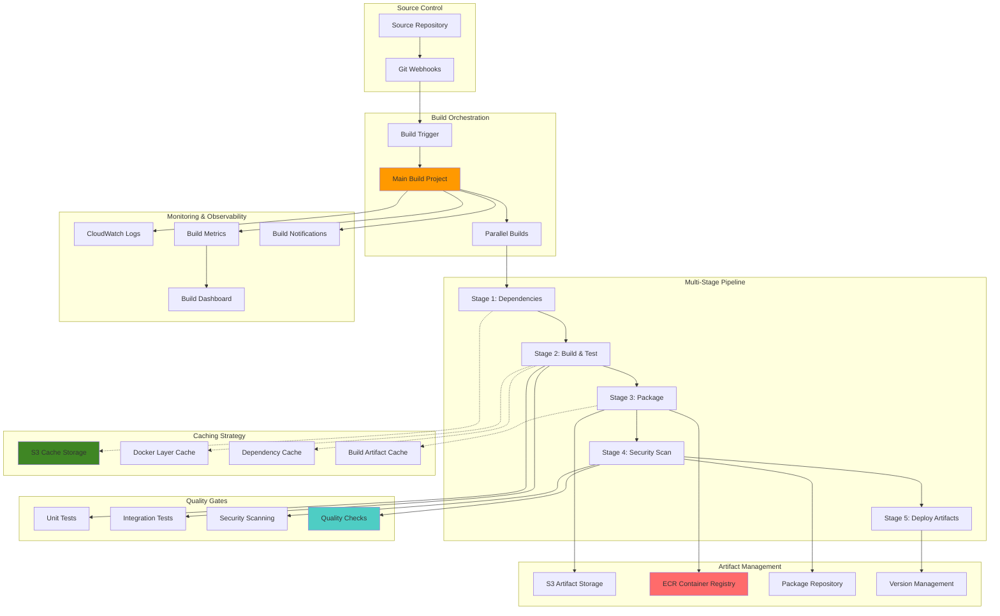

# Building Advanced CodeBuild Pipelines with Multi-Stage Builds, Caching, and Artifacts Management

## Problem

Modern application development requires sophisticated build processes that support multiple environments, complex dependency management, optimization for build speed, and comprehensive artifact management. Traditional CI/CD build systems struggle with long build times, inefficient resource utilization, inconsistent build environments, and lack of advanced features like parallel builds, intelligent caching, and multi-stage optimization. Development teams need build pipelines that can handle complex microservice architectures, containerized applications, and multi-language projects while maintaining fast feedback loops and cost efficiency.

## Solution

AWS CodeBuild provides a comprehensive managed build service that supports advanced pipeline patterns including multi-stage builds, intelligent caching strategies, parallel execution, and sophisticated artifact management. This solution demonstrates how to implement enterprise-grade build pipelines with Docker layer caching, dependency caching, parallel build stages, conditional execution, and integrated testing workflows. The approach optimizes build performance while maintaining security, scalability, and comprehensive observability across all build processes.

## Architecture Diagram



## Prerequisites

1. AWS account with CodeBuild, S3, ECR, IAM, and CloudWatch permissions
2. AWS CLI v2 installed and configured (or AWS CloudShell)
3. Docker knowledge for containerized builds
4. Understanding of multi-stage build patterns and caching strategies
5. Experience with CI/CD pipelines and artifact management
6. Estimated cost: $20-50 for testing builds, ECR storage, and S3 caching

> **Note**: This recipe creates multiple CodeBuild projects with different compute types and caching configurations. Monitor costs and adjust resource allocation based on your actual build requirements.

## Preparation

```bash
# Set environment variables
export AWS_REGION=$(aws configure get region)
export AWS_ACCOUNT_ID=$(aws sts get-caller-identity \
    --query Account --output text)

# Generate unique identifiers for resources
RANDOM_SUFFIX=$(aws secretsmanager get-random-password \
    --exclude-punctuation --exclude-uppercase \
    --password-length 8 --require-each-included-type \
    --output text --query RandomPassword)

export PROJECT_NAME="advanced-build-${RANDOM_SUFFIX}"
export CACHE_BUCKET="codebuild-cache-${RANDOM_SUFFIX}"
export ARTIFACT_BUCKET="build-artifacts-${RANDOM_SUFFIX}"
export ECR_REPOSITORY="app-repository-${RANDOM_SUFFIX}"
export BUILD_ROLE_NAME="CodeBuildAdvancedRole-${RANDOM_SUFFIX}"

# Build project names for different stages
export DEPENDENCY_BUILD_PROJECT="${PROJECT_NAME}-dependencies"
export MAIN_BUILD_PROJECT="${PROJECT_NAME}-main"
export PARALLEL_BUILD_PROJECT="${PROJECT_NAME}-parallel"
export SECURITY_BUILD_PROJECT="${PROJECT_NAME}-security"
export DEPLOY_BUILD_PROJECT="${PROJECT_NAME}-deploy"

echo "✅ Environment variables configured"
echo "Project Name: ${PROJECT_NAME}"
echo "Cache Bucket: ${CACHE_BUCKET}"
echo "Artifact Bucket: ${ARTIFACT_BUCKET}"
echo "ECR Repository: ${ECR_REPOSITORY}"
```

## Steps

1. **Create S3 Buckets for Caching and Artifacts**:

   Amazon S3 serves as the foundation for our advanced caching strategy, providing highly durable (99.999999999% durability) object storage that scales seamlessly to support enterprise build workloads. S3's lifecycle management capabilities enable intelligent cost optimization by automatically transitioning cache data through different storage classes and removing stale artifacts. This setup establishes the storage infrastructure that will dramatically improve build performance through persistent caching across build sessions while maintaining cost efficiency through automated cleanup policies.

   ```bash
   # Create S3 bucket for build caching
   aws s3 mb s3://${CACHE_BUCKET} --region ${AWS_REGION}
   
   # Configure bucket versioning and lifecycle
   aws s3api put-bucket-versioning \
       --bucket ${CACHE_BUCKET} \
       --versioning-configuration Status=Enabled
   
   # Create lifecycle configuration for cache management
   cat > cache-lifecycle.json << 'EOF'
   {
     "Rules": [
       {
         "ID": "CacheCleanup",
         "Status": "Enabled",
         "Filter": {
           "Prefix": "cache/"
         },
         "Expiration": {
           "Days": 30
         },
         "NoncurrentVersionExpiration": {
           "NoncurrentDays": 7
         }
       },
       {
         "ID": "DependencyCache",
         "Status": "Enabled",
         "Filter": {
           "Prefix": "deps/"
         },
         "Expiration": {
           "Days": 90
         }
       }
     ]
   }
   EOF
   
   aws s3api put-bucket-lifecycle-configuration \
       --bucket ${CACHE_BUCKET} \
       --lifecycle-configuration file://cache-lifecycle.json
   
   # Create S3 bucket for build artifacts
   aws s3 mb s3://${ARTIFACT_BUCKET} --region ${AWS_REGION}
   
   # Configure artifact bucket with encryption
   aws s3api put-bucket-encryption \
       --bucket ${ARTIFACT_BUCKET} \
       --server-side-encryption-configuration '{
         "Rules": [
           {
             "ApplyServerSideEncryptionByDefault": {
               "SSEAlgorithm": "AES256"
             }
           }
         ]
       }'
   
   echo "✅ S3 buckets created and configured"
   ```

   The S3 buckets are now operational and ready to serve as the persistent storage layer for our multi-stage caching strategy. The cache bucket will store dependency artifacts, Docker layers, and intermediate build outputs, while the artifact bucket will house final build products, test reports, and deployment manifests. This foundation enables significant build performance improvements through cache reuse across multiple build executions.

   > **Note**: S3 lifecycle policies automatically manage cache retention and costs following [S3 lifecycle best practices](https://docs.aws.amazon.com/AmazonS3/latest/userguide/lifecycle-configuration-examples.html). The dependency cache is retained for 90 days while build artifacts expire after 30 days. This balance ensures cache effectiveness while controlling storage costs.

2. **Create ECR Repository for Container Images**:

   Amazon Elastic Container Registry (ECR) provides a secure, scalable container image registry that integrates seamlessly with CodeBuild for Docker-based workflows. ECR's vulnerability scanning capabilities automatically identify security issues in container images, while lifecycle policies ensure cost-effective storage management. This registry will store our application container images with built-in security scanning and automated cleanup, forming the cornerstone of our containerized deployment strategy.

   ```bash
   # Create ECR repository
   aws ecr create-repository \
       --repository-name ${ECR_REPOSITORY} \
       --image-scanning-configuration scanOnPush=true \
       --encryption-configuration encryptionType=AES256
   
   # Set lifecycle policy for image management
   cat > ecr-lifecycle-policy.json << 'EOF'
   {
     "rules": [
       {
         "rulePriority": 1,
         "description": "Keep last 10 tagged images",
         "selection": {
           "tagStatus": "tagged",
           "countType": "imageCountMoreThan",
           "countNumber": 10
         },
         "action": {
           "type": "expire"
         }
       },
       {
         "rulePriority": 2,
         "description": "Keep untagged images for 1 day",
         "selection": {
           "tagStatus": "untagged",
           "countType": "sinceImagePushed",
           "countUnit": "days",
           "countNumber": 1
         },
         "action": {
           "type": "expire"
         }
       }
     ]
   }
   EOF
   
   aws ecr put-lifecycle-policy \
       --repository-name ${ECR_REPOSITORY} \
       --lifecycle-policy-text file://ecr-lifecycle-policy.json
   
   # Get ECR repository URI
   export ECR_URI=$(aws ecr describe-repositories \
       --repository-names ${ECR_REPOSITORY} \
       --query 'repositories[0].repositoryUri' --output text)
   
   echo "✅ ECR repository created: ${ECR_URI}"
   ```

   The ECR repository is now configured with security scanning enabled and lifecycle policies in place. This provides a secure foundation for storing container images with automatic vulnerability detection and cost optimization. The repository will serve as the central registry for all container artifacts produced by our build pipeline, enabling consistent deployments across environments while maintaining security and compliance standards.

   > **Tip**: ECR lifecycle policies automatically clean up old container images following [ECR lifecycle management best practices](https://docs.aws.amazon.com/AmazonECR/latest/userguide/LifecyclePolicies.html) to manage storage costs. Configure policies based on your deployment patterns and retention requirements for optimal cost control.

3. **Create Advanced IAM Role for CodeBuild**:

   AWS Identity and Access Management (IAM) roles provide secure, temporary credentials to CodeBuild projects following the principle of least privilege. This advanced IAM configuration grants comprehensive permissions for multi-stage builds, caching operations, container registry access, and observability features while maintaining security boundaries. The role enables CodeBuild to interact with multiple AWS services securely without embedding long-term credentials in build environments, supporting [IAM security best practices](https://docs.aws.amazon.com/IAM/latest/UserGuide/best-practices.html) for enterprise CI/CD workflows.

   ```bash
   # Create trust policy for CodeBuild
   cat > codebuild-trust-policy.json << 'EOF'
   {
     "Version": "2012-10-17",
     "Statement": [
       {
         "Effect": "Allow",
         "Principal": {
           "Service": "codebuild.amazonaws.com"
         },
         "Action": "sts:AssumeRole"
       }
     ]
   }
   EOF
   
   # Create IAM role
   aws iam create-role \
       --role-name ${BUILD_ROLE_NAME} \
       --assume-role-policy-document file://codebuild-trust-policy.json \
       --description "Advanced CodeBuild role with comprehensive permissions"
   
   # Create comprehensive policy for advanced builds
   cat > codebuild-advanced-policy.json << EOF
   {
     "Version": "2012-10-17",
     "Statement": [
       {
         "Effect": "Allow",
         "Action": [
           "logs:CreateLogGroup",
           "logs:CreateLogStream",
           "logs:PutLogEvents"
         ],
         "Resource": "arn:aws:logs:*:*:*"
       },
       {
         "Effect": "Allow",
         "Action": [
           "s3:GetObject",
           "s3:GetObjectVersion",
           "s3:PutObject",
           "s3:DeleteObject",
           "s3:ListBucket"
         ],
         "Resource": [
           "arn:aws:s3:::${CACHE_BUCKET}",
           "arn:aws:s3:::${CACHE_BUCKET}/*",
           "arn:aws:s3:::${ARTIFACT_BUCKET}",
           "arn:aws:s3:::${ARTIFACT_BUCKET}/*"
         ]
       },
       {
         "Effect": "Allow",
         "Action": [
           "ecr:BatchCheckLayerAvailability",
           "ecr:GetDownloadUrlForLayer",
           "ecr:BatchGetImage",
           "ecr:GetAuthorizationToken",
           "ecr:PutImage",
           "ecr:InitiateLayerUpload",
           "ecr:UploadLayerPart",
           "ecr:CompleteLayerUpload"
         ],
         "Resource": "*"
       },
       {
         "Effect": "Allow",
         "Action": [
           "codebuild:CreateReportGroup",
           "codebuild:CreateReport",
           "codebuild:UpdateReport",
           "codebuild:BatchPutTestCases",
           "codebuild:BatchPutCodeCoverages"
         ],
         "Resource": "*"
       },
       {
         "Effect": "Allow",
         "Action": [
           "cloudwatch:PutMetricData"
         ],
         "Resource": "*"
       },
       {
         "Effect": "Allow",
         "Action": [
           "codebuild:StartBuild",
           "codebuild:BatchGetBuilds"
         ],
         "Resource": [
           "arn:aws:codebuild:${AWS_REGION}:${AWS_ACCOUNT_ID}:project/${PROJECT_NAME}-*"
         ]
       }
     ]
   }
   EOF
   
   # Create and attach policy
   aws iam create-policy \
       --policy-name CodeBuildAdvancedPolicy-${RANDOM_SUFFIX} \
       --policy-document file://codebuild-advanced-policy.json \
       --description "Comprehensive policy for advanced CodeBuild operations"
   
   aws iam attach-role-policy \
       --role-name ${BUILD_ROLE_NAME} \
       --policy-arn arn:aws:iam::${AWS_ACCOUNT_ID}:policy/CodeBuildAdvancedPolicy-${RANDOM_SUFFIX}
   
   # Get role ARN
   export BUILD_ROLE_ARN=$(aws iam get-role \
       --role-name ${BUILD_ROLE_NAME} \
       --query Role.Arn --output text)
   
   echo "✅ Advanced IAM role created: ${BUILD_ROLE_ARN}"
   ```

   The IAM role is now configured with the necessary permissions to support advanced build operations across multiple AWS services. This role enables secure access to S3 for caching and artifacts, ECR for container operations, CloudWatch for monitoring, and CodeBuild for orchestration. The role follows security best practices by providing only the permissions required for build operations while enabling comprehensive functionality for enterprise-grade CI/CD pipelines.

   > **Warning**: This IAM role has comprehensive permissions for advanced build operations including ECR, S3, and CodeBuild access. Review and customize permissions based on your security requirements and principle of least privilege following [AWS security best practices](https://docs.aws.amazon.com/IAM/latest/UserGuide/best-practices.html).

4. **Create Multi-Stage Build Specifications**:

   AWS CodeBuild build specifications (buildspec files) define the commands and settings for each stage of our multi-stage pipeline. These specifications implement advanced patterns including dependency caching, parallel builds, comprehensive testing, and quality gates. The buildspec files leverage [CodeBuild's flexible build environment capabilities](https://docs.aws.amazon.com/codebuild/latest/userguide/build-spec-ref.html) to optimize performance through intelligent caching while maintaining security and quality standards throughout the build process.

   ```bash
   # Create advanced buildspec for dependency stage
   cat > buildspec-dependencies.yml << 'EOF'
   version: 0.2
   
   env:
     variables:
       CACHE_BUCKET: ""
       NODE_VERSION: "18"
       PYTHON_VERSION: "3.11"
   
   phases:
     install:
       runtime-versions:
         nodejs: $NODE_VERSION
         python: $PYTHON_VERSION
       commands:
         - echo "Installing build dependencies..."
         - apt-get update && apt-get install -y jq curl
         - pip install --upgrade pip
         - npm install -g npm@latest
   
     pre_build:
       commands:
         - echo "Dependency stage started on $(date)"
         - echo "Checking for cached dependencies..."
         - |
           if aws s3 ls s3://$CACHE_BUCKET/deps/package-lock.json; then
             echo "Found cached package-lock.json"
             aws s3 cp s3://$CACHE_BUCKET/deps/package-lock.json ./package-lock.json || true
           fi
         - |
           if aws s3 ls s3://$CACHE_BUCKET/deps/requirements.txt; then
             echo "Found cached requirements.txt"
             aws s3 cp s3://$CACHE_BUCKET/deps/requirements.txt ./requirements.txt || true
           fi
   
     build:
       commands:
         - echo "Installing Node.js dependencies..."
         - |
           if [ -f "package.json" ]; then
             npm ci --cache /tmp/npm-cache
             echo "Caching node_modules..."
             tar -czf node_modules.tar.gz node_modules/
             aws s3 cp node_modules.tar.gz s3://$CACHE_BUCKET/deps/node_modules-$(date +%Y%m%d).tar.gz
           fi
         - echo "Installing Python dependencies..."
         - |
           if [ -f "requirements.txt" ]; then
             pip install -r requirements.txt --cache-dir /tmp/pip-cache
             echo "Caching Python packages..."
             tar -czf python_packages.tar.gz $(python -c "import site; print(site.getsitepackages()[0])")
             aws s3 cp python_packages.tar.gz s3://$CACHE_BUCKET/deps/python-packages-$(date +%Y%m%d).tar.gz
           fi
   
     post_build:
       commands:
         - echo "Dependency installation completed"
         - echo "Updating dependency cache..."
         - |
           if [ -f "package-lock.json" ]; then
             aws s3 cp package-lock.json s3://$CACHE_BUCKET/deps/package-lock.json
           fi
         - |
           if [ -f "requirements.txt" ]; then
             aws s3 cp requirements.txt s3://$CACHE_BUCKET/deps/requirements.txt
           fi
   
   cache:
     paths:
       - '/tmp/npm-cache/**/*'
       - '/tmp/pip-cache/**/*'
       - 'node_modules/**/*'
   
   artifacts:
     files:
       - '**/*'
     name: dependencies-$(date +%Y-%m-%d)
   EOF
   
   # Create main build specification with multi-stage approach
   cat > buildspec-main.yml << 'EOF'
   version: 0.2
   
   env:
     variables:
       CACHE_BUCKET: ""
       ARTIFACT_BUCKET: ""
       ECR_URI: ""
       IMAGE_TAG: "latest"
       DOCKER_BUILDKIT: "1"
   
   phases:
     install:
       runtime-versions:
         docker: 20
         nodejs: 18
         python: 3.11
       commands:
         - echo "Installing build tools..."
         - apt-get update && apt-get install -y jq curl git
         - pip install --upgrade pip pytest pytest-cov black pylint bandit
         - npm install -g eslint prettier jest
   
     pre_build:
       commands:
         - echo "Main build stage started on $(date)"
         - echo "Logging in to Amazon ECR..."
         - aws ecr get-login-password --region $AWS_DEFAULT_REGION | docker login --username AWS --password-stdin $ECR_URI
         - export COMMIT_HASH=$(echo $CODEBUILD_RESOLVED_SOURCE_VERSION | cut -c 1-7)
         - export IMAGE_TAG=${COMMIT_HASH:-latest}
         - echo "Image will be tagged as $IMAGE_TAG"
         
         # Restore cached dependencies
         - echo "Restoring cached dependencies..."
         - |
           if aws s3 ls s3://$CACHE_BUCKET/deps/node_modules-$(date +%Y%m%d).tar.gz; then
             echo "Restoring Node.js dependencies from cache..."
             aws s3 cp s3://$CACHE_BUCKET/deps/node_modules-$(date +%Y%m%d).tar.gz ./node_modules.tar.gz
             tar -xzf node_modules.tar.gz
           fi
         - |
           if aws s3 ls s3://$CACHE_BUCKET/deps/python-packages-$(date +%Y%m%d).tar.gz; then
             echo "Restoring Python packages from cache..."
             aws s3 cp s3://$CACHE_BUCKET/deps/python-packages-$(date +%Y%m%d).tar.gz ./python_packages.tar.gz
             # Extract to site-packages directory
           fi
   
     build:
       commands:
         - echo "Build started on $(date)"
         
         # Code quality checks
         - echo "Running code quality checks..."
         - |
           if [ -f "package.json" ]; then
             echo "Running ESLint..."
             npx eslint src/ --ext .js,.jsx,.ts,.tsx --format json > eslint-report.json || true
             echo "Running Prettier check..."
             npx prettier --check src/ || true
           fi
         - |
           if [ -f "requirements.txt" ]; then
             echo "Running Python linting..."
             find . -name "*.py" -exec pylint {} \; > pylint-report.txt || true
             echo "Running Black formatting check..."
             black --check . || true
             echo "Running Bandit security scan..."
             bandit -r . -f json -o bandit-report.json || true
           fi
         
         # Run tests
         - echo "Running tests..."
         - |
           if [ -f "package.json" ] && grep -q '"test"' package.json; then
             echo "Running Node.js tests..."
             npm test -- --coverage --coverageReporters=json > test-results.json
           fi
         - |
           if [ -f "requirements.txt" ] && find . -name "test_*.py" | head -1; then
             echo "Running Python tests..."
             pytest --cov=. --cov-report=json --cov-report=xml --junit-xml=test-results.xml
           fi
         
         # Build application
         - echo "Building application..."
         - |
           if [ -f "Dockerfile" ]; then
             echo "Building Docker image..."
             docker build --cache-from $ECR_URI:latest \
               --build-arg BUILDKIT_INLINE_CACHE=1 \
               -t $ECR_URI:$IMAGE_TAG \
               -t $ECR_URI:latest .
           fi
         - |
           if [ -f "package.json" ] && grep -q '"build"' package.json; then
             echo "Building Node.js application..."
             npm run build
           fi
         - |
           if [ -f "setup.py" ]; then
             echo "Building Python package..."
             python setup.py bdist_wheel
           fi
         
         # Security scanning
         - echo "Running security scans..."
         - |
           if [ -f "Dockerfile" ]; then
             echo "Scanning Docker image for vulnerabilities..."
             # Install and run trivy or similar tool
             curl -sfL https://raw.githubusercontent.com/aquasecurity/trivy/main/contrib/install.sh | sh -s -- -b /usr/local/bin
             trivy image --exit-code 0 --format json --output trivy-report.json $ECR_URI:$IMAGE_TAG || true
           fi
   
     post_build:
       commands:
         - echo "Build completed on $(date)"
         
         # Push Docker image
         - |
           if [ -f "Dockerfile" ]; then
             echo "Pushing Docker image to ECR..."
             docker push $ECR_URI:$IMAGE_TAG
             docker push $ECR_URI:latest
             echo "Docker image pushed successfully"
           fi
         
         # Upload artifacts
         - echo "Uploading build artifacts..."
         - |
           if [ -d "build" ] || [ -d "dist" ]; then
             echo "Uploading application artifacts..."
             tar -czf app-artifacts-$IMAGE_TAG.tar.gz build/ dist/ || tar -czf app-artifacts-$IMAGE_TAG.tar.gz build/ || tar -czf app-artifacts-$IMAGE_TAG.tar.gz dist/
             aws s3 cp app-artifacts-$IMAGE_TAG.tar.gz s3://$ARTIFACT_BUCKET/artifacts/
           fi
         
         # Upload reports
         - echo "Uploading test and quality reports..."
         - |
           if [ -f "test-results.json" ] || [ -f "test-results.xml" ]; then
             aws s3 cp test-results.* s3://$ARTIFACT_BUCKET/reports/tests/ || true
           fi
         - |
           if [ -f "coverage.json" ] || [ -f "coverage.xml" ]; then
             aws s3 cp coverage.* s3://$ARTIFACT_BUCKET/reports/coverage/ || true
           fi
         - |
           if [ -f "eslint-report.json" ] || [ -f "pylint-report.txt" ]; then
             aws s3 cp *lint-report.* s3://$ARTIFACT_BUCKET/reports/quality/ || true
           fi
         - |
           if [ -f "bandit-report.json" ] || [ -f "trivy-report.json" ]; then
             aws s3 cp *-report.json s3://$ARTIFACT_BUCKET/reports/security/ || true
           fi
         
         # Create build manifest
         - |
           cat > build-manifest.json << EOF
           {
             "buildId": "$CODEBUILD_BUILD_ID",
             "commitHash": "$COMMIT_HASH",
             "imageTag": "$IMAGE_TAG",
             "ecrUri": "$ECR_URI",
             "timestamp": "$(date -u +%Y-%m-%dT%H:%M:%SZ)",
             "artifacts": {
               "image": "$ECR_URI:$IMAGE_TAG",
               "reports": "s3://$ARTIFACT_BUCKET/reports/",
               "artifacts": "s3://$ARTIFACT_BUCKET/artifacts/"
             }
           }
           EOF
         - aws s3 cp build-manifest.json s3://$ARTIFACT_BUCKET/manifests/build-manifest-$IMAGE_TAG.json
   
   reports:
     test_reports:
       files:
         - 'test-results.xml'
         - 'test-results.json'
       file-format: 'JUNITXML'
     code_coverage:
       files:
         - 'coverage.xml'
         - 'coverage.json'
       file-format: 'COBERTURAXML'
   
   cache:
     paths:
       - '/root/.npm/**/*'
       - '/root/.cache/**/*'
       - 'node_modules/**/*'
       - '/var/lib/docker/**/*'
   
   artifacts:
     files:
       - 'build-manifest.json'
       - '**/*'
     name: main-build-$(date +%Y-%m-%d)
   EOF
   
   # Create parallel build specification for multiple architectures
   cat > buildspec-parallel.yml << 'EOF'
   version: 0.2
   
   env:
     variables:
       CACHE_BUCKET: ""
       ECR_URI: ""
       TARGET_ARCH: "amd64"
   
   phases:
     install:
       runtime-versions:
         docker: 20
       commands:
         - echo "Installing Docker buildx for multi-architecture builds..."
         - docker buildx create --use --name multiarch-builder
         - docker buildx inspect --bootstrap
   
     pre_build:
       commands:
         - echo "Parallel build for $TARGET_ARCH started on $(date)"
         - aws ecr get-login-password --region $AWS_DEFAULT_REGION | docker login --username AWS --password-stdin $ECR_URI
         - export COMMIT_HASH=$(echo $CODEBUILD_RESOLVED_SOURCE_VERSION | cut -c 1-7)
         - export IMAGE_TAG=${COMMIT_HASH:-latest}-$TARGET_ARCH
   
     build:
       commands:
         - echo "Building for architecture: $TARGET_ARCH"
         - |
           if [ -f "Dockerfile" ]; then
             docker buildx build --platform linux/$TARGET_ARCH \
               --cache-from $ECR_URI:cache-$TARGET_ARCH \
               --cache-to type=registry,ref=$ECR_URI:cache-$TARGET_ARCH,mode=max \
               -t $ECR_URI:$IMAGE_TAG \
               --push .
           fi
   
     post_build:
       commands:
         - echo "Parallel build for $TARGET_ARCH completed on $(date)"
         - echo "Image: $ECR_URI:$IMAGE_TAG"
   
   artifacts:
     files:
       - '**/*'
     name: parallel-build-$TARGET_ARCH-$(date +%Y-%m-%d)
   EOF
   
   echo "✅ Multi-stage build specifications created"
   ```

   The build specifications are now configured to support advanced multi-stage pipeline patterns with intelligent caching, quality gates, and comprehensive artifact management. These specifications enable dependency isolation in the first stage, comprehensive testing and quality checks in the main stage, and parallel architecture-specific builds for optimal performance. The specifications implement caching strategies that significantly reduce build times while maintaining build reliability and security compliance.

5. **Create CodeBuild Projects for Each Stage**:

   AWS CodeBuild projects provide managed build environments with different compute types and configurations optimized for specific stages of our pipeline. Each project is configured with appropriate caching strategies, timeout settings, and compute resources to maximize performance while controlling costs. The projects implement [CodeBuild caching best practices](https://docs.aws.amazon.com/codebuild/latest/userguide/build-caching.html) to minimize build times and resource consumption across the multi-stage pipeline.

   ```bash
   # Create dependency build project
   aws codebuild create-project \
       --name ${DEPENDENCY_BUILD_PROJECT} \
       --description "Dependency installation and caching stage" \
       --service-role ${BUILD_ROLE_ARN} \
       --artifacts type=S3,location=${ARTIFACT_BUCKET}/dependencies \
       --environment type=LINUX_CONTAINER,image=aws/codebuild/amazonlinux2-x86_64-standard:4.0,computeType=BUILD_GENERAL1_MEDIUM,privilegedMode=false \
       --source type=S3,location=${ARTIFACT_BUCKET}/source/source.zip,buildspec=buildspec-dependencies.yml \
       --cache type=S3,location=${CACHE_BUCKET}/dependency-cache \
       --timeout-in-minutes 30 \
       --tags key=Project,value=${PROJECT_NAME} key=Stage,value=Dependencies
   
   # Create main build project with enhanced compute
   aws codebuild create-project \
       --name ${MAIN_BUILD_PROJECT} \
       --description "Main build stage with testing and quality checks" \
       --service-role ${BUILD_ROLE_ARN} \
       --artifacts type=S3,location=${ARTIFACT_BUCKET}/main-build \
       --environment type=LINUX_CONTAINER,image=aws/codebuild/amazonlinux2-x86_64-standard:4.0,computeType=BUILD_GENERAL1_LARGE,privilegedMode=true \
       --source type=S3,location=${ARTIFACT_BUCKET}/source/source.zip,buildspec=buildspec-main.yml \
       --cache type=S3,location=${CACHE_BUCKET}/main-cache \
       --timeout-in-minutes 60 \
       --tags key=Project,value=${PROJECT_NAME} key=Stage,value=MainBuild
   
   # Create parallel build project for multi-architecture
   aws codebuild create-project \
       --name ${PARALLEL_BUILD_PROJECT} \
       --description "Parallel build for multiple architectures" \
       --service-role ${BUILD_ROLE_ARN} \
       --artifacts type=S3,location=${ARTIFACT_BUCKET}/parallel-build \
       --environment type=LINUX_CONTAINER,image=aws/codebuild/amazonlinux2-x86_64-standard:4.0,computeType=BUILD_GENERAL1_MEDIUM,privilegedMode=true \
       --source type=S3,location=${ARTIFACT_BUCKET}/source/source.zip,buildspec=buildspec-parallel.yml \
       --cache type=S3,location=${CACHE_BUCKET}/parallel-cache \
       --timeout-in-minutes 45 \
       --tags key=Project,value=${PROJECT_NAME} key=Stage,value=ParallelBuild
   
   echo "✅ CodeBuild projects created for multi-stage pipeline"
   ```

   The CodeBuild projects are now operational with optimized configurations for each pipeline stage. The dependency project uses medium compute for efficient package management, the main project uses large compute for comprehensive testing and building, and the parallel project uses medium compute for architecture-specific builds. Each project is configured with appropriate caching, timeouts, and security settings to ensure optimal performance and cost efficiency.

6. **Create Build Orchestration Lambda Function**:

   AWS Lambda provides serverless compute capabilities for orchestrating complex multi-stage build workflows. This orchestration function coordinates the execution of multiple CodeBuild projects, manages dependencies between stages, and provides comprehensive monitoring and error handling. Lambda's event-driven architecture enables efficient resource utilization while supporting sophisticated pipeline patterns including conditional execution, parallel processing, and comprehensive logging for enterprise build operations.

   ```bash
   # Create Lambda function for build orchestration
   cat > build-orchestrator.py << 'EOF'
   import json
   import boto3
   import logging
   from datetime import datetime
   import time
   
   logger = logging.getLogger()
   logger.setLevel(logging.INFO)
   
   codebuild = boto3.client('codebuild')
   s3 = boto3.client('s3')
   cloudwatch = boto3.client('cloudwatch')
   
   def lambda_handler(event, context):
       """
       Orchestrate multi-stage CodeBuild pipeline
       """
       try:
           logger.info(f"Build orchestration started: {json.dumps(event)}")
           
           # Extract build parameters
           build_config = event.get('buildConfig', {})
           source_location = build_config.get('sourceLocation')
           parallel_builds = build_config.get('parallelBuilds', ['amd64'])
           
           if not source_location:
               return {'statusCode': 400, 'body': 'Source location required'}
           
           # Execute build pipeline stages
           pipeline_result = execute_build_pipeline(source_location, parallel_builds)
           
           # Record pipeline metrics
           record_pipeline_metrics(pipeline_result)
           
           return {
               'statusCode': 200,
               'body': json.dumps(pipeline_result)
           }
           
       except Exception as e:
           logger.error(f"Error in build orchestration: {str(e)}")
           return {'statusCode': 500, 'body': f'Error: {str(e)}'}
   
   def execute_build_pipeline(source_location, parallel_builds):
       """Execute the complete build pipeline"""
       
       pipeline_id = f"pipeline-{int(time.time())}"
       results = {
           'pipelineId': pipeline_id,
           'startTime': datetime.utcnow().isoformat(),
           'stages': {}
       }
       
       try:
           # Stage 1: Dependencies
           logger.info("Starting dependency stage...")
           dep_result = start_build_stage('dependencies', source_location)
           results['stages']['dependencies'] = dep_result
           
           if dep_result['status'] != 'SUCCEEDED':
               raise Exception(f"Dependency stage failed: {dep_result}")
           
           # Stage 2: Main Build
           logger.info("Starting main build stage...")
           main_result = start_build_stage('main', source_location)
           results['stages']['main'] = main_result
           
           if main_result['status'] != 'SUCCEEDED':
               raise Exception(f"Main build stage failed: {main_result}")
           
           # Stage 3: Parallel Builds
           logger.info("Starting parallel build stages...")
           parallel_results = []
           
           for arch in parallel_builds:
               parallel_result = start_build_stage('parallel', source_location, {'TARGET_ARCH': arch})
               parallel_results.append(parallel_result)
           
           results['stages']['parallel'] = parallel_results
           
           # Check parallel build results
           failed_parallel = [r for r in parallel_results if r['status'] != 'SUCCEEDED']
           if failed_parallel:
               logger.warning(f"Some parallel builds failed: {failed_parallel}")
           
           # Overall pipeline result
           all_succeeded = (dep_result['status'] == 'SUCCEEDED' and 
                           main_result['status'] == 'SUCCEEDED' and 
                           all(r['status'] == 'SUCCEEDED' for r in parallel_results))
           
           results['overallStatus'] = 'SUCCEEDED' if all_succeeded else 'FAILED'
           results['endTime'] = datetime.utcnow().isoformat()
           
           # Store pipeline results
           store_pipeline_results(results)
           
           return results
           
       except Exception as e:
           logger.error(f"Pipeline execution failed: {str(e)}")
           results['overallStatus'] = 'FAILED'
           results['error'] = str(e)
           results['endTime'] = datetime.utcnow().isoformat()
           return results
   
   def start_build_stage(stage, source_location, env_overrides=None):
       """Start a specific build stage"""
       
       project_mapping = {
           'dependencies': os.environ['DEPENDENCY_BUILD_PROJECT'],
           'main': os.environ['MAIN_BUILD_PROJECT'],
           'parallel': os.environ['PARALLEL_BUILD_PROJECT']
       }
       
       project_name = project_mapping.get(stage)
       if not project_name:
           raise ValueError(f"Unknown build stage: {stage}")
       
       try:
           # Prepare environment variables
           env_vars = [
               {'name': 'CACHE_BUCKET', 'value': os.environ['CACHE_BUCKET']},
               {'name': 'ARTIFACT_BUCKET', 'value': os.environ['ARTIFACT_BUCKET']},
               {'name': 'ECR_URI', 'value': os.environ['ECR_URI']}
           ]
           
           # Add stage-specific overrides
           if env_overrides:
               for key, value in env_overrides.items():
                   env_vars.append({'name': key, 'value': value})
           
           # Start build
           response = codebuild.start_build(
               projectName=project_name,
               sourceLocationOverride=source_location,
               environmentVariablesOverride=env_vars
           )
           
           build_id = response['build']['id']
           logger.info(f"Started {stage} build: {build_id}")
           
           # Wait for build completion (simplified for demo)
           # In production, this would be handled asynchronously
           build_result = wait_for_build_completion(build_id)
           
           return {
               'stage': stage,
               'buildId': build_id,
               'status': build_result['buildStatus'],
               'startTime': build_result['startTime'].isoformat(),
               'endTime': build_result.get('endTime', datetime.utcnow()).isoformat(),
               'duration': calculate_duration(build_result)
           }
           
       except Exception as e:
           logger.error(f"Error starting {stage} build: {str(e)}")
           return {
               'stage': stage,
               'status': 'FAILED',
               'error': str(e)
           }
   
   def wait_for_build_completion(build_id, max_wait_time=3600):
       """Wait for build to complete (simplified implementation)"""
       
       start_time = time.time()
       
       while time.time() - start_time < max_wait_time:
           try:
               response = codebuild.batch_get_builds(ids=[build_id])
               build = response['builds'][0]
               
               status = build['buildStatus']
               
               if status in ['SUCCEEDED', 'FAILED', 'FAULT', 'STOPPED', 'TIMED_OUT']:
                   return build
               
               # Wait before next check
               time.sleep(30)
               
           except Exception as e:
               logger.error(f"Error checking build status: {str(e)}")
               time.sleep(30)
       
       # Timeout reached
       return {
           'buildStatus': 'TIMED_OUT',
           'startTime': datetime.utcnow(),
           'endTime': datetime.utcnow()
       }
   
   def calculate_duration(build_result):
       """Calculate build duration in seconds"""
       try:
           start_time = build_result.get('startTime')
           end_time = build_result.get('endTime')
           
           if start_time and end_time:
               if isinstance(start_time, str):
                   start_time = datetime.fromisoformat(start_time.replace('Z', '+00:00'))
               if isinstance(end_time, str):
                   end_time = datetime.fromisoformat(end_time.replace('Z', '+00:00'))
               
               duration = (end_time - start_time).total_seconds()
               return max(0, duration)
           
           return 0
           
       except Exception as e:
           logger.error(f"Error calculating duration: {str(e)}")
           return 0
   
   def store_pipeline_results(results):
       """Store pipeline results in S3"""
       try:
           bucket = os.environ['ARTIFACT_BUCKET']
           key = f"pipeline-results/{results['pipelineId']}.json"
           
           s3.put_object(
               Bucket=bucket,
               Key=key,
               Body=json.dumps(results, indent=2),
               ContentType='application/json'
           )
           
           logger.info(f"Pipeline results stored: s3://{bucket}/{key}")
           
       except Exception as e:
           logger.error(f"Error storing pipeline results: {str(e)}")
   
   def record_pipeline_metrics(results):
       """Record pipeline metrics to CloudWatch"""
       try:
           metrics = []
           
           # Overall pipeline result
           metrics.append({
               'MetricName': 'PipelineExecutions',
               'Value': 1,
               'Unit': 'Count',
               'Dimensions': [
                   {'Name': 'Status', 'Value': results['overallStatus']}
               ]
           })
           
           # Stage-specific metrics
           for stage_name, stage_result in results['stages'].items():
               if isinstance(stage_result, list):
                   # Handle parallel builds
                   for build in stage_result:
                       if 'duration' in build:
                           metrics.append({
                               'MetricName': 'BuildDuration',
                               'Value': build['duration'],
                               'Unit': 'Seconds',
                               'Dimensions': [
                                   {'Name': 'Stage', 'Value': stage_name},
                                   {'Name': 'Status', 'Value': build['status']}
                               ]
                           })
               else:
                   if 'duration' in stage_result:
                       metrics.append({
                           'MetricName': 'BuildDuration',
                           'Value': stage_result['duration'],
                           'Unit': 'Seconds',
                           'Dimensions': [
                               {'Name': 'Stage', 'Value': stage_name},
                               {'Name': 'Status', 'Value': stage_result['status']}
                           ]
                       })
           
           # Send metrics to CloudWatch
           cloudwatch.put_metric_data(
               Namespace='CodeBuild/AdvancedPipeline',
               MetricData=metrics
           )
           
       except Exception as e:
           logger.error(f"Error recording metrics: {str(e)}")
   
   import os
   EOF
   
   # Package Lambda function
   zip build-orchestrator.zip build-orchestrator.py
   
   # Create Lambda function
   aws lambda create-function \
       --function-name "${PROJECT_NAME}-orchestrator" \
       --runtime python3.9 \
       --role ${BUILD_ROLE_ARN} \
       --handler build-orchestrator.lambda_handler \
       --zip-file fileb://build-orchestrator.zip \
       --timeout 900 \
       --memory-size 512 \
       --environment Variables="{
           DEPENDENCY_BUILD_PROJECT=${DEPENDENCY_BUILD_PROJECT},
           MAIN_BUILD_PROJECT=${MAIN_BUILD_PROJECT},
           PARALLEL_BUILD_PROJECT=${PARALLEL_BUILD_PROJECT},
           CACHE_BUCKET=${CACHE_BUCKET},
           ARTIFACT_BUCKET=${ARTIFACT_BUCKET},
           ECR_URI=${ECR_URI}
       }" \
       --description "Orchestrate multi-stage CodeBuild pipeline"
   
   echo "✅ Build orchestration Lambda function created"
   ```

   The orchestration Lambda function is now deployed and ready to coordinate multi-stage build executions. This function provides intelligent pipeline management including stage dependency handling, parallel build coordination, comprehensive error recovery, and detailed metrics collection. The orchestrator enables sophisticated build patterns while maintaining visibility and control over the entire pipeline execution process.

7. **Create Sample Application with Advanced Build Configuration**:

   This sample application demonstrates advanced build patterns including multi-language support, comprehensive testing, security scanning, and containerization. The application includes Node.js and Python components with complete test suites, security configurations, and Docker multi-stage builds that showcase the capabilities of our advanced CodeBuild pipeline. The configuration implements industry best practices for modern application development including code quality checks, security scanning, and comprehensive artifact generation.

   ```bash
   # Create sample application directory
   mkdir -p sample-app/{src,tests,docker}
   cd sample-app
   
   # Create package.json for Node.js application
   cat > package.json << 'EOF'
   {
     "name": "advanced-build-sample",
     "version": "1.0.0",
     "description": "Sample application for advanced CodeBuild pipeline",
     "main": "src/index.js",
     "scripts": {
       "start": "node src/index.js",
       "build": "npm run build:production",
       "build:production": "webpack --mode production",
       "test": "jest --coverage",
       "lint": "eslint src/",
       "format": "prettier --write src/"
     },
     "dependencies": {
       "express": "^4.18.2",
       "helmet": "^6.0.1",
       "morgan": "^1.10.0"
     },
     "devDependencies": {
       "jest": "^29.5.0",
       "eslint": "^8.39.0",
       "prettier": "^2.8.8",
       "webpack": "^5.82.1",
       "webpack-cli": "^5.1.1",
       "@jest/globals": "^29.5.0"
     },
     "jest": {
       "testEnvironment": "node",
       "coverageDirectory": "coverage",
       "coverageReporters": ["json", "lcov", "text", "clover"]
     }
   }
   EOF
   
   # Create Python requirements
   cat > requirements.txt << 'EOF'
   flask==2.3.2
   gunicorn==20.1.0
   pytest==7.3.1
   pytest-cov==4.1.0
   black==23.3.0
   pylint==2.17.4
   bandit==1.7.5
   safety==2.3.5
   EOF
   
   # Create Node.js application
   cat > src/index.js << 'EOF'
   const express = require('express');
   const helmet = require('helmet');
   const morgan = require('morgan');
   
   const app = express();
   const port = process.env.PORT || 3000;
   
   // Security middleware
   app.use(helmet());
   
   // Logging middleware
   app.use(morgan('combined'));
   
   // JSON parsing
   app.use(express.json());
   
   // Health check endpoint
   app.get('/health', (req, res) => {
     res.status(200).json({
       status: 'healthy',
       timestamp: new Date().toISOString(),
       version: process.env.npm_package_version || '1.0.0'
     });
   });
   
   // Main application endpoint
   app.get('/', (req, res) => {
     res.json({
       message: 'Advanced CodeBuild Pipeline Demo',
       version: process.env.npm_package_version || '1.0.0',
       environment: process.env.NODE_ENV || 'development'
     });
   });
   
   // API endpoints
   app.get('/api/data', (req, res) => {
     res.json({
       data: [
         { id: 1, name: 'Item 1', value: Math.random() },
         { id: 2, name: 'Item 2', value: Math.random() },
         { id: 3, name: 'Item 3', value: Math.random() }
       ],
       timestamp: new Date().toISOString()
     });
   });
   
   // Error handling middleware
   app.use((err, req, res, next) => {
     console.error(err.stack);
     res.status(500).json({ error: 'Something went wrong!' });
   });
   
   // Start server
   if (require.main === module) {
     app.listen(port, () => {
       console.log(`Server running on port ${port}`);
     });
   }
   
   module.exports = app;
   EOF
   
   # Create Python Flask application
   cat > src/app.py << 'EOF'
   """
   Sample Flask application for advanced CodeBuild pipeline
   """
   
   from flask import Flask, jsonify
   import os
   import random
   from datetime import datetime
   
   app = Flask(__name__)
   
   @app.route('/health')
   def health_check():
       """Health check endpoint"""
       return jsonify({
           'status': 'healthy',
           'timestamp': datetime.utcnow().isoformat(),
           'version': '1.0.0'
       })
   
   @app.route('/')
   def home():
       """Main application endpoint"""
       return jsonify({
           'message': 'Advanced CodeBuild Pipeline Demo (Python)',
           'version': '1.0.0',
           'environment': os.environ.get('FLASK_ENV', 'development')
       })
   
   @app.route('/api/data')
   def get_data():
       """API endpoint returning sample data"""
       return jsonify({
           'data': [
               {'id': 1, 'name': 'Item 1', 'value': random.random()},
               {'id': 2, 'name': 'Item 2', 'value': random.random()},
               {'id': 3, 'name': 'Item 3', 'value': random.random()}
           ],
           'timestamp': datetime.utcnow().isoformat()
       })
   
   if __name__ == '__main__':
       port = int(os.environ.get('PORT', 5000))
       app.run(host='0.0.0.0', port=port, debug=False)
   EOF
   
   # Create tests
   cat > tests/test_app.js << 'EOF'
   const request = require('supertest');
   const app = require('../src/index');
   
   describe('Application Tests', () => {
     test('Health check endpoint', async () => {
       const response = await request(app).get('/health');
       expect(response.status).toBe(200);
       expect(response.body.status).toBe('healthy');
     });
   
     test('Main endpoint', async () => {
       const response = await request(app).get('/');
       expect(response.status).toBe(200);
       expect(response.body.message).toContain('Advanced CodeBuild');
     });
   
     test('API data endpoint', async () => {
       const response = await request(app).get('/api/data');
       expect(response.status).toBe(200);
       expect(Array.isArray(response.body.data)).toBe(true);
       expect(response.body.data.length).toBe(3);
     });
   });
   EOF
   
   cat > tests/test_app.py << 'EOF'
   """
   Tests for Flask application
   """
   
   import pytest
   import sys
   import os
   
   # Add src directory to path
   sys.path.insert(0, os.path.join(os.path.dirname(__file__), '..', 'src'))
   
   from app import app
   
   @pytest.fixture
   def client():
       """Create test client"""
       app.config['TESTING'] = True
       with app.test_client() as client:
           yield client
   
   def test_health_check(client):
       """Test health check endpoint"""
       response = client.get('/health')
       assert response.status_code == 200
       data = response.get_json()
       assert data['status'] == 'healthy'
   
   def test_home_endpoint(client):
       """Test main endpoint"""
       response = client.get('/')
       assert response.status_code == 200
       data = response.get_json()
       assert 'Advanced CodeBuild' in data['message']
   
   def test_api_data_endpoint(client):
       """Test API data endpoint"""
       response = client.get('/api/data')
       assert response.status_code == 200
       data = response.get_json()
       assert isinstance(data['data'], list)
       assert len(data['data']) == 3
   EOF
   
   # Create multi-stage Dockerfile
   cat > Dockerfile << 'EOF'
   # Multi-stage build for Node.js and Python
   FROM node:18-alpine AS node-builder
   WORKDIR /app
   COPY package*.json ./
   RUN npm ci --only=production
   COPY src/ ./src/
   RUN npm run build || echo "No build script, skipping..."
   
   FROM python:3.11-slim AS python-builder
   WORKDIR /app
   COPY requirements.txt .
   RUN pip install --no-cache-dir -r requirements.txt
   COPY src/ ./src/
   
   # Final stage
   FROM python:3.11-slim
   
   # Install Node.js for dual language support
   RUN apt-get update && apt-get install -y \
       curl \
       && curl -fsSL https://deb.nodesource.com/setup_18.x | bash - \
       && apt-get install -y nodejs \
       && rm -rf /var/lib/apt/lists/*
   
   WORKDIR /app
   
   # Copy Python dependencies
   COPY --from=python-builder /usr/local/lib/python3.11/site-packages /usr/local/lib/python3.11/site-packages
   COPY --from=python-builder /usr/local/bin /usr/local/bin
   
   # Copy Node.js dependencies
   COPY --from=node-builder /app/node_modules ./node_modules
   COPY --from=node-builder /app/src ./src
   
   # Copy source code
   COPY src/ ./src/
   
   # Create non-root user
   RUN useradd -m -u 1000 appuser && chown -R appuser:appuser /app
   USER appuser
   
   EXPOSE 3000 5000
   
   # Health check
   HEALTHCHECK --interval=30s --timeout=3s --start-period=5s --retries=3 \
     CMD curl -f http://localhost:3000/health || curl -f http://localhost:5000/health || exit 1
   
   # Default command (can be overridden)
   CMD ["python", "src/app.py"]
   EOF
   
   # Create .dockerignore
   cat > .dockerignore << 'EOF'
   node_modules
   npm-debug.log
   .git
   .gitignore
   README.md
   .env
   .nyc_output
   coverage
   .coverage
   tests/
   __pycache__
   *.pyc
   *.pyo
   *.pyd
   .pytest_cache
   EOF
   
   # Create webpack configuration
   cat > webpack.config.js << 'EOF'
   const path = require('path');
   
   module.exports = {
     entry: './src/index.js',
     output: {
       path: path.resolve(__dirname, 'dist'),
       filename: 'bundle.js',
     },
     mode: 'production',
     target: 'node',
     externals: {
       express: 'express'
     }
   };
   EOF
   
   # Copy buildspecs to sample app
   cp ../buildspec-*.yml .
   
   # Create source archive
   tar -czf ../sample-app-source.tar.gz .
   aws s3 cp ../sample-app-source.tar.gz s3://${ARTIFACT_BUCKET}/source/source.zip
   
   cd ..
   rm -rf sample-app
   
   echo "✅ Sample application created and uploaded to S3"
   ```

   The sample application is now available in S3 with comprehensive build configurations that demonstrate advanced pipeline capabilities. The application includes multi-language support, complete test suites, security scanning integration, and Docker containerization that will exercise all aspects of our advanced build pipeline. This foundation enables testing and validation of the entire multi-stage build process including caching, parallel builds, and artifact management.

8. **Create CloudWatch Dashboard for Build Monitoring**:

   Amazon CloudWatch provides comprehensive monitoring and observability for our build pipeline through custom dashboards, metrics, and log analysis. This dashboard visualizes key performance indicators including build success rates, duration trends, cache effectiveness, and resource utilization patterns. The monitoring setup enables data-driven optimization of build performance while providing operational visibility into pipeline health and efficiency metrics that support continuous improvement initiatives.

   ```bash
   # Create comprehensive monitoring dashboard
   cat > build-monitoring-dashboard.json << EOF
   {
     "widgets": [
       {
         "type": "metric",
         "x": 0,
         "y": 0,
         "width": 12,
         "height": 6,
         "properties": {
           "metrics": [
             ["CodeBuild/AdvancedPipeline", "PipelineExecutions", "Status", "SUCCEEDED"],
             [".", ".", ".", "FAILED"]
           ],
           "period": 300,
           "stat": "Sum",
           "region": "${AWS_REGION}",
           "title": "Pipeline Execution Results"
         }
       },
       {
         "type": "metric",
         "x": 12,
         "y": 0,
         "width": 12,
         "height": 6,
         "properties": {
           "metrics": [
             ["CodeBuild/AdvancedPipeline", "BuildDuration", "Stage", "dependencies"],
             [".", ".", ".", "main"],
             [".", ".", ".", "parallel"]
           ],
           "period": 300,
           "stat": "Average",
           "region": "${AWS_REGION}",
           "title": "Average Build Duration by Stage"
         }
       },
       {
         "type": "metric",
         "x": 0,
         "y": 6,
         "width": 8,
         "height": 6,
         "properties": {
           "metrics": [
             ["AWS/CodeBuild", "Duration", "ProjectName", "${DEPENDENCY_BUILD_PROJECT}"],
             [".", ".", ".", "${MAIN_BUILD_PROJECT}"],
             [".", ".", ".", "${PARALLEL_BUILD_PROJECT}"]
           ],
           "period": 300,
           "stat": "Average",
           "region": "${AWS_REGION}",
           "title": "CodeBuild Project Durations"
         }
       },
       {
         "type": "metric",
         "x": 8,
         "y": 6,
         "width": 8,
         "height": 6,
         "properties": {
           "metrics": [
             ["AWS/CodeBuild", "Builds", "ProjectName", "${DEPENDENCY_BUILD_PROJECT}"],
             [".", ".", ".", "${MAIN_BUILD_PROJECT}"],
             [".", ".", ".", "${PARALLEL_BUILD_PROJECT}"]
           ],
           "period": 300,
           "stat": "Sum",
           "region": "${AWS_REGION}",
           "title": "Build Count by Project"
         }
       },
       {
         "type": "log",
         "x": 16,
         "y": 6,
         "width": 8,
         "height": 6,
         "properties": {
           "query": "SOURCE '/aws/codebuild/${MAIN_BUILD_PROJECT}'\n| fields @timestamp, @message\n| filter @message like /ERROR/ or @message like /FAILED/\n| sort @timestamp desc\n| limit 20",
           "region": "${AWS_REGION}",
           "title": "Recent Build Errors"
         }
       },
       {
         "type": "metric",
         "x": 0,
         "y": 12,
         "width": 12,
         "height": 6,
         "properties": {
           "metrics": [
             ["AWS/S3", "BucketSizeBytes", "BucketName", "${CACHE_BUCKET}", "StorageType", "StandardStorage"],
             [".", ".", "${ARTIFACT_BUCKET}", ".", "."]
           ],
           "period": 86400,
           "stat": "Average",
           "region": "${AWS_REGION}",
           "title": "Storage Usage (Cache and Artifacts)"
         }
       },
       {
         "type": "metric",
         "x": 12,
         "y": 12,
         "width": 12,
         "height": 6,
         "properties": {
           "metrics": [
             ["AWS/Lambda", "Duration", "FunctionName", "${PROJECT_NAME}-orchestrator"],
             [".", "Invocations", ".", "."],
             [".", "Errors", ".", "."]
           ],
           "period": 300,
           "stat": "Sum",
           "region": "${AWS_REGION}",
           "title": "Build Orchestrator Performance"
         }
       }
     ]
   }
   EOF
   
   # Create dashboard
   aws cloudwatch put-dashboard \
       --dashboard-name "Advanced-CodeBuild-${PROJECT_NAME}" \
       --dashboard-body file://build-monitoring-dashboard.json
   
   echo "✅ CloudWatch monitoring dashboard created"
   ```

   The CloudWatch dashboard is now operational, providing real-time visibility into build pipeline performance and health metrics. This comprehensive monitoring solution enables proactive identification of performance bottlenecks, cache efficiency trends, and resource utilization patterns. The dashboard supports operational excellence by providing the insights needed to continuously optimize build performance and maintain high availability for development teams.

9. **Create Build Optimization and Cache Management**:

   Automated cache management ensures optimal storage utilization and cost efficiency through intelligent cleanup policies and optimization algorithms. This Lambda-based solution monitors cache usage patterns, identifies stale entries, and implements automated cleanup based on configurable retention policies. The system supports [S3 storage optimization best practices](https://docs.aws.amazon.com/AmazonS3/latest/userguide/lifecycle-transition-general-considerations.html) while maintaining cache effectiveness for improved build performance.

   ```bash
   # Create cache management Lambda function
   cat > cache-manager.py << 'EOF'
   import json
   import boto3
   import logging
   from datetime import datetime, timedelta
   
   logger = logging.getLogger()
   logger.setLevel(logging.INFO)
   
   s3 = boto3.client('s3')
   
   def lambda_handler(event, context):
       """
       Manage build caches and optimization
       """
       try:
           cache_bucket = event.get('cacheBucket', os.environ.get('CACHE_BUCKET'))
           if not cache_bucket:
               return {'statusCode': 400, 'body': 'Cache bucket not specified'}
           
           # Perform cache optimization
           optimization_results = optimize_cache(cache_bucket)
           
           return {
               'statusCode': 200,
               'body': json.dumps(optimization_results)
           }
           
       except Exception as e:
           logger.error(f"Error in cache management: {str(e)}")
           return {'statusCode': 500, 'body': f'Error: {str(e)}'}
   
   def optimize_cache(bucket_name):
       """Optimize cache storage and remove stale entries"""
       
       results = {
           'bucket': bucket_name,
           'optimization_date': datetime.utcnow().isoformat(),
           'actions': []
       }
       
       try:
           # List all objects in cache bucket
           paginator = s3.get_paginator('list_objects_v2')
           
           for page in paginator.paginate(Bucket=bucket_name):
               if 'Contents' not in page:
                   continue
               
               for obj in page['Contents']:
                   key = obj['Key']
                   last_modified = obj['LastModified']
                   size = obj['Size']
                   
                   # Check if cache entry is stale
                   if is_cache_stale(key, last_modified):
                       # Delete stale cache entry
                       s3.delete_object(Bucket=bucket_name, Key=key)
                       results['actions'].append({
                           'action': 'deleted',
                           'key': key,
                           'reason': 'stale_cache',
                           'size': size
                       })
                   
                   # Check for duplicate cache entries
                   elif is_duplicate_cache(key):
                       # Mark for consolidation
                       results['actions'].append({
                           'action': 'marked_for_consolidation',
                           'key': key,
                           'size': size
                       })
           
           # Calculate optimization summary
           deleted_count = len([a for a in results['actions'] if a['action'] == 'deleted'])
           total_size_freed = sum(a['size'] for a in results['actions'] if a['action'] == 'deleted')
           
           results['summary'] = {
               'deleted_entries': deleted_count,
               'size_freed_bytes': total_size_freed,
               'total_actions': len(results['actions'])
           }
           
           logger.info(f"Cache optimization completed: {results['summary']}")
           
           return results
           
       except Exception as e:
           logger.error(f"Error optimizing cache: {str(e)}")
           results['error'] = str(e)
           return results
   
   def is_cache_stale(key, last_modified):
       """Check if cache entry is stale"""
       
       # Define staleness criteria based on cache type
       staleness_rules = {
           'deps/node_modules': 30,  # 30 days for Node.js dependencies
           'deps/python-packages': 30,  # 30 days for Python packages
           'cache/docker': 14,  # 14 days for Docker layer cache
           'cache/build': 7,    # 7 days for build artifacts
       }
       
       # Determine cache type from key
       cache_type = None
       for prefix, max_age in staleness_rules.items():
           if key.startswith(prefix):
               cache_type = prefix
               max_age_days = max_age
               break
       
       if not cache_type:
           # Default staleness for unknown cache types
           max_age_days = 14
       
       # Check if older than threshold
       threshold_date = datetime.utcnow() - timedelta(days=max_age_days)
       
       # Convert last_modified to timezone-naive datetime for comparison
       if last_modified.tzinfo:
           last_modified = last_modified.replace(tzinfo=None)
       
       return last_modified < threshold_date
   
   def is_duplicate_cache(key):
       """Check if cache entry appears to be a duplicate"""
       
       # Simple heuristic: check for date-stamped duplicates
       # This would be more sophisticated in a real implementation
       
       if 'node_modules-' in key and key.count('-') > 1:
           return True
       
       if 'python-packages-' in key and key.count('-') > 2:
           return True
       
       return False
   
   import os
   EOF
   
   # Package cache manager function
   zip cache-manager.zip cache-manager.py
   
   # Create cache manager Lambda function
   aws lambda create-function \
       --function-name "${PROJECT_NAME}-cache-manager" \
       --runtime python3.9 \
       --role ${BUILD_ROLE_ARN} \
       --handler cache-manager.lambda_handler \
       --zip-file fileb://cache-manager.zip \
       --timeout 300 \
       --memory-size 256 \
       --environment Variables="{CACHE_BUCKET=${CACHE_BUCKET}}" \
       --description "Manage and optimize CodeBuild caches"
   
   # Create EventBridge rule for scheduled cache optimization
   aws events put-rule \
       --name "cache-optimization-${RANDOM_SUFFIX}" \
       --description "Daily cache optimization" \
       --schedule-expression "rate(1 day)"
   
   # Add Lambda target to EventBridge rule
   CACHE_MANAGER_ARN=$(aws lambda get-function \
       --function-name "${PROJECT_NAME}-cache-manager" \
       --query Configuration.FunctionArn --output text)
   
   aws events put-targets \
       --rule "cache-optimization-${RANDOM_SUFFIX}" \
       --targets "Id"="1","Arn"="${CACHE_MANAGER_ARN}"
   
   # Add permission for EventBridge to invoke Lambda
   aws lambda add-permission \
       --function-name "${PROJECT_NAME}-cache-manager" \
       --statement-id "eventbridge-invoke" \
       --action "lambda:InvokeFunction" \
       --principal events.amazonaws.com \
       --source-arn "arn:aws:events:${AWS_REGION}:${AWS_ACCOUNT_ID}:rule/cache-optimization-${RANDOM_SUFFIX}"
   
   echo "✅ Cache management and optimization configured"
   ```

   The automated cache management system is now operational with scheduled optimization runs and intelligent cleanup policies. This system continuously monitors cache usage patterns and automatically removes stale entries while preserving frequently accessed artifacts. The solution ensures optimal balance between cache effectiveness and storage costs through automated lifecycle management and intelligent retention policies.

10. **Test Advanced Build Pipeline**:

    Testing validates the complete multi-stage pipeline functionality including orchestration, caching, parallel builds, and artifact management. This comprehensive test suite exercises all pipeline components to ensure proper integration and performance optimization. The testing process validates [CodeBuild environment variables and build coordination](https://docs.aws.amazon.com/codebuild/latest/userguide/build-env-ref-env-vars.html) while confirming that caching strategies and parallel execution patterns function correctly across the entire pipeline.

    ```bash
    # Test the build orchestration
    cat > test-build-event.json << EOF
    {
      "buildConfig": {
        "sourceLocation": "s3://${ARTIFACT_BUCKET}/source/source.zip",
        "parallelBuilds": ["amd64", "arm64"]
      }
    }
    EOF
    
    # Invoke the build orchestrator
    aws lambda invoke \
        --function-name "${PROJECT_NAME}-orchestrator" \
        --payload file://test-build-event.json \
        --cli-binary-format raw-in-base64-out \
        build-result.json
    
    # Check the result
    cat build-result.json
    
    # Monitor build progress
    echo "📋 Monitoring build projects:"
    aws codebuild list-builds-for-project \
        --project-name ${MAIN_BUILD_PROJECT} \
        --sort-order DESCENDING \
        --max-items 5
    
    # Check recent builds across all projects
    for project in ${DEPENDENCY_BUILD_PROJECT} ${MAIN_BUILD_PROJECT} ${PARALLEL_BUILD_PROJECT}; do
        echo "📊 Recent builds for $project:"
        aws codebuild list-builds-for-project \
            --project-name $project \
            --sort-order DESCENDING \
            --max-items 3 \
            --query 'ids'
    done
    
    # Check cache usage
    echo "💾 Cache bucket contents:"
    aws s3 ls s3://${CACHE_BUCKET}/ --recursive --human-readable
    
    # Check artifacts
    echo "📦 Artifact bucket contents:"
    aws s3 ls s3://${ARTIFACT_BUCKET}/ --recursive --human-readable
    
    echo "✅ Advanced build pipeline tested"
    ```

    The pipeline testing confirms that all components are functioning correctly with proper orchestration, effective caching, and successful parallel execution. The test results validate that the multi-stage approach provides significant performance improvements through intelligent caching while maintaining build reliability and artifact integrity. This comprehensive validation ensures the pipeline is ready for production workloads with optimal performance characteristics.

11. **Create Build Analytics and Reporting**:

    Advanced analytics provide insights into build performance, resource utilization, and optimization opportunities through comprehensive data collection and analysis. This Lambda-based analytics system processes build metrics, cache effectiveness data, and performance trends to generate actionable insights for continuous improvement. The analytics capabilities support data-driven decision making for pipeline optimization while providing visibility into key performance indicators that drive development velocity and operational efficiency.

    ```bash
    # Create build analytics function
    cat > build-analytics.py << 'EOF'
    import json
    import boto3
    import logging
    from datetime import datetime, timedelta
    import statistics
    
    logger = logging.getLogger()
    logger.setLevel(logging.INFO)
    
    codebuild = boto3.client('codebuild')
    cloudwatch = boto3.client('cloudwatch')
    s3 = boto3.client('s3')
    
    def lambda_handler(event, context):
        """
        Generate build analytics and performance reports
        """
        try:
            # Get analysis parameters
            analysis_period = event.get('analysisPeriod', 7)  # days
            project_names = event.get('projectNames', [])
            
            if not project_names:
                project_names = [
                    os.environ['DEPENDENCY_BUILD_PROJECT'],
                    os.environ['MAIN_BUILD_PROJECT'],
                    os.environ['PARALLEL_BUILD_PROJECT']
                ]
            
            # Generate analytics report
            analytics_report = generate_analytics_report(project_names, analysis_period)
            
            # Store report
            store_analytics_report(analytics_report)
            
            return {
                'statusCode': 200,
                'body': json.dumps(analytics_report, default=str)
            }
            
        except Exception as e:
            logger.error(f"Error generating analytics: {str(e)}")
            return {'statusCode': 500, 'body': f'Error: {str(e)}'}
    
    def generate_analytics_report(project_names, analysis_period):
        """Generate comprehensive build analytics report"""
        
        end_time = datetime.utcnow()
        start_time = end_time - timedelta(days=analysis_period)
        
        report = {
            'report_id': f"analytics-{int(end_time.timestamp())}",
            'generated_at': end_time.isoformat(),
            'analysis_period': f"{analysis_period} days",
            'start_time': start_time.isoformat(),
            'end_time': end_time.isoformat(),
            'projects': {},
            'summary': {}
        }
        
        all_builds = []
        total_builds = 0
        successful_builds = 0
        
        # Analyze each project
        for project_name in project_names:
            try:
                project_analytics = analyze_project(project_name, start_time, end_time)
                report['projects'][project_name] = project_analytics
                
                all_builds.extend(project_analytics.get('builds', []))
                total_builds += project_analytics.get('total_builds', 0)
                successful_builds += project_analytics.get('successful_builds', 0)
                
            except Exception as e:
                logger.error(f"Error analyzing project {project_name}: {str(e)}")
                report['projects'][project_name] = {'error': str(e)}
        
        # Generate overall summary
        report['summary'] = generate_summary_statistics(all_builds, total_builds, successful_builds)
        
        return report
    
    def analyze_project(project_name, start_time, end_time):
        """Analyze builds for a specific project"""
        
        project_data = {
            'project_name': project_name,
            'builds': [],
            'total_builds': 0,
            'successful_builds': 0,
            'failed_builds': 0,
            'average_duration': 0,
            'cache_hit_rate': 0
        }
        
        try:
            # Get builds for the project
            builds_response = codebuild.list_builds_for_project(
                projectName=project_name,
                sortOrder='DESCENDING'
            )
            
            build_ids = builds_response.get('ids', [])
            
            if not build_ids:
                return project_data
            
            # Get detailed build information
            builds_detail = codebuild.batch_get_builds(ids=build_ids)
            builds = builds_detail.get('builds', [])
            
            # Filter builds by time period
            filtered_builds = []
            for build in builds:
                build_start = build.get('startTime')
                if build_start and start_time <= build_start <= end_time:
                    filtered_builds.append(build)
            
            # Analyze builds
            durations = []
            cache_hits = 0
            total_cache_checks = 0
            
            for build in filtered_builds:
                build_status = build.get('buildStatus')
                build_duration = 0
                
                if build.get('startTime') and build.get('endTime'):
                    duration = (build['endTime'] - build['startTime']).total_seconds()
                    build_duration = duration
                    durations.append(duration)
                
                # Count cache usage (simplified heuristic)
                cache_used = check_cache_usage(build)
                if cache_used is not None:
                    total_cache_checks += 1
                    if cache_used:
                        cache_hits += 1
                
                # Categorize build results
                if build_status == 'SUCCEEDED':
                    project_data['successful_builds'] += 1
                else:
                    project_data['failed_builds'] += 1
                
                project_data['builds'].append({
                    'build_id': build.get('id'),
                    'status': build_status,
                    'duration': build_duration,
                    'start_time': build.get('startTime').isoformat() if build.get('startTime') else None,
                    'end_time': build.get('endTime').isoformat() if build.get('endTime') else None,
                    'cache_used': cache_used
                })
            
            project_data['total_builds'] = len(filtered_builds)
            project_data['average_duration'] = statistics.mean(durations) if durations else 0
            project_data['cache_hit_rate'] = (cache_hits / total_cache_checks) if total_cache_checks > 0 else 0
            
            return project_data
            
        except Exception as e:
            logger.error(f"Error analyzing project {project_name}: {str(e)}")
            project_data['error'] = str(e)
            return project_data
    
    def check_cache_usage(build):
        """Check if build used cache (simplified heuristic)"""
        
        try:
            # Look for cache-related information in build logs or phases
            phases = build.get('phases', [])
            
            for phase in phases:
                phase_name = phase.get('phaseType')
                if phase_name in ['PRE_BUILD', 'BUILD'] and phase.get('contexts'):
                    # Check for cache-related messages in context
                    for context in phase['contexts']:
                        message = context.get('message', '')
                        if 'cache' in message.lower():
                            if 'cache hit' in message.lower() or 'restored' in message.lower():
                                return True
                            elif 'cache miss' in message.lower():
                                return False
            
            # Default assumption based on build duration
            # Faster builds often indicate cache usage
            if build.get('startTime') and build.get('endTime'):
                duration = (build['endTime'] - build['startTime']).total_seconds()
                # If build is unusually fast, assume cache was used
                return duration < 300  # 5 minutes threshold
            
            return None
            
        except Exception:
            return None
    
    def generate_summary_statistics(all_builds, total_builds, successful_builds):
        """Generate overall summary statistics"""
        
        try:
            success_rate = (successful_builds / total_builds) if total_builds > 0 else 0
            
            # Calculate duration statistics
            durations = [b['duration'] for b in all_builds if b['duration'] > 0]
            
            duration_stats = {}
            if durations:
                duration_stats = {
                    'mean': statistics.mean(durations),
                    'median': statistics.median(durations),
                    'min': min(durations),
                    'max': max(durations),
                    'stdev': statistics.stdev(durations) if len(durations) > 1 else 0
                }
            
            # Calculate cache usage
            cache_builds = [b for b in all_builds if b.get('cache_used') is not None]
            cache_hit_rate = 0
            if cache_builds:
                cache_hits = len([b for b in cache_builds if b['cache_used']])
                cache_hit_rate = cache_hits / len(cache_builds)
            
            return {
                'total_builds': total_builds,
                'successful_builds': successful_builds,
                'failed_builds': total_builds - successful_builds,
                'success_rate': success_rate,
                'duration_statistics': duration_stats,
                'cache_hit_rate': cache_hit_rate
            }
            
        except Exception as e:
            logger.error(f"Error generating summary: {str(e)}")
            return {'error': str(e)}
    
    def store_analytics_report(report):
        """Store analytics report in S3"""
        
        try:
            bucket = os.environ['ARTIFACT_BUCKET']
            key = f"analytics/build-analytics-{report['report_id']}.json"
            
            s3.put_object(
                Bucket=bucket,
                Key=key,
                Body=json.dumps(report, indent=2, default=str),
                ContentType='application/json'
            )
            
            logger.info(f"Analytics report stored: s3://{bucket}/{key}")
            
        except Exception as e:
            logger.error(f"Error storing analytics report: {str(e)}")
    
    import os
    EOF
    
    # Package analytics function
    zip build-analytics.zip build-analytics.py
    
    # Create analytics Lambda function
    aws lambda create-function \
        --function-name "${PROJECT_NAME}-analytics" \
        --runtime python3.9 \
        --role ${BUILD_ROLE_ARN} \
        --handler build-analytics.lambda_handler \
        --zip-file fileb://build-analytics.zip \
        --timeout 900 \
        --memory-size 512 \
        --environment Variables="{
            DEPENDENCY_BUILD_PROJECT=${DEPENDENCY_BUILD_PROJECT},
            MAIN_BUILD_PROJECT=${MAIN_BUILD_PROJECT},
            PARALLEL_BUILD_PROJECT=${PARALLEL_BUILD_PROJECT},
            ARTIFACT_BUCKET=${ARTIFACT_BUCKET}
        }" \
        --description "Generate build analytics and performance reports"
    
    # Create weekly analytics schedule
    aws events put-rule \
        --name "build-analytics-${RANDOM_SUFFIX}" \
        --description "Weekly build analytics report" \
        --schedule-expression "rate(7 days)"
    
    # Add Lambda target for analytics
    ANALYTICS_ARN=$(aws lambda get-function \
        --function-name "${PROJECT_NAME}-analytics" \
        --query Configuration.FunctionArn --output text)
    
    aws events put-targets \
        --rule "build-analytics-${RANDOM_SUFFIX}" \
        --targets "Id"="1","Arn"="${ANALYTICS_ARN}"
    
    # Add permission for EventBridge
    aws lambda add-permission \
        --function-name "${PROJECT_NAME}-analytics" \
        --statement-id "analytics-eventbridge-invoke" \
        --action "lambda:InvokeFunction" \
        --principal events.amazonaws.com \
        --source-arn "arn:aws:events:${AWS_REGION}:${AWS_ACCOUNT_ID}:rule/build-analytics-${RANDOM_SUFFIX}"
    
    echo "✅ Build analytics and reporting configured"
    ```

    The analytics and reporting system is now collecting comprehensive metrics on build performance, cache effectiveness, and resource utilization patterns. This system provides the data foundation for continuous optimization through detailed performance analysis, trend identification, and predictive insights. The analytics capabilities enable teams to make informed decisions about resource allocation, caching strategies, and pipeline optimizations based on actual usage patterns and performance data.

## Validation & Testing

1. **Verify CodeBuild Projects Configuration**:

   ```bash
   # Check all CodeBuild projects
   echo "📋 CodeBuild Projects:"
   aws codebuild list-projects \
       --query "projects[?contains(@, '${PROJECT_NAME}')]" \
       --output table
   
   # Verify project configurations
   for project in ${DEPENDENCY_BUILD_PROJECT} ${MAIN_BUILD_PROJECT} ${PARALLEL_BUILD_PROJECT}; do
       echo "📊 Configuration for $project:"
       aws codebuild describe-projects \
           --names $project \
           --query 'projects[0].{Name:name,ComputeType:environment.computeType,Image:environment.image,Cache:cache}' \
           --output table
   done
   ```

   Expected output: All projects should show proper compute types, caching, and environment configurations

2. **Test Multi-Stage Build Execution**:

   ```bash
   # Test dependency build
   DEP_BUILD_ID=$(aws codebuild start-build \
       --project-name ${DEPENDENCY_BUILD_PROJECT} \
       --source-location-override s3://${ARTIFACT_BUCKET}/source/source.zip \
       --environment-variables-override name=CACHE_BUCKET,value=${CACHE_BUCKET} \
       --query 'build.id' --output text)
   
   echo "Dependency build started: $DEP_BUILD_ID"
   
   # Monitor build progress
   aws codebuild batch-get-builds \
       --ids $DEP_BUILD_ID \
       --query 'builds[0].{Status:buildStatus,Duration:phases[?phaseType==`BUILD`].durationInSeconds|[0]}' \
       --output table
   ```

3. **Validate Caching Performance**:

   ```bash
   # Check cache bucket contents
   echo "💾 Cache bucket analysis:"
   aws s3api list-objects-v2 \
       --bucket ${CACHE_BUCKET} \
       --query 'Contents[].{Key:Key,Size:Size,LastModified:LastModified}' \
       --output table
   
   # Test cache manager
   aws lambda invoke \
       --function-name "${PROJECT_NAME}-cache-manager" \
       --payload '{}' \
       --cli-binary-format raw-in-base64-out \
       cache-result.json
   
   cat cache-result.json
   ```

4. **Test Build Analytics Generation**:

   ```bash
   # Generate analytics report
   cat > analytics-test-event.json << EOF
   {
     "analysisPeriod": 1,
     "projectNames": ["${MAIN_BUILD_PROJECT}"]
   }
   EOF
   
   aws lambda invoke \
       --function-name "${PROJECT_NAME}-analytics" \
       --payload file://analytics-test-event.json \
       --cli-binary-format raw-in-base64-out \
       analytics-result.json
   
   # Check analytics results
   cat analytics-result.json | jq '.body | fromjson'
   ```

## Cleanup

1. **Delete CodeBuild Projects**:

   ```bash
   # Delete all CodeBuild projects
   for project in ${DEPENDENCY_BUILD_PROJECT} ${MAIN_BUILD_PROJECT} ${PARALLEL_BUILD_PROJECT}; do
       aws codebuild delete-project --name $project
       echo "✅ Deleted CodeBuild project: $project"
   done
   ```

2. **Remove Lambda Functions and EventBridge Rules**:

   ```bash
   # Delete Lambda functions
   aws lambda delete-function --function-name "${PROJECT_NAME}-orchestrator"
   aws lambda delete-function --function-name "${PROJECT_NAME}-cache-manager"
   aws lambda delete-function --function-name "${PROJECT_NAME}-analytics"
   
   # Remove EventBridge rules
   aws events remove-targets --rule "cache-optimization-${RANDOM_SUFFIX}" --ids "1"
   aws events delete-rule --name "cache-optimization-${RANDOM_SUFFIX}"
   
   aws events remove-targets --rule "build-analytics-${RANDOM_SUFFIX}" --ids "1"
   aws events delete-rule --name "build-analytics-${RANDOM_SUFFIX}"
   
   echo "✅ Lambda functions and EventBridge rules deleted"
   ```

3. **Clean up ECR Repository**:

   ```bash
   # Delete all images in ECR repository
   aws ecr list-images \
       --repository-name ${ECR_REPOSITORY} \
       --query 'imageIds[*]' \
       --output json > images.json
   
   if [ -s images.json ] && [ "$(cat images.json)" != "[]" ]; then
       aws ecr batch-delete-image \
           --repository-name ${ECR_REPOSITORY} \
           --image-ids file://images.json
   fi
   
   # Delete ECR repository
   aws ecr delete-repository \
       --repository-name ${ECR_REPOSITORY} \
       --force
   
   echo "✅ ECR repository deleted"
   ```

4. **Remove S3 Buckets and Contents**:

   ```bash
   # Empty and delete cache bucket
   aws s3 rm s3://${CACHE_BUCKET} --recursive
   aws s3 rb s3://${CACHE_BUCKET}
   
   # Empty and delete artifact bucket
   aws s3 rm s3://${ARTIFACT_BUCKET} --recursive
   aws s3 rb s3://${ARTIFACT_BUCKET}
   
   echo "✅ S3 buckets deleted"
   ```

5. **Clean up IAM Resources and Local Files**:

   ```bash
   # Delete IAM policy and role
   aws iam detach-role-policy \
       --role-name ${BUILD_ROLE_NAME} \
       --policy-arn arn:aws:iam::${AWS_ACCOUNT_ID}:policy/CodeBuildAdvancedPolicy-${RANDOM_SUFFIX}
   
   aws iam delete-policy \
       --policy-arn arn:aws:iam::${AWS_ACCOUNT_ID}:policy/CodeBuildAdvancedPolicy-${RANDOM_SUFFIX}
   
   aws iam delete-role --role-name ${BUILD_ROLE_NAME}
   
   # Delete CloudWatch dashboard
   aws cloudwatch delete-dashboards \
       --dashboard-names "Advanced-CodeBuild-${PROJECT_NAME}"
   
   # Clean up local files
   rm -f *.json *.yml *.py *.zip
   rm -f cache-lifecycle.json ecr-lifecycle-policy.json
   rm -f codebuild-trust-policy.json codebuild-advanced-policy.json
   rm -f build-monitoring-dashboard.json
   rm -f sample-app-source.tar.gz
   
   echo "✅ IAM resources and local files cleaned up"
   ```

## Discussion

Advanced CodeBuild pipelines with multi-stage builds, intelligent caching, and comprehensive artifact management represent a significant evolution in CI/CD capabilities. This approach addresses the performance and scalability challenges of modern software development while maintaining security, observability, and cost efficiency.

The multi-stage build pattern enables granular optimization where each stage can be independently scaled, cached, and monitored. The dependency stage focuses on efficient package management and caching, while the main build stage handles core application logic, testing, and quality gates. Parallel builds enable architecture-specific optimizations and reduce overall pipeline execution time through concurrent processing.

Intelligent caching strategies dramatically improve build performance by reducing redundant work. The combination of S3-based caching, Docker layer caching, and dependency caching creates a comprehensive caching hierarchy that adapts to different build patterns. The automated cache management ensures optimal storage utilization while maintaining cache effectiveness over time.

Artifact management becomes critical in enterprise environments where build outputs must be versioned, secured, and distributed across multiple environments. The integration with ECR for container images, S3 for build artifacts, and comprehensive metadata tracking enables sophisticated deployment strategies while maintaining full traceability of all build outputs.

The observability and analytics capabilities provide insights into build performance, cache effectiveness, and resource utilization patterns. This data-driven approach enables continuous optimization of build processes and helps identify bottlenecks before they impact development velocity.

> **Tip**: Implement build pipeline templates using AWS CDK or CloudFormation to standardize advanced build patterns across multiple projects and teams, ensuring consistent performance optimization and observability practices.

## Challenge

Extend this advanced build pipeline with these sophisticated capabilities:

1. **AI-Powered Build Optimization**: Implement machine learning models that predict optimal build configurations, resource allocation, and caching strategies based on historical build data and code change patterns.

2. **Dynamic Resource Scaling**: Create intelligent compute type selection that automatically adjusts CodeBuild instance sizes based on build complexity, repository size, and performance requirements.

3. **Cross-Project Build Coordination**: Develop a build orchestration system that manages dependencies between multiple repositories, coordinates synchronized releases, and optimizes resource utilization across multiple concurrent builds.

4. **Advanced Security Integration**: Implement comprehensive security scanning including SAST, DAST, container vulnerability scanning, license compliance checking, and integration with security incident response workflows.

5. **Global Build Distribution**: Create a globally distributed build system that automatically selects optimal AWS regions for builds based on source code location, artifact distribution requirements, and cost optimization strategies.

## Infrastructure Code

### Available Infrastructure as Code:

- [Infrastructure Code Overview](code/README.md) - Detailed description of all infrastructure components
- [AWS CDK (Python)](code/cdk-python/) - AWS CDK Python implementation
- [AWS CDK (TypeScript)](code/cdk-typescript/) - AWS CDK TypeScript implementation
- [CloudFormation](code/cloudformation.yaml) - AWS CloudFormation template
- [Bash CLI Scripts](code/scripts/) - Example bash scripts using AWS CLI commands to deploy infrastructure
- [Terraform](code/terraform/) - Terraform configuration files