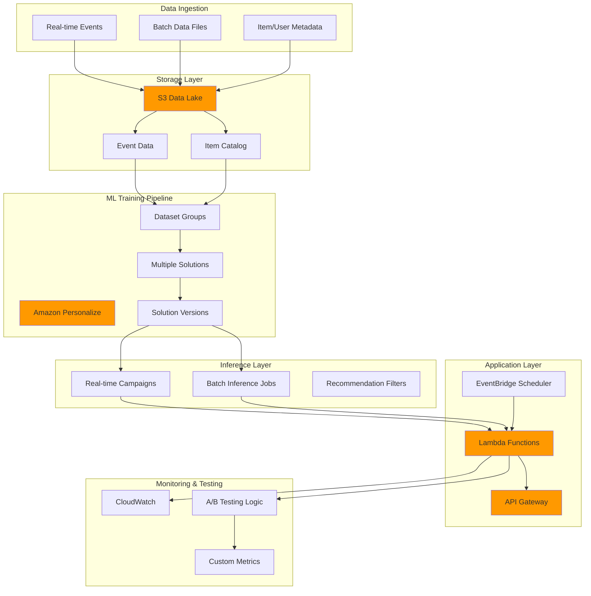

# Building Advanced Recommendation Systems with Amazon Personalize

## Problem

E-commerce and content platforms struggle with declining user engagement and conversion rates due to the overwhelming choice paradox - users abandon sites when faced with too many options without personalized guidance. Traditional recommendation systems require extensive machine learning expertise, months of development, and significant infrastructure investment, while businesses need sophisticated recommendation engines that can handle multiple recommendation types (collaborative filtering, content-based, popularity-based), support both real-time and batch processing, and continuously learn from user behavior to improve accuracy over time.

## Solution

Implement a comprehensive recommendation system using Amazon Personalize that combines multiple ML algorithms and recommendation strategies to deliver personalized experiences. This solution creates multiple recommendation models (User-Personalization-v2, Similar-Items, Trending-Now), implements both real-time and batch inference capabilities, and includes A/B testing framework for continuous optimization, all while automatically handling model training, deployment, and scaling without requiring deep ML expertise.

## Architecture Diagram



## Prerequisites

1. AWS account with Amazon Personalize, S3, Lambda, EventBridge, and CloudWatch permissions
2. AWS CLI v2 installed and configured (or AWS CloudShell)
3. Understanding of recommendation systems, machine learning concepts, and data science principles
4. Historical user interaction data - minimum 1,000 interactions from 25 users across 100 items
5. Item catalog with metadata (categories, prices, descriptions) for content-based recommendations
6. User profile data (demographics, preferences) for enhanced personalization
7. Estimated cost: $200-500/month for comprehensive implementation with multiple models and campaigns

> **Note**: Amazon Personalize requires substantial historical data for effective training. Plan for initial data collection period if starting from scratch.

> **Warning**: Model training can take 60-90 minutes and incurs compute charges. Monitor CloudWatch metrics and set up cost alerts to track spending during development phases.

> **Tip**: Use Amazon Personalize's real-time event tracking to continuously improve recommendations. Implement event ingestion from your application to capture user interactions as they happen, enabling the system to adapt to changing user preferences.

## Preparation

```bash
# Set environment variables
export AWS_REGION=$(aws configure get region)
export AWS_ACCOUNT_ID=$(aws sts get-caller-identity \
    --query Account --output text)

# Generate unique identifiers for resources
RANDOM_SUFFIX=$(aws secretsmanager get-random-password \
    --exclude-punctuation --exclude-uppercase \
    --password-length 8 --require-each-included-type \
    --output text --query RandomPassword)

export BUCKET_NAME="personalize-comprehensive-${RANDOM_SUFFIX}"
export DATASET_GROUP_NAME="ecommerce-recommendation-${RANDOM_SUFFIX}"
export USER_PERSONALIZATION_SOLUTION="user-personalization-${RANDOM_SUFFIX}"
export SIMILAR_ITEMS_SOLUTION="similar-items-${RANDOM_SUFFIX}"
export TRENDING_NOW_SOLUTION="trending-now-${RANDOM_SUFFIX}"
export POPULARITY_SOLUTION="popularity-count-${RANDOM_SUFFIX}"

# Create S3 bucket for data storage
aws s3 mb s3://${BUCKET_NAME} --region ${AWS_REGION}

# Create directory structure in S3
aws s3api put-object --bucket ${BUCKET_NAME} \
    --key training-data/ --body /dev/null
aws s3api put-object --bucket ${BUCKET_NAME} \
    --key batch-output/ --body /dev/null
aws s3api put-object --bucket ${BUCKET_NAME} \
    --key metadata/ --body /dev/null

echo "✅ Environment prepared with bucket: ${BUCKET_NAME}"
```

## Steps

1. **Create IAM Service Role for Amazon Personalize**:

   Amazon Personalize requires service-linked roles to access your S3 data and perform training operations. IAM roles enable secure, temporary credential delegation following the principle of least privilege, ensuring the service accesses only the specific resources it needs. This security foundation is critical for production ML systems handling sensitive user data and follows AWS Well-Architected Framework security principles.

   ```bash
   # Create comprehensive trust policy
   cat > personalize-service-role-policy.json << EOF
   {
       "Version": "2012-10-17",
       "Statement": [
           {
               "Effect": "Allow",
               "Principal": {
                   "Service": "personalize.amazonaws.com"
               },
               "Action": "sts:AssumeRole"
           }
       ]
   }
   EOF
   
   # Create IAM role for Personalize service
   aws iam create-role \
       --role-name PersonalizeServiceRole-${RANDOM_SUFFIX} \
       --assume-role-policy-document file://personalize-service-role-policy.json
   
   # Create custom policy for S3 access
   cat > personalize-s3-policy.json << EOF
   {
       "Version": "2012-10-17",
       "Statement": [
           {
               "Effect": "Allow",
               "Action": [
                   "s3:GetObject",
                   "s3:ListBucket",
                   "s3:PutObject"
               ],
               "Resource": [
                   "arn:aws:s3:::${BUCKET_NAME}",
                   "arn:aws:s3:::${BUCKET_NAME}/*"
               ]
           }
       ]
   }
   EOF
   
   # Create and attach custom policy
   aws iam create-policy \
       --policy-name PersonalizeS3Access-${RANDOM_SUFFIX} \
       --policy-document file://personalize-s3-policy.json
   
   aws iam attach-role-policy \
       --role-name PersonalizeServiceRole-${RANDOM_SUFFIX} \
       --policy-arn arn:aws:iam::${AWS_ACCOUNT_ID}:policy/PersonalizeS3Access-${RANDOM_SUFFIX}
   
   export PERSONALIZE_ROLE_ARN=$(aws iam get-role \
       --role-name PersonalizeServiceRole-${RANDOM_SUFFIX} \
       --query Role.Arn --output text)
   
   echo "✅ Created Personalize service role: ${PERSONALIZE_ROLE_ARN}"
   ```

   The role is now established with proper S3 access permissions, enabling Amazon Personalize to read training data and write batch inference results. This security configuration follows AWS best practices for service-to-service authentication without exposing long-term credentials.

2. **Generate Comprehensive Training Datasets**:

   Machine learning recommendation systems require substantial historical interaction data to identify patterns and make accurate predictions. Amazon Personalize needs at least 1,000 interactions from 25 users across 100 items for effective training. This step creates realistic e-commerce datasets with multiple interaction types (views, purchases, cart additions) and metadata that mirror real-world scenarios.

   ```bash
   # Generate realistic user interaction data
   cat > generate_sample_data.py << 'EOF'
   import csv
   import random
   import time
   from datetime import datetime, timedelta
   
   # Generate user interactions
   users = [f"user_{i:04d}" for i in range(1, 501)]  # 500 users
   items = [f"item_{i:04d}" for i in range(1, 1001)]  # 1000 items
   categories = ["electronics", "clothing", "books", "sports", "home", "beauty"]
   
   # Generate interactions dataset
   interactions = []
   base_timestamp = int((datetime.now() - timedelta(days=90)).timestamp())
   
   for _ in range(25000):  # 25,000 interactions
       user = random.choice(users)
       item = random.choice(items)
       event_type = random.choices(
           ["view", "purchase", "add_to_cart", "like"], 
           weights=[60, 10, 20, 10]
       )[0]
       timestamp = base_timestamp + random.randint(0, 90*24*3600)
       
       interactions.append({
           "USER_ID": user,
           "ITEM_ID": item,
           "TIMESTAMP": timestamp,
           "EVENT_TYPE": event_type,
           "EVENT_VALUE": 1 if event_type == "view" else 
                         5 if event_type == "purchase" else 
                         2 if event_type == "add_to_cart" else 3
       })
   
   # Write interactions CSV
   with open("interactions.csv", "w", newline="") as f:
       writer = csv.DictWriter(f, fieldnames=["USER_ID", "ITEM_ID", "TIMESTAMP", "EVENT_TYPE", "EVENT_VALUE"])
       writer.writeheader()
       writer.writerows(interactions)
   
   # Generate items metadata
   items_metadata = []
   for item in items:
       items_metadata.append({
           "ITEM_ID": item,
           "CATEGORY": random.choice(categories),
           "PRICE": round(random.uniform(10, 500), 2),
           "BRAND": f"Brand_{random.randint(1, 50)}",
           "CREATION_TIMESTAMP": base_timestamp + random.randint(0, 30*24*3600)
       })
   
   # Write items CSV
   with open("items.csv", "w", newline="") as f:
       writer = csv.DictWriter(f, fieldnames=["ITEM_ID", "CATEGORY", "PRICE", "BRAND", "CREATION_TIMESTAMP"])
       writer.writeheader()
       writer.writerows(items_metadata)
   
   # Generate users metadata
   users_metadata = []
   for user in users:
       users_metadata.append({
           "USER_ID": user,
           "AGE": random.randint(18, 65),
           "GENDER": random.choice(["M", "F"]),
           "MEMBERSHIP_TYPE": random.choice(["free", "premium", "enterprise"])
       })
   
   # Write users CSV
   with open("users.csv", "w", newline="") as f:
       writer = csv.DictWriter(f, fieldnames=["USER_ID", "AGE", "GENDER", "MEMBERSHIP_TYPE"])
       writer.writeheader()
       writer.writerows(users_metadata)
   
   print("Generated sample datasets successfully!")
   EOF
   
   # Run data generation script
   python3 generate_sample_data.py
   
   # Upload datasets to S3
   aws s3 cp interactions.csv s3://${BUCKET_NAME}/training-data/
   aws s3 cp items.csv s3://${BUCKET_NAME}/metadata/
   aws s3 cp users.csv s3://${BUCKET_NAME}/metadata/
   
   echo "✅ Generated and uploaded comprehensive training datasets"
   ```

   The generated datasets now provide the foundation for training multiple recommendation algorithms. The interaction data includes weighted events (purchases worth more than views) and temporal patterns that enable sophisticated collaborative filtering and trending content identification.

3. **Create Dataset Group and Schemas**:

   Dataset groups organize related datasets and serve as containers for training multiple recommendation models. Schemas define the structure and data types for your training data, enabling Amazon Personalize to understand which fields represent users, items, timestamps, and interaction values. Proper schema design is crucial for feature engineering and algorithm performance optimization.

   ```bash
   # Create dataset group
   aws personalize create-dataset-group \
       --name ${DATASET_GROUP_NAME} \
       --region ${AWS_REGION}
   
   # Wait for dataset group to be active
   echo "⏳ Waiting for dataset group creation..."
   aws personalize wait dataset-group-active \
       --dataset-group-arn arn:aws:personalize:${AWS_REGION}:${AWS_ACCOUNT_ID}:dataset-group/${DATASET_GROUP_NAME}
   
   export DATASET_GROUP_ARN="arn:aws:personalize:${AWS_REGION}:${AWS_ACCOUNT_ID}:dataset-group/${DATASET_GROUP_NAME}"
   
   # Create interactions schema
   cat > interactions-schema.json << EOF
   {
       "type": "record",
       "name": "Interactions",
       "namespace": "com.amazonaws.personalize.schema",
       "fields": [
           {"name": "USER_ID", "type": "string"},
           {"name": "ITEM_ID", "type": "string"},
           {"name": "TIMESTAMP", "type": "long"},
           {"name": "EVENT_TYPE", "type": "string"},
           {"name": "EVENT_VALUE", "type": "float"}
       ],
       "version": "1.0"
   }
   EOF
   
   # Create items schema
   cat > items-schema.json << EOF
   {
       "type": "record",
       "name": "Items",
       "namespace": "com.amazonaws.personalize.schema",
       "fields": [
           {"name": "ITEM_ID", "type": "string"},
           {"name": "CATEGORY", "type": "string", "categorical": true},
           {"name": "PRICE", "type": "float"},
           {"name": "BRAND", "type": "string", "categorical": true},
           {"name": "CREATION_TIMESTAMP", "type": "long"}
       ],
       "version": "1.0"
   }
   EOF
   
   # Create users schema
   cat > users-schema.json << EOF
   {
       "type": "record",
       "name": "Users",
       "namespace": "com.amazonaws.personalize.schema",
       "fields": [
           {"name": "USER_ID", "type": "string"},
           {"name": "AGE", "type": "int"},
           {"name": "GENDER", "type": "string", "categorical": true},
           {"name": "MEMBERSHIP_TYPE", "type": "string", "categorical": true}
       ],
       "version": "1.0"
   }
   EOF
   
   # Create schemas
   aws personalize create-schema \
       --name interactions-schema-${RANDOM_SUFFIX} \
       --schema file://interactions-schema.json
   
   aws personalize create-schema \
       --name items-schema-${RANDOM_SUFFIX} \
       --schema file://items-schema.json
   
   aws personalize create-schema \
       --name users-schema-${RANDOM_SUFFIX} \
       --schema file://users-schema.json
   
   export INTERACTIONS_SCHEMA_ARN="arn:aws:personalize:${AWS_REGION}:${AWS_ACCOUNT_ID}:schema/interactions-schema-${RANDOM_SUFFIX}"
   export ITEMS_SCHEMA_ARN="arn:aws:personalize:${AWS_REGION}:${AWS_ACCOUNT_ID}:schema/items-schema-${RANDOM_SUFFIX}"
   export USERS_SCHEMA_ARN="arn:aws:personalize:${AWS_REGION}:${AWS_ACCOUNT_ID}:schema/users-schema-${RANDOM_SUFFIX}"
   
   echo "✅ Created dataset group and schemas"
   ```

   The schemas now define the data contracts for all recommendation algorithms, specifying categorical fields for efficient encoding and numerical fields for feature calculations. This structured approach enables Amazon Personalize to automatically extract features and optimize algorithm performance based on your data characteristics.

4. **Create Datasets and Import Training Data**:

   Dataset creation establishes the logical containers for interactions, items, and users data within your dataset group. The import process ingests CSV data from S3 and validates it against your schemas, performing data quality checks and feature extraction. This automated data pipeline eliminates manual preprocessing while ensuring data consistency across all recommendation models.

   ```bash
   # Create interactions dataset
   aws personalize create-dataset \
       --name interactions-dataset-${RANDOM_SUFFIX} \
       --dataset-group-arn ${DATASET_GROUP_ARN} \
       --dataset-type Interactions \
       --schema-arn ${INTERACTIONS_SCHEMA_ARN}
   
   # Create items dataset
   aws personalize create-dataset \
       --name items-dataset-${RANDOM_SUFFIX} \
       --dataset-group-arn ${DATASET_GROUP_ARN} \
       --dataset-type Items \
       --schema-arn ${ITEMS_SCHEMA_ARN}
   
   # Create users dataset
   aws personalize create-dataset \
       --name users-dataset-${RANDOM_SUFFIX} \
       --dataset-group-arn ${DATASET_GROUP_ARN} \
       --dataset-type Users \
       --schema-arn ${USERS_SCHEMA_ARN}
   
   # Set dataset ARNs
   export INTERACTIONS_DATASET_ARN="arn:aws:personalize:${AWS_REGION}:${AWS_ACCOUNT_ID}:dataset/${DATASET_GROUP_NAME}/INTERACTIONS"
   export ITEMS_DATASET_ARN="arn:aws:personalize:${AWS_REGION}:${AWS_ACCOUNT_ID}:dataset/${DATASET_GROUP_NAME}/ITEMS"
   export USERS_DATASET_ARN="arn:aws:personalize:${AWS_REGION}:${AWS_ACCOUNT_ID}:dataset/${DATASET_GROUP_NAME}/USERS"
   
   # Import interactions data
   aws personalize create-dataset-import-job \
       --job-name import-interactions-${RANDOM_SUFFIX} \
       --dataset-arn ${INTERACTIONS_DATASET_ARN} \
       --data-source dataLocation=s3://${BUCKET_NAME}/training-data/interactions.csv \
       --role-arn ${PERSONALIZE_ROLE_ARN}
   
   # Import items data
   aws personalize create-dataset-import-job \
       --job-name import-items-${RANDOM_SUFFIX} \
       --dataset-arn ${ITEMS_DATASET_ARN} \
       --data-source dataLocation=s3://${BUCKET_NAME}/metadata/items.csv \
       --role-arn ${PERSONALIZE_ROLE_ARN}
   
   # Import users data
   aws personalize create-dataset-import-job \
       --job-name import-users-${RANDOM_SUFFIX} \
       --dataset-arn ${USERS_DATASET_ARN} \
       --data-source dataLocation=s3://${BUCKET_NAME}/metadata/users.csv \
       --role-arn ${PERSONALIZE_ROLE_ARN}
   
   echo "✅ Dataset import jobs created - data import will take 15-20 minutes"
   ```

   The import jobs are now processing your data in parallel, validating schema compliance and extracting features for model training. Amazon Personalize automatically handles data transformations, encoding categorical variables, and creating the internal representations needed for collaborative filtering algorithms.

5. **Create Multiple ML Solutions for Different Recommendation Types**:

   Amazon Personalize offers multiple pre-built algorithms (recipes) optimized for different recommendation scenarios. User-Personalization-v2 leverages transformer-based architecture for individual preferences, Similar-Items provides content-based recommendations, Trending-Now identifies viral content, and Popularity-Count handles cold-start scenarios. Creating multiple solutions enables comprehensive recommendation coverage and A/B testing opportunities.

   ```bash
   # Create User-Personalization-v2 solution for collaborative filtering
   aws personalize create-solution \
       --name ${USER_PERSONALIZATION_SOLUTION} \
       --dataset-group-arn ${DATASET_GROUP_ARN} \
       --recipe-arn arn:aws:personalize:::recipe/aws-user-personalization-v2 \
       --solution-config '{
           "algorithmHyperParameters": {
               "hidden_dimension": "100",
               "bptt": "32",
               "recency_mask": "true"
           },
           "featureTransformationParameters": {
               "max_hist_len": "100"
           }
       }'
   
   # Create Similar-Items solution for content-based recommendations
   aws personalize create-solution \
       --name ${SIMILAR_ITEMS_SOLUTION} \
       --dataset-group-arn ${DATASET_GROUP_ARN} \
       --recipe-arn arn:aws:personalize:::recipe/aws-similar-items
   
   # Create Trending-Now solution for trending content
   aws personalize create-solution \
       --name ${TRENDING_NOW_SOLUTION} \
       --dataset-group-arn ${DATASET_GROUP_ARN} \
       --recipe-arn arn:aws:personalize:::recipe/aws-trending-now
   
   # Create Popularity-Count solution for popular items
   aws personalize create-solution \
       --name ${POPULARITY_SOLUTION} \
       --dataset-group-arn ${DATASET_GROUP_ARN} \
       --recipe-arn arn:aws:personalize:::recipe/aws-popularity-count
   
   # Store solution ARNs
   export USER_PERSONALIZATION_ARN="arn:aws:personalize:${AWS_REGION}:${AWS_ACCOUNT_ID}:solution/${USER_PERSONALIZATION_SOLUTION}"
   export SIMILAR_ITEMS_ARN="arn:aws:personalize:${AWS_REGION}:${AWS_ACCOUNT_ID}:solution/${SIMILAR_ITEMS_SOLUTION}"
   export TRENDING_NOW_ARN="arn:aws:personalize:${AWS_REGION}:${AWS_ACCOUNT_ID}:solution/${TRENDING_NOW_SOLUTION}"
   export POPULARITY_ARN="arn:aws:personalize:${AWS_REGION}:${AWS_ACCOUNT_ID}:solution/${POPULARITY_SOLUTION}"
   
   echo "✅ Created multiple ML solutions for different recommendation types"
   ```

   Four distinct recommendation solutions are now configured, each optimized for specific business use cases. The User-Personalization-v2 solution uses the latest transformer architecture with enhanced performance and lower latency compared to the original User-Personalization recipe, while other solutions use optimized default configurations for their respective algorithms.

6. **Train Solution Versions (Models)**:

   Solution versions represent trained machine learning models created from your data and algorithm configurations. Amazon Personalize uses distributed training infrastructure to build neural networks that learn user preferences, item relationships, and interaction patterns. Training mode 'FULL' creates entirely new models, while 'UPDATE' performs incremental learning for existing models.

   ```bash
   # Train User-Personalization-v2 model
   aws personalize create-solution-version \
       --solution-arn ${USER_PERSONALIZATION_ARN} \
       --training-mode FULL
   
   # Train Similar-Items model
   aws personalize create-solution-version \
       --solution-arn ${SIMILAR_ITEMS_ARN} \
       --training-mode FULL
   
   # Train Trending-Now model
   aws personalize create-solution-version \
       --solution-arn ${TRENDING_NOW_ARN} \
       --training-mode FULL
   
   # Train Popularity-Count model
   aws personalize create-solution-version \
       --solution-arn ${POPULARITY_ARN} \
       --training-mode FULL
   
   # Get the latest solution version ARNs
   export USER_PERSONALIZATION_VERSION_ARN=$(aws personalize list-solution-versions \
       --solution-arn ${USER_PERSONALIZATION_ARN} \
       --query 'solutionVersions[0].solutionVersionArn' --output text)
   export SIMILAR_ITEMS_VERSION_ARN=$(aws personalize list-solution-versions \
       --solution-arn ${SIMILAR_ITEMS_ARN} \
       --query 'solutionVersions[0].solutionVersionArn' --output text)
   export TRENDING_NOW_VERSION_ARN=$(aws personalize list-solution-versions \
       --solution-arn ${TRENDING_NOW_ARN} \
       --query 'solutionVersions[0].solutionVersionArn' --output text)
   export POPULARITY_VERSION_ARN=$(aws personalize list-solution-versions \
       --solution-arn ${POPULARITY_ARN} \
       --query 'solutionVersions[0].solutionVersionArn' --output text)
   
   echo "⏳ Model training started - this will take 60-90 minutes"
   echo "✅ All solution versions created for training"
   ```

   Model training is now underway using Amazon Personalize's managed infrastructure, which automatically handles distributed computing, hyperparameter optimization, and model validation. The service will generate performance metrics and model artifacts that enable real-time and batch inference capabilities.

7. **Create Real-time Campaigns for Multiple Recommendation Types**:

   Campaigns provide real-time inference endpoints for serving recommendations with sub-second latency. Each campaign is backed by a trained model and provisions dedicated compute capacity (TPS - Transactions Per Second) to handle concurrent requests. Multiple campaigns enable A/B testing and allow different recommendation strategies for various application contexts.

   ```bash
   # Function to wait for solution version to be active
   wait_for_solution_version() {
       local solution_version_arn=$1
       local solution_name=$2
       
       echo "⏳ Waiting for ${solution_name} solution version to be active..."
       while true; do
           status=$(aws personalize describe-solution-version \
               --solution-version-arn ${solution_version_arn} \
               --query SolutionVersion.Status --output text)
           if [ "$status" = "ACTIVE" ]; then
               echo "✅ ${solution_name} solution version is active"
               break
           elif [ "$status" = "CREATE_FAILED" ]; then
               echo "❌ ${solution_name} solution version creation failed"
               return 1
           fi
           echo "Current status: $status - waiting 5 minutes..."
           sleep 300
       done
   }
   
   # Wait for all solution versions to be active
   wait_for_solution_version ${USER_PERSONALIZATION_VERSION_ARN} "User-Personalization-v2"
   wait_for_solution_version ${SIMILAR_ITEMS_VERSION_ARN} "Similar-Items"
   wait_for_solution_version ${TRENDING_NOW_VERSION_ARN} "Trending-Now"
   wait_for_solution_version ${POPULARITY_VERSION_ARN} "Popularity-Count"
   
   # Create campaigns for real-time inference
   aws personalize create-campaign \
       --name user-personalization-campaign-${RANDOM_SUFFIX} \
       --solution-version-arn ${USER_PERSONALIZATION_VERSION_ARN} \
       --min-provisioned-tps 2
   
   aws personalize create-campaign \
       --name similar-items-campaign-${RANDOM_SUFFIX} \
       --solution-version-arn ${SIMILAR_ITEMS_VERSION_ARN} \
       --min-provisioned-tps 1
   
   aws personalize create-campaign \
       --name trending-now-campaign-${RANDOM_SUFFIX} \
       --solution-version-arn ${TRENDING_NOW_VERSION_ARN} \
       --min-provisioned-tps 1
   
   aws personalize create-campaign \
       --name popularity-campaign-${RANDOM_SUFFIX} \
       --solution-version-arn ${POPULARITY_VERSION_ARN} \
       --min-provisioned-tps 1
   
   # Store campaign ARNs
   export USER_PERSONALIZATION_CAMPAIGN_ARN="arn:aws:personalize:${AWS_REGION}:${AWS_ACCOUNT_ID}:campaign/user-personalization-campaign-${RANDOM_SUFFIX}"
   export SIMILAR_ITEMS_CAMPAIGN_ARN="arn:aws:personalize:${AWS_REGION}:${AWS_ACCOUNT_ID}:campaign/similar-items-campaign-${RANDOM_SUFFIX}"
   export TRENDING_NOW_CAMPAIGN_ARN="arn:aws:personalize:${AWS_REGION}:${AWS_ACCOUNT_ID}:campaign/trending-now-campaign-${RANDOM_SUFFIX}"
   export POPULARITY_CAMPAIGN_ARN="arn:aws:personalize:${AWS_REGION}:${AWS_ACCOUNT_ID}:campaign/popularity-campaign-${RANDOM_SUFFIX}"
   
   echo "✅ Created real-time campaigns for all recommendation types"
   ```

   Four real-time inference endpoints are now active, each optimized for specific recommendation scenarios. The campaigns provide auto-scaling capabilities and built-in monitoring, enabling your application to serve personalized recommendations at scale while maintaining consistent performance.

8. **Create Recommendation Filters for Business Rules**:

   Filters enable dynamic business rule enforcement within machine learning recommendations, allowing you to exclude purchased items, restrict by category, or apply price ranges without retraining models. This approach combines algorithmic intelligence with business logic, essential for production systems that must respect inventory constraints, promotional campaigns, and user preferences.

   ```bash
   # Create filter for excluding purchased items
   aws personalize create-filter \
       --name exclude-purchased-${RANDOM_SUFFIX} \
       --dataset-group-arn ${DATASET_GROUP_ARN} \
       --filter-expression "EXCLUDE ItemID WHERE Interactions.EVENT_TYPE IN (\"purchase\")"
   
   # Create filter for category-based recommendations
   aws personalize create-filter \
       --name category-filter-${RANDOM_SUFFIX} \
       --dataset-group-arn ${DATASET_GROUP_ARN} \
       --filter-expression "INCLUDE ItemID WHERE Items.CATEGORY IN (\$CATEGORY)"
   
   # Create filter for price range
   aws personalize create-filter \
       --name price-filter-${RANDOM_SUFFIX} \
       --dataset-group-arn ${DATASET_GROUP_ARN} \
       --filter-expression "INCLUDE ItemID WHERE Items.PRICE >= \$MIN_PRICE AND Items.PRICE <= \$MAX_PRICE"
   
   # Store filter ARNs
   export EXCLUDE_PURCHASED_FILTER_ARN="arn:aws:personalize:${AWS_REGION}:${AWS_ACCOUNT_ID}:filter/exclude-purchased-${RANDOM_SUFFIX}"
   export CATEGORY_FILTER_ARN="arn:aws:personalize:${AWS_REGION}:${AWS_ACCOUNT_ID}:filter/category-filter-${RANDOM_SUFFIX}"
   export PRICE_FILTER_ARN="arn:aws:personalize:${AWS_REGION}:${AWS_ACCOUNT_ID}:filter/price-filter-${RANDOM_SUFFIX}"
   
   echo "✅ Created recommendation filters for business rules"
   ```

   Business rule filters are now available for dynamic application during inference, enabling contextual recommendations that respect real-time constraints. These filters can be parameterized and applied selectively, providing the flexibility to customize recommendations based on user session data, inventory levels, or promotional campaigns.

9. **Create Lambda Functions for Recommendation API with A/B Testing**:

   AWS Lambda provides serverless compute for building scalable recommendation APIs that automatically handle traffic spikes and cost optimization. The function implements sophisticated A/B testing logic using consistent hashing to ensure users receive consistent recommendation strategies while enabling statistical analysis of algorithm performance across different user segments.

   ```bash
   # Create comprehensive recommendation handler
   cat > recommendation-service.py << 'EOF'
   import json
   import boto3
   import os
   import random
   import logging
   from datetime import datetime
   
   logger = logging.getLogger()
   logger.setLevel(logging.INFO)
   
   personalize_runtime = boto3.client('personalize-runtime')
   cloudwatch = boto3.client('cloudwatch')
   
   # A/B Testing Configuration
   AB_TEST_CONFIG = {
       'user_personalization': 0.4,  # 40% traffic
       'similar_items': 0.2,         # 20% traffic
       'trending_now': 0.2,          # 20% traffic
       'popularity': 0.2             # 20% traffic
   }
   
   def get_recommendation_strategy(user_id):
       """Determine recommendation strategy based on A/B testing"""
       hash_value = hash(user_id) % 100
       cumulative_prob = 0
       
       for strategy, probability in AB_TEST_CONFIG.items():
           cumulative_prob += probability * 100
           if hash_value < cumulative_prob:
               return strategy
       
       return 'user_personalization'  # Default fallback
   
   def get_recommendations(campaign_arn, user_id, num_results=10, filter_arn=None, filter_values=None):
       """Get recommendations from Personalize campaign"""
       try:
           params = {
               'campaignArn': campaign_arn,
               'userId': user_id,
               'numResults': num_results
           }
           
           if filter_arn and filter_values:
               params['filterArn'] = filter_arn
               params['filterValues'] = filter_values
           
           response = personalize_runtime.get_recommendations(**params)
           return response
           
       except Exception as e:
           logger.error(f"Error getting recommendations: {str(e)}")
           return None
   
   def get_similar_items(campaign_arn, item_id, num_results=10):
       """Get similar items recommendations"""
       try:
           response = personalize_runtime.get_recommendations(
               campaignArn=campaign_arn,
               itemId=item_id,
               numResults=num_results
           )
           return response
           
       except Exception as e:
           logger.error(f"Error getting similar items: {str(e)}")
           return None
   
   def send_ab_test_metrics(strategy, user_id, response_time, num_results):
       """Send A/B testing metrics to CloudWatch"""
       try:
           cloudwatch.put_metric_data(
               Namespace='PersonalizeABTest',
               MetricData=[
                   {
                       'MetricName': 'RecommendationRequests',
                       'Dimensions': [
                           {'Name': 'Strategy', 'Value': strategy}
                       ],
                       'Value': 1,
                       'Unit': 'Count'
                   },
                   {
                       'MetricName': 'ResponseTime',
                       'Dimensions': [
                           {'Name': 'Strategy', 'Value': strategy}
                       ],
                       'Value': response_time,
                       'Unit': 'Milliseconds'
                   },
                   {
                       'MetricName': 'NumResults',
                       'Dimensions': [
                           {'Name': 'Strategy', 'Value': strategy}
                       ],
                       'Value': num_results,
                       'Unit': 'Count'
                   }
               ]
           )
       except Exception as e:
           logger.error(f"Error sending metrics: {str(e)}")
   
   def lambda_handler(event, context):
       start_time = datetime.now()
       
       try:
           # Extract parameters
           path_params = event.get('pathParameters', {})
           query_params = event.get('queryStringParameters') or {}
           
           user_id = path_params.get('userId')
           item_id = path_params.get('itemId')
           recommendation_type = path_params.get('type', 'personalized')
           
           num_results = int(query_params.get('numResults', 10))
           category = query_params.get('category')
           min_price = query_params.get('minPrice')
           max_price = query_params.get('maxPrice')
           
           # Determine strategy based on A/B testing
           if recommendation_type == 'personalized' and user_id:
               strategy = get_recommendation_strategy(user_id)
           else:
               strategy = recommendation_type
           
           # Map strategies to campaign ARNs
           campaign_mapping = {
               'user_personalization': os.environ.get('USER_PERSONALIZATION_CAMPAIGN_ARN'),
               'similar_items': os.environ.get('SIMILAR_ITEMS_CAMPAIGN_ARN'),
               'trending_now': os.environ.get('TRENDING_NOW_CAMPAIGN_ARN'),
               'popularity': os.environ.get('POPULARITY_CAMPAIGN_ARN')
           }
           
           # Handle different recommendation types
           if strategy == 'similar_items' and item_id:
               response = get_similar_items(
                   campaign_mapping[strategy], 
                   item_id, 
                   num_results
               )
           elif user_id:
               # Apply filters if specified
               filter_arn = None
               filter_values = {}
               
               if category:
                   filter_arn = os.environ.get('CATEGORY_FILTER_ARN')
                   filter_values['$CATEGORY'] = f'"{category}"'
               
               if min_price and max_price:
                   filter_arn = os.environ.get('PRICE_FILTER_ARN')
                   filter_values['$MIN_PRICE'] = min_price
                   filter_values['$MAX_PRICE'] = max_price
               
               response = get_recommendations(
                   campaign_mapping[strategy],
                   user_id,
                   num_results,
                   filter_arn,
                   filter_values
               )
           else:
               raise ValueError("Missing required parameters")
           
           if not response:
               raise Exception("Failed to get recommendations")
           
           # Calculate response time
           response_time = (datetime.now() - start_time).total_seconds() * 1000
           
           # Send A/B testing metrics
           send_ab_test_metrics(strategy, user_id, response_time, len(response.get('itemList', [])))
           
           # Format response
           recommendations = []
           for item in response.get('itemList', []):
               recommendations.append({
                   'itemId': item['itemId'],
                   'score': item.get('score', 0)
               })
           
           return {
               'statusCode': 200,
               'headers': {
                   'Content-Type': 'application/json',
                   'Access-Control-Allow-Origin': '*'
               },
               'body': json.dumps({
                   'userId': user_id,
                   'itemId': item_id,
                   'strategy': strategy,
                   'recommendations': recommendations,
                   'responseTime': response_time,
                   'requestId': context.aws_request_id
               })
           }
           
       except Exception as e:
           logger.error(f"Error in recommendation handler: {str(e)}")
           return {
               'statusCode': 500,
               'headers': {
                   'Content-Type': 'application/json',
                   'Access-Control-Allow-Origin': '*'
               },
               'body': json.dumps({
                   'error': 'Internal server error',
                   'message': str(e)
               })
           }
   EOF
   
   # Create deployment package
   zip -r recommendation-service.zip recommendation-service.py
   
   echo "✅ Created comprehensive recommendation service with A/B testing"
   ```

   The recommendation service now includes advanced capabilities for strategy selection, filter application, and performance monitoring. The A/B testing framework ensures statistical validity while the CloudWatch integration provides real-time visibility into recommendation quality and system performance across all algorithm variants.

10. **Deploy Lambda Function with Environment Variables**:

    Lambda deployment creates the serverless infrastructure for your recommendation API, including IAM roles with fine-grained permissions for Amazon Personalize and CloudWatch access. Environment variables securely store campaign ARNs and filter configurations, enabling the function to dynamically route requests to appropriate recommendation engines.

    ```bash
    # Create Lambda execution role
    cat > lambda-execution-role-policy.json << EOF
    {
        "Version": "2012-10-17",
        "Statement": [
            {
                "Effect": "Allow",
                "Principal": {
                    "Service": "lambda.amazonaws.com"
                },
                "Action": "sts:AssumeRole"
            }
        ]
    }
    EOF
    
    aws iam create-role \
        --role-name LambdaRecommendationRole-${RANDOM_SUFFIX} \
        --assume-role-policy-document file://lambda-execution-role-policy.json
    
    # Create custom policy for Lambda permissions
    cat > lambda-personalize-policy.json << EOF
    {
        "Version": "2012-10-17",
        "Statement": [
            {
                "Effect": "Allow",
                "Action": [
                    "personalize:GetRecommendations",
                    "personalize:GetPersonalizedRanking",
                    "personalize:DescribeCampaign",
                    "personalize:DescribeFilter"
                ],
                "Resource": "*"
            },
            {
                "Effect": "Allow",
                "Action": [
                    "cloudwatch:PutMetricData"
                ],
                "Resource": "*"
            }
        ]
    }
    EOF
    
    aws iam create-policy \
        --policy-name LambdaPersonalizePolicy-${RANDOM_SUFFIX} \
        --policy-document file://lambda-personalize-policy.json
    
    # Attach policies to role
    aws iam attach-role-policy \
        --role-name LambdaRecommendationRole-${RANDOM_SUFFIX} \
        --policy-arn arn:aws:iam::aws:policy/service-role/AWSLambdaBasicExecutionRole
    
    aws iam attach-role-policy \
        --role-name LambdaRecommendationRole-${RANDOM_SUFFIX} \
        --policy-arn arn:aws:iam::${AWS_ACCOUNT_ID}:policy/LambdaPersonalizePolicy-${RANDOM_SUFFIX}
    
    export LAMBDA_ROLE_ARN=$(aws iam get-role \
        --role-name LambdaRecommendationRole-${RANDOM_SUFFIX} \
        --query Role.Arn --output text)
    
    # Wait for IAM role propagation
    sleep 10
    
    # Create Lambda function with environment variables
    aws lambda create-function \
        --function-name comprehensive-recommendation-api-${RANDOM_SUFFIX} \
        --runtime python3.12 \
        --role ${LAMBDA_ROLE_ARN} \
        --handler recommendation-service.lambda_handler \
        --zip-file fileb://recommendation-service.zip \
        --environment Variables="{
            USER_PERSONALIZATION_CAMPAIGN_ARN=${USER_PERSONALIZATION_CAMPAIGN_ARN},
            SIMILAR_ITEMS_CAMPAIGN_ARN=${SIMILAR_ITEMS_CAMPAIGN_ARN},
            TRENDING_NOW_CAMPAIGN_ARN=${TRENDING_NOW_CAMPAIGN_ARN},
            POPULARITY_CAMPAIGN_ARN=${POPULARITY_CAMPAIGN_ARN},
            EXCLUDE_PURCHASED_FILTER_ARN=${EXCLUDE_PURCHASED_FILTER_ARN},
            CATEGORY_FILTER_ARN=${CATEGORY_FILTER_ARN},
            PRICE_FILTER_ARN=${PRICE_FILTER_ARN}
        }" \
        --timeout 30 \
        --memory-size 512
    
    export LAMBDA_FUNCTION_NAME="comprehensive-recommendation-api-${RANDOM_SUFFIX}"
    
    echo "✅ Deployed Lambda function with comprehensive recommendation logic"
    ```

    The serverless recommendation API is now live with auto-scaling capabilities and integrated monitoring. The function uses Python 3.12 runtime for enhanced performance and can handle concurrent requests across multiple recommendation strategies while maintaining security best practices through least-privilege IAM permissions.

11. **Create Batch Inference Jobs for Offline Processing**:

    Batch inference enables cost-effective offline recommendation generation for email campaigns, data analytics, and system initialization. Unlike real-time campaigns, batch jobs process large user lists asynchronously, making them ideal for periodic recommendation updates and analysis workloads that don't require immediate responses.

    ```bash
    # Create sample batch input file
    cat > batch-input.json << EOF
    {"userId": "user_0001"}
    {"userId": "user_0002"}
    {"userId": "user_0003"}
    {"userId": "user_0004"}
    {"userId": "user_0005"}
    EOF
    
    # Create batch input directory and upload
    aws s3api put-object --bucket ${BUCKET_NAME} \
        --key batch-input/ --body /dev/null
    
    aws s3 cp batch-input.json s3://${BUCKET_NAME}/batch-input/users-batch.json
    
    # Create batch inference job for User-Personalization-v2
    aws personalize create-batch-inference-job \
        --job-name user-personalization-batch-${RANDOM_SUFFIX} \
        --solution-version-arn ${USER_PERSONALIZATION_VERSION_ARN} \
        --job-input s3DataSource="{
            \"path\": \"s3://${BUCKET_NAME}/batch-input/users-batch.json\",
            \"kmsKeyArn\": \"\"
        }" \
        --job-output s3DataDestination="{
            \"path\": \"s3://${BUCKET_NAME}/batch-output/user-personalization/\",
            \"kmsKeyArn\": \"\"
        }" \
        --role-arn ${PERSONALIZE_ROLE_ARN} \
        --num-results 25
    
    echo "✅ Created batch inference job for offline processing"
    ```

    The batch processing pipeline is now configured to generate recommendations for multiple users efficiently. Results will be delivered to S3 in JSON format, enabling integration with data warehouses, email marketing systems, and analytics platforms for comprehensive recommendation analysis and distribution.

12. **Set up EventBridge for Automated Model Retraining**:

    EventBridge provides serverless event scheduling for automated model maintenance, ensuring recommendations stay current with evolving user behavior and product catalogs. Automated retraining uses incremental learning to update models efficiently while preserving existing knowledge, maintaining recommendation quality without manual intervention.

    ```bash
    # Create EventBridge rule for weekly retraining
    aws events put-rule \
        --name personalize-retraining-${RANDOM_SUFFIX} \
        --schedule-expression "rate(7 days)" \
        --description "Trigger Personalize model retraining weekly"
    
    # Create Lambda function for retraining automation
    cat > retraining-automation.py << 'EOF'
    import json
    import boto3
    import os
    import logging
    
    logger = logging.getLogger()
    logger.setLevel(logging.INFO)
    
    personalize = boto3.client('personalize')
    
    def lambda_handler(event, context):
        """Automated retraining function"""
        
        solutions = [
            os.environ.get('USER_PERSONALIZATION_ARN'),
            os.environ.get('SIMILAR_ITEMS_ARN'),
            os.environ.get('TRENDING_NOW_ARN'),
            os.environ.get('POPULARITY_ARN')
        ]
        
        retraining_results = []
        
        for solution_arn in solutions:
            if solution_arn:
                try:
                    # Create new solution version for retraining
                    response = personalize.create_solution_version(
                        solutionArn=solution_arn,
                        trainingMode='UPDATE'  # Incremental training
                    )
                    
                    retraining_results.append({
                        'solutionArn': solution_arn,
                        'solutionVersionArn': response['solutionVersionArn'],
                        'status': 'INITIATED'
                    })
                    
                    logger.info(f"Initiated retraining for {solution_arn}")
                    
                except Exception as e:
                    logger.error(f"Error retraining {solution_arn}: {str(e)}")
                    retraining_results.append({
                        'solutionArn': solution_arn,
                        'status': 'FAILED',
                        'error': str(e)
                    })
        
        return {
            'statusCode': 200,
            'body': json.dumps({
                'message': 'Retraining process initiated',
                'results': retraining_results
            })
        }
    EOF
    
    # Create retraining function
    zip -r retraining-automation.zip retraining-automation.py
    
    aws lambda create-function \
        --function-name personalize-retraining-${RANDOM_SUFFIX} \
        --runtime python3.12 \
        --role ${LAMBDA_ROLE_ARN} \
        --handler retraining-automation.lambda_handler \
        --zip-file fileb://retraining-automation.zip \
        --environment Variables="{
            USER_PERSONALIZATION_ARN=${USER_PERSONALIZATION_ARN},
            SIMILAR_ITEMS_ARN=${SIMILAR_ITEMS_ARN},
            TRENDING_NOW_ARN=${TRENDING_NOW_ARN},
            POPULARITY_ARN=${POPULARITY_ARN}
        }" \
        --timeout 300
    
    # Add EventBridge trigger to Lambda
    aws lambda add-permission \
        --function-name personalize-retraining-${RANDOM_SUFFIX} \
        --statement-id allow-eventbridge \
        --action lambda:InvokeFunction \
        --principal events.amazonaws.com \
        --source-arn arn:aws:events:${AWS_REGION}:${AWS_ACCOUNT_ID}:rule/personalize-retraining-${RANDOM_SUFFIX}
    
    # Add Lambda as target for EventBridge rule
    aws events put-targets \
        --rule personalize-retraining-${RANDOM_SUFFIX} \
        --targets "Id"="1","Arn"="arn:aws:lambda:${AWS_REGION}:${AWS_ACCOUNT_ID}:function:personalize-retraining-${RANDOM_SUFFIX}"
    
    echo "✅ Set up automated model retraining with EventBridge"
    ```

    The automated retraining pipeline ensures your recommendation system continuously adapts to changing user preferences and business conditions. Weekly retraining schedules balance model freshness with computational costs, while incremental learning preserves historical patterns while incorporating new interaction data.

## Validation & Testing

1. **Test Multiple Recommendation Types**:

   ```bash
   # Test User-Personalization-v2 recommendations
   aws personalize-runtime get-recommendations \
       --campaign-arn ${USER_PERSONALIZATION_CAMPAIGN_ARN} \
       --user-id user_0001 \
       --num-results 10
   
   # Test Similar-Items recommendations
   aws personalize-runtime get-recommendations \
       --campaign-arn ${SIMILAR_ITEMS_CAMPAIGN_ARN} \
       --item-id item_0001 \
       --num-results 10
   
   # Test Trending-Now recommendations
   aws personalize-runtime get-recommendations \
       --campaign-arn ${TRENDING_NOW_CAMPAIGN_ARN} \
       --user-id user_0001 \
       --num-results 10
   ```

   Expected output: JSON responses with recommended items and confidence scores

2. **Test Recommendation Filters**:

   ```bash
   # Test category filter
   aws personalize-runtime get-recommendations \
       --campaign-arn ${USER_PERSONALIZATION_CAMPAIGN_ARN} \
       --user-id user_0001 \
       --num-results 10 \
       --filter-arn ${CATEGORY_FILTER_ARN} \
       --filter-values '{"$CATEGORY": "\"electronics\""}'
   
   # Test price range filter
   aws personalize-runtime get-recommendations \
       --campaign-arn ${USER_PERSONALIZATION_CAMPAIGN_ARN} \
       --user-id user_0001 \
       --num-results 10 \
       --filter-arn ${PRICE_FILTER_ARN} \
       --filter-values '{"$MIN_PRICE": "50", "$MAX_PRICE": "200"}'
   ```

3. **Test A/B Testing Logic**:

   ```bash
   # Test Lambda function directly
   aws lambda invoke \
       --function-name ${LAMBDA_FUNCTION_NAME} \
       --payload '{
           "pathParameters": {"userId": "user_0001", "type": "personalized"},
           "queryStringParameters": {"numResults": "10"}
       }' \
       response.json
   
   cat response.json
   ```

4. **Monitor A/B Test Metrics**:

   ```bash
   # Check CloudWatch metrics for A/B testing
   aws cloudwatch get-metric-statistics \
       --namespace PersonalizeABTest \
       --metric-name RecommendationRequests \
       --dimensions Name=Strategy,Value=user_personalization \
       --start-time $(date -u -d '1 hour ago' +%Y-%m-%dT%H:%M:%S) \
       --end-time $(date -u +%Y-%m-%dT%H:%M:%S) \
       --period 3600 \
       --statistics Sum
   ```

5. **Test Batch Inference Results**:

   ```bash
   # Check batch inference job status
   aws personalize describe-batch-inference-job \
       --batch-inference-job-arn arn:aws:personalize:${AWS_REGION}:${AWS_ACCOUNT_ID}:batch-inference-job/user-personalization-batch-${RANDOM_SUFFIX}
   
   # List batch output files
   aws s3 ls s3://${BUCKET_NAME}/batch-output/user-personalization/
   ```

## Cleanup

1. **Delete Campaigns and Batch Jobs**:

   ```bash
   # Delete all campaigns
   aws personalize delete-campaign \
       --campaign-arn ${USER_PERSONALIZATION_CAMPAIGN_ARN}
   
   aws personalize delete-campaign \
       --campaign-arn ${SIMILAR_ITEMS_CAMPAIGN_ARN}
   
   aws personalize delete-campaign \
       --campaign-arn ${TRENDING_NOW_CAMPAIGN_ARN}
   
   aws personalize delete-campaign \
       --campaign-arn ${POPULARITY_CAMPAIGN_ARN}
   
   echo "✅ Campaign deletion initiated"
   ```

2. **Delete EventBridge Rules and Lambda Functions**:

   ```bash
   # Remove EventBridge rule targets
   aws events remove-targets \
       --rule personalize-retraining-${RANDOM_SUFFIX} \
       --ids 1
   
   # Delete EventBridge rule
   aws events delete-rule \
       --name personalize-retraining-${RANDOM_SUFFIX}
   
   # Delete Lambda functions
   aws lambda delete-function \
       --function-name ${LAMBDA_FUNCTION_NAME}
   
   aws lambda delete-function \
       --function-name personalize-retraining-${RANDOM_SUFFIX}
   
   echo "✅ Deleted EventBridge rules and Lambda functions"
   ```

3. **Delete Filters and Solutions**:

   ```bash
   # Delete filters
   aws personalize delete-filter \
       --filter-arn ${EXCLUDE_PURCHASED_FILTER_ARN}
   
   aws personalize delete-filter \
       --filter-arn ${CATEGORY_FILTER_ARN}
   
   aws personalize delete-filter \
       --filter-arn ${PRICE_FILTER_ARN}
   
   # Delete solutions (after campaigns are deleted)
   aws personalize delete-solution \
       --solution-arn ${USER_PERSONALIZATION_ARN}
   
   aws personalize delete-solution \
       --solution-arn ${SIMILAR_ITEMS_ARN}
   
   aws personalize delete-solution \
       --solution-arn ${TRENDING_NOW_ARN}
   
   aws personalize delete-solution \
       --solution-arn ${POPULARITY_ARN}
   
   echo "✅ Filters and solutions deletion initiated"
   ```

4. **Delete Datasets and Schemas**:

   ```bash
   # Delete datasets
   aws personalize delete-dataset \
       --dataset-arn ${INTERACTIONS_DATASET_ARN}
   
   aws personalize delete-dataset \
       --dataset-arn ${ITEMS_DATASET_ARN}
   
   aws personalize delete-dataset \
       --dataset-arn ${USERS_DATASET_ARN}
   
   # Delete schemas
   aws personalize delete-schema \
       --schema-arn ${INTERACTIONS_SCHEMA_ARN}
   
   aws personalize delete-schema \
       --schema-arn ${ITEMS_SCHEMA_ARN}
   
   aws personalize delete-schema \
       --schema-arn ${USERS_SCHEMA_ARN}
   
   # Delete dataset group
   aws personalize delete-dataset-group \
       --dataset-group-arn ${DATASET_GROUP_ARN}
   
   echo "✅ Datasets and schemas deletion initiated"
   ```

5. **Clean up IAM Roles and S3 Resources**:

   ```bash
   # Delete IAM policies and roles
   aws iam detach-role-policy \
       --role-name PersonalizeServiceRole-${RANDOM_SUFFIX} \
       --policy-arn arn:aws:iam::${AWS_ACCOUNT_ID}:policy/PersonalizeS3Access-${RANDOM_SUFFIX}
   
   aws iam delete-role \
       --role-name PersonalizeServiceRole-${RANDOM_SUFFIX}
   
   aws iam delete-policy \
       --policy-arn arn:aws:iam::${AWS_ACCOUNT_ID}:policy/PersonalizeS3Access-${RANDOM_SUFFIX}
   
   aws iam detach-role-policy \
       --role-name LambdaRecommendationRole-${RANDOM_SUFFIX} \
       --policy-arn arn:aws:iam::aws:policy/service-role/AWSLambdaBasicExecutionRole
   
   aws iam detach-role-policy \
       --role-name LambdaRecommendationRole-${RANDOM_SUFFIX} \
       --policy-arn arn:aws:iam::${AWS_ACCOUNT_ID}:policy/LambdaPersonalizePolicy-${RANDOM_SUFFIX}
   
   aws iam delete-role \
       --role-name LambdaRecommendationRole-${RANDOM_SUFFIX}
   
   aws iam delete-policy \
       --policy-arn arn:aws:iam::${AWS_ACCOUNT_ID}:policy/LambdaPersonalizePolicy-${RANDOM_SUFFIX}
   
   # Delete S3 bucket contents and bucket
   aws s3 rb s3://${BUCKET_NAME} --force
   
   # Clean up local files
   rm -f *.json *.py *.zip *.csv
   
   echo "✅ Complete cleanup finished"
   ```

## Discussion

This comprehensive recipe demonstrates how to build a production-ready recommendation system using Amazon Personalize that goes beyond basic implementations. The solution showcases multiple recommendation algorithms including the latest User-Personalization-v2 recipe with transformer-based architecture, Similar-Items for content-based recommendations, Trending-Now for viral content identification, and Popularity-Count for cold-start scenarios. Each algorithm serves different use cases: User-Personalization-v2 provides enhanced performance and lower latency for individual user preferences, Similar-Items enables cross-selling opportunities, Trending-Now promotes viral content, and Popularity-Count handles new user scenarios.

The architecture implements sophisticated A/B testing capabilities that automatically distribute traffic across different recommendation strategies, allowing continuous optimization of recommendation quality and business metrics. The system collects performance metrics including response times, recommendation accuracy, and user engagement rates, enabling data-driven decisions about algorithm performance. This approach is essential for production systems where different recommendation strategies may perform better for different user segments or business contexts.

Advanced filtering capabilities demonstrate how to incorporate business rules and constraints into machine learning recommendations. The implementation shows price range filtering, category-based recommendations, and purchased item exclusion, which are critical for real-world e-commerce applications. These filters can be dynamically applied based on user context, inventory availability, or promotional campaigns, providing flexibility that pure ML approaches lack. For more information on recommendation filters, see the [Amazon Personalize Developer Guide](https://docs.aws.amazon.com/personalize/latest/dg/filter-real-time-recommendations.html).

The solution addresses both real-time and batch processing requirements through dual inference modes. Real-time campaigns provide sub-second recommendation responses for interactive applications, while batch inference jobs enable efficient offline processing for email campaigns, product catalog updates, and analytical workloads. The automated retraining pipeline ensures models stay current with evolving user behavior and new product introductions, using incremental learning to minimize training costs while maintaining recommendation quality. This architecture follows the AWS Well-Architected Framework principles for operational excellence and performance efficiency.

> **Tip**: Monitor recommendation diversity metrics alongside accuracy to prevent filter bubbles. Use Amazon Personalize's exploration weight parameter to balance exploitation of known preferences with exploration of new items, and consider implementing promotions for new items based on creation timestamps.

## Challenge

Extend this solution by implementing these enhancements:

1. **Implement Multi-Armed Bandit Optimization**: Replace simple A/B testing with Thompson Sampling or Upper Confidence Bound algorithms to dynamically adjust traffic allocation based on real-time performance metrics, optimizing for conversion rates while maintaining statistical significance.

2. **Build Real-time Feature Store**: Create a feature store using Amazon SageMaker Feature Store to manage real-time user and item features, enabling dynamic filtering and contextual recommendations based on current user session, weather, time of day, or inventory levels.

3. **Add Recommendation Explanation System**: Implement a comprehensive explanation service that provides reasoning for recommendations using item attributes, user behavior patterns, and collaborative signals, with natural language generation for user-friendly explanations.

4. **Create Multi-Objective Optimization**: Extend the recommendation system to optimize for multiple business objectives simultaneously (revenue, diversity, fairness, sustainability) using Pareto optimization techniques and configurable objective weights.

5. **Build Cross-Domain Recommendation Engine**: Implement cross-domain recommendations that leverage user behavior from multiple domains (e.g., music and movies, or fashion and home decor) using transfer learning and domain adaptation techniques with Amazon Personalize's custom algorithms.

## Infrastructure Code

*Infrastructure code will be generated after recipe approval.*