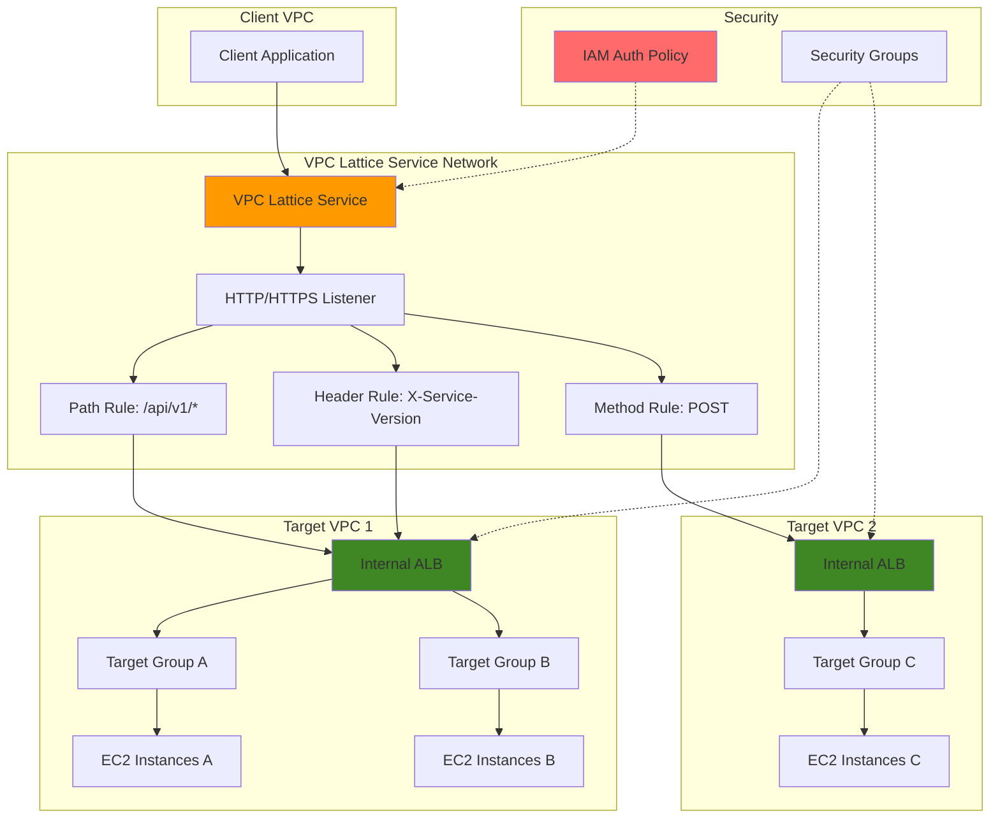

# Advanced Request Routing with VPC Lattice and ALB

## Problem

Enterprise microservices architectures often require sophisticated layer 7 routing across multiple VPCs and AWS accounts, but traditional networking approaches create complex, tightly-coupled systems with security and scalability challenges. Organizations struggle to implement flexible request routing based on paths, headers, and methods while maintaining centralized authentication and authorization policies across distributed services in different network boundaries.

## Solution

VPC Lattice provides a fully managed application networking service that enables sophisticated request routing by integrating Application Load Balancers as targets within a service network. This approach combines ALB's advanced layer 7 routing capabilities with VPC Lattice's cross-VPC connectivity and IAM-based authentication, creating a scalable, secure microservices communication fabric that abstracts network complexity while providing granular traffic control.

## Architecture Diagram



## Prerequisites

1. AWS account with VPC Lattice, EC2, and Elastic Load Balancing permissions
2. AWS CLI v2 installed and configured with appropriate permissions
3. Basic understanding of VPC networking, load balancing, and IAM policies
4. Two VPCs in the same region for cross-VPC connectivity demonstration
5. Estimated cost: $15-25 for 45 minutes (EC2 instances, ALBs, VPC Lattice service)

> **Note**: VPC Lattice pricing is based on processed requests and active service associations. See [VPC Lattice pricing](https://aws.amazon.com/vpc-lattice/pricing/) for detailed cost information.

## Preparation

```bash
# Set environment variables
export AWS_REGION=$(aws configure get region)
export AWS_ACCOUNT_ID=$(aws sts get-caller-identity \
    --query Account --output text)

# Generate unique identifiers for resources
RANDOM_SUFFIX=$(aws secretsmanager get-random-password \
    --exclude-punctuation --exclude-uppercase \
    --password-length 6 --require-each-included-type \
    --output text --query RandomPassword)

# Define resource names
export LATTICE_NETWORK_NAME="advanced-routing-network-${RANDOM_SUFFIX}"
export LATTICE_SERVICE_NAME="api-gateway-service-${RANDOM_SUFFIX}"
export ALB1_NAME="api-service-alb-${RANDOM_SUFFIX}"
export ALB2_NAME="backend-service-alb-${RANDOM_SUFFIX}"

# Get default VPC for initial setup
export VPC_ID=$(aws ec2 describe-vpcs \
    --filters "Name=is-default,Values=true" \
    --query "Vpcs[0].VpcId" --output text)

echo "✅ Environment configured with VPC: ${VPC_ID}"
```

## Steps

1. **Create VPC Lattice Service Network**:

   VPC Lattice service networks provide the foundation for application-layer networking across VPCs and accounts. The service network acts as a logical boundary that enables secure, scalable communication between microservices while abstracting underlying network complexity and providing centralized policy management.

   ```bash
   # Create VPC Lattice service network
   LATTICE_NETWORK_ID=$(aws vpc-lattice create-service-network \
       --name ${LATTICE_NETWORK_NAME} \
       --auth-type "AWS_IAM" \
       --query "id" --output text)
   
   echo "✅ VPC Lattice service network created: ${LATTICE_NETWORK_ID}"
   ```

   The service network is now ready to host multiple services and enables IAM-based authentication for all traffic flowing through the network.

2. **Create Target VPCs and Associate with Service Network**:

   Associating VPCs with the service network enables services within those VPCs to communicate through VPC Lattice. This association automatically configures the necessary networking infrastructure while maintaining security boundaries between different application tiers.

   ```bash
   # Create additional VPC for multi-VPC demonstration
   TARGET_VPC_ID=$(aws ec2 create-vpc \
       --cidr-block "10.1.0.0/16" \
       --tag-specifications \
       "ResourceType=vpc,Tags=[{Key=Name,Value=lattice-target-vpc-${RANDOM_SUFFIX}}]" \
       --query "Vpc.VpcId" --output text)
   
   # Create subnet in target VPC
   TARGET_SUBNET_ID=$(aws ec2 create-subnet \
       --vpc-id ${TARGET_VPC_ID} \
       --cidr-block "10.1.1.0/24" \
       --availability-zone "${AWS_REGION}a" \
       --tag-specifications \
       "ResourceType=subnet,Tags=[{Key=Name,Value=lattice-subnet-${RANDOM_SUFFIX}}]" \
       --query "Subnet.SubnetId" --output text)
   
   # Associate default VPC with service network
   aws vpc-lattice create-service-network-vpc-association \
       --service-network-identifier ${LATTICE_NETWORK_ID} \
       --vpc-identifier ${VPC_ID}
   
   # Associate target VPC with service network
   aws vpc-lattice create-service-network-vpc-association \
       --service-network-identifier ${LATTICE_NETWORK_ID} \
       --vpc-identifier ${TARGET_VPC_ID}
   
   echo "✅ VPCs associated with service network"
   ```

   Both VPCs are now connected through the VPC Lattice service network, enabling cross-VPC communication without complex peering or transit gateway configurations.

3. **Create and Configure Internal Application Load Balancers**:

   Internal ALBs serve as sophisticated layer 7 traffic distributors within VPC Lattice, providing advanced routing capabilities based on paths, headers, and methods. These ALBs must be internal-facing to serve as VPC Lattice targets while maintaining security boundaries.

   ```bash
   # Get default subnets for ALB (requires at least 2 AZs)
   DEFAULT_SUBNET_ID1=$(aws ec2 describe-subnets \
       --filters "Name=vpc-id,Values=${VPC_ID}" \
       "Name=default-for-az,Values=true" \
       --query "Subnets[0].SubnetId" --output text)
   
   DEFAULT_SUBNET_ID2=$(aws ec2 describe-subnets \
       --filters "Name=vpc-id,Values=${VPC_ID}" \
       "Name=default-for-az,Values=true" \
       --query "Subnets[1].SubnetId" --output text)
   
   # Create security group for ALBs
   ALB_SG_ID=$(aws ec2 create-security-group \
       --group-name "lattice-alb-sg-${RANDOM_SUFFIX}" \
       --description "Security group for VPC Lattice ALB targets" \
       --vpc-id ${VPC_ID} \
       --query "GroupId" --output text)
   
   # Allow HTTP/HTTPS traffic to ALB from VPC Lattice
   aws ec2 authorize-security-group-ingress \
       --group-id ${ALB_SG_ID} \
       --protocol tcp --port 80 --cidr 10.0.0.0/8
   
   aws ec2 authorize-security-group-ingress \
       --group-id ${ALB_SG_ID} \
       --protocol tcp --port 443 --cidr 10.0.0.0/8
   
   # Create first internal ALB for API services
   ALB1_ARN=$(aws elbv2 create-load-balancer \
       --name ${ALB1_NAME} \
       --subnets ${DEFAULT_SUBNET_ID1} ${DEFAULT_SUBNET_ID2} \
       --security-groups ${ALB_SG_ID} \
       --scheme internal \
       --type application \
       --query "LoadBalancers[0].LoadBalancerArn" --output text)
   
   echo "✅ Internal ALB created for API services: ${ALB1_ARN}"
   ```

   The internal ALB is configured with appropriate security groups and will serve as a VPC Lattice target, enabling sophisticated routing decisions at the application layer.

4. **Launch EC2 Instances as ALB Targets**:

   EC2 instances running web servers provide the actual application logic behind our routing demonstration. These instances will be registered with ALB target groups and serve different content to demonstrate the effectiveness of our routing rules.

   ```bash
   # Create user data script for web servers
   cat > /tmp/userdata.sh << 'EOF'
#!/bin/bash
dnf update -y
dnf install -y httpd
systemctl start httpd
systemctl enable httpd

# Create different content for routing demonstration
mkdir -p /var/www/html/api/v1
echo "<h1>API V1 Service</h1><p>Path: /api/v1/</p>" > /var/www/html/api/v1/index.html
echo "<h1>Default Service</h1><p>Default routing target</p>" > /var/www/html/index.html
echo "<h1>Beta Service</h1><p>X-Service-Version: beta</p>" > /var/www/html/beta.html

# Configure virtual hosts for header-based routing
cat >> /etc/httpd/conf/httpd.conf << 'VHOST'
<VirtualHost *:80>
    DocumentRoot /var/www/html
    RewriteEngine On
    RewriteCond %{HTTP:X-Service-Version} beta
    RewriteRule ^(.*)$ /beta.html [L]
</VirtualHost>
VHOST

systemctl restart httpd
EOF

   # Get latest Amazon Linux 2023 AMI ID using SSM parameter
   AL2023_AMI_ID=$(aws ssm get-parameter \
       --name "/aws/service/ami-amazon-linux-latest/al2023-ami-kernel-default-x86_64" \
       --query "Parameter.Value" --output text)

   # Launch EC2 instances for ALB targets
   INSTANCE_ID1=$(aws ec2 run-instances \
       --image-id ${AL2023_AMI_ID} \
       --instance-type t3.micro \
       --subnet-id ${DEFAULT_SUBNET_ID1} \
       --security-group-ids ${ALB_SG_ID} \
       --user-data file:///tmp/userdata.sh \
       --tag-specifications \
       "ResourceType=instance,Tags=[{Key=Name,Value=api-service-${RANDOM_SUFFIX}}]" \
       --query "Instances[0].InstanceId" --output text)
   
   echo "✅ EC2 instance launched: ${INSTANCE_ID1}"
   ```

   The EC2 instance is configured with different content paths to demonstrate various routing scenarios including path-based and header-based routing.

5. **Create ALB Target Groups and Register Instances**:

   Target groups define how the ALB distributes traffic to backend instances. By configuring health checks and registration settings, we ensure reliable traffic distribution while maintaining application availability.

   ```bash
   # Create target group for API services
   API_TG_ARN=$(aws elbv2 create-target-group \
       --name "api-tg-${RANDOM_SUFFIX}" \
       --protocol HTTP --port 80 \
       --vpc-id ${VPC_ID} \
       --health-check-path "/" \
       --health-check-interval-seconds 10 \
       --healthy-threshold-count 2 \
       --query "TargetGroups[0].TargetGroupArn" --output text)
   
   # Wait for instance to be running
   aws ec2 wait instance-running --instance-ids ${INSTANCE_ID1}
   
   # Register instance with target group
   aws elbv2 register-targets \
       --target-group-arn ${API_TG_ARN} \
       --targets Id=${INSTANCE_ID1}
   
   # Create ALB listener
   LISTENER_ARN=$(aws elbv2 create-listener \
       --load-balancer-arn ${ALB1_ARN} \
       --protocol HTTP --port 80 \
       --default-actions Type=forward,TargetGroupArn=${API_TG_ARN} \
       --query "Listeners[0].ListenerArn" --output text)
   
   echo "✅ ALB target group configured and instances registered"
   ```

   The target group is configured with health checks to ensure only healthy instances receive traffic, providing resilience and reliability for our application.

6. **Create VPC Lattice Service and Target Groups**:

   VPC Lattice services act as the central routing hub, receiving client requests and applying routing rules to direct traffic to appropriate targets. The service integrates with ALB targets to leverage layer 7 routing capabilities.

   ```bash
   # Create VPC Lattice service
   LATTICE_SERVICE_ID=$(aws vpc-lattice create-service \
       --name ${LATTICE_SERVICE_NAME} \
       --auth-type "AWS_IAM" \
       --query "id" --output text)
   
   # Associate service with service network
   aws vpc-lattice create-service-network-service-association \
       --service-network-identifier ${LATTICE_NETWORK_ID} \
       --service-identifier ${LATTICE_SERVICE_ID}
   
   # Create VPC Lattice target group for ALB
   LATTICE_TG_ID=$(aws vpc-lattice create-target-group \
       --name "alb-targets-${RANDOM_SUFFIX}" \
       --type "ALB" \
       --config VpcIdentifier=${VPC_ID} \
       --query "id" --output text)
   
   # Register ALB as target
   aws vpc-lattice register-targets \
       --target-group-identifier ${LATTICE_TG_ID} \
       --targets Id=${ALB1_ARN}
   
   echo "✅ VPC Lattice service and target groups created"
   ```

   The VPC Lattice service is now configured with the ALB as a target, enabling sophisticated routing decisions at the service mesh level.

7. **Create HTTP Listener with Default Rule**:

   The HTTP listener processes incoming requests and applies routing rules based on request characteristics. The default rule ensures all traffic has a destination while specific rules handle targeted routing scenarios.

   ```bash
   # Create HTTP listener for VPC Lattice service
   LATTICE_LISTENER_ID=$(aws vpc-lattice create-listener \
       --service-identifier ${LATTICE_SERVICE_ID} \
       --name "http-listener" \
       --protocol "HTTP" \
       --port 80 \
       --default-action "Type=forward,TargetGroupIdentifier=${LATTICE_TG_ID}" \
       --query "id" --output text)
   
   echo "✅ HTTP listener created with default routing rule"
   ```

   The listener is now active and ready to process HTTP requests, with a default action that forwards all traffic to our ALB target group.

8. **Configure Advanced Path-Based Routing Rules**:

   Path-based routing enables sophisticated request distribution based on URL patterns, allowing different application components to handle specific API endpoints while maintaining a unified service interface for clients.

   ```bash
   # Create path-based routing rule for API v1
   aws vpc-lattice create-rule \
       --service-identifier ${LATTICE_SERVICE_ID} \
       --listener-identifier ${LATTICE_LISTENER_ID} \
       --name "api-v1-path-rule" \
       --priority 10 \
       --match '{"httpMatch":{"pathMatch":{"match":{"prefix":"/api/v1"}}}}' \
       --action "Type=forward,TargetGroupIdentifier=${LATTICE_TG_ID}"
   
   # Create path-based routing rule for admin endpoints
   aws vpc-lattice create-rule \
       --service-identifier ${LATTICE_SERVICE_ID} \
       --listener-identifier ${LATTICE_LISTENER_ID} \
       --name "admin-path-rule" \
       --priority 20 \
       --match '{"httpMatch":{"pathMatch":{"match":{"exact":"/admin"}}}}' \
       --action '{"fixedResponse":{"statusCode":403}}'
   
   echo "✅ Path-based routing rules configured"
   ```

   Path-based rules now direct API v1 traffic to our ALB while blocking admin access with a fixed response, demonstrating both forwarding and security capabilities.

9. **Configure Header-Based Routing Rules**:

   Header-based routing enables service versioning and feature toggles by examining HTTP headers, allowing sophisticated traffic management strategies like canary deployments and A/B testing without requiring separate service endpoints.

   ```bash
   # Create header-based routing rule for service versioning
   aws vpc-lattice create-rule \
       --service-identifier ${LATTICE_SERVICE_ID} \
       --listener-identifier ${LATTICE_LISTENER_ID} \
       --name "beta-header-rule" \
       --priority 5 \
       --match '{"httpMatch":{"headerMatches":[{"name":"X-Service-Version","match":{"exact":"beta"}}]}}' \
       --action "Type=forward,TargetGroupIdentifier=${LATTICE_TG_ID}"
   
   # Create method-based routing rule for POST requests
   aws vpc-lattice create-rule \
       --service-identifier ${LATTICE_SERVICE_ID} \
       --listener-identifier ${LATTICE_LISTENER_ID} \
       --name "post-method-rule" \
       --priority 15 \
       --match '{"httpMatch":{"method":"POST"}}' \
       --action "Type=forward,TargetGroupIdentifier=${LATTICE_TG_ID}"
   
   echo "✅ Header and method-based routing rules configured"
   ```

   Advanced routing rules now enable request distribution based on service version headers and HTTP methods, providing granular traffic control for microservices architectures.

10. **Configure IAM Authentication Policy**:

    IAM authentication policies provide fine-grained access control for VPC Lattice services, enabling secure service-to-service communication with identity-based authorization that integrates seamlessly with existing AWS security frameworks.

    ```bash
    # Create IAM auth policy for VPC Lattice service
    cat > /tmp/auth-policy.json << EOF
{
    "Version": "2012-10-17",
    "Statement": [
        {
            "Effect": "Allow",
            "Principal": "*",
            "Action": "vpc-lattice-svcs:Invoke",
            "Resource": "*",
            "Condition": {
                "StringEquals": {
                    "aws:PrincipalAccount": "${AWS_ACCOUNT_ID}"
                }
            }
        },
        {
            "Effect": "Deny",
            "Principal": "*",
            "Action": "vpc-lattice-svcs:Invoke",
            "Resource": "*",
            "Condition": {
                "StringEquals": {
                    "vpc-lattice-svcs:RequestPath": "/admin"
                }
            }
        }
    ]
}
EOF

    # Apply auth policy to VPC Lattice service
    aws vpc-lattice put-auth-policy \
        --resource-identifier ${LATTICE_SERVICE_ID} \
        --policy file:///tmp/auth-policy.json
    
    echo "✅ IAM authentication policy configured"
    ```

    The authentication policy now restricts access to the same AWS account while explicitly denying access to admin endpoints, demonstrating security controls at the service mesh level.

## Validation & Testing

1. **Verify VPC Lattice Service Configuration**:

   ```bash
   # Check service network status
   aws vpc-lattice get-service-network \
       --service-network-identifier ${LATTICE_NETWORK_ID}
   
   # Verify service associations
   aws vpc-lattice list-services \
       --query "items[?name=='${LATTICE_SERVICE_NAME}']"
   ```

   Expected output: Service network should show "ACTIVE" status with associated VPCs listed.

2. **Test Path-Based Routing**:

   ```bash
   # Get VPC Lattice service domain name
   SERVICE_DOMAIN=$(aws vpc-lattice get-service \
       --service-identifier ${LATTICE_SERVICE_ID} \
       --query "dnsEntry.domainName" --output text)
   
   # Test API v1 path routing
   curl -v "http://${SERVICE_DOMAIN}/api/v1/"
   
   # Test default path routing
   curl -v "http://${SERVICE_DOMAIN}/"
   ```

   Expected output: Different responses based on path, demonstrating path-based routing functionality.

3. **Test Header-Based Routing**:

   ```bash
   # Test beta service version header
   curl -v -H "X-Service-Version: beta" \
       "http://${SERVICE_DOMAIN}/"
   
   # Test without version header
   curl -v "http://${SERVICE_DOMAIN}/"
   ```

   Expected output: Different responses based on service version header presence.

4. **Verify Security Controls**:

   ```bash
   # Test blocked admin endpoint
   curl -v "http://${SERVICE_DOMAIN}/admin"
   ```

   Expected output: HTTP 403 Forbidden response, confirming security policy enforcement.

## Cleanup

1. **Remove VPC Lattice Resources**:

   ```bash
   # Get rule IDs for deletion
   RULE_IDS=$(aws vpc-lattice list-rules \
       --service-identifier ${LATTICE_SERVICE_ID} \
       --listener-identifier ${LATTICE_LISTENER_ID} \
       --query "items[].id" --output text)
   
   # Delete listener rules
   for RULE_ID in $RULE_IDS; do
       aws vpc-lattice delete-rule \
           --service-identifier ${LATTICE_SERVICE_ID} \
           --listener-identifier ${LATTICE_LISTENER_ID} \
           --rule-identifier ${RULE_ID}
   done
   
   # Delete listener
   aws vpc-lattice delete-listener \
       --service-identifier ${LATTICE_SERVICE_ID} \
       --listener-identifier ${LATTICE_LISTENER_ID}
   
   echo "✅ VPC Lattice rules and listener deleted"
   ```

2. **Remove Target Groups and Service Associations**:

   ```bash
   # Deregister targets from VPC Lattice target group
   aws vpc-lattice deregister-targets \
       --target-group-identifier ${LATTICE_TG_ID} \
       --targets Id=${ALB1_ARN}
   
   # Delete VPC Lattice target group
   aws vpc-lattice delete-target-group \
       --target-group-identifier ${LATTICE_TG_ID}
   
   # Delete service network associations
   aws vpc-lattice delete-service-network-service-association \
       --service-network-identifier ${LATTICE_NETWORK_ID} \
       --service-identifier ${LATTICE_SERVICE_ID}
   
   echo "✅ Target groups and associations removed"
   ```

3. **Remove VPC Lattice Service and Network**:

   ```bash
   # Delete VPC network associations
   aws vpc-lattice delete-service-network-vpc-association \
       --service-network-identifier ${LATTICE_NETWORK_ID} \
       --vpc-identifier ${VPC_ID}
   
   aws vpc-lattice delete-service-network-vpc-association \
       --service-network-identifier ${LATTICE_NETWORK_ID} \
       --vpc-identifier ${TARGET_VPC_ID}
   
   # Delete VPC Lattice service
   aws vpc-lattice delete-service \
       --service-identifier ${LATTICE_SERVICE_ID}
   
   # Delete service network
   aws vpc-lattice delete-service-network \
       --service-network-identifier ${LATTICE_NETWORK_ID}
   
   echo "✅ VPC Lattice service and network deleted"
   ```

4. **Remove EC2 and Load Balancer Resources**:

   ```bash
   # Terminate EC2 instances
   aws ec2 terminate-instances --instance-ids ${INSTANCE_ID1}
   
   # Delete ALB
   aws elbv2 delete-load-balancer \
       --load-balancer-arn ${ALB1_ARN}
   
   # Delete target groups
   aws elbv2 delete-target-group \
       --target-group-arn ${API_TG_ARN}
   
   # Wait for ALB deletion before removing security group
   sleep 60
   
   # Delete security group
   aws ec2 delete-security-group --group-id ${ALB_SG_ID}
   
   # Delete target VPC resources
   aws ec2 delete-subnet --subnet-id ${TARGET_SUBNET_ID}
   aws ec2 delete-vpc --vpc-id ${TARGET_VPC_ID}
   
   # Clean up temporary files
   rm -f /tmp/userdata.sh /tmp/auth-policy.json
   
   echo "✅ All AWS resources cleaned up"
   ```

## Discussion

VPC Lattice represents a significant advancement in AWS networking capabilities, providing a fully managed application networking service that simplifies microservices communication while maintaining enterprise-grade security and scalability. The integration with Application Load Balancers as targets creates a powerful combination that leverages ALB's sophisticated layer 7 routing capabilities within VPC Lattice's cross-VPC service mesh architecture.

The path-based and header-based routing capabilities demonstrated in this recipe enable sophisticated traffic management strategies essential for modern microservices architectures. Path-based routing allows different application components to handle specific API endpoints, while header-based routing enables advanced deployment patterns like canary releases and feature toggles. This granular control is particularly valuable for organizations implementing continuous deployment strategies where traffic can be gradually shifted between service versions based on request characteristics.

VPC Lattice's IAM authentication integration provides a crucial security layer that traditional networking approaches struggle to achieve. By leveraging existing AWS identity and access management frameworks, organizations can implement fine-grained access controls that scale across multiple accounts and VPCs. The auth policies demonstrated here show how security can be enforced at the service mesh level, providing defense-in-depth protection that complements application-level security measures.

The cross-VPC connectivity provided by VPC Lattice eliminates the complexity traditionally associated with multi-VPC architectures. Without VPC Lattice, organizations typically rely on VPC peering, transit gateways, or complex routing configurations that become increasingly difficult to manage as the number of VPCs grows. VPC Lattice abstracts this complexity while providing better observability and control over service-to-service communication patterns. The service automatically manages service discovery, load balancing, and health checking across the service mesh.

> **Tip**: Monitor VPC Lattice metrics in CloudWatch to optimize routing rules and identify performance bottlenecks. The service provides detailed metrics on request latency, error rates, and target health that can inform architectural decisions.

For more detailed information, refer to the [VPC Lattice User Guide](https://docs.aws.amazon.com/vpc-lattice/latest/ug/), [Application Load Balancer Integration](https://docs.aws.amazon.com/vpc-lattice/latest/ug/alb-target.html), [VPC Lattice Authentication Policies](https://docs.aws.amazon.com/vpc-lattice/latest/ug/auth-policies.html), [VPC Lattice Listener Rules](https://docs.aws.amazon.com/vpc-lattice/latest/ug/listener-rules.html), and [AWS Well-Architected Framework Networking Pillar](https://docs.aws.amazon.com/wellarchitected/latest/framework/networking-pillar.html).

## Challenge

Extend this solution by implementing these enhancements:

1. **Multi-Region Service Mesh**: Deploy VPC Lattice services across multiple AWS regions with Route 53 health checks for global load balancing and disaster recovery capabilities.

2. **Advanced Weighted Routing**: Implement weighted target groups within VPC Lattice rules to enable sophisticated canary deployment strategies with percentage-based traffic splitting.

3. **Service Discovery Integration**: Integrate with AWS App Mesh or Kubernetes service discovery to automatically register and deregister services with VPC Lattice target groups based on application lifecycle events.

4. **Observability Enhancement**: Implement comprehensive monitoring using AWS X-Ray distributed tracing, CloudWatch Container Insights, and custom metrics to provide end-to-end visibility across the service mesh.

5. **Security Automation**: Create Lambda functions that automatically update VPC Lattice auth policies based on AWS Config compliance rules and Security Hub findings to maintain security posture as the architecture evolves.

## Infrastructure Code

### Available Infrastructure as Code:

- [Infrastructure Code Overview](code/README.md) - Detailed description of all infrastructure components
- [AWS CDK (Python)](code/cdk-python/) - AWS CDK Python implementation
- [AWS CDK (TypeScript)](code/cdk-typescript/) - AWS CDK TypeScript implementation
- [CloudFormation](code/cloudformation.yaml) - AWS CloudFormation template
- [Bash CLI Scripts](code/scripts/) - Example bash scripts using AWS CLI commands to deploy infrastructure
- [Terraform](code/terraform/) - Terraform configuration files