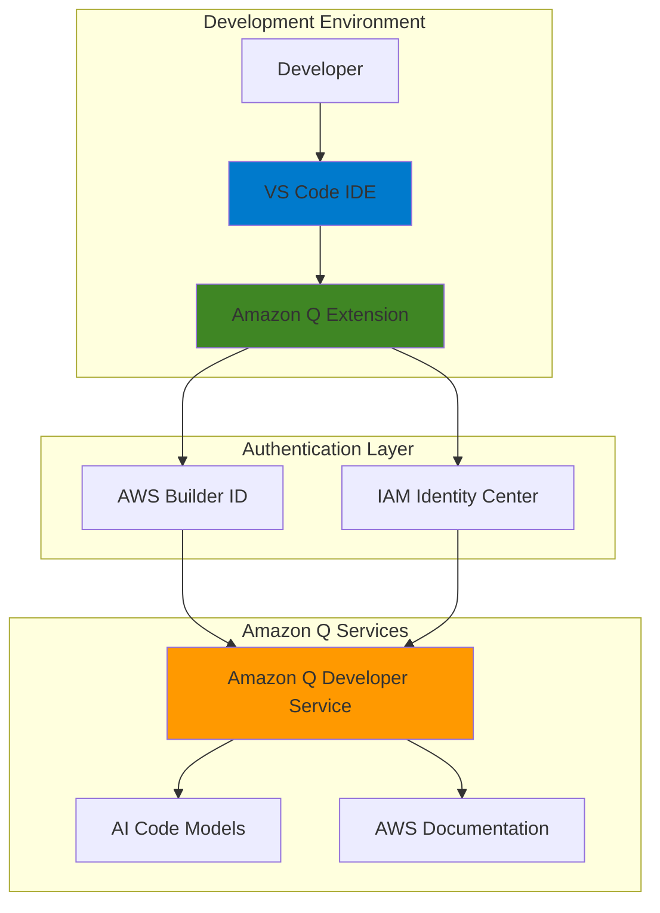

# AI Code Assistant Setup with Amazon Q Developer

## Problem

Modern software developers face significant productivity challenges when writing code, debugging applications, and learning new AWS services. Developers spend considerable time searching documentation, writing boilerplate code, and debugging syntax errors. Without intelligent code assistance, development cycles become slower, code quality decreases, and developers struggle to keep up with rapidly evolving cloud services and best practices.

## Solution

Amazon Q Developer provides an AI-powered coding assistant that integrates directly into Visual Studio Code, offering real-time code suggestions, intelligent chat capabilities, and comprehensive AWS guidance. By setting up Amazon Q Developer with proper authentication, developers gain access to context-aware code generation, security scanning, debugging assistance, and instant access to AWS documentation and best practices.

## Architecture Diagram



## Prerequisites

1. Visual Studio Code 1.85.0 or higher installed on your system
2. Active internet connection for extension download and authentication
3. AWS Builder ID account (free) or IAM Identity Center access (Pro subscription)
4. Basic familiarity with VS Code extension management
5. Estimated cost: Free with AWS Builder ID (generous usage limits), Amazon Q Developer Pro starts at $19/user/month for IAM Identity Center authentication

> **Note**: Amazon Q Developer offers a generous free tier through AWS Builder ID that requires no AWS account or payment information.

## Preparation

```bash
# Verify VS Code is installed and accessible
code --version

# Set environment variables for later use
export VSCODE_EXTENSION_ID="AmazonWebServices.amazon-q-vscode"
export Q_MARKETPLACE_URL="https://marketplace.visualstudio.com/items?itemName=AmazonWebServices.amazon-q-vscode"

# Check if AWS CLI is installed (optional for enhanced experience)
aws --version 2>/dev/null || \
    echo "AWS CLI not installed - proceeding with Builder ID setup"

echo "✅ Development environment prepared for Amazon Q Developer setup"
```

## Steps

1. **Install Amazon Q Developer Extension in VS Code**:

   Amazon Q Developer integrates seamlessly into VS Code through an official extension that provides AI-powered coding assistance directly in your development environment. The extension connects to Amazon's advanced language models trained on millions of code repositories and AWS documentation to provide contextually relevant suggestions and explanations.

   ```bash
   # Open VS Code and install the extension via command line
   code --install-extension ${VSCODE_EXTENSION_ID}
   
   # Alternatively, install via VS Code marketplace
   echo "Extension can also be installed from: ${Q_MARKETPLACE_URL}"
   
   echo "✅ Amazon Q Developer extension installed in VS Code"
   ```

   The extension installation adds Amazon Q capabilities to your VS Code interface, including the chat panel, inline suggestions, and various AI-powered development features that will activate once authentication is completed.

2. **Launch VS Code and Locate Amazon Q Interface**:

   ```bash
   # Launch VS Code to begin the authentication process
   code
   
   echo "Look for the Amazon Q icon in the VS Code activity bar (left sidebar)"
   echo "The Amazon Q icon appears as a stylized 'Q' symbol"
   echo "✅ VS Code launched with Amazon Q extension active"
   ```

3. **Initiate Amazon Q Authentication Setup**:

   Amazon Q Developer offers two authentication methods: AWS Builder ID for free individual use, and IAM Identity Center for enterprise users with Pro subscriptions. Builder ID provides generous free usage limits and requires no AWS account, making it ideal for individual developers and learning purposes.

   ```bash
   # In VS Code, click the Amazon Q icon in the activity bar
   # This opens the Amazon Q panel at the bottom of the interface
   
   echo "Click 'Start using Amazon Q' or similar prompt in the Q panel"
   echo "Select authentication method based on your needs:"
   echo "  - AWS Builder ID: Free individual use, no AWS account required"
   echo "  - IAM Identity Center: Enterprise/Pro subscription required"
   echo "✅ Authentication dialog opened"
   ```

4. **Complete AWS Builder ID Authentication (Free Option)**:

   AWS Builder ID provides a streamlined authentication experience that connects you to Amazon Q Developer's free tier without requiring an AWS account. This option includes generous usage limits for code suggestions, chat interactions, and basic security scanning capabilities.

   ```bash
   # Follow these steps in VS Code:
   # 1. Select "Personal account" or "AWS Builder ID" option
   # 2. Click "Continue" to open browser authentication
   # 3. Complete the Builder ID sign-up or sign-in process
   # 4. Return to VS Code when authentication completes
   
   echo "Browser will open for Builder ID authentication"
   echo "Create new Builder ID account if needed (free)"
   echo "Grant necessary permissions when prompted"
   echo "✅ AWS Builder ID authentication initiated"
   ```

   The authentication process securely establishes a connection between your VS Code environment and Amazon Q services, enabling personalized code suggestions based on your coding patterns and preferences.

5. **Verify Amazon Q Developer Connection**:

   ```bash
   # Test the connection by opening the Amazon Q chat panel
   # Look for the Amazon Q icon in the bottom panel or side panel
   # The interface should show "Connected" or similar status
   
   echo "Amazon Q should now be active in VS Code"
   echo "Look for the Q icon in the activity bar (left sidebar)"
   echo "Connection status should indicate successful authentication"
   echo "✅ Amazon Q Developer connection established"
   ```

6. **Configure Amazon Q Developer Settings**:

   Amazon Q Developer offers customizable settings to optimize the AI assistance based on your development preferences and security requirements. These settings control suggestion frequency, code reference handling, and privacy preferences for your development workflow.

   ```bash
   # Access Amazon Q settings in VS Code:
   # 1. Open VS Code Settings (Ctrl+, or Cmd+,)
   # 2. Search for "Amazon Q" in settings
   # 3. Review and adjust preferences as needed
   
   echo "Key settings to review:"
   echo "  - Inline suggestions frequency and behavior"
   echo "  - Code reference inclusion preferences"
   echo "  - Chat and suggestion language preferences"
   echo "  - Security scanning and code review settings"
   echo "✅ Amazon Q Developer settings configured"
   ```

7. **Test Core Amazon Q Developer Features**:

   Amazon Q Developer provides multiple AI-powered features including inline code completion, intelligent chat assistance, security vulnerability detection, and comprehensive AWS service guidance. The service supports 15+ programming languages including Python, TypeScript, Rust, Terraform, and AWS CloudFormation. Testing these features ensures the complete setup is working correctly.

   ```bash
   # Test inline suggestions:
   # 1. Create a new file (e.g., test.py, test.js)
   # 2. Start typing a function - observe inline suggestions
   # 3. Use Tab to accept suggestions
   
   # Test chat functionality:
   # 1. Open Amazon Q chat panel
   # 2. Ask a question like "How do I create an S3 bucket?"
   # 3. Try agent commands like /dev, /test, /review, /doc
   
   echo "Test both inline suggestions and chat features"
   echo "Suggestions should appear as you type code"
   echo "Chat should provide AWS and coding guidance"
   echo "Try agent commands for advanced functionality"
   echo "✅ Core Amazon Q Developer features tested"
   ```

## Validation & Testing

1. **Verify Extension Installation and Activation**:

   ```bash
   # Check that Amazon Q extension is installed and enabled
   code --list-extensions | grep -i amazon-q
   
   # Expected output should include:
   # AmazonWebServices.amazon-q-vscode
   echo "Amazon Q extension should appear in the list above"
   ```

2. **Test Inline Code Suggestions**:

   ```python
   # Create a new Python file and test suggestions
   # Type the following in VS Code and observe suggestions:
   
   def calculate_fibonacci(n):
       # Amazon Q should suggest implementation here
       # Try typing "if n <= 1:" to see suggestions
   ```

   Expected behavior: Amazon Q provides intelligent code completions as you type, suggesting function implementations, variable names, and coding patterns based on the context. Suggestions appear in real-time as gray text that you can accept with Tab.

3. **Test Chat Interface and Agent Commands**:

   ```bash
   # Open Amazon Q chat panel in VS Code
   # Ask test questions to verify responses:
   
   echo "Test questions to ask in Amazon Q chat:"
   echo "1. 'How do I create a Lambda function?'"
   echo "2. 'What are AWS best practices for S3?'"
   echo "3. 'Help me debug this Python error'"
   echo "4. Try agent commands: /dev, /test, /review, /doc"
   echo "Chat should provide detailed, helpful responses"
   echo "Agent commands enable advanced code generation tasks"
   ```

4. **Verify Authentication Status**:

   ```bash
   # Check authentication status in VS Code
   # Look for user indicator in Amazon Q panel
   # Status should show connected/authenticated state
   
   echo "Amazon Q panel should show authenticated status"
   echo "User email or Builder ID should be visible"
   echo "No authentication errors should be present"
   ```

## Cleanup

1. **Disable Amazon Q Developer (Optional)**:

   ```bash
   # To temporarily disable the extension:
   code --disable-extension ${VSCODE_EXTENSION_ID}
   
   echo "✅ Amazon Q Developer extension disabled"
   ```

2. **Remove Amazon Q Developer Extension (Optional)**:

   ```bash
   # To completely remove the extension:
   code --uninstall-extension ${VSCODE_EXTENSION_ID}
   
   echo "✅ Amazon Q Developer extension uninstalled"
   ```

3. **Revoke Authentication (Optional)**:

   ```bash
   # To sign out from Amazon Q:
   # 1. Open Amazon Q panel in VS Code
   # 2. Look for sign-out or disconnect option
   # 3. Confirm sign-out when prompted
   
   echo "Sign out completed through VS Code interface"
   echo "✅ Amazon Q Developer authentication revoked"
   ```

## Discussion

Amazon Q Developer represents a significant advancement in AI-powered development tools, specifically designed to enhance productivity for developers working with AWS services and general software development. The service leverages large language models trained on vast repositories of code and AWS documentation to provide contextually relevant assistance throughout the development lifecycle, supporting 15+ programming languages including Python, TypeScript, Rust, Terraform, and AWS CloudFormation.

The authentication architecture supports both individual developers through AWS Builder ID and enterprise users through IAM Identity Center. The [AWS Builder ID](https://docs.aws.amazon.com/amazonq/latest/qdeveloper-ug/q-in-IDE-setup.html) option provides an accessible entry point with generous free usage limits, while IAM Identity Center integration enables organizations to maintain centralized access control and leverage advanced Pro features for $19/user/month. This dual approach ensures that Amazon Q Developer can scale from individual learning scenarios to enterprise development environments.

Amazon Q Developer's inline suggestion capabilities utilize advanced code analysis to understand context, coding patterns, and developer intent. The system provides suggestions ranging from single-line completions to entire function implementations, with particular strength in AWS-specific code patterns and best practices. The [intelligent suggestion system](https://docs.aws.amazon.com/amazonq/latest/qdeveloper-ug/inline-suggestions.html) learns from your coding style while respecting privacy boundaries, never storing or sharing your proprietary code.

The chat interface extends beyond simple code completion to provide comprehensive development assistance, including architecture guidance, debugging help, and detailed explanations of AWS services and best practices. Advanced agent commands (/dev, /test, /review, /doc, /transform) enable sophisticated code generation tasks like implementing new features across entire projects, generating unit tests, performing code reviews, and creating documentation. This conversational approach enables developers to receive contextual guidance without leaving their development environment, significantly reducing the time spent searching documentation or troubleshooting issues.

Amazon Q Developer includes integrated security scanning capabilities that automatically detect potential vulnerabilities and security issues in your code. The code reference log feature attributes suggestions that are similar to training data, ensuring transparency about code origins. For enterprise users, the Pro tier provides enhanced security scanning, custom model training capabilities, and administrative controls that align with organizational security policies.

> **Tip**: Use Amazon Q Developer's agent commands like /review for automated code reviews and /test for generating comprehensive unit tests, helping maintain code quality and AWS security best practices throughout development. See the [Amazon Q Developer features documentation](https://docs.aws.amazon.com/amazonq/latest/qdeveloper-ug/features.html) for complete capability details.

## Challenge

Extend your Amazon Q Developer setup with these enhancements:

1. **Master Agent Commands for Advanced Development**: Explore Amazon Q's powerful agent commands including /dev for feature implementation, /test for unit test generation, /review for code analysis, /doc for documentation creation, and /transform for Java application upgrades.

2. **Configure Custom Code Style Preferences**: Explore Amazon Q settings to customize suggestion behavior, code formatting preferences, and language-specific configurations to match your team's coding standards and practices.

3. **Integrate with Team Development Workflow**: Set up Amazon Q with your team's existing Git workflow, exploring how the AI suggestions work with code reviews, branch management, and collaborative development practices using the code reference log for transparency.

4. **Explore Advanced AWS Service Integration**: Use Amazon Q's chat feature to design and implement a complete AWS architecture, leveraging its knowledge of service integrations, best practices, and cost optimization strategies across multiple AWS services.

5. **Set up Enterprise IAM Identity Center Authentication**: If working in an enterprise environment, configure IAM Identity Center authentication to access Amazon Q Developer Pro features, including enhanced security scanning, custom model training, and administrative controls for organizational governance.

## Infrastructure Code

### Available Infrastructure as Code:

- [Infrastructure Code Overview](code/README.md) - Detailed description of all infrastructure components
- [AWS CDK (Python)](code/cdk-python/) - AWS CDK Python implementation
- [AWS CDK (TypeScript)](code/cdk-typescript/) - AWS CDK TypeScript implementation
- [CloudFormation](code/cloudformation.yaml) - AWS CloudFormation template
- [Bash CLI Scripts](code/scripts/) - Example bash scripts using AWS CLI commands to deploy infrastructure
- [Terraform](code/terraform/) - Terraform configuration files