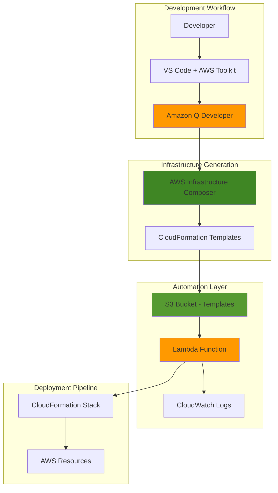

# AI-Powered Infrastructure Code Generation with Amazon Q Developer

## Problem

Development teams struggle with creating consistent, well-architected infrastructure code across multiple projects and environments. Traditional approaches require deep expertise in infrastructure as code (IaC) syntax, AWS service configurations, and best practices, leading to inconsistent implementations, security vulnerabilities, and significant time investment. Manual infrastructure code generation creates bottlenecks in deployment pipelines and increases the risk of human error in complex multi-service architectures.

## Solution

Build an automated system that leverages Amazon Q Developer's AI capabilities integrated with AWS Infrastructure Composer to generate, validate, and deploy infrastructure code templates. This solution uses S3 event triggers to automatically initiate Lambda functions that interact with Infrastructure Composer's visual design capabilities, enabling teams to rapidly prototype and deploy standardized, secure infrastructure patterns with AI-powered code generation and validation.

## Architecture Diagram



## Prerequisites

1. AWS account with administrator permissions for Lambda, S3, CloudFormation, and IAM
2. AWS CLI v2 installed and configured (or AWS CloudShell)
3. Visual Studio Code with AWS Toolkit extension installed
4. Amazon Q Developer authentication (AWS Builder ID or IAM Identity Center)
5. Basic understanding of infrastructure as code concepts and AWS services
6. Estimated cost: $5-10 for Lambda executions, S3 storage, and CloudWatch logs during tutorial

> **Note**: Amazon Q Developer provides a generous free tier for individual developers. See the [Amazon Q Developer pricing page](https://aws.amazon.com/q/developer/pricing/) for current usage limits and costs.

## Preparation

```bash
# Set environment variables
export AWS_REGION=$(aws configure get region)
export AWS_ACCOUNT_ID=$(aws sts get-caller-identity \
    --query Account --output text)

# Generate unique identifiers for resources
RANDOM_SUFFIX=$(aws secretsmanager get-random-password \
    --exclude-punctuation --exclude-uppercase \
    --password-length 6 --require-each-included-type \
    --output text --query RandomPassword)

export BUCKET_NAME="q-developer-templates-${RANDOM_SUFFIX}"
export LAMBDA_FUNCTION_NAME="template-processor-${RANDOM_SUFFIX}"
export IAM_ROLE_NAME="q-developer-automation-role-${RANDOM_SUFFIX}"

# Create S3 bucket for template storage
aws s3 mb s3://${BUCKET_NAME} --region ${AWS_REGION}

# Enable versioning for template history
aws s3api put-bucket-versioning \
    --bucket ${BUCKET_NAME} \
    --versioning-configuration Status=Enabled

echo "✅ S3 bucket created: ${BUCKET_NAME}"
```

## Steps

1. **Create IAM Role for Lambda Function**:

   AWS Lambda requires appropriate IAM permissions to access S3, CloudFormation, and CloudWatch services for our infrastructure automation pipeline. This role follows the principle of least privilege while enabling the Lambda function to read template files, validate infrastructure configurations, and deploy CloudFormation stacks. Understanding IAM role configuration is crucial for serverless security and governance as it provides the foundation for secure automation workflows.

   ```bash
   # Create trust policy for Lambda service
   cat > /tmp/lambda-trust-policy.json << 'EOF'
   {
       "Version": "2012-10-17",
       "Statement": [
           {
               "Effect": "Allow",
               "Principal": {
                   "Service": "lambda.amazonaws.com"
               },
               "Action": "sts:AssumeRole"
           }
       ]
   }
   EOF
   
   # Create IAM role for Lambda
   aws iam create-role \
       --role-name ${IAM_ROLE_NAME} \
       --assume-role-policy-document file:///tmp/lambda-trust-policy.json \
       --description "Role for Q Developer template processing Lambda"
   
   # Store role ARN for later use
   export LAMBDA_ROLE_ARN=$(aws iam get-role \
       --role-name ${IAM_ROLE_NAME} \
       --query 'Role.Arn' --output text)
   
   echo "✅ IAM role created: ${LAMBDA_ROLE_ARN}"
   ```

   The Lambda execution role is now established with the foundational trust relationship. This security configuration ensures that only the Lambda service can assume this role, preventing unauthorized access while enabling our automation functions to execute with appropriate permissions.

2. **Attach Permissions Policies to Lambda Role**:

   Lambda functions require specific permissions to interact with AWS services in our infrastructure automation pipeline. These policies grant the minimum necessary permissions for S3 access, CloudFormation operations, and CloudWatch logging while maintaining security best practices. This configuration enables comprehensive infrastructure lifecycle management through AI-assisted automation while adhering to the principle of least privilege.

   ```bash
   # Attach AWS managed policy for basic Lambda execution
   aws iam attach-role-policy \
       --role-name ${IAM_ROLE_NAME} \
       --policy-arn arn:aws:iam::aws:policy/service-role/AWSLambdaBasicExecutionRole
   
   # Create custom policy for S3 and CloudFormation access
   cat > /tmp/lambda-permissions-policy.json << EOF
   {
       "Version": "2012-10-17",
       "Statement": [
           {
               "Effect": "Allow",
               "Action": [
                   "s3:GetObject",
                   "s3:GetObjectVersion",
                   "s3:PutObject",
                   "s3:ListBucket"
               ],
               "Resource": [
                   "arn:aws:s3:::${BUCKET_NAME}",
                   "arn:aws:s3:::${BUCKET_NAME}/*"
               ]
           },
           {
               "Effect": "Allow",
               "Action": [
                   "cloudformation:ValidateTemplate",
                   "cloudformation:CreateStack",
                   "cloudformation:DescribeStacks",
                   "cloudformation:DescribeStackEvents",
                   "cloudformation:UpdateStack",
                   "cloudformation:DeleteStack"
               ],
               "Resource": "*"
           },
           {
               "Effect": "Allow",
               "Action": [
                   "iam:PassRole",
                   "iam:CreateRole",
                   "iam:AttachRolePolicy",
                   "iam:GetRole"
               ],
               "Resource": "*"
           }
       ]
   }
   EOF
   
   # Create and attach the custom policy
   aws iam create-policy \
       --policy-name "QDeveloperTemplateProcessorPolicy-${RANDOM_SUFFIX}" \
       --policy-document file:///tmp/lambda-permissions-policy.json \
       --description "Custom policy for Q Developer template processing"
   
   export CUSTOM_POLICY_ARN="arn:aws:iam::${AWS_ACCOUNT_ID}:policy/QDeveloperTemplateProcessorPolicy-${RANDOM_SUFFIX}"
   
   aws iam attach-role-policy \
       --role-name ${IAM_ROLE_NAME} \
       --policy-arn ${CUSTOM_POLICY_ARN}
   
   echo "✅ IAM policies attached to Lambda role"
   ```

   The Lambda function now has comprehensive permissions to orchestrate infrastructure deployment workflows. This configuration enables secure access to S3 template storage, CloudFormation stack management, and IAM operations required for dynamic infrastructure provisioning through Amazon Q Developer-generated templates.

3. **Create Lambda Function for Template Processing**:

   AWS Lambda provides serverless compute that automatically processes infrastructure templates when they're uploaded to S3. This function validates CloudFormation templates generated by Amazon Q Developer, checks for security best practices, and optionally deploys infrastructure stacks. The serverless approach eliminates infrastructure management overhead while providing scalable, event-driven template processing capabilities that can handle multiple concurrent template uploads.

   ```bash
   # Create the Lambda function code
   mkdir -p /tmp/lambda-function
   
   cat > /tmp/lambda-function/index.py << 'EOF'
   import json
   import boto3
   import logging
   from urllib.parse import unquote_plus
   
   # Configure logging
   logger = logging.getLogger()
   logger.setLevel(logging.INFO)
   
   # Initialize AWS clients
   s3_client = boto3.client('s3')
   cfn_client = boto3.client('cloudformation')
   
   def lambda_handler(event, context):
       """
       Process CloudFormation templates uploaded to S3
       Validates templates and optionally deploys infrastructure
       """
       try:
           # Parse S3 event notification
           for record in event['Records']:
               bucket = record['s3']['bucket']['name']
               key = unquote_plus(record['s3']['object']['key'])
               
               logger.info(f"Processing template: {key} from bucket: {bucket}")
               
               # Download template from S3
               response = s3_client.get_object(Bucket=bucket, Key=key)
               template_body = response['Body'].read().decode('utf-8')
               
               # Validate CloudFormation template
               try:
                   validation_response = cfn_client.validate_template(
                       TemplateBody=template_body
                   )
                   logger.info(f"Template validation successful: {validation_response.get('Description', 'No description')}")
                   
                   # Extract metadata from template
                   template_data = json.loads(template_body) if template_body.strip().startswith('{') else {}
                   stack_name = template_data.get('Metadata', {}).get('StackName', f"q-developer-stack-{key.replace('.json', '').replace('/', '-')}")
                   
                   # Create CloudFormation stack (optional - controlled by parameter)
                   if key.startswith('auto-deploy/'):
                       logger.info(f"Auto-deploying stack: {stack_name}")
                       cfn_client.create_stack(
                           StackName=stack_name,
                           TemplateBody=template_body,
                           Capabilities=['CAPABILITY_IAM', 'CAPABILITY_NAMED_IAM'],
                           Tags=[
                               {'Key': 'Source', 'Value': 'QDeveloperAutomation'},
                               {'Key': 'TemplateFile', 'Value': key}
                           ]
                       )
                       
                   # Store validation results
                   validation_result = {
                       'template_file': key,
                       'validation_status': 'VALID',
                       'description': validation_response.get('Description', ''),
                       'parameters': validation_response.get('Parameters', []),
                       'capabilities': validation_response.get('Capabilities', [])
                   }
                   
                   # Save validation results to S3
                   result_key = f"validation-results/{key.replace('.json', '-validation.json')}"
                   s3_client.put_object(
                       Bucket=bucket,
                       Key=result_key,
                       Body=json.dumps(validation_result, indent=2),
                       ContentType='application/json'
                   )
                   
               except Exception as validation_error:
                   logger.error(f"Template validation failed: {str(validation_error)}")
                   
                   # Store validation error
                   error_result = {
                       'template_file': key,
                       'validation_status': 'INVALID',
                       'error': str(validation_error)
                   }
                   
                   result_key = f"validation-results/{key.replace('.json', '-error.json')}"
                   s3_client.put_object(
                       Bucket=bucket,
                       Key=result_key,
                       Body=json.dumps(error_result, indent=2),
                       ContentType='application/json'
                   )
           
           return {
               'statusCode': 200,
               'body': json.dumps('Template processing completed successfully')
           }
           
       except Exception as e:
           logger.error(f"Lambda execution error: {str(e)}")
           return {
               'statusCode': 500,
               'body': json.dumps(f'Error processing template: {str(e)}')
           }
   EOF
   
   # Create deployment package
   cd /tmp/lambda-function
   zip -r ../lambda-function.zip .
   cd -
   
   # Create Lambda function
   aws lambda create-function \
       --function-name ${LAMBDA_FUNCTION_NAME} \
       --runtime python3.11 \
       --role ${LAMBDA_ROLE_ARN} \
       --handler index.lambda_handler \
       --zip-file fileb:///tmp/lambda-function.zip \
       --timeout 60 \
       --memory-size 256 \
       --description "Processes CloudFormation templates from Amazon Q Developer"
   
   echo "✅ Lambda function created: ${LAMBDA_FUNCTION_NAME}"
   ```

   The Lambda function is now deployed and ready to process infrastructure templates. This serverless processor automatically validates CloudFormation templates, checks for deployment readiness, and optionally creates infrastructure stacks, providing a complete automation pipeline for Amazon Q Developer-generated infrastructure code.

4. **Configure S3 Event Notification**:

   S3 event notifications enable automatic Lambda function triggering when infrastructure templates are uploaded, creating a seamless CI/CD pipeline for infrastructure deployment. This event-driven architecture eliminates manual intervention and ensures immediate validation and processing of Amazon Q Developer-generated templates. The configuration establishes real-time responsiveness to infrastructure code changes while filtering specifically for JSON templates in the designated directory.

   ```bash
   # Get Lambda function ARN
   export LAMBDA_FUNCTION_ARN=$(aws lambda get-function \
       --function-name ${LAMBDA_FUNCTION_NAME} \
       --query 'Configuration.FunctionArn' --output text)
   
   # Grant S3 permission to invoke Lambda
   aws lambda add-permission \
       --function-name ${LAMBDA_FUNCTION_NAME} \
       --principal s3.amazonaws.com \
       --action lambda:InvokeFunction \
       --source-arn arn:aws:s3:::${BUCKET_NAME} \
       --statement-id "s3-trigger-permission-${RANDOM_SUFFIX}"
   
   # Create S3 event notification configuration
   cat > /tmp/s3-notification.json << EOF
   {
       "LambdaConfigurations": [
           {
               "Id": "template-processing-trigger",
               "LambdaFunctionArn": "${LAMBDA_FUNCTION_ARN}",
               "Events": ["s3:ObjectCreated:*"],
               "Filter": {
                   "Key": {
                       "FilterRules": [
                           {
                               "Name": "suffix",
                               "Value": ".json"
                           },
                           {
                               "Name": "prefix",
                               "Value": "templates/"
                           }
                       ]
                   }
               }
           }
       ]
   }
   EOF
   
   # Apply notification configuration to S3 bucket
   aws s3api put-bucket-notification-configuration \
       --bucket ${BUCKET_NAME} \
       --notification-configuration file:///tmp/s3-notification.json
   
   echo "✅ S3 event notification configured"
   ```

   The S3 bucket now automatically triggers Lambda processing when JSON templates are uploaded to the `templates/` prefix. This automation enables seamless integration between Amazon Q Developer's template generation and our validation/deployment pipeline, creating an efficient infrastructure-as-code workflow.

5. **Set Up Amazon Q Developer in VS Code**:

   Amazon Q Developer integration with Visual Studio Code provides AI-powered assistance for infrastructure design and code generation. This setup enables developers to leverage Amazon Q's contextual understanding of AWS services, best practices, and architectural patterns directly within their development environment. The integration streamlines infrastructure development by providing intelligent suggestions and automated code generation capabilities based on natural language prompts and requirements.

   ```bash
   # Create sample infrastructure requirements file
   mkdir -p /tmp/q-developer-workspace
   
   cat > /tmp/q-developer-workspace/infrastructure-requirements.md << 'EOF'
   # Infrastructure Requirements for Sample Application
   
   ## Application Overview
   A serverless web application that processes user uploads and generates reports.
   
   ## Infrastructure Components Needed:
   
   ### Frontend Layer
   - Static website hosting with global CDN
   - Custom domain with SSL certificate
   
   ### API Layer  
   - REST API with authentication
   - API Gateway with Lambda integration
   - Request validation and throttling
   
   ### Processing Layer
   - File upload processing (images, documents)
   - Asynchronous report generation
   - Queue-based task processing
   
   ### Storage Layer
   - Object storage for user uploads
   - NoSQL database for user data and metadata
   - Backup and archival policies
   
   ### Security & Monitoring
   - IAM roles with least privilege
   - CloudWatch monitoring and alerting
   - Access logging and audit trails
   
   ## Deployment Requirements
   - Multi-environment support (dev, staging, prod)
   - Blue-green deployment capability
   - Automated rollback on failures
   
   ## Compliance & Governance
   - Data encryption at rest and in transit
   - Resource tagging strategy
   - Cost optimization policies
   EOF
   
   # Create sample prompt templates for Q Developer
   cat > /tmp/q-developer-workspace/q-prompts.md << 'EOF'
   # Amazon Q Developer Prompt Templates
   
   ## Infrastructure Generation Prompts
   
   ### Basic Web Application Stack
   "Generate a CloudFormation template for a serverless web application with:
   - S3 bucket for static hosting with CloudFront distribution
   - API Gateway with Lambda backend functions
   - DynamoDB table for user data storage
   - IAM roles with appropriate permissions
   Include proper security configurations and follow AWS best practices."
   
   ### Microservices Architecture
   "Create infrastructure code for a microservices architecture using:
   - ECS Fargate for container orchestration
   - Application Load Balancer for traffic distribution
   - RDS Aurora for relational data storage
   - ElastiCache for session management
   - VPC with public and private subnets across multiple AZs"
   
   ### Data Processing Pipeline
   "Design a data processing infrastructure with:
   - S3 buckets for data ingestion and processed output
   - Kinesis Data Streams for real-time data processing
   - Lambda functions for data transformation
   - Glue for ETL operations
   - Redshift for data warehousing and analytics"
   
   ## Security-Focused Prompts
   
   ### Zero-Trust Network Architecture
   "Generate infrastructure for a zero-trust security model including:
   - VPC with no internet gateways
   - VPC endpoints for AWS service access
   - Transit Gateway for network connectivity
   - AWS Config for compliance monitoring
   - GuardDuty for threat detection"
   EOF
   
   echo "✅ Q Developer workspace and prompt templates created"
   echo "Next: Open VS Code and install AWS Toolkit extension"
   echo "Follow setup instructions at: https://docs.aws.amazon.com/amazonq/latest/qdeveloper-ug/q-in-IDE-setup.html"
   ```

   The workspace is prepared with infrastructure requirements and prompt templates that guide effective interaction with Amazon Q Developer. These templates help developers communicate complex infrastructure needs to the AI assistant, ensuring comprehensive and well-architected infrastructure code generation.

6. **Generate Infrastructure Templates with Q Developer**:

   Amazon Q Developer's AI capabilities enable rapid generation of infrastructure templates based on natural language descriptions and architectural requirements. This step demonstrates how to leverage Q Developer within AWS Infrastructure Composer to create comprehensive CloudFormation templates that follow AWS best practices and security guidelines. The AI-assisted approach significantly accelerates infrastructure design and reduces the complexity of manual template creation while ensuring consistency across projects.

   ```bash
   # Create sample infrastructure template using Q Developer patterns
   cat > /tmp/sample-serverless-template.json << 'EOF'
   {
       "AWSTemplateFormatVersion": "2010-09-09",
       "Description": "Serverless web application generated with Amazon Q Developer assistance",
       "Metadata": {
           "StackName": "q-developer-serverless-app",
           "GeneratedBy": "Amazon Q Developer",
           "Architecture": "Serverless Web Application"
       },
       "Parameters": {
           "ApplicationName": {
               "Type": "String",
               "Default": "QDeveloperApp",
               "Description": "Name of the application"
           },
           "Environment": {
               "Type": "String",
               "Default": "dev",
               "AllowedValues": ["dev", "staging", "prod"],
               "Description": "Deployment environment"
           }
       },
       "Resources": {
           "S3Bucket": {
               "Type": "AWS::S3::Bucket",
               "Properties": {
                   "BucketName": {
                       "Fn::Sub": "${ApplicationName}-${Environment}-static-content"
                   },
                   "PublicAccessBlockConfiguration": {
                       "BlockPublicAcls": true,
                       "BlockPublicPolicy": true,
                       "IgnorePublicAcls": true,
                       "RestrictPublicBuckets": true
                   },
                   "BucketEncryption": {
                       "ServerSideEncryptionConfiguration": [
                           {
                               "ServerSideEncryptionByDefault": {
                                   "SSEAlgorithm": "AES256"
                               }
                           }
                       ]
                   },
                   "VersioningConfiguration": {
                       "Status": "Enabled"
                   }
               }
           },
           "DynamoDBTable": {
               "Type": "AWS::DynamoDB::Table",
               "Properties": {
                   "TableName": {
                       "Fn::Sub": "${ApplicationName}-${Environment}-user-data"
                   },
                   "BillingMode": "PAY_PER_REQUEST",
                   "AttributeDefinitions": [
                       {
                           "AttributeName": "userId",
                           "AttributeType": "S"
                       }
                   ],
                   "KeySchema": [
                       {
                           "AttributeName": "userId",
                           "KeyType": "HASH"
                       }
                   ],
                   "SSESpecification": {
                       "SSEEnabled": true
                   },
                   "PointInTimeRecoverySpecification": {
                       "PointInTimeRecoveryEnabled": true
                   }
               }
           },
           "LambdaExecutionRole": {
               "Type": "AWS::IAM::Role",
               "Properties": {
                   "AssumeRolePolicyDocument": {
                       "Version": "2012-10-17",
                       "Statement": [
                           {
                               "Effect": "Allow",
                               "Principal": {
                                   "Service": "lambda.amazonaws.com"
                               },
                               "Action": "sts:AssumeRole"
                           }
                       ]
                   },
                   "ManagedPolicyArns": [
                       "arn:aws:iam::aws:policy/service-role/AWSLambdaBasicExecutionRole"
                   ],
                   "Policies": [
                       {
                           "PolicyName": "DynamoDBAccess",
                           "PolicyDocument": {
                               "Version": "2012-10-17",
                               "Statement": [
                                   {
                                       "Effect": "Allow",
                                       "Action": [
                                           "dynamodb:GetItem",
                                           "dynamodb:PutItem",
                                           "dynamodb:UpdateItem",
                                           "dynamodb:DeleteItem",
                                           "dynamodb:Query",
                                           "dynamodb:Scan"
                                       ],
                                       "Resource": {
                                           "Fn::GetAtt": ["DynamoDBTable", "Arn"]
                                       }
                                   }
                               ]
                           }
                       }
                   ]
               }
           },
           "ApiLambdaFunction": {
               "Type": "AWS::Lambda::Function",
               "Properties": {
                   "FunctionName": {
                       "Fn::Sub": "${ApplicationName}-${Environment}-api"
                   },
                   "Runtime": "python3.11",
                   "Handler": "index.handler",
                   "Role": {
                       "Fn::GetAtt": ["LambdaExecutionRole", "Arn"]
                   },
                   "Code": {
                       "ZipFile": "import json\nimport boto3\n\ndef handler(event, context):\n    return {\n        'statusCode': 200,\n        'body': json.dumps('Hello from Q Developer generated Lambda!')\n    }\n"
                   },
                   "Environment": {
                       "Variables": {
                           "TABLE_NAME": {
                               "Ref": "DynamoDBTable"
                           },
                           "ENVIRONMENT": {
                               "Ref": "Environment"
                           }
                       }
                   }
               }
           }
       },
       "Outputs": {
           "S3BucketName": {
               "Description": "Name of the S3 bucket for static content",
               "Value": {
                   "Ref": "S3Bucket"
               },
               "Export": {
                   "Name": {
                       "Fn::Sub": "${AWS::StackName}-S3Bucket"
                   }
               }
           },
           "DynamoDBTableName": {
               "Description": "Name of the DynamoDB table",
               "Value": {
                   "Ref": "DynamoDBTable"
               },
               "Export": {
                   "Name": {
                       "Fn::Sub": "${AWS::StackName}-DynamoDBTable"
                   }
               }
           },
           "LambdaFunctionArn": {
               "Description": "ARN of the Lambda function",
               "Value": {
                   "Fn::GetAtt": ["ApiLambdaFunction", "Arn"]
               },
               "Export": {
                   "Name": {
                       "Fn::Sub": "${AWS::StackName}-LambdaArn"
                   }
               }
           }
       }
   }
   EOF
   
   # Upload sample template to trigger processing
   aws s3 cp /tmp/sample-serverless-template.json \
       s3://${BUCKET_NAME}/templates/sample-serverless-app.json
   
   echo "✅ Sample infrastructure template uploaded and processing initiated"
   echo "Check CloudWatch Logs for Lambda execution details"
   ```

   The sample infrastructure template demonstrates Amazon Q Developer's capability to generate comprehensive, production-ready infrastructure code. This template includes security best practices, proper resource configuration, and follows AWS Well-Architected Framework principles, showcasing the AI assistant's understanding of cloud architecture patterns.

7. **Test Infrastructure Composer Integration**:

   AWS Infrastructure Composer provides a visual interface for designing cloud architectures that integrates seamlessly with Amazon Q Developer's AI capabilities. This step demonstrates how to use Infrastructure Composer's drag-and-drop interface combined with Q Developer's intelligent code generation to rapidly prototype and refine infrastructure designs. The visual approach accelerates understanding and enables collaborative infrastructure development between technical and non-technical stakeholders.

   ```bash
   # Create Infrastructure Composer project configuration
   cat > /tmp/composer-project.json << 'EOF'
   {
       "version": "1.0",
       "projectName": "Q Developer Serverless Application",
       "description": "Sample project demonstrating Q Developer integration with Infrastructure Composer",
       "architecture": {
           "components": [
               {
                   "type": "AWS::S3::Bucket",
                   "name": "StaticContentBucket",
                   "properties": {
                       "encryption": "enabled",
                       "versioning": "enabled",
                       "publicAccess": "blocked"
                   }
               },
               {
                   "type": "AWS::Lambda::Function",
                   "name": "ApiFunction",
                   "properties": {
                       "runtime": "python3.11",
                       "handler": "index.handler",
                       "timeout": 30
                   }
               },
               {
                   "type": "AWS::DynamoDB::Table",
                   "name": "UserDataTable",
                   "properties": {
                       "billingMode": "PAY_PER_REQUEST",
                       "encryption": "enabled",
                       "backups": "enabled"
                   }
               },
               {
                   "type": "AWS::ApiGateway::RestApi",
                   "name": "ApplicationApi",
                   "properties": {
                       "endpointType": "REGIONAL",
                       "authentication": "enabled"
                   }
               }
           ],
           "connections": [
               {
                   "from": "ApplicationApi",
                   "to": "ApiFunction",
                   "type": "integration"
               },
               {
                   "from": "ApiFunction",
                   "to": "UserDataTable",
                   "type": "access"
               }
           ]
       },
       "deployment": {
           "environments": ["development", "staging", "production"],
           "regions": ["us-east-1", "us-west-2"],
           "cicd": "enabled"
       }
   }
   EOF
   
   # Create a template for auto-deployment testing
   cat > /tmp/auto-deploy-template.json << 'EOF'
   {
       "AWSTemplateFormatVersion": "2010-09-09",
       "Description": "Auto-deployment test template for Q Developer automation",
       "Metadata": {
           "StackName": "q-developer-auto-test",
           "AutoDeploy": true
       },
       "Resources": {
           "TestS3Bucket": {
               "Type": "AWS::S3::Bucket",
               "Properties": {
                   "BucketName": {
                       "Fn::Sub": "q-developer-test-${AWS::AccountId}-${AWS::Region}"
                   },
                   "PublicAccessBlockConfiguration": {
                       "BlockPublicAcls": true,
                       "BlockPublicPolicy": true,
                       "IgnorePublicAcls": true,
                       "RestrictPublicBuckets": true
                   }
               }
           }
       },
       "Outputs": {
           "BucketName": {
               "Description": "Test bucket created by Q Developer automation",
               "Value": {
                   "Ref": "TestS3Bucket"
               }
           }
       }
   }
   EOF
   
   # Upload project configuration
   aws s3 cp /tmp/composer-project.json \
       s3://${BUCKET_NAME}/projects/composer-project.json
   
   # Upload auto-deployment template
   aws s3 cp /tmp/auto-deploy-template.json \
       s3://${BUCKET_NAME}/auto-deploy/test-infrastructure.json
   
   echo "✅ Infrastructure Composer project and auto-deploy template uploaded"
   echo "Template processing will be triggered automatically"
   ```

   Infrastructure Composer integration is now configured to work seamlessly with Amazon Q Developer's AI capabilities. The visual design interface combined with intelligent code generation creates a powerful workflow for rapid infrastructure prototyping and deployment automation.

8. **Monitor and Validate Template Processing**:

   CloudWatch Logs provides comprehensive monitoring capabilities for our Lambda-based template processing pipeline. This monitoring enables real-time visibility into template validation results, deployment status, and error conditions. Understanding logging and monitoring patterns is essential for maintaining reliable infrastructure automation and troubleshooting deployment issues in production environments.

   ```bash
   # Check Lambda function logs
   echo "Checking Lambda function execution logs..."
   aws logs describe-log-groups \
       --log-group-name-prefix "/aws/lambda/${LAMBDA_FUNCTION_NAME}" \
       --query 'logGroups[0].logGroupName' --output text
   
   # Get recent log events
   LOG_GROUP_NAME="/aws/lambda/${LAMBDA_FUNCTION_NAME}"
   
   # Wait for log events to be available
   sleep 30
   
   # Retrieve and display recent log events
   aws logs filter-log-events \
       --log-group-name ${LOG_GROUP_NAME} \
       --start-time $(date -d '5 minutes ago' +%s)000 \
       --query 'events[*].[timestamp,message]' \
       --output table
   
   # Check validation results in S3
   echo "Checking validation results..."
   aws s3 ls s3://${BUCKET_NAME}/validation-results/ --recursive
   
   # Download and display validation result
   if aws s3 ls s3://${BUCKET_NAME}/validation-results/ | grep -q validation; then
       VALIDATION_FILE=$(aws s3 ls s3://${BUCKET_NAME}/validation-results/ | head -1 | awk '{print $4}')
       aws s3 cp s3://${BUCKET_NAME}/validation-results/${VALIDATION_FILE} /tmp/validation-result.json
       echo "Validation Result:"
       cat /tmp/validation-result.json | jq '.'
   fi
   
   echo "✅ Template processing monitoring completed"
   ```

   The monitoring system provides real-time insights into template processing performance and validation results. This observability enables rapid identification of issues and ensures reliable infrastructure automation workflows powered by Amazon Q Developer's AI capabilities.

## Validation & Testing

1. Verify Lambda function is processing templates correctly:

   ```bash
   # Check Lambda function status
   aws lambda get-function \
       --function-name ${LAMBDA_FUNCTION_NAME} \
       --query 'Configuration.[FunctionName,State,Runtime,Handler]' \
       --output table
   ```

   Expected output: Function should show as "Active" state with correct runtime and handler.

2. Test S3 event trigger functionality:

   ```bash
   # Create a test CloudFormation template
   cat > /tmp/test-template.json << 'EOF'
   {
       "AWSTemplateFormatVersion": "2010-09-09",
       "Description": "Test template for Q Developer automation",
       "Resources": {
           "TestParameter": {
               "Type": "AWS::SSM::Parameter",
               "Properties": {
                   "Name": "/test/q-developer-validation",
                   "Type": "String",
                   "Value": "Template validation successful"
               }
           }
       }
   }
   EOF
   
   # Upload test template
   aws s3 cp /tmp/test-template.json \
       s3://${BUCKET_NAME}/templates/test-validation.json
   
   # Wait and check for validation results
   sleep 15
   aws s3 ls s3://${BUCKET_NAME}/validation-results/
   ```

3. Validate CloudFormation template processing:

   ```bash
   # Check if validation results were created
   aws s3 cp s3://${BUCKET_NAME}/validation-results/test-validation-validation.json \
       /tmp/test-validation-result.json 2>/dev/null
   
   if [ -f /tmp/test-validation-result.json ]; then
       echo "Validation result found:"
       cat /tmp/test-validation-result.json | jq '.validation_status'
   else
       echo "Validation result not found - check Lambda logs"
   fi
   ```

4. Test Infrastructure Composer integration:

   ```bash
   # Verify project configuration upload
   aws s3api head-object \
       --bucket ${BUCKET_NAME} \
       --key "projects/composer-project.json" \
       --query 'LastModified' --output text
   
   echo "Infrastructure Composer project configuration verified"
   ```

## Cleanup

1. Remove CloudFormation stacks created during testing:

   ```bash
   # List stacks created by our automation
   aws cloudformation list-stacks \
       --stack-status-filter CREATE_COMPLETE \
       --query 'StackSummaries[?contains(StackName, `q-developer`)].StackName' \
       --output text
   
   # Delete test stacks (if any were created)
   for stack in $(aws cloudformation list-stacks --stack-status-filter CREATE_COMPLETE --query 'StackSummaries[?contains(StackName, `q-developer`)].StackName' --output text); do
       echo "Deleting stack: $stack"
       aws cloudformation delete-stack --stack-name $stack
   done
   
   echo "✅ CloudFormation stacks cleanup initiated"
   ```

2. Remove S3 bucket and contents:

   ```bash
   # Delete all objects in the bucket
   aws s3 rm s3://${BUCKET_NAME} --recursive
   
   # Delete the bucket
   aws s3 rb s3://${BUCKET_NAME}
   
   echo "✅ S3 bucket and contents deleted"
   ```

3. Delete Lambda function and related resources:

   ```bash
   # Remove S3 trigger permission
   aws lambda remove-permission \
       --function-name ${LAMBDA_FUNCTION_NAME} \
       --statement-id "s3-trigger-permission-${RANDOM_SUFFIX}" \
       2>/dev/null || true
   
   # Delete Lambda function
   aws lambda delete-function \
       --function-name ${LAMBDA_FUNCTION_NAME}
   
   echo "✅ Lambda function deleted"
   ```

4. Clean up IAM roles and policies:

   ```bash
   # Detach policies from role
   aws iam detach-role-policy \
       --role-name ${IAM_ROLE_NAME} \
       --policy-arn arn:aws:iam::aws:policy/service-role/AWSLambdaBasicExecutionRole
   
   aws iam detach-role-policy \
       --role-name ${IAM_ROLE_NAME} \
       --policy-arn ${CUSTOM_POLICY_ARN}
   
   # Delete custom policy
   aws iam delete-policy \
       --policy-arn ${CUSTOM_POLICY_ARN}
   
   # Delete IAM role
   aws iam delete-role \
       --role-name ${IAM_ROLE_NAME}
   
   echo "✅ IAM resources cleaned up"
   ```

5. Remove temporary files:

   ```bash
   # Clean up local temporary files
   rm -rf /tmp/lambda-function*
   rm -f /tmp/*.json /tmp/*.md
   rm -rf /tmp/q-developer-workspace
   
   echo "✅ Temporary files cleaned up"
   ```

## Discussion

Creating AI-powered infrastructure code generation with Amazon Q Developer and AWS Infrastructure Composer represents a paradigm shift in how development teams approach infrastructure as code. This solution combines the visual design capabilities of Infrastructure Composer with the intelligent code generation capabilities of Amazon Q Developer, creating a comprehensive platform for rapid infrastructure development and deployment. The integration enables both technical and non-technical stakeholders to participate in infrastructure design while ensuring adherence to AWS best practices and security standards. For comprehensive guidance on Amazon Q Developer capabilities, see the [Amazon Q Developer User Guide](https://docs.aws.amazon.com/amazonq/latest/qdeveloper-ug/what-is.html) and [AWS Infrastructure Composer documentation](https://docs.aws.amazon.com/infrastructure-composer/latest/dg/index.html).

The serverless automation pipeline created in this recipe demonstrates the power of event-driven architecture for infrastructure lifecycle management. By leveraging S3 event notifications and Lambda functions, the system provides immediate feedback on template validity and can automatically deploy infrastructure when appropriate. This approach reduces the time between infrastructure design and deployment while maintaining quality control through automated validation. The CloudFormation integration ensures that all deployed infrastructure follows AWS-native approaches and can be managed through standard AWS tooling. For detailed information on Lambda integration patterns, review the [AWS Lambda Developer Guide](https://docs.aws.amazon.com/lambda/latest/dg/) and [S3 event notification documentation](https://docs.aws.amazon.com/AmazonS3/latest/userguide/notification-how-to.html).

From a security and governance perspective, this architecture implements several important patterns including least-privilege IAM roles, encrypted storage, and comprehensive logging. The Lambda function operates with precisely the permissions needed for its operations, and all template processing activities are logged to CloudWatch for audit and troubleshooting purposes. The S3 bucket configuration follows security best practices with versioning, encryption, and public access restrictions. This design aligns with the AWS Well-Architected Framework's Security Pillar, ensuring that infrastructure automation maintains enterprise-grade security standards. For additional security guidance, see the [AWS Security Best Practices](https://docs.aws.amazon.com/security/latest/userguide/best-practices.html) and [IAM best practices documentation](https://docs.aws.amazon.com/IAM/latest/UserGuide/best-practices.html).

The combination of Amazon Q Developer's AI capabilities with Infrastructure Composer's visual design interface creates an accessible entry point for infrastructure development while maintaining the rigor and reliability required for production environments. This approach democratizes infrastructure development, enabling teams to focus on business logic and application features rather than complex infrastructure syntax and configuration details. The automated validation and deployment pipeline ensures that AI-generated infrastructure code meets quality standards and can be safely deployed across multiple environments.

> **Tip**: Use Amazon Q Developer's contextual awareness by providing detailed infrastructure requirements and architectural constraints in your prompts. The AI assistant performs better when given specific context about security requirements, compliance needs, and performance objectives. See the [Amazon Q Developer best practices guide](https://docs.aws.amazon.com/amazonq/latest/qdeveloper-ug/q-in-IDE-best-practices.html) for optimization techniques.

> **Warning**: Auto-deployment features should be used cautiously in production environments. Always implement proper approval workflows and testing procedures before enabling automatic stack creation for production templates.

## Challenge

Extend this solution by implementing these enhancements:

1. **Multi-Environment Pipeline**: Create separate S3 prefixes for development, staging, and production templates with environment-specific validation rules and deployment approval workflows using AWS Step Functions and SNS notifications.

2. **Infrastructure Cost Analysis**: Integrate AWS Cost Explorer APIs to automatically estimate infrastructure costs for generated templates and provide cost optimization recommendations before deployment.

3. **Advanced Security Scanning**: Implement AWS Config Rules and AWS Security Hub integration to automatically scan generated infrastructure templates for security compliance violations and provide remediation suggestions.

4. **GitOps Integration**: Connect the pipeline to GitHub Actions or AWS CodePipeline to automatically commit generated infrastructure templates to version control and trigger deployment workflows through infrastructure repositories.

5. **AI-Powered Optimization**: Enhance the Lambda function to use Amazon Bedrock or Amazon SageMaker to analyze infrastructure patterns and suggest optimizations for cost, performance, and security based on AWS Well-Architected Framework principles.

## Infrastructure Code

*Infrastructure code will be generated after recipe approval.*