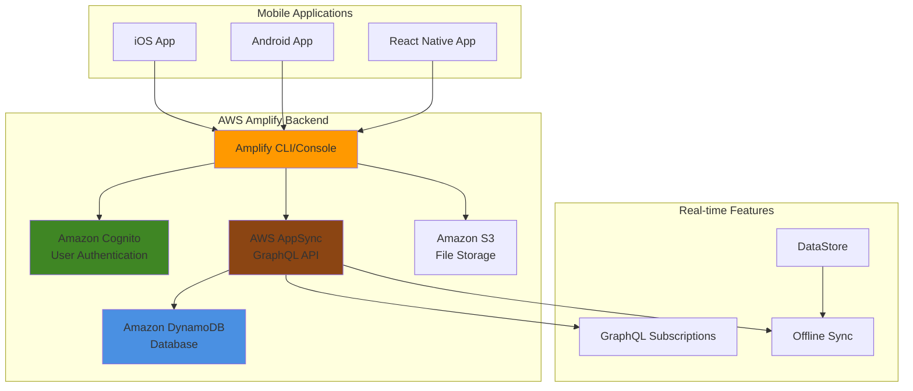

# Amplify Mobile Backend with Authentication and APIs

## Problem

Mobile application teams struggle with building scalable backend services that handle user authentication, real-time data synchronization, and offline capabilities. Traditional backend development requires managing multiple AWS services, complex API integrations, and maintaining separate infrastructure for authentication, data storage, and file management. Teams often spend months setting up secure user flows, configuring GraphQL APIs, and implementing real-time features, significantly delaying mobile app launches and increasing development costs.

## Solution

AWS Amplify provides a comprehensive platform for building mobile backends with authentication, GraphQL APIs, and real-time data synchronization. This solution leverages Amplify CLI to automatically provision Amazon Cognito for user management, AWS AppSync for GraphQL APIs, and Amazon DynamoDB for data storage. The platform handles security configurations, scaling, and service integrations automatically, enabling rapid mobile application development with built-in offline capabilities and real-time subscriptions.

## Architecture Diagram



## Prerequisites

1. AWS account with administrator permissions for Amplify, Cognito, AppSync, DynamoDB, and S3
2. AWS CLI v2 installed and configured (or AWS CloudShell)
3. Node.js 16.x or later and npm installed
4. Amplify CLI installed globally (`npm install -g @aws-amplify/cli`)
5. Basic knowledge of GraphQL, mobile development, and serverless architecture
6. Estimated cost: $10-20/month for development environment (includes DynamoDB, AppSync, and Cognito usage)

> **Note**: This recipe uses Amplify CLI Gen 1 for comprehensive backend service coverage. Gen 2 is available but has different configuration approaches.

## Preparation

```bash
# Set environment variables
export AWS_REGION=$(aws configure get region)
export AWS_ACCOUNT_ID=$(aws sts get-caller-identity \
    --query Account --output text)

# Generate unique project identifier
export PROJECT_SUFFIX=$(aws secretsmanager get-random-password \
    --exclude-punctuation --exclude-uppercase \
    --password-length 6 --require-each-included-type \
    --output text --query RandomPassword)

export PROJECT_NAME="mobile-backend-${PROJECT_SUFFIX}"

# Create project directory
mkdir -p ~/amplify-projects/${PROJECT_NAME}
cd ~/amplify-projects/${PROJECT_NAME}

# Verify Amplify CLI installation
amplify --version

echo "✅ Environment prepared for project: ${PROJECT_NAME}"
```

## Steps

1. **Initialize Amplify Backend Project**:

   AWS Amplify provides a declarative approach to mobile backend development by automatically provisioning and configuring AWS services based on your application requirements. The initialization process creates a local project structure that defines your backend resources as code, enabling version control and reproducible deployments across environments.

   ```bash
   # Initialize Amplify project with interactive setup
   amplify init
   
   # Use these configuration values when prompted:
   # Project name: mobile-backend-app
   # Environment: dev
   # Default editor: Visual Studio Code
   # App type: javascript
   # JavaScript framework: react-native
   # Source Directory Path: src
   # Distribution Directory Path: build
   # Build Command: npm run build
   # Start Command: npm start
   # AWS Profile: default (or your preferred profile)
   
   echo "✅ Amplify project initialized successfully"
   ```

   The initialization establishes the foundation for your mobile backend by creating an amplify folder with configuration files and setting up CloudFormation templates. This Infrastructure as Code approach ensures consistent deployments and enables team collaboration through shared backend definitions.

2. **Add Authentication with Cognito**:

   Amazon Cognito provides enterprise-grade user authentication and authorization without requiring custom backend development. It handles user registration, login, password recovery, and multi-factor authentication while maintaining compliance with security standards like GDPR and HIPAA. The service automatically scales to support millions of users and integrates seamlessly with other AWS services.

   ```bash
   # Add Amazon Cognito authentication
   amplify add auth
   
   # Configuration options:
   # - Use default authentication and security configuration: Default configuration
   # - How do you want users to be able to sign in: Email
   # - Do you want to configure advanced settings: No, I am done
   
   echo "✅ Authentication configured with Amazon Cognito"
   ```

   This configuration creates a Cognito User Pool for user management and a Cognito Identity Pool for temporary AWS credentials. The User Pool manages user accounts, authentication flows, and security policies, while the Identity Pool provides fine-grained access control to AWS resources based on user authentication status.

3. **Create GraphQL API with AppSync**:

   AWS AppSync provides a managed GraphQL service that automatically handles real-time data synchronization, offline capabilities, and conflict resolution for mobile applications. Unlike traditional REST APIs, GraphQL enables clients to request exactly the data they need, reducing bandwidth usage and improving mobile performance. AppSync automatically generates resolvers that connect your GraphQL schema to multiple data sources including DynamoDB, Lambda, and external APIs.

   ```bash
   # Add GraphQL API
   amplify add api
   
   # Configuration options:
   # - Select from services: GraphQL
   # - Provide API name: MobileBackendAPI
   # - Choose authorization type: Amazon Cognito User Pool
   # - Do you want to configure advanced settings: No
   # - Do you have an annotated GraphQL schema: No
   # - Choose schema template: Single object with fields
   # - Do you want to edit the schema now: Yes
   
   echo "✅ GraphQL API configured with AWS AppSync"
   ```

   The API is now configured with Cognito User Pool authorization, ensuring that only authenticated users can access your backend data. AppSync automatically creates the necessary IAM roles and policies for secure data access, while providing built-in subscription support for real-time updates across all connected mobile clients.

4. **Configure File Storage**:

   Amazon S3 provides virtually unlimited, secure object storage with 99.999999999% (11 9's) durability, making it ideal for mobile applications that need to store user-generated content like photos, videos, and documents. Amplify automatically configures fine-grained access controls that ensure users can only access their own files, preventing unauthorized data access. The service generates pre-signed URLs for secure direct uploads from mobile devices, eliminating the need to proxy large files through your backend servers.

   ```bash
   # Add S3 storage for file uploads
   amplify add storage
   
   # Select Content (Images, audio, video, etc.)
   # Provide friendly name: ${PROJECT_NAME}Storage
   # Provide bucket name: ${PROJECT_NAME}-user-files-${PROJECT_SUFFIX}
   # Who should have access: Auth users only
   # What kind of access: create/update, read, delete
   # Do you want to add a Lambda Trigger: No
   
   export STORAGE_BUCKET_NAME="${PROJECT_NAME}-user-files-${PROJECT_SUFFIX}"
   
   echo "✅ S3 storage configured for authenticated users"
   ```

   The storage configuration creates user-specific folder structures within S3, automatically organizing files by user identity. This approach provides data isolation while enabling efficient content delivery through CloudFront integration and support for various storage classes to optimize costs based on access patterns.

5. **Add Push Notification Support**:

   Amazon Pinpoint provides comprehensive user engagement capabilities including push notifications, email campaigns, SMS messaging, and in-app messaging. The service enables targeted communication based on user behavior, demographics, and custom attributes, supporting advanced features like A/B testing and campaign analytics. Push notifications are essential for mobile app retention, enabling real-time user engagement and re-activation strategies.

   ```bash
   # Add analytics (includes push notification capabilities)
   amplify add analytics
   
   # Select Amazon Pinpoint
   # Provide app name: ${PROJECT_NAME}Analytics
   # Apps need authorization to send analytics events: Yes
   
   # Add notifications category
   amplify add notifications
   
   # Choose FCM (Firebase Cloud Messaging) for Android
   # Choose APNS (Apple Push Notification Service) for iOS
   # Note: You'll need to configure these with your app credentials later
   
   echo "✅ Push notification services configured"
   ```

   This configuration establishes the foundation for user engagement analytics and multi-channel messaging. Pinpoint automatically tracks user sessions, custom events, and user journeys, providing insights that inform targeted notification strategies and improve user experience through personalized communication.

6. **Add Custom Business Logic Functions**:

   AWS Lambda enables serverless execution of custom business logic without managing infrastructure, automatically scaling based on demand while charging only for actual compute time. Lambda functions integrate seamlessly with AppSync as GraphQL resolvers, enabling complex data transformations, third-party API integrations, and business rule enforcement. This serverless approach reduces operational overhead while providing unlimited scalability for mobile backend operations.

   ```bash
   # Add Lambda function for custom business logic
   amplify add function
   
   # Provide function name: ${PROJECT_NAME}PostProcessor
   # Choose runtime: NodeJS
   # Choose function template: Hello World
   # Do you want to configure advanced settings: No
   # Do you want to edit the local function now: Yes
   
   # Create a post processing function
   cat > amplify/backend/function/${PROJECT_NAME}PostProcessor/src/index.js << 'EOF'
   const AWS = require('aws-sdk');
   const dynamodb = new AWS.DynamoDB.DocumentClient();
   
   exports.handler = async (event) => {
       console.log('Event received:', JSON.stringify(event, null, 2));
       
       try {
           // Example: Process post creation and send notifications
           if (event.typeName === 'Mutation' && event.fieldName === 'createPost') {
               const post = event.arguments.input;
               
               // Add processing logic here
               // Example: content moderation, image processing, etc.
               
               return {
                   statusCode: 200,
                   body: JSON.stringify({
                       message: 'Post processed successfully',
                       postId: post.id
                   })
               };
           }
           
           return {
               statusCode: 200,
               body: JSON.stringify({ message: 'Function executed successfully' })
           };
       } catch (error) {
           console.error('Error:', error);
           return {
               statusCode: 500,
               body: JSON.stringify({ error: 'Internal server error' })
           };
       }
   };
   EOF
   
   echo "✅ Custom Lambda function created for post processing"
   ```

   The function is now configured as a potential AppSync resolver for handling complex business operations that require custom logic beyond simple database operations. This enables content moderation, data validation, external API integrations, and other sophisticated backend processing required by modern mobile applications.

7. **Configure Advanced Authentication Features**:

   Enhanced authentication capabilities provide improved security through multi-factor authentication, email/phone verification, and extended session management. These features reduce user account takeovers while improving user experience through longer session durations and verified contact information. Cognito's advanced features enable compliance with security frameworks and support sophisticated user onboarding workflows.

   ```bash
   # Update auth to add social providers and advanced features
   amplify update auth
   
   # Select: I want to make some additional changes
   # What attributes are required for signing up: Email, Phone Number
   # Specify the app's refresh token expiration period: 30 days
   # Do you want to specify the user attributes: Yes
   # Specify read attributes: Email, Phone Number, Family Name, Given Name
   # Do you want to enable any of the following capabilities: 
   #   - Email Verification, Phone Number Verification
   # Do you want to use an OAuth flow: No (for now)
   # Do you want to configure Lambda Triggers: No
   
   echo "✅ Advanced authentication features configured"
   ```

   The enhanced configuration establishes verified communication channels and extends session management, reducing the frequency of user re-authentication while maintaining security. Email and phone verification enable trusted communication for password resets, important notifications, and multi-factor authentication challenges.

8. **Deploy All Backend Services**:

   The deployment process orchestrates the creation of multiple AWS services with their interconnections, security policies, and configurations through CloudFormation. This Infrastructure as Code approach ensures consistent, reproducible deployments while automatically handling service dependencies and resource ordering. The deployment creates a complete, production-ready mobile backend infrastructure that scales automatically based on usage patterns.

   ```bash
   # Deploy all configured services to AWS
   amplify push
   
   # Confirm deployment when prompted
   # This will create:
   # - Cognito User Pool and Identity Pool
   # - AppSync GraphQL API
   # - DynamoDB tables
   # - S3 bucket for file storage
   # - Lambda functions
   # - Pinpoint project for analytics and notifications
   
   # Wait for deployment to complete (typically 10-15 minutes)
   
   echo "✅ All backend services deployed successfully"
   ```

   The deployment establishes a fully integrated mobile backend with automatic scaling, security configurations, and monitoring capabilities. All services are interconnected with appropriate IAM roles and policies, enabling secure data flow and user access controls across the entire backend architecture.

9. **Configure Client-Side Integration**:

   The Amplify client libraries provide a unified interface for mobile applications to interact with AWS services, handling complex operations like authentication flows, GraphQL caching, offline data synchronization, and file uploads. These libraries abstract the complexity of AWS service APIs while providing high-level methods that integrate seamlessly with React Native, iOS, and Android development patterns.

   ```bash
   # Install required Amplify libraries
   npm install aws-amplify aws-amplify-react-native \
       amazon-cognito-identity-js @react-native-async-storage/async-storage \
       @react-native-community/netinfo react-native-get-random-values
   
   # For iOS, install CocoaPods dependencies
   cd ios && pod install && cd ..
   
   # Create Amplify configuration file
   cat > src/amplify-config.js << 'EOF'
   import { Amplify } from 'aws-amplify';
   import config from './aws-exports';
   
   Amplify.configure(config);
   
   export default Amplify;
   EOF
   
   echo "✅ Client-side Amplify libraries installed and configured"
   ```

   The configuration establishes the connection between your mobile application and the deployed AWS backend services. The aws-exports file contains all necessary endpoints, API keys, and configuration parameters automatically generated during deployment, enabling secure communication without hardcoded credentials in your application code.

10. **Set Up Monitoring and Logging**:

    Comprehensive monitoring enables proactive identification of performance issues, security threats, and user experience problems before they impact mobile application users. CloudWatch provides real-time metrics, logs, and alarms for all Amplify services, enabling data-driven optimization decisions. Monitoring dashboards provide visibility into API performance, authentication success rates, and user engagement patterns essential for production mobile applications.

    ```bash
    # The services automatically create CloudWatch logs
    # View the created log groups
    aws logs describe-log-groups \
        --log-group-name-prefix "/aws/lambda/${PROJECT_NAME}" \
        --region ${AWS_REGION}
    
    # Create CloudWatch dashboard for monitoring
    aws cloudwatch put-dashboard \
        --dashboard-name "${PROJECT_NAME}-Mobile-Backend" \
        --dashboard-body "{
            \"widgets\": [
                {
                    \"type\": \"metric\",
                    \"properties\": {
                        \"metrics\": [
                            [\"AWS/AppSync\", \"4XXError\"],
                            [\"AWS/AppSync\", \"5XXError\"],
                            [\"AWS/AppSync\", \"RequestCount\"]
                        ],
                        \"period\": 300,
                        \"stat\": \"Sum\",
                        \"region\": \"${AWS_REGION}\",
                        \"title\": \"AppSync API Metrics\"
                    }
                }
            ]
        }"
    
    echo "✅ Monitoring and logging configured"
    ```

    The monitoring setup provides centralized visibility into backend performance and user behavior across all services. CloudWatch automatically tracks key performance indicators and enables automated alerting when thresholds are exceeded, supporting proactive operations management and rapid issue resolution.

## Validation & Testing

1. **Verify Backend Services Deployment**:

   ```bash
   # Check Amplify status
   amplify status
   
   # Expected output should show all services as deployed
   # Auth, API, Storage, Analytics, Function should all show "No Change"
   
   # Get the GraphQL API endpoint
   export API_URL=$(aws appsync list-graphql-apis \
       --query "graphqlApis[?name=='${PROJECT_NAME}Api'].uris.GRAPHQL" \
       --output text)
   
   echo "GraphQL API URL: ${API_URL}"
   ```

2. **Test Authentication Service**:

   ```bash
   # Get Cognito User Pool details
   export USER_POOL_ID=$(aws cognito-idp list-user-pools \
       --max-results 50 \
       --query "UserPools[?Name=='${PROJECT_NAME}'].Id" \
       --output text)
   
   echo "User Pool ID: ${USER_POOL_ID}"
   
   # Verify user pool configuration
   aws cognito-idp describe-user-pool \
       --user-pool-id ${USER_POOL_ID} \
       --query "UserPool.{Name:Name,CreationDate:CreationDate,Policies:Policies}"
   ```

3. **Test GraphQL API**:

   ```bash
   # Test GraphQL schema introspection
   aws appsync get-introspection-schema \
       --api-id $(aws appsync list-graphql-apis \
           --query "graphqlApis[?name=='${PROJECT_NAME}Api'].apiId" \
           --output text) \
       --format SDL \
       --output text > schema.graphql
   
   echo "✅ GraphQL schema exported successfully"
   echo "Schema contains $(grep -c 'type ' schema.graphql) types"
   ```

4. **Test File Storage**:

   ```bash
   # Verify S3 bucket creation and configuration
   aws s3api head-bucket --bucket ${STORAGE_BUCKET_NAME}
   
   # Check bucket policy
   aws s3api get-bucket-policy \
       --bucket ${STORAGE_BUCKET_NAME} \
       --query Policy --output text | jq .
   
   echo "✅ S3 storage bucket configured correctly"
   ```

5. **Test Push Notification Setup**:

   ```bash
   # Get Pinpoint application details
   export PINPOINT_APP_ID=$(aws pinpoint get-apps \
       --query "ApplicationsResponse.Item[?Name=='${PROJECT_NAME}Analytics'].Id" \
       --output text)
   
   echo "Pinpoint Application ID: ${PINPOINT_APP_ID}"
   
   # Verify Pinpoint configuration
   aws pinpoint get-application-settings \
       --application-id ${PINPOINT_APP_ID} \
       --query "ApplicationSettingsResource"
   ```

## Cleanup

1. **Remove Amplify Backend Services**:

   ```bash
   # Delete all Amplify resources
   amplify delete
   
   # Confirm deletion when prompted
   # This removes all provisioned AWS resources
   
   echo "✅ All Amplify backend services deleted"
   ```

2. **Remove CloudWatch Dashboard**:

   ```bash
   # Delete the monitoring dashboard
   aws cloudwatch delete-dashboards \
       --dashboard-names "${PROJECT_NAME}-Mobile-Backend"
   
   echo "✅ CloudWatch dashboard deleted"
   ```

3. **Clean Up Local Project**:

   ```bash
   # Remove project directory
   cd ~/amplify-projects
   rm -rf ${PROJECT_NAME}
   
   # Clean up environment variables
   unset PROJECT_SUFFIX PROJECT_NAME AMPLIFY_APP_NAME
   unset AUTH_CONFIG_CREATED STORAGE_BUCKET_NAME
   unset USER_POOL_ID API_URL PINPOINT_APP_ID
   
   echo "✅ Local project files and environment variables cleaned up"
   ```

## Discussion

AWS Amplify provides a comprehensive platform for building mobile backends that significantly reduces development time and complexity. The CLI-driven approach automatically provisions and configures multiple AWS services with secure defaults, eliminating the need for manual service integration and configuration management.

The authentication system using Amazon Cognito provides enterprise-grade security with support for user pools, federated identities, and multi-factor authentication. The GraphQL API powered by AWS AppSync offers real-time data synchronization and offline capabilities, essential for modern mobile applications. The declarative schema approach using GraphQL Transform directives automatically generates resolvers and database tables, reducing boilerplate code.

File storage integration with Amazon S3 provides scalable object storage with fine-grained access controls. The automatic generation of pre-signed URLs ensures secure file uploads and downloads without exposing AWS credentials to client applications. Push notification support through Amazon Pinpoint enables targeted user engagement and retention strategies.

The serverless architecture ensures automatic scaling and cost optimization, charging only for actual usage. The integrated monitoring and logging capabilities provide visibility into application performance and user behavior, essential for production mobile applications.

> **Tip**: Use Amplify DataStore for offline-first mobile applications that require local data persistence and automatic synchronization when connectivity is restored.

## Challenge

Extend this mobile backend solution by implementing these enhancements:

1. **Advanced Authentication**: Add social login providers (Google, Facebook, Apple) and implement custom authentication flows with Lambda triggers for user onboarding workflows.

2. **Real-time Features**: Implement real-time chat functionality using AppSync subscriptions and add live commenting systems with conflict resolution for concurrent updates.

3. **AI/ML Integration**: Add Amazon Rekognition for image content moderation, Amazon Translate for multi-language support, and Amazon Personalize for content recommendations.

4. **Advanced Analytics**: Implement custom analytics events, user behavior tracking, and A/B testing capabilities using Amazon Pinpoint and CloudWatch custom metrics.

5. **Multi-tenant Architecture**: Extend the solution to support multiple client organizations with isolated data access, custom branding, and tenant-specific configurations.

## Infrastructure Code

*Infrastructure code will be generated after recipe approval.*