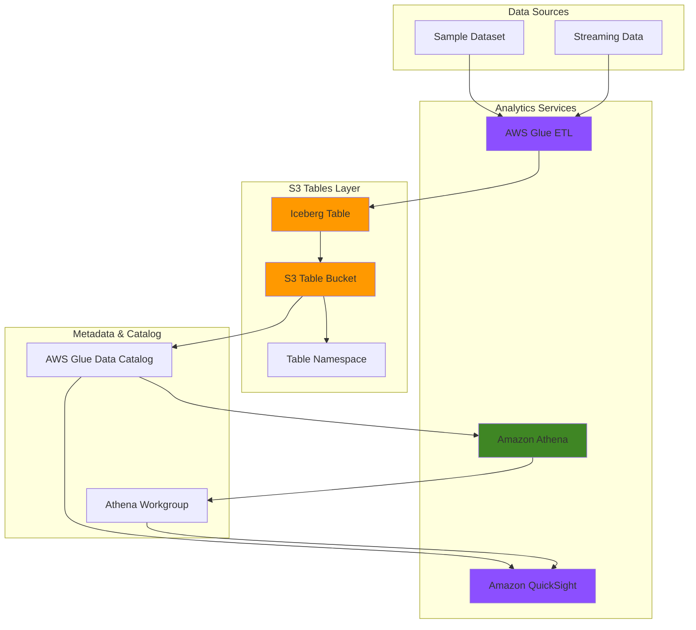

# Analytics-Optimized S3 Tables Storage

## Problem

Organizations struggle with managing large-scale tabular data for analytics workloads using traditional S3 storage approaches. Self-managed Apache Iceberg tables require significant operational overhead for maintenance tasks like compaction, snapshot management, and file cleanup, while delivering suboptimal query performance and higher storage costs. These challenges become amplified when dealing with high-frequency data ingestion patterns like streaming sensor data, daily transaction records, or real-time ad impressions that require both fast query response times and cost-effective storage scaling.

## Solution

S3 Tables provide purpose-built storage optimized for analytics workloads with built-in Apache Iceberg support, delivering up to 3x faster query performance and 10x higher transactions per second compared to self-managed tables. This solution leverages automated maintenance operations for compaction and file management, seamless integration with AWS analytics services through AWS Glue Data Catalog, and native support for advanced Iceberg features like schema evolution and time travel queries. The architecture combines S3 Tables with Athena for interactive querying, Glue for ETL processing, and QuickSight for business intelligence visualization.

## Architecture Diagram



## Prerequisites

1. AWS account with appropriate permissions for S3 Tables, Athena, Glue, and QuickSight
2. AWS CLI installed and configured (version 2.0 or later)
3. Basic knowledge of SQL and data analytics concepts
4. Understanding of Apache Iceberg table format fundamentals
5. Estimated cost: $15-25 for S3 Tables storage, Athena queries, and Glue ETL processing during tutorial

> **Note**: S3 Tables is available in limited AWS regions. Check the [S3 Tables regions documentation](https://docs.aws.amazon.com/AmazonS3/latest/userguide/s3-tables-regions-quotas.html) for current availability.

## Preparation

Amazon S3 Tables deliver the first cloud object store with built-in Apache Iceberg support, providing automatic maintenance operations that eliminate the operational overhead of managing table optimization manually. The preparation phase establishes the foundational AWS environment and generates unique resource identifiers to ensure proper resource isolation and management.

```bash
# Set environment variables
export AWS_REGION=$(aws configure get region)
export AWS_ACCOUNT_ID=$(aws sts get-caller-identity \
    --query Account --output text)

# Generate unique identifiers for resources
RANDOM_SUFFIX=$(aws secretsmanager get-random-password \
    --exclude-punctuation --exclude-uppercase \
    --password-length 6 --require-each-included-type \
    --output text --query RandomPassword)

# Set resource names
export TABLE_BUCKET_NAME="analytics-tables-${RANDOM_SUFFIX}"
export NAMESPACE_NAME="sales_analytics"
export TABLE_NAME="transaction_data"
export GLUE_DATABASE_NAME="s3_tables_analytics"

echo "✅ Environment configured with unique suffix: ${RANDOM_SUFFIX}"
echo "✅ Table bucket name: ${TABLE_BUCKET_NAME}"
```

## Steps

1. **Create S3 Table Bucket for Analytics Workloads**:

   S3 table buckets are specifically designed for tabular data storage with higher transactions per second and better query throughput compared to general-purpose S3 buckets. The table bucket provides the foundation for storing Apache Iceberg tables with automatic maintenance operations that continuously optimize storage and query performance.

   ```bash
   # Create S3 table bucket
   aws s3tables create-table-bucket \
       --name ${TABLE_BUCKET_NAME}
   
   # Store table bucket ARN for later use
   export TABLE_BUCKET_ARN=$(aws s3tables list-table-buckets \
       --query "tableBuckets[?name=='${TABLE_BUCKET_NAME}'].arn" \
       --output text)
   
   echo "✅ S3 table bucket created: ${TABLE_BUCKET_ARN}"
   ```

   The table bucket is now ready to store Apache Iceberg tables with built-in optimization features. This foundational step provides the high-performance storage layer required for analytics workloads with automatic maintenance operations running in the background.

2. **Enable AWS Analytics Services Integration**:

   Integration with AWS analytics services allows automatic discovery and access to table data through the AWS Glue Data Catalog. This integration enables seamless connectivity across Amazon Athena, Amazon Redshift, Amazon EMR, and QuickSight, providing a unified interface for analytics workflows.

   ```bash
   # Enable integration with AWS analytics services
   aws s3tables put-table-bucket-policy \
       --table-bucket-arn ${TABLE_BUCKET_ARN} \
       --resource-policy '{
           "Version": "2012-10-17",
           "Statement": [
               {
                   "Effect": "Allow",
                   "Principal": {
                       "Service": "glue.amazonaws.com"
                   },
                   "Action": [
                       "s3tables:GetTable",
                       "s3tables:GetTableMetadataLocation"
                   ],
                   "Resource": "*"
               }
           ]
       }'
   
   echo "✅ AWS analytics services integration enabled"
   ```

   The integration policy allows AWS Glue to access table metadata and enables automatic catalog synchronization. This configuration provides the foundation for querying tables through various AWS analytics services.

3. **Create Table Namespace for Data Organization**:

   Table namespaces provide logical organization for related tables within a table bucket, similar to database schemas. Namespaces enable hierarchical access control and help organize tables by business domain, data source, or processing stage.

   ```bash
   # Create namespace for sales analytics
   aws s3tables create-namespace \
       --table-bucket-arn ${TABLE_BUCKET_ARN} \
       --namespace ${NAMESPACE_NAME}
   
   # Verify namespace creation
   aws s3tables list-namespaces \
       --table-bucket-arn ${TABLE_BUCKET_ARN} \
       --query "namespaces[?namespace=='${NAMESPACE_NAME}']"
   
   echo "✅ Namespace created: ${NAMESPACE_NAME}"
   ```

   The namespace provides logical separation and organization for analytics tables. This structure enables better data governance and access control management as the data lake grows.

4. **Create Apache Iceberg Table with Optimized Schema**:

   Apache Iceberg tables in S3 Tables support advanced analytics features including schema evolution, partition evolution, and time travel queries. The table creation establishes the schema structure optimized for analytics workloads with appropriate data types and partitioning strategies.

   ```bash
   # Create transaction data table with initial schema
   aws s3tables create-table \
       --table-bucket-arn ${TABLE_BUCKET_ARN} \
       --namespace ${NAMESPACE_NAME} \
       --name ${TABLE_NAME} \
       --format ICEBERG \
       --metadata '{
           "icebergTableData": {
               "schema": "{\"type\":\"struct\",\"fields\":[{\"id\":1,\"name\":\"transaction_id\",\"required\":true,\"type\":\"long\"},{\"id\":2,\"name\":\"customer_id\",\"required\":true,\"type\":\"long\"},{\"id\":3,\"name\":\"product_id\",\"required\":true,\"type\":\"long\"},{\"id\":4,\"name\":\"quantity\",\"required\":true,\"type\":\"int\"},{\"id\":5,\"name\":\"price\",\"required\":true,\"type\":\"decimal(10,2)\"},{\"id\":6,\"name\":\"transaction_date\",\"required\":true,\"type\":\"date\"},{\"id\":7,\"name\":\"region\",\"required\":true,\"type\":\"string\"}]}"
           }
       }'
   
   # Store table ARN for later use
   export TABLE_ARN=$(aws s3tables get-table \
       --table-bucket-arn ${TABLE_BUCKET_ARN} \
       --namespace ${NAMESPACE_NAME} \
       --name ${TABLE_NAME} \
       --query "arn" --output text)
   
   echo "✅ Iceberg table created: ${TABLE_ARN}"
   ```

   The Apache Iceberg table is now ready for data ingestion with built-in support for ACID transactions, schema evolution, and automatic maintenance operations. This foundation enables reliable analytics workloads with enterprise-grade data management capabilities.

5. **Configure AWS Glue Data Catalog Integration**:

   AWS Glue Data Catalog integration enables automatic discovery and metadata management for S3 Tables. This integration provides a unified metadata layer that supports querying across multiple AWS analytics services while maintaining consistency and data lineage.

   ```bash
   # Create Glue database for S3 Tables
   aws glue create-database \
       --database-input Name=${GLUE_DATABASE_NAME}
   
   # Enable S3 Tables maintenance configuration
   aws s3tables put-table-bucket-maintenance-configuration \
       --table-bucket-arn ${TABLE_BUCKET_ARN} \
       --type icebergUnreferencedFileRemoval \
       --value '{
           "status": "Enabled",
           "settings": {
               "icebergUnreferencedFileRemoval": {
                   "numberOfDaysToRetain": 7
               }
           }
       }'
   
   echo "✅ AWS Glue Data Catalog integration configured"
   ```

   The Glue Data Catalog integration provides centralized metadata management and enables automatic table discovery across AWS analytics services. This configuration ensures consistent metadata access and supports data governance requirements.

6. **Create Sample Dataset and Prepare Data Source**:

   Sample datasets provide realistic transaction data for demonstrating S3 Tables analytics capabilities. The dataset includes typical business metrics like transaction IDs, customer information, product details, and regional data that enable comprehensive analytics testing.

   ```bash
   # Create sample data file
   cat > /tmp/sample_transactions.csv << 'EOF'
transaction_id,customer_id,product_id,quantity,price,transaction_date,region
1,101,501,2,29.99,2024-01-15,us-east-1
2,102,502,1,149.99,2024-01-15,us-west-2
3,103,503,3,19.99,2024-01-16,eu-west-1
4,104,501,1,29.99,2024-01-16,us-east-1
5,105,504,2,79.99,2024-01-17,ap-southeast-1
EOF
   
   # Create temporary S3 bucket for data ingestion
   aws s3 mb s3://glue-etl-data-${RANDOM_SUFFIX} \
       --region ${AWS_REGION}
   
   # Upload sample data to S3
   aws s3 cp /tmp/sample_transactions.csv \
       s3://glue-etl-data-${RANDOM_SUFFIX}/input/
   
   echo "✅ Sample dataset prepared and uploaded"
   ```

   The sample dataset provides realistic transaction data for demonstrating S3 Tables analytics capabilities. This foundation enables testing of query performance, data transformation, and visualization workflows with representative business data.

7. **Ingest Data into S3 Table using AWS Glue**:

   AWS Glue provides ETL capabilities to transform and load data into S3 Tables. This approach enables schema-aware data ingestion with automatic optimization and catalog registration for seamless analytics integration.

   ```bash
   # Create Glue IAM role for ETL operations
   aws iam create-role \
       --role-name s3tables-glue-role-${RANDOM_SUFFIX} \
       --assume-role-policy-document '{
           "Version": "2012-10-17",
           "Statement": [
               {
                   "Effect": "Allow",
                   "Principal": {
                       "Service": "glue.amazonaws.com"
                   },
                   "Action": "sts:AssumeRole"
               }
           ]
       }'
   
   # Attach necessary policies
   aws iam attach-role-policy \
       --role-name s3tables-glue-role-${RANDOM_SUFFIX} \
       --policy-arn arn:aws:iam::aws:policy/service-role/AWSGlueServiceRole
   
   # Create Glue crawler for S3 Tables catalog integration
   aws glue create-crawler \
       --name s3-tables-crawler-${RANDOM_SUFFIX} \
       --role arn:aws:iam::${AWS_ACCOUNT_ID}:role/s3tables-glue-role-${RANDOM_SUFFIX} \
       --database-name ${GLUE_DATABASE_NAME} \
       --targets '{
           "S3Targets": [{
               "Path": "s3://glue-etl-data-'${RANDOM_SUFFIX}'/input/"
           }]
       }'
   
   echo "✅ Glue ETL configuration prepared for data ingestion"
   ```

   The Glue ETL configuration enables automated data transformation and loading into S3 Tables with proper schema validation and catalog registration. This approach ensures data quality and seamless integration with analytics services.

8. **Set Up Amazon Athena for Interactive Querying**:

   Amazon Athena provides interactive SQL query capabilities for S3 Tables through the AWS Glue Data Catalog integration. Athena supports standard SQL syntax and delivers fast query performance through optimized query execution and Apache Iceberg's advanced analytics features.

   ```bash
   # Create Athena work group for S3 Tables
   aws athena create-work-group \
       --name s3-tables-workgroup \
       --configuration '{
           "ResultConfiguration": {
               "OutputLocation": "s3://aws-athena-query-results-'${AWS_ACCOUNT_ID}'-'${AWS_REGION}'"
           },
           "EnforceWorkGroupConfiguration": true
       }'
   
   # Create results bucket if it doesn't exist
   aws s3 mb s3://aws-athena-query-results-${AWS_ACCOUNT_ID}-${AWS_REGION} \
       --region ${AWS_REGION} 2>/dev/null || true
   
   echo "✅ Athena work group configured for S3 Tables"
   ```

   Athena is now configured to query S3 Tables with optimized performance and result storage. The work group configuration ensures consistent query execution environment and result management for analytics workloads.

9. **Configure Amazon QuickSight for Data Visualization**:

   Amazon QuickSight provides business intelligence capabilities for S3 Tables through integration with Amazon Athena. QuickSight enables interactive dashboards, ad-hoc analysis, and business insights with fast query performance using the SPICE in-memory engine.

   ```bash
   # Check QuickSight account status
   aws quicksight describe-account-settings \
       --aws-account-id ${AWS_ACCOUNT_ID} \
       --region ${AWS_REGION} 2>/dev/null || \
       echo "QuickSight not yet configured - manual setup required"
   
   # Create QuickSight data source configuration
   echo "✅ QuickSight configuration prepared"
   echo "📝 Manual step: Complete QuickSight setup in AWS Console"
   echo "📝 Connect QuickSight to Athena workgroup: s3-tables-workgroup"
   ```

   QuickSight integration provides enterprise-grade business intelligence capabilities for S3 Tables data. The configuration enables interactive visualization and dashboard creation for analytics insights with seamless integration to the Athena query engine.

## Validation & Testing

1. **Verify S3 Table Bucket and Resources**:

   ```bash
   # Check table bucket status
   aws s3tables get-table-bucket \
       --name ${TABLE_BUCKET_NAME}
   
   # List namespaces and tables
   aws s3tables list-namespaces \
       --table-bucket-arn ${TABLE_BUCKET_ARN}
   
   aws s3tables list-tables \
       --table-bucket-arn ${TABLE_BUCKET_ARN} \
       --namespace ${NAMESPACE_NAME}
   ```

   Expected output: Table bucket details showing active status, namespace listing, and table metadata confirming successful creation.

2. **Test Athena Query Performance**:

   ```bash
   # Execute sample query via Athena
   QUERY_ID=$(aws athena start-query-execution \
       --query-string "SHOW TABLES IN \"${GLUE_DATABASE_NAME}\"" \
       --work-group s3-tables-workgroup \
       --result-configuration OutputLocation=s3://aws-athena-query-results-${AWS_ACCOUNT_ID}-${AWS_REGION} \
       --query "QueryExecutionId" --output text)
   
   # Wait for query completion
   aws athena get-query-execution \
       --query-execution-id ${QUERY_ID} \
       --query "QueryExecution.Status.State" --output text
   
   echo "✅ Query execution ID: ${QUERY_ID}"
   ```

   Expected output: Query execution ID and successful completion showing table registration in the Glue catalog.

3. **Validate Data Catalog Integration**:

   ```bash
   # Check Glue catalog table registration
   aws glue get-table \
       --database-name ${GLUE_DATABASE_NAME} \
       --name ${TABLE_NAME} 2>/dev/null || \
       echo "Table not yet registered in catalog"
   
   # Verify S3 Tables maintenance status
   aws s3tables get-table-bucket-maintenance-configuration \
       --table-bucket-arn ${TABLE_BUCKET_ARN}
   ```

   Expected output: Table metadata in Glue catalog and maintenance configuration showing enabled automated optimization.

## Cleanup

1. **Remove S3 Tables Resources**:

   ```bash
   # Delete table
   aws s3tables delete-table \
       --table-bucket-arn ${TABLE_BUCKET_ARN} \
       --namespace ${NAMESPACE_NAME} \
       --name ${TABLE_NAME}
   
   echo "✅ Table deleted"
   ```

2. **Remove Namespace and Table Bucket**:

   ```bash
   # Delete namespace
   aws s3tables delete-namespace \
       --table-bucket-arn ${TABLE_BUCKET_ARN} \
       --namespace ${NAMESPACE_NAME}
   
   # Delete table bucket
   aws s3tables delete-table-bucket \
       --name ${TABLE_BUCKET_NAME}
   
   echo "✅ Namespace and table bucket deleted"
   ```

3. **Clean Up Supporting Resources**:

   ```bash
   # Remove Glue database
   aws glue delete-database \
       --name ${GLUE_DATABASE_NAME}
   
   # Delete Glue crawler
   aws glue delete-crawler \
       --name s3-tables-crawler-${RANDOM_SUFFIX}
   
   # Delete IAM role
   aws iam detach-role-policy \
       --role-name s3tables-glue-role-${RANDOM_SUFFIX} \
       --policy-arn arn:aws:iam::aws:policy/service-role/AWSGlueServiceRole
   
   aws iam delete-role \
       --role-name s3tables-glue-role-${RANDOM_SUFFIX}
   
   # Delete Athena work group
   aws athena delete-work-group \
       --work-group s3-tables-workgroup
   
   # Clean up sample data bucket
   aws s3 rm s3://glue-etl-data-${RANDOM_SUFFIX} --recursive
   aws s3 rb s3://glue-etl-data-${RANDOM_SUFFIX}
   
   # Remove Athena results bucket
   aws s3 rm s3://aws-athena-query-results-${AWS_ACCOUNT_ID}-${AWS_REGION} \
       --recursive
   aws s3 rb s3://aws-athena-query-results-${AWS_ACCOUNT_ID}-${AWS_REGION}
   
   echo "✅ Supporting resources cleaned up"
   ```

## Discussion

Amazon S3 Tables represent a significant advancement in cloud-native analytics storage, addressing the operational complexity and performance limitations of self-managed Apache Iceberg tables. By providing built-in Iceberg support with automated maintenance operations, S3 Tables deliver up to 3x faster query performance and 10x higher transactions per second compared to traditional approaches. The service automatically handles critical maintenance tasks including compaction, snapshot management, and unreferenced file removal, which traditionally required significant engineering effort and operational overhead.

The integration with AWS analytics services through the Glue Data Catalog creates a unified metadata layer that enables seamless connectivity across Amazon Athena, Amazon Redshift, Amazon EMR, and Amazon QuickSight. This integration pattern follows AWS Well-Architected Framework principles by providing centralized metadata management, automated optimization, and cost-effective scaling. The Apache Iceberg format's support for schema evolution, partition evolution, and time travel queries enables advanced analytics capabilities without requiring data migration or structural changes.

Performance optimization in S3 Tables occurs through multiple mechanisms including automatic file compaction, intelligent partitioning, and optimized query execution paths. The service continuously monitors table usage patterns and automatically optimizes storage layout for query performance, reducing both query latency and storage costs. This automated approach eliminates the need for manual tuning and maintenance scheduling that traditional data lake architectures require.

The cost model for S3 Tables provides predictable pricing with storage costs starting at approximately $35.37 per TB per month, making it cost-effective for moderate to large-scale analytics workloads. The automated maintenance operations reduce operational costs by eliminating the need for dedicated infrastructure and engineering resources for table optimization tasks. Additionally, the optimized query performance reduces overall compute costs in analytics services like Athena and EMR.

> **Tip**: Enable S3 Tables integration with AWS analytics services during initial setup to ensure automatic metadata synchronization and optimal query performance across all analytics services.

**Documentation Sources:**
- [Working with Amazon S3 Tables and table buckets](https://docs.aws.amazon.com/AmazonS3/latest/userguide/s3-tables.html)
- [Query Apache Iceberg tables in Amazon Athena](https://docs.aws.amazon.com/athena/latest/ug/querying-iceberg.html)
- [Running ETL jobs on Amazon S3 tables with AWS Glue](https://docs.aws.amazon.com/AmazonS3/latest/userguide/s3-tables-integrating-glue.html)
- [Visualizing table data with QuickSight](https://docs.aws.amazon.com/AmazonS3/latest/userguide/s3-tables-integrating-quicksight.html)
- [AWS Well-Architected Framework](https://docs.aws.amazon.com/wellarchitected/latest/framework/welcome.html)

## Challenge

Extend this analytics-optimized data storage solution with these advanced implementations:

1. **Implement Real-time Data Ingestion**: Configure Amazon Kinesis Data Firehose to continuously stream data into S3 Tables with automatic format conversion and partitioning optimization.

2. **Add Multi-Region Analytics**: Set up cross-region replication for S3 Tables with Amazon Aurora DSQL for global analytics capabilities and disaster recovery.

3. **Build Advanced Data Governance**: Implement AWS Lake Formation fine-grained access controls with column-level security and data lineage tracking for compliance requirements.

4. **Create Automated Data Quality Monitoring**: Deploy AWS Glue Data Quality jobs with CloudWatch alerting for automated data validation and quality scoring across your analytics pipeline.

5. **Implement Cost Optimization Automation**: Build AWS Lambda functions that analyze S3 Tables usage patterns and automatically optimize storage classes and maintenance schedules based on access patterns.

## Infrastructure Code

### Available Infrastructure as Code:

- [Infrastructure Code Overview](code/README.md) - Detailed description of all infrastructure components
- [AWS CDK (Python)](code/cdk-python/) - AWS CDK Python implementation
- [AWS CDK (TypeScript)](code/cdk-typescript/) - AWS CDK TypeScript implementation
- [CloudFormation](code/cloudformation.yaml) - AWS CloudFormation template
- [Bash CLI Scripts](code/scripts/) - Example bash scripts using AWS CLI commands to deploy infrastructure
- [Terraform](code/terraform/) - Terraform configuration files