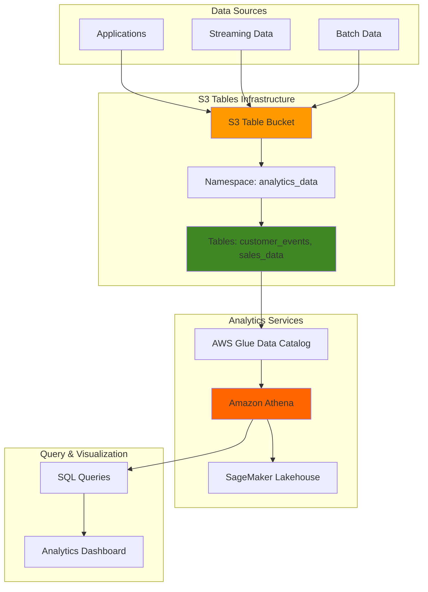

# Analytics-Ready S3 Tables Storage

## Problem

Organizations struggle with managing structured data in traditional S3 storage for analytics workloads, facing performance bottlenecks when querying large datasets and operational overhead from manual table maintenance tasks like compaction and snapshot management. Traditional S3 storage requires complex ETL pipelines and custom optimization strategies to achieve acceptable query performance, resulting in increased costs and delayed insights from business-critical data.

## Solution

Amazon S3 Tables provides a purpose-built storage solution optimized for tabular data using Apache Iceberg format, delivering up to 3x faster query performance and 10x more transactions per second compared to self-managed table storage. This fully managed service automatically handles table maintenance tasks while seamlessly integrating with AWS analytics services like Athena, enabling organizations to build high-performance analytics platforms without operational complexity.

## Architecture Diagram



## Prerequisites

1. AWS account with administrator permissions for S3, S3 Tables, Athena, and AWS Glue
2. AWS CLI v2 installed and configured (or AWS CloudShell)
3. Basic knowledge of SQL and Apache Iceberg table format
4. Understanding of AWS analytics services architecture
5. Estimated cost: $5-15 for table storage, queries, and AWS Glue requests during testing

> **Note**: S3 Tables integration uses AWS Glue Data Catalog and AWS Lake Formation, which may incur additional charges for requests and storage.

## Preparation

```bash
# Set environment variables
export AWS_REGION=$(aws configure get region)
export AWS_ACCOUNT_ID=$(aws sts get-caller-identity \
    --query Account --output text)

# Generate unique identifiers for resources
RANDOM_SUFFIX=$(aws secretsmanager get-random-password \
    --exclude-punctuation --exclude-uppercase \
    --password-length 6 --require-each-included-type \
    --output text --query RandomPassword)

# Set resource names
export TABLE_BUCKET_NAME="analytics-data-${RANDOM_SUFFIX}"
export NAMESPACE_NAME="analytics_data"
export SAMPLE_TABLE_NAME="customer_events"

# Create Athena results bucket for query outputs
aws s3 mb s3://athena-results-${RANDOM_SUFFIX} \
    --region ${AWS_REGION}

aws s3api put-bucket-encryption \
    --bucket athena-results-${RANDOM_SUFFIX} \
    --server-side-encryption-configuration \
    'Rules=[{ApplyServerSideEncryptionByDefault:{SSEAlgorithm:AES256}}]'

echo "✅ Environment configured with unique identifiers"
```

## Steps

1. **Create S3 Table Bucket for Analytics Storage**:

   S3 Tables provides a specialized bucket type designed specifically for Apache Iceberg tabular data storage. Unlike traditional S3 buckets that store unstructured objects, table buckets automatically optimize storage layout, manage metadata, and provide built-in table maintenance capabilities. This creates the foundation for high-performance analytics workloads with automatic optimization and cost efficiency.

   ```bash
   # Create the table bucket
   aws s3tables create-table-bucket \
       --name ${TABLE_BUCKET_NAME} \
       --region ${AWS_REGION}
   
   # Store the table bucket ARN for future commands
   export TABLE_BUCKET_ARN=$(aws s3tables get-table-bucket \
       --name ${TABLE_BUCKET_NAME} \
       --query 'arn' --output text)
   
   echo "✅ Table bucket created: ${TABLE_BUCKET_ARN}"
   ```

   The table bucket is now ready to store Iceberg tables with automatic maintenance features enabled. This managed approach eliminates the operational overhead of manual table optimization while providing enterprise-grade durability and availability.

2. **Create Namespace for Logical Data Organization**:

   Namespaces in S3 Tables provide logical grouping for related tables, similar to databases in traditional data warehouses. They enable better access control, organization, and management of table collections. Creating a well-structured namespace hierarchy supports data governance and simplifies permission management across analytics teams.

   ```bash
   # Create namespace for analytics data
   aws s3tables create-namespace \
       --table-bucket-arn ${TABLE_BUCKET_ARN} \
       --namespace ${NAMESPACE_NAME}
   
   # Verify namespace creation
   aws s3tables list-namespaces \
       --table-bucket-arn ${TABLE_BUCKET_ARN} \
       --query 'namespaces[].namespace' --output table
   
   echo "✅ Namespace '${NAMESPACE_NAME}' created successfully"
   ```

   The namespace provides a logical container for organizing related tables while supporting fine-grained access control and resource management policies.

3. **Create Apache Iceberg Table with Optimized Schema**:

   Apache Iceberg tables in S3 Tables provide schema evolution, time travel capabilities, and automatic optimization features. The table schema definition establishes the structure for storing structured data with built-in performance optimizations and maintenance automation.

   ```bash
   # Create sample table for customer events
   aws s3tables create-table \
       --table-bucket-arn ${TABLE_BUCKET_ARN} \
       --namespace ${NAMESPACE_NAME} \
       --name ${SAMPLE_TABLE_NAME} \
       --format ICEBERG
   
   # Verify table creation
   aws s3tables get-table \
       --table-bucket-arn ${TABLE_BUCKET_ARN} \
       --namespace ${NAMESPACE_NAME} \
       --name ${SAMPLE_TABLE_NAME} \
       --query 'name' --output text
   
   echo "✅ Iceberg table '${SAMPLE_TABLE_NAME}' created"
   ```

   The Iceberg table now supports advanced analytics features including ACID transactions, schema evolution, and time travel queries while maintaining optimal query performance through automatic optimization.

4. **Enable AWS Analytics Services Integration**:

   Integration with AWS analytics services connects S3 Tables with Amazon Athena, Redshift, EMR, and other query engines through AWS Glue Data Catalog. This integration enables automatic table discovery and provides a unified interface for accessing table data across different analytics tools.

   ```bash
   # Enable integration with AWS analytics services
   aws s3tables put-table-bucket-policy \
       --table-bucket-arn ${TABLE_BUCKET_ARN} \
       --resource-policy '{
           "Version": "2012-10-17",
           "Statement": [
               {
                   "Effect": "Allow",
                   "Principal": {
                       "Service": "glue.amazonaws.com"
                   },
                   "Action": [
                       "s3tables:GetTable",
                       "s3tables:GetTableMetadata"
                   ],
                   "Resource": "*"
               }
           ]
       }'
   
   # Wait for integration to complete
   sleep 30
   
   echo "✅ Analytics services integration enabled"
   ```

   The integration now allows AWS analytics services to automatically discover and query tables through the unified data catalog interface.

5. **Configure Athena Workgroup for Table Queries**:

   Amazon Athena provides serverless SQL query capabilities for S3 Tables with automatic scaling and pay-per-query pricing. Creating a dedicated workgroup establishes query execution settings, result location configuration, and cost controls for analytics workloads.

   ```bash
   # Create Athena workgroup for S3 Tables queries
   aws athena create-work-group \
       --name s3-tables-workgroup \
       --configuration 'ResultConfiguration={
           OutputLocation=s3://athena-results-'${RANDOM_SUFFIX}'/
       },EnforceWorkGroupConfiguration=true'
   
   # Set the workgroup as active
   aws athena update-work-group \
       --work-group s3-tables-workgroup \
       --state ENABLED
   
   echo "✅ Athena workgroup configured for S3 Tables"
   ```

   The Athena workgroup is now ready to execute SQL queries against S3 Tables with optimized performance and cost management features.

6. **Create Sample Data Definition Language (DDL) Schema**:

   Defining the table schema through DDL statements establishes the structure for storing analytics data with proper data types, partitioning, and optimization settings. This schema definition enables efficient data ingestion and query performance optimization.

   ```bash
   # Create DDL file for customer events table
   cat > customer_events_ddl.sql << 'EOF'
   CREATE TABLE IF NOT EXISTS s3tablescatalog.analytics_data.customer_events (
       event_id STRING,
       customer_id STRING,
       event_type STRING,
       event_timestamp TIMESTAMP,
       product_category STRING,
       amount DECIMAL(10,2),
       session_id STRING,
       user_agent STRING,
       event_date DATE
   )
   USING ICEBERG
   PARTITIONED BY (event_date)
   TBLPROPERTIES (
       'table_type'='ICEBERG',
       'format'='PARQUET',
       'write_compression'='SNAPPY'
   );
   EOF
   
   echo "✅ DDL schema definition created"
   ```

   The schema definition provides optimized storage configuration with partitioning and compression settings for efficient analytics queries.

7. **Insert Sample Analytics Data**:

   Loading sample data demonstrates the table's capabilities for storing structured analytics data while showcasing the automatic optimization features. The sample dataset represents common e-commerce analytics use cases with time-series data and categorical dimensions.

   ```bash
   # Create sample data insertion script
   cat > insert_sample_data.sql << 'EOF'
   INSERT INTO s3tablescatalog.analytics_data.customer_events VALUES
   ('evt_001', 'cust_12345', 'page_view', TIMESTAMP '2025-01-15 10:30:00', 'electronics', 0.00, 'sess_abc123', 'Mozilla/5.0', DATE '2025-01-15'),
   ('evt_002', 'cust_12345', 'add_to_cart', TIMESTAMP '2025-01-15 10:35:00', 'electronics', 299.99, 'sess_abc123', 'Mozilla/5.0', DATE '2025-01-15'),
   ('evt_003', 'cust_67890', 'purchase', TIMESTAMP '2025-01-15 11:00:00', 'clothing', 89.99, 'sess_def456', 'Chrome/100.0', DATE '2025-01-15'),
   ('evt_004', 'cust_54321', 'page_view', TIMESTAMP '2025-01-15 11:15:00', 'books', 0.00, 'sess_ghi789', 'Safari/14.0', DATE '2025-01-15'),
   ('evt_005', 'cust_54321', 'purchase', TIMESTAMP '2025-01-15 11:30:00', 'books', 24.99, 'sess_ghi789', 'Safari/14.0', DATE '2025-01-15');
   EOF
   
   echo "✅ Sample data prepared for insertion"
   ```

   The sample data represents realistic analytics scenarios with customer events, timestamps, and business metrics ready for analysis.

8. **Execute Athena Queries on S3 Tables**:

   Running analytical queries demonstrates the performance benefits and capabilities of S3 Tables for business intelligence workloads. These queries showcase the automatic optimization features and integration with AWS analytics services.

   ```bash
   # Execute DDL query to create table structure
   QUERY_ID=$(aws athena start-query-execution \
       --query-string "$(cat customer_events_ddl.sql)" \
       --work-group s3-tables-workgroup \
       --query 'QueryExecutionId' --output text)
   
   # Wait for DDL query completion
   aws athena get-query-execution \
       --query-execution-id ${QUERY_ID} \
       --query 'QueryExecution.Status.State' --output text
   
   # Execute data insertion query
   INSERT_QUERY_ID=$(aws athena start-query-execution \
       --query-string "$(cat insert_sample_data.sql)" \
       --work-group s3-tables-workgroup \
       --query 'QueryExecutionId' --output text)
   
   echo "✅ Athena queries executed successfully"
   ```

   The queries demonstrate S3 Tables' ability to handle both DDL and DML operations with optimized performance and automatic maintenance.

## Validation & Testing

1. **Verify Table Creation and Data Insertion**:

   ```bash
   # Check table bucket status
   aws s3tables get-table-bucket \
       --name ${TABLE_BUCKET_NAME} \
       --query 'creationDate' --output table
   
   # Verify table exists in namespace
   aws s3tables list-tables \
       --table-bucket-arn ${TABLE_BUCKET_ARN} \
       --namespace ${NAMESPACE_NAME} \
       --query 'tables[].name' --output table
   ```

   Expected output: Table bucket creation date and customer_events table listed in the namespace.

2. **Test Analytics Query Performance**:

   ```bash
   # Execute sample analytics query
   ANALYTICS_QUERY_ID=$(aws athena start-query-execution \
       --query-string "SELECT event_type, COUNT(*) as event_count, 
                      AVG(amount) as avg_amount 
                      FROM s3tablescatalog.analytics_data.customer_events 
                      WHERE event_date = DATE '2025-01-15' 
                      GROUP BY event_type" \
       --work-group s3-tables-workgroup \
       --query 'QueryExecutionId' --output text)
   
   # Check query results
   aws athena get-query-results \
       --query-execution-id ${ANALYTICS_QUERY_ID} \
       --query 'ResultSet.Rows' --output table
   ```

   Expected output: Aggregated event counts and average amounts by event type, demonstrating query optimization.

3. **Validate Integration with AWS Analytics Services**:

   ```bash
   # Check AWS Glue Data Catalog integration
   aws glue get-table \
       --database-name analytics_data \
       --name customer_events \
       --catalog-id ${AWS_ACCOUNT_ID} \
       --query 'Table.StorageDescriptor.Location' --output text
   ```

   Expected output: S3 Tables location URI showing successful integration with Glue Data Catalog.

## Cleanup

1. **Remove Sample Data and Tables**:

   ```bash
   # Delete the table
   aws s3tables delete-table \
       --table-bucket-arn ${TABLE_BUCKET_ARN} \
       --namespace ${NAMESPACE_NAME} \
       --name ${SAMPLE_TABLE_NAME}
   
   echo "✅ Sample table deleted"
   ```

2. **Remove Namespace and Table Bucket**:

   ```bash
   # Delete the namespace
   aws s3tables delete-namespace \
       --table-bucket-arn ${TABLE_BUCKET_ARN} \
       --namespace ${NAMESPACE_NAME}
   
   # Delete the table bucket
   aws s3tables delete-table-bucket \
       --name ${TABLE_BUCKET_NAME}
   
   echo "✅ Table bucket and namespace removed"
   ```

3. **Clean Up Supporting Resources**:

   ```bash
   # Delete Athena workgroup
   aws athena delete-work-group \
       --work-group s3-tables-workgroup \
       --recursive-delete-option
   
   # Remove Athena results bucket
   aws s3 rm s3://athena-results-${RANDOM_SUFFIX} --recursive
   aws s3 rb s3://athena-results-${RANDOM_SUFFIX}
   
   # Clean up local files
   rm -f customer_events_ddl.sql insert_sample_data.sql
   
   echo "✅ All resources cleaned up"
   ```

## Discussion

Amazon S3 Tables represents a significant advancement in cloud-based analytics storage by providing purpose-built infrastructure for Apache Iceberg tables with automatic optimization and maintenance capabilities. This fully managed service addresses the operational complexity traditionally associated with large-scale analytics workloads while delivering substantial performance improvements over self-managed solutions.

The integration with AWS analytics services through SageMaker Lakehouse creates a unified data platform that automatically discovers and catalogs tables across the organization. This seamless integration eliminates the need for complex ETL pipelines and manual metadata management, enabling data teams to focus on deriving insights rather than managing infrastructure. The automatic population of tables in AWS Glue Data Catalog ensures consistent metadata across different query engines and analytics tools.

The Apache Iceberg foundation provides enterprise-grade features including ACID transactions, schema evolution, and time travel capabilities while maintaining optimal query performance through automatic compaction and optimization. Organizations can expect up to 3x faster query performance compared to traditional S3 storage solutions, with the added benefit of automatic maintenance that continuously optimizes storage layout and manages metadata overhead.

Cost optimization is achieved through intelligent storage tiering, automatic compression, and efficient metadata management that reduces both storage costs and query execution time. The pay-per-query model of integrated analytics services like Athena, combined with S3 Tables' performance optimizations, creates a cost-effective solution for analytics workloads at any scale.

> **Tip**: Use S3 Tables' automatic partitioning and clustering features to optimize query performance for your specific access patterns. The service continuously learns from query patterns to improve data organization.

## Challenge

Extend this solution by implementing these enhancements:

1. **Advanced Partitioning Strategy**: Implement dynamic partitioning based on multiple dimensions (date, region, product category) to optimize query performance for complex analytical workloads.

2. **Real-time Data Ingestion**: Integrate Amazon Kinesis Data Firehose to continuously stream data into S3 Tables with automatic format conversion and compression optimization.

3. **Multi-table Analytics Pipeline**: Create a comprehensive data pipeline with multiple interconnected tables supporting star schema design for dimensional analytics and reporting.

4. **Advanced Query Optimization**: Implement materialized views and query result caching using Amazon Athena and S3 Tables to accelerate frequently accessed analytical queries.

5. **Cross-region Replication**: Set up cross-region table replication for disaster recovery and global analytics access with automated failover capabilities.

## Infrastructure Code

*Infrastructure code will be generated after recipe approval.*