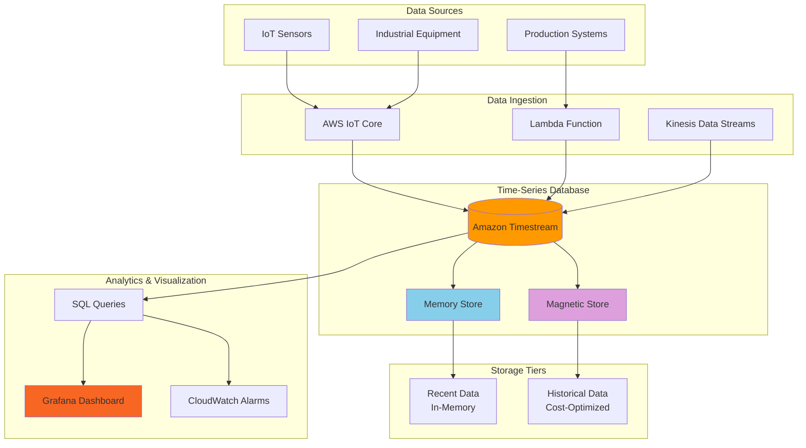

# Analyzing Time-Series Data with Timestream

## Problem

Manufacturing companies operating large IoT sensor networks face challenges storing and analyzing billions of time-series data points from industrial equipment, environmental sensors, and production systems. Traditional relational databases struggle with the volume, velocity, and variety of time-series data, leading to poor query performance, high storage costs, and difficulty extracting real-time insights for predictive maintenance and operational optimization.

## Solution

Build a comprehensive time-series data solution using Amazon Timestream to ingest, store, and analyze IoT sensor data at scale. This solution leverages Timestream's purpose-built time-series database capabilities with automatic data lifecycle management, built-in analytics functions, and serverless architecture to provide fast queries across historical and real-time data while optimizing costs through tiered storage.

## Architecture Diagram



## Prerequisites

1. AWS account with appropriate permissions for Timestream, IoT Core, Lambda, and CloudWatch
2. AWS CLI v2 installed and configured (or AWS CloudShell)
3. Understanding of time-series data concepts and SQL query patterns
4. Familiarity with IoT data ingestion patterns and JSON data structures
5. Basic knowledge of Lambda functions and IAM roles
6. Estimated cost: $50-200/month depending on data volume and query frequency

> **Note**: Amazon Timestream pricing is based on data ingestion, storage, and queries. Monitor usage carefully during initial setup.

## Preparation

```bash
# Set environment variables
export AWS_REGION=$(aws configure get region)
export AWS_ACCOUNT_ID=$(aws sts get-caller-identity \
    --query Account --output text)

# Generate unique identifiers for resources
RANDOM_SUFFIX=$(aws secretsmanager get-random-password \
    --exclude-punctuation --exclude-uppercase \
    --password-length 6 --require-each-included-type \
    --output text --query RandomPassword)

export DATABASE_NAME="iot-timeseries-db-${RANDOM_SUFFIX}"
export TABLE_NAME="sensor-data"
export LAMBDA_FUNCTION_NAME="timestream-data-ingestion-${RANDOM_SUFFIX}"
export IOT_RULE_NAME="timestream-iot-rule-${RANDOM_SUFFIX}"

# Create IAM role for Lambda function
aws iam create-role \
    --role-name "${LAMBDA_FUNCTION_NAME}-role" \
    --assume-role-policy-document '{
        "Version": "2012-10-17",
        "Statement": [
            {
                "Effect": "Allow",
                "Principal": {
                    "Service": "lambda.amazonaws.com"
                },
                "Action": "sts:AssumeRole"
            }
        ]
    }'

# Create IAM role for IoT Core
aws iam create-role \
    --role-name "${IOT_RULE_NAME}-role" \
    --assume-role-policy-document '{
        "Version": "2012-10-17",
        "Statement": [
            {
                "Effect": "Allow",
                "Principal": {
                    "Service": "iot.amazonaws.com"
                },
                "Action": "sts:AssumeRole"
            }
        ]
    }'

echo "✅ Environment prepared with unique identifiers"
```

## Steps

1. **Create Amazon Timestream Database**:

   Amazon Timestream is a purpose-built time-series database that provides serverless scalability and automatic data lifecycle management. Creating the database establishes the foundational storage layer that will handle billions of time-series data points from IoT sensors while automatically optimizing costs through intelligent tiering between memory and magnetic storage.

   ```bash
   # Create the Timestream database
   aws timestream-write create-database \
       --database-name "${DATABASE_NAME}" \
       --tags Key=Project,Value=IoTTimeSeries \
           Key=Environment,Value=Production
   
   # Store database ARN for later use
   DATABASE_ARN=$(aws timestream-write describe-database \
       --database-name "${DATABASE_NAME}" \
       --query 'Database.Arn' --output text)
   
   echo "✅ Created Timestream database: ${DATABASE_NAME}"
   ```

   The database is now established and ready to contain tables with time-series data. This foundational step enables the automatic scaling, built-in analytics functions, and cost optimization features that make Timestream ideal for IoT workloads.

2. **Create Timestream Table with Retention Policies**:

   Timestream tables implement a two-tier storage architecture that automatically balances performance and cost. The memory store provides microsecond latency for recent data used in real-time dashboards and alerting, while the magnetic store offers cost-effective storage for historical data analysis. Configuring retention policies ensures data automatically transitions between tiers without manual intervention.

   ```bash
   # Create table with memory and magnetic store retention policies
   aws timestream-write create-table \
       --database-name "${DATABASE_NAME}" \
       --table-name "${TABLE_NAME}" \
       --retention-properties '{
           "MemoryStoreRetentionPeriodInHours": 24,
           "MagneticStoreRetentionPeriodInDays": 365
       }' \
       --magnetic-store-write-properties '{
           "EnableMagneticStoreWrites": true
       }'
   
   # Store table ARN for later use
   TABLE_ARN=$(aws timestream-write describe-table \
       --database-name "${DATABASE_NAME}" \
       --table-name "${TABLE_NAME}" \
       --query 'Table.Arn' --output text)
   
   echo "✅ Created Timestream table: ${TABLE_NAME}"
   ```

   The table now provides intelligent data lifecycle management with 24-hour memory store retention for fast queries and 365-day magnetic store retention for historical analysis. This configuration optimizes both query performance and storage costs for typical IoT sensor data patterns.

   > **Note**: Memory store pricing is higher but provides sub-millisecond query latency, while magnetic store offers 99% cost savings for long-term retention. See [Timestream Pricing](https://aws.amazon.com/timestream/pricing/) for detailed cost analysis.

3. **Create Lambda Function for Data Ingestion**:

   Lambda functions provide serverless compute for processing and transforming IoT data before ingestion into Timestream. This approach enables custom data validation, enrichment, and formatting while automatically scaling to handle varying data volumes. The function design supports multiple ingestion patterns including direct invocation, SQS triggers, and IoT message processing.

   ```bash
   # Create Lambda function deployment package
   mkdir -p lambda-timestream && cd lambda-timestream
   
   cat > index.py << 'EOF'
   import json
   import boto3
   import os
   import time
   from datetime import datetime, timezone
   
   timestream = boto3.client('timestream-write')
   
   def lambda_handler(event, context):
       try:
           database_name = os.environ['DATABASE_NAME']
           table_name = os.environ['TABLE_NAME']
           
           # Parse IoT message or direct invocation
           if 'Records' in event:
               # SQS/SNS records
               for record in event['Records']:
                   body = json.loads(record['body'])
                   write_to_timestream(database_name, table_name, body)
           else:
               # Direct invocation
               write_to_timestream(database_name, table_name, event)
           
           return {
               'statusCode': 200,
               'body': json.dumps('Data written to Timestream successfully')
           }
       except Exception as e:
           print(f"Error: {str(e)}")
           return {
               'statusCode': 500,
               'body': json.dumps(f'Error: {str(e)}')
           }
   
   def write_to_timestream(database_name, table_name, data):
       current_time = str(int(time.time() * 1000))
       
       records = []
       
       # Handle different data structures
       if isinstance(data, list):
           for item in data:
               records.extend(create_records(item, current_time))
       else:
           records.extend(create_records(data, current_time))
       
       if records:
           try:
               result = timestream.write_records(
                   DatabaseName=database_name,
                   TableName=table_name,
                   Records=records
               )
               print(f"Successfully wrote {len(records)} records")
               return result
           except Exception as e:
               print(f"Error writing to Timestream: {str(e)}")
               raise
   
   def create_records(data, current_time):
       records = []
       device_id = data.get('device_id', 'unknown')
       location = data.get('location', 'unknown')
       
       # Create dimensions (metadata)
       dimensions = [
           {'Name': 'device_id', 'Value': str(device_id)},
           {'Name': 'location', 'Value': str(location)}
       ]
       
       # Handle sensor readings
       if 'sensors' in data:
           for sensor_type, value in data['sensors'].items():
               records.append({
                   'Dimensions': dimensions,
                   'MeasureName': sensor_type,
                   'MeasureValue': str(value),
                   'MeasureValueType': 'DOUBLE',
                   'Time': current_time,
                   'TimeUnit': 'MILLISECONDS'
               })
       
       # Handle single measurements
       if 'measurement' in data:
           records.append({
               'Dimensions': dimensions,
               'MeasureName': data.get('metric_name', 'value'),
               'MeasureValue': str(data['measurement']),
               'MeasureValueType': 'DOUBLE',
               'Time': current_time,
               'TimeUnit': 'MILLISECONDS'
           })
       
       return records
   EOF
   
   # Create deployment package
   zip -r lambda-function.zip index.py
   
   # Deploy Lambda function
   aws lambda create-function \
       --function-name "${LAMBDA_FUNCTION_NAME}" \
       --runtime python3.9 \
       --role "arn:aws:iam::${AWS_ACCOUNT_ID}:role/${LAMBDA_FUNCTION_NAME}-role" \
       --handler index.lambda_handler \
       --zip-file fileb://lambda-function.zip \
       --timeout 60 \
       --memory-size 256 \
       --environment Variables="{
           DATABASE_NAME=${DATABASE_NAME},
           TABLE_NAME=${TABLE_NAME}
       }"
   
   cd ..
   
   echo "✅ Created Lambda function for data ingestion"
   ```

   The Lambda function is now deployed and configured to transform IoT sensor data into Timestream-compatible records. This serverless approach provides automatic scaling, built-in monitoring, and cost-effective processing for irregular IoT data patterns.

4. **Configure IAM Permissions**:

   IAM policies implement the principle of least privilege by granting only the specific Timestream and CloudWatch permissions required for data ingestion and monitoring. Separate roles for Lambda and IoT Core ensure isolation and security while enabling the automated data flow from sensors to the time-series database.

   ```bash
   # Create policy for Lambda to write to Timestream
   cat > lambda-timestream-policy.json << EOF
   {
       "Version": "2012-10-17",
       "Statement": [
           {
               "Effect": "Allow",
               "Action": [
                   "timestream:WriteRecords",
                   "timestream:DescribeEndpoints"
               ],
               "Resource": [
                   "${DATABASE_ARN}",
                   "${TABLE_ARN}"
               ]
           },
           {
               "Effect": "Allow",
               "Action": [
                   "logs:CreateLogGroup",
                   "logs:CreateLogStream",
                   "logs:PutLogEvents"
               ],
               "Resource": "arn:aws:logs:*:*:*"
           }
       ]
   }
   EOF
   
   # Create and attach policy to Lambda role
   aws iam create-policy \
       --policy-name "${LAMBDA_FUNCTION_NAME}-timestream-policy" \
       --policy-document file://lambda-timestream-policy.json
   
   aws iam attach-role-policy \
       --role-name "${LAMBDA_FUNCTION_NAME}-role" \
       --policy-arn "arn:aws:iam::${AWS_ACCOUNT_ID}:policy/${LAMBDA_FUNCTION_NAME}-timestream-policy"
   
   # Create policy for IoT Core to invoke Lambda
   cat > iot-timestream-policy.json << EOF
   {
       "Version": "2012-10-17",
       "Statement": [
           {
               "Effect": "Allow",
               "Action": [
                   "timestream:WriteRecords",
                   "timestream:DescribeEndpoints"
               ],
               "Resource": [
                   "${DATABASE_ARN}",
                   "${TABLE_ARN}"
               ]
           }
       ]
   }
   EOF
   
   aws iam create-policy \
       --policy-name "${IOT_RULE_NAME}-timestream-policy" \
       --policy-document file://iot-timestream-policy.json
   
   aws iam attach-role-policy \
       --role-name "${IOT_RULE_NAME}-role" \
       --policy-arn "arn:aws:iam::${AWS_ACCOUNT_ID}:policy/${IOT_RULE_NAME}-timestream-policy"
   
   echo "✅ Configured IAM permissions for Timestream access"
   ```

   Security policies are now established that enable secure data ingestion while maintaining least privilege access. The Lambda function can write to Timestream and create CloudWatch logs, while IoT Core can route messages directly to the time-series database.

5. **Create IoT Core Rule for Direct Timestream Integration**:

   IoT Core rules enable direct data routing from MQTT topics to Timestream without requiring intermediate processing layers. This serverless integration reduces latency, simplifies architecture, and provides automatic scaling for high-volume sensor data ingestion. The SQL-based rule engine allows data filtering and transformation during routing.

   ```bash
   # Create IoT rule SQL query
   cat > iot-rule-sql.json << EOF
   {
       "sql": "SELECT device_id, location, timestamp, temperature, humidity, pressure FROM 'topic/sensors'",
       "description": "Route IoT sensor data to Timestream",
       "ruleDisabled": false,
       "awsIotSqlVersion": "2016-03-23",
       "actions": [
           {
               "timestream": {
                   "roleArn": "arn:aws:iam::${AWS_ACCOUNT_ID}:role/${IOT_RULE_NAME}-role",
                   "databaseName": "${DATABASE_NAME}",
                   "tableName": "${TABLE_NAME}",
                   "dimensions": [
                       {
                           "name": "device_id",
                           "value": "\${device_id}"
                       },
                       {
                           "name": "location",
                           "value": "\${location}"
                       }
                   ]
               }
           }
       ]
   }
   EOF
   
   # Create IoT rule
   aws iot create-topic-rule \
       --rule-name "${IOT_RULE_NAME}" \
       --topic-rule-payload file://iot-rule-sql.json
   
   echo "✅ Created IoT Core rule for Timestream integration"
   ```

   The IoT rule now provides direct, serverless routing of sensor data to Timestream with built-in filtering and transformation capabilities. This eliminates the need for intermediate queues or processing functions for standard IoT data patterns.

6. **Ingest Sample Time-Series Data**:

   Testing data ingestion validates the complete pipeline from data generation through Lambda processing to Timestream storage. This step demonstrates how IoT sensor data is transformed into time-series records with proper dimensions (metadata) and measures (sensor values) that enable efficient querying and analysis.

   > **Warning**: Monitor ingestion costs during testing as Timestream charges per million records ingested. Use the sample data generation carefully to avoid unexpected charges.

   ```bash
   # Generate sample IoT sensor data
   cat > sample-iot-data.json << 'EOF'
   {
       "device_id": "sensor-001",
       "location": "factory-floor-1",
       "timestamp": "2024-01-01T10:00:00Z",
       "sensors": {
           "temperature": 25.5,
           "humidity": 65.2,
           "pressure": 1013.25,
           "vibration": 0.05
       }
   }
   EOF
   
   # Invoke Lambda function with sample data
   aws lambda invoke \
       --function-name "${LAMBDA_FUNCTION_NAME}" \
       --payload file://sample-iot-data.json \
       --cli-binary-format raw-in-base64-out \
       response.json
   
   cat response.json
   
   # Generate multiple data points for testing
   for i in {1..5}; do
       TEMP=$(echo "scale=2; 20 + $i * 2.5" | bc)
       HUMIDITY=$(echo "scale=2; 60 + $i * 3" | bc)
       
       cat > sample-data-${i}.json << EOF
   {
       "device_id": "sensor-00${i}",
       "location": "factory-floor-${i}",
       "sensors": {
           "temperature": ${TEMP},
           "humidity": ${HUMIDITY},
           "pressure": 1013.25,
           "vibration": 0.0${i}
       }
   }
   EOF
   
       aws lambda invoke \
           --function-name "${LAMBDA_FUNCTION_NAME}" \
           --payload file://sample-data-${i}.json \
           --cli-binary-format raw-in-base64-out \
           response-${i}.json
   done
   
   echo "✅ Ingested sample time-series data"
   ```

   Sample data is now flowing through the ingestion pipeline, creating time-series records in Timestream with proper dimensional modeling. This validates the end-to-end data flow and establishes baseline data for testing queries and analytics functions.

7. **Create Time-Series Query Examples**:

   Timestream's SQL-based query engine provides specialized time-series functions for analytics including time bucketing, interpolation, and aggregation. These example queries demonstrate common patterns for IoT data analysis including trend analysis, anomaly detection, and real-time monitoring that form the foundation for operational dashboards.

   ```bash
   # Install timestream-query CLI (if not already available)
   echo "Creating sample queries for time-series analysis..."
   
   # Create query for latest sensor readings
   cat > latest-readings-query.sql << 'EOF'
   SELECT device_id, location, measure_name, measure_value::double, time
   FROM "iot-timeseries-db-XXXXXX"."sensor-data"
   WHERE time >= ago(1h)
   ORDER BY time DESC
   LIMIT 20
   EOF
   
   # Create query for temperature trends
   cat > temperature-trends-query.sql << 'EOF'
   SELECT device_id, 
          bin(time, 10m) as time_bucket,
          AVG(measure_value::double) as avg_temperature,
          MIN(measure_value::double) as min_temperature,
          MAX(measure_value::double) as max_temperature
   FROM "iot-timeseries-db-XXXXXX"."sensor-data"
   WHERE measure_name = 'temperature'
     AND time >= ago(1d)
   GROUP BY device_id, bin(time, 10m)
   ORDER BY time_bucket DESC
   EOF
   
   # Create query for anomaly detection
   cat > anomaly-detection-query.sql << 'EOF'
   WITH stats AS (
       SELECT device_id,
              AVG(measure_value::double) as avg_value,
              STDDEV(measure_value::double) as stddev_value
       FROM "iot-timeseries-db-XXXXXX"."sensor-data"
       WHERE measure_name = 'temperature'
         AND time >= ago(7d)
       GROUP BY device_id
   )
   SELECT s.device_id, s.time, s.measure_value::double,
          ABS(s.measure_value::double - stats.avg_value) / stats.stddev_value as z_score
   FROM "iot-timeseries-db-XXXXXX"."sensor-data" s
   JOIN stats ON s.device_id = stats.device_id
   WHERE s.measure_name = 'temperature'
     AND s.time >= ago(1d)
     AND ABS(s.measure_value::double - stats.avg_value) / stats.stddev_value > 2
   ORDER BY z_score DESC
   EOF
   
   # Update queries with actual database name
   sed -i "s/iot-timeseries-db-XXXXXX/${DATABASE_NAME}/g" *.sql
   
   echo "✅ Created time-series analysis queries"
   ```

   Query templates are now available that demonstrate time-series analytics patterns including temporal aggregation, statistical analysis, and anomaly detection. These SQL examples provide the foundation for building operational dashboards and automated alerting systems.

8. **Set Up CloudWatch Monitoring**:

   CloudWatch alarms provide proactive monitoring of Timestream performance metrics including ingestion latency and query response times. These metrics enable operational visibility into the time-series database performance and can trigger automated responses to performance degradation or capacity issues.

   ```bash
   # Create CloudWatch alarm for ingestion rate
   aws cloudwatch put-metric-alarm \
       --alarm-name "Timestream-IngestionRate-${DATABASE_NAME}" \
       --alarm-description "Monitor Timestream ingestion rate" \
       --metric-name "SuccessfulRequestLatency" \
       --namespace "AWS/Timestream" \
       --statistic "Average" \
       --period 300 \
       --threshold 1000 \
       --comparison-operator "GreaterThanThreshold" \
       --evaluation-periods 2 \
       --dimensions Name=DatabaseName,Value="${DATABASE_NAME}" \
                   Name=TableName,Value="${TABLE_NAME}" \
                   Name=Operation,Value="WriteRecords"
   
   # Create CloudWatch alarm for query latency
   aws cloudwatch put-metric-alarm \
       --alarm-name "Timestream-QueryLatency-${DATABASE_NAME}" \
       --alarm-description "Monitor Timestream query latency" \
       --metric-name "QueryLatency" \
       --namespace "AWS/Timestream" \
       --statistic "Average" \
       --period 300 \
       --threshold 5000 \
       --comparison-operator "GreaterThanThreshold" \
       --evaluation-periods 2 \
       --dimensions Name=DatabaseName,Value="${DATABASE_NAME}"
   
   echo "✅ Created CloudWatch monitoring alarms"
   ```

   Monitoring alarms are now active to track Timestream performance and alert on potential issues. This operational visibility enables proactive management of the time-series database and ensures consistent performance for IoT analytics workloads.

9. **Configure Data Lifecycle Management**:

   Advanced lifecycle management optimizes storage costs by automatically transitioning data between storage tiers and handling rejected records. The magnetic store configuration with S3 integration provides long-term archival capabilities while maintaining query performance for recent data.

   ```bash
   # Create S3 bucket for rejected records
   aws s3 mb s3://timestream-rejected-data-${RANDOM_SUFFIX} \
       --region ${AWS_REGION}
   
   # Update table with magnetic store write properties
   aws timestream-write update-table \
       --database-name "${DATABASE_NAME}" \
       --table-name "${TABLE_NAME}" \
       --retention-properties '{
           "MemoryStoreRetentionPeriodInHours": 12,
           "MagneticStoreRetentionPeriodInDays": 1095
       }' \
       --magnetic-store-write-properties '{
           "EnableMagneticStoreWrites": true,
           "MagneticStoreRejectedDataLocation": {
               "S3Configuration": {
                   "BucketName": "timestream-rejected-data-'${RANDOM_SUFFIX}'",
                   "ObjectKeyPrefix": "rejected-records/"
               }
           }
       }'
   
   echo "✅ Configured data lifecycle management"
   ```

   Data lifecycle policies are now optimized for three-year retention with automatic cost optimization. The configuration includes error handling for rejected records, ensuring data integrity while minimizing storage costs through intelligent tiering.

10. **Create Automated Data Generation Script**:

    Continuous data generation simulates realistic IoT sensor patterns for testing and demonstration purposes. This script creates varied sensor readings across multiple devices and locations, enabling validation of time-series analytics, dashboard development, and performance testing under realistic data loads.

    ```bash
    # Create script for continuous data generation
    cat > generate-iot-data.py << 'EOF'
    #!/usr/bin/env python3
    import json
    import boto3
    import random
    import time
    from datetime import datetime, timezone
    import sys
    
    def generate_sensor_data(device_id, location):
        """Generate realistic sensor data"""
        base_temp = 22.0
        base_humidity = 50.0
        base_pressure = 1013.25
        
        return {
            "device_id": device_id,
            "location": location,
            "timestamp": datetime.now(timezone.utc).isoformat(),
            "sensors": {
                "temperature": round(base_temp + random.uniform(-5, 8), 2),
                "humidity": round(base_humidity + random.uniform(-10, 20), 2),
                "pressure": round(base_pressure + random.uniform(-50, 50), 2),
                "vibration": round(random.uniform(0.01, 0.1), 3)
            }
        }
    
    def main():
        lambda_client = boto3.client('lambda')
        function_name = sys.argv[1] if len(sys.argv) > 1 else 'timestream-data-ingestion'
        
        devices = [
            ("sensor-001", "factory-floor-1"),
            ("sensor-002", "factory-floor-1"),
            ("sensor-003", "factory-floor-2"),
            ("sensor-004", "warehouse-1"),
            ("sensor-005", "warehouse-2")
        ]
        
        print(f"Starting data generation for {len(devices)} devices...")
        
        try:
            for i in range(10):  # Generate 10 rounds of data
                for device_id, location in devices:
                    data = generate_sensor_data(device_id, location)
                    
                    response = lambda_client.invoke(
                        FunctionName=function_name,
                        Payload=json.dumps(data)
                    )
                    
                    if response['StatusCode'] == 200:
                        print(f"✅ Sent data for {device_id}")
                    else:
                        print(f"❌ Failed to send data for {device_id}")
                
                print(f"Completed round {i+1}/10")
                time.sleep(30)  # Wait 30 seconds between rounds
                
        except KeyboardInterrupt:
            print("\n⏹️  Data generation stopped")
        except Exception as e:
            print(f"❌ Error: {str(e)}")
    
    if __name__ == "__main__":
        main()
    EOF
    
    chmod +x generate-iot-data.py
    
    echo "✅ Created automated data generation script"
    ```

    The data generation script is now available to create realistic IoT sensor data patterns for testing analytics queries, validating dashboard functionality, and demonstrating the time-series database capabilities under various data loads and patterns.

## Validation & Testing

1. **Verify Database and Table Creation**:

   ```bash
   # List Timestream databases
   aws timestream-write list-databases
   
   # Describe the created database
   aws timestream-write describe-database \
       --database-name "${DATABASE_NAME}"
   
   # List tables in the database
   aws timestream-write list-tables \
       --database-name "${DATABASE_NAME}"
   ```

   Expected output: Database and table details with retention policies configured.

2. **Test Lambda Function Data Ingestion**:

   ```bash
   # Test Lambda function with sample data
   cat > test-payload.json << 'EOF'
   {
       "device_id": "test-sensor-001",
       "location": "test-location",
       "sensors": {
           "temperature": 23.5,
           "humidity": 68.0,
           "pressure": 1015.0,
           "vibration": 0.03
       }
   }
   EOF
   
   aws lambda invoke \
       --function-name "${LAMBDA_FUNCTION_NAME}" \
       --payload file://test-payload.json \
       --cli-binary-format raw-in-base64-out \
       test-response.json
   
   cat test-response.json
   ```

   Expected output: Successful function execution with status code 200.

3. **Query Time-Series Data**:

   ```bash
   # Query recent data using timestream-query
   aws timestream-query query \
       --query-string "SELECT device_id, location, measure_name, measure_value::double, time FROM \"${DATABASE_NAME}\".\"${TABLE_NAME}\" WHERE time >= ago(1h) ORDER BY time DESC LIMIT 10"
   ```

   Expected output: JSON response with queried time-series data records.

4. **Test IoT Core Integration**:

   ```bash
   # Publish test message to IoT Core
   aws iot-data publish \
       --topic "topic/sensors" \
       --payload '{
           "device_id": "iot-sensor-001",
           "location": "production-line-1",
           "timestamp": "2024-01-01T12:00:00Z",
           "temperature": 26.5,
           "humidity": 72.0,
           "pressure": 1012.0
       }'
   
   # Wait a moment and query the data
   sleep 10
   aws timestream-query query \
       --query-string "SELECT * FROM \"${DATABASE_NAME}\".\"${TABLE_NAME}\" WHERE device_id = 'iot-sensor-001' ORDER BY time DESC LIMIT 5"
   ```

   Expected output: Data from IoT Core should appear in Timestream query results.

5. **Monitor CloudWatch Metrics**:

   ```bash
   # Check CloudWatch metrics for Timestream
   aws cloudwatch get-metric-statistics \
       --namespace "AWS/Timestream" \
       --metric-name "SuccessfulRequestLatency" \
       --dimensions Name=DatabaseName,Value="${DATABASE_NAME}" \
                   Name=TableName,Value="${TABLE_NAME}" \
                   Name=Operation,Value="WriteRecords" \
       --start-time "$(date -u -d '1 hour ago' +%Y-%m-%dT%H:%M:%S)" \
       --end-time "$(date -u +%Y-%m-%dT%H:%M:%S)" \
       --period 300 \
       --statistics Average
   ```

   Expected output: Metrics showing ingestion latency and request counts.

## Cleanup

1. **Remove CloudWatch Alarms**:

   ```bash
   # Delete CloudWatch alarms
   aws cloudwatch delete-alarms \
       --alarm-names "Timestream-IngestionRate-${DATABASE_NAME}" \
                     "Timestream-QueryLatency-${DATABASE_NAME}"
   
   echo "✅ Deleted CloudWatch alarms"
   ```

2. **Delete IoT Core Rule**:

   ```bash
   # Delete IoT rule
   aws iot delete-topic-rule \
       --rule-name "${IOT_RULE_NAME}"
   
   echo "✅ Deleted IoT Core rule"
   ```

3. **Remove Lambda Function**:

   ```bash
   # Delete Lambda function
   aws lambda delete-function \
       --function-name "${LAMBDA_FUNCTION_NAME}"
   
   echo "✅ Deleted Lambda function"
   ```

4. **Delete IAM Roles and Policies**:

   ```bash
   # Detach and delete Lambda policies
   aws iam detach-role-policy \
       --role-name "${LAMBDA_FUNCTION_NAME}-role" \
       --policy-arn "arn:aws:iam::${AWS_ACCOUNT_ID}:policy/${LAMBDA_FUNCTION_NAME}-timestream-policy"
   
   aws iam delete-policy \
       --policy-arn "arn:aws:iam::${AWS_ACCOUNT_ID}:policy/${LAMBDA_FUNCTION_NAME}-timestream-policy"
   
   aws iam delete-role \
       --role-name "${LAMBDA_FUNCTION_NAME}-role"
   
   # Detach and delete IoT policies
   aws iam detach-role-policy \
       --role-name "${IOT_RULE_NAME}-role" \
       --policy-arn "arn:aws:iam::${AWS_ACCOUNT_ID}:policy/${IOT_RULE_NAME}-timestream-policy"
   
   aws iam delete-policy \
       --policy-arn "arn:aws:iam::${AWS_ACCOUNT_ID}:policy/${IOT_RULE_NAME}-timestream-policy"
   
   aws iam delete-role \
       --role-name "${IOT_RULE_NAME}-role"
   
   echo "✅ Deleted IAM roles and policies"
   ```

5. **Remove S3 Bucket and Timestream Resources**:

   ```bash
   # Delete S3 bucket for rejected records
   aws s3 rb s3://timestream-rejected-data-${RANDOM_SUFFIX} \
       --force
   
   # Delete Timestream table
   aws timestream-write delete-table \
       --database-name "${DATABASE_NAME}" \
       --table-name "${TABLE_NAME}"
   
   # Wait for table deletion to complete
   sleep 30
   
   # Delete Timestream database
   aws timestream-write delete-database \
       --database-name "${DATABASE_NAME}"
   
   echo "✅ Deleted Timestream resources and S3 bucket"
   ```

6. **Clean Up Local Files**:

   ```bash
   # Remove local files
   rm -rf lambda-timestream/
   rm -f lambda-timestream-policy.json
   rm -f iot-timestream-policy.json
   rm -f iot-rule-sql.json
   rm -f sample-*.json
   rm -f response*.json
   rm -f test-*.json
   rm -f *.sql
   rm -f generate-iot-data.py
   
   # Clear environment variables
   unset DATABASE_NAME TABLE_NAME LAMBDA_FUNCTION_NAME IOT_RULE_NAME
   unset DATABASE_ARN TABLE_ARN
   
   echo "✅ Cleaned up local files and environment variables"
   ```

## Discussion

Amazon Timestream provides a purpose-built solution for time-series data that addresses the unique challenges of IoT and industrial applications. The serverless architecture automatically scales to handle varying data volumes while the two-tier storage system (memory and magnetic stores) optimizes both performance and cost. Recent data remains in memory for fast queries supporting real-time dashboards and alerting, while historical data automatically transitions to cost-effective magnetic storage.

The solution demonstrates several key architectural patterns for time-series data management. The data ingestion layer supports multiple ingestion methods including direct IoT Core integration, Lambda functions for custom processing, and Kinesis streams for high-throughput scenarios. The retention policies provide automatic data lifecycle management, eliminating the need for manual archival processes. Built-in time-series functions like binning, interpolation, and aggregation enable sophisticated analytics without requiring external processing frameworks.

Integration with the broader AWS ecosystem makes this solution particularly powerful. CloudWatch integration provides comprehensive monitoring of ingestion rates, query performance, and storage utilization. The solution can easily extend to include Amazon QuickSight for business intelligence dashboards, Amazon SageMaker for machine learning on time-series data, and Amazon Kinesis Analytics for real-time stream processing. IAM integration ensures fine-grained access control, while VPC endpoints enable private connectivity for sensitive industrial applications.

> **Tip**: Use Timestream's adaptive query processing engine to automatically optimize query performance across memory and magnetic stores without manual intervention. See the [AWS Timestream Developer Guide](https://docs.aws.amazon.com/timestream/latest/developerguide/storage.html) for detailed storage architecture information.

## Challenge

Extend this solution by implementing these enhancements:

1. **Advanced Analytics Integration**: Add Amazon SageMaker integration for predictive maintenance models using time-series data, including anomaly detection and forecasting algorithms.

2. **Real-Time Streaming Analytics**: Implement Amazon Kinesis Analytics for real-time processing of sensor data streams with windowing functions and complex event processing.

3. **Multi-Region Deployment**: Create a disaster recovery strategy with cross-region data replication and automated failover capabilities for mission-critical IoT applications.

4. **Advanced Visualization**: Build a comprehensive Grafana dashboard with custom panels for time-series visualization, alerting, and operational monitoring of industrial equipment.

5. **Data Quality Framework**: Implement data quality checks and validation rules using AWS Glue DataBrew to ensure time-series data integrity and completeness.

## Infrastructure Code

*Infrastructure code will be generated after recipe approval.*