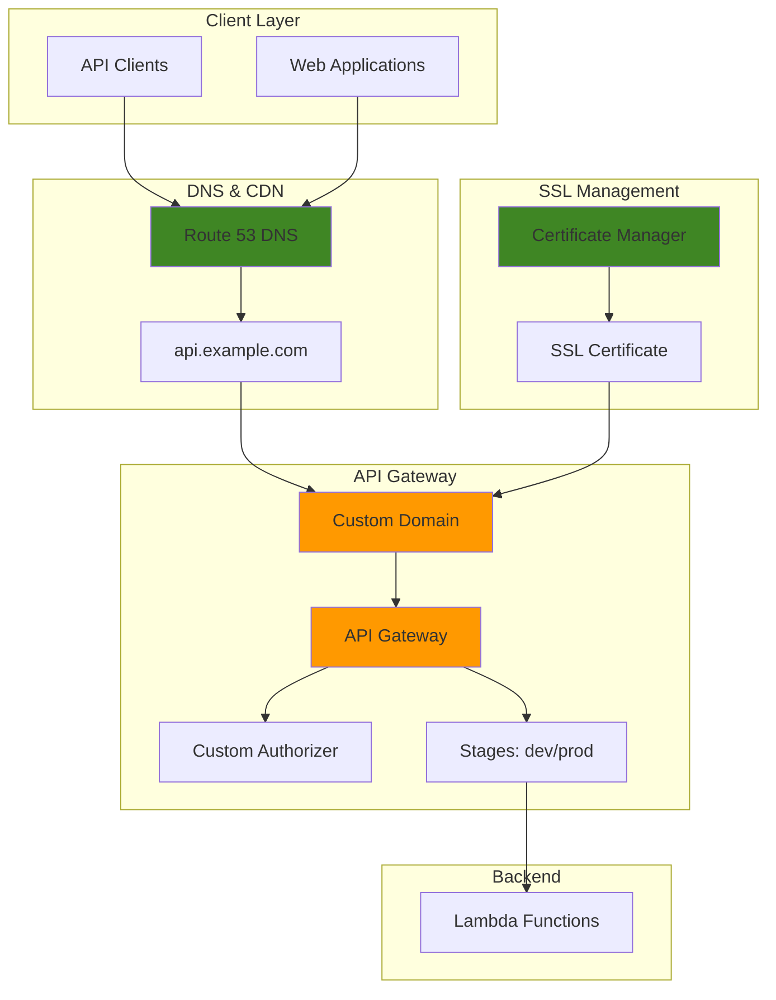

# API Gateway with Custom Domain Names

## Problem

Organizations developing REST APIs face the challenge of providing professional, user-friendly endpoints to their customers and partners. The default API Gateway URLs like `https://api-id.execute-api.region.amazonaws.com/stage` are randomly generated, difficult to remember, and lack branding consistency. These technical URLs create poor user experiences, complicate API documentation, and make it challenging to establish professional API programs. Additionally, managing SSL certificates, implementing proper routing, and ensuring secure access across multiple environments becomes complex without a standardized approach.

## Solution

This recipe demonstrates how to implement professional API deployments using Amazon API Gateway with custom domain names, SSL certificates managed by AWS Certificate Manager, and advanced routing configurations. The solution creates a branded, secure API endpoint that provides consistent access across different environments while maintaining proper certificate management and DNS routing through Route 53.

## Architecture Diagram



## Prerequisites

1. AWS account with appropriate permissions for API Gateway, Certificate Manager, Route 53, and Lambda
2. AWS CLI v2 installed and configured (or AWS CloudShell)
3. A registered domain name that you control
4. Basic knowledge of REST APIs and DNS concepts
5. Understanding of SSL/TLS certificates
6. Estimated cost: $2-5 per month for Route 53 hosted zone and certificate management

> **Note**: This recipe assumes you have a registered domain. If you don't have one, you can register it through Route 53 or use a third-party registrar. For comprehensive domain management options, see the [Route 53 DNS configuration guide](https://docs.aws.amazon.com/Route53/latest/DeveloperGuide/dns-configuring.html).

## Preparation

```bash
# Set environment variables
export AWS_REGION=$(aws configure get region)
export AWS_ACCOUNT_ID=$(aws sts get-caller-identity \
    --query Account --output text)

# Set your domain name (replace with your actual domain)
export DOMAIN_NAME="example.com"
export API_SUBDOMAIN="api.${DOMAIN_NAME}"

# Generate unique identifiers for resources
RANDOM_SUFFIX=$(aws secretsmanager get-random-password \
    --exclude-punctuation --exclude-uppercase \
    --password-length 6 --require-each-included-type \
    --output text --query RandomPassword)

export API_NAME="petstore-api-${RANDOM_SUFFIX}"
export LAMBDA_FUNCTION_NAME="petstore-handler-${RANDOM_SUFFIX}"
export AUTHORIZER_FUNCTION_NAME="petstore-authorizer-${RANDOM_SUFFIX}"

# Create S3 bucket for deployment artifacts
export DEPLOYMENT_BUCKET="api-deployment-${RANDOM_SUFFIX}"
aws s3 mb s3://${DEPLOYMENT_BUCKET} --region ${AWS_REGION}

echo "✅ Environment prepared with domain: ${API_SUBDOMAIN}"
```

## Steps

1. **Create SSL Certificate in Certificate Manager**:

   SSL/TLS certificates are fundamental to API security, establishing encrypted communication channels between clients and your API endpoints. AWS Certificate Manager (ACM) provides free, automatically renewing certificates that integrate seamlessly with other AWS services. By requesting a certificate through ACM, you're establishing the cryptographic foundation that enables HTTPS connections to your custom domain, ensuring data integrity and authentication for all API communications.

   ```bash
   # Request SSL certificate for custom domain
   CERTIFICATE_ARN=$(aws acm request-certificate \
       --domain-name ${API_SUBDOMAIN} \
       --validation-method DNS \
       --subject-alternative-names "*.${API_SUBDOMAIN}" \
       --query CertificateArn --output text)
   
   # Get certificate validation details
   aws acm describe-certificate \
       --certificate-arn ${CERTIFICATE_ARN} \
       --query 'Certificate.DomainValidationOptions[0].ResourceRecord'
   
   echo "✅ Certificate requested: ${CERTIFICATE_ARN}"
   echo "⚠️  Add the DNS validation record to your domain's DNS settings"
   ```

   The certificate request initiates the SSL/TLS provisioning process and returns a unique ARN that will be used to associate the certificate with your API Gateway custom domain. The DNS validation method ensures automated certificate renewal without manual intervention, as documented in the [AWS Certificate Manager DNS validation guide](https://docs.aws.amazon.com/acm/latest/userguide/dns-validation.html). You must add the returned DNS validation record to your domain's DNS settings to prove domain ownership before the certificate becomes active.

2. **Create Lambda Function for API Backend**:

   Lambda functions serve as the compute layer for serverless APIs, providing automatic scaling, pay-per-execution pricing, and zero server management overhead. Before deploying Lambda functions, you must establish proper IAM roles that follow the principle of least privilege. This security model ensures your functions can only access the specific AWS services they require, reducing potential security vulnerabilities while enabling the necessary operational capabilities.

   ```bash
   # Create Lambda execution role
   cat > lambda-trust-policy.json << EOF
   {
       "Version": "2012-10-17",
       "Statement": [
           {
               "Effect": "Allow",
               "Principal": {
                   "Service": "lambda.amazonaws.com"
               },
               "Action": "sts:AssumeRole"
           }
       ]
   }
   EOF
   
   aws iam create-role \
       --role-name ${LAMBDA_FUNCTION_NAME}-role \
       --assume-role-policy-document file://lambda-trust-policy.json
   
   # Attach basic Lambda execution policy
   aws iam attach-role-policy \
       --role-name ${LAMBDA_FUNCTION_NAME}-role \
       --policy-arn arn:aws:iam::aws:policy/service-role/AWSLambdaBasicExecutionRole
   
   echo "✅ Lambda IAM role created"
   ```

   The IAM role establishes the security boundary for your Lambda functions, enabling them to write logs to CloudWatch while preventing unauthorized access to other AWS services. This foundational security layer is essential for API Gateway integration and allows Lambda to process incoming API requests with appropriate permissions. The trust policy specifically allows the Lambda service to assume this role, creating the secure execution context needed for your API backend.

3. **Deploy Lambda Function Code**:

   The Lambda function serves as your API's business logic layer, processing HTTP requests and generating appropriate responses. This serverless approach eliminates infrastructure management while providing automatic scaling based on demand. The function code demonstrates RESTful API patterns with proper HTTP status codes, CORS headers for cross-origin requests, and structured JSON responses that align with modern API design principles.

   ```bash
   # Create Lambda function code
   cat > lambda-function.py << 'EOF'
   import json
   import logging
   
   logger = logging.getLogger()
   logger.setLevel(logging.INFO)
   
   def lambda_handler(event, context):
       logger.info(f"Event: {json.dumps(event)}")
       
       # Extract HTTP method and path
       http_method = event.get('httpMethod', 'GET')
       path = event.get('path', '/')
       
       # Sample API responses
       if path == '/pets' and http_method == 'GET':
           return {
               'statusCode': 200,
               'headers': {
                   'Content-Type': 'application/json',
                   'Access-Control-Allow-Origin': '*'
               },
               'body': json.dumps({
                   'pets': [
                       {'id': 1, 'name': 'Buddy', 'type': 'dog'},
                       {'id': 2, 'name': 'Whiskers', 'type': 'cat'}
                   ]
               })
           }
       elif path == '/pets' and http_method == 'POST':
           return {
               'statusCode': 201,
               'headers': {
                   'Content-Type': 'application/json',
                   'Access-Control-Allow-Origin': '*'
               },
               'body': json.dumps({
                   'message': 'Pet created successfully',
                   'id': 3
               })
           }
       else:
           return {
               'statusCode': 404,
               'headers': {
                   'Content-Type': 'application/json',
                   'Access-Control-Allow-Origin': '*'
               },
               'body': json.dumps({
                   'error': 'Not Found'
               })
           }
   EOF
   
   # Package Lambda function
   zip lambda-function.zip lambda-function.py
   
   # Create Lambda function
   LAMBDA_FUNCTION_ARN=$(aws lambda create-function \
       --function-name ${LAMBDA_FUNCTION_NAME} \
       --runtime python3.12 \
       --role arn:aws:iam::${AWS_ACCOUNT_ID}:role/${LAMBDA_FUNCTION_NAME}-role \
       --handler lambda-function.lambda_handler \
       --zip-file fileb://lambda-function.zip \
       --query FunctionArn --output text)
   
   echo "✅ Lambda function created: ${LAMBDA_FUNCTION_ARN}"
   ```

   Your Lambda function is now deployed and ready to handle API requests through API Gateway integration. The function ARN provides the unique identifier that API Gateway will use to invoke your backend logic, establishing the critical link between your API endpoints and the serverless compute layer that processes business operations.

4. **Create Custom Authorizer Lambda Function**:

   API security requires robust authentication and authorization mechanisms to protect against unauthorized access. Custom authorizers in API Gateway provide fine-grained access control by evaluating incoming requests and determining whether to allow or deny API access. This Lambda function implements token-based authentication, validating authorization headers and returning IAM policies that define the caller's permitted actions, as detailed in the [API Gateway Lambda authorizer documentation](https://docs.aws.amazon.com/apigateway/latest/developerguide/configure-api-gateway-lambda-authorization.html).

   ```bash
   # Create custom authorizer function
   cat > authorizer-function.py << 'EOF'
   import json
   import logging
   
   logger = logging.getLogger()
   logger.setLevel(logging.INFO)
   
   def lambda_handler(event, context):
       logger.info(f"Authorizer Event: {json.dumps(event)}")
       
       # Extract the authorization token
       token = event.get('authorizationToken', '')
       method_arn = event.get('methodArn', '')
       
       # Simple token validation (in production, use proper JWT validation)
       if token == 'Bearer valid-token':
           effect = 'Allow'
           principal_id = 'user123'
       else:
           effect = 'Deny'
           principal_id = 'anonymous'
       
       # Generate policy document
       policy_document = {
           'Version': '2012-10-17',
           'Statement': [
               {
                   'Action': 'execute-api:Invoke',
                   'Effect': effect,
                   'Resource': method_arn
               }
           ]
       }
       
       return {
           'principalId': principal_id,
           'policyDocument': policy_document,
           'context': {
               'userId': principal_id,
               'userRole': 'user'
           }
       }
   EOF
   
   # Package authorizer function
   zip authorizer-function.zip authorizer-function.py
   
   # Create authorizer Lambda function
   AUTHORIZER_FUNCTION_ARN=$(aws lambda create-function \
       --function-name ${AUTHORIZER_FUNCTION_NAME} \
       --runtime python3.12 \
       --role arn:aws:iam::${AWS_ACCOUNT_ID}:role/${LAMBDA_FUNCTION_NAME}-role \
       --handler authorizer-function.lambda_handler \
       --zip-file fileb://authorizer-function.zip \
       --query FunctionArn --output text)
   
   echo "✅ Custom authorizer function created: ${AUTHORIZER_FUNCTION_ARN}"
   ```

   The custom authorizer function establishes your API's security perimeter, implementing authentication logic that validates tokens and generates IAM policies for request authorization. This security layer ensures only authenticated clients can access your API endpoints while providing the flexibility to implement complex authorization rules based on user roles, permissions, or business requirements.

5. **Create API Gateway REST API**:

   Amazon API Gateway acts as the entry point for your API, providing request routing, authentication, monitoring, and traffic management capabilities. The REST API model offers comprehensive HTTP method support with fine-grained control over request/response transformations. Creating a regional endpoint optimizes performance for clients in the same AWS region while supporting custom domain integration, as outlined in the [API Gateway custom domain setup guide](https://docs.aws.amazon.com/apigateway/latest/developerguide/how-to-custom-domains.html).

   ```bash
   # Create REST API
   REST_API_ID=$(aws apigateway create-rest-api \
       --name ${API_NAME} \
       --description "Pet Store API with custom domain" \
       --endpoint-configuration types=REGIONAL \
       --query id --output text)
   
   # Get the root resource ID
   ROOT_RESOURCE_ID=$(aws apigateway get-resources \
       --rest-api-id ${REST_API_ID} \
       --query 'items[?path==`/`].id' --output text)
   
   # Create /pets resource
   PETS_RESOURCE_ID=$(aws apigateway create-resource \
       --rest-api-id ${REST_API_ID} \
       --parent-id ${ROOT_RESOURCE_ID} \
       --path-part pets \
       --query id --output text)
   
   echo "✅ REST API created: ${REST_API_ID}"
   echo "✅ /pets resource created: ${PETS_RESOURCE_ID}"
   ```

   Your API Gateway REST API framework is now established with the foundational resource structure. The API ID serves as the unique identifier for all subsequent configuration operations, while the resource hierarchy defines the URL paths available to API consumers. This structure provides the routing foundation that will connect incoming HTTP requests to your Lambda backend functions.

6. **Create Custom Authorizer for API Gateway**:

   Integrating the custom authorizer with API Gateway creates a security checkpoint that validates every incoming request before allowing access to backend resources. The TOKEN authorizer type examines Authorization headers, enabling bearer token authentication patterns commonly used in modern API architectures. The 300-second TTL caches authorization results to improve performance while maintaining security, reducing the number of authorizer invocations for repeated requests from the same client.

   ```bash
   # Create custom authorizer
   AUTHORIZER_ID=$(aws apigateway create-authorizer \
       --rest-api-id ${REST_API_ID} \
       --name ${AUTHORIZER_FUNCTION_NAME} \
       --type TOKEN \
       --authorizer-uri arn:aws:apigateway:${AWS_REGION}:lambda:path/2015-03-31/functions/${AUTHORIZER_FUNCTION_ARN}/invocations \
       --identity-source method.request.header.Authorization \
       --authorizer-result-ttl-in-seconds 300 \
       --query id --output text)
   
   # Grant API Gateway permission to invoke authorizer
   aws lambda add-permission \
       --function-name ${AUTHORIZER_FUNCTION_NAME} \
       --statement-id ${AUTHORIZER_FUNCTION_NAME}-apigateway \
       --action lambda:InvokeFunction \
       --principal apigateway.amazonaws.com \
       --source-arn arn:aws:execute-api:${AWS_REGION}:${AWS_ACCOUNT_ID}:${REST_API_ID}/authorizers/${AUTHORIZER_ID}
   
   echo "✅ Custom authorizer created: ${AUTHORIZER_ID}"
   ```

   The authorizer is now configured to intercept all API requests, providing centralized authentication and authorization control. The Lambda permission allows API Gateway to invoke your authorizer function, establishing the security integration that protects your API endpoints from unauthorized access while enabling legitimate clients to proceed with their requests.

7. **Configure API Methods and Integration**:

   API methods define the HTTP operations available to clients while integrations specify how API Gateway connects those methods to backend services. The AWS_PROXY integration type provides seamless request/response mapping between API Gateway and Lambda, automatically forwarding HTTP headers, query parameters, and request bodies to your function. This configuration creates RESTful endpoints that support standard HTTP operations while maintaining security through the custom authorizer integration.

   ```bash
   # Create GET method for /pets
   aws apigateway put-method \
       --rest-api-id ${REST_API_ID} \
       --resource-id ${PETS_RESOURCE_ID} \
       --http-method GET \
       --authorization-type CUSTOM \
       --authorizer-id ${AUTHORIZER_ID}
   
   # Create POST method for /pets
   aws apigateway put-method \
       --rest-api-id ${REST_API_ID} \
       --resource-id ${PETS_RESOURCE_ID} \
       --http-method POST \
       --authorization-type CUSTOM \
       --authorizer-id ${AUTHORIZER_ID}
   
   # Create Lambda integration for GET /pets
   aws apigateway put-integration \
       --rest-api-id ${REST_API_ID} \
       --resource-id ${PETS_RESOURCE_ID} \
       --http-method GET \
       --type AWS_PROXY \
       --integration-http-method POST \
       --uri arn:aws:apigateway:${AWS_REGION}:lambda:path/2015-03-31/functions/${LAMBDA_FUNCTION_ARN}/invocations
   
   # Create Lambda integration for POST /pets
   aws apigateway put-integration \
       --rest-api-id ${REST_API_ID} \
       --resource-id ${PETS_RESOURCE_ID} \
       --http-method POST \
       --type AWS_PROXY \
       --integration-http-method POST \
       --uri arn:aws:apigateway:${AWS_REGION}:lambda:path/2015-03-31/functions/${LAMBDA_FUNCTION_ARN}/invocations
   
   # Grant API Gateway permission to invoke Lambda
   aws lambda add-permission \
       --function-name ${LAMBDA_FUNCTION_NAME} \
       --statement-id ${LAMBDA_FUNCTION_NAME}-apigateway \
       --action lambda:InvokeFunction \
       --principal apigateway.amazonaws.com \
       --source-arn arn:aws:execute-api:${AWS_REGION}:${AWS_ACCOUNT_ID}:${REST_API_ID}/*
   
   echo "✅ API methods and integrations configured"
   ```

   Your API now has fully functional endpoints with secure authentication and backend integration. The method configurations establish the HTTP contract for your API, while the Lambda integrations provide the compute layer that processes business logic. The granted permissions enable API Gateway to invoke your Lambda functions, completing the request flow from client to backend processing.

8. **Deploy API and Create Stages**:

   API Gateway stages provide environment isolation, enabling you to maintain separate development, testing, and production versions of your API with different configurations. Deployments create immutable snapshots of your API configuration, while stages serve as named references to specific deployments. This pattern supports continuous integration workflows where you can test changes in development environments before promoting them to production, ensuring API stability and reliability.

   ```bash
   # Create initial deployment
   DEPLOYMENT_ID=$(aws apigateway create-deployment \
       --rest-api-id ${REST_API_ID} \
       --stage-name dev \
       --stage-description "Development stage" \
       --description "Initial deployment" \
       --query id --output text)
   
   # Create production stage
   aws apigateway create-stage \
       --rest-api-id ${REST_API_ID} \
       --stage-name prod \
       --deployment-id ${DEPLOYMENT_ID} \
       --description "Production stage" \
       --variables environment=production
   
   # Update dev stage with development variables
   aws apigateway update-stage \
       --rest-api-id ${REST_API_ID} \
       --stage-name dev \
       --patch-operations op=replace,path=/variables/environment,value=development
   
   echo "✅ API deployed to dev and prod stages"
   echo "Default API URL: https://${REST_API_ID}.execute-api.${AWS_REGION}.amazonaws.com/dev"
   ```

   Your API is now accessible through distinct development and production endpoints, providing environment separation that supports safe testing and deployment practices. The stage variables enable environment-specific configuration while maintaining identical API behavior across stages, preparing your API for custom domain integration.

9. **Wait for Certificate Validation and Create Custom Domain**:

   Custom domain creation establishes the professional API endpoint that clients will use to access your services. This process requires a validated SSL certificate from ACM and creates a regional endpoint that handles the HTTPS termination. The TLS_1_2 security policy ensures modern encryption standards while maintaining compatibility with most clients, providing the secure foundation for your branded API endpoint.

   ```bash
   # Wait for certificate validation (manual step - check DNS)
   echo "⏳ Waiting for certificate validation..."
   echo "Please ensure the DNS validation record is added to your domain"
   echo "Check certificate status with:"
   echo "aws acm describe-certificate --certificate-arn ${CERTIFICATE_ARN}"
   
   # Note: In production, you might want to automate this with a loop
   # For now, we'll assume the certificate is validated
   
   # Create custom domain name (wait for cert validation first)
   aws apigateway create-domain-name \
       --domain-name ${API_SUBDOMAIN} \
       --certificate-arn ${CERTIFICATE_ARN} \
       --endpoint-configuration types=REGIONAL \
       --security-policy TLS_1_2
   
   # Get the regional domain name for DNS setup
   REGIONAL_DOMAIN=$(aws apigateway get-domain-name \
       --domain-name ${API_SUBDOMAIN} \
       --query regionalDomainName --output text)
   
   echo "✅ Custom domain created: ${API_SUBDOMAIN}"
   echo "🔍 Regional domain for DNS: ${REGIONAL_DOMAIN}"
   ```

   The custom domain is now configured and ready for DNS mapping. The regional domain name provides the target for your DNS CNAME record, establishing the connection between your branded domain and the API Gateway infrastructure. This completes the SSL/TLS setup and prepares your API for professional client access through your custom domain.

10. **Create API Mappings for Different Stages**:

    Base path mappings establish the URL structure that determines how clients access different versions and environments of your API through the custom domain. This strategic approach to API versioning supports backward compatibility while enabling clear separation between development and production environments. Multiple mappings allow you to maintain legacy API versions while introducing new functionality, providing flexibility for client migration strategies.

    ```bash
    # Create base path mapping for dev stage
    aws apigateway create-base-path-mapping \
        --domain-name ${API_SUBDOMAIN} \
        --rest-api-id ${REST_API_ID} \
        --stage dev \
        --base-path v1-dev
    
    # Create base path mapping for prod stage
    aws apigateway create-base-path-mapping \
        --domain-name ${API_SUBDOMAIN} \
        --rest-api-id ${REST_API_ID} \
        --stage prod \
        --base-path v1
    
    # Create default mapping (empty base path) for prod
    aws apigateway create-base-path-mapping \
        --domain-name ${API_SUBDOMAIN} \
        --rest-api-id ${REST_API_ID} \
        --stage prod
    
    echo "✅ API mappings created:"
    echo "  - Production: https://${API_SUBDOMAIN}/pets"
    echo "  - Production (v1): https://${API_SUBDOMAIN}/v1/pets"
    echo "  - Development: https://${API_SUBDOMAIN}/v1-dev/pets"
    ```

    Your custom domain now supports multiple API access patterns, enabling clients to use either versioned paths for explicit API version control or the root path for simplified access. This URL structure provides professional API endpoints that support both current operations and future API evolution strategies.

11. **Configure DNS Records in Route 53**:

    DNS configuration completes the custom domain setup by creating the critical link between your branded domain name and the API Gateway infrastructure. Route 53 provides authoritative DNS services that route client requests from your custom domain to the appropriate API Gateway endpoint. The CNAME record establishes this mapping, enabling global DNS resolution that directs API traffic to your regional API Gateway endpoint, as detailed in the [Route 53 DNS record types documentation](https://docs.aws.amazon.com/Route53/latest/DeveloperGuide/ResourceRecordTypes.html).

    ```bash
    # Get hosted zone ID (assuming you have one for your domain)
    HOSTED_ZONE_ID=$(aws route53 list-hosted-zones \
        --query "HostedZones[?Name=='${DOMAIN_NAME}.'].Id" \
        --output text | cut -d'/' -f3)
    
    if [ -z "$HOSTED_ZONE_ID" ]; then
        echo "⚠️  No hosted zone found for ${DOMAIN_NAME}"
        echo "Please create a hosted zone or use your DNS provider"
        echo "Create CNAME record: ${API_SUBDOMAIN} -> ${REGIONAL_DOMAIN}"
    else
        # Create DNS record for custom domain
        cat > dns-record.json << EOF
    {
        "Changes": [{
            "Action": "CREATE",
            "ResourceRecordSet": {
                "Name": "${API_SUBDOMAIN}",
                "Type": "CNAME",
                "TTL": 300,
                "ResourceRecords": [{"Value": "${REGIONAL_DOMAIN}"}]
            }
        }]
    }
    EOF
        
        aws route53 change-resource-record-sets \
            --hosted-zone-id ${HOSTED_ZONE_ID} \
            --change-batch file://dns-record.json
        
        echo "✅ DNS record created in Route 53"
    fi
    ```

    DNS propagation is now in progress, making your custom API domain globally accessible. The CNAME record directs all requests for your API subdomain to the API Gateway regional endpoint, completing the end-to-end connection from branded URL to your serverless API infrastructure. DNS changes typically propagate within minutes but may take up to 48 hours for global consistency.

12. **Implement Request Validation and Throttling**:

    Request validation and throttling provide essential API governance capabilities that protect your backend services while ensuring consistent API behavior. Request validators enforce data quality by rejecting malformed requests before they reach your Lambda functions, reducing processing costs and improving error handling. Throttling limits protect against abuse and ensure fair resource allocation among API consumers, preventing individual clients from overwhelming your infrastructure.

    ```bash
    # Create request validator
    VALIDATOR_ID=$(aws apigateway create-request-validator \
        --rest-api-id ${REST_API_ID} \
        --name ${API_NAME}-validator \
        --validate-request-body true \
        --validate-request-parameters true \
        --query id --output text)
    
    # Update POST method to use request validator
    aws apigateway update-method \
        --rest-api-id ${REST_API_ID} \
        --resource-id ${PETS_RESOURCE_ID} \
        --http-method POST \
        --patch-operations op=replace,path=/requestValidatorId,value=${VALIDATOR_ID}
    
    # Configure throttling on stages
    aws apigateway update-stage \
        --rest-api-id ${REST_API_ID} \
        --stage-name prod \
        --patch-operations op=replace,path=/throttle/rateLimit,value=100 \
                           op=replace,path=/throttle/burstLimit,value=200
    
    aws apigateway update-stage \
        --rest-api-id ${REST_API_ID} \
        --stage-name dev \
        --patch-operations op=replace,path=/throttle/rateLimit,value=50 \
                           op=replace,path=/throttle/burstLimit,value=100
    
    echo "✅ Request validation and throttling configured"
    ```

    Your API now includes comprehensive quality controls and protection mechanisms. Request validation ensures data integrity while throttling limits maintain service availability and fair usage across all API consumers. These governance features provide the operational foundation needed for production API deployments.

> **Warning**: Monitor throttling metrics in CloudWatch to ensure rate limits align with your business requirements. Overly restrictive limits may impact legitimate users, while insufficient limits may not protect against abuse scenarios.

## Validation & Testing

1. **Verify Custom Domain Configuration**:

   ```bash
   # Check domain name status
   aws apigateway get-domain-name \
       --domain-name ${API_SUBDOMAIN}
   
   # List base path mappings
   aws apigateway get-base-path-mappings \
       --domain-name ${API_SUBDOMAIN}
   ```

   Expected output: Domain should show "AVAILABLE" status and list the configured base path mappings.

2. **Test API Endpoints**:

   ```bash
   # Test unauthorized access (should fail)
   curl -v https://${API_SUBDOMAIN}/pets
   
   # Test authorized access
   curl -v -H "Authorization: Bearer valid-token" \
       https://${API_SUBDOMAIN}/pets
   
   # Test POST request
   curl -v -X POST \
       -H "Authorization: Bearer valid-token" \
       -H "Content-Type: application/json" \
       -d '{"name":"Fluffy","type":"cat"}' \
       https://${API_SUBDOMAIN}/pets
   ```

3. **Test Different Stages**:

   ```bash
   # Test development stage
   curl -v -H "Authorization: Bearer valid-token" \
       https://${API_SUBDOMAIN}/v1-dev/pets
   
   # Test production stage with version path
   curl -v -H "Authorization: Bearer valid-token" \
       https://${API_SUBDOMAIN}/v1/pets
   ```

4. **Verify SSL Certificate**:

   ```bash
   # Check SSL certificate
   openssl s_client -connect ${API_SUBDOMAIN}:443 \
       -servername ${API_SUBDOMAIN} < /dev/null 2>/dev/null | \
       openssl x509 -noout -subject -dates
   ```

## Cleanup

1. **Remove Custom Domain and Mappings**:

   ```bash
   # Delete base path mappings
   aws apigateway get-base-path-mappings \
       --domain-name ${API_SUBDOMAIN} \
       --query 'items[].basePath' --output text | \
   while read -r base_path; do
       if [ "$base_path" = "None" ]; then
           base_path=""
       fi
       aws apigateway delete-base-path-mapping \
           --domain-name ${API_SUBDOMAIN} \
           --base-path "${base_path}"
   done
   
   # Delete custom domain
   aws apigateway delete-domain-name \
       --domain-name ${API_SUBDOMAIN}
   
   echo "✅ Custom domain and mappings deleted"
   ```

2. **Remove DNS Records**:

   ```bash
   # Remove DNS record if created in Route 53
   if [ ! -z "$HOSTED_ZONE_ID" ]; then
       cat > delete-dns-record.json << EOF
   {
       "Changes": [{
           "Action": "DELETE",
           "ResourceRecordSet": {
               "Name": "${API_SUBDOMAIN}",
               "Type": "CNAME",
               "TTL": 300,
               "ResourceRecords": [{"Value": "${REGIONAL_DOMAIN}"}]
           }
       }]
   }
   EOF
       
       aws route53 change-resource-record-sets \
           --hosted-zone-id ${HOSTED_ZONE_ID} \
           --change-batch file://delete-dns-record.json
   fi
   
   echo "✅ DNS records cleaned up"
   ```

3. **Delete API Gateway Resources**:

   ```bash
   # Delete REST API (this removes all associated resources)
   aws apigateway delete-rest-api \
       --rest-api-id ${REST_API_ID}
   
   echo "✅ REST API deleted"
   ```

4. **Remove Lambda Functions and Roles**:

   ```bash
   # Delete Lambda functions
   aws lambda delete-function \
       --function-name ${LAMBDA_FUNCTION_NAME}
   
   aws lambda delete-function \
       --function-name ${AUTHORIZER_FUNCTION_NAME}
   
   # Delete IAM role
   aws iam detach-role-policy \
       --role-name ${LAMBDA_FUNCTION_NAME}-role \
       --policy-arn arn:aws:iam::aws:policy/service-role/AWSLambdaBasicExecutionRole
   
   aws iam delete-role \
       --role-name ${LAMBDA_FUNCTION_NAME}-role
   
   echo "✅ Lambda functions and roles deleted"
   ```

5. **Delete SSL Certificate and Cleanup**:

   ```bash
   # Delete SSL certificate
   aws acm delete-certificate \
       --certificate-arn ${CERTIFICATE_ARN}
   
   # Remove S3 bucket
   aws s3 rb s3://${DEPLOYMENT_BUCKET} --force
   
   # Clean up local files
   rm -f lambda-trust-policy.json lambda-function.py lambda-function.zip
   rm -f authorizer-function.py authorizer-function.zip
   rm -f dns-record.json delete-dns-record.json
   
   echo "✅ SSL certificate and cleanup completed"
   ```

## Discussion

This implementation demonstrates a comprehensive approach to deploying professional APIs using Amazon API Gateway with custom domain names. The solution addresses several key architectural considerations that make it suitable for production environments.

**SSL Certificate Management**: The recipe uses AWS Certificate Manager to handle SSL/TLS certificates, which provides automatic renewal and validation. This eliminates the operational overhead of manual certificate management while ensuring secure communications. The DNS validation method is preferred for automation, though email validation can be used for domains not managed in Route 53.

**API Versioning and Stage Management**: The solution implements a strategic approach to API versioning by creating multiple base path mappings. Production APIs are accessible both at the root path and under a versioned path (`/v1`), while development APIs use a clearly distinguishable path (`/v1-dev`). This approach allows for backward compatibility while enabling controlled rollouts of new API versions.

**Security and Authorization**: The custom authorizer implementation provides a foundation for token-based authentication. In production environments, this should be enhanced with proper JWT validation, token refresh mechanisms, and integration with identity providers like Amazon Cognito or external OAuth servers. The request validation ensures that only properly formatted requests reach the backend services.

**Performance and Reliability**: The configuration includes throttling limits to protect backend services from abuse and ensure fair resource allocation. The regional endpoint configuration provides better performance for users in the same region while supporting global distribution through CloudFront if needed. For more information on API Gateway best practices, see the [AWS API Gateway Developer Guide](https://docs.aws.amazon.com/apigateway/latest/developerguide/) and the [custom domain setup guide](https://docs.aws.amazon.com/apigateway/latest/developerguide/how-to-custom-domains.html).

> **Tip**: Consider implementing API usage plans and API keys for different customer tiers to monetize your API and provide differentiated service levels. See the [API Gateway usage plans documentation](https://docs.aws.amazon.com/apigateway/latest/developerguide/api-gateway-api-usage-plans.html) for implementation guidance.

## Challenge

Extend this solution by implementing these enhancements:

1. **Multi-Region Deployment**: Deploy the API to multiple regions with Route 53 health checks and failover routing to create a globally distributed, highly available API service.

2. **API Gateway Integration with WAF**: Implement AWS WAF rules to protect against common web exploits, rate limiting abuse, and geographic restrictions for enhanced security.

3. **Advanced Monitoring and Analytics**: Set up CloudWatch custom metrics, X-Ray tracing, and API Gateway access logging to gain deep insights into API performance and usage patterns.

4. **Blue-Green Deployment Pipeline**: Create a CI/CD pipeline using CodePipeline and CodeDeploy that supports blue-green deployments with automated rollback capabilities for zero-downtime API updates.

5. **API Marketplace Integration**: Integrate with AWS Marketplace for API monetization, including usage plans, billing integration, and customer onboarding workflows.

## Infrastructure Code

### Available Infrastructure as Code:

- [Infrastructure Code Overview](code/README.md) - Detailed description of all infrastructure components
- [AWS CDK (Python)](code/cdk-python/) - AWS CDK Python implementation
- [AWS CDK (TypeScript)](code/cdk-typescript/) - AWS CDK TypeScript implementation
- [CloudFormation](code/cloudformation.yaml) - AWS CloudFormation template
- [Bash CLI Scripts](code/scripts/) - Example bash scripts using AWS CLI commands to deploy infrastructure
- [Terraform](code/terraform/) - Terraform configuration files