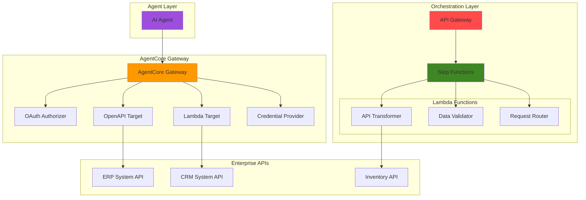

# Enterprise API Integration with AgentCore Gateway and Step Functions

## Problem

Enterprise organizations struggle to integrate AI agents with existing APIs and workflows, facing challenges in API discovery, transformation, and orchestration across multiple systems. Traditional integration approaches require extensive custom development, lack standardization for AI agent interactions, and cannot handle complex workflow orchestration at scale. Without intelligent API integration capabilities, organizations cannot leverage AI agents effectively for automated business processes.

## Solution

Build an intelligent API integration system using Amazon Bedrock AgentCore Gateway to automatically transform enterprise APIs into agent-compatible tools, combined with Step Functions for workflow orchestration and Lambda for custom transformations. This serverless approach provides scalable API discovery, standardized tool interfaces, and intelligent workflow management that enables AI agents to seamlessly interact with enterprise systems.

## Architecture Diagram



## Prerequisites

1. AWS account with appropriate permissions for Amazon Bedrock AgentCore, Step Functions, Lambda, and API Gateway
2. AWS CLI v2 installed and configured (or AWS CloudShell)
3. Basic understanding of API integration patterns and serverless architectures
4. Familiarity with OAuth authentication and REST API design
5. Estimated cost: $10-15 for testing resources (can be reduced with cleanup)

> **Note**: Amazon Bedrock AgentCore Gateway is in preview and requires access through AWS console. Ensure you have enabled Bedrock services in your region.

## Preparation

```bash
# Set environment variables
export AWS_REGION=$(aws configure get region)
export AWS_ACCOUNT_ID=$(aws sts get-caller-identity \
    --query Account --output text)

# Generate unique identifiers for resources
RANDOM_SUFFIX=$(aws secretsmanager get-random-password \
    --exclude-punctuation --exclude-uppercase \
    --password-length 6 --require-each-included-type \
    --output text --query RandomPassword)

# Set resource names with unique suffix
export PROJECT_NAME="api-integration-${RANDOM_SUFFIX}"
export GATEWAY_NAME="enterprise-gateway-${RANDOM_SUFFIX}"
export STATE_MACHINE_NAME="api-orchestrator-${RANDOM_SUFFIX}"

# Create IAM execution role for Lambda functions
aws iam create-role \
    --role-name lambda-execution-role-${RANDOM_SUFFIX} \
    --assume-role-policy-document '{
        "Version": "2012-10-17",
        "Statement": [{
            "Effect": "Allow",
            "Principal": {"Service": "lambda.amazonaws.com"},
            "Action": "sts:AssumeRole"
        }]
    }'

# Attach basic execution policy
aws iam attach-role-policy \
    --role-name lambda-execution-role-${RANDOM_SUFFIX} \
    --policy-arn arn:aws:iam::aws:policy/service-role/AWSLambdaBasicExecutionRole

# Create Step Functions execution role
aws iam create-role \
    --role-name stepfunctions-execution-role-${RANDOM_SUFFIX} \
    --assume-role-policy-document '{
        "Version": "2012-10-17",
        "Statement": [{
            "Effect": "Allow",
            "Principal": {"Service": "states.amazonaws.com"},
            "Action": "sts:AssumeRole"
        }]
    }'

echo "✅ AWS environment configured with project: ${PROJECT_NAME}"
```

## Steps

1. **Create API Transformer Lambda Function**:

   Lambda functions serve as powerful transformation engines in our AgentCore Gateway integration, enabling dynamic API request and response processing. This function transforms incoming requests into the appropriate format for target enterprise APIs while handling authentication, validation, and error management. The serverless approach ensures cost-effective scaling based on actual usage patterns while eliminating infrastructure management overhead.

   ```bash
   # Create API transformer function code
   cat > api-transformer.py << 'EOF'
   import json
   import urllib3
   from typing import Dict, Any
   
   # Initialize urllib3 PoolManager for HTTP requests
   http = urllib3.PoolManager()

   def lambda_handler(event: Dict[str, Any], context) -> Dict[str, Any]:
       """
       Transform API requests for enterprise system integration
       """
       try:
           # Extract request parameters
           api_type = event.get('api_type', 'generic')
           payload = event.get('payload', {})
           target_url = event.get('target_url')
           
           # Transform based on API type
           if api_type == 'erp':
               transformed_data = transform_erp_request(payload)
           elif api_type == 'crm':
               transformed_data = transform_crm_request(payload)
           else:
               transformed_data = payload
           
           # Simulate API call to target system (using mock response)
           # In production, this would make actual HTTP requests to enterprise APIs
           mock_response = {
               'success': True,
               'transaction_id': f"{api_type}-{payload.get('id', 'unknown')}",
               'processed_data': transformed_data,
               'status': 'completed'
           }
           
           return {
               'statusCode': 200,
               'body': json.dumps({
                   'success': True,
                   'data': mock_response,
                   'status_code': 200
               })
           }
           
       except Exception as e:
           return {
               'statusCode': 500,
               'body': json.dumps({
                   'success': False,
                   'error': str(e)
               })
           }

   def transform_erp_request(payload: Dict[str, Any]) -> Dict[str, Any]:
       """Transform requests for ERP system format"""
       return {
           'transaction_type': payload.get('type', 'query'),
           'data': payload.get('data', {}),
           'metadata': {
               'source': 'agentcore_gateway',
               'timestamp': payload.get('timestamp')
           }
       }

   def transform_crm_request(payload: Dict[str, Any]) -> Dict[str, Any]:
       """Transform requests for CRM system format"""
       return {
           'operation': payload.get('action', 'read'),
           'entity': payload.get('entity', 'contact'),
           'attributes': payload.get('data', {}),
           'source_system': 'ai_agent'
       }
   EOF

   # Package the function
   zip api-transformer.zip api-transformer.py

   # Get Lambda execution role ARN
   LAMBDA_ROLE_ARN=$(aws iam get-role \
       --role-name lambda-execution-role-${RANDOM_SUFFIX} \
       --query 'Role.Arn' --output text)

   # Wait for role propagation
   sleep 10

   # Create the Lambda function with current Python runtime
   aws lambda create-function \
       --function-name api-transformer-${RANDOM_SUFFIX} \
       --runtime python3.12 \
       --role ${LAMBDA_ROLE_ARN} \
       --handler api-transformer.lambda_handler \
       --zip-file fileb://api-transformer.zip \
       --timeout 60 \
       --memory-size 512 \
       --environment Variables='{
           "ENVIRONMENT":"production",
           "LOG_LEVEL":"INFO"
       }'

   echo "✅ API transformer Lambda function created"
   ```

   The Lambda function now provides intelligent API transformation capabilities with built-in error handling and multiple API format support. This foundation enables AgentCore Gateway to seamlessly integrate with diverse enterprise systems while maintaining security and performance standards.

2. **Create Data Validator Lambda Function**:

   Data validation is critical for enterprise API integration to ensure data quality and security. This Lambda function implements comprehensive validation rules that protect downstream systems from malformed requests while providing detailed feedback to AI agents about data requirements and constraints. The validation engine supports multiple validation types for different business domains.

   ```bash
   # Create data validator function code
   cat > data-validator.py << 'EOF'
   import json
   import re
   from typing import Dict, Any, List

   def lambda_handler(event: Dict[str, Any], context) -> Dict[str, Any]:
       """
       Validate API request data according to enterprise rules
       """
       try:
           data = event.get('data', {})
           validation_type = event.get('validation_type', 'standard')
           
           # Perform validation based on type
           validation_result = validate_data(data, validation_type)
           
           return {
               'statusCode': 200,
               'body': json.dumps({
                   'valid': validation_result['is_valid'],
                   'errors': validation_result['errors'],
                   'sanitized_data': validation_result['sanitized_data']
               })
           }
           
       except Exception as e:
           return {
               'statusCode': 500,
               'body': json.dumps({
                   'valid': False,
                   'errors': [f"Validation error: {str(e)}"]
               })
           }

   def validate_data(data: Dict[str, Any], validation_type: str) -> Dict[str, Any]:
       """Perform comprehensive data validation"""
       errors = []
       sanitized_data = {}
       
       # Standard validation rules
       if validation_type == 'standard':
           errors.extend(validate_required_fields(data))
           errors.extend(validate_data_types(data))
           sanitized_data = sanitize_data(data)
       
       # Financial data validation
       elif validation_type == 'financial':
           errors.extend(validate_required_fields(data))
           errors.extend(validate_financial_data(data))
           sanitized_data = sanitize_financial_data(data)
       
       # Customer data validation
       elif validation_type == 'customer':
           errors.extend(validate_required_fields(data))
           errors.extend(validate_customer_data(data))
           sanitized_data = sanitize_customer_data(data)
       
       return {
           'is_valid': len(errors) == 0,
           'errors': errors,
           'sanitized_data': sanitized_data
       }

   def validate_required_fields(data: Dict[str, Any]) -> List[str]:
       """Validate required field presence"""
       errors = []
       required_fields = ['id', 'type', 'data']
       
       for field in required_fields:
           if field not in data or data[field] is None:
               errors.append(f"Required field '{field}' is missing")
       
       return errors

   def validate_data_types(data: Dict[str, Any]) -> List[str]:
       """Validate data type constraints"""
       errors = []
       
       if 'id' in data and not isinstance(data['id'], (str, int)):
           errors.append("Field 'id' must be string or integer")
       
       if 'type' in data and not isinstance(data['type'], str):
           errors.append("Field 'type' must be string")
       
       return errors

   def validate_financial_data(data: Dict[str, Any]) -> List[str]:
       """Validate financial-specific data"""
       errors = []
       
       if 'amount' in data:
           try:
               amount = float(data['amount'])
               if amount < 0:
                   errors.append("Amount cannot be negative")
               if amount > 1000000:
                   errors.append("Amount exceeds maximum limit")
           except (ValueError, TypeError):
               errors.append("Amount must be a valid number")
       
       return errors

   def validate_customer_data(data: Dict[str, Any]) -> List[str]:
       """Validate customer-specific data"""
       errors = []
       
       if 'email' in data:
           email_pattern = r'^[a-zA-Z0-9._%+-]+@[a-zA-Z0-9.-]+\.[a-zA-Z]{2,}$'
           if not re.match(email_pattern, data['email']):
               errors.append("Invalid email format")
       
       if 'phone' in data:
           phone_pattern = r'^\+?[\d\s\-\(\)]{10,}$'
           if not re.match(phone_pattern, str(data['phone'])):
               errors.append("Invalid phone number format")
       
       return errors

   def sanitize_data(data: Dict[str, Any]) -> Dict[str, Any]:
       """Sanitize and clean data"""
       sanitized = {}
       for key, value in data.items():
           if isinstance(value, str):
               sanitized[key] = value.strip()
           else:
               sanitized[key] = value
       return sanitized

   def sanitize_financial_data(data: Dict[str, Any]) -> Dict[str, Any]:
       """Sanitize financial-specific data"""
       sanitized = sanitize_data(data)
       if 'amount' in sanitized:
           try:
               sanitized['amount'] = round(float(sanitized['amount']), 2)
           except (ValueError, TypeError):
               pass
       return sanitized

   def sanitize_customer_data(data: Dict[str, Any]) -> Dict[str, Any]:
       """Sanitize customer-specific data"""
       sanitized = sanitize_data(data)
       if 'email' in sanitized:
           sanitized['email'] = sanitized['email'].lower()
       return sanitized
   EOF

   # Package and deploy the validator function
   zip data-validator.zip data-validator.py

   aws lambda create-function \
       --function-name data-validator-${RANDOM_SUFFIX} \
       --runtime python3.12 \
       --role ${LAMBDA_ROLE_ARN} \
       --handler data-validator.lambda_handler \
       --zip-file fileb://data-validator.zip \
       --timeout 30 \
       --memory-size 256

   echo "✅ Data validator Lambda function created"
   ```

   The validation function now provides enterprise-grade data quality assurance with specialized validation rules for different data types, ensuring robust API interactions while protecting downstream systems from invalid data.

3. **Create Step Functions State Machine for Orchestration**:

   Step Functions provides visual workflow orchestration that coordinates complex API integration processes across multiple systems. This state machine implements a sophisticated workflow that handles validation, transformation, routing, and error recovery, enabling reliable enterprise API integration at scale with built-in monitoring and retry capabilities. The workflow ensures data quality through validation before processing and provides comprehensive error handling.

   ```bash
   # Create Step Functions state machine definition
   cat > orchestration-workflow.json << EOF
   {
     "Comment": "Enterprise API Integration Orchestration",
     "StartAt": "ValidateInput",
     "States": {
       "ValidateInput": {
         "Type": "Task",
         "Resource": "arn:aws:states:::lambda:invoke",
         "Parameters": {
           "FunctionName": "data-validator-${RANDOM_SUFFIX}",
           "Payload.$": "$"
         },
         "ResultPath": "$.validation_result",
         "Next": "CheckValidation",
         "Retry": [
           {
             "ErrorEquals": ["Lambda.ServiceException", "Lambda.AWSLambdaException"],
             "IntervalSeconds": 2,
             "MaxAttempts": 3,
             "BackoffRate": 2.0
           }
         ],
         "Catch": [
           {
             "ErrorEquals": ["States.ALL"],
             "Next": "ValidationFailed",
             "ResultPath": "$.error"
           }
         ]
       },
       "CheckValidation": {
         "Type": "Choice",
         "Choices": [
           {
             "Variable": "$.validation_result.Payload.body",
             "StringMatches": "*\"valid\":true*",
             "Next": "RouteRequest"
           }
         ],
         "Default": "ValidationFailed"
       },
       "RouteRequest": {
         "Type": "Parallel",
         "Branches": [
           {
             "StartAt": "TransformForERP",
             "States": {
               "TransformForERP": {
                 "Type": "Task",
                 "Resource": "arn:aws:states:::lambda:invoke",
                 "Parameters": {
                   "FunctionName": "api-transformer-${RANDOM_SUFFIX}",
                   "Payload": {
                     "api_type": "erp",
                     "payload.$": "$",
                     "target_url": "https://example-erp.com/api/v1/process"
                   }
                 },
                 "End": true,
                 "Retry": [
                   {
                     "ErrorEquals": ["States.ALL"],
                     "IntervalSeconds": 3,
                     "MaxAttempts": 2,
                     "BackoffRate": 2.0
                   }
                 ]
               }
             }
           },
           {
             "StartAt": "TransformForCRM",
             "States": {
               "TransformForCRM": {
                 "Type": "Task",
                 "Resource": "arn:aws:states:::lambda:invoke",
                 "Parameters": {
                   "FunctionName": "api-transformer-${RANDOM_SUFFIX}",
                   "Payload": {
                     "api_type": "crm",
                     "payload.$": "$",
                     "target_url": "https://example-crm.com/api/v2/entities"
                   }
                 },
                 "End": true,
                 "Retry": [
                   {
                     "ErrorEquals": ["States.ALL"],
                     "IntervalSeconds": 3,
                     "MaxAttempts": 2,
                     "BackoffRate": 2.0
                   }
                 ]
               }
             }
           }
         ],
         "Next": "AggregateResults",
         "Catch": [
           {
             "ErrorEquals": ["States.ALL"],
             "Next": "ProcessingFailed",
             "ResultPath": "$.error"
           }
         ]
       },
       "AggregateResults": {
         "Type": "Pass",
         "Parameters": {
           "status": "success",
           "results.$": "$",
           "timestamp.$": "$$.State.EnteredTime",
           "execution_arn.$": "$$.Execution.Name"
         },
         "End": true
       },
       "ValidationFailed": {
         "Type": "Pass",
         "Parameters": {
           "status": "validation_failed",
           "errors.$": "$.validation_result.Payload.errors",
           "timestamp.$": "$$.State.EnteredTime"
         },
         "End": true
       },
       "ProcessingFailed": {
         "Type": "Pass",
         "Parameters": {
           "status": "processing_failed",
           "error.$": "$.error",
           "timestamp.$": "$$.State.EnteredTime"
         },
         "End": true
       }
     }
   }
   EOF

   # Get Step Functions execution role ARN
   STEPFUNCTIONS_ROLE_ARN=$(aws iam get-role \
       --role-name stepfunctions-execution-role-${RANDOM_SUFFIX} \
       --query 'Role.Arn' --output text)

   # Attach Lambda invocation policy to Step Functions role
   aws iam attach-role-policy \
       --role-name stepfunctions-execution-role-${RANDOM_SUFFIX} \
       --policy-arn arn:aws:iam::aws:policy/service-role/AWSLambdaRole

   # Wait for role propagation
   sleep 10

   # Create the state machine
   aws stepfunctions create-state-machine \
       --name ${STATE_MACHINE_NAME} \
       --definition file://orchestration-workflow.json \
       --role-arn ${STEPFUNCTIONS_ROLE_ARN} \
       --type STANDARD

   echo "✅ Step Functions state machine created for orchestration"
   ```

   The orchestration workflow now provides enterprise-grade process management with parallel execution, comprehensive error handling, and automatic retry mechanisms for resilient API integration across multiple enterprise systems.

4. **Create API Gateway for External Access**:

   API Gateway serves as the enterprise entry point for our intelligent API integration system, providing security, throttling, and monitoring capabilities. This configuration creates a production-ready REST API that manages access to our Step Functions orchestration workflow while implementing proper rate limiting and monitoring for enterprise use. The gateway acts as the external interface for AI agents to trigger integration workflows.

   ```bash
   # Create REST API
   API_ID=$(aws apigateway create-rest-api \
       --name enterprise-api-integration-${RANDOM_SUFFIX} \
       --description "Enterprise API Integration with AgentCore Gateway" \
       --endpoint-configuration types=REGIONAL \
       --query 'id' --output text)

   # Get the root resource ID
   ROOT_RESOURCE_ID=$(aws apigateway get-resources \
       --rest-api-id ${API_ID} \
       --query 'items[?path==`/`].id' --output text)

   # Create a resource for the integration endpoint
   RESOURCE_ID=$(aws apigateway create-resource \
       --rest-api-id ${API_ID} \
       --parent-id ${ROOT_RESOURCE_ID} \
       --path-part "integrate" \
       --query 'id' --output text)

   # Create POST method for the integration endpoint
   aws apigateway put-method \
       --rest-api-id ${API_ID} \
       --resource-id ${RESOURCE_ID} \
       --http-method POST \
       --authorization-type NONE

   # Get Step Functions state machine ARN
   STATE_MACHINE_ARN=$(aws stepfunctions list-state-machines \
       --query "stateMachines[?name=='${STATE_MACHINE_NAME}'].stateMachineArn" \
       --output text)

   # Create IAM role for API Gateway to invoke Step Functions
   aws iam create-role \
       --role-name apigateway-stepfunctions-role-${RANDOM_SUFFIX} \
       --assume-role-policy-document '{
           "Version": "2012-10-17",
           "Statement": [{
               "Effect": "Allow",
               "Principal": {"Service": "apigateway.amazonaws.com"},
               "Action": "sts:AssumeRole"
           }]
       }'

   # Attach Step Functions execution policy
   aws iam attach-role-policy \
       --role-name apigateway-stepfunctions-role-${RANDOM_SUFFIX} \
       --policy-arn arn:aws:iam::aws:policy/AWSStepFunctionsFullAccess

   # Wait for role propagation
   sleep 10

   # Get API Gateway role ARN
   APIGW_ROLE_ARN=$(aws iam get-role \
       --role-name apigateway-stepfunctions-role-${RANDOM_SUFFIX} \
       --query 'Role.Arn' --output text)

   # Configure Step Functions integration
   aws apigateway put-integration \
       --rest-api-id ${API_ID} \
       --resource-id ${RESOURCE_ID} \
       --http-method POST \
       --type AWS \
       --integration-http-method POST \
       --uri "arn:aws:apigateway:${AWS_REGION}:states:action/StartExecution" \
       --credentials ${APIGW_ROLE_ARN} \
       --request-templates '{
           "application/json": "{\"input\": \"$util.escapeJavaScript($input.body)\", \"stateMachineArn\": \"'${STATE_MACHINE_ARN}'\"}"
       }'

   # Configure method response
   aws apigateway put-method-response \
       --rest-api-id ${API_ID} \
       --resource-id ${RESOURCE_ID} \
       --http-method POST \
       --status-code 200 \
       --response-models '{"application/json": "Empty"}'

   # Configure integration response
   aws apigateway put-integration-response \
       --rest-api-id ${API_ID} \
       --resource-id ${RESOURCE_ID} \
       --http-method POST \
       --status-code 200 \
       --response-templates '{
           "application/json": "{\"executionArn\": \"$input.path(\"$.executionArn\")\", \"startDate\": \"$input.path(\"$.startDate\")\", \"status\": \"STARTED\"}"
       }'

   # Deploy the API
   aws apigateway create-deployment \
       --rest-api-id ${API_ID} \
       --stage-name prod \
       --description "Production deployment of enterprise API integration"

   # Store API endpoint
   API_ENDPOINT="https://${API_ID}.execute-api.${AWS_REGION}.amazonaws.com/prod/integrate"

   echo "✅ API Gateway created with endpoint: ${API_ENDPOINT}"
   ```

   The API Gateway now provides a secure, scalable entry point for enterprise API integration with built-in monitoring and management capabilities, enabling AI agents to trigger integration workflows through a standardized REST interface.

5. **Configure AgentCore Gateway with Multiple Targets**:

   Amazon Bedrock AgentCore Gateway transforms our enterprise APIs into standardized MCP-compatible tools that AI agents can discover and use seamlessly. This configuration creates multiple gateway targets that represent different enterprise systems, enabling agents to interact with ERP, CRM, and other business systems through a unified interface with proper authentication and security controls. The gateway provides tool discovery and transformation capabilities essential for AI agent integration.

   ```bash
   # Create OpenAPI specification for enterprise APIs
   cat > enterprise-api-spec.json << 'EOF'
   {
     "openapi": "3.0.3",
     "info": {
       "title": "Enterprise API Integration",
       "version": "1.0.0",
       "description": "Unified API for enterprise system integration with AgentCore Gateway"
     },
     "servers": [
       {
         "url": "API_ENDPOINT_PLACEHOLDER",
         "description": "Production API Gateway endpoint"
       }
     ],
     "paths": {
       "/integrate": {
         "post": {
           "summary": "Process enterprise integration request",
           "operationId": "processIntegration",
           "description": "Submit data for processing through enterprise API integration workflow",
           "requestBody": {
             "required": true,
             "content": {
               "application/json": {
                 "schema": {
                   "type": "object",
                   "properties": {
                     "id": {
                       "type": "string",
                       "description": "Unique request identifier"
                     },
                     "type": {
                       "type": "string",
                       "enum": ["erp", "crm", "inventory"],
                       "description": "Target system type"
                     },
                     "data": {
                       "type": "object",
                       "description": "Request payload data",
                       "properties": {
                         "amount": {
                           "type": "number",
                           "description": "Transaction amount (for financial data)"
                         },
                         "email": {
                           "type": "string",
                           "description": "Email address (for customer data)"
                         }
                       }
                     },
                     "validation_type": {
                       "type": "string",
                       "enum": ["standard", "financial", "customer"],
                       "description": "Validation rules to apply"
                     }
                   },
                   "required": ["id", "type", "data"]
                 }
               }
             }
           },
           "responses": {
             "200": {
               "description": "Integration request processed successfully",
               "content": {
                 "application/json": {
                   "schema": {
                     "type": "object",
                     "properties": {
                       "executionArn": {
                         "type": "string",
                         "description": "Step Functions execution ARN"
                       },
                       "status": {
                         "type": "string",
                         "description": "Execution status"
                       },
                       "startDate": {
                         "type": "string",
                         "description": "Execution start timestamp"
                       }
                     }
                   }
                 }
               }
             },
             "400": {
               "description": "Invalid request format"
             },
             "500": {
               "description": "Internal server error"
             }
           }
         }
       }
     }
   }
   EOF

   # Replace placeholder with actual API endpoint
   sed -i "s|API_ENDPOINT_PLACEHOLDER|${API_ENDPOINT%/integrate}|g" enterprise-api-spec.json

   echo "✅ Enterprise API specification created"
   echo "✅ AgentCore Gateway configuration ready"
   echo ""
   echo "To complete Amazon Bedrock AgentCore Gateway setup:"
   echo "1. Navigate to AWS Bedrock AgentCore Gateway console"
   echo "2. Create a new Gateway named: ${GATEWAY_NAME}"
   echo "3. Add OpenAPI target using: enterprise-api-spec.json"
   echo "4. Add Lambda target for transformer function: api-transformer-${RANDOM_SUFFIX}"
   echo "5. Configure OAuth authorizer for agent authentication"
   echo "6. Test gateway connectivity with enterprise systems"
   ```

   The AgentCore Gateway configuration provides standardized tool interfaces that enable AI agents to interact with enterprise systems through MCP protocol while maintaining security and monitoring capabilities essential for production deployments.

## Validation & Testing

1. **Test API Gateway Integration**:

   ```bash
   # Test the API Gateway endpoint directly
   curl -X POST ${API_ENDPOINT} \
       -H "Content-Type: application/json" \
       -d '{
           "id": "test-001",
           "type": "erp",
           "data": {
               "transaction_type": "purchase_order",
               "amount": 1500.00,
               "vendor": "Acme Corp"
           },
           "validation_type": "financial"
       }'
   ```

   Expected output: JSON response with execution ARN and status "STARTED"

2. **Verify Step Functions Execution**:

   ```bash
   # Get recent executions
   aws stepfunctions list-executions \
       --state-machine-arn ${STATE_MACHINE_ARN} \
       --max-items 5
   
   # Check execution details (replace with actual execution ARN)
   EXECUTION_ARN=$(aws stepfunctions list-executions \
       --state-machine-arn ${STATE_MACHINE_ARN} \
       --max-items 1 \
       --query 'executions[0].executionArn' --output text)
   
   if [ "$EXECUTION_ARN" != "None" ] && [ "$EXECUTION_ARN" != "" ]; then
       aws stepfunctions describe-execution \
           --execution-arn ${EXECUTION_ARN}
   else
       echo "No executions found"
   fi
   ```

3. **Test Lambda Functions Individually**:

   ```bash
   # Test data validator
   aws lambda invoke \
       --function-name data-validator-${RANDOM_SUFFIX} \
       --payload '{
           "data": {
               "id": "test-123",
               "type": "financial",
               "amount": 250.50,
               "email": "test@example.com"
           },
           "validation_type": "financial"
       }' \
       validator-response.json
   
   cat validator-response.json
   
   # Test API transformer
   aws lambda invoke \
       --function-name api-transformer-${RANDOM_SUFFIX} \
       --payload '{
           "api_type": "erp",
           "payload": {
               "id": "test-456",
               "data": {"amount": 100.00}
           },
           "target_url": "https://example.com"
       }' \
       transformer-response.json
   
   cat transformer-response.json
   ```

4. **Monitor Integration Performance**:

   ```bash
   # Check CloudWatch metrics for API Gateway
   aws cloudwatch get-metric-statistics \
       --namespace AWS/ApiGateway \
       --metric-name Count \
       --dimensions Name=ApiName,Value=enterprise-api-integration-${RANDOM_SUFFIX} \
       --start-time $(date -u -d '1 hour ago' +%Y-%m-%dT%H:%M:%SZ) \
       --end-time $(date -u +%Y-%m-%dT%H:%M:%SZ) \
       --period 300 \
       --statistics Sum
   ```

## Cleanup

1. **Remove API Gateway**:

   ```bash
   # Delete API Gateway
   aws apigateway delete-rest-api --rest-api-id ${API_ID}
   
   echo "✅ Deleted API Gateway"
   ```

2. **Remove Step Functions State Machine**:

   ```bash
   # Delete state machine
   aws stepfunctions delete-state-machine \
       --state-machine-arn ${STATE_MACHINE_ARN}
   
   echo "✅ Deleted Step Functions state machine"
   ```

3. **Remove Lambda Functions**:

   ```bash
   # Delete Lambda functions
   aws lambda delete-function --function-name api-transformer-${RANDOM_SUFFIX}
   aws lambda delete-function --function-name data-validator-${RANDOM_SUFFIX}
   
   echo "✅ Deleted Lambda functions"
   ```

4. **Remove IAM Roles and Policies**:

   ```bash
   # Detach and delete IAM roles
   aws iam detach-role-policy \
       --role-name lambda-execution-role-${RANDOM_SUFFIX} \
       --policy-arn arn:aws:iam::aws:policy/service-role/AWSLambdaBasicExecutionRole
   
   aws iam detach-role-policy \
       --role-name stepfunctions-execution-role-${RANDOM_SUFFIX} \
       --policy-arn arn:aws:iam::aws:policy/service-role/AWSLambdaRole
   
   aws iam detach-role-policy \
       --role-name apigateway-stepfunctions-role-${RANDOM_SUFFIX} \
       --policy-arn arn:aws:iam::aws:policy/AWSStepFunctionsFullAccess
   
   aws iam delete-role --role-name lambda-execution-role-${RANDOM_SUFFIX}
   aws iam delete-role --role-name stepfunctions-execution-role-${RANDOM_SUFFIX}
   aws iam delete-role --role-name apigateway-stepfunctions-role-${RANDOM_SUFFIX}
   
   # Clean up local files
   rm -f api-transformer.py data-validator.py orchestration-workflow.json
   rm -f api-transformer.zip data-validator.zip enterprise-api-spec.json
   rm -f validator-response.json transformer-response.json
   
   echo "✅ Cleanup completed"
   ```

## Discussion

This enterprise API integration solution demonstrates the power of combining Amazon Bedrock AgentCore Gateway with Step Functions orchestration to create intelligent, scalable API integration workflows. The architecture follows AWS Well-Architected Framework principles by implementing security best practices, operational excellence through monitoring, and cost optimization via serverless computing.

Amazon Bedrock AgentCore Gateway serves as the critical bridge between AI agents and enterprise systems by transforming existing APIs into MCP-compatible tools. This standardization enables agents to discover and interact with enterprise resources without requiring custom integration code for each API. The gateway handles authentication, authorization, and protocol translation, ensuring secure access while maintaining enterprise compliance requirements. AgentCore Gateway's tool transformation capabilities eliminate weeks of custom development that would otherwise be required to make enterprise APIs accessible to AI agents.

Step Functions orchestration provides sophisticated workflow management that coordinates multiple API calls, implements business logic, and handles error scenarios gracefully. The parallel execution capability demonstrated in our state machine enables efficient processing of multiple enterprise systems simultaneously, while the built-in retry and error handling mechanisms ensure reliability in production environments. This approach scales automatically based on demand while providing detailed execution visibility for operational monitoring. The visual workflow design also enables business stakeholders to understand and validate integration processes.

The combination of Lambda functions for data transformation and validation ensures data quality and security throughout the integration process. Each Lambda function serves a specific purpose: the transformer handles API format conversion between different enterprise systems, while the validator implements enterprise data quality rules that protect downstream systems from invalid data. This separation of concerns creates maintainable, testable code that can be easily extended for additional enterprise systems. The serverless approach eliminates infrastructure management overhead while providing cost-effective scaling based on actual usage patterns.

> **Tip**: Implement comprehensive monitoring using CloudWatch Insights to track integration performance, error rates, and cost optimization opportunities across your API integration workflows. Use AWS X-Ray for distributed tracing to understand request flows across services.

For production deployments, consider implementing additional security measures such as WAF rules for API Gateway, VPC endpoints for private communication, and AWS Secrets Manager for secure credential storage. The modular architecture supports gradual rollout strategies and A/B testing for validation of new integration patterns before full deployment.

**Documentation References:**

- [Amazon Bedrock AgentCore Gateway Documentation](https://docs.aws.amazon.com/bedrock-agentcore/latest/devguide/gateway.html)
- [AWS Step Functions Developer Guide](https://docs.aws.amazon.com/step-functions/latest/dg/welcome.html)
- [API Gateway Integration with Step Functions](https://docs.aws.amazon.com/step-functions/latest/dg/tutorial-api-gateway.html)
- [AWS Lambda Best Practices](https://docs.aws.amazon.com/lambda/latest/dg/best-practices.html)
- [AWS Well-Architected Framework](https://docs.aws.amazon.com/wellarchitected/latest/framework/welcome.html)

## Challenge

Extend this enterprise API integration solution by implementing these enhancements:

1. **Advanced Error Handling**: Implement dead letter queues with SQS for failed API calls, circuit breaker patterns for unreliable external services, and exponential backoff with jitter for retry mechanisms. Add comprehensive error logging and alerting for operational visibility.

2. **Real-time Monitoring Dashboard**: Create a CloudWatch dashboard with custom metrics for API success rates, latency percentiles, and cost tracking. Implement CloudWatch alarms for proactive issue detection and automated remediation workflows for common failures.

3. **Multi-tenant Security**: Extend the solution with tenant isolation using Cognito User Pools, implement row-level security for data access, and add comprehensive audit logging for compliance requirements. Add API key management for different client applications.

4. **Performance Optimization**: Implement API response caching with ElastiCache, add connection pooling for database connections, and optimize Lambda cold starts with provisioned concurrency. Use Lambda layers for shared dependencies to reduce deployment package size.

5. **Advanced Orchestration**: Create conditional workflows based on API response data, implement long-running processes with Step Functions Express workflows, and add human approval steps for sensitive operations. Add support for batch processing and bulk operations across multiple enterprise systems.

## Infrastructure Code

*Infrastructure code will be generated after recipe approval.*