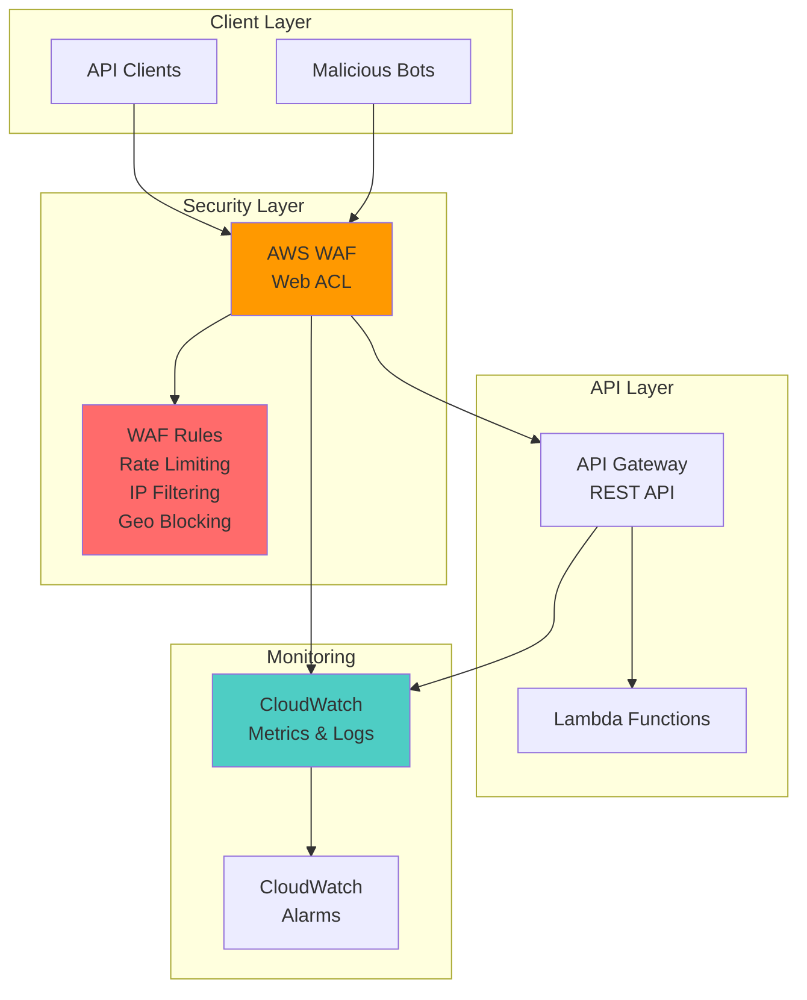

# API Security with WAF and Gateway

## Problem

Your organization exposes critical business functions through REST APIs that are facing increasing security threats including injection attacks, credential stuffing, DDoS attempts, and automated bot traffic. Manual security measures are insufficient to handle the scale and sophistication of modern attacks, leaving your APIs vulnerable to exploitation, service disruption, and potential data breaches that could result in significant financial and reputational damage.

## Solution

Implement a comprehensive API security strategy using AWS WAF (Web Application Firewall) integrated with Amazon API Gateway. This solution provides defense-in-depth protection through rate limiting, IP-based restrictions, request inspection rules, and geographic blocking. Combined with CloudWatch monitoring, you'll have real-time visibility into attack patterns and automatic mitigation capabilities that protect your APIs while maintaining legitimate user access.

## Architecture Diagram



## Prerequisites

1. AWS account with administrative privileges for WAF, API Gateway, and CloudWatch
2. AWS CLI v2 installed and configured (or AWS CloudShell access)
3. Basic understanding of REST APIs and web security concepts
4. Existing API Gateway REST API (or willingness to create a test API)
5. Estimated cost: $5-15/month for WAF web ACL and rule evaluations plus CloudWatch logging charges

> **Note**: AWS WAF charges $1.00 per web ACL per month, $0.60 per million requests, and $1.00 per rule per month. CloudWatch Logs charges $0.50 per GB ingested. See [AWS WAF Pricing](https://aws.amazon.com/waf/pricing/) for current rates.

## Preparation

```bash
# Set environment variables for consistent resource naming
export AWS_REGION=$(aws configure get region)
export AWS_ACCOUNT_ID=$(aws sts get-caller-identity \
    --query Account --output text)

# Generate unique suffix for resource names
RANDOM_SUFFIX=$(aws secretsmanager get-random-password \
    --exclude-punctuation --exclude-uppercase \
    --password-length 6 --require-each-included-type \
    --output text --query RandomPassword)

# Set resource names with unique suffix
export WAF_WEB_ACL_NAME="api-security-acl-${RANDOM_SUFFIX}"
export API_NAME="protected-api-${RANDOM_SUFFIX}"
export LOG_GROUP_NAME="/aws/waf/${WAF_WEB_ACL_NAME}"

echo "✅ Environment prepared with unique suffix: ${RANDOM_SUFFIX}"
echo "WAF Web ACL Name: ${WAF_WEB_ACL_NAME}"
echo "API Name: ${API_NAME}"
```

## Steps

1. **Create CloudWatch Log Group for WAF Logging**:

   CloudWatch logging provides crucial visibility into attack patterns and WAF decision-making processes. By creating a dedicated log group first, we establish the foundation for security monitoring and incident response capabilities that are essential for maintaining API security posture.

   ```bash
   # Create log group for WAF traffic logs
   aws logs create-log-group \
       --log-group-name "${LOG_GROUP_NAME}" \
       --region ${AWS_REGION}
   
   echo "✅ CloudWatch log group created: ${LOG_GROUP_NAME}"
   ```

   The log group is now ready to receive detailed WAF traffic logs, enabling security teams to analyze blocked requests, identify attack patterns, and fine-tune security rules based on real-world traffic patterns.

2. **Create AWS WAF Web ACL with Basic Protection**:

   AWS WAF's Web Access Control List (ACL) serves as the primary inspection engine for incoming API requests. WAF operates at the application layer (Layer 7) and can inspect HTTP/HTTPS request content including headers, body, and query parameters, providing sophisticated protection beyond traditional network firewalls.

   ```bash
   # Create the Web ACL with default action to allow
   aws wafv2 create-web-acl \
       --name "${WAF_WEB_ACL_NAME}" \
       --scope REGIONAL \
       --default-action Allow={} \
       --description "Web ACL for API Gateway protection" \
       --region ${AWS_REGION} \
       --query 'Summary.Id' --output text > /tmp/web-acl-id.txt
   
   export WEB_ACL_ID=$(cat /tmp/web-acl-id.txt)
   echo "✅ WAF Web ACL created with ID: ${WEB_ACL_ID}"
   ```

   The Web ACL is now established with a default "allow" action, meaning requests that don't match any specific rules will be permitted. This approach ensures legitimate traffic flows while we add targeted blocking rules for malicious patterns.

3. **Add Rate Limiting Rule to Prevent DDoS Attacks**:

   Rate limiting is a fundamental defense mechanism that prevents abuse by limiting the number of requests from a single source within a specified time window. This protects your APIs from both automated attacks and excessive usage that could degrade service for legitimate users.

   ```bash
   # Create rate limiting rule (limit to 1000 requests per 5 minutes per IP)
   aws wafv2 update-web-acl \
       --id "${WEB_ACL_ID}" \
       --name "${WAF_WEB_ACL_NAME}" \
       --scope REGIONAL \
       --default-action Allow={} \
       --rules '[
         {
           "Name": "RateLimitRule",
           "Priority": 1,
           "Statement": {
             "RateBasedStatement": {
               "Limit": 1000,
               "AggregateKeyType": "IP"
             }
           },
           "Action": {
             "Block": {}
           },
           "VisibilityConfig": {
             "SampledRequestsEnabled": true,
             "CloudWatchMetricsEnabled": true,
             "MetricName": "RateLimitRule"
           }
         }
       ]' \
       --region ${AWS_REGION}
   
   echo "✅ Rate limiting rule added (1000 requests per 5 minutes per IP)"
   ```

   Rate limiting protection is now active, automatically blocking IP addresses that exceed 1000 requests within a 5-minute window. The rule includes CloudWatch metrics and sampled request logging for monitoring and analysis of blocked traffic patterns.

4. **Add Geographic Blocking Rule**:

   Geographic restrictions allow you to block traffic from countries or regions where your business doesn't operate, significantly reducing the attack surface. This is particularly effective against coordinated attacks originating from specific geographic regions.

   ```bash
   # Block traffic from high-risk countries - adjust as needed for your use case
   aws wafv2 update-web-acl \
       --id "${WEB_ACL_ID}" \
       --name "${WAF_WEB_ACL_NAME}" \
       --scope REGIONAL \
       --default-action Allow={} \
       --rules '[
         {
           "Name": "RateLimitRule",
           "Priority": 1,
           "Statement": {
             "RateBasedStatement": {
               "Limit": 1000,
               "AggregateKeyType": "IP"
             }
           },
           "Action": {
             "Block": {}
           },
           "VisibilityConfig": {
             "SampledRequestsEnabled": true,
             "CloudWatchMetricsEnabled": true,
             "MetricName": "RateLimitRule"
           }
         },
         {
           "Name": "GeoBlockRule",
           "Priority": 2,
           "Statement": {
             "GeoMatchStatement": {
               "CountryCodes": ["CN", "RU", "KP"]
             }
           },
           "Action": {
             "Block": {}
           },
           "VisibilityConfig": {
             "SampledRequestsEnabled": true,
             "CloudWatchMetricsEnabled": true,
             "MetricName": "GeoBlockRule"
           }
         }
       ]' \
       --region ${AWS_REGION}
   
   echo "✅ Geographic blocking rule added for selected countries"
   ```

   Geographic blocking is now enforced, providing an additional layer of protection by blocking requests from high-risk regions. This rule works in conjunction with rate limiting to create a comprehensive defense strategy against distributed attacks.

5. **Create a Test API Gateway REST API**:

   API Gateway serves as the front door for your applications, handling authentication, rate limiting, and request routing. Creating a test API allows us to demonstrate WAF integration and validate protection mechanisms without affecting production systems.

   ```bash
   # Create a new REST API in API Gateway
   aws apigateway create-rest-api \
       --name "${API_NAME}" \
       --description "Test API protected by AWS WAF" \
       --endpoint-configuration types=REGIONAL \
       --query 'id' --output text > /tmp/api-id.txt
   
   export API_ID=$(cat /tmp/api-id.txt)
   
   # Get the root resource ID
   aws apigateway get-resources \
       --rest-api-id "${API_ID}" \
       --query 'items[0].id' --output text > /tmp/root-resource-id.txt
   
   export ROOT_RESOURCE_ID=$(cat /tmp/root-resource-id.txt)
   
   echo "✅ API Gateway REST API created with ID: ${API_ID}"
   ```

   The REST API foundation is established and ready for resource configuration. This API will serve as the protected endpoint that demonstrates how WAF inspection occurs before requests reach your backend services.

6. **Create API Resource and Method**:

   API resources define the URL paths and HTTP methods that clients can access. By creating a simple test endpoint, we establish a target for testing our WAF rules and monitoring capabilities.

   ```bash
   # Create a test resource (/test)
   aws apigateway create-resource \
       --rest-api-id "${API_ID}" \
       --parent-id "${ROOT_RESOURCE_ID}" \
       --path-part "test" \
       --query 'id' --output text > /tmp/test-resource-id.txt
   
   export TEST_RESOURCE_ID=$(cat /tmp/test-resource-id.txt)
   
   # Create GET method on the test resource
   aws apigateway put-method \
       --rest-api-id "${API_ID}" \
       --resource-id "${TEST_RESOURCE_ID}" \
       --http-method GET \
       --authorization-type NONE
   
   # Create mock integration for the GET method
   aws apigateway put-integration \
       --rest-api-id "${API_ID}" \
       --resource-id "${TEST_RESOURCE_ID}" \
       --http-method GET \
       --type MOCK \
       --request-templates '{"application/json": "{\"statusCode\": 200}"}' \
       --integration-http-method GET
   
   # Create method response
   aws apigateway put-method-response \
       --rest-api-id "${API_ID}" \
       --resource-id "${TEST_RESOURCE_ID}" \
       --http-method GET \
       --status-code 200
   
   # Create integration response
   aws apigateway put-integration-response \
       --rest-api-id "${API_ID}" \
       --resource-id "${TEST_RESOURCE_ID}" \
       --http-method GET \
       --status-code 200 \
       --response-templates '{"application/json": "{\"message\": \"Hello from protected API!\", \"timestamp\": \"$context.requestTime\"}"}'
   
   echo "✅ API resource and GET method created at /test"
   ```

   The test endpoint is configured with a mock integration that returns a simple JSON response. This lightweight setup allows us to focus on security testing without requiring backend infrastructure.

7. **Deploy the API and Associate with WAF**:

   Deploying the API makes it publicly accessible and enables WAF association. The stage deployment creates a versioned endpoint that can be independently managed and monitored, while WAF association ensures all requests pass through security inspection.

   ```bash
   # Deploy the API to a stage
   aws apigateway create-deployment \
       --rest-api-id "${API_ID}" \
       --stage-name "prod" \
       --stage-description "Production stage with WAF protection"
   
   # Get the Web ACL ARN for association
   aws wafv2 get-web-acl \
       --id "${WEB_ACL_ID}" \
       --name "${WAF_WEB_ACL_NAME}" \
       --scope REGIONAL \
       --query 'WebACL.ARN' --output text > /tmp/web-acl-arn.txt
   
   export WEB_ACL_ARN=$(cat /tmp/web-acl-arn.txt)
   
   # Associate the Web ACL with the API Gateway stage
   aws wafv2 associate-web-acl \
       --web-acl-arn "${WEB_ACL_ARN}" \
       --resource-arn "arn:aws:apigateway:${AWS_REGION}::/restapis/${API_ID}/stages/prod"
   
   echo "✅ API deployed to prod stage and associated with WAF"
   echo "API Endpoint: https://${API_ID}.execute-api.${AWS_REGION}.amazonaws.com/prod/test"
   ```

   The API is now live and protected by AWS WAF. All incoming requests will be inspected by the Web ACL rules before reaching the API Gateway, providing comprehensive security coverage for your endpoints.

8. **Enable WAF Logging to CloudWatch**:

   WAF logging captures detailed information about every request inspection, including which rules were triggered and what actions were taken. This visibility is crucial for security monitoring, compliance reporting, and continuous improvement of security postures.

   ```bash
   # Configure WAF logging to CloudWatch
   aws wafv2 put-logging-configuration \
       --resource-arn "${WEB_ACL_ARN}" \
       --log-destination-configs "arn:aws:logs:${AWS_REGION}:${AWS_ACCOUNT_ID}:log-group:${LOG_GROUP_NAME}" \
       --region ${AWS_REGION}
   
   echo "✅ WAF logging enabled to CloudWatch log group"
   ```

   WAF logging is now active, providing real-time visibility into security events. Security teams can analyze logs to identify attack patterns, validate rule effectiveness, and maintain detailed audit trails for compliance requirements.

> **Warning**: AWS WAF rules are evaluated before other API Gateway access controls like resource policies, IAM policies, and Lambda authorizers. Plan your security layers accordingly to ensure proper defense-in-depth architecture.

## Validation & Testing

1. **Test legitimate API access**:

   ```bash
   # Test normal API access (should succeed)
   curl -X GET "https://${API_ID}.execute-api.${AWS_REGION}.amazonaws.com/prod/test"
   ```

   Expected output: JSON response with "Hello from protected API!" message

2. **Verify WAF metrics in CloudWatch**:

   ```bash
   # Check WAF metrics for allowed requests
   aws cloudwatch get-metric-statistics \
       --namespace AWS/WAFV2 \
       --metric-name AllowedRequests \
       --dimensions Name=WebACL,Value="${WAF_WEB_ACL_NAME}" Name=Rule,Value=ALL Name=Region,Value="${AWS_REGION}" \
       --start-time $(date -u -d '10 minutes ago' +%Y-%m-%dT%H:%M:%SZ) \
       --end-time $(date -u +%Y-%m-%dT%H:%M:%SZ) \
       --period 300 \
       --statistics Sum
   ```

   Expected output: CloudWatch metric data showing request counts

3. **Test rate limiting (optional stress test)**:

   ```bash
   # Test rate limiting by making multiple rapid requests
   echo "Testing rate limiting with 20 concurrent requests..."
   for i in {1..20}; do
     curl -s "https://${API_ID}.execute-api.${AWS_REGION}.amazonaws.com/prod/test" > /dev/null &
   done
   wait
   
   echo "✅ Rate limiting test completed - check CloudWatch for blocked requests"
   ```

4. **View WAF logs**:

   ```bash
   # Check recent WAF log entries
   aws logs describe-log-streams \
       --log-group-name "${LOG_GROUP_NAME}" \
       --order-by LastEventTime \
       --descending \
       --max-items 1 \
       --query 'logStreams[0].logStreamName' \
       --output text > /tmp/latest-stream.txt
   
   if [ -s /tmp/latest-stream.txt ]; then
     LATEST_STREAM=$(cat /tmp/latest-stream.txt)
     aws logs get-log-events \
         --log-group-name "${LOG_GROUP_NAME}" \
         --log-stream-name "${LATEST_STREAM}" \
         --limit 5
   else
     echo "No log streams found yet - logs may take a few minutes to appear"
   fi
   ```

> **Tip**: Use CloudWatch Logs Insights to query WAF logs with SQL-like syntax for advanced analysis. Query examples: `fields timestamp, httpRequest.clientIp, action | filter action = "BLOCK"` to see blocked requests.

## Cleanup

1. **Disassociate WAF from API Gateway**:

   ```bash
   # Remove WAF association from API Gateway
   aws wafv2 disassociate-web-acl \
       --resource-arn "arn:aws:apigateway:${AWS_REGION}::/restapis/${API_ID}/stages/prod"
   
   echo "✅ WAF disassociated from API Gateway"
   ```

2. **Delete the API Gateway REST API**:

   ```bash
   # Delete the test API
   aws apigateway delete-rest-api \
       --rest-api-id "${API_ID}"
   
   echo "✅ API Gateway REST API deleted"
   ```

3. **Disable WAF logging and delete Web ACL**:

   ```bash
   # Remove WAF logging configuration
   aws wafv2 delete-logging-configuration \
       --resource-arn "${WEB_ACL_ARN}" \
       --region ${AWS_REGION}
   
   # Delete the Web ACL
   aws wafv2 delete-web-acl \
       --id "${WEB_ACL_ID}" \
       --name "${WAF_WEB_ACL_NAME}" \
       --scope REGIONAL \
       --lock-token $(aws wafv2 get-web-acl \
           --id "${WEB_ACL_ID}" \
           --name "${WAF_WEB_ACL_NAME}" \
           --scope REGIONAL \
           --query 'LockToken' --output text)
   
   echo "✅ WAF Web ACL deleted"
   ```

4. **Delete CloudWatch log group**:

   ```bash
   # Delete the log group
   aws logs delete-log-group \
       --log-group-name "${LOG_GROUP_NAME}"
   
   echo "✅ CloudWatch log group deleted"
   ```

5. **Clean up temporary files**:

   ```bash
   # Remove temporary files
   rm -f /tmp/web-acl-id.txt /tmp/api-id.txt /tmp/root-resource-id.txt \
         /tmp/test-resource-id.txt /tmp/web-acl-arn.txt /tmp/latest-stream.txt
   
   echo "✅ Cleanup completed successfully"
   ```

## Discussion

AWS WAF provides application-layer protection that operates independently of underlying infrastructure, making it an ideal security solution for cloud-native applications. Unlike traditional network firewalls that operate at Layer 3/4, WAF inspects HTTP/HTTPS traffic content including headers, query parameters, and request bodies. This deep packet inspection capability enables detection of sophisticated attacks like SQL injection, cross-site scripting (XSS), and application-specific exploits that would bypass network-level protections. The [AWS WAF Developer Guide](https://docs.aws.amazon.com/waf/latest/developerguide/how-aws-waf-works.html) provides comprehensive details on rule evaluation and traffic inspection capabilities.

The integration between AWS WAF and API Gateway creates a powerful security architecture where every API request undergoes comprehensive inspection before reaching your application logic. WAF rules are evaluated in priority order, and the first matching rule determines the action (allow, block, or count). This deterministic evaluation model ensures predictable security behavior and simplifies rule management. The rate-based rules we implemented use a sliding window approach, providing more accurate abuse detection compared to fixed-time intervals, as detailed in the [rate-based rule documentation](https://docs.aws.amazon.com/waf/latest/developerguide/waf-rule-statement-type-rate-based.html).

CloudWatch integration provides essential observability into security events through three key mechanisms: metrics for quantitative analysis, logs for detailed request inspection, and alarms for automated incident response. WAF metrics enable tracking of allowed, blocked, and counted requests per rule, while detailed logs capture request headers, matched rules, and actions taken. This comprehensive logging strategy supports both real-time monitoring and forensic analysis, enabling security teams to identify attack patterns and continuously improve their security posture based on actual threat data.

Cost optimization strategies for this setup include using count actions during rule development to avoid blocking legitimate traffic, implementing IP sets for managing large lists of IP addresses efficiently, and utilizing AWS WAF managed rule groups that provide continuously updated protection against known threats. For high-traffic APIs, consider the AWS WAF capacity unit model where complex rules consume more capacity units, potentially requiring careful balance between protection depth and cost efficiency.

> **Note**: AWS WAF operates at the edge locations closest to your users when integrated with CloudFront, but for API Gateway integration, inspection occurs at the regional level. Consider this architectural difference when planning global API protection strategies for optimal performance and security coverage.

## Challenge

Enhance this security setup by implementing these advanced capabilities:

1. **Threat Intelligence Integration**: Create a Lambda function that periodically updates WAF IP sets with threat intelligence feeds from AWS GuardDuty findings or third-party security providers like AlienVault OTX.

2. **Custom Attack Pattern Detection**: Implement sophisticated WAF rules that detect credential stuffing attacks by analyzing request patterns, user agents, and timing characteristics across multiple requests.

3. **Automated Response System**: Integrate with AWS Security Hub to centralize security findings and create automated incident response workflows that escalate blocked attacks to security teams.

4. **Machine Learning Enhancement**: Use Amazon Fraud Detector to create custom ML models that identify suspicious API usage patterns and automatically update WAF rules based on detected anomalies.

5. **Cross-Region Protection**: Implement a multi-region WAF strategy with shared IP sets and rules for global API protection while maintaining regional compliance requirements.

## Infrastructure Code

*Infrastructure code will be generated after recipe approval.*