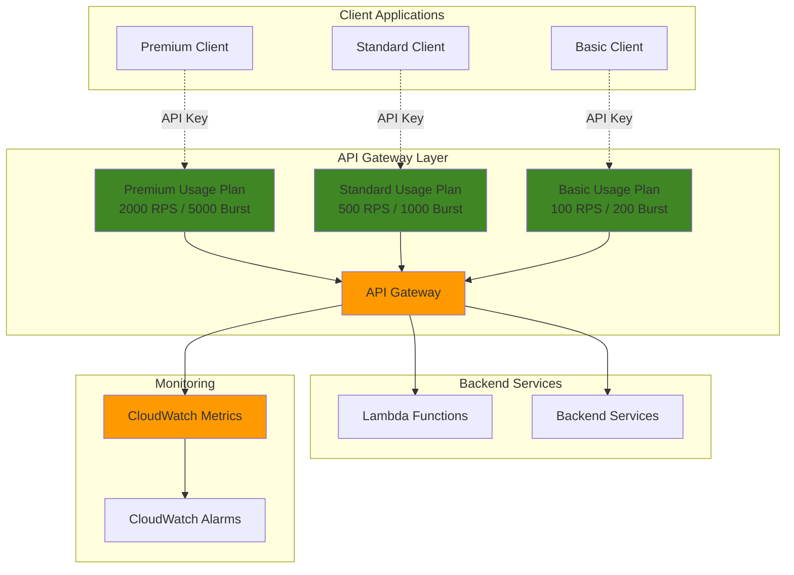

# API Throttling and Rate Limiting


## Problem

A growing SaaS platform is experiencing API abuse from clients making excessive requests, causing performance degradation for legitimate users. Some clients are consuming 10x more resources than others, leading to increased costs and potential service outages. The company needs to implement fair usage policies and protect their API endpoints from both intentional abuse and accidental traffic spikes while maintaining good performance for paying customers.

## Solution

Implement comprehensive API throttling and rate limiting using Amazon API Gateway's built-in capabilities, including usage plans, API keys, and multi-level throttling controls. This solution provides granular control over request rates at the account, API, stage, and method levels while enabling customer-specific quotas and monitoring through CloudWatch metrics.

## Architecture Diagram



## Prerequisites

1. AWS account with API Gateway, Lambda, and CloudWatch permissions
2. AWS CLI v2 installed and configured (or AWS CloudShell)
3. Basic understanding of REST APIs and rate limiting concepts
4. Existing API or willingness to create a sample API for testing
5. Estimated cost: $5-15/month for API Gateway requests, Lambda executions, and CloudWatch metrics

> **Note**: API Gateway charges $3.50 per million API calls plus data transfer costs. Usage plans and API keys are free features. For detailed pricing information, see the [API Gateway pricing documentation](https://docs.aws.amazon.com/apigateway/latest/developerguide/limits.html).

## Preparation

```bash
# Set environment variables
export AWS_REGION=$(aws configure get region)
export AWS_ACCOUNT_ID=$(aws sts get-caller-identity \
    --query Account --output text)

# Generate unique identifiers for resources
RANDOM_SUFFIX=$(aws secretsmanager get-random-password \
    --exclude-punctuation --exclude-uppercase \
    --password-length 6 --require-each-included-type \
    --output text --query RandomPassword)

export API_NAME="throttling-demo-${RANDOM_SUFFIX}"
export LAMBDA_FUNCTION_NAME="api-backend-${RANDOM_SUFFIX}"
export STAGE_NAME="prod"

# Create a simple Lambda function for testing
cat > lambda_function.py << 'EOF'
import json
import time
import os

def lambda_handler(event, context):
    # Simulate some processing time
    time.sleep(0.1)
    
    return {
        'statusCode': 200,
        'headers': {
            'Content-Type': 'application/json',
            'Access-Control-Allow-Origin': '*'
        },
        'body': json.dumps({
            'message': 'Hello from throttled API!',
            'timestamp': int(time.time()),
            'requestId': context.aws_request_id,
            'region': os.environ.get('AWS_REGION', 'unknown')
        })
    }
EOF

# Create deployment package
zip lambda_function.zip lambda_function.py

# Create IAM role for Lambda
aws iam create-role \
    --role-name lambda-execution-role-${RANDOM_SUFFIX} \
    --assume-role-policy-document '{
        "Version": "2012-10-17",
        "Statement": [
            {
                "Effect": "Allow",
                "Principal": {
                    "Service": "lambda.amazonaws.com"
                },
                "Action": "sts:AssumeRole"
            }
        ]
    }'

# Attach basic execution policy
aws iam attach-role-policy \
    --role-name lambda-execution-role-${RANDOM_SUFFIX} \
    --policy-arn arn:aws:iam::aws:policy/service-role/AWSLambdaBasicExecutionRole

# Wait for role to be available
sleep 10

echo "✅ Environment prepared with API name: ${API_NAME}"
```

## Steps

1. **Create the Lambda Backend Function**:

   AWS Lambda provides the serverless compute foundation for our API throttling demonstration. By creating a backend function, we establish a realistic API endpoint that can be protected with throttling controls. Lambda's automatic scaling and pay-per-request model makes it ideal for testing various load patterns while demonstrating how API Gateway throttling protects backend resources from overwhelming traffic spikes.

   ```bash
   # Create Lambda function
   aws lambda create-function \
       --function-name ${LAMBDA_FUNCTION_NAME} \
       --runtime python3.9 \
       --role arn:aws:iam::${AWS_ACCOUNT_ID}:role/lambda-execution-role-${RANDOM_SUFFIX} \
       --handler lambda_function.lambda_handler \
       --zip-file fileb://lambda_function.zip \
       --timeout 30 \
       --memory-size 128
   
   # Get Lambda function ARN
   LAMBDA_ARN=$(aws lambda get-function \
       --function-name ${LAMBDA_FUNCTION_NAME} \
       --query 'Configuration.FunctionArn' --output text)
   
   echo "✅ Lambda function created: ${LAMBDA_ARN}"
   ```

   The Lambda function is now deployed and ready to serve as our API backend. This establishes the protected resource that will benefit from API Gateway's throttling mechanisms, ensuring consistent performance regardless of client request patterns.

2. **Create the REST API with Basic Configuration**:

   Amazon API Gateway acts as the entry point and control layer for our application, providing essential throttling capabilities built into the service. Creating a REST API establishes the foundation for implementing multiple layers of rate limiting, from basic stage-level controls to sophisticated usage plan configurations. This architectural pattern separates client access management from backend logic, enabling centralized policy enforcement.

   ```bash
   # Create REST API
   API_ID=$(aws apigateway create-rest-api \
       --name ${API_NAME} \
       --description "Demo API for throttling and rate limiting" \
       --query 'id' --output text)
   
   # Get root resource ID
   ROOT_RESOURCE_ID=$(aws apigateway get-resources \
       --rest-api-id ${API_ID} \
       --query 'items[0].id' --output text)
   
   # Create resource for our endpoint
   RESOURCE_ID=$(aws apigateway create-resource \
       --rest-api-id ${API_ID} \
       --parent-id ${ROOT_RESOURCE_ID} \
       --path-part "data" \
       --query 'id' --output text)
   
   echo "✅ API created with ID: ${API_ID}"
   ```

   The REST API structure is now established with the foundational resource hierarchy. This creates the framework for applying throttling policies and associating different access levels with specific API paths.

3. **Configure API Method and Integration**:

   API methods define how clients interact with our backend services, while integrations specify how API Gateway communicates with Lambda. The `--api-key-required` flag is crucial for throttling implementation, as it enforces that all requests must include valid API keys associated with usage plans. This configuration enables granular access control and customer-specific rate limiting.

   ```bash
   # Create GET method
   aws apigateway put-method \
       --rest-api-id ${API_ID} \
       --resource-id ${RESOURCE_ID} \
       --http-method GET \
       --authorization-type NONE \
       --api-key-required
   
   # Create Lambda integration
   aws apigateway put-integration \
       --rest-api-id ${API_ID} \
       --resource-id ${RESOURCE_ID} \
       --http-method GET \
       --type AWS_PROXY \
       --integration-http-method POST \
       --uri arn:aws:apigateway:${AWS_REGION}:lambda:path/2015-03-31/functions/${LAMBDA_ARN}/invocations
   
   # Add Lambda permission for API Gateway
   aws lambda add-permission \
       --function-name ${LAMBDA_FUNCTION_NAME} \
       --statement-id api-gateway-invoke-${RANDOM_SUFFIX} \
       --action lambda:InvokeFunction \
       --principal apigateway.amazonaws.com \
       --source-arn arn:aws:apigateway:${AWS_REGION}::/restapis/${API_ID}/*/*
   
   echo "✅ API method and integration configured"
   ```

   The API method now requires authentication via API keys and is properly integrated with our Lambda backend. This establishes the security foundation necessary for implementing tiered access controls and usage-based throttling.

4. **Deploy the API to a Stage**:

   API Gateway stages represent different environments (development, staging, production) with independent configurations and throttling settings. Stage-level throttling provides the first layer of protection, establishing default rate limits that apply to all requests regardless of the client. This prevents any single source from overwhelming the entire API infrastructure.

   ```bash
   # Create deployment
   DEPLOYMENT_ID=$(aws apigateway create-deployment \
       --rest-api-id ${API_ID} \
       --stage-name ${STAGE_NAME} \
       --stage-description "Production stage with throttling" \
       --description "Initial deployment" \
       --query 'id' --output text)
   
   # Configure stage-level throttling (default limits)
   aws apigateway update-stage \
       --rest-api-id ${API_ID} \
       --stage-name ${STAGE_NAME} \
       --patch-operations \
           op=replace,path=/throttle/rateLimit,value=1000 \
           op=replace,path=/throttle/burstLimit,value=2000
   
   # Get API endpoint URL
   API_URL="https://${API_ID}.execute-api.${AWS_REGION}.amazonaws.com/${STAGE_NAME}/data"
   
   echo "✅ API deployed to stage: ${STAGE_NAME}"
   echo "API URL: ${API_URL}"
   ```

   The API is now publicly accessible through a secure HTTPS endpoint with basic throttling protection enabled. Stage-level limits act as a safety net, ensuring system stability while more granular usage plan controls provide customer-specific restrictions.

5. **Create Usage Plans with Different Throttling Tiers**:

   Usage plans are the core mechanism for implementing differentiated service levels in API Gateway. Each plan defines specific rate limits, burst capacities, and monthly quotas that align with business requirements and customer tiers. The token bucket algorithm allows for natural traffic bursts while maintaining steady-state limits, making these plans suitable for real-world usage patterns where traffic fluctuates throughout the day.

   ```bash
   # Create Premium Usage Plan
   PREMIUM_PLAN_ID=$(aws apigateway create-usage-plan \
       --name "Premium-Plan-${RANDOM_SUFFIX}" \
       --description "Premium tier with high limits" \
       --throttle rateLimit=2000,burstLimit=5000 \
       --quota limit=1000000,offset=0,period=MONTH \
       --query 'id' --output text)
   
   # Create Standard Usage Plan
   STANDARD_PLAN_ID=$(aws apigateway create-usage-plan \
       --name "Standard-Plan-${RANDOM_SUFFIX}" \
       --description "Standard tier with moderate limits" \
       --throttle rateLimit=500,burstLimit=1000 \
       --quota limit=100000,offset=0,period=MONTH \
       --query 'id' --output text)
   
   # Create Basic Usage Plan
   BASIC_PLAN_ID=$(aws apigateway create-usage-plan \
       --name "Basic-Plan-${RANDOM_SUFFIX}" \
       --description "Basic tier with low limits" \
       --throttle rateLimit=100,burstLimit=200 \
       --quota limit=10000,offset=0,period=MONTH \
       --query 'id' --output text)
   
   echo "✅ Usage plans created:"
   echo "Premium: ${PREMIUM_PLAN_ID}"
   echo "Standard: ${STANDARD_PLAN_ID}" 
   echo "Basic: ${BASIC_PLAN_ID}"
   ```

   Three distinct usage tiers are now established, each providing different levels of API access aligned with common SaaS pricing models. These plans enable monetization strategies while ensuring fair resource allocation across customer segments.

6. **Associate Usage Plans with API Stages**:

   Associating usage plans with API stages creates the binding between throttling policies and specific API endpoints. This step enables the enforcement of plan-specific limits on the deployed API, ensuring that different customer tiers receive appropriate levels of service based on their subscription or business agreement.

   ```bash
   # Associate Premium plan with API stage
   aws apigateway create-usage-plan-key \
       --usage-plan-id ${PREMIUM_PLAN_ID} \
       --key-type API_STAGE \
       --key-value ${API_ID}:${STAGE_NAME}
   
   # Associate Standard plan with API stage
   aws apigateway create-usage-plan-key \
       --usage-plan-id ${STANDARD_PLAN_ID} \
       --key-type API_STAGE \
       --key-value ${API_ID}:${STAGE_NAME}
   
   # Associate Basic plan with API stage
   aws apigateway create-usage-plan-key \
       --usage-plan-id ${BASIC_PLAN_ID} \
       --key-type API_STAGE \
       --key-value ${API_ID}:${STAGE_NAME}
   
   echo "✅ Usage plans associated with API stages"
   ```

   Usage plans are now active and ready to enforce throttling policies on API requests. This establishes the operational framework for customer-specific rate limiting and quota management.

7. **Create API Keys for Different Customer Tiers**:

   API keys serve as unique identifiers that link individual customers to their appropriate usage plans and throttling limits. Each key represents a distinct client application or customer account, enabling precise tracking of usage patterns and enforcement of tier-specific restrictions. This approach supports both technical API access control and business model implementation.

   ```bash
   # Create Premium API Key
   PREMIUM_KEY_ID=$(aws apigateway create-api-key \
       --name "premium-customer-${RANDOM_SUFFIX}" \
       --description "Premium tier customer API key" \
       --enabled \
       --query 'id' --output text)
   
   # Create Standard API Key
   STANDARD_KEY_ID=$(aws apigateway create-api-key \
       --name "standard-customer-${RANDOM_SUFFIX}" \
       --description "Standard tier customer API key" \
       --enabled \
       --query 'id' --output text)
   
   # Create Basic API Key
   BASIC_KEY_ID=$(aws apigateway create-api-key \
       --name "basic-customer-${RANDOM_SUFFIX}" \
       --description "Basic tier customer API key" \
       --enabled \
       --query 'id' --output text)
   
   echo "✅ API keys created:"
   echo "Premium: ${PREMIUM_KEY_ID}"
   echo "Standard: ${STANDARD_KEY_ID}"
   echo "Basic: ${BASIC_KEY_ID}"
   ```

   Customer-specific API keys are now created and ready for distribution. These keys enable individual client identification and ensure that each customer receives the appropriate level of service based on their subscription tier.

8. **Associate API Keys with Usage Plans**:

   Linking API keys to usage plans completes the access control configuration, establishing the direct relationship between customer identities and their allowed usage levels. This association enables API Gateway to automatically apply the correct throttling and quota limits based on the API key presented with each request.

   ```bash
   # Associate Premium key with Premium plan
   aws apigateway create-usage-plan-key \
       --usage-plan-id ${PREMIUM_PLAN_ID} \
       --key-type API_KEY \
       --key-value ${PREMIUM_KEY_ID}
   
   # Associate Standard key with Standard plan
   aws apigateway create-usage-plan-key \
       --usage-plan-id ${STANDARD_PLAN_ID} \
       --key-type API_KEY \
       --key-value ${STANDARD_KEY_ID}
   
   # Associate Basic key with Basic plan
   aws apigateway create-usage-plan-key \
       --usage-plan-id ${BASIC_PLAN_ID} \
       --key-type API_KEY \
       --key-value ${BASIC_KEY_ID}
   
   echo "✅ API keys associated with usage plans"
   ```

   The throttling system is now fully operational with customer-specific access controls in place. Each API key will enforce its associated usage plan limits, providing differentiated service levels based on business requirements.

9. **Get API Key Values for Testing**:

   Retrieving the actual API key values enables client applications to authenticate with the API and receive their tier-appropriate service levels. These values must be securely distributed to customers and included in the `X-API-Key` header for all API requests to ensure proper throttling enforcement.

   ```bash
   # Get actual API key values
   PREMIUM_KEY_VALUE=$(aws apigateway get-api-key \
       --api-key ${PREMIUM_KEY_ID} \
       --include-value \
       --query 'value' --output text)
   
   STANDARD_KEY_VALUE=$(aws apigateway get-api-key \
       --api-key ${STANDARD_KEY_ID} \
       --include-value \
       --query 'value' --output text)
   
   BASIC_KEY_VALUE=$(aws apigateway get-api-key \
       --api-key ${BASIC_KEY_ID} \
       --include-value \
       --query 'value' --output text)
   
   echo "✅ API key values retrieved"
   echo "Premium Key: ${PREMIUM_KEY_VALUE}"
   echo "Standard Key: ${STANDARD_KEY_VALUE}"
   echo "Basic Key: ${BASIC_KEY_VALUE}"
   ```

   API key values are now available for testing and client distribution. These credentials enable immediate testing of the throttling system and validation of tier-specific access controls.

10. **Configure CloudWatch Monitoring and Alarms**:

    CloudWatch monitoring provides essential visibility into API usage patterns, throttling events, and potential abuse scenarios. Setting up proactive alarms enables rapid response to unusual traffic patterns and helps optimize throttling settings based on real-world usage data. This observability is crucial for maintaining service quality and making informed decisions about capacity planning.

    ```bash
    # Create CloudWatch alarm for high throttling
    aws cloudwatch put-metric-alarm \
        --alarm-name "API-High-Throttling-${RANDOM_SUFFIX}" \
        --alarm-description "Alert when API throttling exceeds threshold" \
        --metric-name Count \
        --namespace AWS/ApiGateway \
        --statistic Sum \
        --period 300 \
        --threshold 100 \
        --comparison-operator GreaterThanThreshold \
        --evaluation-periods 2 \
        --dimensions Name=ApiName,Value=${API_NAME} Name=Stage,Value=${STAGE_NAME}
    
    # Create alarm for high error rate
    aws cloudwatch put-metric-alarm \
        --alarm-name "API-High-4xx-Errors-${RANDOM_SUFFIX}" \
        --alarm-description "Alert when 4xx errors exceed threshold" \
        --metric-name 4XXError \
        --namespace AWS/ApiGateway \
        --statistic Sum \
        --period 300 \
        --threshold 50 \
        --comparison-operator GreaterThanThreshold \
        --evaluation-periods 2 \
        --dimensions Name=ApiName,Value=${API_NAME} Name=Stage,Value=${STAGE_NAME}
    
    echo "✅ CloudWatch alarms configured"
    ```

    Monitoring and alerting systems are now in place to track API performance and throttling effectiveness. These alarms provide early warning of potential issues and support continuous optimization of throttling policies.

## Validation & Testing

1. **Test API without authentication (should fail)**:

   ```bash
   # Test without API key - should return 403
   curl -X GET ${API_URL}
   ```

   Expected output: `{"message":"Forbidden"}`

2. **Test with different API key tiers**:

   ```bash
   # Test with Premium key
   curl -X GET ${API_URL} \
       -H "X-API-Key: ${PREMIUM_KEY_VALUE}"
   
   # Test with Standard key
   curl -X GET ${API_URL} \
       -H "X-API-Key: ${STANDARD_KEY_VALUE}"
   
   # Test with Basic key
   curl -X GET ${API_URL} \
       -H "X-API-Key: ${BASIC_KEY_VALUE}"
   ```

   Expected output: JSON response with message, timestamp, and requestId

3. **Test rate limiting with load simulation**:

   ```bash
   # Install Apache Bench if not available
   # sudo apt-get install apache2-utils (Ubuntu/Debian)
   # brew install apache-bench (macOS)
   
   # Test Basic tier rate limiting (should throttle after 100 RPS)
   ab -n 1000 -c 10 -H "X-API-Key: ${BASIC_KEY_VALUE}" ${API_URL}
   
   # Test Premium tier (should handle higher load)
   ab -n 1000 -c 50 -H "X-API-Key: ${PREMIUM_KEY_VALUE}" ${API_URL}
   ```

   Expected: Basic tier should show throttling (429 errors), Premium tier should handle load better

4. **Check CloudWatch metrics**:

   ```bash
   # View API Gateway metrics
   aws cloudwatch get-metric-statistics \
       --namespace AWS/ApiGateway \
       --metric-name Count \
       --dimensions Name=ApiName,Value=${API_NAME} Name=Stage,Value=${STAGE_NAME} \
       --statistics Sum \
       --start-time $(date -u -d '1 hour ago' +%Y-%m-%dT%H:%M:%S) \
       --end-time $(date -u +%Y-%m-%dT%H:%M:%S) \
       --period 300
   
   # Check throttling metrics
   aws cloudwatch get-metric-statistics \
       --namespace AWS/ApiGateway \
       --metric-name ThrottleCount \
       --dimensions Name=ApiName,Value=${API_NAME} Name=Stage,Value=${STAGE_NAME} \
       --statistics Sum \
       --start-time $(date -u -d '1 hour ago' +%Y-%m-%dT%H:%M:%S) \
       --end-time $(date -u +%Y-%m-%dT%H:%M:%S) \
       --period 300
   ```

## Cleanup

1. **Delete CloudWatch alarms**:

   ```bash
   # Delete CloudWatch alarms
   aws cloudwatch delete-alarms \
       --alarm-names "API-High-Throttling-${RANDOM_SUFFIX}" \
                    "API-High-4xx-Errors-${RANDOM_SUFFIX}"
   
   echo "✅ CloudWatch alarms deleted"
   ```

2. **Remove usage plan associations and delete plans**:

   ```bash
   # Delete usage plans (this also removes associations)
   aws apigateway delete-usage-plan --usage-plan-id ${PREMIUM_PLAN_ID}
   aws apigateway delete-usage-plan --usage-plan-id ${STANDARD_PLAN_ID}
   aws apigateway delete-usage-plan --usage-plan-id ${BASIC_PLAN_ID}
   
   echo "✅ Usage plans deleted"
   ```

3. **Delete API keys**:

   ```bash
   # Delete API keys
   aws apigateway delete-api-key --api-key ${PREMIUM_KEY_ID}
   aws apigateway delete-api-key --api-key ${STANDARD_KEY_ID}
   aws apigateway delete-api-key --api-key ${BASIC_KEY_ID}
   
   echo "✅ API keys deleted"
   ```

4. **Delete API Gateway resources**:

   ```bash
   # Delete the entire REST API
   aws apigateway delete-rest-api --rest-api-id ${API_ID}
   
   echo "✅ API Gateway deleted"
   ```

5. **Delete Lambda function and IAM role**:

   ```bash
   # Delete Lambda function
   aws lambda delete-function --function-name ${LAMBDA_FUNCTION_NAME}
   
   # Detach policy from IAM role
   aws iam detach-role-policy \
       --role-name lambda-execution-role-${RANDOM_SUFFIX} \
       --policy-arn arn:aws:iam::aws:policy/service-role/AWSLambdaBasicExecutionRole
   
   # Delete IAM role
   aws iam delete-role --role-name lambda-execution-role-${RANDOM_SUFFIX}
   
   # Clean up local files
   rm -f lambda_function.py lambda_function.zip
   
   echo "✅ Lambda function and IAM role deleted"
   ```

## Discussion

This implementation demonstrates a comprehensive approach to API throttling and rate limiting using Amazon API Gateway's native capabilities. The solution provides multiple layers of protection: account-level throttling prevents system overload, stage-level throttling controls API-wide limits, and usage plans with API keys enable customer-specific quotas and rate limits.

The token bucket algorithm used by API Gateway allows for burst traffic while maintaining steady-state limits, making it suitable for real-world usage patterns where traffic naturally fluctuates. The three-tier structure (Basic, Standard, Premium) provides a foundation for monetizing API access while ensuring fair usage policies.

Usage plans serve as the primary mechanism for implementing differentiated service levels. By associating API keys with specific usage plans, you can provide different customers with varying levels of access based on their subscription tier or business requirements. This approach is commonly used in SaaS platforms to implement freemium models or tiered pricing structures. For detailed guidance on implementing and managing usage plans, see the [API Gateway usage plans documentation](https://docs.aws.amazon.com/apigateway/latest/developerguide/api-gateway-api-usage-plans.html).

> **Warning**: Usage plan quotas and throttling are applied on a best-effort basis and should not be relied upon for absolute rate limiting. Consider implementing additional controls using [AWS WAF rate limiting rules](https://docs.aws.amazon.com/waf/latest/developerguide/waf-rule-statement-type-rate-based-request-limiting.html) for stricter enforcement.

> **Tip**: Monitor your API usage patterns through CloudWatch metrics to optimize throttling settings and identify opportunities for capacity planning. For comprehensive usage analytics, refer to the [API Gateway usage plans documentation](https://docs.aws.amazon.com/apigateway/latest/developerguide/api-gateway-api-usage-plans.html).

CloudWatch integration provides essential monitoring capabilities, allowing you to track API usage patterns, identify potential abuse, and set up proactive alerts. The metrics help optimize throttling settings based on actual usage patterns and can inform business decisions about pricing and capacity planning.

For production deployments, consider implementing additional security measures such as [AWS WAF rate limiting rules](https://docs.aws.amazon.com/waf/latest/developerguide/waf-rule-statement-type-rate-based-request-limiting.html), custom authorizers, and integration with identity providers like Amazon Cognito. These layers provide defense-in-depth protection against sophisticated attacks and unauthorized access attempts. Additional security controls can be found in the [API Gateway access control documentation](https://docs.aws.amazon.com/apigateway/latest/developerguide/apigateway-control-access-to-api.html).

## Challenge

Extend this solution by implementing these enhancements:

1. **Custom Authorizer Integration**: Create a Lambda authorizer that validates JWT tokens and dynamically assigns usage plans based on token claims, enabling real-time tier adjustments.

2. **Geographic Rate Limiting**: Implement AWS WAF rules that apply different rate limits based on client geography, with stricter limits for regions with higher abuse rates.

3. **Adaptive Throttling**: Build a Lambda function that monitors CloudWatch metrics and automatically adjusts throttling limits based on backend performance and error rates.

4. **Usage Analytics Dashboard**: Create a custom dashboard using QuickSight that visualizes API usage patterns, throttling events, and customer tier utilization across different time periods.

5. **Multi-API Governance**: Extend the solution to manage throttling across multiple APIs using AWS Config rules and AWS Systems Manager Parameter Store for centralized configuration management.

## Infrastructure Code

*Infrastructure code will be generated after recipe approval.*