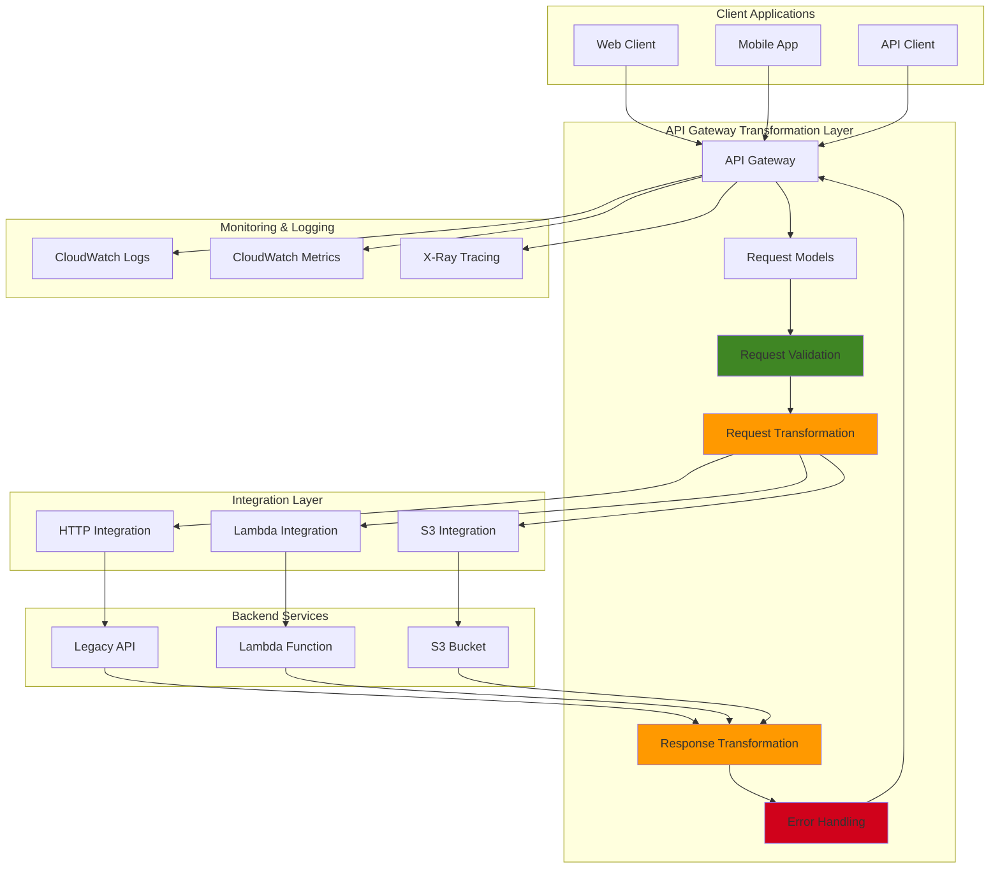

# Transforming API Requests with VTL Templates

## Problem

Enterprise APIs often need to interface with legacy systems or provide standardized responses that differ from backend service formats. Organizations face challenges when backend services return data in proprietary formats, require specific request structures, or need transformation logic applied before processing. Manual transformation in application code creates tight coupling, increases maintenance overhead, and reduces API flexibility for different client requirements.

## Solution

Implement comprehensive request/response transformation using API Gateway's Velocity Template Language (VTL) mapping templates, custom models for validation, and integration patterns. This solution provides declarative data transformation, input validation, error handling, and response formatting without requiring changes to backend services or client applications.

## Architecture Diagram



## Prerequisites

1. AWS account with API Gateway, Lambda, S3, and CloudWatch permissions
2. AWS CLI v2 installed and configured (or AWS CloudShell)
3. Understanding of JSON Schema, VTL syntax, and REST API principles
4. Knowledge of API Gateway integration patterns and Lambda functions
5. Estimated cost: $5-15 for testing (includes API Gateway calls, Lambda executions, S3 operations)

> **Note**: This recipe demonstrates advanced API Gateway features including custom models, mapping templates, and multiple integration types which showcase enterprise transformation patterns.

## Preparation

```bash
# Set environment variables
export AWS_REGION=$(aws configure get region)
export AWS_ACCOUNT_ID=$(aws sts get-caller-identity \
    --query Account --output text)

# Generate unique identifiers
RANDOM_SUFFIX=$(aws secretsmanager get-random-password \
    --exclude-punctuation --exclude-uppercase \
    --password-length 6 --require-each-included-type \
    --output text --query RandomPassword)

export API_NAME="transformation-api-${RANDOM_SUFFIX}"
export FUNCTION_NAME="data-processor-${RANDOM_SUFFIX}"
export BUCKET_NAME="api-data-store-${RANDOM_SUFFIX}"

# Create S3 bucket for data operations
aws s3 mb s3://${BUCKET_NAME} --region ${AWS_REGION}

# Create IAM role for Lambda
aws iam create-role \
    --role-name transformation-lambda-role-${RANDOM_SUFFIX} \
    --assume-role-policy-document '{
        "Version": "2012-10-17",
        "Statement": [
            {
                "Effect": "Allow",
                "Principal": {
                    "Service": "lambda.amazonaws.com"
                },
                "Action": "sts:AssumeRole"
            }
        ]
    }'

# Attach policies to Lambda role
aws iam attach-role-policy \
    --role-name transformation-lambda-role-${RANDOM_SUFFIX} \
    --policy-arn arn:aws:iam::aws:policy/service-role/AWSLambdaBasicExecutionRole

aws iam attach-role-policy \
    --role-name transformation-lambda-role-${RANDOM_SUFFIX} \
    --policy-arn arn:aws:iam::aws:policy/AmazonS3FullAccess

# Wait for role propagation
sleep 10

export LAMBDA_ROLE_ARN="arn:aws:iam::${AWS_ACCOUNT_ID}:role/transformation-lambda-role-${RANDOM_SUFFIX}"

echo "✅ Environment prepared with bucket: ${BUCKET_NAME}"
```

## Steps

1. **Create Backend Lambda Function for Data Processing**:

   Lambda functions serve as the processing layer that receives transformed requests from API Gateway. This function demonstrates how transformed data can be processed in a serverless environment, providing scalable compute resources that automatically adjust to request volume. By creating a purpose-built backend that expects the transformed data format, we establish clear separation between API contracts and business logic implementation.

   ```bash
   # Create Lambda function that processes transformed requests
   cat > data-processor.py << 'EOF'
   import json
   import boto3
   import uuid
   from datetime import datetime
   
   s3 = boto3.client('s3')
   
   def lambda_handler(event, context):
       try:
           # Log the transformed request for debugging
           print(f"Received event: {json.dumps(event)}")
           
           # Simulate processing based on event structure
           if 'user_data' in event:
               # Process user data from transformed request
               response_data = {
                   'id': str(uuid.uuid4()),
                   'processed_at': datetime.utcnow().isoformat(),
                   'user_id': event['user_data'].get('id'),
                   'full_name': f"{event['user_data'].get('first_name', '')} {event['user_data'].get('last_name', '')}".strip(),
                   'profile': {
                       'email': event['user_data'].get('email'),
                       'phone': event['user_data'].get('phone'),
                       'preferences': event['user_data'].get('preferences', {})
                   },
                   'status': 'processed',
                   'metadata': {
                       'source': 'api_gateway_transformation',
                       'version': '2.0'
                   }
               }
           else:
               # Handle generic data processing
               response_data = {
                   'id': str(uuid.uuid4()),
                   'processed_at': datetime.utcnow().isoformat(),
                   'input_data': event,
                   'status': 'processed',
                   'transformation_applied': True
               }
           
           return {
               'statusCode': 200,
               'body': response_data
           }
           
       except Exception as e:
           print(f"Error processing request: {str(e)}")
           return {
               'statusCode': 500,
               'body': {
                   'error': 'Internal processing error',
                   'message': str(e),
                   'request_id': context.aws_request_id
               }
           }
   EOF
   
   # Package and deploy Lambda function
   zip data-processor.zip data-processor.py
   aws lambda create-function \
       --function-name ${FUNCTION_NAME} \
       --runtime python3.12 \
       --role ${LAMBDA_ROLE_ARN} \
       --handler data-processor.lambda_handler \
       --zip-file fileb://data-processor.zip \
       --description "Data processor with transformation support" \
       --timeout 30 \
       --memory-size 256
   
   export LAMBDA_ARN=$(aws lambda get-function \
       --function-name ${FUNCTION_NAME} \
       --query Configuration.FunctionArn --output text)
   
   echo "✅ Created data processor Lambda function"
   ```

   The Lambda function is now deployed and ready to receive transformed requests from API Gateway. This serverless backend can process the standardized data format produced by our VTL transformations, demonstrating how transformation layers enable backend services to work with consistent, predictable data structures regardless of client input variations.

2. **Create API Gateway with Custom Models**:

   JSON Schema models in API Gateway provide powerful request validation capabilities that catch invalid data before it reaches backend services. These models define the exact structure, data types, formats, and constraints that incoming requests must satisfy. This approach implements "fail-fast" validation, reducing backend processing costs and improving API reliability by preventing malformed data from entering the system.

   ```bash
   # Create REST API
   export API_ID=$(aws apigateway create-rest-api \
       --name ${API_NAME} \
       --description "API with advanced request/response transformation" \
       --query id --output text)
   
   # Create comprehensive request model
   aws apigateway create-model \
       --rest-api-id ${API_ID} \
       --name UserCreateRequest \
       --content-type application/json \
       --schema '{
           "$schema": "http://json-schema.org/draft-04/schema#",
           "title": "User Creation Request",
           "type": "object",
           "required": ["firstName", "lastName", "email"],
           "properties": {
               "firstName": {
                   "type": "string",
                   "minLength": 1,
                   "maxLength": 50,
                   "pattern": "^[a-zA-Z\\s]+$"
               },
               "lastName": {
                   "type": "string",
                   "minLength": 1,
                   "maxLength": 50,
                   "pattern": "^[a-zA-Z\\s]+$"
               },
               "email": {
                   "type": "string",
                   "format": "email",
                   "maxLength": 100
               },
               "phoneNumber": {
                   "type": "string",
                   "pattern": "^\\+?[1-9]\\d{1,14}$"
               },
               "preferences": {
                   "type": "object",
                   "properties": {
                       "notifications": {"type": "boolean"},
                       "theme": {"type": "string", "enum": ["light", "dark"]},
                       "language": {"type": "string", "pattern": "^[a-z]{2}$"}
                   }
               },
               "metadata": {
                   "type": "object",
                   "additionalProperties": true
               }
           },
           "additionalProperties": false
       }'
   
   # Create response model
   aws apigateway create-model \
       --rest-api-id ${API_ID} \
       --name UserResponse \
       --content-type application/json \
       --schema '{
           "$schema": "http://json-schema.org/draft-04/schema#",
           "title": "User Response",
           "type": "object",
           "properties": {
               "success": {"type": "boolean"},
               "data": {
                   "type": "object",
                   "properties": {
                       "userId": {"type": "string"},
                       "displayName": {"type": "string"},
                       "contactInfo": {
                           "type": "object",
                           "properties": {
                               "email": {"type": "string"},
                               "phone": {"type": "string"}
                           }
                       },
                       "createdAt": {"type": "string"},
                       "profileComplete": {"type": "boolean"}
                   }
               },
               "links": {
                   "type": "object",
                   "properties": {
                       "self": {"type": "string"},
                       "profile": {"type": "string"}
                   }
               }
           }
       }'
   
   # Create error response model
   aws apigateway create-model \
       --rest-api-id ${API_ID} \
       --name ErrorResponse \
       --content-type application/json \
       --schema '{
           "$schema": "http://json-schema.org/draft-04/schema#",
           "title": "Error Response",
           "type": "object",
           "required": ["error", "message"],
           "properties": {
               "error": {"type": "string"},
               "message": {"type": "string"},
               "details": {
                   "type": "array",
                   "items": {
                       "type": "object",
                       "properties": {
                           "field": {"type": "string"},
                           "code": {"type": "string"},
                           "message": {"type": "string"}
                       }
                   }
               },
               "timestamp": {"type": "string"},
               "path": {"type": "string"}
           }
       }'
   
   echo "✅ Created API Gateway with custom models"
   ```

   The API Gateway now has comprehensive data models that enforce strict validation rules on incoming requests and outgoing responses. These models serve as contracts that define exactly what data formats are acceptable, enabling early error detection and providing clear documentation for API consumers about expected request structures and response formats.

3. **Create Resources and Request Validator**:

   API Gateway request validators work in conjunction with JSON Schema models to provide comprehensive input validation. The validator examines both request body content and query parameters against defined schemas before any transformation or processing occurs. This validation layer is crucial for security, data integrity, and reducing backend processing overhead by rejecting invalid requests immediately.

   ```bash
   # Get root resource ID
   export ROOT_RESOURCE_ID=$(aws apigateway get-resources \
       --rest-api-id ${API_ID} \
       --query 'items[?path==`/`].id' --output text)
   
   # Create /users resource
   export USERS_RESOURCE_ID=$(aws apigateway create-resource \
       --rest-api-id ${API_ID} \
       --parent-id ${ROOT_RESOURCE_ID} \
       --path-part users \
       --query id --output text)
   
   # Create request validator
   export VALIDATOR_ID=$(aws apigateway create-request-validator \
       --rest-api-id ${API_ID} \
       --name comprehensive-validator \
       --validate-request-body true \
       --validate-request-parameters true \
       --query id --output text)
   
   echo "✅ Created resources and request validator"
   ```

   The request validator is now configured to enforce our data quality standards automatically. This validation layer operates before any transformations are applied, ensuring that only properly formatted requests proceed through the transformation pipeline. This reduces the complexity of transformation templates by allowing them to assume valid input data.

4. **Create POST Method with Advanced Request Transformation**:

   VTL (Velocity Template Language) mapping templates provide powerful declarative transformation capabilities without requiring custom Lambda functions or additional infrastructure. These templates can restructure JSON data, rename fields, apply conditional logic, perform type conversions, and inject contextual information from the API Gateway request context. This approach enables complex data transformations while maintaining high performance and low latency.

   ```bash
   # Create POST method with validation
   aws apigateway put-method \
       --rest-api-id ${API_ID} \
       --resource-id ${USERS_RESOURCE_ID} \
       --http-method POST \
       --authorization-type NONE \
       --request-validator-id ${VALIDATOR_ID} \
       --request-models application/json=UserCreateRequest
   
   # Create comprehensive request mapping template
   cat > request_template.vtl << 'EOF'
   #set($inputRoot = $input.path('$'))
   #set($context = $context)
   #set($util = $util)
   
   ## Transform incoming request to backend format
   {
       "user_data": {
           "id": "$util.escapeJavaScript($context.requestId)",
           "first_name": "$util.escapeJavaScript($inputRoot.firstName)",
           "last_name": "$util.escapeJavaScript($inputRoot.lastName)",
           "email": "$util.escapeJavaScript($inputRoot.email.toLowerCase())",
           #if($inputRoot.phoneNumber && $inputRoot.phoneNumber != "")
           "phone": "$util.escapeJavaScript($inputRoot.phoneNumber)",
           #end
           #if($inputRoot.preferences)
           "preferences": {
               #if($inputRoot.preferences.notifications)
               "email_notifications": $inputRoot.preferences.notifications,
               #end
               #if($inputRoot.preferences.theme)
               "ui_theme": "$util.escapeJavaScript($inputRoot.preferences.theme)",
               #end
               #if($inputRoot.preferences.language)
               "locale": "$util.escapeJavaScript($inputRoot.preferences.language)",
               #end
               "auto_save": true
           },
           #end
           "source": "api_gateway",
           "created_via": "rest_api"
       },
       "request_context": {
           "request_id": "$context.requestId",
           "api_id": "$context.apiId",
           "stage": "$context.stage",
           "resource_path": "$context.resourcePath",
           "http_method": "$context.httpMethod",
           "source_ip": "$context.identity.sourceIp",
           "user_agent": "$util.escapeJavaScript($context.identity.userAgent)",
           "request_time": "$context.requestTime",
           "request_time_epoch": $context.requestTimeEpoch
       },
       #if($inputRoot.metadata)
       "additional_metadata": $input.json('$.metadata'),
       #end
       "processing_flags": {
           "validate_email": true,
           "send_welcome": true,
           "create_profile": true
       }
   }
   EOF
   
   # Create Lambda integration with request transformation
   aws apigateway put-integration \
       --rest-api-id ${API_ID} \
       --resource-id ${USERS_RESOURCE_ID} \
       --http-method POST \
       --type AWS \
       --integration-http-method POST \
       --uri "arn:aws:apigateway:${AWS_REGION}:lambda:path/2015-03-31/functions/${LAMBDA_ARN}/invocations" \
       --passthrough-behavior NEVER \
       --request-templates application/json="$(cat request_template.vtl)"
   
   echo "✅ Created POST method with advanced request transformation"
   ```

   The POST method now includes sophisticated request transformation logic that converts client-friendly field names to backend-expected formats, injects request context metadata, and applies conditional transformations based on input data presence. This transformation layer decouples client API design from backend service requirements, enabling independent evolution of both layers while maintaining compatibility.

5. **Configure Response Transformation and Error Handling**:

   Response transformation templates standardize API output formats regardless of backend service variations. These templates implement consistent response structures, add metadata and hypermedia links (HATEOAS), and transform backend-specific error formats into standardized API error responses. This approach ensures that client applications receive predictable response formats while enabling backend services to use their preferred data structures.

   ```bash
   # Create comprehensive response mapping template
   cat > response_template.vtl << 'EOF'
   #set($inputRoot = $input.path('$'))
   #set($context = $context)
   
   ## Transform backend response to standardized API format
   {
       "success": true,
       "data": {
           "userId": "$util.escapeJavaScript($inputRoot.id)",
           "displayName": "$util.escapeJavaScript($inputRoot.full_name)",
           "contactInfo": {
               #if($inputRoot.profile.email)
               "email": "$util.escapeJavaScript($inputRoot.profile.email)",
               #end
               #if($inputRoot.profile.phone)
               "phone": "$util.escapeJavaScript($inputRoot.profile.phone)"
               #end
           },
           "createdAt": "$util.escapeJavaScript($inputRoot.processed_at)",
           "profileComplete": #if($inputRoot.profile.email && $inputRoot.full_name != "")true#{else}false#end,
           "preferences": #if($inputRoot.profile.preferences)$input.json('$.profile.preferences')#{else}{}#end
       },
       "metadata": {
           "processingId": "$util.escapeJavaScript($inputRoot.id)",
           "version": #if($inputRoot.metadata.version)"$util.escapeJavaScript($inputRoot.metadata.version)"#{else}"1.0"#end,
           "processedAt": "$util.escapeJavaScript($inputRoot.processed_at)"
       },
       "links": {
           "self": "https://$context.domainName/$context.stage/users/$util.escapeJavaScript($inputRoot.id)",
           "profile": "https://$context.domainName/$context.stage/users/$util.escapeJavaScript($inputRoot.id)/profile"
       }
   }
   EOF
   
   # Create error response template
   cat > error_template.vtl << 'EOF'
   #set($inputRoot = $input.path('$.errorMessage'))
   #set($context = $context)
   
   {
       "error": "PROCESSING_ERROR",
       "message": #if($inputRoot)"$util.escapeJavaScript($inputRoot)"#{else}"An error occurred while processing your request"#end,
       "details": [
           {
               "field": "request",
               "code": "LAMBDA_EXECUTION_ERROR",
               "message": "Backend service encountered an error"
           }
       ],
       "timestamp": "$context.requestTime",
       "path": "$context.resourcePath",
       "requestId": "$context.requestId"
   }
   EOF
   
   # Configure method response for 200
   aws apigateway put-method-response \
       --rest-api-id ${API_ID} \
       --resource-id ${USERS_RESOURCE_ID} \
       --http-method POST \
       --status-code 200 \
       --response-models application/json=UserResponse
   
   # Configure method response for 400 (validation errors)
   aws apigateway put-method-response \
       --rest-api-id ${API_ID} \
       --resource-id ${USERS_RESOURCE_ID} \
       --http-method POST \
       --status-code 400 \
       --response-models application/json=ErrorResponse
   
   # Configure method response for 500 (processing errors)
   aws apigateway put-method-response \
       --rest-api-id ${API_ID} \
       --resource-id ${USERS_RESOURCE_ID} \
       --http-method POST \
       --status-code 500 \
       --response-models application/json=ErrorResponse
   
   # Configure integration response for 200
   aws apigateway put-integration-response \
       --rest-api-id ${API_ID} \
       --resource-id ${USERS_RESOURCE_ID} \
       --http-method POST \
       --status-code 200 \
       --response-templates application/json="$(cat response_template.vtl)"
   
   # Configure integration response for Lambda errors (500)
   aws apigateway put-integration-response \
       --rest-api-id ${API_ID} \
       --resource-id ${USERS_RESOURCE_ID} \
       --http-method POST \
       --status-code 500 \
       --selection-pattern '.*"statusCode": 500.*' \
       --response-templates application/json="$(cat error_template.vtl)"
   
   echo "✅ Configured response transformation and error handling"
   ```

   Response transformation is now configured to provide consistent, client-friendly output formats with standardized success and error structures. The transformation layer adds essential metadata, constructs hypermedia links for RESTful navigation, and ensures that all API responses follow established patterns regardless of backend service implementation details.

6. **Create GET Method with Query Parameter Transformation**:

   Query parameter transformation demonstrates how VTL templates can process and restructure URL parameters into complex backend request formats. This capability enables RESTful API design patterns while supporting backend services that expect structured query objects with pagination, filtering, and sorting parameters. The transformation layer converts simple query strings into rich, structured requests that backend services can process efficiently.

   ```bash
   # Create GET method for data retrieval with query parameters
   aws apigateway put-method \
       --rest-api-id ${API_ID} \
       --resource-id ${USERS_RESOURCE_ID} \
       --http-method GET \
       --authorization-type NONE \
       --request-parameters \
           method.request.querystring.limit=false \
           method.request.querystring.offset=false \
           method.request.querystring.filter=false \
           method.request.querystring.sort=false
   
   # Create query parameter transformation template
   cat > get_request_template.vtl << 'EOF'
   {
       "operation": "list_users",
       "pagination": {
           "limit": #if($input.params('limit'))$input.params('limit')#{else}10#end,
           "offset": #if($input.params('offset'))$input.params('offset')#{else}0#end
       },
       #if($input.params('filter'))
       "filters": {
           #set($filterParam = $input.params('filter'))
           #if($filterParam.contains(':'))
               #set($filterParts = $filterParam.split(':'))
               "$util.escapeJavaScript($filterParts[0])": "$util.escapeJavaScript($filterParts[1])"
           #else
               "search": "$util.escapeJavaScript($filterParam)"
           #end
       },
       #end
       #if($input.params('sort'))
       "sorting": {
           #set($sortParam = $input.params('sort'))
           #if($sortParam.startsWith('-'))
               "field": "$util.escapeJavaScript($sortParam.substring(1))",
               "direction": "desc"
           #else
               "field": "$util.escapeJavaScript($sortParam)",
               "direction": "asc"
           #end
       },
       #end
       "request_context": {
           "request_id": "$context.requestId",
           "source_ip": "$context.identity.sourceIp",
           "user_agent": "$util.escapeJavaScript($context.identity.userAgent)"
       }
   }
   EOF
   
   # Create Lambda integration for GET method (using same Lambda function)
   aws apigateway put-integration \
       --rest-api-id ${API_ID} \
       --resource-id ${USERS_RESOURCE_ID} \
       --http-method GET \
       --type AWS \
       --integration-http-method POST \
       --uri "arn:aws:apigateway:${AWS_REGION}:lambda:path/2015-03-31/functions/${LAMBDA_ARN}/invocations" \
       --request-templates application/json="$(cat get_request_template.vtl)"
   
   echo "✅ Created GET method with query parameter transformation"
   ```

   The GET method now transforms query parameters into structured backend requests with proper pagination, filtering, and sorting capabilities. This transformation enables intuitive client-side API usage while providing backend services with well-structured query objects that include default values, parameter validation, and contextual metadata for processing optimization.

7. **Grant API Gateway Permissions and Deploy**:

   API deployment makes the configured transformations available for testing and production use. The deployment process creates an immutable snapshot of the API configuration, enabling version control and rollback capabilities. CloudWatch logging integration provides detailed visibility into transformation execution, request/response flows, and performance metrics essential for troubleshooting and optimization.

   ```bash
   # Grant API Gateway permission to invoke Lambda
   aws lambda add-permission \
       --function-name ${FUNCTION_NAME} \
       --statement-id api-gateway-transform-${RANDOM_SUFFIX} \
       --action lambda:InvokeFunction \
       --principal apigateway.amazonaws.com \
       --source-arn "arn:aws:execute-api:${AWS_REGION}:${AWS_ACCOUNT_ID}:${API_ID}/*/*"
   
   # Deploy API to staging for testing
   export DEPLOYMENT_ID=$(aws apigateway create-deployment \
       --rest-api-id ${API_ID} \
       --stage-name staging \
       --stage-description "Staging environment for transformation testing" \
       --description "Initial deployment with VTL transformations" \
       --query id --output text)
   
   # Enable detailed CloudWatch logging
   aws apigateway update-stage \
       --rest-api-id ${API_ID} \
       --stage-name staging \
       --patch-operations \
           'op=replace,path=/*/*/logging/loglevel,value=INFO' \
           'op=replace,path=/*/*/logging/dataTrace,value=true' \
           'op=replace,path=/*/*/metricsEnabled,value=true'
   
   export API_ENDPOINT="https://${API_ID}.execute-api.${AWS_REGION}.amazonaws.com/staging"
   
   echo "✅ Deployed API with transformations"
   echo "✅ API Endpoint: ${API_ENDPOINT}"
   ```

   The API is now live and operational with comprehensive transformation capabilities. CloudWatch logging is enabled to provide detailed insights into transformation execution, including request/response payloads, VTL template processing details, and performance metrics. This monitoring capability is essential for debugging complex transformations and optimizing API performance.

8. **Create Advanced Gateway Responses for Validation Errors**:

   Custom gateway responses provide sophisticated error handling for common API Gateway scenarios like validation failures and authentication errors. These response templates transform technical error messages into user-friendly formats while preserving debugging information for developers. This approach ensures consistent error response formats across all API operations and error conditions.

   ```bash
   # Create custom gateway response for validation failures
   cat > validation_error_template.vtl << 'EOF'
   {
       "error": "VALIDATION_ERROR",
       "message": "Request validation failed",
       "details": [
           #foreach($error in $context.error.validationErrorString.split(','))
           {
               "field": #if($error.contains('Invalid request body'))"body"#{elseif($error.contains('required'))$error.split("'")[1]#{else}"unknown"#end,
               "code": "VALIDATION_FAILED",
               "message": "$util.escapeJavaScript($error.trim())"
           }#if($foreach.hasNext),#end
           #end
       ],
       "timestamp": "$context.requestTime",
       "path": "$context.resourcePath",
       "requestId": "$context.requestId"
   }
   EOF
   
   # Configure gateway response for bad request body
   aws apigateway put-gateway-response \
       --rest-api-id ${API_ID} \
       --response-type BAD_REQUEST_BODY \
       --status-code 400 \
       --response-templates application/json="$(cat validation_error_template.vtl)"
   
   # Configure gateway response for missing authentication
   aws apigateway put-gateway-response \
       --rest-api-id ${API_ID} \
       --response-type UNAUTHORIZED \
       --status-code 401 \
       --response-templates application/json='{
           "error": "UNAUTHORIZED",
           "message": "Authentication required",
           "timestamp": "$context.requestTime",
           "path": "$context.resourcePath"
       }'
   
   echo "✅ Configured custom gateway responses for error handling"
   ```

   Custom gateway responses now provide consistent, informative error handling for validation failures and authentication issues. These standardized error responses help client applications handle different error conditions appropriately while providing developers with detailed debugging information to identify and resolve issues quickly.

## Validation & Testing

1. **Test Request Transformation with Valid Data**:

   ```bash
   # Test POST with valid user data
   echo "Testing request transformation with valid data..."
   curl -X POST "${API_ENDPOINT}/users" \
       -H "Content-Type: application/json" \
       -d '{
           "firstName": "John",
           "lastName": "Doe",
           "email": "john.doe@example.com",
           "phoneNumber": "+1234567890",
           "preferences": {
               "notifications": true,
               "theme": "dark",
               "language": "en"
           },
           "metadata": {
               "source": "web_app",
               "campaign": "spring_2024"
           }
       }' | jq '.'
   ```

   Expected output: Transformed response with standardized format including success flag, user data, and HATEOAS links.

2. **Test Request Validation with Invalid Data**:

   ```bash
   # Test with invalid email format
   echo "Testing request validation with invalid email..."
   curl -X POST "${API_ENDPOINT}/users" \
       -H "Content-Type: application/json" \
       -d '{
           "firstName": "Jane",
           "lastName": "Smith",
           "email": "invalid-email",
           "phoneNumber": "+1234567890"
       }' | jq '.'
   ```

   Expected output: 400 error with detailed validation messages showing which fields failed validation.

3. **Test Missing Required Fields**:

   ```bash
   # Test with missing required field
   echo "Testing with missing required field..."
   curl -X POST "${API_ENDPOINT}/users" \
       -H "Content-Type: application/json" \
       -d '{
           "firstName": "Bob",
           "email": "bob@example.com"
       }' | jq '.'
   ```

   Expected output: 400 error indicating missing required field (lastName).

4. **Test Query Parameter Transformation**:

   ```bash
   # Test GET with query parameters
   echo "Testing query parameter transformation..."
   curl -G "${API_ENDPOINT}/users" \
       -d "limit=5" \
       -d "offset=10" \
       -d "filter=email:example.com" \
       -d "sort=-createdAt" | jq '.'
   ```

   Expected output: Response showing how query parameters were transformed into backend request format.

5. **Test Response Transformation**:

   ```bash
   # Verify response structure matches model
   response=$(curl -s -X POST "${API_ENDPOINT}/users" \
       -H "Content-Type: application/json" \
       -d '{
           "firstName": "Alice",
           "lastName": "Johnson",
           "email": "alice@example.com"
       }')
   
   echo "Response structure validation:"
   echo $response | jq 'has("success") and has("data") and has("links")'
   echo $response | jq '.data | has("userId") and has("displayName") and has("contactInfo")'
   ```

6. **View CloudWatch Logs for Transformation Details**:

   ```bash
   # Get recent log events to see transformation in action
   LOG_GROUP="/aws/apigateway/${API_ID}"
   aws logs describe-log-streams \
       --log-group-name ${LOG_GROUP} \
       --order-by LastEventTime \
       --descending \
       --max-items 1 \
       --query 'logStreams[0].logStreamName' --output text 2>/dev/null || echo "Logs not yet available"
   ```

## Cleanup

1. **Delete API Gateway**:

   ```bash
   # Delete API Gateway
   aws apigateway delete-rest-api \
       --rest-api-id ${API_ID}
   
   echo "✅ Deleted API Gateway"
   ```

2. **Delete Lambda function**:

   ```bash
   # Delete Lambda function
   aws lambda delete-function \
       --function-name ${FUNCTION_NAME}
   
   echo "✅ Deleted Lambda function"
   ```

3. **Delete S3 bucket**:

   ```bash
   # Delete S3 bucket (remove objects first if any)
   aws s3 rb s3://${BUCKET_NAME} --force
   
   echo "✅ Deleted S3 bucket"
   ```

4. **Delete IAM role**:

   ```bash
   # Detach policies and delete IAM role
   aws iam detach-role-policy \
       --role-name transformation-lambda-role-${RANDOM_SUFFIX} \
       --policy-arn arn:aws:iam::aws:policy/service-role/AWSLambdaBasicExecutionRole
   
   aws iam detach-role-policy \
       --role-name transformation-lambda-role-${RANDOM_SUFFIX} \
       --policy-arn arn:aws:iam::aws:policy/AmazonS3FullAccess
   
   aws iam delete-role \
       --role-name transformation-lambda-role-${RANDOM_SUFFIX}
   
   echo "✅ Deleted IAM role"
   ```

5. **Clean up local files**:

   ```bash
   # Remove local files
   rm -f data-processor.py data-processor.zip
   rm -f *.vtl
   
   echo "✅ Cleaned up local files"
   ```

## Discussion

This recipe demonstrates sophisticated API Gateway transformation capabilities that enable seamless integration between diverse client applications and backend services. The Velocity Template Language (VTL) provides powerful declarative transformation logic without requiring custom code or additional infrastructure components, following the [AWS Well-Architected Framework's](https://docs.aws.amazon.com/wellarchitected/latest/framework/welcome.html) principles of operational excellence and cost optimization.

**Request Transformation Benefits**: The VTL mapping templates enable complex data restructuring, field renaming, type conversion, and conditional logic. This approach decouples client API contracts from backend service interfaces, allowing independent evolution of both layers. The request validation using JSON Schema models provides early error detection and comprehensive input validation before transformation occurs, following security best practices outlined in the [API Gateway developer guide](https://docs.aws.amazon.com/apigateway/latest/developerguide/api-gateway-mapping-variable-examples.html).

**Response Transformation Patterns**: The response transformation layer standardizes output formats across different backend services, implements HATEOAS principles for RESTful API design, and provides consistent error response structures. This abstraction layer ensures that client applications receive predictable response formats regardless of backend service variations. The transformation templates follow AWS recommended patterns for enterprise API design.

**Performance and Monitoring Considerations**: VTL transformations execute within API Gateway's infrastructure, providing low-latency processing without additional compute costs. CloudWatch integration enables detailed logging of transformation logic, request/response payloads, and performance metrics. The template execution is logged for debugging and troubleshooting complex transformation scenarios, as documented in the [AWS Lambda monitoring guide](https://docs.aws.amazon.com/lambda/latest/dg/services-apigateway.html).

> **Tip**: Use API Gateway's test feature in the AWS Console to interactively test and debug VTL mapping templates before deploying to production environments. This approach reduces deployment iterations and improves development velocity.

## Challenge

Extend this transformation framework by implementing these advanced features:

1. **Dynamic Backend Routing**: Implement content-based routing using VTL templates to direct requests to different backend services based on request payload characteristics, headers, or query parameters.

2. **Advanced Data Validation**: Create custom validation logic within VTL templates including cross-field validation, business rule enforcement, and external data source lookups for validation purposes.

3. **Multi-Format Support**: Extend transformations to handle XML, form-encoded data, and binary content types with appropriate parsing and conversion logic using API Gateway's built-in utility functions.

4. **Caching and Performance Optimization**: Implement response caching strategies with cache key customization based on transformed request parameters and conditional cache invalidation patterns.

5. **Integration with External APIs**: Create proxy integrations with external REST APIs including authentication header injection, request rate limiting, and response aggregation from multiple upstream services.

## Infrastructure Code

*Infrastructure code will be generated after recipe approval.*