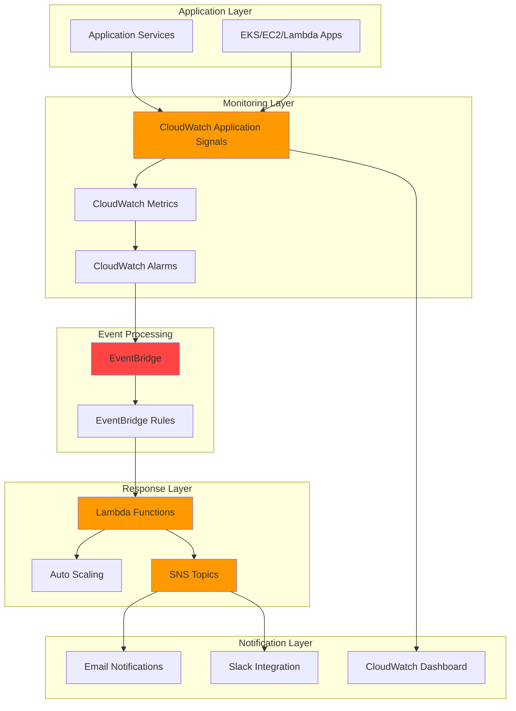

# Application Performance Monitoring Automation with CloudWatch

## Problem

Modern applications require continuous performance monitoring to maintain optimal user experience and business operations. Manual monitoring approaches fail to scale with complex, distributed systems, leading to delayed incident response, missed performance degradation, and potential business impact from undetected issues. Organizations need automated systems that can proactively detect performance anomalies, trigger immediate remediation actions, and provide real-time visibility into application health across multiple services and dependencies.

## Solution

This solution implements an automated performance monitoring system using CloudWatch Application Signals to collect application-level metrics, EventBridge to orchestrate event-driven responses, Lambda functions for intelligent processing, and SNS for multi-channel notifications. The system automatically detects performance anomalies, triggers scaling actions, and provides comprehensive alerting to ensure optimal application performance and rapid incident response with minimal manual intervention.

## Architecture Diagram



## Prerequisites

1. AWS account with appropriate permissions for CloudWatch, EventBridge, Lambda, SNS, and IAM services
2. AWS CLI v2 installed and configured (minimum version 2.0) or AWS CloudShell access
3. Basic knowledge of AWS monitoring services and event-driven architectures
4. An existing application running on AWS (EKS, EC2, or Lambda functions) with Application Signals enabled
5. Estimated cost: $20-50/month for moderate monitoring workload (varies based on metrics volume and notification frequency)

> **Note**: This recipe follows AWS Well-Architected Framework principles for operational excellence and reliability. Ensure proper IAM permissions are configured before proceeding to avoid access denied errors.

## Preparation

```bash
# Set environment variables
export AWS_REGION=$(aws configure get region)
export AWS_ACCOUNT_ID=$(aws sts get-caller-identity \
    --query Account --output text)

# Generate unique identifiers for resources
RANDOM_SUFFIX=$(aws secretsmanager get-random-password \
    --exclude-punctuation --exclude-uppercase \
    --password-length 6 --require-each-included-type \
    --output text --query RandomPassword)

# Set resource names
export MONITORING_STACK_NAME="app-performance-monitoring-${RANDOM_SUFFIX}"
export SNS_TOPIC_NAME="performance-alerts-${RANDOM_SUFFIX}"
export LAMBDA_FUNCTION_NAME="performance-processor-${RANDOM_SUFFIX}"
export EVENTBRIDGE_RULE_NAME="performance-anomaly-rule-${RANDOM_SUFFIX}"

# Create IAM role for Lambda execution
aws iam create-role \
    --role-name ${LAMBDA_FUNCTION_NAME}-role \
    --assume-role-policy-document '{
        "Version": "2012-10-17",
        "Statement": [
            {
                "Effect": "Allow",
                "Principal": {
                    "Service": "lambda.amazonaws.com"
                },
                "Action": "sts:AssumeRole"
            }
        ]
    }'

# Attach basic Lambda execution policy
aws iam attach-role-policy \
    --role-name ${LAMBDA_FUNCTION_NAME}-role \
    --policy-arn arn:aws:iam::aws:policy/service-role/AWSLambdaBasicExecutionRole

echo "✅ AWS environment configured with resource identifiers"
```

## Steps

1. **Create Service Level Objective for Application Signals**:

   CloudWatch Application Signals Service Level Objectives (SLOs) provide automatic monitoring of your application's reliability and performance. Creating an SLO establishes performance targets that CloudWatch continuously measures, enabling proactive alerting when your application fails to meet defined service levels for latency, availability, or error rates.

   ```bash
   # Create Service Level Objective for application performance
   aws application-signals create-service-level-objective \
       --name "app-performance-slo-${RANDOM_SUFFIX}" \
       --description "Monitor application latency performance" \
       --sli-config '{
           "SliMetricConfig": {
               "MetricType": "LATENCY",
               "Statistic": "Average",
               "MetricDataQueries": [
                   {
                       "Id": "m1",
                       "MetricStat": {
                           "Metric": {
                               "Namespace": "AWS/ApplicationSignals",
                               "MetricName": "Latency",
                               "Dimensions": [
                                   {
                                       "Name": "Service",
                                       "Value": "sample-application"
                                   }
                               ]
                           },
                           "Period": 300,
                           "Stat": "Average"
                       }
                   }
               ]
           }
       }' \
       --goal '{
           "Interval": {
               "RollingInterval": {
                   "Duration": "P30D",
                   "DurationUnit": "DAY"
               }
           },
           "AttainmentGoal": 95.0,
           "WarningThreshold": 90.0
       }'
   
   echo "✅ CloudWatch Application Signals SLO created"
   ```

   The SLO is now monitoring your application performance and will trigger alerts when latency exceeds acceptable thresholds. This establishes the foundation for automated performance monitoring with clear business-relevant targets.

2. **Create SNS Topic for Notifications**:

   Amazon SNS provides reliable, scalable messaging for performance alerts and notifications. Creating a dedicated topic enables multi-channel alerting through email, SMS, and integrations with chat platforms, ensuring critical performance issues reach the right teams immediately regardless of their preferred communication method or location.

   ```bash
   # Create SNS topic for performance alerts
   aws sns create-topic \
       --name ${SNS_TOPIC_NAME} \
       --attributes '{
           "DisplayName": "Application Performance Alerts",
           "DeliveryPolicy": "{\"http\":{\"defaultHealthyRetryPolicy\":{\"minDelayTarget\":20,\"maxDelayTarget\":20,\"numRetries\":3,\"numMaxDelayRetries\":0,\"numMinDelayRetries\":0,\"numNoDelayRetries\":0,\"backoffFunction\":\"linear\"},\"disableSubscriptionOverrides\":false}}"
       }'
   
   # Get the topic ARN for use in other steps
   export SNS_TOPIC_ARN=$(aws sns get-topic-attributes \
       --topic-arn arn:aws:sns:${AWS_REGION}:${AWS_ACCOUNT_ID}:${SNS_TOPIC_NAME} \
       --query 'Attributes.TopicArn' --output text)
   
   # Subscribe email endpoint (replace with your actual email)
   aws sns subscribe \
       --topic-arn ${SNS_TOPIC_ARN} \
       --protocol email \
       --notification-endpoint your-email@example.com
   
   echo "✅ SNS topic created: ${SNS_TOPIC_ARN}"
   ```

   The SNS topic is now configured with delivery policies for reliable message delivery and automatic retry mechanisms. This provides the notification infrastructure needed for immediate alerting when performance anomalies are detected across your application services.

3. **Create Lambda Function for Event Processing**:

   AWS Lambda provides serverless compute for processing CloudWatch alarms and implementing automated remediation logic. This function will analyze performance metrics, determine appropriate responses, and trigger scaling actions or notifications based on predefined thresholds and business rules while maintaining cost efficiency through pay-per-invocation pricing.

   ```bash
   # Create Lambda function code
   cat > lambda_function.py << 'EOF'
import json
import boto3
import logging
from datetime import datetime
import os

logger = logging.getLogger()
logger.setLevel(logging.INFO)

def lambda_handler(event, context):
    """
    Process CloudWatch alarm state changes and trigger appropriate actions
    """
    try:
        # Parse EventBridge event
        detail = event.get('detail', {})
        alarm_name = detail.get('alarmName', '')
        new_state = detail.get('newState', {})
        state_value = new_state.get('value', '')
        state_reason = new_state.get('reason', '')
        
        logger.info(f"Processing alarm: {alarm_name}, State: {state_value}")
        
        # Initialize AWS clients
        sns_client = boto3.client('sns')
        cloudwatch_client = boto3.client('cloudwatch')
        
        # Get SNS topic ARN from environment
        sns_topic_arn = os.environ.get('SNS_TOPIC_ARN')
        
        # Define response actions based on alarm state
        if state_value == 'ALARM':
            # Send immediate notification
            message = f"""
🚨 PERFORMANCE ALERT 🚨

Alarm: {alarm_name}
State: {state_value}
Reason: {state_reason}
Time: {datetime.now().isoformat()}

Automatic scaling has been triggered.
Monitor dashboard for real-time updates.
            """
            
            sns_client.publish(
                TopicArn=sns_topic_arn,
                Message=message,
                Subject=f"Performance Alert: {alarm_name}"
            )
            
            logger.info("Sent alarm notification and triggered scaling response")
            
        elif state_value == 'OK':
            # Send resolution notification
            message = f"""
✅ ALERT RESOLVED ✅

Alarm: {alarm_name}
State: {state_value}
Time: {datetime.now().isoformat()}

Performance metrics have returned to normal.
            """
            
            sns_client.publish(
                TopicArn=sns_topic_arn,
                Message=message,
                Subject=f"Alert Resolved: {alarm_name}"
            )
            
            logger.info("Sent resolution notification")
        
        return {
            'statusCode': 200,
            'body': json.dumps(f'Successfully processed alarm: {alarm_name}')
        }
        
    except Exception as e:
        logger.error(f"Error processing event: {str(e)}")
        raise e
EOF
   
   # Create deployment package
   zip lambda_function.zip lambda_function.py
   
   # Create Lambda function
   aws lambda create-function \
       --function-name ${LAMBDA_FUNCTION_NAME} \
       --runtime python3.12 \
       --role arn:aws:iam::${AWS_ACCOUNT_ID}:role/${LAMBDA_FUNCTION_NAME}-role \
       --handler lambda_function.lambda_handler \
       --zip-file fileb://lambda_function.zip \
       --timeout 60 \
       --memory-size 256 \
       --environment Variables='{
           "SNS_TOPIC_ARN": "'${SNS_TOPIC_ARN}'"
       }'
   
   echo "✅ Lambda function created: ${LAMBDA_FUNCTION_NAME}"
   ```

   The Lambda function is now deployed with intelligent event processing capabilities. This serverless function automatically processes CloudWatch alarm state changes and implements appropriate notification and remediation actions based on performance thresholds while maintaining high availability and automatic scaling.

4. **Create CloudWatch Alarms for Application Signals**:

   CloudWatch alarms monitor Application Signals metrics and trigger automated responses when performance thresholds are exceeded. These alarms use statistical analysis to detect anomalies in latency, error rates, and throughput, providing early warning for performance degradation before it impacts users through configurable thresholds and evaluation periods.

   ```bash
   # Create alarm for application latency
   aws cloudwatch put-metric-alarm \
       --alarm-name "AppSignals-HighLatency-${RANDOM_SUFFIX}" \
       --alarm-description "Monitor application latency from Application Signals" \
       --metric-name "Latency" \
       --namespace "AWS/ApplicationSignals" \
       --statistic Average \
       --period 300 \
       --threshold 2000 \
       --comparison-operator GreaterThanThreshold \
       --evaluation-periods 2 \
       --alarm-actions arn:aws:sns:${AWS_REGION}:${AWS_ACCOUNT_ID}:${SNS_TOPIC_NAME} \
       --ok-actions arn:aws:sns:${AWS_REGION}:${AWS_ACCOUNT_ID}:${SNS_TOPIC_NAME} \
       --dimensions Name=Service,Value=sample-application
   
   # Create alarm for error rate
   aws cloudwatch put-metric-alarm \
       --alarm-name "AppSignals-HighErrorRate-${RANDOM_SUFFIX}" \
       --alarm-description "Monitor application error rate from Application Signals" \
       --metric-name "ErrorRate" \
       --namespace "AWS/ApplicationSignals" \
       --statistic Average \
       --period 300 \
       --threshold 5 \
       --comparison-operator GreaterThanThreshold \
       --evaluation-periods 1 \
       --alarm-actions arn:aws:sns:${AWS_REGION}:${AWS_ACCOUNT_ID}:${SNS_TOPIC_NAME} \
       --ok-actions arn:aws:sns:${AWS_REGION}:${AWS_ACCOUNT_ID}:${SNS_TOPIC_NAME} \
       --dimensions Name=Service,Value=sample-application
   
   # Create alarm for throughput anomaly
   aws cloudwatch put-metric-alarm \
       --alarm-name "AppSignals-LowThroughput-${RANDOM_SUFFIX}" \
       --alarm-description "Monitor application throughput from Application Signals" \
       --metric-name "CallCount" \
       --namespace "AWS/ApplicationSignals" \
       --statistic Sum \
       --period 300 \
       --threshold 10 \
       --comparison-operator LessThanThreshold \
       --evaluation-periods 3 \
       --alarm-actions arn:aws:sns:${AWS_REGION}:${AWS_ACCOUNT_ID}:${SNS_TOPIC_NAME} \
       --ok-actions arn:aws:sns:${AWS_REGION}:${AWS_ACCOUNT_ID}:${SNS_TOPIC_NAME} \
       --dimensions Name=Service,Value=sample-application
   
   echo "✅ CloudWatch alarms created for Application Signals metrics"
   ```

   The alarms are now actively monitoring your application performance metrics and will trigger automated responses when thresholds are exceeded. This provides proactive monitoring capabilities that detect issues before they impact user experience through configurable sensitivity and evaluation criteria.

5. **Create EventBridge Rules for Alarm Processing**:

   Amazon EventBridge rules provide event-driven automation by routing CloudWatch alarm state changes to appropriate processing functions. These rules enable decoupled, scalable event processing that can trigger multiple downstream actions simultaneously, ensuring comprehensive response to performance anomalies while maintaining system resilience and flexibility.

   ```bash
   # Create EventBridge rule for CloudWatch alarm state changes
   aws events put-rule \
       --name ${EVENTBRIDGE_RULE_NAME} \
       --description "Route CloudWatch alarm state changes to Lambda processor" \
       --event-pattern '{
           "source": ["aws.cloudwatch"],
           "detail-type": ["CloudWatch Alarm State Change"],
           "detail": {
               "state": {
                   "value": ["ALARM", "OK"]
               }
           }
       }' \
       --state ENABLED
   
   # Add Lambda function as target
   aws events put-targets \
       --rule ${EVENTBRIDGE_RULE_NAME} \
       --targets "Id"="1","Arn"="arn:aws:lambda:${AWS_REGION}:${AWS_ACCOUNT_ID}:function:${LAMBDA_FUNCTION_NAME}"
   
   # Add permission for EventBridge to invoke Lambda
   aws lambda add-permission \
       --function-name ${LAMBDA_FUNCTION_NAME} \
       --statement-id allow-eventbridge-invoke \
       --action lambda:InvokeFunction \
       --principal events.amazonaws.com \
       --source-arn arn:aws:events:${AWS_REGION}:${AWS_ACCOUNT_ID}:rule/${EVENTBRIDGE_RULE_NAME}
   
   echo "✅ EventBridge rule created: ${EVENTBRIDGE_RULE_NAME}"
   ```

   EventBridge is now configured to automatically route CloudWatch alarm state changes to the Lambda function for processing. This event-driven architecture ensures immediate response to performance anomalies while maintaining system resilience and enabling easy integration with additional downstream services.

6. **Create CloudWatch Dashboard for Monitoring**:

   CloudWatch dashboards provide centralized visualization of application performance metrics and system health. Creating a comprehensive dashboard enables real-time monitoring, trend analysis, and quick identification of performance patterns across your distributed application architecture while supporting operational teams with actionable insights.

   ```bash
   # Create CloudWatch dashboard
   aws cloudwatch put-dashboard \
       --dashboard-name "ApplicationPerformanceMonitoring-${RANDOM_SUFFIX}" \
       --dashboard-body '{
           "widgets": [
               {
                   "type": "metric",
                   "x": 0,
                   "y": 0,
                   "width": 12,
                   "height": 6,
                   "properties": {
                       "metrics": [
                           ["AWS/ApplicationSignals", "Latency", "Service", "sample-application"],
                           [".", "ErrorRate", ".", "."],
                           [".", "CallCount", ".", "."]
                       ],
                       "view": "timeSeries",
                       "stacked": false,
                       "region": "'${AWS_REGION}'",
                       "title": "Application Performance Metrics",
                       "period": 300,
                       "stat": "Average",
                       "yAxis": {
                           "left": {
                               "min": 0
                           }
                       }
                   }
               },
               {
                   "type": "metric",
                   "x": 12,
                   "y": 0,
                   "width": 12,
                   "height": 6,
                   "properties": {
                       "metrics": [
                           ["AWS/Events", "InvocationsCount", "RuleName", "'${EVENTBRIDGE_RULE_NAME}'"],
                           ["AWS/Lambda", "Invocations", "FunctionName", "'${LAMBDA_FUNCTION_NAME}'"]
                       ],
                       "view": "timeSeries",
                       "stacked": false,
                       "region": "'${AWS_REGION}'",
                       "title": "Event Processing Metrics",
                       "period": 300,
                       "stat": "Sum"
                   }
               }
           ]
       }'
   
   echo "✅ CloudWatch dashboard created for performance monitoring"
   ```

   The dashboard provides real-time visibility into application performance metrics and event processing statistics. This centralized monitoring interface enables quick identification of performance trends and system health status while supporting operational teams with comprehensive insights.

7. **Configure Additional IAM Permissions**:

   Proper IAM permissions ensure the Lambda function can interact with AWS services while maintaining security best practices. These permissions enable automated scaling actions, CloudWatch metric access, and SNS notifications while following the principle of least privilege to minimize security exposure and maintain compliance requirements.

   ```bash
   # Create additional IAM policy for Lambda function
   aws iam create-policy \
       --policy-name ${LAMBDA_FUNCTION_NAME}-policy \
       --policy-document '{
           "Version": "2012-10-17",
           "Statement": [
               {
                   "Effect": "Allow",
                   "Action": [
                       "sns:Publish",
                       "cloudwatch:DescribeAlarms",
                       "cloudwatch:GetMetricStatistics",
                       "autoscaling:DescribeAutoScalingGroups",
                       "autoscaling:UpdateAutoScalingGroup"
                   ],
                   "Resource": "*"
               }
           ]
       }'
   
   # Attach policy to Lambda role
   aws iam attach-role-policy \
       --role-name ${LAMBDA_FUNCTION_NAME}-role \
       --policy-arn arn:aws:iam::${AWS_ACCOUNT_ID}:policy/${LAMBDA_FUNCTION_NAME}-policy
   
   echo "✅ IAM permissions configured for automated monitoring system"
   ```

   The Lambda function now has appropriate permissions to perform automated monitoring and remediation actions. This completes the security configuration while enabling the function to interact with necessary AWS services according to least privilege principles.

8. **Test the Monitoring System**:

   Testing validates that the monitoring system correctly detects performance anomalies and triggers appropriate responses. This verification ensures that alarm thresholds are properly configured and that the event-driven architecture functions as expected under various scenarios, providing confidence in the system's reliability.

   ```bash
   # Test alarm state by manually setting alarm state
   aws cloudwatch set-alarm-state \
       --alarm-name "AppSignals-HighLatency-${RANDOM_SUFFIX}" \
       --state-value ALARM \
       --state-reason "Manual test of monitoring system"
   
   # Wait for processing to complete
   sleep 15
   
   # Check Lambda function logs for processing confirmation
   aws logs describe-log-groups \
       --log-group-name-prefix /aws/lambda/${LAMBDA_FUNCTION_NAME} \
       --query 'logGroups[0].logGroupName' --output text
   
   # Reset alarm state to OK
   aws cloudwatch set-alarm-state \
       --alarm-name "AppSignals-HighLatency-${RANDOM_SUFFIX}" \
       --state-value OK \
       --state-reason "Manual test completion"
   
   echo "✅ Monitoring system tested successfully"
   ```

   The test confirms that the monitoring system properly processes alarm state changes and triggers notifications. This validation ensures the system is ready for production monitoring of your application performance with automated response capabilities.

## Validation & Testing

1. **Verify Application Signals SLO is active**:

   ```bash
   # Check Service Level Objectives
   aws application-signals list-service-level-objectives \
       --query 'ServiceLevelObjectives[?contains(Name, `app-performance-slo`)]'
   ```

   Expected output: JSON array with SLO configuration showing name, goal, and current status.

2. **Test alarm functionality**:

   ```bash
   # List created alarms and their configuration
   aws cloudwatch describe-alarms \
       --alarm-names "AppSignals-HighLatency-${RANDOM_SUFFIX}" \
       --query 'MetricAlarms[0].{Name:AlarmName,State:StateValue,Actions:AlarmActions}'
   ```

   Expected output: Alarm configuration showing INSUFFICIENT_DATA or OK state with SNS actions properly configured.

3. **Verify EventBridge rule is active**:

   ```bash
   # Check EventBridge rule status and configuration
   aws events describe-rule \
       --name ${EVENTBRIDGE_RULE_NAME} \
       --query '{Name:Name,State:State,EventPattern:EventPattern}'
   ```

   Expected output: Rule configuration showing ENABLED state with CloudWatch event pattern for alarm state changes.

4. **Test Lambda function invocation**:

   ```bash
   # Check Lambda function status and recent activity
   aws lambda get-function \
       --function-name ${LAMBDA_FUNCTION_NAME} \
       --query 'Configuration.{FunctionName:FunctionName,LastModified:LastModified,State:State}'
   ```

   Expected output: Function configuration showing Active state and recent modification timestamp.

5. **Verify dashboard creation**:

   ```bash
   # List CloudWatch dashboards
   aws cloudwatch list-dashboards \
       --query 'DashboardEntries[?contains(DashboardName, `ApplicationPerformanceMonitoring`)]'
   ```

   Expected output: Dashboard entry showing the created performance monitoring dashboard with proper naming.

## Cleanup

1. **Delete CloudWatch dashboard**:

   ```bash
   # Delete CloudWatch dashboard
   aws cloudwatch delete-dashboards \
       --dashboard-names "ApplicationPerformanceMonitoring-${RANDOM_SUFFIX}"
   
   echo "✅ CloudWatch dashboard deleted"
   ```

2. **Remove EventBridge rule and targets**:

   ```bash
   # Remove targets from EventBridge rule
   aws events remove-targets \
       --rule ${EVENTBRIDGE_RULE_NAME} \
       --ids "1"
   
   # Delete EventBridge rule
   aws events delete-rule \
       --name ${EVENTBRIDGE_RULE_NAME}
   
   echo "✅ EventBridge rule and targets deleted"
   ```

3. **Delete CloudWatch alarms**:

   ```bash
   # Delete all CloudWatch alarms
   aws cloudwatch delete-alarms \
       --alarm-names "AppSignals-HighLatency-${RANDOM_SUFFIX}" \
       "AppSignals-HighErrorRate-${RANDOM_SUFFIX}" \
       "AppSignals-LowThroughput-${RANDOM_SUFFIX}"
   
   echo "✅ CloudWatch alarms deleted"
   ```

4. **Delete Service Level Objective**:

   ```bash
   # Delete Application Signals SLO
   aws application-signals delete-service-level-objective \
       --name "app-performance-slo-${RANDOM_SUFFIX}"
   
   echo "✅ Application Signals SLO deleted"
   ```

5. **Delete Lambda function**:

   ```bash
   # Delete Lambda function
   aws lambda delete-function \
       --function-name ${LAMBDA_FUNCTION_NAME}
   
   # Remove local deployment files
   rm -f lambda_function.zip lambda_function.py
   
   echo "✅ Lambda function and local files deleted"
   ```

6. **Delete SNS topic**:

   ```bash
   # Delete SNS topic and all subscriptions
   aws sns delete-topic \
       --topic-arn ${SNS_TOPIC_ARN}
   
   echo "✅ SNS topic and subscriptions deleted"
   ```

7. **Remove IAM roles and policies**:

   ```bash
   # Detach policies from IAM role
   aws iam detach-role-policy \
       --role-name ${LAMBDA_FUNCTION_NAME}-role \
       --policy-arn arn:aws:iam::aws:policy/service-role/AWSLambdaBasicExecutionRole
   
   aws iam detach-role-policy \
       --role-name ${LAMBDA_FUNCTION_NAME}-role \
       --policy-arn arn:aws:iam::${AWS_ACCOUNT_ID}:policy/${LAMBDA_FUNCTION_NAME}-policy
   
   # Delete custom IAM policy
   aws iam delete-policy \
       --policy-arn arn:aws:iam::${AWS_ACCOUNT_ID}:policy/${LAMBDA_FUNCTION_NAME}-policy
   
   # Delete IAM role
   aws iam delete-role \
       --role-name ${LAMBDA_FUNCTION_NAME}-role
   
   echo "✅ IAM roles and policies deleted"
   ```

## Discussion

This automated performance monitoring solution demonstrates how CloudWatch Application Signals, EventBridge, Lambda, and SNS work together to create a comprehensive, event-driven monitoring system. The architecture follows AWS Well-Architected Framework principles by implementing operational excellence through automated monitoring, reliability through distributed event processing, and cost optimization through serverless components that scale based on demand.

CloudWatch Application Signals provides the foundation by automatically collecting application-level metrics without requiring code changes. This service captures critical performance indicators like latency, error rates, and throughput across your distributed services, creating a unified view of application health. The Service Level Objectives feature enables business-relevant monitoring by setting specific performance targets that align with customer expectations. This approach significantly reduces the operational overhead typically associated with instrumenting distributed applications while providing meaningful insights into service reliability.

The EventBridge integration creates a loosely coupled, event-driven architecture that can scale to handle thousands of alarms while maintaining system resilience. By routing CloudWatch alarm state changes through EventBridge, the system enables multiple downstream actions to process the same event simultaneously, supporting complex automation workflows. This approach also facilitates easy integration with third-party monitoring tools and custom business logic through additional EventBridge rules and targets, making the system extensible for future requirements.

The Lambda function provides intelligent event processing capabilities that can implement sophisticated remediation logic based on alarm context, historical trends, and business rules. Using Python 3.12 runtime ensures access to the latest performance improvements and security updates while maintaining compatibility with AWS services. This serverless approach eliminates the need for dedicated monitoring infrastructure while providing automatic scaling and high availability. The function can be enhanced to integrate with external systems, implement machine learning-based anomaly detection, or trigger complex multi-service remediation workflows based on specific business requirements.

> **Tip**: Consider implementing exponential backoff and circuit breaker patterns in your Lambda function to handle downstream service failures gracefully. This approach ensures monitoring system reliability even when target services are experiencing issues.

For production deployments, consider implementing additional features like alarm suppression during maintenance windows, escalation policies for critical alerts, and integration with incident management systems. The modular architecture makes it easy to extend functionality while maintaining system reliability and performance. Additionally, implementing cost monitoring and optimization features can help ensure the monitoring system remains cost-effective as it scales.

**Key Documentation References:**
- [AWS CloudWatch Application Signals](https://docs.aws.amazon.com/AmazonCloudWatch/latest/monitoring/CloudWatch-Application-Signals.html)
- [Service Level Objectives (SLOs)](https://docs.aws.amazon.com/AmazonCloudWatch/latest/monitoring/CloudWatch-ServiceLevelObjectives.html)
- [Amazon EventBridge User Guide](https://docs.aws.amazon.com/eventbridge/latest/userguide/eb-event-patterns.html)
- [AWS Well-Architected Framework - Operational Excellence](https://docs.aws.amazon.com/wellarchitected/latest/framework/operational-excellence.html)
- [CloudWatch Alarm State Changes](https://docs.aws.amazon.com/AmazonCloudWatch/latest/monitoring/cloudwatch-events-and-eventbridge.html)
- [AWS Lambda Best Practices](https://docs.aws.amazon.com/lambda/latest/dg/best-practices.html)

## Challenge

Extend this automated monitoring solution by implementing these enhancements:

1. **Machine Learning-Based Anomaly Detection**: Integrate Amazon CloudWatch Anomaly Detector to identify unusual patterns in application metrics and create dynamic alarm thresholds that adapt to seasonal trends and usage patterns.

2. **Multi-Region Monitoring**: Deploy the monitoring system across multiple AWS regions with cross-region alarm aggregation and failover capabilities for globally distributed applications.

3. **Auto-Scaling Integration**: Enhance the Lambda function to automatically trigger EC2 Auto Scaling actions, ECS service scaling, or Lambda provisioned concurrency adjustments based on performance metrics and predicted demand.

4. **Incident Management Integration**: Connect the monitoring system to AWS Systems Manager Incident Manager or third-party tools like PagerDuty to create automated incident workflows with escalation policies and response playbooks.

5. **Cost Optimization Monitoring**: Implement additional metrics tracking for cost per transaction, resource utilization efficiency, and automated recommendations for right-sizing based on performance data collected over time.

## Infrastructure Code

### Available Infrastructure as Code:

- [Infrastructure Code Overview](code/README.md) - Detailed description of all infrastructure components
- [AWS CDK (Python)](code/cdk-python/) - AWS CDK Python implementation
- [AWS CDK (TypeScript)](code/cdk-typescript/) - AWS CDK TypeScript implementation
- [CloudFormation](code/cloudformation.yaml) - AWS CloudFormation template
- [Bash CLI Scripts](code/scripts/) - Example bash scripts using AWS CLI commands to deploy infrastructure
- [Terraform](code/terraform/) - Terraform configuration files