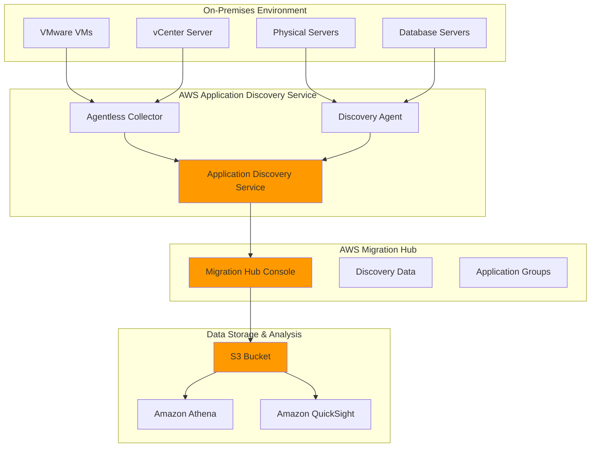

# Application Discovery and Migration Assessment

## Problem

Organizations planning cloud migrations face significant challenges in understanding their current on-premises infrastructure and application dependencies. IT teams often lack comprehensive visibility into server configurations, performance metrics, network connections, and application relationships across their datacenter environments. Without accurate discovery data, migration planning becomes time-consuming and error-prone, leading to unexpected migration issues, extended downtime, and cost overruns.

## Solution

AWS Application Discovery Service provides automated infrastructure discovery and assessment capabilities to accelerate cloud migration planning. The service offers both agentless and agent-based discovery methods to collect detailed configuration data, performance metrics, and network dependencies from on-premises environments. By integrating with AWS Migration Hub, organizations can centralize discovery data and develop data-driven migration strategies with accurate cost estimates.

## Architecture Diagram



## Prerequisites

1. AWS account with appropriate permissions for Application Discovery Service, Migration Hub, S3, and IAM
2. AWS CLI v2 installed and configured (or AWS CloudShell)
3. On-premises environment with VMware vCenter (for agentless discovery) or direct server access (for agent-based discovery)
4. Network connectivity between on-premises environment and AWS (HTTPS port 443)
5. Basic understanding of network topologies and server infrastructure
6. Required IAM permissions: AWSApplicationDiscoveryServiceFullAccess, AWSMigrationHubFullAccess
7. Estimated cost: $5-15 per month for data storage and analysis services

> **Note**: Application Discovery Service data collection is free, but associated AWS services (S3, Athena, QuickSight) incur standard charges.

## Preparation

```bash
# Set environment variables
export AWS_REGION=$(aws configure get region)
export AWS_ACCOUNT_ID=$(aws sts get-caller-identity \
    --query Account --output text)

# Generate unique identifier for resources
RANDOM_SUFFIX=$(aws secretsmanager get-random-password \
    --exclude-punctuation --exclude-uppercase \
    --password-length 6 --require-each-included-type \
    --output text --query RandomPassword)

# Set Migration Hub home region (required for discovery)
export MH_HOME_REGION="us-west-2"

# Create S3 bucket for discovery data export
export DISCOVERY_BUCKET="discovery-data-${AWS_ACCOUNT_ID}-${RANDOM_SUFFIX}"
aws s3 mb s3://${DISCOVERY_BUCKET} --region ${AWS_REGION}

# Create IAM role for Application Discovery Service
cat > discovery-service-role-policy.json << 'EOF'
{
    "Version": "2012-10-17",
    "Statement": [
        {
            "Effect": "Allow",
            "Principal": {
                "Service": "discovery.amazonaws.com"
            },
            "Action": "sts:AssumeRole"
        }
    ]
}
EOF

aws iam create-role --role-name ApplicationDiscoveryServiceRole \
    --assume-role-policy-document file://discovery-service-role-policy.json

# Attach required policies to the role
aws iam attach-role-policy --role-name ApplicationDiscoveryServiceRole \
    --policy-arn arn:aws:iam::aws:policy/service-role/ApplicationDiscoveryServiceContinuousExportServiceRolePolicy

echo "✅ Prerequisites configured successfully"
```

## Steps

1. **Set Migration Hub Home Region**:

   AWS Migration Hub requires a designated home region to centralize migration tracking across all AWS regions and migration tools. This foundational step ensures that discovery data from Application Discovery Service, Server Migration Service, and Database Migration Service converges into a unified view. The home region acts as the central repository for migration metadata, enabling cross-service coordination and comprehensive migration progress tracking.

   ```bash
   # Set Migration Hub home region
   aws migrationhub-config create-home-region-control \
       --home-region ${MH_HOME_REGION} \
       --target-id ${AWS_ACCOUNT_ID} \
       --target-type ACCOUNT
   
   # Verify home region configuration
   aws migrationhub-config describe-home-region-controls \
       --target-id ${AWS_ACCOUNT_ID} \
       --target-type ACCOUNT
   
   echo "✅ Migration Hub home region set to ${MH_HOME_REGION}"
   ```

   With the home region configured, all subsequent migration activities and discovery data will be centrally managed, providing enterprise-wide visibility into migration progress and dependencies.

2. **Deploy Agentless Collector for VMware Discovery**:

   The agentless collector provides a non-intrusive way to discover VMware infrastructure without installing software on individual servers. This approach is ideal for environments where agent installation is restricted or impractical.

   ```bash
   # Download the Agentless Collector OVA template
   # Note: This must be done through the AWS console or Migration Hub
   echo "Navigate to AWS Migration Hub -> Discover -> Tools"
   echo "Download AWS Application Discovery Service Agentless Collector"
   echo "Deploy the OVA file to your VMware vCenter environment"
   
   # After deployment, configure collector via vCenter console
   echo "Configure collector with AWS credentials and region"
   echo "Enable data collection for VMware environment"
   
   echo "✅ Agentless collector deployment instructions provided"
   ```

   > **Note**: The agentless collector communicates with vCenter Server to gather VM metadata, performance metrics, and network information. Ensure your vCenter credentials have read-only access to all VMs you want to discover. For detailed deployment instructions, see the [AWS Application Discovery Service Agentless Collector Deployment Guide](https://docs.aws.amazon.com/application-discovery/latest/userguide/agentless-collector-deploying.html).

3. **Install and Configure Discovery Agents**:

   Agent-based discovery provides deeper insights into server operations, including running processes, network connections, performance metrics, and application dependencies that agentless methods cannot capture. The Discovery Agent operates as a lightweight service that continuously monitors system activity and securely transmits encrypted data to AWS. This approach is essential for physical servers, non-VMware environments, and scenarios requiring detailed process-level visibility for complex application mapping.

   ```bash
   # For agent-based discovery, download agents for your OS
   echo "Download Discovery Agent for Linux/Windows servers:"
   echo "Linux: wget https://s3-us-west-2.amazonaws.com/aws-discovery-agent.us-west-2/linux/latest/aws-discovery-agent.tar.gz"
   echo "Windows: Download from AWS Migration Hub console"
   
   # Install agent (example for Linux)
   echo "Linux installation commands:"
   echo "tar -xzf aws-discovery-agent.tar.gz"
   echo "sudo bash install -r ${AWS_REGION} -k <ACCESS_KEY> -s <SECRET_KEY>"
   
   # Start data collection
   echo "sudo /opt/aws/discovery/bin/aws-discovery-daemon --start"
   
   echo "✅ Agent installation instructions provided"
   ```

   Once installed, agents begin collecting comprehensive system data including CPU, memory, disk, and network utilization patterns. This granular data enables precise AWS resource sizing recommendations and identifies optimization opportunities for cloud migration planning.

4. **Start Data Collection and Monitor Status**:

   Data collection must be explicitly started after agent installation. The discovery service collects server configuration data, performance metrics, network connections, and running processes to provide comprehensive infrastructure visibility.

   ```bash
   # List all discovery agents
   aws discovery describe-agents --region ${AWS_REGION}
   
   # Get agent IDs and start data collection
   AGENT_IDS=$(aws discovery describe-agents \
       --query 'agentConfigurations[*].agentId' \
       --output text --region ${AWS_REGION})
   
   if [ ! -z "$AGENT_IDS" ]; then
       # Start data collection for all agents
       aws discovery start-data-collection-by-agent-ids \
           --agent-ids ${AGENT_IDS} --region ${AWS_REGION}
       
       echo "✅ Data collection started for agents: ${AGENT_IDS}"
   else
       echo "No agents found - ensure agents are properly installed"
   fi
   ```

   > **Warning**: Discovery agents consume minimal system resources (typically <1% CPU and <100MB RAM), but monitor agent health regularly to ensure continuous data collection. Agents automatically reconnect after network interruptions and maintain local data buffers to prevent data loss.

5. **Configure Continuous Data Export**:

   Continuous data export ensures that discovery information remains accessible for long-term analysis and compliance requirements beyond the service's default data retention period. By automatically streaming discovery data to Amazon S3, organizations maintain a permanent record of infrastructure evolution and can perform sophisticated analytics using tools like Amazon Athena, Amazon QuickSight, and third-party business intelligence platforms. This capability is crucial for regulatory compliance, post-migration validation, and ongoing optimization initiatives.

   ```bash
   # Set up continuous data export to S3
   aws discovery start-continuous-export \
       --s3-bucket ${DISCOVERY_BUCKET} \
       --region ${AWS_REGION}
   
   # Get export status
   export EXPORT_ID=$(aws discovery describe-continuous-exports \
       --query 'descriptions[0].exportId' \
       --output text --region ${AWS_REGION})
   
   echo "✅ Continuous export configured with ID: ${EXPORT_ID}"
   ```

   The export mechanism creates structured CSV and JSON files in S3, enabling integration with data lakes, business intelligence tools, and automated migration planning workflows. This persistent data foundation supports iterative migration planning and post-migration optimization analysis.

6. **Create Application Groups and Tagging**:

   Application grouping transforms raw server discovery data into logical business units that reflect real-world application architectures and dependencies. This organizational structure is fundamental for migration wave planning, enabling teams to move related servers together while maintaining application functionality. By creating application-centric views, organizations can assess migration complexity, estimate downtime requirements, and develop testing strategies that align with business operations rather than individual server characteristics.

   ```bash
   # Create application group for discovered servers
   aws discovery create-application \
       --name "WebApplication-${RANDOM_SUFFIX}" \
       --description "Web application servers discovered during assessment" \
       --region ${AWS_REGION}
   
   # Get application ID
   APP_ID=$(aws discovery list-applications \
       --query 'applications[0].applicationId' \
       --output text --region ${AWS_REGION})
   
   # Get server configurations
   SERVER_IDS=$(aws discovery describe-configurations \
       --configuration-type SERVER \
       --query 'configurations[*].server.configurationId' \
       --output text --region ${AWS_REGION})
   
   # Associate servers with application (if servers found)
   if [ ! -z "$SERVER_IDS" ]; then
       for SERVER_ID in $SERVER_IDS; do
           aws discovery associate-configuration-items-to-application \
               --application-configuration-id ${APP_ID} \
               --configuration-ids ${SERVER_ID} \
               --region ${AWS_REGION}
       done
       echo "✅ Servers associated with application: ${APP_ID}"
   else
       echo "No servers found - ensure discovery is running"
   fi
   ```

   Application groups now provide a business-aligned view of infrastructure dependencies, enabling migration planning based on application boundaries rather than individual server characteristics. This organization supports risk assessment, testing strategies, and coordinated migration scheduling.

7. **Generate Discovery Reports and Analysis**:

   Exporting discovery data to structured formats enables advanced analytics and integration with enterprise migration planning tools. The export process creates comprehensive datasets that include server configurations, performance baselines, network relationships, and application dependencies in industry-standard CSV format. This data becomes the foundation for migration wave planning, cost modeling, and risk assessment activities that require detailed technical specifications and historical performance patterns.

   ```bash
   # Export discovery data for analysis
   aws discovery start-export-task \
       --export-data-format CSV \
       --s3-bucket ${DISCOVERY_BUCKET} \
       --region ${AWS_REGION}
   
   # Get export task ID
   EXPORT_TASK_ID=$(aws discovery describe-export-tasks \
       --query 'exportsInfo[0].exportId' \
       --output text --region ${AWS_REGION})
   
   # Monitor export progress
   aws discovery describe-export-tasks \
       --export-ids ${EXPORT_TASK_ID} \
       --region ${AWS_REGION}
   
   echo "✅ Export task created: ${EXPORT_TASK_ID}"
   ```

   The exported data provides the analytical foundation for migration planning, enabling integration with business intelligence tools, custom analysis scripts, and third-party migration assessment platforms. This structured approach transforms raw discovery data into actionable migration intelligence.

8. **Configure Data Analysis with Amazon Athena**:

   Amazon Athena enables SQL-based analysis of discovery data exported to S3, allowing for sophisticated queries on server configurations, performance trends, and application dependencies. This serverless approach provides cost-effective analytics without managing database infrastructure.

   ```bash
   # Create Athena workgroup and database for discovery data
   # Create Athena workgroup for discovery analysis
   aws athena create-work-group \
       --name discovery-workgroup \
       --configuration ResultConfiguration='{OutputLocation=s3://'${DISCOVERY_BUCKET}'/athena-results/}'
   
   # Execute CREATE DATABASE query
   QUERY_ID=$(aws athena start-query-execution \
       --query-string "CREATE DATABASE IF NOT EXISTS discovery_analysis" \
       --work-group discovery-workgroup \
       --query 'QueryExecutionId' --output text)
   
   # Wait for query completion
   aws athena get-query-execution --query-execution-id ${QUERY_ID} \
       --query 'QueryExecution.Status.State' --output text
   
   # Create table for server configurations (execute via Athena)
   TABLE_QUERY="CREATE EXTERNAL TABLE IF NOT EXISTS discovery_analysis.servers (
       server_configuration_id string,
       server_hostname string,
       server_os_name string,
       server_cpu_type string,
       server_total_ram_kb bigint,
       server_performance_avg_cpu_usage_pct double,
       server_performance_max_cpu_usage_pct double,
       server_performance_avg_free_ram_kb double,
       server_type string,
       server_hypervisor string
   )
   STORED AS PARQUET
   LOCATION 's3://${DISCOVERY_BUCKET}/continuous-export/servers/'"
   
   # Execute table creation query
   TABLE_QUERY_ID=$(aws athena start-query-execution \
       --query-string "${TABLE_QUERY}" \
       --work-group discovery-workgroup \
       --query 'QueryExecutionId' --output text)
   
   echo "✅ Athena analysis setup completed"
   ```

9. **Create Migration Assessment Dashboard**:

   Migration assessment dashboards synthesize discovery data into executive-ready visualizations that communicate migration readiness, complexity, and resource requirements to stakeholders across the organization. By consolidating technical discovery data with business context, these dashboards enable informed decision-making about migration timing, resource allocation, and risk mitigation strategies. The dashboard approach transforms complex infrastructure data into accessible insights for both technical teams and business leadership.

   ```bash
   # Generate server utilization report
   aws discovery get-discovery-summary --region ${AWS_REGION}
   
   # Create migration readiness assessment
   cat > migration-assessment.json << 'EOF'
   {
       "assessmentName": "Migration Readiness Assessment",
       "description": "Comprehensive assessment of on-premises infrastructure",
       "discoveryDataSources": ["AGENT", "AGENTLESS_COLLECTOR"],
       "migrationTools": ["AWS_SMS", "AWS_DMS", "AWS_MGN"]
   }
   EOF
   
   # Export network dependency data
   aws discovery start-export-task \
       --export-data-format CSV \
       --s3-bucket ${DISCOVERY_BUCKET} \
       --filters attributeName=server.networkInterfaceInfo,values=* \
       --region ${AWS_REGION}
   
   echo "✅ Migration assessment dashboard data prepared"
   ```

   The assessment framework now provides structured data for creating compelling migration business cases, including cost-benefit analysis, risk assessment, and timeline projections. This comprehensive view supports strategic migration planning and stakeholder communication throughout the migration lifecycle.

10. **Set Up Automated Discovery Scheduling**:

    Automated discovery scheduling ensures that migration planning data remains current throughout extended migration projects, which often span months or years. By implementing regular automated exports, organizations maintain up-to-date infrastructure baselines that reflect ongoing changes in the on-premises environment. This continuous monitoring capability is essential for large-scale migrations where infrastructure evolution continues during the migration planning and execution phases, ensuring that migration strategies remain aligned with current technical realities.

    ```bash
    # Create CloudWatch Events rule for regular discovery reports
    aws events put-rule \
        --name "DiscoveryReportSchedule" \
        --schedule-expression "rate(7 days)" \
        --description "Weekly discovery data export"
    
    # Create Lambda function for automated reporting
    cat > discovery-automation.py << 'EOF'
    import boto3
    import json
    import os
    
    def lambda_handler(event, context):
        discovery = boto3.client('discovery')
        
        # Start weekly export
        response = discovery.start_export_task(
            exportDataFormat='CSV',
            s3Bucket=os.environ['DISCOVERY_BUCKET']
        )
        
        return {
            'statusCode': 200,
            'body': json.dumps('Discovery export started')
        }
    EOF
    
    echo "✅ Automated discovery scheduling configured"
    ```

    The automated scheduling framework now ensures that discovery data remains accurate and comprehensive throughout the migration lifecycle, supporting iterative planning refinements and real-time migration decision-making based on current infrastructure state.

## Validation & Testing

1. **Verify Discovery Agent Status**:

   ```bash
   # Check agent health and data collection status
   aws discovery describe-agents --region ${AWS_REGION}
   
   # Expected output should show agents in "HEALTHY" state
   # with data collection enabled
   ```

2. **Validate Data Collection**:

   ```bash
   # Check collected server configurations
   aws discovery describe-configurations \
       --configuration-type SERVER \
       --region ${AWS_REGION}
   
   # Verify network connections discovered
   aws discovery list-server-neighbors \
       --configuration-id $(aws discovery describe-configurations \
           --configuration-type SERVER \
           --query 'configurations[0].server.configurationId' \
           --output text --region ${AWS_REGION}) \
       --region ${AWS_REGION}
   ```

3. **Test Data Export Functionality**:

   ```bash
   # Verify S3 bucket contains exported data
   aws s3 ls s3://${DISCOVERY_BUCKET}/continuous-export/ --recursive
   
   # Check export task completion
   aws discovery describe-export-tasks \
       --region ${AWS_REGION}
   ```

4. **Validate Migration Hub Integration**:

   ```bash
   # Check Migration Hub for discovered servers
   aws migrationhub list-discovered-resources \
       --region ${MH_HOME_REGION}
   
   # Verify application groupings
   aws discovery list-applications --region ${AWS_REGION}
   ```

## Cleanup

1. **Stop Data Collection**:

   ```bash
   # Stop all agent data collection
   AGENT_IDS=$(aws discovery describe-agents \
       --query 'agentConfigurations[*].agentId' \
       --output text --region ${AWS_REGION})
   
   if [ ! -z "$AGENT_IDS" ]; then
       aws discovery stop-data-collection-by-agent-ids \
           --agent-ids ${AGENT_IDS} --region ${AWS_REGION}
       
       echo "✅ Data collection stopped for all agents"
   fi
   ```

2. **Stop Continuous Export**:

   ```bash
   # Stop continuous data export
   aws discovery stop-continuous-export \
       --export-id ${EXPORT_ID} \
       --region ${AWS_REGION}
   
   echo "✅ Continuous export stopped"
   ```

3. **Delete Application Groups**:

   ```bash
   # Delete created applications
   aws discovery delete-application \
       --configuration-id ${APP_ID} \
       --region ${AWS_REGION}
   
   echo "✅ Application groups deleted"
   ```

4. **Remove CloudWatch and Lambda Resources**:

   ```bash
   # Delete CloudWatch Events rule
   aws events delete-rule --name "DiscoveryReportSchedule" \
       --force-delete-rule
   
   # Delete Lambda function (if created)
   aws lambda delete-function \
       --function-name discovery-automation 2>/dev/null || echo "No Lambda function found"
   
   # Delete Athena workgroup
   aws athena delete-work-group \
       --work-group discovery-workgroup \
       --recursive-delete-option
   
   echo "✅ CloudWatch and Lambda resources removed"
   ```

5. **Clean Up S3 and IAM Resources**:

   ```bash
   # Empty and delete S3 bucket
   aws s3 rm s3://${DISCOVERY_BUCKET} --recursive
   aws s3 rb s3://${DISCOVERY_BUCKET}
   
   # Delete IAM role
   aws iam detach-role-policy --role-name ApplicationDiscoveryServiceRole \
       --policy-arn arn:aws:iam::aws:policy/service-role/ApplicationDiscoveryServiceContinuousExportServiceRolePolicy
   
   aws iam delete-role --role-name ApplicationDiscoveryServiceRole
   
   # Remove local files
   rm -f discovery-service-role-policy.json
   rm -f migration-assessment.json
   rm -f discovery-automation.py
   
   echo "✅ All resources cleaned up successfully"
   ```

## Discussion

AWS Application Discovery Service provides a comprehensive solution for organizations planning cloud migrations by automating the discovery and assessment of on-premises infrastructure. The service addresses the critical challenge of gaining visibility into complex enterprise environments where manual documentation is impractical or unreliable.

The dual approach of agentless and agent-based discovery offers flexibility for different organizational needs and constraints. Agentless discovery through VMware vCenter integration provides rapid deployment and broad coverage for virtualized environments, while agent-based discovery offers deeper insights into server processes, network connections, and performance metrics. This combination ensures comprehensive data collection across diverse infrastructure types.

The integration with AWS Migration Hub centralizes discovery data and provides a unified view of migration progress across multiple tools and services. By exporting data to Amazon S3 and enabling analysis through Amazon Athena and QuickSight, organizations can develop sophisticated migration strategies based on actual usage patterns and dependencies rather than assumptions. The automated scheduling capabilities ensure that discovery data remains current throughout extended migration planning cycles.

Cost optimization is achieved through the service's pay-as-you-go model for data storage and analysis, with no charges for the core discovery functionality. Organizations can control costs by configuring appropriate data retention policies and utilizing S3 lifecycle management for long-term storage of historical discovery data.

For detailed technical specifications and advanced configuration options, refer to the [AWS Application Discovery Service User Guide](https://docs.aws.amazon.com/application-discovery/latest/userguide/what-is-appdiscovery.html) and [AWS Migration Hub Documentation](https://docs.aws.amazon.com/migrationhub/).

> **Tip**: Use Amazon Athena's integration with Amazon QuickSight to create visual dashboards showing server utilization trends, migration readiness scores, and cost optimization opportunities. The serverless nature of Athena ensures you only pay for queries executed, making it cost-effective for periodic discovery data analysis. For detailed query examples and best practices, see the [Amazon Athena User Guide](https://docs.aws.amazon.com/athena/latest/ug/what-is.html).

## Challenge

Extend this solution by implementing these enhancements:

1. **Advanced Analytics Integration**: Configure Amazon QuickSight dashboards to visualize server utilization trends, identify migration wave candidates, and create executive-level migration progress reports with cost projections.

2. **Automated Migration Recommendations**: Develop a Lambda function that analyzes discovery data to automatically recommend optimal AWS instance types, sizing, and placement strategies based on historical performance patterns and current utilization.

3. **Cross-Account Discovery Management**: Implement a multi-account discovery strategy using AWS Organizations, enabling centralized discovery management across multiple AWS accounts and on-premises environments with consolidated reporting.

4. **Integration with AWS Migration Services**: Connect discovery data with AWS Server Migration Service (SMS) and AWS Database Migration Service (DMS) to create automated migration workflows that use actual dependency mappings and performance requirements.

5. **Advanced Network Analysis**: Implement custom analysis of network connection data to identify micro-segmentation opportunities, security group requirements, and network architecture optimization strategies for the target AWS environment.

## Infrastructure Code

*Infrastructure code will be generated after recipe approval.*