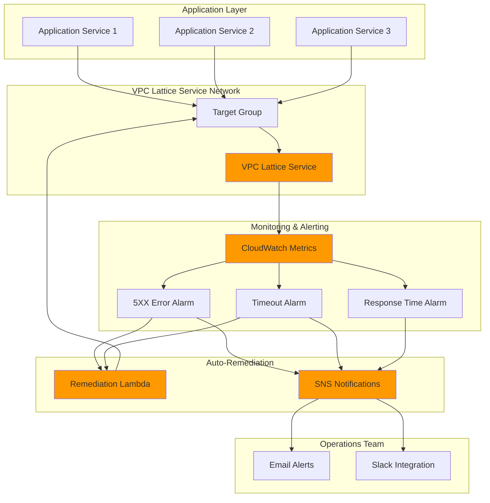

# Application Health Monitoring with VPC Lattice and CloudWatch

## Problem

Organizations running distributed microservices often struggle with detecting and responding to application health issues across their service mesh. Traditional monitoring approaches lack real-time visibility into inter-service communication patterns and fail to provide automated remediation when services become unhealthy. Without proactive health monitoring, degraded services can cascade failures across the entire application ecosystem, leading to extended outages and poor customer experience.

## Solution

Build an automated application health monitoring system using VPC Lattice service metrics, CloudWatch alarms, and Lambda functions to detect unhealthy services and trigger auto-remediation workflows. This solution leverages VPC Lattice's native CloudWatch integration to monitor key health indicators like HTTP error rates, request timeouts, and response times, automatically triggering remediation actions and notifications when thresholds are breached.

## Architecture Diagram



## Prerequisites

1. AWS account with permissions for VPC Lattice, CloudWatch, Lambda, SNS, and IAM
2. AWS CLI v2 installed and configured (or CloudShell access)
3. Existing VPC with at least two subnets in different Availability Zones
4. Basic understanding of CloudWatch metrics and alarms
5. Knowledge of Lambda functions and Python programming
6. Estimated cost: $15-25/month for monitoring resources (excluding application infrastructure)

> **Note**: This recipe requires VPC Lattice which is available in most AWS regions. Verify regional availability before proceeding.

## Preparation

```bash
# Set environment variables
export AWS_REGION=$(aws configure get region)
export AWS_ACCOUNT_ID=$(aws sts get-caller-identity \
    --query Account --output text)

# Generate unique identifiers for resources
RANDOM_SUFFIX=$(aws secretsmanager get-random-password \
    --exclude-punctuation --exclude-uppercase \
    --password-length 6 --require-each-included-type \
    --output text --query RandomPassword)

# Set resource names
export SERVICE_NETWORK_NAME="health-monitor-network-${RANDOM_SUFFIX}"
export SERVICE_NAME="demo-service-${RANDOM_SUFFIX}"
export TARGET_GROUP_NAME="demo-targets-${RANDOM_SUFFIX}"
export LAMBDA_FUNCTION_NAME="health-remediation-${RANDOM_SUFFIX}"
export SNS_TOPIC_NAME="health-alerts-${RANDOM_SUFFIX}"

# Get VPC information (using default VPC for demo)
export VPC_ID=$(aws ec2 describe-vpcs \
    --filters "Name=is-default,Values=true" \
    --query "Vpcs[0].VpcId" --output text)

# Get subnet IDs from default VPC
SUBNET_IDS=$(aws ec2 describe-subnets \
    --filters "Name=vpc-id,Values=${VPC_ID}" \
    --query "Subnets[0:2].SubnetId" --output text)
export SUBNET_1=$(echo ${SUBNET_IDS} | cut -d' ' -f1)
export SUBNET_2=$(echo ${SUBNET_IDS} | cut -d' ' -f2)

echo "✅ Environment configured for VPC ${VPC_ID}"
echo "✅ Using subnets: ${SUBNET_1}, ${SUBNET_2}"
```

## Steps

1. **Create VPC Lattice Service Network**:

   VPC Lattice service networks provide a logical boundary for service-to-service communication and enable centralized monitoring and policy enforcement. Creating a service network establishes the foundation for our health monitoring system by providing a unified namespace where all services can be discovered and monitored through consistent metrics.

   ```bash
   # Create VPC Lattice service network
   aws vpc-lattice create-service-network \
       --name "${SERVICE_NETWORK_NAME}" \
       --auth-type "AWS_IAM" \
       --tags "Environment=demo,Purpose=health-monitoring"
   
   # Get service network ID
   export SERVICE_NETWORK_ID=$(aws vpc-lattice list-service-networks \
       --query "items[?name=='${SERVICE_NETWORK_NAME}'].id" \
       --output text)
   
   # Associate VPC with service network
   aws vpc-lattice create-service-network-vpc-association \
       --service-network-identifier "${SERVICE_NETWORK_ID}" \
       --vpc-identifier "${VPC_ID}" \
       --tags "Environment=demo"
   
   echo "✅ Service network created: ${SERVICE_NETWORK_ID}"
   ```

   The service network now provides the infrastructure layer for secure service communication with built-in observability. VPC Lattice automatically generates detailed metrics for all traffic flowing through the network, enabling comprehensive health monitoring without additional instrumentation.

2. **Create Target Group with Health Checks**:

   Target groups in VPC Lattice define the backend services that will handle requests and include configurable health check parameters. Proper health check configuration is crucial for accurate monitoring as it determines when targets are considered healthy and affects the metrics we'll use for our alarms.

   ```bash
   # Create target group with health check configuration
   aws vpc-lattice create-target-group \
       --name "${TARGET_GROUP_NAME}" \
       --type "INSTANCE" \
       --protocol "HTTP" \
       --port 80 \
       --vpc-identifier "${VPC_ID}" \
       --health-check-config '{
           "enabled": true,
           "protocol": "HTTP",
           "port": 80,
           "path": "/health",
           "healthCheckIntervalSeconds": 30,
           "healthCheckTimeoutSeconds": 5,
           "healthyThresholdCount": 2,
           "unhealthyThresholdCount": 2
       }' \
       --tags "Environment=demo,Purpose=health-monitoring"
   
   # Get target group ID
   export TARGET_GROUP_ID=$(aws vpc-lattice list-target-groups \
       --query "items[?name=='${TARGET_GROUP_NAME}'].id" \
       --output text)
   
   echo "✅ Target group created with health checks: ${TARGET_GROUP_ID}"
   ```

   The target group is now configured with aggressive health checking to quickly detect unhealthy instances. The 30-second interval and 2-failure threshold ensure rapid detection of service degradation while avoiding false positives from temporary network glitches.

3. **Create VPC Lattice Service**:

   VPC Lattice services act as the entry point for client requests and route traffic to healthy targets. The service configuration includes listener rules that determine how requests are processed and provides the service-level metrics we'll monitor for overall application health.

   ```bash
   # Create VPC Lattice service
   aws vpc-lattice create-service \
       --name "${SERVICE_NAME}" \
       --auth-type "AWS_IAM" \
       --tags "Environment=demo,Purpose=health-monitoring"
   
   # Get service ID
   export SERVICE_ID=$(aws vpc-lattice list-services \
       --query "items[?name=='${SERVICE_NAME}'].id" \
       --output text)
   
   # Create service association with service network
   aws vpc-lattice create-service-network-service-association \
       --service-network-identifier "${SERVICE_NETWORK_ID}" \
       --service-identifier "${SERVICE_ID}"
   
   # Create listener for HTTP traffic
   aws vpc-lattice create-listener \
       --service-identifier "${SERVICE_ID}" \
       --name "http-listener" \
       --protocol "HTTP" \
       --port 80 \
       --default-action '{
           "type": "FORWARD",
           "forward": {
               "targetGroups": [{
                   "targetGroupIdentifier": "'${TARGET_GROUP_ID}'",
                   "weight": 100
               }]
           }
       }'
   
   echo "✅ VPC Lattice service created and configured: ${SERVICE_ID}"
   ```

   The service is now operational and will automatically generate CloudWatch metrics for all incoming requests. These metrics include response codes, request timing, and error rates that form the foundation of our health monitoring system.

4. **Create SNS Topic for Notifications**:

   SNS provides the notification infrastructure for alerting operations teams when health issues are detected. Setting up the topic early ensures that both CloudWatch alarms and Lambda functions can send notifications through a centralized communication channel.

   ```bash
   # Create SNS topic for health alerts
   aws sns create-topic \
       --name "${SNS_TOPIC_NAME}" \
       --attributes "DisplayName=Application Health Alerts"
   
   # Get topic ARN
   export SNS_TOPIC_ARN=$(aws sns list-topics \
       --query "Topics[?contains(TopicArn,'${SNS_TOPIC_NAME}')].TopicArn" \
       --output text)
   
   # Subscribe email endpoint (replace with your email)
   # aws sns subscribe \
   #     --topic-arn "${SNS_TOPIC_ARN}" \
   #     --protocol "email" \
   #     --notification-endpoint "your-email@example.com"
   
   echo "✅ SNS topic created: ${SNS_TOPIC_ARN}"
   echo "📧 To receive notifications, subscribe your email:"
   echo "aws sns subscribe --topic-arn ${SNS_TOPIC_ARN} --protocol email --notification-endpoint your-email@example.com"
   ```

   The SNS topic is now ready to deliver real-time notifications when health issues are detected. Operations teams can subscribe multiple endpoints including email, SMS, and webhook integrations for comprehensive alerting coverage.

5. **Create Lambda Function for Auto-Remediation**:

   Lambda functions provide serverless compute for implementing custom remediation logic when health issues are detected. This function will analyze alarm data and take appropriate remediation actions such as restarting unhealthy targets or scaling the service.

   ```bash
   # Create Lambda execution role
   aws iam create-role \
       --role-name "HealthRemediationRole-${RANDOM_SUFFIX}" \
       --assume-role-policy-document '{
           "Version": "2012-10-17",
           "Statement": [{
               "Effect": "Allow",
               "Principal": {"Service": "lambda.amazonaws.com"},
               "Action": "sts:AssumeRole"
           }]
       }'
   
   # Attach basic Lambda execution policy
   aws iam attach-role-policy \
       --role-name "HealthRemediationRole-${RANDOM_SUFFIX}" \
       --policy-arn "arn:aws:iam::aws:policy/service-role/AWSLambdaBasicExecutionRole"
   
   # Create policy for VPC Lattice and SNS access
   aws iam create-policy \
       --policy-name "HealthRemediationPolicy-${RANDOM_SUFFIX}" \
       --policy-document '{
           "Version": "2012-10-17",
           "Statement": [
               {
                   "Effect": "Allow",
                   "Action": [
                       "vpc-lattice:*",
                       "sns:Publish",
                       "cloudwatch:GetMetricStatistics",
                       "ec2:DescribeInstances",
                       "ec2:RebootInstances"
                   ],
                   "Resource": "*"
               }
           ]
       }' \
       --query "Policy.Arn" --output text > policy_arn.txt
   
   export POLICY_ARN=$(cat policy_arn.txt)
   
   # Attach custom policy to role
   aws iam attach-role-policy \
       --role-name "HealthRemediationRole-${RANDOM_SUFFIX}" \
       --policy-arn "${POLICY_ARN}"
   
   # Get role ARN
   export LAMBDA_ROLE_ARN=$(aws iam get-role \
       --role-name "HealthRemediationRole-${RANDOM_SUFFIX}" \
       --query "Role.Arn" --output text)
   
   echo "✅ IAM role created for Lambda: ${LAMBDA_ROLE_ARN}"
   ```

   Now create the Lambda function code and deployment package:

   ```bash
   # Create Lambda function code
   cat > lambda_function.py << 'EOF'
import json
import boto3
import os
import logging
from datetime import datetime, timedelta

logger = logging.getLogger()
logger.setLevel(logging.INFO)

def lambda_handler(event, context):
    """
    Auto-remediation function for VPC Lattice health issues
    """
    try:
        # Parse CloudWatch alarm data
        message = json.loads(event['Records'][0]['Sns']['Message'])
        alarm_name = message['AlarmName']
        alarm_state = message['NewStateValue']
        
        logger.info(f"Processing alarm: {alarm_name}, State: {alarm_state}")
        
        if alarm_state == 'ALARM':
            # Determine remediation action based on alarm type
            if '5XX' in alarm_name:
                remediate_error_rate(message)
            elif 'Timeout' in alarm_name:
                remediate_timeouts(message)
            elif 'ResponseTime' in alarm_name:
                remediate_performance(message)
        
        return {
            'statusCode': 200,
            'body': json.dumps(f'Processed alarm: {alarm_name}')
        }
        
    except Exception as e:
        logger.error(f"Error processing alarm: {str(e)}")
        return {
            'statusCode': 500,
            'body': json.dumps(f'Error: {str(e)}')
        }

def remediate_error_rate(alarm_data):
    """Handle high error rate alarms"""
    logger.info("Implementing error rate remediation")
    
    # In a real implementation, you would:
    # 1. Identify unhealthy targets
    # 2. Remove them from the target group
    # 3. Trigger instance replacement
    # 4. Notify operations team
    
    send_notification(
        "🚨 High Error Rate Detected",
        f"Alarm: {alarm_data['AlarmName']}\n"
        f"Action: Investigating unhealthy targets\n"
        f"Time: {alarm_data['StateChangeTime']}"
    )

def remediate_timeouts(alarm_data):
    """Handle timeout alarms"""
    logger.info("Implementing timeout remediation")
    
    send_notification(
        "⏰ Request Timeouts Detected", 
        f"Alarm: {alarm_data['AlarmName']}\n"
        f"Action: Checking target capacity\n"
        f"Time: {alarm_data['StateChangeTime']}"
    )

def remediate_performance(alarm_data):
    """Handle performance degradation"""
    logger.info("Implementing performance remediation")
    
    send_notification(
        "📉 Performance Degradation Detected",
        f"Alarm: {alarm_data['AlarmName']}\n"
        f"Action: Analyzing response times\n"
        f"Time: {alarm_data['StateChangeTime']}"
    )

def send_notification(subject, message):
    """Send SNS notification"""
    try:
        sns = boto3.client('sns')
        sns.publish(
            TopicArn=os.environ['SNS_TOPIC_ARN'],
            Subject=subject,
            Message=message
        )
        logger.info("Notification sent successfully")
    except Exception as e:
        logger.error(f"Failed to send notification: {str(e)}")
EOF
   
   # Create deployment package
   zip lambda_function.zip lambda_function.py
   
   # Create Lambda function (using Python 3.12 - latest supported)
   aws lambda create-function \
       --function-name "${LAMBDA_FUNCTION_NAME}" \
       --runtime "python3.12" \
       --role "${LAMBDA_ROLE_ARN}" \
       --handler "lambda_function.lambda_handler" \
       --zip-file "fileb://lambda_function.zip" \
       --timeout 60 \
       --memory-size 256 \
       --environment "Variables={SNS_TOPIC_ARN=${SNS_TOPIC_ARN}}" \
       --description "Auto-remediation for VPC Lattice health monitoring"
   
   # Get Lambda function ARN
   export LAMBDA_ARN=$(aws lambda get-function \
       --function-name "${LAMBDA_FUNCTION_NAME}" \
       --query "Configuration.FunctionArn" --output text)
   
   echo "✅ Lambda function created: ${LAMBDA_ARN}"
   ```

   The Lambda function is now deployed with comprehensive remediation logic that can analyze different types of health issues and take appropriate actions. The function integrates with SNS for notifications and includes extensible remediation patterns for common service health problems.

6. **Create CloudWatch Alarms for Health Monitoring**:

   CloudWatch alarms monitor VPC Lattice metrics and trigger remediation actions when health thresholds are breached. These alarms form the core of our monitoring system by continuously evaluating service health indicators and responding to degradation patterns.

   ```bash
   # Create alarm for high 5XX error rate
   aws cloudwatch put-metric-alarm \
       --alarm-name "VPCLattice-${SERVICE_NAME}-High5XXRate" \
       --alarm-description "High 5XX error rate detected" \
       --metric-name "HTTPCode_5XX_Count" \
       --namespace "AWS/VpcLattice" \
       --statistic "Sum" \
       --period 300 \
       --evaluation-periods 2 \
       --threshold 10 \
       --comparison-operator "GreaterThanThreshold" \
       --dimensions "Name=Service,Value=${SERVICE_ID}" \
       --alarm-actions "${SNS_TOPIC_ARN}" \
       --ok-actions "${SNS_TOPIC_ARN}" \
       --treat-missing-data "notBreaching"
   
   # Create alarm for request timeouts
   aws cloudwatch put-metric-alarm \
       --alarm-name "VPCLattice-${SERVICE_NAME}-RequestTimeouts" \
       --alarm-description "High request timeout rate detected" \
       --metric-name "RequestTimeoutCount" \
       --namespace "AWS/VpcLattice" \
       --statistic "Sum" \
       --period 300 \
       --evaluation-periods 2 \
       --threshold 5 \
       --comparison-operator "GreaterThanThreshold" \
       --dimensions "Name=Service,Value=${SERVICE_ID}" \
       --alarm-actions "${SNS_TOPIC_ARN}" \
       --ok-actions "${SNS_TOPIC_ARN}" \
       --treat-missing-data "notBreaching"
   
   # Create alarm for high response times
   aws cloudwatch put-metric-alarm \
       --alarm-name "VPCLattice-${SERVICE_NAME}-HighResponseTime" \
       --alarm-description "High response time detected" \
       --metric-name "RequestTime" \
       --namespace "AWS/VpcLattice" \
       --statistic "Average" \
       --period 300 \
       --evaluation-periods 3 \
       --threshold 2000 \
       --comparison-operator "GreaterThanThreshold" \
       --dimensions "Name=Service,Value=${SERVICE_ID}" \
       --alarm-actions "${SNS_TOPIC_ARN}" \
       --treat-missing-data "notBreaching"
   
   echo "✅ CloudWatch alarms created for comprehensive health monitoring"
   ```

   The alarm configuration provides comprehensive coverage of critical health indicators with appropriate thresholds and evaluation periods. These alarms will automatically trigger when service health degrades, ensuring rapid detection and response to application issues.

7. **Configure SNS Subscription for Lambda Auto-Remediation**:

   Integrating Lambda with SNS alarms enables automated remediation responses when health issues are detected. This creates a closed-loop monitoring system where problems are automatically addressed without manual intervention.

   ```bash
   # Subscribe Lambda function to SNS topic
   aws sns subscribe \
       --topic-arn "${SNS_TOPIC_ARN}" \
       --protocol "lambda" \
       --notification-endpoint "${LAMBDA_ARN}"
   
   # Grant SNS permission to invoke Lambda function
   aws lambda add-permission \
       --function-name "${LAMBDA_FUNCTION_NAME}" \
       --statement-id "allow-sns-invoke-$(date +%s)" \
       --action "lambda:InvokeFunction" \
       --principal "sns.amazonaws.com" \
       --source-arn "${SNS_TOPIC_ARN}"
   
   echo "✅ Lambda function subscribed to SNS topic for auto-remediation"
   ```

   The integration is now complete, enabling automatic remediation workflows when health alarms are triggered. The Lambda function will receive detailed alarm context and can implement sophisticated remediation logic based on the specific health issue detected.

8. **Create CloudWatch Dashboard for Monitoring**:

   A centralized dashboard provides real-time visibility into service health metrics and alarm states. This operational view enables teams to monitor application health trends and validate the effectiveness of automated remediation actions.

   ```bash
   # Create CloudWatch dashboard
   aws cloudwatch put-dashboard \
       --dashboard-name "VPCLattice-Health-${RANDOM_SUFFIX}" \
       --dashboard-body '{
           "widgets": [
               {
                   "type": "metric",
                   "x": 0, "y": 0, "width": 12, "height": 6,
                   "properties": {
                       "metrics": [
                           ["AWS/VpcLattice", "HTTPCode_2XX_Count", "Service", "'${SERVICE_ID}'"],
                           ["AWS/VpcLattice", "HTTPCode_4XX_Count", "Service", "'${SERVICE_ID}'"],
                           ["AWS/VpcLattice", "HTTPCode_5XX_Count", "Service", "'${SERVICE_ID}'"]
                       ],
                       "period": 300,
                       "stat": "Sum",
                       "region": "'${AWS_REGION}'",
                       "title": "HTTP Response Codes"
                   }
               },
               {
                   "type": "metric",
                   "x": 12, "y": 0, "width": 12, "height": 6,
                   "properties": {
                       "metrics": [
                           ["AWS/VpcLattice", "RequestTime", "Service", "'${SERVICE_ID}'"]
                       ],
                       "period": 300,
                       "stat": "Average",
                       "region": "'${AWS_REGION}'",
                       "title": "Request Response Time"
                   }
               },
               {
                   "type": "metric",
                   "x": 0, "y": 6, "width": 12, "height": 6,
                   "properties": {
                       "metrics": [
                           ["AWS/VpcLattice", "TotalRequestCount", "Service", "'${SERVICE_ID}'"],
                           ["AWS/VpcLattice", "RequestTimeoutCount", "Service", "'${SERVICE_ID}'"]
                       ],
                       "period": 300,
                       "stat": "Sum",
                       "region": "'${AWS_REGION}'",
                       "title": "Request Volume and Timeouts"
                   }
               }
           ]
       }'
   
   echo "✅ CloudWatch dashboard created for health monitoring"
   echo "🔗 View dashboard: https://${AWS_REGION}.console.aws.amazon.com/cloudwatch/home?region=${AWS_REGION}#dashboards:name=VPCLattice-Health-${RANDOM_SUFFIX}"
   ```

   The dashboard provides comprehensive visibility into service health with visual representation of key metrics and alarm states. Operations teams can use this centralized view to monitor application health and validate automated remediation effectiveness.

## Validation & Testing

1. **Verify VPC Lattice Configuration**:

   ```bash
   # Check service network status
   aws vpc-lattice get-service-network \
       --service-network-identifier "${SERVICE_NETWORK_ID}"
   
   # Verify service configuration
   aws vpc-lattice get-service \
       --service-identifier "${SERVICE_ID}"
   
   # Check target group health
   aws vpc-lattice list-targets \
       --target-group-identifier "${TARGET_GROUP_ID}"
   ```

   Expected output: Service network and service should show "ACTIVE" status.

2. **Test CloudWatch Metrics Collection**:

   ```bash
   # Check if VPC Lattice metrics are being collected
   aws cloudwatch list-metrics \
       --namespace "AWS/VpcLattice" \
       --dimensions "Name=Service,Value=${SERVICE_ID}"
   
   # Get recent metric data
   aws cloudwatch get-metric-statistics \
       --namespace "AWS/VpcLattice" \
       --metric-name "TotalRequestCount" \
       --dimensions "Name=Service,Value=${SERVICE_ID}" \
       --start-time "$(date -u -d '1 hour ago' +%Y-%m-%dT%H:%M:%S)" \
       --end-time "$(date -u +%Y-%m-%dT%H:%M:%S)" \
       --period 300 \
       --statistics "Sum"
   ```

3. **Simulate Health Issue for Testing**:

   ```bash
   # Test Lambda function manually
   aws lambda invoke \
       --function-name "${LAMBDA_FUNCTION_NAME}" \
       --payload '{
           "Records": [{
               "Sns": {
                   "Message": "{\"AlarmName\":\"Test-5XX-Alarm\",\"NewStateValue\":\"ALARM\",\"StateChangeTime\":\"'$(date -u +%Y-%m-%dT%H:%M:%S.000Z)'\"}"
               }
           }]
       }' \
       response.json
   
   # Check Lambda execution result
   cat response.json
   ```

4. **Verify SNS Notifications**:

   ```bash
   # Test SNS topic directly
   aws sns publish \
       --topic-arn "${SNS_TOPIC_ARN}" \
       --subject "Health Monitoring Test" \
       --message "Testing health monitoring notification system at $(date)"
   ```

## Cleanup

1. **Remove CloudWatch Alarms and Dashboard**:

   ```bash
   # Delete CloudWatch alarms
   aws cloudwatch delete-alarms \
       --alarm-names \
       "VPCLattice-${SERVICE_NAME}-High5XXRate" \
       "VPCLattice-${SERVICE_NAME}-RequestTimeouts" \
       "VPCLattice-${SERVICE_NAME}-HighResponseTime"
   
   # Delete CloudWatch dashboard
   aws cloudwatch delete-dashboards \
       --dashboard-names "VPCLattice-Health-${RANDOM_SUFFIX}"
   
   echo "✅ CloudWatch resources deleted"
   ```

2. **Remove Lambda Function and IAM Resources**:

   ```bash
   # Delete Lambda function
   aws lambda delete-function \
       --function-name "${LAMBDA_FUNCTION_NAME}"
   
   # Detach and delete IAM policies
   aws iam detach-role-policy \
       --role-name "HealthRemediationRole-${RANDOM_SUFFIX}" \
       --policy-arn "${POLICY_ARN}"
   
   aws iam detach-role-policy \
       --role-name "HealthRemediationRole-${RANDOM_SUFFIX}" \
       --policy-arn "arn:aws:iam::aws:policy/service-role/AWSLambdaBasicExecutionRole"
   
   # Delete custom policy and role
   aws iam delete-policy --policy-arn "${POLICY_ARN}"
   aws iam delete-role --role-name "HealthRemediationRole-${RANDOM_SUFFIX}"
   
   echo "✅ Lambda and IAM resources deleted"
   ```

3. **Remove SNS Topic**:

   ```bash
   # Delete SNS topic (this will also remove all subscriptions)
   aws sns delete-topic --topic-arn "${SNS_TOPIC_ARN}"
   
   echo "✅ SNS topic deleted"
   ```

4. **Remove VPC Lattice Resources**:

   ```bash
   # Delete service network association
   SERVICE_ASSOCIATION_ID=$(aws vpc-lattice list-service-network-service-associations \
       --service-network-identifier "${SERVICE_NETWORK_ID}" \
       --query "items[?serviceId=='${SERVICE_ID}'].id" --output text)
   
   aws vpc-lattice delete-service-network-service-association \
       --service-network-service-association-identifier "${SERVICE_ASSOCIATION_ID}"
   
   # Delete VPC association
   VPC_ASSOCIATION_ID=$(aws vpc-lattice list-service-network-vpc-associations \
       --service-network-identifier "${SERVICE_NETWORK_ID}" \
       --query "items[?vpcId=='${VPC_ID}'].id" --output text)
   
   aws vpc-lattice delete-service-network-vpc-association \
       --service-network-vpc-association-identifier "${VPC_ASSOCIATION_ID}"
   
   # Delete service, target group, and service network
   aws vpc-lattice delete-service --service-identifier "${SERVICE_ID}"
   aws vpc-lattice delete-target-group --target-group-identifier "${TARGET_GROUP_ID}"
   aws vpc-lattice delete-service-network --service-network-identifier "${SERVICE_NETWORK_ID}"
   
   echo "✅ VPC Lattice resources deleted"
   ```

5. **Clean Up Local Files**:

   ```bash
   # Remove temporary files
   rm -f lambda_function.py lambda_function.zip response.json policy_arn.txt
   
   echo "✅ Local files cleaned up"
   ```

## Discussion

This solution demonstrates how to build a comprehensive application health monitoring system using AWS VPC Lattice's native observability features combined with CloudWatch alarms and automated remediation. VPC Lattice automatically captures detailed metrics for every request flowing through your service mesh, providing rich data for health monitoring without requiring application-level instrumentation. The service follows the [AWS Well-Architected Framework](https://docs.aws.amazon.com/wellarchitected/latest/framework/welcome.html) principles for operational excellence and reliability.

The architecture implements automated monitoring, proactive alerting, and self-healing capabilities that align with AWS operational best practices. The CloudWatch alarms monitor critical health indicators including HTTP error rates, request timeouts, and response time degradation. When thresholds are breached, the system automatically triggers both notifications to operations teams and Lambda-based remediation workflows that can take corrective actions such as removing unhealthy targets or scaling services.

The Lambda remediation function provides a flexible framework for implementing custom health response logic. In production environments, this function could integrate with additional AWS services like Auto Scaling Groups, ECS services, or EC2 instances to perform sophisticated remediation actions such as instance replacement, capacity scaling, or traffic rerouting. The function's design allows for easy extension to handle different types of health issues with appropriate remediation strategies.

Key benefits of this approach include reduced mean time to detection (MTTD) and mean time to recovery (MTTR) through automated monitoring and response. The system provides continuous visibility into application health while reducing the operational burden on engineering teams. The integration between VPC Lattice metrics, CloudWatch alarms, and Lambda functions creates a closed-loop system that can automatically address many common service health issues before they impact end users. For comprehensive implementation guidance, refer to the [VPC Lattice monitoring documentation](https://docs.aws.amazon.com/vpc-lattice/latest/ug/monitoring-overview.html).

> **Tip**: Configure different alarm thresholds for development, staging, and production environments to avoid alert fatigue while ensuring appropriate sensitivity to health issues in each environment. For comprehensive monitoring, consider implementing [AWS X-Ray tracing](https://docs.aws.amazon.com/xray/latest/devguide/) to gain deeper insights into request flows across your service mesh.

## Challenge

Extend this health monitoring solution by implementing these enhancements:

1. **Advanced Remediation Actions**: Enhance the Lambda function to perform automatic instance replacement, container restarts, or traffic rerouting based on specific health issue patterns. Integrate with Auto Scaling Groups and ECS services for comprehensive remediation capabilities.

2. **Multi-Region Health Monitoring**: Extend the solution to monitor VPC Lattice services across multiple AWS regions, implementing cross-region failover and health correlation to detect regional service degradation patterns.

3. **Predictive Health Analytics**: Integrate with Amazon SageMaker to build machine learning models that can predict service health issues before they occur, using historical metrics and patterns to trigger proactive remediation actions.

4. **Integration with Service Mesh**: Combine VPC Lattice monitoring with AWS App Mesh or third-party service mesh solutions to provide comprehensive observability across hybrid service architectures with unified health monitoring dashboards.

5. **Advanced Notification Channels**: Implement integration with PagerDuty, Slack, Microsoft Teams, and JIRA to create sophisticated incident response workflows that automatically create tickets, escalate issues, and coordinate response teams based on health issue severity and impact.

## Infrastructure Code

### Available Infrastructure as Code:

- [Infrastructure Code Overview](code/README.md) - Detailed description of all infrastructure components
- [AWS CDK (Python)](code/cdk-python/) - AWS CDK Python implementation
- [AWS CDK (TypeScript)](code/cdk-typescript/) - AWS CDK TypeScript implementation
- [CloudFormation](code/cloudformation.yaml) - AWS CloudFormation template
- [Bash CLI Scripts](code/scripts/) - Example bash scripts using AWS CLI commands to deploy infrastructure
- [Terraform](code/terraform/) - Terraform configuration files