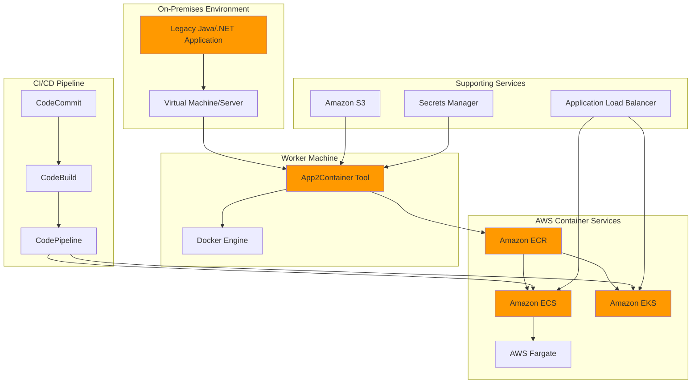

# Application Modernization with App2Container

## Problem

Enterprise organizations face significant challenges modernizing legacy applications running on traditional virtual machines and physical servers. These applications often lack container-native architectures, rely on complex dependencies, and require extensive refactoring to run in modern cloud environments. Traditional lift-and-shift approaches provide limited benefits, while complete re-architecting is time-consuming and risky. Organizations need a streamlined approach to containerize existing applications without source code changes, enabling them to leverage modern container orchestration platforms like Amazon ECS and EKS while maintaining application functionality and reducing operational overhead.

## Solution

AWS App2Container (A2C) provides an automated solution for containerizing existing Java and .NET applications running on virtual machines. The tool analyzes application dependencies, generates Docker containers, and creates deployment artifacts for AWS container services. This approach enables organizations to modernize legacy applications by transforming them into containerized workloads that can run on Amazon ECS, Amazon EKS, or AWS App Runner, complete with CI/CD pipelines for automated deployment and scaling capabilities.

## Architecture Diagram



## Prerequisites

1. AWS account with appropriate permissions for App2Container, ECS, EKS, ECR, and CodePipeline
2. AWS CLI v2 installed and configured (or AWS CloudShell)
3. A Linux or Windows server with running Java/.NET applications
4. Docker Engine 18.06 or later installed on worker machine
5. Root access (Linux) or Administrator access (Windows) on application servers
6. Understanding of containerization concepts and AWS container services
7. At least 20-30 GB of free disk space on worker machine
8. Estimated cost: $15-30/hour for container services and supporting infrastructure

> **Note**: This recipe demonstrates containerizing a sample Java application. For production workloads, ensure proper security assessments and testing before deployment.

## Preparation

```bash
# Set environment variables
export AWS_REGION=$(aws configure get region)
export AWS_ACCOUNT_ID=$(aws sts get-caller-identity \
    --query Account --output text)

# Generate unique identifiers for resources
RANDOM_SUFFIX=$(aws secretsmanager get-random-password \
    --exclude-punctuation --exclude-uppercase \
    --password-length 6 --require-each-included-type \
    --output text --query RandomPassword)

export CLUSTER_NAME="app2container-cluster-${RANDOM_SUFFIX}"
export ECR_REPO_NAME="modernized-app-${RANDOM_SUFFIX}"
export S3_BUCKET_NAME="app2container-artifacts-${RANDOM_SUFFIX}"
export CODECOMMIT_REPO_NAME="app2container-pipeline-${RANDOM_SUFFIX}"

# Create S3 bucket for App2Container artifacts
aws s3 mb s3://${S3_BUCKET_NAME} --region ${AWS_REGION}

# Create ECR repository
aws ecr create-repository \
    --repository-name ${ECR_REPO_NAME} \
    --region ${AWS_REGION}

# Create CodeCommit repository for CI/CD pipeline
aws codecommit create-repository \
    --repository-name ${CODECOMMIT_REPO_NAME} \
    --repository-description "App2Container modernization pipeline"

echo "✅ Preparation complete with bucket: ${S3_BUCKET_NAME}"
```

## Steps

1. **Install and Configure App2Container**:

   AWS App2Container simplifies application modernization by automatically analyzing legacy applications and generating container images without requiring source code changes. This tool addresses the complexity of manual containerization efforts, which typically require deep understanding of application dependencies, configuration files, and runtime requirements. By automating the discovery and analysis process, App2Container reduces the risk and time associated with containerization projects while ensuring applications maintain their functionality in containerized environments.

   ```bash
   # Download and install App2Container (Linux)
   curl -o AWSApp2Container-installer-linux.tar.gz \
       https://app2container-release-us-east-1.s3.us-east-1.amazonaws.com/latest/linux/AWSApp2Container-installer-linux.tar.gz
   
   tar xzf AWSApp2Container-installer-linux.tar.gz
   sudo ./install.sh
   
   # Verify installation
   app2container --version
   
   echo "✅ App2Container installed successfully"
   ```

   App2Container is now installed and ready to analyze your legacy applications. The tool provides a comprehensive modernization workflow that includes application discovery, dependency analysis, containerization, and AWS deployment artifact generation. This foundation enables your organization to begin the modernization journey with confidence, knowing that the containerization process follows AWS best practices and security standards as documented in the [AWS App2Container User Guide](https://docs.aws.amazon.com/app2container/latest/UserGuide/what-is-a2c.html).

2. **Initialize App2Container with AWS Configuration**:

   The initialization process establishes the connection between App2Container and your AWS environment, configuring essential parameters for containerization and deployment workflows. This step is critical because it defines where App2Container stores artifacts, how it connects to AWS services, and establishes security boundaries for the modernization process. Proper initialization ensures that generated container images and deployment artifacts align with your organization's AWS architecture and security requirements.

   ```bash
   # Initialize App2Container with interactive setup
   sudo app2container init \
       --workspace /opt/app2container \
       --aws-profile default \
       --s3-bucket ${S3_BUCKET_NAME} \
       --enable-metrics
   
   # Verify configuration
   sudo app2container config
   
   echo "✅ App2Container initialized with AWS configuration"
   ```

   App2Container is now configured to work with your AWS environment, establishing secure connections to essential services like Amazon S3 for artifact storage and Amazon ECR for container image management. The initialization creates a workspace that serves as the central location for all modernization activities, ensuring that application analysis, containerization, and deployment artifact generation occur in an organized, secure manner. This configuration follows AWS security best practices for service-to-service communication and data storage.

3. **Create Application Inventory**:

   Application inventory is the foundation of successful modernization, providing App2Container with a comprehensive understanding of your running applications and their characteristics. This discovery process analyzes active processes, identifies supported application types (Java and .NET), and catalogs key information such as process IDs, application servers, and runtime environments. The inventory phase eliminates guesswork from modernization planning by providing concrete data about application architectures and deployment patterns that inform containerization strategies.

   ```bash
   # Discover running applications on local server
   sudo app2container inventory
   
   # Store the output in a variable for later use
   export INVENTORY_FILE="/opt/app2container/inventory.json"
   
   # Display discovered applications
   cat ${INVENTORY_FILE}
   
   # Extract first Java application ID (adjust based on your environment)
   export APP_ID=$(jq -r '.[] | select(.applicationType == "java") | .applicationId' ${INVENTORY_FILE} | head -1)
   
   echo "✅ Application inventory created. Found application: ${APP_ID}"
   ```

   The inventory process has identified your applications and assigned unique identifiers that App2Container uses throughout the modernization workflow. This application ID becomes the primary reference for all subsequent analysis, containerization, and deployment activities. The automated discovery ensures accuracy and completeness, identifying applications that manual processes might overlook while providing structured data that supports informed decision-making about modernization priorities and approaches.

4. **Analyze Application Dependencies**:

   Dependency analysis forms the core of App2Container's intelligent containerization capabilities, examining your application's runtime environment, libraries, configuration files, and system dependencies. This deep analysis identifies everything required for your application to function correctly in a containerized environment, including shared libraries, environment variables, network configurations, and file system dependencies. The analysis phase reduces containerization risk by ensuring no critical dependencies are overlooked during the modernization process.

   ```bash
   # Analyze the discovered application
   sudo app2container analyze --application-id ${APP_ID}
   
   # Review the analysis results
   export ANALYSIS_FILE="/opt/app2container/${APP_ID}/analysis.json"
   cat ${ANALYSIS_FILE}
   
   # Review containerization recommendations
   echo "Application analysis complete. Key findings:"
   jq '.containerParameters.imageTag' ${ANALYSIS_FILE}
   jq '.containerParameters.imageBaseOS' ${ANALYSIS_FILE}
   
   echo "✅ Application analysis completed for ${APP_ID}"
   ```

   App2Container has completed a comprehensive analysis of your application, creating a detailed blueprint for containerization that includes optimal base operating system selection, required dependencies, and recommended container configurations. This analysis report serves as the authoritative reference for containerization decisions, ensuring that the resulting container image maintains full application functionality while following container security and optimization best practices as outlined in [AWS App2Container compatibility documentation](https://docs.aws.amazon.com/app2container/latest/UserGuide/supported-applications.html).

5. **Extract Application Artifacts**:

   Artifact extraction transforms the analysis results into concrete containerization assets, generating a production-ready Dockerfile and collecting all necessary application files, configurations, and dependencies. This process creates a self-contained package that includes everything required to build and run your application in a container environment. The extraction phase represents the transition from analysis to implementation, producing tangible artifacts that development teams can review, customize, and deploy using standard container workflows.

   ```bash
   # Extract application artifacts for containerization
   sudo app2container extract --application-id ${APP_ID}
   
   # Review extracted artifacts
   export EXTRACT_DIR="/opt/app2container/${APP_ID}/extract"
   ls -la ${EXTRACT_DIR}
   
   # Check the generated Dockerfile
   cat ${EXTRACT_DIR}/Dockerfile
   
   echo "✅ Application artifacts extracted to ${EXTRACT_DIR}"
   ```

   App2Container has successfully extracted all application artifacts and generated a comprehensive Dockerfile that follows Docker best practices for security, performance, and maintainability. The extraction directory contains everything needed for containerization, including application binaries, configuration files, startup scripts, and dependency specifications. This automated generation eliminates manual Dockerfile creation errors while ensuring the resulting container image is optimized for your specific application requirements and deployment targets.

6. **Containerize the Application**:

   Containerization transforms your traditional application into a portable, scalable container image that can run consistently across different environments. This process leverages Docker's isolation capabilities to package your application with its dependencies into a lightweight, immutable artifact. Container images provide significant operational benefits including rapid deployment, horizontal scaling, efficient resource utilization, and simplified dependency management compared to traditional VM-based deployments.

   ```bash
   # Build the container image
   sudo app2container containerize --application-id ${APP_ID}
   
   # Verify container image was created
   docker images | grep ${APP_ID}
   
   # Test the containerized application locally
   export CONTAINER_IMAGE=$(docker images --format "table {{.Repository}}:{{.Tag}}" | grep ${APP_ID} | head -1)
   
   # Run container locally to test (adjust port mapping as needed)
   docker run -d -p 8080:8080 --name test-${APP_ID} ${CONTAINER_IMAGE}
   
   # Check container status
   docker ps | grep test-${APP_ID}
   
   # Stop test container
   docker stop test-${APP_ID} && docker rm test-${APP_ID}
   
   echo "✅ Application containerized successfully: ${CONTAINER_IMAGE}"
   ```

   Your application is now successfully containerized and running in a Docker environment, demonstrating that the modernization process preserves application functionality while enabling modern deployment patterns. The container image represents a complete, portable version of your application that can be deployed to any container orchestration platform, including Amazon ECS, Amazon EKS, or AWS App Runner. This containerization establishes the foundation for leveraging AWS's managed container services for enhanced scalability, reliability, and operational efficiency.

7. **Generate AWS Deployment Artifacts**:

   AWS deployment artifact generation creates production-ready infrastructure as code templates that follow AWS Well-Architected principles for container deployments. This process transforms your containerized application into a complete AWS deployment solution, including ECS task definitions, IAM roles, security groups, load balancers, and CloudFormation templates. These artifacts enable your organization to deploy applications using AWS best practices for security, scalability, and operational excellence without requiring deep expertise in AWS container services configuration.

   ```bash
   # Generate deployment artifacts for ECS
   sudo app2container generate app-deployment \
       --application-id ${APP_ID} \
       --deploy-target ecs
   
   # Review generated CloudFormation templates
   export DEPLOYMENT_DIR="/opt/app2container/${APP_ID}/deployment"
   ls -la ${DEPLOYMENT_DIR}
   
   # Display ECS task definition
   cat ${DEPLOYMENT_DIR}/ecs-task-def.json
   
   # Review CloudFormation template
   cat ${DEPLOYMENT_DIR}/ecs-master.yml
   
   echo "✅ ECS deployment artifacts generated"
   ```

   App2Container has generated comprehensive AWS deployment artifacts that include CloudFormation templates, ECS task definitions, and supporting configuration files optimized for your application. These artifacts follow AWS container deployment best practices, including proper IAM permissions, security group configurations, and resource tagging strategies. The generated templates enable repeatable, automated deployments across multiple environments while ensuring compliance with AWS security and operational standards as documented in [AWS container deployment patterns](https://docs.aws.amazon.com/whitepapers/latest/containers-on-aws/cicd.html).

8. **Create ECS Cluster and Deploy Application**:

   Amazon ECS provides a managed container orchestration service that eliminates the complexity of managing container infrastructure while providing enterprise-grade reliability, security, and scalability. By deploying to ECS with AWS Fargate, your applications benefit from serverless container execution, automatic scaling, and integrated AWS security features. This deployment model removes the operational overhead of managing EC2 instances while ensuring your containerized applications can scale seamlessly based on demand patterns.

   ```bash
   # Create ECS cluster
   aws ecs create-cluster \
       --cluster-name ${CLUSTER_NAME} \
       --capacity-providers FARGATE \
       --default-capacity-provider-strategy \
       capacityProvider=FARGATE,weight=1
   
   # Deploy the containerized application to ECS using CloudFormation
   aws cloudformation create-stack \
       --stack-name app2container-deployment-${APP_ID} \
       --template-body file://${DEPLOYMENT_DIR}/ecs-master.yml \
       --capabilities CAPABILITY_IAM \
       --parameters ParameterKey=ClusterName,ParameterValue=${CLUSTER_NAME}
   
   # Wait for deployment to complete
   aws cloudformation wait stack-create-complete \
       --stack-name app2container-deployment-${APP_ID}
   
   # Monitor deployment progress
   aws ecs describe-clusters --clusters ${CLUSTER_NAME}
   
   # List running services
   aws ecs list-services --cluster ${CLUSTER_NAME}
   
   echo "✅ Application deployed to ECS cluster: ${CLUSTER_NAME}"
   ```

   Your modernized application is now running on Amazon ECS, leveraging AWS Fargate's serverless compute engine for containers. This deployment provides automatic high availability across multiple Availability Zones, integrated security through AWS IAM and VPC networking, and seamless integration with other AWS services. The ECS deployment enables your application to benefit from AWS's enterprise-grade infrastructure while maintaining the flexibility to scale, update, and manage your containerized workloads using familiar AWS tools and APIs as detailed in [Amazon ECS developer guide](https://docs.aws.amazon.com/AmazonECS/latest/developerguide/welcome.html).

9. **Set up CI/CD Pipeline**:

   Continuous integration and continuous deployment (CI/CD) pipelines transform application modernization from a one-time project into an ongoing operational capability. App2Container generates complete CodePipeline workflows that automate container image building, testing, and deployment across multiple environments. This automation ensures that future application updates benefit from the same rigorous containerization and deployment processes, while providing teams with the confidence to iterate rapidly on modernized applications.

   ```bash
   # Generate CI/CD pipeline artifacts
   sudo app2container generate pipeline \
       --application-id ${APP_ID} \
       --pipeline-type codepipeline
   
   # Review pipeline configuration
   export PIPELINE_DIR="/opt/app2container/${APP_ID}/pipeline"
   cat ${PIPELINE_DIR}/codepipeline.yml
   
   # Deploy the CI/CD pipeline
   aws cloudformation create-stack \
       --stack-name app2container-pipeline-${APP_ID} \
       --template-body file://${PIPELINE_DIR}/codepipeline.yml \
       --capabilities CAPABILITY_IAM \
       --parameters ParameterKey=RepositoryName,ParameterValue=${CODECOMMIT_REPO_NAME}
   
   # Wait for pipeline creation
   aws cloudformation wait stack-create-complete \
       --stack-name app2container-pipeline-${APP_ID}
   
   echo "✅ CI/CD pipeline deployed successfully"
   ```

   Your CI/CD pipeline is now operational, providing automated deployment capabilities that enable rapid iteration and reliable releases for your modernized application. The pipeline integrates CodeCommit for source control, CodeBuild for container image creation, and CodePipeline for orchestrating the entire deployment workflow. This automation ensures consistent deployments while enabling development teams to focus on application features rather than deployment complexity, following [AWS CI/CD best practices for container applications](https://docs.aws.amazon.com/app2container/latest/UserGuide/deploy-overview.html).

> **Warning**: Before deploying to production environments, conduct thorough security assessments of containerized applications and implement additional security scanning in your CI/CD pipeline to identify vulnerabilities.

10. **Configure Application Load Balancer**:

    Application Load Balancers provide advanced load balancing features for containerized applications, including path-based routing, health checks, and integration with AWS security services. The ALB distributes incoming application traffic across multiple targets while providing SSL termination and web application firewall capabilities.

    ```bash
    # Get default VPC and subnets
    export VPC_ID=$(aws ec2 describe-vpcs \
        --filters "Name=isDefault,Values=true" \
        --query 'Vpcs[0].VpcId' --output text)
    
    export SUBNET_IDS=$(aws ec2 describe-subnets \
        --filters "Name=vpc-id,Values=${VPC_ID}" \
        --query 'Subnets[*].SubnetId' --output text | tr '\t' ',')
    
    # Create security group for ALB
    aws ec2 create-security-group \
        --group-name app2container-alb-sg-${RANDOM_SUFFIX} \
        --description "Security group for App2Container ALB" \
        --vpc-id ${VPC_ID}
    
    export ALB_SG_ID=$(aws ec2 describe-security-groups \
        --group-names app2container-alb-sg-${RANDOM_SUFFIX} \
        --query 'SecurityGroups[0].GroupId' --output text)
    
    # Add HTTP ingress rule
    aws ec2 authorize-security-group-ingress \
        --group-id ${ALB_SG_ID} \
        --protocol tcp \
        --port 80 \
        --cidr 0.0.0.0/0
    
    echo "✅ Load balancer security group configured"
    ```

11. **Monitor and Validate Deployment**:

    ```bash
    # Check ECS service status
    export SERVICE_NAME=$(aws ecs list-services \
        --cluster ${CLUSTER_NAME} \
        --query 'serviceArns[0]' --output text | cut -d'/' -f2)
    
    aws ecs describe-services \
        --cluster ${CLUSTER_NAME} \
        --services ${SERVICE_NAME} \
        --query 'services[0].{Status:status,Running:runningCount,Desired:desiredCount}'
    
    # Get task details
    export TASK_ARN=$(aws ecs list-tasks \
        --cluster ${CLUSTER_NAME} \
        --service-name ${SERVICE_NAME} \
        --query 'taskArns[0]' --output text)
    
    aws ecs describe-tasks \
        --cluster ${CLUSTER_NAME} \
        --tasks ${TASK_ARN} \
        --query 'tasks[0].{Status:lastStatus,Health:healthStatus}'
    
    # Check application logs
    export LOG_GROUP="/ecs/${APP_ID}"
    aws logs describe-log-streams \
        --log-group-name ${LOG_GROUP} \
        --order-by LastEventTime \
        --descending \
        --max-items 1
    
    echo "✅ Deployment monitoring complete"
    ```

12. **Configure Auto Scaling and Monitoring**:

    ```bash
    # Create Application Auto Scaling target for ECS service
    aws application-autoscaling register-scalable-target \
        --service-namespace ecs \
        --resource-id service/${CLUSTER_NAME}/${SERVICE_NAME} \
        --scalable-dimension ecs:service:DesiredCount \
        --min-capacity 1 \
        --max-capacity 10
    
    # Create scaling policy
    aws application-autoscaling put-scaling-policy \
        --service-namespace ecs \
        --resource-id service/${CLUSTER_NAME}/${SERVICE_NAME} \
        --scalable-dimension ecs:service:DesiredCount \
        --policy-name cpu-scaling-policy \
        --policy-type TargetTrackingScaling \
        --target-tracking-scaling-policy-configuration '{
            "TargetValue": 70.0,
            "PredefinedMetricSpecification": {
                "PredefinedMetricType": "ECSServiceAverageCPUUtilization"
            },
            "ScaleOutCooldown": 300,
            "ScaleInCooldown": 300
        }'
    
    # Create CloudWatch dashboard
    aws cloudwatch put-dashboard \
        --dashboard-name "App2Container-${APP_ID}" \
        --dashboard-body '{
            "widgets": [
                {
                    "type": "metric",
                    "properties": {
                        "metrics": [
                            ["AWS/ECS", "CPUUtilization", "ServiceName", "'${SERVICE_NAME}'", "ClusterName", "'${CLUSTER_NAME}'"]
                        ],
                        "period": 300,
                        "stat": "Average",
                        "region": "'${AWS_REGION}'",
                        "title": "ECS CPU Utilization"
                    }
                }
            ]
        }'
    
    echo "✅ Auto scaling and monitoring configured"
    ```

## Validation & Testing

1. **Verify Container Image**:

   ```bash
   # Check container image in ECR
   aws ecr describe-images \
       --repository-name ${ECR_REPO_NAME} \
       --query 'imageDetails[0].{Tags:imageTags,Size:imageSizeInBytes,Pushed:imagePushedAt}'
   
   # Test container locally
   docker run -d -p 8080:8080 --name validation-test ${CONTAINER_IMAGE}
   
   # Check if application responds
   curl -f http://localhost:8080/health || echo "Application health check endpoint not available"
   
   # Clean up test container
   docker stop validation-test && docker rm validation-test
   ```

   Expected output: Container image successfully created and application responds to requests

2. **Test ECS Deployment**:

   ```bash
   # Verify ECS service is running
   aws ecs describe-services \
       --cluster ${CLUSTER_NAME} \
       --services ${SERVICE_NAME} \
       --query 'services[0].{Status:status,Running:runningCount,Desired:desiredCount}'
   
   # Check task health
   aws ecs describe-tasks \
       --cluster ${CLUSTER_NAME} \
       --tasks ${TASK_ARN} \
       --query 'tasks[0].{Health:healthStatus,Status:lastStatus}'
   ```

   Expected output: Service status shows ACTIVE with running tasks equal to desired count

3. **Validate CI/CD Pipeline**:

   ```bash
   # Check pipeline status
   aws codepipeline get-pipeline-state \
       --name app2container-pipeline-${APP_ID} \
       --query 'stageStates[*].{Stage:stageName,Status:latestExecution.status}'
   
   # List pipeline executions
   aws codepipeline list-pipeline-executions \
       --pipeline-name app2container-pipeline-${APP_ID} \
       --max-items 5
   ```

   Expected output: Pipeline shows successful execution stages

4. **Performance Testing**:

   ```bash
   # Get ECS service endpoint (if ALB is configured)
   export ALB_DNS=$(aws elbv2 describe-load-balancers \
       --names app2container-alb-${RANDOM_SUFFIX} \
       --query 'LoadBalancers[0].DNSName' --output text 2>/dev/null || echo "ALB not configured")
   
   # Simple load test (requires ApacheBench)
   if command -v ab &> /dev/null; then
       ab -n 100 -c 10 http://${ALB_DNS}/
   else
       echo "ApacheBench not available for load testing"
   fi
   ```

## Cleanup

1. **Stop and Remove ECS Resources**:

   ```bash
   # Update ECS service to 0 desired count
   aws ecs update-service \
       --cluster ${CLUSTER_NAME} \
       --service ${SERVICE_NAME} \
       --desired-count 0
   
   # Wait for tasks to stop
   aws ecs wait services-stable \
       --cluster ${CLUSTER_NAME} \
       --services ${SERVICE_NAME}
   
   # Delete ECS service
   aws ecs delete-service \
       --cluster ${CLUSTER_NAME} \
       --service ${SERVICE_NAME}
   
   echo "✅ ECS service removed"
   ```

2. **Delete CloudFormation Stacks**:

   ```bash
   # Delete deployment stack
   aws cloudformation delete-stack \
       --stack-name app2container-deployment-${APP_ID}
   
   # Delete CodePipeline stack
   aws cloudformation delete-stack \
       --stack-name app2container-pipeline-${APP_ID}
   
   # Wait for stack deletion
   aws cloudformation wait stack-delete-complete \
       --stack-name app2container-deployment-${APP_ID}
   
   aws cloudformation wait stack-delete-complete \
       --stack-name app2container-pipeline-${APP_ID}
   
   echo "✅ CloudFormation stacks removed"
   ```

3. **Remove Container Images and Repositories**:

   ```bash
   # Delete ECR repository
   aws ecr delete-repository \
       --repository-name ${ECR_REPO_NAME} \
       --force
   
   # Delete CodeCommit repository
   aws codecommit delete-repository \
       --repository-name ${CODECOMMIT_REPO_NAME}
   
   # Remove local Docker images
   docker rmi ${CONTAINER_IMAGE} || echo "Local image already removed"
   
   echo "✅ Container repositories removed"
   ```

4. **Clean Up Supporting Resources**:

   ```bash
   # Delete ECS cluster
   aws ecs delete-cluster --cluster ${CLUSTER_NAME}
   
   # Delete S3 bucket and contents
   aws s3 rm s3://${S3_BUCKET_NAME} --recursive
   aws s3 rb s3://${S3_BUCKET_NAME}
   
   # Delete security group
   aws ec2 delete-security-group \
       --group-id ${ALB_SG_ID}
   
   # Delete CloudWatch dashboard
   aws cloudwatch delete-dashboards \
       --dashboard-names "App2Container-${APP_ID}"
   
   echo "✅ All supporting resources cleaned up"
   ```

5. **Remove App2Container Artifacts**:

   ```bash
   # Clean up App2Container workspace
   sudo rm -rf /opt/app2container/${APP_ID}
   
   # Remove downloaded installers
   rm -f AWSApp2Container-installer-linux.tar.gz
   
   # Clear environment variables
   unset APP_ID CLUSTER_NAME ECR_REPO_NAME S3_BUCKET_NAME CODECOMMIT_REPO_NAME
   unset CONTAINER_IMAGE SERVICE_NAME TASK_ARN ALB_SG_ID
   
   echo "✅ App2Container artifacts cleaned up"
   ```

## Discussion

AWS App2Container revolutionizes application modernization by providing an automated, low-risk approach to containerizing legacy applications. The tool addresses key challenges organizations face when modernizing their application portfolio: dependency analysis, container image creation, and AWS deployment configuration. By automatically discovering application dependencies and generating optimized Docker containers, App2Container eliminates much of the manual work traditionally required for containerization projects while following the AWS Well-Architected Framework principles.

The containerization process leverages Docker best practices, creating lightweight, secure container images that maintain application functionality while enabling modern deployment patterns. App2Container's integration with AWS services provides a complete modernization solution, generating CloudFormation templates, ECS task definitions, and CI/CD pipelines that follow AWS Well-Architected principles. This approach ensures that containerized applications benefit from AWS's managed services, automatic scaling, and robust monitoring capabilities while maintaining the security posture required for enterprise workloads.

For organizations with complex application portfolios, App2Container's worker machine capability enables centralized modernization efforts. IT teams can analyze and containerize applications across multiple servers without installing Docker or other containerization tools on production systems. The tool's support for both remote and local containerization workflows provides flexibility for different organizational constraints and security requirements, making it suitable for both cloud-native and hybrid cloud deployment scenarios.

The generated CI/CD pipelines integrate seamlessly with AWS DevOps services, enabling continuous deployment and automated testing workflows. This integration ensures that modernized applications can be maintained and updated using modern DevOps practices, reducing operational overhead and increasing deployment velocity. The combination of containerization and automated deployment pipelines provides a foundation for further modernization efforts, including microservices decomposition and cloud-native architecture adoption.

> **Tip**: Use App2Container's analysis phase to identify optimization opportunities before containerization. Review the generated reports to understand application dependencies and potential security considerations. For comprehensive modernization strategies, consult the [AWS Prescriptive Guidance for Java application migration](https://docs.aws.amazon.com/prescriptive-guidance/latest/patterns/migrate-on-premises-java-applications-to-aws-using-aws-app2container.html) and [AWS Application Migration patterns](https://docs.aws.amazon.com/app2container/latest/UserGuide/deploy-overview.html).

## Challenge

Extend this solution by implementing these enhancements:

1. **Multi-Environment Deployment**: Configure App2Container to deploy containerized applications across development, staging, and production environments with environment-specific configurations and automated promotion workflows using AWS CodePipeline cross-region deployments.

2. **Microservices Decomposition**: Use App2Container's analysis capabilities to identify monolithic application components that can be decomposed into microservices, then containerize each service separately with appropriate service discovery using AWS App Mesh and API gateway integration.

3. **Hybrid Cloud Integration**: Implement App2Container workflows that support hybrid deployments, containerizing applications for both AWS and on-premises Kubernetes clusters with shared container registries and deployment pipelines using Amazon ECR Public.

4. **Security Scanning Integration**: Enhance the containerization pipeline with automated security scanning using Amazon Inspector, AWS Security Hub, and container vulnerability assessment tools to ensure container images meet security compliance requirements.

5. **Cost Optimization Automation**: Implement automated cost optimization strategies using AWS Fargate Spot, ECS capacity providers, and intelligent scaling policies based on application usage patterns identified during the App2Container analysis phase with AWS Cost Explorer integration.

## Infrastructure Code

*Infrastructure code will be generated after recipe approval.*