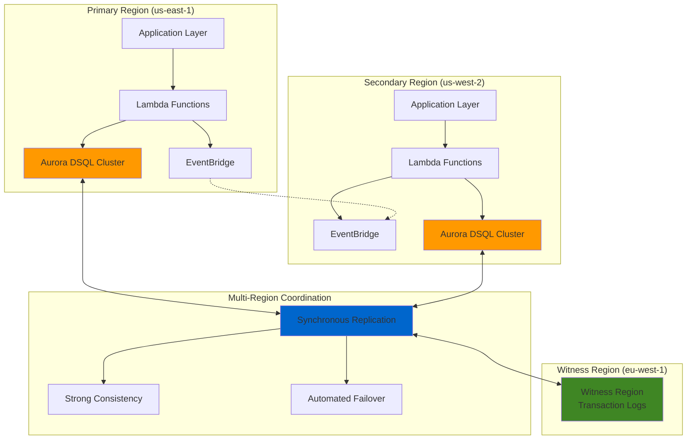

# Architecting Distributed Database Applications with Aurora DSQL

## Problem

Global enterprises need distributed applications that can handle mission-critical workloads across multiple regions while maintaining strong consistency and zero downtime. Traditional database architectures struggle with active-active multi-region deployments, often requiring complex replication strategies that compromise data consistency or introduce significant failover downtime during regional outages.

## Solution

Aurora DSQL provides a serverless, distributed SQL database with active-active architecture that enables true multi-region applications with strong consistency and 99.999% availability. Combined with Lambda for serverless business logic and EventBridge for event-driven coordination, this architecture creates a resilient, scalable foundation for global applications that can handle regional failures without data loss or downtime.

## Architecture Diagram



## Prerequisites

1. AWS account with appropriate permissions for Aurora DSQL, Lambda, and EventBridge
2. AWS CLI v2 installed and configured (or AWS CloudShell)
3. Basic understanding of distributed systems and event-driven architectures
4. Familiarity with SQL and serverless compute patterns
5. Estimated cost: $50-100/month for development workloads (varies by usage)

> **Note**: Aurora DSQL is a preview service. Ensure your AWS account has access to Aurora DSQL in supported regions before proceeding.

## Preparation

```bash
# Set environment variables for multi-region deployment
export PRIMARY_REGION=us-east-1
export SECONDARY_REGION=us-west-2
export WITNESS_REGION=eu-west-1
export AWS_ACCOUNT_ID=$(aws sts get-caller-identity \
    --query Account --output text)

# Generate unique identifiers for resources
RANDOM_SUFFIX=$(aws secretsmanager get-random-password \
    --exclude-punctuation --exclude-uppercase \
    --password-length 6 --require-each-included-type \
    --output text --query RandomPassword)

# Set resource names
export CLUSTER_NAME_PRIMARY="app-cluster-primary-${RANDOM_SUFFIX}"
export CLUSTER_NAME_SECONDARY="app-cluster-secondary-${RANDOM_SUFFIX}"
export LAMBDA_FUNCTION_NAME="dsql-processor-${RANDOM_SUFFIX}"
export EVENTBRIDGE_BUS_NAME="dsql-events-${RANDOM_SUFFIX}"

echo "✅ Environment configured for multi-region deployment"
echo "Primary Region: ${PRIMARY_REGION}"
echo "Secondary Region: ${SECONDARY_REGION}"
echo "Witness Region: ${WITNESS_REGION}"
```

## Steps

1. **Create Primary Aurora DSQL Cluster**:

   Aurora DSQL's active-active architecture eliminates traditional primary-secondary database limitations by providing true multi-region write capabilities. Creating the first cluster with multi-region properties establishes the foundation for a distributed system that can handle regional failures without data loss or application downtime.

   ```bash
   # Create primary cluster in us-east-1 with witness region
   aws dsql create-cluster \
       --region ${PRIMARY_REGION} \
       --cluster-name ${CLUSTER_NAME_PRIMARY} \
       --witness-region ${WITNESS_REGION} \
       --engine-version postgres \
       --tags Key=Environment,Value=Production \
           Key=Application,Value=DistributedApp
   
   # Store the cluster identifier from the response
   PRIMARY_CLUSTER_ID=$(aws dsql describe-clusters \
       --region ${PRIMARY_REGION} \
       --query 'clusters[0].clusterIdentifier' \
       --output text)
   
   echo "✅ Primary cluster created: ${PRIMARY_CLUSTER_ID}"
   ```

   The primary cluster is now being created with multi-region configuration. Aurora DSQL automatically handles the complex setup required for distributed consensus and synchronous replication across regions.

2. **Create Secondary Aurora DSQL Cluster**:

   The secondary cluster provides the active-active capability that makes Aurora DSQL unique among distributed databases. Unlike traditional read replicas, this cluster can handle both read and write operations while maintaining strong consistency across regions through synchronous replication.

   ```bash
   # Create secondary cluster in us-west-2 with same witness region
   aws dsql create-cluster \
       --region ${SECONDARY_REGION} \
       --cluster-name ${CLUSTER_NAME_SECONDARY} \
       --witness-region ${WITNESS_REGION} \
       --engine-version postgres \
       --tags Key=Environment,Value=Production \
           Key=Application,Value=DistributedApp
   
   # Store the secondary cluster identifier
   SECONDARY_CLUSTER_ID=$(aws dsql describe-clusters \
       --region ${SECONDARY_REGION} \
       --query 'clusters[0].clusterIdentifier' \
       --output text)
   
   echo "✅ Secondary cluster created: ${SECONDARY_CLUSTER_ID}"
   ```

   Both clusters are now created with the same witness region (eu-west-1) which will store transaction logs and provide the quorum mechanism needed for multi-region consistency and automatic failover decisions.

3. **Create Multi-Region Cluster Link**:

   Linking establishes the active-active relationship between clusters, enabling synchronous replication and strong consistency. This step transforms two independent clusters into a single logical database that can handle writes from either region while maintaining ACID properties across the distributed system.

   ```bash
   # Create linked cluster between primary and secondary
   aws dsql create-multi-region-clusters \
       --region ${PRIMARY_REGION} \
       --primary-cluster-identifier ${PRIMARY_CLUSTER_ID} \
       --secondary-cluster-identifier ${SECONDARY_CLUSTER_ID} \
       --secondary-cluster-region ${SECONDARY_REGION} \
       --witness-region ${WITNESS_REGION}
   
   # Wait for multi-region setup to complete
   aws dsql wait multi-region-clusters-available \
       --region ${PRIMARY_REGION} \
       --primary-cluster-identifier ${PRIMARY_CLUSTER_ID}
   
   echo "✅ Multi-region clusters linked successfully"
   ```

   The clusters are now operating as a single logical database with strong consistency guarantees across regions. Both endpoints provide access to the same data with automatic conflict resolution.

4. **Create Lambda Execution Role**:

   Lambda functions require appropriate IAM permissions to interact with Aurora DSQL and EventBridge. This role follows the principle of least privilege while providing the necessary access for database operations and event publishing in a multi-region environment.

   ```bash
   # Create IAM role for Lambda functions
   aws iam create-role \
       --role-name DSQLLambdaRole-${RANDOM_SUFFIX} \
       --assume-role-policy-document '{
           "Version": "2012-10-17",
           "Statement": [
               {
                   "Effect": "Allow",
                   "Principal": {
                       "Service": "lambda.amazonaws.com"
                   },
                   "Action": "sts:AssumeRole"
               }
           ]
       }'
   
   # Attach basic Lambda execution policy
   aws iam attach-role-policy \
       --role-name DSQLLambdaRole-${RANDOM_SUFFIX} \
       --policy-arn arn:aws:iam::aws:policy/service-role/AWSLambdaBasicExecutionRole
   
   # Create custom policy for Aurora DSQL and EventBridge
   aws iam create-policy \
       --policy-name DSQLEventBridgePolicy-${RANDOM_SUFFIX} \
       --policy-document '{
           "Version": "2012-10-17",
           "Statement": [
               {
                   "Effect": "Allow",
                   "Action": [
                       "dsql:Connect",
                       "dsql:DbConnect",
                       "dsql:ExecuteStatement",
                       "events:PutEvents"
                   ],
                   "Resource": "*"
               }
           ]
       }'
   
   # Attach custom policy to role
   aws iam attach-role-policy \
       --role-name DSQLLambdaRole-${RANDOM_SUFFIX} \
       --policy-arn arn:aws:iam::${AWS_ACCOUNT_ID}:policy/DSQLEventBridgePolicy-${RANDOM_SUFFIX}
   
   echo "✅ Lambda execution role created with Aurora DSQL permissions"
   ```

   The IAM role is now configured with specific Aurora DSQL permissions that enable secure database access through AWS IAM authentication rather than traditional database credentials.

5. **Create Lambda Function for Database Operations**:

   Lambda functions provide the serverless compute layer that handles business logic and database operations. This function demonstrates how to connect to Aurora DSQL and perform operations while publishing events for cross-region coordination.

   ```bash
   # Create Lambda function code
   cat > lambda_function.py << 'EOF'
import json
import boto3
import os
from datetime import datetime
import uuid

def lambda_handler(event, context):
    # Initialize clients
    dsql_client = boto3.client('dsql')
    eventbridge = boto3.client('events')
    
    # Aurora DSQL connection parameters
    cluster_identifier = os.environ.get('DSQL_CLUSTER_ID')
    
    try:
        # Process the incoming event
        operation = event.get('operation', 'read')
        
        if operation == 'write':
            # Perform write operation using Aurora DSQL Data API
            transaction_id = event.get('transaction_id', str(uuid.uuid4()))
            amount = event.get('amount', 0)
            
            response = dsql_client.execute_statement(
                ClusterIdentifier=cluster_identifier,
                Sql="""
                    INSERT INTO transactions (id, amount, timestamp, region)
                    VALUES (?, ?, ?, ?)
                """,
                Parameters=[
                    {'StringValue': transaction_id},
                    {'DoubleValue': amount},
                    {'StringValue': datetime.now().isoformat()},
                    {'StringValue': context.invoked_function_arn.split(':')[3]}
                ]
            )
            
            # Publish event to EventBridge
            eventbridge.put_events(
                Entries=[
                    {
                        'Source': 'dsql.application',
                        'DetailType': 'Transaction Created',
                        'Detail': json.dumps({
                            'transaction_id': transaction_id,
                            'amount': amount,
                            'region': context.invoked_function_arn.split(':')[3]
                        })
                    }
                ]
            )
            
            return {
                'statusCode': 200,
                'body': json.dumps({
                    'message': 'Transaction created successfully',
                    'transaction_id': transaction_id
                })
            }
            
        elif operation == 'read':
            # Perform read operation
            response = dsql_client.execute_statement(
                ClusterIdentifier=cluster_identifier,
                Sql="SELECT COUNT(*) as count FROM transactions"
            )
            
            count = response['Records'][0]['Values'][0]['LongValue']
            
            return {
                'statusCode': 200,
                'body': json.dumps({
                    'transaction_count': count,
                    'region': context.invoked_function_arn.split(':')[3]
                })
            }
        
        return {
            'statusCode': 400,
            'body': json.dumps('Invalid operation')
        }
        
    except Exception as e:
        return {
            'statusCode': 500,
            'body': json.dumps(f'Error: {str(e)}')
        }
EOF
   
   # Create deployment package
   zip function.zip lambda_function.py
   
   # Create Lambda function in primary region
   aws lambda create-function \
       --region ${PRIMARY_REGION} \
       --function-name ${LAMBDA_FUNCTION_NAME}-primary \
       --runtime python3.9 \
       --role arn:aws:iam::${AWS_ACCOUNT_ID}:role/DSQLLambdaRole-${RANDOM_SUFFIX} \
       --handler lambda_function.lambda_handler \
       --zip-file fileb://function.zip \
       --timeout 30 \
       --environment Variables="{DSQL_CLUSTER_ID=${PRIMARY_CLUSTER_ID}}"
   
   echo "✅ Lambda function created in primary region"
   ```

   The Lambda function is now deployed using Aurora DSQL's Data API, which provides a secure, serverless way to interact with the database without managing connections or credentials.

6. **Create EventBridge Custom Bus**:

   EventBridge provides the event-driven coordination layer that enables loose coupling between components across regions. A custom event bus allows for better organization and filtering of application-specific events while supporting cross-region event replication.

   ```bash
   # Create custom EventBridge bus in primary region
   aws events create-event-bus \
       --region ${PRIMARY_REGION} \
       --name ${EVENTBRIDGE_BUS_NAME} \
       --tags Key=Environment,Value=Production \
           Key=Application,Value=DistributedApp
   
   # Create custom EventBridge bus in secondary region
   aws events create-event-bus \
       --region ${SECONDARY_REGION} \
       --name ${EVENTBRIDGE_BUS_NAME} \
       --tags Key=Environment,Value=Production \
           Key=Application,Value=DistributedApp
   
   # Create rule for cross-region event replication
   aws events put-rule \
       --region ${PRIMARY_REGION} \
       --name CrossRegionReplication-${RANDOM_SUFFIX} \
       --event-pattern '{"source":["dsql.application"]}' \
       --state ENABLED \
       --event-bus-name ${EVENTBRIDGE_BUS_NAME}
   
   echo "✅ EventBridge custom bus created with cross-region replication"
   ```

   The custom event bus is now configured to handle application events and coordinate actions across regions, providing the foundation for event-driven architecture patterns in the distributed application.

7. **Deploy Lambda Function to Secondary Region**:

   Deploying identical Lambda functions to both regions ensures consistent business logic processing regardless of which region handles the request. This approach supports true active-active architecture where either region can process requests independently.

   ```bash
   # Create Lambda function in secondary region
   aws lambda create-function \
       --region ${SECONDARY_REGION} \
       --function-name ${LAMBDA_FUNCTION_NAME}-secondary \
       --runtime python3.9 \
       --role arn:aws:iam::${AWS_ACCOUNT_ID}:role/DSQLLambdaRole-${RANDOM_SUFFIX} \
       --handler lambda_function.lambda_handler \
       --zip-file fileb://function.zip \
       --timeout 30 \
       --environment Variables="{DSQL_CLUSTER_ID=${SECONDARY_CLUSTER_ID}}"
   
   # Grant EventBridge permission to invoke Lambda
   aws lambda add-permission \
       --region ${SECONDARY_REGION} \
       --function-name ${LAMBDA_FUNCTION_NAME}-secondary \
       --statement-id eventbridge-invoke \
       --action lambda:InvokeFunction \
       --principal events.amazonaws.com \
       --source-arn arn:aws:events:${SECONDARY_REGION}:${AWS_ACCOUNT_ID}:rule/${EVENTBRIDGE_BUS_NAME}/CrossRegionReplication-${RANDOM_SUFFIX}
   
   # Configure EventBridge trigger for secondary region Lambda
   aws events put-targets \
       --region ${SECONDARY_REGION} \
       --rule CrossRegionReplication-${RANDOM_SUFFIX} \
       --event-bus-name ${EVENTBRIDGE_BUS_NAME} \
       --targets "Id"="1","Arn"="arn:aws:lambda:${SECONDARY_REGION}:${AWS_ACCOUNT_ID}:function:${LAMBDA_FUNCTION_NAME}-secondary"
   
   echo "✅ Lambda function deployed to secondary region with EventBridge integration"
   ```

   Both regions now have identical Lambda functions capable of processing requests and database operations, creating a truly distributed application architecture with no single point of failure.

8. **Create Database Schema**:

   Aurora DSQL requires a schema to support the application's data model. Creating tables in the multi-region cluster demonstrates how DDL operations are synchronized across regions while maintaining strong consistency.

   ```bash
   # Create sample application schema
   cat > schema.sql << 'EOF'
-- Create transactions table for the distributed application
CREATE TABLE IF NOT EXISTS transactions (
    id VARCHAR(255) PRIMARY KEY,
    amount DECIMAL(10,2) NOT NULL,
    timestamp TIMESTAMP NOT NULL,
    region VARCHAR(50) NOT NULL,
    status VARCHAR(50) DEFAULT 'pending'
);

-- Create index for performance
CREATE INDEX IF NOT EXISTS idx_transactions_timestamp ON transactions(timestamp);
CREATE INDEX IF NOT EXISTS idx_transactions_region ON transactions(region);

-- Create sequence for transaction numbering
CREATE SEQUENCE IF NOT EXISTS transaction_seq START 1;
EOF
   
   # Execute schema creation using Aurora DSQL Data API
   aws dsql execute-statement \
       --region ${PRIMARY_REGION} \
       --cluster-identifier ${PRIMARY_CLUSTER_ID} \
       --sql "$(cat schema.sql)"
   
   echo "✅ Database schema created and synchronized across regions"
   ```

   The database schema is now created and automatically synchronized across both regions, providing a consistent data model for the distributed application.

## Validation & Testing

1. **Verify Aurora DSQL Cluster Status**:

   ```bash
   # Check primary cluster status
   aws dsql describe-clusters \
       --region ${PRIMARY_REGION} \
       --cluster-identifier ${PRIMARY_CLUSTER_ID} \
       --query 'clusters[0].status' --output text
   
   # Check secondary cluster status
   aws dsql describe-clusters \
       --region ${SECONDARY_REGION} \
       --cluster-identifier ${SECONDARY_CLUSTER_ID} \
       --query 'clusters[0].status' --output text
   ```

   Expected output: Both clusters should show `available` status indicating successful multi-region configuration.

2. **Test Lambda Function Execution**:

   ```bash
   # Test Lambda function in primary region
   aws lambda invoke \
       --region ${PRIMARY_REGION} \
       --function-name ${LAMBDA_FUNCTION_NAME}-primary \
       --payload '{"operation":"read"}' \
       --cli-binary-format raw-in-base64-out \
       response.json
   
   cat response.json
   ```

   Expected output: JSON response with transaction count and region information.

3. **Verify EventBridge Integration**:

   ```bash
   # Check EventBridge rules
   aws events list-rules \
       --region ${PRIMARY_REGION} \
       --event-bus-name ${EVENTBRIDGE_BUS_NAME}
   
   # Check EventBridge targets
   aws events list-targets-by-rule \
       --region ${PRIMARY_REGION} \
       --rule CrossRegionReplication-${RANDOM_SUFFIX} \
       --event-bus-name ${EVENTBRIDGE_BUS_NAME}
   ```

   Expected output: EventBridge rules and targets should be properly configured for cross-region event handling.

4. **Test Multi-Region Consistency**:

   ```bash
   # Test write operation from primary region
   aws lambda invoke \
       --region ${PRIMARY_REGION} \
       --function-name ${LAMBDA_FUNCTION_NAME}-primary \
       --payload '{"operation":"write","transaction_id":"test-001","amount":100.50}' \
       --cli-binary-format raw-in-base64-out \
       write_response.json
   
   # Wait for replication
   sleep 5
   
   # Verify data is available in secondary region
   aws lambda invoke \
       --region ${SECONDARY_REGION} \
       --function-name ${LAMBDA_FUNCTION_NAME}-secondary \
       --payload '{"operation":"read"}' \
       --cli-binary-format raw-in-base64-out \
       read_response.json
   
   echo "Primary region write result:"
   cat write_response.json
   echo "Secondary region read result:"
   cat read_response.json
   ```

   Expected output: Data written to the primary region should be immediately available when read from the secondary region, demonstrating strong consistency.

## Cleanup

1. **Delete Lambda Functions**:

   ```bash
   # Delete Lambda function in primary region
   aws lambda delete-function \
       --region ${PRIMARY_REGION} \
       --function-name ${LAMBDA_FUNCTION_NAME}-primary
   
   # Delete Lambda function in secondary region
   aws lambda delete-function \
       --region ${SECONDARY_REGION} \
       --function-name ${LAMBDA_FUNCTION_NAME}-secondary
   
   echo "✅ Lambda functions deleted"
   ```

2. **Delete EventBridge Resources**:

   ```bash
   # Delete EventBridge rules and targets
   aws events remove-targets \
       --region ${PRIMARY_REGION} \
       --rule CrossRegionReplication-${RANDOM_SUFFIX} \
       --event-bus-name ${EVENTBRIDGE_BUS_NAME} \
       --ids "1"
   
   aws events delete-rule \
       --region ${PRIMARY_REGION} \
       --name CrossRegionReplication-${RANDOM_SUFFIX} \
       --event-bus-name ${EVENTBRIDGE_BUS_NAME}
   
   # Delete custom event buses
   aws events delete-event-bus \
       --region ${PRIMARY_REGION} \
       --name ${EVENTBRIDGE_BUS_NAME}
   
   aws events delete-event-bus \
       --region ${SECONDARY_REGION} \
       --name ${EVENTBRIDGE_BUS_NAME}
   
   echo "✅ EventBridge resources deleted"
   ```

3. **Delete IAM Resources**:

   ```bash
   # Detach policies from role
   aws iam detach-role-policy \
       --role-name DSQLLambdaRole-${RANDOM_SUFFIX} \
       --policy-arn arn:aws:iam::aws:policy/service-role/AWSLambdaBasicExecutionRole
   
   aws iam detach-role-policy \
       --role-name DSQLLambdaRole-${RANDOM_SUFFIX} \
       --policy-arn arn:aws:iam::${AWS_ACCOUNT_ID}:policy/DSQLEventBridgePolicy-${RANDOM_SUFFIX}
   
   # Delete custom policy
   aws iam delete-policy \
       --policy-arn arn:aws:iam::${AWS_ACCOUNT_ID}:policy/DSQLEventBridgePolicy-${RANDOM_SUFFIX}
   
   # Delete IAM role
   aws iam delete-role \
       --role-name DSQLLambdaRole-${RANDOM_SUFFIX}
   
   echo "✅ IAM resources deleted"
   ```

4. **Delete Aurora DSQL Clusters**:

   ```bash
   # Delete multi-region cluster link first
   aws dsql delete-multi-region-clusters \
       --region ${PRIMARY_REGION} \
       --primary-cluster-identifier ${PRIMARY_CLUSTER_ID}
   
   # Wait for multi-region deletion
   aws dsql wait multi-region-clusters-deleted \
       --region ${PRIMARY_REGION} \
       --primary-cluster-identifier ${PRIMARY_CLUSTER_ID}
   
   # Delete secondary cluster
   aws dsql delete-cluster \
       --region ${SECONDARY_REGION} \
       --cluster-identifier ${SECONDARY_CLUSTER_ID}
   
   # Delete primary cluster
   aws dsql delete-cluster \
       --region ${PRIMARY_REGION} \
       --cluster-identifier ${PRIMARY_CLUSTER_ID}
   
   echo "✅ Aurora DSQL clusters deleted"
   ```

5. **Clean up local files**:

   ```bash
   # Remove temporary files
   rm -f function.zip lambda_function.py schema.sql
   rm -f response.json write_response.json read_response.json
   
   # Clear environment variables
   unset PRIMARY_REGION SECONDARY_REGION WITNESS_REGION
   unset CLUSTER_NAME_PRIMARY CLUSTER_NAME_SECONDARY
   unset LAMBDA_FUNCTION_NAME EVENTBRIDGE_BUS_NAME
   
   echo "✅ Local cleanup completed"
   ```

## Discussion

Aurora DSQL represents a significant advancement in distributed database architecture, addressing the fundamental challenges of building truly global applications. Unlike traditional database replication strategies that often involve complex master-slave configurations with potential data loss during failover, Aurora DSQL's active-active architecture ensures that both regions can handle read and write operations simultaneously while maintaining strong consistency through its innovative consensus protocol.

The integration with Lambda and EventBridge creates a powerful event-driven architecture that leverages AWS's serverless capabilities. Lambda functions provide the compute layer that scales automatically based on demand, while EventBridge enables loose coupling between components across regions. This combination eliminates the need for complex infrastructure management while ensuring high availability and performance. The serverless nature of all three services means that you only pay for what you use, making it cost-effective for both development and production workloads.

The multi-region configuration with a witness region is particularly innovative, as it provides the quorum mechanism needed for distributed consensus without requiring a full third active region. This design minimizes costs while maximizing availability, as the witness region only stores transaction logs and doesn't process application traffic. The synchronous replication across regions ensures that data is consistent immediately, eliminating the eventual consistency challenges that plague many distributed systems.

From an operational perspective, Aurora DSQL's serverless nature eliminates many traditional database administration tasks such as capacity planning, patch management, and performance tuning. The service automatically scales compute, storage, and I/O based on workload demands, making it ideal for applications with unpredictable traffic patterns. The integration with AWS's broader ecosystem, including IAM for security and CloudWatch for monitoring, provides a comprehensive foundation for enterprise applications.

> **Tip**: Use Aurora DSQL's built-in monitoring capabilities with CloudWatch to track performance metrics across regions and identify potential bottlenecks before they impact application performance.

## Challenge

Extend this solution by implementing these enhancements:

1. **Add Circuit Breaker Pattern**: Implement circuit breaker logic in Lambda functions to handle database connection failures gracefully and prevent cascading failures across regions.

2. **Implement Data Encryption**: Configure customer-managed KMS keys for Aurora DSQL encryption at rest and implement application-level encryption for sensitive data fields.

3. **Add Monitoring and Alerting**: Create CloudWatch dashboards and alarms to monitor Aurora DSQL performance, Lambda execution metrics, and EventBridge event processing across all regions.

4. **Build API Gateway Integration**: Create a RESTful API using API Gateway that routes requests to the appropriate regional Lambda functions based on latency or availability.

5. **Implement Advanced Event Patterns**: Design complex event-driven workflows using EventBridge rules that trigger different Lambda functions based on transaction types, amounts, or regional preferences.

## Infrastructure Code

*Infrastructure code will be generated after recipe approval.*