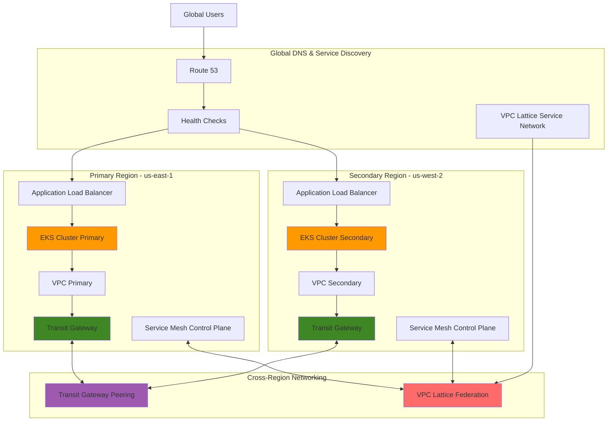

# Architecting Global EKS Resilience with Cross-Region Networking

## Problem

Global enterprises require Kubernetes workloads that can withstand regional failures while maintaining low latency for users across different geographic locations. Traditional single-cluster deployments create single points of failure and cannot effectively serve global user bases due to latency constraints. When disaster strikes a primary region, recovery times can span hours or days, resulting in significant business disruption and revenue loss. Organizations need a resilient, geographically distributed architecture that enables seamless failover between regions while maintaining consistent application performance and data integrity.

## Solution

This solution implements a multi-cluster Amazon EKS architecture spanning multiple AWS regions, connected through AWS Transit Gateway with cross-region peering and AWS VPC Lattice for service mesh federation. The architecture enables automatic failover capabilities, global load balancing, and cross-region service discovery. By leveraging Route 53 health checks, Transit Gateway route tables, and VPC Lattice service networks, traffic is intelligently distributed across healthy clusters with advanced networking capabilities for enterprise resilience.

## Architecture Diagram



## Prerequisites

1. AWS account with appropriate permissions for EKS, Transit Gateway, VPC Lattice, and Route 53 services
2. AWS CLI v2 installed and configured (or AWS CloudShell)
3. kubectl version 1.28+ installed locally
4. eksctl version 0.140+ installed locally
5. Helm v3.12+ installed locally
6. Expert understanding of Kubernetes networking, AWS Transit Gateway, and service mesh concepts
7. Estimated cost: $250-350/month for EKS clusters, Transit Gateway, VPC Lattice, Load Balancers, and associated resources

> **Note**: This recipe creates resources across multiple regions including Transit Gateway cross-region peering, which may incur additional data transfer costs and hourly charges for cross-region communication.

## Preparation

```bash
# Set environment variables for primary region
export PRIMARY_REGION=us-east-1
export SECONDARY_REGION=us-west-2
export AWS_ACCOUNT_ID=$(aws sts get-caller-identity \
    --query Account --output text)

# Generate unique identifiers for resources
RANDOM_SUFFIX=$(aws secretsmanager get-random-password \
    --exclude-punctuation --exclude-uppercase \
    --password-length 6 --require-each-included-type \
    --output text --query RandomPassword)

# Set cluster and resource names
export PRIMARY_CLUSTER_NAME=eks-primary-${RANDOM_SUFFIX}
export SECONDARY_CLUSTER_NAME=eks-secondary-${RANDOM_SUFFIX}
export VPC_PRIMARY_NAME=vpc-primary-${RANDOM_SUFFIX}
export VPC_SECONDARY_NAME=vpc-secondary-${RANDOM_SUFFIX}
export TGW_PRIMARY_NAME=tgw-primary-${RANDOM_SUFFIX}
export TGW_SECONDARY_NAME=tgw-secondary-${RANDOM_SUFFIX}

# Create IAM roles for EKS clusters
aws iam create-role \
    --role-name eks-cluster-role-${RANDOM_SUFFIX} \
    --assume-role-policy-document '{
        "Version": "2012-10-17",
        "Statement": [
            {
                "Effect": "Allow",
                "Principal": {
                    "Service": "eks.amazonaws.com"
                },
                "Action": "sts:AssumeRole"
            }
        ]
    }'

# Attach required policies to cluster role
aws iam attach-role-policy \
    --role-name eks-cluster-role-${RANDOM_SUFFIX} \
    --policy-arn arn:aws:iam::aws:policy/AmazonEKSClusterPolicy

# Create IAM role for node groups
aws iam create-role \
    --role-name eks-nodegroup-role-${RANDOM_SUFFIX} \
    --assume-role-policy-document '{
        "Version": "2012-10-17",
        "Statement": [
            {
                "Effect": "Allow",
                "Principal": {
                    "Service": "ec2.amazonaws.com"
                },
                "Action": "sts:AssumeRole"
            }
        ]
    }'

# Attach required policies to node group role
aws iam attach-role-policy \
    --role-name eks-nodegroup-role-${RANDOM_SUFFIX} \
    --policy-arn arn:aws:iam::aws:policy/AmazonEKSWorkerNodePolicy

aws iam attach-role-policy \
    --role-name eks-nodegroup-role-${RANDOM_SUFFIX} \
    --policy-arn arn:aws:iam::aws:policy/AmazonEKS_CNI_Policy

aws iam attach-role-policy \
    --role-name eks-nodegroup-role-${RANDOM_SUFFIX} \
    --policy-arn arn:aws:iam::aws:policy/AmazonEC2ContainerRegistryReadOnly

echo "✅ IAM roles created successfully"
```

## Steps

1. **Create Primary Region VPC and Transit Gateway**:

   Amazon VPC provides isolated network environments with complete control over IP addressing, routing, and security policies. Transit Gateway acts as a cloud router that connects VPCs and on-premises networks at scale, supporting up to 5,000 VPC attachments per gateway. Creating the primary region VPC establishes the network foundation for EKS clusters, while Transit Gateway enables future multi-region connectivity and centralized routing management. This architecture pattern scales to support hundreds of VPCs across multiple regions without complex peering relationships.

   ```bash
   # Create VPC for primary region
   aws ec2 create-vpc \
       --cidr-block 10.1.0.0/16 \
       --tag-specifications \
       "ResourceType=vpc,Tags=[{Key=Name,Value=${VPC_PRIMARY_NAME}}]" \
       --region ${PRIMARY_REGION}
   
   # Get VPC ID
   PRIMARY_VPC_ID=$(aws ec2 describe-vpcs \
       --filters "Name=tag:Name,Values=${VPC_PRIMARY_NAME}" \
       --region ${PRIMARY_REGION} \
       --query 'Vpcs[0].VpcId' --output text)
   
   # Create Transit Gateway in primary region
   aws ec2 create-transit-gateway \
       --description "Primary region Transit Gateway" \
       --options AmazonSideAsn=64512,AutoAcceptSharedAttachments=enable,DefaultRouteTableAssociation=enable,DefaultRouteTablePropagation=enable \
       --tag-specifications \
       "ResourceType=transit-gateway,Tags=[{Key=Name,Value=${TGW_PRIMARY_NAME}}]" \
       --region ${PRIMARY_REGION}
   
   # Get Transit Gateway ID
   PRIMARY_TGW_ID=$(aws ec2 describe-transit-gateways \
       --filters "Name=tag:Name,Values=${TGW_PRIMARY_NAME}" \
       --region ${PRIMARY_REGION} \
       --query 'TransitGateways[0].TransitGatewayId' --output text)
   
   # Wait for Transit Gateway to be available
   aws ec2 wait transit-gateway-available \
       --transit-gateway-ids ${PRIMARY_TGW_ID} \
       --region ${PRIMARY_REGION}
   
   # Create public subnets in primary region
   aws ec2 create-subnet \
       --vpc-id ${PRIMARY_VPC_ID} \
       --cidr-block 10.1.1.0/24 \
       --availability-zone ${PRIMARY_REGION}a \
       --tag-specifications \
       "ResourceType=subnet,Tags=[{Key=Name,Value=primary-public-1}]" \
       --region ${PRIMARY_REGION}
   
   aws ec2 create-subnet \
       --vpc-id ${PRIMARY_VPC_ID} \
       --cidr-block 10.1.2.0/24 \
       --availability-zone ${PRIMARY_REGION}b \
       --tag-specifications \
       "ResourceType=subnet,Tags=[{Key=Name,Value=primary-public-2}]" \
       --region ${PRIMARY_REGION}
   
   # Create private subnets in primary region
   aws ec2 create-subnet \
       --vpc-id ${PRIMARY_VPC_ID} \
       --cidr-block 10.1.3.0/24 \
       --availability-zone ${PRIMARY_REGION}a \
       --tag-specifications \
       "ResourceType=subnet,Tags=[{Key=Name,Value=primary-private-1}]" \
       --region ${PRIMARY_REGION}
   
   aws ec2 create-subnet \
       --vpc-id ${PRIMARY_VPC_ID} \
       --cidr-block 10.1.4.0/24 \
       --availability-zone ${PRIMARY_REGION}b \
       --tag-specifications \
       "ResourceType=subnet,Tags=[{Key=Name,Value=primary-private-2}]" \
       --region ${PRIMARY_REGION}
   
   echo "✅ Primary VPC, subnets, and Transit Gateway created"
   ```

   The primary region infrastructure is now established with a VPC using CIDR 10.1.0.0/16, providing 65,536 IP addresses for workloads. Transit Gateway is configured with ASN 64512 and enables automatic acceptance of VPC attachments for simplified management. The multi-AZ subnet design ensures high availability for EKS nodes and provides both public and private subnet placement options.

2. **Configure Internet Gateway and Route Tables for Primary Region**:

   Internet Gateway provides managed NAT functionality for VPC resources to access the internet, essential for EKS worker nodes to download container images and communicate with the EKS control plane. The gateway attachment to the VPC enables bidirectional internet connectivity, while subnet-level configuration controls which resources can receive public IP addresses. This networking setup is crucial for EKS clusters to function properly, as worker nodes need internet access for cluster join processes and container registry access.

   ```bash
   # Create Internet Gateway
   aws ec2 create-internet-gateway \
       --tag-specifications \
       "ResourceType=internet-gateway,Tags=[{Key=Name,Value=primary-igw}]" \
       --region ${PRIMARY_REGION}
   
   # Get IGW ID
   PRIMARY_IGW_ID=$(aws ec2 describe-internet-gateways \
       --filters "Name=tag:Name,Values=primary-igw" \
       --region ${PRIMARY_REGION} \
       --query 'InternetGateways[0].InternetGatewayId' --output text)
   
   # Attach IGW to VPC
   aws ec2 attach-internet-gateway \
       --internet-gateway-id ${PRIMARY_IGW_ID} \
       --vpc-id ${PRIMARY_VPC_ID} \
       --region ${PRIMARY_REGION}
   
   # Get public subnet IDs
   PRIMARY_PUBLIC_SUBNET_1=$(aws ec2 describe-subnets \
       --filters "Name=tag:Name,Values=primary-public-1" \
       --region ${PRIMARY_REGION} \
       --query 'Subnets[0].SubnetId' --output text)
   
   PRIMARY_PUBLIC_SUBNET_2=$(aws ec2 describe-subnets \
       --filters "Name=tag:Name,Values=primary-public-2" \
       --region ${PRIMARY_REGION} \
       --query 'Subnets[0].SubnetId' --output text)
   
   # Get private subnet IDs
   PRIMARY_PRIVATE_SUBNET_1=$(aws ec2 describe-subnets \
       --filters "Name=tag:Name,Values=primary-private-1" \
       --region ${PRIMARY_REGION} \
       --query 'Subnets[0].SubnetId' --output text)
   
   PRIMARY_PRIVATE_SUBNET_2=$(aws ec2 describe-subnets \
       --filters "Name=tag:Name,Values=primary-private-2" \
       --region ${PRIMARY_REGION} \
       --query 'Subnets[0].SubnetId' --output text)
   
   # Enable auto-assign public IP for public subnets
   aws ec2 modify-subnet-attribute \
       --subnet-id ${PRIMARY_PUBLIC_SUBNET_1} \
       --map-public-ip-on-launch \
       --region ${PRIMARY_REGION}
   
   aws ec2 modify-subnet-attribute \
       --subnet-id ${PRIMARY_PUBLIC_SUBNET_2} \
       --map-public-ip-on-launch \
       --region ${PRIMARY_REGION}
   
   echo "✅ Primary region networking configured"
   ```

   The primary region now has complete internet connectivity with properly configured public and private subnets. Public subnets are configured for auto-assignment of public IP addresses, enabling load balancers and NAT gateways. Private subnets will host EKS worker nodes, providing secure placement while maintaining outbound internet access through NAT gateways or Transit Gateway routes.

3. **Create Secondary Region VPC and Transit Gateway**:

   The secondary region infrastructure mirrors the primary region design but uses different CIDR blocks to prevent IP address conflicts. AWS Transit Gateway in the secondary region uses ASN 64513 to distinguish it from the primary region. This design pattern enables active-active or active-standby deployment models, depending on your disaster recovery requirements. The secondary region provides geographic distribution for compliance requirements and reduces latency for global users.

   ```bash
   # Create VPC for secondary region
   aws ec2 create-vpc \
       --cidr-block 10.2.0.0/16 \
       --tag-specifications \
       "ResourceType=vpc,Tags=[{Key=Name,Value=${VPC_SECONDARY_NAME}}]" \
       --region ${SECONDARY_REGION}
   
   # Get VPC ID
   SECONDARY_VPC_ID=$(aws ec2 describe-vpcs \
       --filters "Name=tag:Name,Values=${VPC_SECONDARY_NAME}" \
       --region ${SECONDARY_REGION} \
       --query 'Vpcs[0].VpcId' --output text)
   
   # Create Transit Gateway in secondary region
   aws ec2 create-transit-gateway \
       --description "Secondary region Transit Gateway" \
       --options AmazonSideAsn=64513,AutoAcceptSharedAttachments=enable,DefaultRouteTableAssociation=enable,DefaultRouteTablePropagation=enable \
       --tag-specifications \
       "ResourceType=transit-gateway,Tags=[{Key=Name,Value=${TGW_SECONDARY_NAME}}]" \
       --region ${SECONDARY_REGION}
   
   # Get Transit Gateway ID
   SECONDARY_TGW_ID=$(aws ec2 describe-transit-gateways \
       --filters "Name=tag:Name,Values=${TGW_SECONDARY_NAME}" \
       --region ${SECONDARY_REGION} \
       --query 'TransitGateways[0].TransitGatewayId' --output text)
   
   # Wait for Transit Gateway to be available
   aws ec2 wait transit-gateway-available \
       --transit-gateway-ids ${SECONDARY_TGW_ID} \
       --region ${SECONDARY_REGION}
   
   # Create public subnets in secondary region
   aws ec2 create-subnet \
       --vpc-id ${SECONDARY_VPC_ID} \
       --cidr-block 10.2.1.0/24 \
       --availability-zone ${SECONDARY_REGION}a \
       --tag-specifications \
       "ResourceType=subnet,Tags=[{Key=Name,Value=secondary-public-1}]" \
       --region ${SECONDARY_REGION}
   
   aws ec2 create-subnet \
       --vpc-id ${SECONDARY_VPC_ID} \
       --cidr-block 10.2.2.0/24 \
       --availability-zone ${SECONDARY_REGION}b \
       --tag-specifications \
       "ResourceType=subnet,Tags=[{Key=Name,Value=secondary-public-2}]" \
       --region ${SECONDARY_REGION}
   
   # Create private subnets in secondary region
   aws ec2 create-subnet \
       --vpc-id ${SECONDARY_VPC_ID} \
       --cidr-block 10.2.3.0/24 \
       --availability-zone ${SECONDARY_REGION}a \
       --tag-specifications \
       "ResourceType=subnet,Tags=[{Key=Name,Value=secondary-private-1}]" \
       --region ${SECONDARY_REGION}
   
   aws ec2 create-subnet \
       --vpc-id ${SECONDARY_VPC_ID} \
       --cidr-block 10.2.4.0/24 \
       --availability-zone ${SECONDARY_REGION}b \
       --tag-specifications \
       "ResourceType=subnet,Tags=[{Key=Name,Value=secondary-private-2}]" \
       --region ${SECONDARY_REGION}
   
   # Configure Internet Gateway for secondary region
   aws ec2 create-internet-gateway \
       --tag-specifications \
       "ResourceType=internet-gateway,Tags=[{Key=Name,Value=secondary-igw}]" \
       --region ${SECONDARY_REGION}
   
   SECONDARY_IGW_ID=$(aws ec2 describe-internet-gateways \
       --filters "Name=tag:Name,Values=secondary-igw" \
       --region ${SECONDARY_REGION} \
       --query 'InternetGateways[0].InternetGatewayId' --output text)
   
   aws ec2 attach-internet-gateway \
       --internet-gateway-id ${SECONDARY_IGW_ID} \
       --vpc-id ${SECONDARY_VPC_ID} \
       --region ${SECONDARY_REGION}
   
   echo "✅ Secondary region VPC and Transit Gateway created"
   ```

   The secondary region infrastructure is now established with CIDR 10.2.0.0/16, ensuring no IP overlap with the primary region. Transit Gateway uses ASN 64513 for BGP routing distinction. Both regions now have identical infrastructure patterns, enabling consistent application deployment and management across geographic locations.

> **Warning**: Cross-region data transfer charges apply for traffic between regions. Monitor VPC Flow Logs and AWS Cost Explorer to track inter-region communication costs and optimize traffic patterns.

4. **Establish Transit Gateway Cross-Region Peering**:

   Transit Gateway peering creates a secure, high-bandwidth connection between regions, enabling private communication without traversing the public internet. This connection supports up to 50 Gbps of aggregate bandwidth and uses AWS's private backbone network for optimal performance and security. Cross-region peering is essential for multi-cluster architectures requiring service-to-service communication, data replication, and disaster recovery capabilities.

   ```bash
   # Create Transit Gateway peering attachment
   aws ec2 create-transit-gateway-peering-attachment \
       --transit-gateway-id ${PRIMARY_TGW_ID} \
       --peer-transit-gateway-id ${SECONDARY_TGW_ID} \
       --peer-region ${SECONDARY_REGION} \
       --tag-specifications \
       "ResourceType=transit-gateway-peering-attachment,Tags=[{Key=Name,Value=multi-cluster-tgw-peering}]" \
       --region ${PRIMARY_REGION}
   
   # Get peering attachment ID
   TGW_PEERING_ID=$(aws ec2 describe-transit-gateway-peering-attachments \
       --filters "Name=tag:Name,Values=multi-cluster-tgw-peering" \
       --region ${PRIMARY_REGION} \
       --query 'TransitGatewayPeeringAttachments[0].TransitGatewayPeeringAttachmentId' --output text)
   
   # Accept peering attachment in secondary region
   aws ec2 accept-transit-gateway-peering-attachment \
       --transit-gateway-peering-attachment-id ${TGW_PEERING_ID} \
       --region ${SECONDARY_REGION}
   
   # Wait for peering attachment to be available
   aws ec2 wait transit-gateway-peering-attachment-available \
       --transit-gateway-peering-attachment-ids ${TGW_PEERING_ID} \
       --region ${PRIMARY_REGION}
   
   echo "✅ Transit Gateway cross-region peering established"
   ```

   Cross-region connectivity is now established with Transit Gateway peering, enabling secure communication between VPCs in different regions. The peering connection provides private network connectivity over AWS's backbone infrastructure, ensuring low latency and high bandwidth for cross-region application communication.

5. **Configure Transit Gateway Route Tables**:

   Transit Gateway route tables control traffic flow between attached VPCs and peering connections, similar to traditional networking route tables but operating at the cloud scale. Proper route configuration enables selective connectivity between regions while maintaining network isolation where required. This step establishes bidirectional routing between regions, allowing applications in either region to communicate with services in the other region through private network paths.

   ```bash
   # Get Transit Gateway route table IDs
   PRIMARY_TGW_RT_ID=$(aws ec2 describe-transit-gateways \
       --transit-gateway-ids ${PRIMARY_TGW_ID} \
       --region ${PRIMARY_REGION} \
       --query 'TransitGateways[0].Options.DefaultRouteTableId' --output text)
   
   SECONDARY_TGW_RT_ID=$(aws ec2 describe-transit-gateways \
       --transit-gateway-ids ${SECONDARY_TGW_ID} \
       --region ${SECONDARY_REGION} \
       --query 'TransitGateways[0].Options.DefaultRouteTableId' --output text)
   
   # Add routes to Transit Gateway peering attachment
   aws ec2 create-route \
       --route-table-id ${PRIMARY_TGW_RT_ID} \
       --destination-cidr-block 10.2.0.0/16 \
       --transit-gateway-peering-attachment-id ${TGW_PEERING_ID} \
       --region ${PRIMARY_REGION}
   
   aws ec2 create-route \
       --route-table-id ${SECONDARY_TGW_RT_ID} \
       --destination-cidr-block 10.1.0.0/16 \
       --transit-gateway-peering-attachment-id ${TGW_PEERING_ID} \
       --region ${SECONDARY_REGION}
   
   echo "✅ Transit Gateway cross-region routing configured"
   ```

   Cross-region routing is now configured, enabling VPCs in each region to communicate through Transit Gateway peering. Traffic between 10.1.0.0/16 (primary) and 10.2.0.0/16 (secondary) will route through the secure peering connection, providing the foundation for multi-cluster Kubernetes communication.

6. **Create Primary EKS Cluster**:

   Amazon EKS provides a fully managed Kubernetes control plane with 99.95% SLA, handling master node provisioning, patching, and scaling automatically. The cluster spans multiple Availability Zones for high availability and integrates with AWS services like IAM, VPC, and CloudWatch. Enabling control plane logging provides comprehensive audit trails for API calls, authentication events, and cluster operations, essential for compliance and troubleshooting in enterprise environments.

   ```bash
   # Create EKS cluster in primary region
   aws eks create-cluster \
       --name ${PRIMARY_CLUSTER_NAME} \
       --version 1.29 \
       --role-arn arn:aws:iam::${AWS_ACCOUNT_ID}:role/eks-cluster-role-${RANDOM_SUFFIX} \
       --resources-vpc-config subnetIds=${PRIMARY_PUBLIC_SUBNET_1},${PRIMARY_PUBLIC_SUBNET_2},${PRIMARY_PRIVATE_SUBNET_1},${PRIMARY_PRIVATE_SUBNET_2} \
       --region ${PRIMARY_REGION} \
       --logging '{"clusterLogging":[{"types":["api","audit","authenticator"],"enabled":true}]}'
   
   # Wait for cluster to be active
   aws eks wait cluster-active \
       --name ${PRIMARY_CLUSTER_NAME} \
       --region ${PRIMARY_REGION}
   
   echo "✅ Primary EKS cluster created and active"
   ```

   The primary EKS cluster is now operational with Kubernetes 1.29, providing the foundation for container workloads. The cluster spans multiple AZs and includes comprehensive logging for operational visibility. EKS automatically manages the control plane while providing integration points for worker nodes, networking, and security.

7. **Create Secondary EKS Cluster**:

   The secondary EKS cluster provides geographic redundancy and disaster recovery capabilities. By maintaining identical cluster configurations across regions, applications can be deployed consistently with minimal configuration changes. The secondary cluster enables active-active deployments for global applications or serves as a hot standby for disaster recovery scenarios, depending on your business requirements.

   ```bash
   # Get secondary region subnet IDs
   SECONDARY_PUBLIC_SUBNET_1=$(aws ec2 describe-subnets \
       --filters "Name=tag:Name,Values=secondary-public-1" \
       --region ${SECONDARY_REGION} \
       --query 'Subnets[0].SubnetId' --output text)
   
   SECONDARY_PUBLIC_SUBNET_2=$(aws ec2 describe-subnets \
       --filters "Name=tag:Name,Values=secondary-public-2" \
       --region ${SECONDARY_REGION} \
       --query 'Subnets[0].SubnetId' --output text)
   
   SECONDARY_PRIVATE_SUBNET_1=$(aws ec2 describe-subnets \
       --filters "Name=tag:Name,Values=secondary-private-1" \
       --region ${SECONDARY_REGION} \
       --query 'Subnets[0].SubnetId' --output text)
   
   SECONDARY_PRIVATE_SUBNET_2=$(aws ec2 describe-subnets \
       --filters "Name=tag:Name,Values=secondary-private-2" \
       --region ${SECONDARY_REGION} \
       --query 'Subnets[0].SubnetId' --output text)
   
   # Enable auto-assign public IP for public subnets
   aws ec2 modify-subnet-attribute \
       --subnet-id ${SECONDARY_PUBLIC_SUBNET_1} \
       --map-public-ip-on-launch \
       --region ${SECONDARY_REGION}
   
   aws ec2 modify-subnet-attribute \
       --subnet-id ${SECONDARY_PUBLIC_SUBNET_2} \
       --map-public-ip-on-launch \
       --region ${SECONDARY_REGION}
   
   # Create EKS cluster in secondary region
   aws eks create-cluster \
       --name ${SECONDARY_CLUSTER_NAME} \
       --version 1.29 \
       --role-arn arn:aws:iam::${AWS_ACCOUNT_ID}:role/eks-cluster-role-${RANDOM_SUFFIX} \
       --resources-vpc-config subnetIds=${SECONDARY_PUBLIC_SUBNET_1},${SECONDARY_PUBLIC_SUBNET_2},${SECONDARY_PRIVATE_SUBNET_1},${SECONDARY_PRIVATE_SUBNET_2} \
       --region ${SECONDARY_REGION} \
       --logging '{"clusterLogging":[{"types":["api","audit","authenticator"],"enabled":true}]}'
   
   # Wait for cluster to be active
   aws eks wait cluster-active \
       --name ${SECONDARY_CLUSTER_NAME} \
       --region ${SECONDARY_REGION}
   
   echo "✅ Secondary EKS cluster created and active"
   ```

   The secondary EKS cluster mirrors the primary cluster configuration, providing consistent Kubernetes environments across regions. Both clusters are now ready for worker node deployment and application workloads, enabling multi-region container orchestration with centralized management capabilities.

8. **Create Node Groups for Both Clusters**:

   EKS managed node groups provide automated provisioning, scaling, and lifecycle management for worker nodes. The nodes are deployed in private subnets for security while maintaining internet connectivity through NAT gateways. Using m5.large instances provides a balance of compute, memory, and network performance suitable for most containerized workloads. The scaling configuration enables automatic capacity adjustment based on pod scheduling demands.

   ```bash
   # Create node group for primary cluster
   aws eks create-nodegroup \
       --cluster-name ${PRIMARY_CLUSTER_NAME} \
       --nodegroup-name primary-nodes \
       --node-role arn:aws:iam::${AWS_ACCOUNT_ID}:role/eks-nodegroup-role-${RANDOM_SUFFIX} \
       --subnets ${PRIMARY_PRIVATE_SUBNET_1} ${PRIMARY_PRIVATE_SUBNET_2} \
       --scaling-config minSize=2,maxSize=6,desiredSize=3 \
       --instance-types m5.large \
       --capacity-type ON_DEMAND \
       --region ${PRIMARY_REGION}
   
   # Create node group for secondary cluster
   aws eks create-nodegroup \
       --cluster-name ${SECONDARY_CLUSTER_NAME} \
       --nodegroup-name secondary-nodes \
       --node-role arn:aws:iam::${AWS_ACCOUNT_ID}:role/eks-nodegroup-role-${RANDOM_SUFFIX} \
       --subnets ${SECONDARY_PRIVATE_SUBNET_1} ${SECONDARY_PRIVATE_SUBNET_2} \
       --scaling-config minSize=2,maxSize=6,desiredSize=3 \
       --instance-types m5.large \
       --capacity-type ON_DEMAND \
       --region ${SECONDARY_REGION}
   
   # Wait for node groups to be ready
   aws eks wait nodegroup-active \
       --cluster-name ${PRIMARY_CLUSTER_NAME} \
       --nodegroup-name primary-nodes \
       --region ${PRIMARY_REGION}
   
   aws eks wait nodegroup-active \
       --cluster-name ${SECONDARY_CLUSTER_NAME} \
       --nodegroup-name secondary-nodes \
       --region ${SECONDARY_REGION}
   
   echo "✅ Node groups created for both clusters"
   ```

   Both clusters now have operational worker nodes capable of scheduling pods. The managed node groups provide automatic scaling between 2-6 nodes based on workload demands. Nodes are distributed across multiple AZs for high availability and deployed in private subnets for enhanced security.

9. **Configure kubectl for Multi-Cluster Access**:

    Managing multiple Kubernetes clusters requires proper kubectl context configuration to avoid accidental operations on the wrong cluster. EKS integrates with kubectl through AWS IAM authentication, eliminating the need for long-lived tokens or certificates. Using context aliases enables easy switching between clusters while maintaining clear visibility into which cluster you're operating on.

    ```bash
    # Update kubeconfig for primary cluster
    aws eks update-kubeconfig \
        --name ${PRIMARY_CLUSTER_NAME} \
        --region ${PRIMARY_REGION} \
        --alias primary-cluster
    
    # Update kubeconfig for secondary cluster
    aws eks update-kubeconfig \
        --name ${SECONDARY_CLUSTER_NAME} \
        --region ${SECONDARY_REGION} \
        --alias secondary-cluster
    
    # Test connectivity to both clusters
    kubectl --context=primary-cluster get nodes
    kubectl --context=secondary-cluster get nodes
    
    echo "✅ kubectl configured for multi-cluster access"
    ```

    Both EKS clusters are now accessible through kubectl with distinct context names. The configuration enables seamless switching between primary and secondary clusters while maintaining secure authentication through AWS IAM. You can now deploy and manage applications across both regions using standard Kubernetes tools.

10. **Install VPC Lattice Gateway API Controller**:

    VPC Lattice Gateway API Controller implements the Kubernetes Gateway API specification, providing service mesh capabilities without additional infrastructure overhead. The controller automatically creates VPC Lattice services and routes based on Gateway and HTTPRoute resources, enabling advanced traffic management, security policies, and cross-VPC service communication. This approach simplifies service mesh adoption while leveraging AWS-native networking capabilities.

    ```bash
    # Install VPC Lattice Gateway API Controller in primary cluster
    kubectl --context=primary-cluster apply -f \
        https://raw.githubusercontent.com/aws/aws-application-networking-k8s/main/files/controller-installation/deploy-v1.1.0.yaml
    
    # Install VPC Lattice Gateway API Controller in secondary cluster
    kubectl --context=secondary-cluster apply -f \
        https://raw.githubusercontent.com/aws/aws-application-networking-k8s/main/files/controller-installation/deploy-v1.1.0.yaml
    
    # Wait for controllers to be ready
    kubectl --context=primary-cluster wait --for=condition=Ready pod \
        -l app.kubernetes.io/name=gateway-api-controller \
        -n aws-application-networking-system --timeout=300s
    
    kubectl --context=secondary-cluster wait --for=condition=Ready pod \
        -l app.kubernetes.io/name=gateway-api-controller \
        -n aws-application-networking-system --timeout=300s
    
    echo "✅ VPC Lattice Gateway API Controllers installed"
    ```

    VPC Lattice Gateway API Controllers are now running in both clusters, enabling service mesh federation capabilities. The controllers will automatically create VPC Lattice resources based on Kubernetes Gateway API specifications, providing application-layer networking and security without traditional service mesh complexity.

11. **Deploy Sample Applications with VPC Lattice**:

    This step demonstrates how VPC Lattice integrates with Kubernetes workloads through the Gateway API. The nginx applications serve as representative microservices that would exist in a real multi-cluster deployment. VPC Lattice automatically handles service discovery, load balancing, and traffic routing between services, even across regions. The Gateway and HTTPRoute resources define how traffic flows to services while VPC Lattice handles the underlying network connectivity.

    ```bash
    # Deploy nginx application to primary cluster with VPC Lattice
    kubectl --context=primary-cluster apply -f - <<EOF
    apiVersion: apps/v1
    kind: Deployment
    metadata:
      name: nginx-primary
      namespace: default
    spec:
      replicas: 3
      selector:
        matchLabels:
          app: nginx-primary
      template:
        metadata:
          labels:
            app: nginx-primary
        spec:
          containers:
          - name: nginx
            image: nginx:latest
            ports:
            - containerPort: 80
            env:
            - name: REGION
              value: "primary-${PRIMARY_REGION}"
    ---
    apiVersion: v1
    kind: Service
    metadata:
      name: nginx-primary-service
      namespace: default
    spec:
      selector:
        app: nginx-primary
      ports:
      - port: 80
        targetPort: 80
      type: ClusterIP
    ---
    apiVersion: gateway.networking.k8s.io/v1beta1
    kind: Gateway
    metadata:
      name: nginx-primary-gateway
      namespace: default
      annotations:
        application-networking.k8s.aws/lattice-assigned-domain-name: "primary-nginx.${AWS_ACCOUNT_ID}.vpce-svc.${PRIMARY_REGION}.vpce.amazonaws.com"
    spec:
      gatewayClassName: amazon-vpc-lattice
      listeners:
      - name: http
        protocol: HTTP
        port: 80
    ---
    apiVersion: gateway.networking.k8s.io/v1beta1
    kind: HTTPRoute
    metadata:
      name: nginx-primary-route
      namespace: default
    spec:
      parentRefs:
      - name: nginx-primary-gateway
      rules:
      - matches:
        - path:
            type: PathPrefix
            value: "/"
        backendRefs:
        - name: nginx-primary-service
          port: 80
    EOF
    
    # Deploy nginx application to secondary cluster with VPC Lattice
    kubectl --context=secondary-cluster apply -f - <<EOF
    apiVersion: apps/v1
    kind: Deployment
    metadata:
      name: nginx-secondary
      namespace: default
    spec:
      replicas: 3
      selector:
        matchLabels:
          app: nginx-secondary
      template:
        metadata:
          labels:
            app: nginx-secondary
        spec:
          containers:
          - name: nginx
            image: nginx:latest
            ports:
            - containerPort: 80
            env:
            - name: REGION
              value: "secondary-${SECONDARY_REGION}"
    ---
    apiVersion: v1
    kind: Service
    metadata:
      name: nginx-secondary-service
      namespace: default
    spec:
      selector:
        app: nginx-secondary
      ports:
      - port: 80
        targetPort: 80
      type: ClusterIP
    ---
    apiVersion: gateway.networking.k8s.io/v1beta1
    kind: Gateway
    metadata:
      name: nginx-secondary-gateway
      namespace: default
      annotations:
        application-networking.k8s.aws/lattice-assigned-domain-name: "secondary-nginx.${AWS_ACCOUNT_ID}.vpce-svc.${SECONDARY_REGION}.vpce.amazonaws.com"
    spec:
      gatewayClassName: amazon-vpc-lattice
      listeners:
      - name: http
        protocol: HTTP
        port: 80
    ---
    apiVersion: gateway.networking.k8s.io/v1beta1
    kind: HTTPRoute
    metadata:
      name: nginx-secondary-route
      namespace: default
    spec:
      parentRefs:
      - name: nginx-secondary-gateway
      rules:
      - matches:
        - path:
            type: PathPrefix
            value: "/"
        backendRefs:
        - name: nginx-secondary-service
          port: 80
    EOF
    
    echo "✅ Sample applications deployed to both clusters with VPC Lattice"
    ```

    Sample applications are now running in both regions with VPC Lattice service mesh capabilities. Each application is accessible through its respective VPC Lattice endpoint, and the Gateway API configuration enables advanced traffic management features like header-based routing, traffic splitting, and automatic retries.

12. **Configure Cross-Cluster Service Discovery with VPC Lattice**:

    VPC Lattice Service Networks provide centralized service discovery and communication across VPCs and regions. By associating both VPCs with the same service network, applications can discover and communicate with services regardless of their physical location. This enables microservices architectures that span multiple clusters while maintaining service-to-service connectivity and applying consistent security policies across the entire service mesh.

    ```bash
    # Create VPC Lattice Service Network
    SERVICE_NETWORK_NAME="multi-cluster-service-network-${RANDOM_SUFFIX}"
    
    aws vpc-lattice create-service-network \
        --name ${SERVICE_NETWORK_NAME} \
        --auth-type AWS_IAM \
        --tags Key=Name,Value=${SERVICE_NETWORK_NAME} \
        --region ${PRIMARY_REGION}
    
    # Get Service Network ID
    SERVICE_NETWORK_ID=$(aws vpc-lattice list-service-networks \
        --query "items[?name=='${SERVICE_NETWORK_NAME}'].id" \
        --output text --region ${PRIMARY_REGION})
    
    # Associate VPCs with Service Network
    aws vpc-lattice create-service-network-vpc-association \
        --service-network-identifier ${SERVICE_NETWORK_ID} \
        --vpc-identifier ${PRIMARY_VPC_ID} \
        --region ${PRIMARY_REGION}
    
    aws vpc-lattice create-service-network-vpc-association \
        --service-network-identifier ${SERVICE_NETWORK_ID} \
        --vpc-identifier ${SECONDARY_VPC_ID} \
        --region ${PRIMARY_REGION}
    
    echo "✅ VPC Lattice Service Network configured"
    ```

    Cross-cluster service discovery is now enabled through VPC Lattice Service Network. Applications in either region can discover and communicate with services in the other region using DNS-based service discovery. The service network provides a unified namespace for microservices across the multi-cluster deployment.

13. **Configure Route 53 for Global Load Balancing**:

    Route 53 health checks and DNS-based routing provide intelligent traffic distribution across multiple regions based on endpoint health and geographic proximity. Health checks continuously monitor VPC Lattice service endpoints, automatically routing traffic away from unhealthy regions. This DNS-based approach provides global load balancing without requiring additional infrastructure, enabling automatic failover and optimal user experience across geographic locations.

    ```bash
    # Get VPC Lattice service DNS names
    PRIMARY_LATTICE_DNS=$(kubectl --context=primary-cluster get gateway nginx-primary-gateway \
        -o jsonpath='{.metadata.annotations.application-networking\.k8s\.aws/lattice-assigned-domain-name}')
    
    SECONDARY_LATTICE_DNS=$(kubectl --context=secondary-cluster get gateway nginx-secondary-gateway \
        -o jsonpath='{.metadata.annotations.application-networking\.k8s\.aws/lattice-assigned-domain-name}')
    
    # Create health checks for both VPC Lattice services
    aws route53 create-health-check \
        --caller-reference primary-lattice-health-$(date +%s) \
        --health-check-config Type=HTTP,ResourcePath=/,FullyQualifiedDomainName=${PRIMARY_LATTICE_DNS},Port=80,RequestInterval=30,FailureThreshold=3
    
    aws route53 create-health-check \
        --caller-reference secondary-lattice-health-$(date +%s) \
        --health-check-config Type=HTTP,ResourcePath=/,FullyQualifiedDomainName=${SECONDARY_LATTICE_DNS},Port=80,RequestInterval=30,FailureThreshold=3
    
    echo "✅ Route 53 health checks configured"
    ```

    Global load balancing is now configured with Route 53 health checks monitoring both VPC Lattice endpoints. DNS-based routing will automatically direct traffic to healthy regions, providing automatic failover capabilities and improved user experience through geographic proximity routing.

## Validation & Testing

1. **Verify Cluster Connectivity**:

   ```bash
   # Check cluster status
   aws eks describe-cluster --name ${PRIMARY_CLUSTER_NAME} --region ${PRIMARY_REGION}
   aws eks describe-cluster --name ${SECONDARY_CLUSTER_NAME} --region ${SECONDARY_REGION}
   
   # Verify nodes in both clusters
   kubectl --context=primary-cluster get nodes
   kubectl --context=secondary-cluster get nodes
   ```

   Expected output: Both commands should show 3 nodes in Ready state

2. **Test Transit Gateway Cross-Region Connectivity**:

   ```bash
   # Test Transit Gateway peering connectivity
   aws ec2 describe-transit-gateway-peering-attachments \
       --transit-gateway-peering-attachment-ids ${TGW_PEERING_ID} \
       --region ${PRIMARY_REGION}
   ```

   Expected output: Status should show "available" for the peering attachment

3. **Verify Application Deployment**:

   ```bash
   # Check deployments in both clusters
   kubectl --context=primary-cluster get deployments,services,gateway,httproute
   kubectl --context=secondary-cluster get deployments,services,gateway,httproute
   
   # Test VPC Lattice service endpoints
   PRIMARY_ENDPOINT=$(kubectl --context=primary-cluster get gateway nginx-primary-gateway \
       -o jsonpath='{.metadata.annotations.application-networking\.k8s\.aws/lattice-assigned-domain-name}')
   
   SECONDARY_ENDPOINT=$(kubectl --context=secondary-cluster get gateway nginx-secondary-gateway \
       -o jsonpath='{.metadata.annotations.application-networking\.k8s\.aws/lattice-assigned-domain-name}')
   
   echo "Primary VPC Lattice endpoint: ${PRIMARY_ENDPOINT}"
   echo "Secondary VPC Lattice endpoint: ${SECONDARY_ENDPOINT}"
   ```

4. **Test Cross-Cluster Service Discovery with VPC Lattice**:

   ```bash
   # Verify VPC Lattice Service Network associations
   aws vpc-lattice list-service-network-vpc-associations \
       --service-network-identifier ${SERVICE_NETWORK_ID} \
       --region ${PRIMARY_REGION}
   
   # Test cross-cluster communication through VPC Lattice
   kubectl --context=primary-cluster run test-pod --image=curlimages/curl:latest --rm -it -- \
       curl -s http://${SECONDARY_ENDPOINT}/
   
   echo "✅ VPC Lattice cross-cluster connectivity tested"
   ```

5. **Test Transit Gateway Routing**:

   ```bash
   # Verify Transit Gateway route tables
   aws ec2 describe-transit-gateway-route-tables \
       --transit-gateway-route-table-ids ${PRIMARY_TGW_RT_ID} \
       --region ${PRIMARY_REGION}
   
   aws ec2 describe-transit-gateway-route-tables \
       --transit-gateway-route-table-ids ${SECONDARY_TGW_RT_ID} \
       --region ${SECONDARY_REGION}
   
   # Test network connectivity between clusters
   kubectl --context=primary-cluster run network-test --image=busybox:latest --rm -it -- \
       ping -c 3 10.2.0.1
   
   echo "✅ Transit Gateway routing verified"
   ```

## Cleanup

1. **Delete Applications and VPC Lattice Resources**:

   ```bash
   # Delete applications from both clusters
   kubectl --context=primary-cluster delete deployment nginx-primary
   kubectl --context=primary-cluster delete service nginx-primary-service
   kubectl --context=primary-cluster delete httproute nginx-primary-route
   kubectl --context=primary-cluster delete gateway nginx-primary-gateway
   
   kubectl --context=secondary-cluster delete deployment nginx-secondary
   kubectl --context=secondary-cluster delete service nginx-secondary-service
   kubectl --context=secondary-cluster delete httproute nginx-secondary-route
   kubectl --context=secondary-cluster delete gateway nginx-secondary-gateway
   
   # Delete VPC Lattice Service Network associations
   aws vpc-lattice delete-service-network-vpc-association \
       --service-network-identifier ${SERVICE_NETWORK_ID} \
       --vpc-identifier ${PRIMARY_VPC_ID} \
       --region ${PRIMARY_REGION}
   
   aws vpc-lattice delete-service-network-vpc-association \
       --service-network-identifier ${SERVICE_NETWORK_ID} \
       --vpc-identifier ${SECONDARY_VPC_ID} \
       --region ${PRIMARY_REGION}
   
   # Delete VPC Lattice Service Network
   aws vpc-lattice delete-service-network \
       --service-network-identifier ${SERVICE_NETWORK_ID} \
       --region ${PRIMARY_REGION}
   
   echo "✅ Applications and VPC Lattice resources deleted"
   ```

2. **Delete Node Groups**:

   ```bash
   # Delete node groups
   aws eks delete-nodegroup \
       --cluster-name ${PRIMARY_CLUSTER_NAME} \
       --nodegroup-name primary-nodes \
       --region ${PRIMARY_REGION}
   
   aws eks delete-nodegroup \
       --cluster-name ${SECONDARY_CLUSTER_NAME} \
       --nodegroup-name secondary-nodes \
       --region ${SECONDARY_REGION}
   
   # Wait for node groups to be deleted
   aws eks wait nodegroup-deleted \
       --cluster-name ${PRIMARY_CLUSTER_NAME} \
       --nodegroup-name primary-nodes \
       --region ${PRIMARY_REGION}
   
   aws eks wait nodegroup-deleted \
       --cluster-name ${SECONDARY_CLUSTER_NAME} \
       --nodegroup-name secondary-nodes \
       --region ${SECONDARY_REGION}
   
   echo "✅ Node groups deleted"
   ```

3. **Delete EKS Clusters**:

   ```bash
   # Delete EKS clusters
   aws eks delete-cluster \
       --name ${PRIMARY_CLUSTER_NAME} \
       --region ${PRIMARY_REGION}
   
   aws eks delete-cluster \
       --name ${SECONDARY_CLUSTER_NAME} \
       --region ${SECONDARY_REGION}
   
   # Wait for clusters to be deleted
   aws eks wait cluster-deleted \
       --name ${PRIMARY_CLUSTER_NAME} \
       --region ${PRIMARY_REGION}
   
   aws eks wait cluster-deleted \
       --name ${SECONDARY_CLUSTER_NAME} \
       --region ${SECONDARY_REGION}
   
   echo "✅ EKS clusters deleted"
   ```

4. **Delete Transit Gateway Peering and Transit Gateways**:

   ```bash
   # Delete Transit Gateway peering attachment
   aws ec2 delete-transit-gateway-peering-attachment \
       --transit-gateway-peering-attachment-id ${TGW_PEERING_ID} \
       --region ${PRIMARY_REGION}
   
   # Delete Transit Gateway VPC attachments
   PRIMARY_TGW_ATTACHMENT_ID=$(aws ec2 describe-transit-gateway-vpc-attachments \
       --filters "Name=transit-gateway-id,Values=${PRIMARY_TGW_ID}" \
       --region ${PRIMARY_REGION} \
       --query 'TransitGatewayVpcAttachments[0].TransitGatewayVpcAttachmentId' --output text)
   
   SECONDARY_TGW_ATTACHMENT_ID=$(aws ec2 describe-transit-gateway-vpc-attachments \
       --filters "Name=transit-gateway-id,Values=${SECONDARY_TGW_ID}" \
       --region ${SECONDARY_REGION} \
       --query 'TransitGatewayVpcAttachments[0].TransitGatewayVpcAttachmentId' --output text)
   
   aws ec2 delete-transit-gateway-vpc-attachment \
       --transit-gateway-vpc-attachment-id ${PRIMARY_TGW_ATTACHMENT_ID} \
       --region ${PRIMARY_REGION}
   
   aws ec2 delete-transit-gateway-vpc-attachment \
       --transit-gateway-vpc-attachment-id ${SECONDARY_TGW_ATTACHMENT_ID} \
       --region ${SECONDARY_REGION}
   
   # Delete Transit Gateways
   aws ec2 delete-transit-gateway \
       --transit-gateway-id ${PRIMARY_TGW_ID} \
       --region ${PRIMARY_REGION}
   
   aws ec2 delete-transit-gateway \
       --transit-gateway-id ${SECONDARY_TGW_ID} \
       --region ${SECONDARY_REGION}
   
   echo "✅ Transit Gateway resources deleted"
   ```

5. **Delete VPCs and Associated Resources**:

   ```bash
   # Delete VPCs (this will also delete associated subnets, route tables, etc.)
   aws ec2 delete-vpc --vpc-id ${PRIMARY_VPC_ID} --region ${PRIMARY_REGION}
   aws ec2 delete-vpc --vpc-id ${SECONDARY_VPC_ID} --region ${SECONDARY_REGION}
   
   # Delete IAM roles
   aws iam detach-role-policy \
       --role-name eks-cluster-role-${RANDOM_SUFFIX} \
       --policy-arn arn:aws:iam::aws:policy/AmazonEKSClusterPolicy
   
   aws iam delete-role --role-name eks-cluster-role-${RANDOM_SUFFIX}
   
   aws iam detach-role-policy \
       --role-name eks-nodegroup-role-${RANDOM_SUFFIX} \
       --policy-arn arn:aws:iam::aws:policy/AmazonEKSWorkerNodePolicy
   
   aws iam detach-role-policy \
       --role-name eks-nodegroup-role-${RANDOM_SUFFIX} \
       --policy-arn arn:aws:iam::aws:policy/AmazonEKS_CNI_Policy
   
   aws iam detach-role-policy \
       --role-name eks-nodegroup-role-${RANDOM_SUFFIX} \
       --policy-arn arn:aws:iam::aws:policy/AmazonEC2ContainerRegistryReadOnly
   
   aws iam delete-role --role-name eks-nodegroup-role-${RANDOM_SUFFIX}
   
   # Clean up environment variables
   unset PRIMARY_REGION SECONDARY_REGION PRIMARY_CLUSTER_NAME SECONDARY_CLUSTER_NAME
   unset VPC_PRIMARY_NAME VPC_SECONDARY_NAME PRIMARY_VPC_ID SECONDARY_VPC_ID
   unset TGW_PRIMARY_NAME TGW_SECONDARY_NAME PRIMARY_TGW_ID SECONDARY_TGW_ID
   unset TGW_PEERING_ID SERVICE_NETWORK_ID SERVICE_NETWORK_NAME
   
   echo "✅ All resources cleaned up"
   ```

## Discussion

This expert-level multi-cluster EKS architecture provides enterprise-grade resilience and global scalability by distributing workloads across multiple AWS regions using AWS Transit Gateway and VPC Lattice for advanced service mesh federation. The solution leverages several cutting-edge AWS services working in concert: Amazon EKS provides the managed Kubernetes control plane, Transit Gateway enables scalable cross-region networking with advanced routing capabilities, VPC Lattice provides application-layer service mesh federation, and Route 53 handles intelligent traffic routing based on health checks and geographic proximity.

The architecture addresses critical business requirements including disaster recovery, global user distribution, regulatory compliance, and service mesh federation across regions. When implemented correctly, this pattern can achieve Recovery Time Objectives (RTO) of minutes rather than hours, significantly reducing business impact during regional outages. The Transit Gateway cross-region peering ensures that services can communicate across regions with advanced routing control, while VPC Lattice provides application-layer service discovery and traffic management without the complexity of traditional service mesh deployments.

Key architectural decisions include using Transit Gateway for hub-and-spoke networking to support future expansion to multiple regions, implementing VPC Lattice for service mesh capabilities without additional infrastructure overhead, enabling cross-region service discovery through VPC Lattice service networks, and deploying identical application stacks in both regions to ensure consistent behavior during failover scenarios. The solution also supports advanced patterns like traffic splitting, circuit breaking, and automated failover through VPC Lattice policies.

Cost optimization considerations include using spot instances for development environments, implementing cluster autoscaling to match resource consumption with demand, leveraging AWS Savings Plans for predictable workloads, and carefully managing Transit Gateway data processing charges. Organizations should also consider the VPC Lattice pricing model based on active service networks and data processing, implementing efficient service discovery patterns to minimize cross-region traffic costs. For additional guidance on AWS best practices, see the [AWS Well-Architected Framework](https://docs.aws.amazon.com/wellarchitected/latest/framework/welcome.html) and [EKS Best Practices Guide](https://aws.github.io/aws-eks-best-practices/).

> **Tip**: Implement cluster autoscaling and horizontal pod autoscaling to automatically adjust capacity based on demand, reducing operational overhead and optimizing costs.

## Challenge

Extend this solution by implementing these expert-level enhancements:

1. **Advanced Service Mesh Federation**: Implement cross-region service mesh federation using VPC Lattice advanced features including traffic splitting, circuit breaking, and retry policies for sophisticated fault tolerance and canary deployments across regions.

2. **Multi-Region Database Architecture**: Implement Aurora Global Database with cross-region read replicas, automated failover, and VPC Lattice service integration for database connection pooling and intelligent routing to optimize read/write operations.

3. **Zero-Trust Network Architecture**: Implement comprehensive zero-trust networking using VPC Lattice auth policies, AWS IAM integration, and mutual TLS authentication for all service-to-service communication across the multi-cluster deployment.

4. **Chaos Engineering and Resilience Testing**: Implement automated chaos engineering using AWS Fault Injection Simulator to test failover scenarios, network partitions, and service degradation across the multi-cluster architecture.

5. **Advanced Observability and SRE**: Deploy comprehensive observability stack with OpenTelemetry, Prometheus federation, Grafana clustering, and AWS X-Ray integration to provide unified metrics, traces, and logs across all clusters with SLI/SLO monitoring and alerting.

## Infrastructure Code

*Infrastructure code will be generated after recipe approval.*