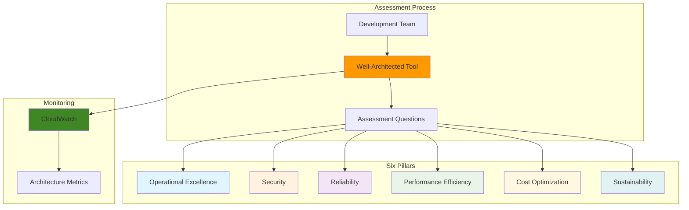

# Architecture Assessment with AWS Well-Architected Tool

## Problem

Development teams often deploy applications without systematic evaluation against architectural best practices, leading to security vulnerabilities, operational inefficiencies, and unexpected costs. Organizations lack a structured approach to assess their workloads against proven AWS architectural principles, making it difficult to identify potential risks and improvement opportunities before they impact business operations.

## Solution

The AWS Well-Architected Tool provides a consistent framework for evaluating cloud architectures against the six pillars of the Well-Architected Framework: Operational Excellence, Security, Reliability, Performance Efficiency, Cost Optimization, and Sustainability. This assessment process guides teams through structured questions to identify areas for improvement and prioritize remediation efforts.

## Architecture Diagram



## Prerequisites

1. AWS Account with Well-Architected Tool access (included in all AWS accounts)
2. AWS CLI v2 installed and configured or AWS CloudShell access
3. Basic understanding of cloud architecture concepts
4. IAM permissions for Well-Architected Tool (wellarchitected:* actions)
5. Estimated cost: Well-Architected Tool assessments are free of charge

> **Note**: This assessment tool is provided at no additional cost and helps identify potential cost savings and optimization opportunities.

## Preparation

```bash
# Set environment variables
export AWS_REGION=$(aws configure get region)
export AWS_ACCOUNT_ID=$(aws sts get-caller-identity \
    --query Account --output text)

# Generate unique identifier for workload
RANDOM_SUFFIX=$(aws secretsmanager get-random-password \
    --exclude-punctuation --exclude-uppercase \
    --password-length 6 --require-each-included-type \
    --output text --query RandomPassword)

# Set workload name with unique suffix
export WORKLOAD_NAME="sample-web-app-${RANDOM_SUFFIX}"

echo "✅ Environment configured for Well-Architected assessment"
echo "Workload name: ${WORKLOAD_NAME}"
echo "AWS Region: ${AWS_REGION}"
```

## Steps

1. **Create a New Workload for Assessment**:

   The Well-Architected Tool organizes assessments around workloads, which represent collections of resources that deliver business value. Creating a workload establishes the scope and context for your architectural review, enabling systematic evaluation against AWS best practices across all six pillars of the framework.

   ```bash
   # Create workload with basic configuration
   aws wellarchitected create-workload \
       --workload-name "${WORKLOAD_NAME}" \
       --description "Sample web application workload for assessment" \
       --environment "PREPRODUCTION" \
       --aws-regions "${AWS_REGION}" \
       --review-owner "$(aws sts get-caller-identity --query Arn --output text)" \
       --lenses "wellarchitected" \
       --industry-type "InfoTech" \
       --architectural-design "Three-tier web application with load balancer, application servers, and database"
   
   # Store workload ID for subsequent commands
   export WORKLOAD_ID=$(aws wellarchitected list-workloads \
       --workload-name-prefix "${WORKLOAD_NAME}" \
       --query 'WorkloadSummaries[0].WorkloadId' --output text)
   
   echo "✅ Workload created with ID: ${WORKLOAD_ID}"
   ```

   The workload now appears in your Well-Architected Tool dashboard, ready for systematic assessment against architectural best practices. This provides the foundation for comprehensive review across all six pillars and enables tracking of architectural improvements over time.

2. **Verify Workload Creation and Configuration**:

   Verifying workload configuration ensures all required metadata is properly set before beginning the assessment process. This validation step confirms the workload is ready for review and all necessary permissions are in place.

   ```bash
   # Retrieve workload details to confirm configuration
   aws wellarchitected get-workload \
       --workload-id "${WORKLOAD_ID}" \
       --query '{
           WorkloadName: Workload.WorkloadName,
           Environment: Workload.Environment,
           ReviewOwner: Workload.ReviewOwner,
           Lenses: Workload.Lenses,
           RiskCounts: Workload.RiskCounts
       }' --output table
   
   echo "✅ Workload configuration verified"
   ```

3. **Start Lens Review for Architecture Assessment**:

   The lens review process guides you through structured questions for each pillar of the Well-Architected Framework. This systematic approach ensures comprehensive coverage of architectural concerns and provides actionable recommendations for improvement based on AWS best practices.

   ```bash
   # Get lens review summary to see assessment status
   aws wellarchitected get-lens-review \
       --workload-id "${WORKLOAD_ID}" \
       --lens-alias "wellarchitected" \
       --query '{
           LensName: LensReview.LensName,
           LensStatus: LensReview.LensStatus,
           PillarReviewSummaries: LensReview.PillarReviewSummaries[].{
               PillarId: PillarId,
               PillarName: PillarName,
               RiskCounts: RiskCounts
           }
       }' --output table
   
   echo "✅ Lens review initiated - ready for assessment questions"
   ```

4. **List Assessment Questions by Pillar**:

   Each pillar contains specific questions designed to evaluate different aspects of your architecture. Reviewing questions helps you understand what areas will be assessed and prepare appropriate responses based on your current implementation.

   ```bash
   # List questions for Operational Excellence pillar
   aws wellarchitected list-answers \
       --workload-id "${WORKLOAD_ID}" \
       --lens-alias "wellarchitected" \
       --pillar-id "operationalExcellence" \
       --query 'AnswerSummaries[0:3].{
           QuestionId: QuestionId,
           QuestionTitle: QuestionTitle,
           IsApplicable: IsApplicable,
           SelectedChoices: SelectedChoices
       }' --output table
   
   echo "✅ Sample operational excellence questions displayed"
   ```

5. **Answer a Sample Architecture Question**:

   Answering assessment questions requires careful consideration of your current architecture and practices. Each choice reflects specific architectural decisions and their alignment with Well-Architected principles, directly impacting your risk assessment and improvement recommendations.

   ```bash
   # Get a specific question to answer
   QUESTION_ID=$(aws wellarchitected list-answers \
       --workload-id "${WORKLOAD_ID}" \
       --lens-alias "wellarchitected" \
       --pillar-id "operationalExcellence" \
       --query 'AnswerSummaries[0].QuestionId' --output text)
   
   # View the question details
   aws wellarchitected get-answer \
       --workload-id "${WORKLOAD_ID}" \
       --lens-alias "wellarchitected" \
       --question-id "${QUESTION_ID}" \
       --query '{
           QuestionTitle: Answer.QuestionTitle,
           Choices: Answer.Choices[].{
               ChoiceId: ChoiceId,
               Title: Title,
               Description: Description
           }
       }' --output table
   
   echo "✅ Question details retrieved for assessment"
   ```

6. **Update Answer with Architecture Choices**:

   Providing accurate answers to assessment questions ensures meaningful recommendations. Each response should reflect your actual architectural implementation and practices, enabling the tool to provide targeted guidance for improvement.

   ```bash
   # Answer the question with relevant choices
   # Note: This example selects the first available choice
   CHOICE_ID=$(aws wellarchitected get-answer \
       --workload-id "${WORKLOAD_ID}" \
       --lens-alias "wellarchitected" \
       --question-id "${QUESTION_ID}" \
       --query 'Answer.Choices[0].ChoiceId' --output text)
   
   aws wellarchitected update-answer \
       --workload-id "${WORKLOAD_ID}" \
       --lens-alias "wellarchitected" \
       --question-id "${QUESTION_ID}" \
       --selected-choices "${CHOICE_ID}" \
       --notes "Sample answer provided for demonstration"
       
   echo "✅ Assessment question answered"
   ```

7. **View Assessment Progress and Risk Summary**:

   Monitoring assessment progress helps track completion status and identify areas requiring immediate attention. The risk summary provides an overview of potential issues across all pillars, enabling prioritized remediation efforts.

   ```bash
   # Check overall workload risk assessment
   aws wellarchitected get-workload \
       --workload-id "${WORKLOAD_ID}" \
       --query '{
           WorkloadName: Workload.WorkloadName,
           UpdatedAt: Workload.UpdatedAt,
           RiskCounts: Workload.RiskCounts,
           ImprovementStatus: Workload.ImprovementStatus
       }' --output table
   
   echo "✅ Risk assessment summary displayed"
   ```

8. **Generate Improvement Plan Report**:

   The improvement plan consolidates findings across all pillars into actionable recommendations. This prioritized list helps teams focus remediation efforts on the most impactful architectural improvements for their specific workload context, following AWS best practices.

   ```bash
   # List improvement recommendations
   aws wellarchitected list-lens-review-improvements \
       --workload-id "${WORKLOAD_ID}" \
       --lens-alias "wellarchitected" \
       --query 'ImprovementSummaries[0:5].{
           QuestionId: QuestionId,
           QuestionTitle: QuestionTitle,
           PillarId: PillarId,
           Risk: Risk,
           ImprovementPlanUrl: ImprovementPlanUrl
       }' --output table
   
   echo "✅ Improvement recommendations generated"
   ```

## Validation & Testing

1. Verify workload was created successfully:

   ```bash
   # Confirm workload exists and is configured
   aws wellarchitected list-workloads \
       --workload-name-prefix "${WORKLOAD_NAME}" \
       --query 'WorkloadSummaries[].{
           WorkloadId: WorkloadId,
           WorkloadName: WorkloadName,
           Owner: Owner,
           UpdatedAt: UpdatedAt
       }' --output table
   ```

   Expected output: Table showing your workload with current timestamp

2. Validate lens review is accessible:

   ```bash
   # Check lens review status
   aws wellarchitected get-lens-review \
       --workload-id "${WORKLOAD_ID}" \
       --lens-alias "wellarchitected" \
       --query 'LensReview.{
           LensName: LensName,
           LensStatus: LensStatus,
           UpdatedAt: UpdatedAt
       }' --output table
   ```

   Expected output: Lens review details with "CURRENT" status

3. Test question retrieval across pillars:

   ```bash
   # Verify questions are available for all pillars
   for pillar in "operationalExcellence" "security" "reliability" "performance" "costOptimization" "sustainability"; do
       count=$(aws wellarchitected list-answers \
           --workload-id "${WORKLOAD_ID}" \
           --lens-alias "wellarchitected" \
           --pillar-id "${pillar}" \
           --query 'length(AnswerSummaries)' --output text)
       echo "✅ ${pillar}: ${count} questions available"
   done
   ```

## Cleanup

1. Remove the assessment workload:

   ```bash
   # Delete the workload and all associated data
   aws wellarchitected delete-workload \
       --workload-id "${WORKLOAD_ID}"
   
   echo "✅ Workload deleted successfully"
   ```

2. Verify workload removal:

   ```bash
   # Confirm workload no longer exists
   aws wellarchitected list-workloads \
       --workload-name-prefix "${WORKLOAD_NAME}" \
       --query 'length(WorkloadSummaries)' --output text
   ```

3. Clean up environment variables:

   ```bash
   # Remove exported variables
   unset WORKLOAD_NAME WORKLOAD_ID AWS_REGION AWS_ACCOUNT_ID RANDOM_SUFFIX
   
   echo "✅ Environment variables cleaned up"
   ```

## Discussion

The AWS Well-Architected Tool serves as a critical governance mechanism for cloud architectures, providing systematic evaluation against proven best practices developed from AWS's extensive experience with customer workloads. The tool's structured approach to architectural review ensures comprehensive coverage across six fundamental pillars: Operational Excellence (focused on running and monitoring systems), Security (protecting information and systems), Reliability (ensuring systems recover from failures), Performance Efficiency (using computing resources effectively), Cost Optimization (avoiding unnecessary costs), and Sustainability (minimizing environmental impact).

The assessment process leverages a question-based methodology that guides teams through architectural decisions while providing context-aware recommendations. Each question addresses specific architectural concerns with multiple-choice answers that reflect different implementation approaches, enabling teams to accurately represent their current state while understanding the implications of various design choices. The tool's risk assessment capabilities help prioritize improvement efforts by identifying high and medium-risk issues that could significantly impact business operations, following the principles outlined in the AWS Well-Architected Framework.

Integration with CloudWatch enhances the assessment process by providing operational metrics that inform architectural decisions. Teams can leverage monitoring data to validate their responses and track improvement progress over time. The tool's milestone feature enables organizations to capture architectural snapshots at key points in the development lifecycle, facilitating compliance reporting and architectural evolution tracking across multiple environments and workloads.

> **Tip**: Schedule regular Well-Architected reviews every 6-12 months to ensure your architecture evolves with changing requirements and new AWS capabilities. Consider using the tool's sharing capabilities for collaborative reviews across teams.

The assessment methodology emphasizes continuous improvement rather than one-time evaluation, encouraging teams to revisit their architectures as workloads mature and requirements evolve. This iterative approach ensures that architectural decisions remain aligned with business objectives while incorporating lessons learned from operational experience. The tool's sharing capabilities enable collaborative reviews across teams and organizations, promoting knowledge transfer and architectural consistency.

For comprehensive architectural guidance, refer to the official [AWS Well-Architected Framework documentation](https://docs.aws.amazon.com/wellarchitected/latest/framework/welcome.html), [Well-Architected Tool User Guide](https://docs.aws.amazon.com/wellarchitected/latest/userguide/intro.html), [AWS Architecture Center](https://aws.amazon.com/architecture/), [Well-Architected Labs](https://wellarchitectedlabs.com/), and [AWS Well-Architected Partner Program](https://aws.amazon.com/architecture/well-architected/partners/) for expert-led assessments.

## Challenge

Extend this architectural assessment solution by implementing these enhancements:

1. **Automated Assessment Workflow**: Create a CI/CD pipeline that triggers Well-Architected assessments when infrastructure changes are deployed, integrating with AWS CodePipeline and triggering assessments via AWS Lambda functions.

2. **Multi-Environment Assessment**: Implement comparative assessments across development, staging, and production environments to identify architectural drift and ensure consistency in best practices application.

3. **Custom Lens Development**: Build organization-specific lenses that incorporate internal architectural standards, compliance requirements, and industry-specific best practices beyond the standard AWS framework.

4. **Assessment Analytics Dashboard**: Develop a comprehensive dashboard using Amazon QuickSight that aggregates assessment results across multiple workloads, providing executive visibility into architectural risk trends and improvement progress.

5. **Integration with AWS Security Hub**: Connect Well-Architected assessments with Security Hub findings to correlate architectural risks with actual security events and compliance violations for enhanced risk management.

## Infrastructure Code

### Available Infrastructure as Code:

- [Infrastructure Code Overview](code/README.md) - Detailed description of all infrastructure components
- [AWS CDK (Python)](code/cdk-python/) - AWS CDK Python implementation
- [AWS CDK (TypeScript)](code/cdk-typescript/) - AWS CDK TypeScript implementation
- [CloudFormation](code/cloudformation.yaml) - AWS CloudFormation template
- [Bash CLI Scripts](code/scripts/) - Example bash scripts using AWS CLI commands to deploy infrastructure
- [Terraform](code/terraform/) - Terraform configuration files