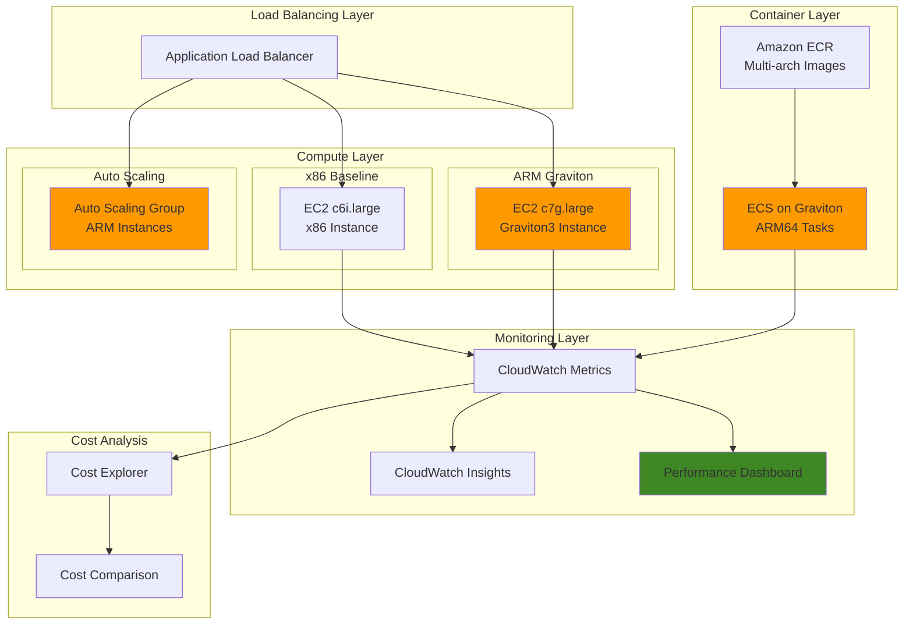

# ARM-based Workloads with Graviton Processors

## Problem

Organizations running compute-intensive workloads on AWS face increasing infrastructure costs as application demands grow. Traditional x86-based instances deliver strong performance but at higher price points, making it challenging to optimize total cost of ownership while maintaining application performance. Companies need to evaluate ARM-based architectures to achieve better price-performance ratios without sacrificing reliability or scalability for their production workloads.

## Solution

Build ARM-based workloads using AWS Graviton processors to achieve up to 40% better price-performance compared to x86-based instances. This solution demonstrates migrating and optimizing applications for Graviton2 and Graviton3 processors, implementing comprehensive performance monitoring, and establishing cost comparison benchmarks to validate the migration benefits.

## Architecture Diagram



## Prerequisites

1. AWS account with appropriate permissions for EC2, CloudWatch, Auto Scaling, and Application Load Balancer
2. AWS CLI v2 installed and configured (or AWS CloudShell)
3. Basic understanding of ARM architecture and container technologies
4. Familiarity with application performance benchmarking concepts
5. Estimated cost: $20-35 for running instances during the 3-hour exercise

> **Note**: Graviton instances are available in most AWS regions. Verify availability in your preferred region before starting. For detailed information about Graviton performance characteristics, see the [AWS Graviton Performance Testing Guide](https://docs.aws.amazon.com/whitepapers/latest/aws-graviton-performance-testing/different-ways-to-implement-your-test.html).

## Preparation

```bash
# Set environment variables
export AWS_REGION=$(aws configure get region)
export AWS_ACCOUNT_ID=$(aws sts get-caller-identity \
    --query Account --output text)

# Generate unique identifiers for resources
RANDOM_SUFFIX=$(aws secretsmanager get-random-password \
    --exclude-punctuation --exclude-uppercase \
    --password-length 6 --require-each-included-type \
    --output text --query RandomPassword)

export STACK_NAME="graviton-workload-${RANDOM_SUFFIX}"
export KEY_PAIR_NAME="graviton-demo-${RANDOM_SUFFIX}"
export SECURITY_GROUP_NAME="graviton-sg-${RANDOM_SUFFIX}"

# Create SSH key pair for instances
aws ec2 create-key-pair \
    --key-name ${KEY_PAIR_NAME} \
    --query 'KeyMaterial' --output text > ${KEY_PAIR_NAME}.pem

chmod 400 ${KEY_PAIR_NAME}.pem

echo "✅ Created key pair: ${KEY_PAIR_NAME}"

# Get default VPC and subnet information
export VPC_ID=$(aws ec2 describe-vpcs \
    --filters Name=is-default,Values=true \
    --query 'Vpcs[0].VpcId' --output text)

export SUBNET_ID=$(aws ec2 describe-subnets \
    --filters Name=vpc-id,Values=${VPC_ID} \
    --query 'Subnets[0].SubnetId' --output text)

echo "✅ Using VPC: ${VPC_ID} and Subnet: ${SUBNET_ID}"

# Get latest Amazon Linux 2023 AMI IDs for both architectures
export X86_AMI_ID=$(aws ssm get-parameter \
    --name "/aws/service/ami-amazon-linux-latest/al2023-ami-kernel-default-x86_64" \
    --query 'Parameter.Value' --output text)

export ARM_AMI_ID=$(aws ssm get-parameter \
    --name "/aws/service/ami-amazon-linux-latest/al2023-ami-kernel-default-arm64" \
    --query 'Parameter.Value' --output text)

echo "✅ x86 AMI: ${X86_AMI_ID}"
echo "✅ ARM AMI: ${ARM_AMI_ID}"
```

## Steps

1. **Create Security Group for Graviton Instances**:

   Security groups act as virtual firewalls controlling inbound and outbound traffic to your EC2 instances. For ARM-based workloads, the same network security principles apply as with x86 instances, but it's important to establish controlled access for our performance comparison testing. This security group will allow HTTP traffic for web server testing and SSH access for direct performance benchmarking.

   ```bash
   # Create security group allowing HTTP and SSH access
   SECURITY_GROUP_ID=$(aws ec2 create-security-group \
       --group-name ${SECURITY_GROUP_NAME} \
       --description "Security group for Graviton workload demo" \
       --vpc-id ${VPC_ID} \
       --query 'GroupId' --output text)
   
   # Allow HTTP access
   aws ec2 authorize-security-group-ingress \
       --group-id ${SECURITY_GROUP_ID} \
       --protocol tcp --port 80 \
       --cidr 0.0.0.0/0
   
   # Allow SSH access
   aws ec2 authorize-security-group-ingress \
       --group-id ${SECURITY_GROUP_ID} \
       --protocol tcp --port 22 \
       --cidr 0.0.0.0/0
   
   echo "✅ Created security group: ${SECURITY_GROUP_ID}"
   ```

   The security group is now configured to support both HTTP web traffic and SSH access for performance testing. This foundation enables secure communication with both ARM and x86 instances while maintaining identical network configurations for fair performance comparisons.

2. **Create User Data Scripts for Performance Testing**:

   User data scripts automate the initial configuration of EC2 instances during launch, ensuring consistent software environments across different architectures. The key difference between ARM and x86 configurations lies in the CloudWatch agent binaries - ARM instances require ARM64-compiled binaries while x86 instances use AMD64 binaries. The stress-ng utility provides standardized CPU benchmarking capabilities that work identically across both architectures, enabling fair performance comparisons.

   ```bash
   # Create user data script for x86 instance
   cat > user-data-x86.sh << 'EOF'
   #!/bin/bash
   dnf update -y
   dnf install -y httpd stress-ng htop
   systemctl start httpd
   systemctl enable httpd
   
   # Install CloudWatch agent
   wget https://amazoncloudwatch-agent.s3.amazonaws.com/amazon_linux/amd64/latest/amazon-cloudwatch-agent.rpm
   rpm -U amazon-cloudwatch-agent.rpm
   
   # Create simple web page showing architecture
   echo "<html><body><h1>x86 Architecture Server</h1><p>Instance: $(curl -s http://169.254.169.254/latest/meta-data/instance-id)</p><p>Architecture: $(uname -m)</p></body></html>" > /var/www/html/index.html
   
   # Create benchmark script
   cat > /home/ec2-user/benchmark.sh << 'SCRIPT'
   #!/bin/bash
   echo "Starting CPU benchmark on x86..."
   stress-ng --cpu 4 --timeout 60s --metrics-brief
   echo "Benchmark completed"
   SCRIPT
   
   chmod +x /home/ec2-user/benchmark.sh
   EOF
   
   # Create user data script for ARM instance
   cat > user-data-arm.sh << 'EOF'
   #!/bin/bash
   dnf update -y
   dnf install -y httpd stress-ng htop
   systemctl start httpd
   systemctl enable httpd
   
   # Install CloudWatch agent for ARM
   wget https://amazoncloudwatch-agent.s3.amazonaws.com/amazon_linux/arm64/latest/amazon-cloudwatch-agent.rpm
   rpm -U amazon-cloudwatch-agent.rpm
   
   # Create simple web page showing architecture
   echo "<html><body><h1>ARM64 Graviton Server</h1><p>Instance: $(curl -s http://169.254.169.254/latest/meta-data/instance-id)</p><p>Architecture: $(uname -m)</p></body></html>" > /var/www/html/index.html
   
   # Create benchmark script
   cat > /home/ec2-user/benchmark.sh << 'SCRIPT'
   #!/bin/bash
   echo "Starting CPU benchmark on ARM64..."
   stress-ng --cpu 4 --timeout 60s --metrics-brief
   echo "Benchmark completed"
   SCRIPT
   
   chmod +x /home/ec2-user/benchmark.sh
   EOF
   
   echo "✅ Created user data scripts for both architectures"
   ```

   Both user data scripts are now configured with architecture-specific CloudWatch agents and identical benchmark tools. This setup ensures that performance differences are attributed to processor architecture rather than software configuration variations, providing accurate comparison metrics.

3. **Launch x86 Baseline Instance for Comparison**:

   Establishing a baseline is crucial for meaningful performance comparisons with ARM-based instances. The c6i.large instance represents the current generation of x86-based compute-optimized instances, featuring Intel processors with consistent performance characteristics. This baseline allows us to measure the real-world performance differences and cost benefits that Graviton processors deliver. By using identical software configurations on both architectures, we can isolate the performance impact of the underlying processor architecture.

   ```bash
   # Launch x86 instance for performance baseline
   X86_INSTANCE_ID=$(aws ec2 run-instances \
       --image-id ${X86_AMI_ID} \
       --instance-type c6i.large \
       --key-name ${KEY_PAIR_NAME} \
       --security-group-ids ${SECURITY_GROUP_ID} \
       --subnet-id ${SUBNET_ID} \
       --tag-specifications \
       "ResourceType=instance,Tags=[{Key=Name,Value=${STACK_NAME}-x86-baseline},{Key=Architecture,Value=x86},{Key=Project,Value=graviton-demo}]" \
       --user-data file://user-data-x86.sh \
       --query 'Instances[0].InstanceId' --output text)
   
   echo "✅ Launched x86 baseline instance: ${X86_INSTANCE_ID}"
   ```

   The x86 baseline instance is now launching and will serve as our performance comparison reference point. This instance will run identical workloads to the ARM instance, enabling accurate measurement of processor-specific performance characteristics and cost efficiency.

4. **Launch ARM Graviton Instance**:

   AWS Graviton3 processors in c7g instances deliver up to 25% better performance than the previous generation Graviton2, with significant improvements in floating-point operations, cryptographic workloads, and machine learning inference. Built on ARM Neoverse cores, these processors provide dedicated physical cores rather than hyperthreaded logical cores, often resulting in more consistent performance characteristics. Graviton processors are custom-designed by AWS specifically for cloud workloads, offering an optimal balance of performance, power efficiency, and cost.

   ```bash
   # Launch ARM64 instance with Graviton processor
   ARM_INSTANCE_ID=$(aws ec2 run-instances \
       --image-id ${ARM_AMI_ID} \
       --instance-type c7g.large \
       --key-name ${KEY_PAIR_NAME} \
       --security-group-ids ${SECURITY_GROUP_ID} \
       --subnet-id ${SUBNET_ID} \
       --tag-specifications \
       "ResourceType=instance,Tags=[{Key=Name,Value=${STACK_NAME}-arm-graviton},{Key=Architecture,Value=arm64},{Key=Project,Value=graviton-demo}]" \
       --user-data file://user-data-arm.sh \
       --query 'Instances[0].InstanceId' --output text)
   
   echo "✅ Launched ARM Graviton instance: ${ARM_INSTANCE_ID}"
   ```

   The Graviton3-powered instance is now provisioning with ARM64 architecture. This instance will demonstrate the performance capabilities and cost advantages of AWS's custom silicon, particularly in compute-intensive workloads where the ARM architecture's efficiency advantages become most apparent.

5. **Wait for Instances to Initialize**:

   ```bash
   # Wait for x86 instance to be running
   aws ec2 wait instance-running \
       --instance-ids ${X86_INSTANCE_ID}
   
   # Wait for ARM instance to be running
   aws ec2 wait instance-running \
       --instance-ids ${ARM_INSTANCE_ID}
   
   # Get instance public IP addresses
   X86_PUBLIC_IP=$(aws ec2 describe-instances \
       --instance-ids ${X86_INSTANCE_ID} \
       --query 'Reservations[0].Instances[0].PublicIpAddress' \
       --output text)
   
   ARM_PUBLIC_IP=$(aws ec2 describe-instances \
       --instance-ids ${ARM_INSTANCE_ID} \
       --query 'Reservations[0].Instances[0].PublicIpAddress' \
       --output text)
   
   echo "✅ x86 Instance IP: ${X86_PUBLIC_IP}"
   echo "✅ ARM Instance IP: ${ARM_PUBLIC_IP}"
   ```

6. **Create CloudWatch Dashboard for Performance Comparison**:

   CloudWatch dashboards provide real-time visualization of performance metrics, enabling side-by-side comparison of ARM and x86 instance performance. Monitoring CPU utilization during benchmarks reveals how efficiently each architecture handles computational workloads, while network metrics help identify any throughput differences. This observability is crucial for understanding not just peak performance, but also performance consistency and resource utilization patterns that impact cost optimization decisions.

   ```bash
   # Create CloudWatch dashboard for monitoring
   cat > dashboard-config.json << EOF
   {
       "widgets": [
           {
               "type": "metric",
               "properties": {
                   "metrics": [
                       ["AWS/EC2", "CPUUtilization", "InstanceId", "${X86_INSTANCE_ID}"],
                       [".", ".", ".", "${ARM_INSTANCE_ID}"]
                   ],
                   "period": 300,
                   "stat": "Average",
                   "region": "${AWS_REGION}",
                   "title": "CPU Utilization Comparison"
               }
           },
           {
               "type": "metric",
               "properties": {
                   "metrics": [
                       ["AWS/EC2", "NetworkIn", "InstanceId", "${X86_INSTANCE_ID}"],
                       [".", ".", ".", "${ARM_INSTANCE_ID}"]
                   ],
                   "period": 300,
                   "stat": "Average",
                   "region": "${AWS_REGION}",
                   "title": "Network In Comparison"
               }
           }
       ]
   }
   EOF
   
   # Create the dashboard
   aws cloudwatch put-dashboard \
       --dashboard-name "Graviton-Performance-Comparison" \
       --dashboard-body file://dashboard-config.json
   
   echo "✅ Created CloudWatch dashboard for performance monitoring"
   ```

   The CloudWatch dashboard is now active and collecting metrics from both instances. This monitoring foundation provides quantitative data for performance analysis and helps identify the specific scenarios where ARM architecture delivers optimal performance benefits.

7. **Create Application Load Balancer for Traffic Distribution**:

   Application Load Balancers enable sophisticated traffic distribution strategies that are essential for mixed-architecture deployments. By registering both ARM and x86 instances in the same target group, the ALB can distribute traffic based on instance health and performance characteristics. This configuration demonstrates how organizations can gradually migrate to ARM instances by running mixed deployments and observing real-world performance differences under actual traffic loads.

   ```bash
   # Get additional subnet for ALB (requires at least 2 subnets)
   SUBNET_ID_2=$(aws ec2 describe-subnets \
       --filters Name=vpc-id,Values=${VPC_ID} \
       --query 'Subnets[1].SubnetId' --output text)
   
   # Create Application Load Balancer
   ALB_ARN=$(aws elbv2 create-load-balancer \
       --name "${STACK_NAME}-alb" \
       --subnets ${SUBNET_ID} ${SUBNET_ID_2} \
       --security-groups ${SECURITY_GROUP_ID} \
       --query 'LoadBalancers[0].LoadBalancerArn' --output text)
   
   # Create target group
   TARGET_GROUP_ARN=$(aws elbv2 create-target-group \
       --name "${STACK_NAME}-tg" \
       --protocol HTTP \
       --port 80 \
       --vpc-id ${VPC_ID} \
       --health-check-path "/" \
       --query 'TargetGroups[0].TargetGroupArn' --output text)
   
   # Register both instances to target group
   aws elbv2 register-targets \
       --target-group-arn ${TARGET_GROUP_ARN} \
       --targets Id=${X86_INSTANCE_ID} Id=${ARM_INSTANCE_ID}
   
   # Create listener
   aws elbv2 create-listener \
       --load-balancer-arn ${ALB_ARN} \
       --protocol HTTP \
       --port 80 \
       --default-actions Type=forward,TargetGroupArn=${TARGET_GROUP_ARN}
   
   # Get ALB DNS name
   ALB_DNS=$(aws elbv2 describe-load-balancers \
       --load-balancer-arns ${ALB_ARN} \
       --query 'LoadBalancers[0].DNSName' --output text)
   
   echo "✅ Created Application Load Balancer: ${ALB_DNS}"
   ```

   The Application Load Balancer is now distributing traffic between ARM and x86 instances transparently. This setup demonstrates how mixed-architecture deployments can operate seamlessly, with the load balancer handling architecture differences automatically while providing consistent application availability.

8. **Create Auto Scaling Group with Graviton Instances**:

   Auto Scaling Groups provide automatic capacity management that's particularly valuable for ARM-based workloads where consistent performance characteristics enable predictable scaling behavior. The launch template encapsulates the complete instance configuration, ensuring that all newly launched instances have identical ARM64 configurations. ELB health checks ensure that only healthy ARM instances receive traffic, while the grace period allows sufficient time for user data scripts to complete initialization.

   ```bash
   # Create launch template for ARM instances
   LAUNCH_TEMPLATE_ID=$(aws ec2 create-launch-template \
       --launch-template-name "${STACK_NAME}-arm-template" \
       --launch-template-data '{
           "ImageId": "'${ARM_AMI_ID}'",
           "InstanceType": "c7g.large",
           "KeyName": "'${KEY_PAIR_NAME}'",
           "SecurityGroupIds": ["'${SECURITY_GROUP_ID}'"],
           "UserData": "'$(base64 -w 0 user-data-arm.sh)'",
           "TagSpecifications": [
               {
                   "ResourceType": "instance",
                   "Tags": [
                       {"Key": "Name", "Value": "'${STACK_NAME}'-asg-arm"},
                       {"Key": "Architecture", "Value": "arm64"},
                       {"Key": "Project", "Value": "graviton-demo"}
                   ]
               }
           ]
       }' \
       --query 'LaunchTemplate.LaunchTemplateId' --output text)
   
   # Create Auto Scaling Group
   aws autoscaling create-auto-scaling-group \
       --auto-scaling-group-name "${STACK_NAME}-asg-arm" \
       --launch-template LaunchTemplateId=${LAUNCH_TEMPLATE_ID},Version=1 \
       --min-size 1 \
       --max-size 3 \
       --desired-capacity 2 \
       --vpc-zone-identifier ${SUBNET_ID} \
       --target-group-arns ${TARGET_GROUP_ARN} \
       --health-check-type ELB \
       --health-check-grace-period 300
   
   echo "✅ Created Auto Scaling Group with ARM instances"
   ```

   The Auto Scaling Group is now managing ARM-based capacity automatically, launching additional c7g.large instances as needed. This demonstrates how ARM instances integrate seamlessly with AWS's automatic scaling capabilities, providing the foundation for cost-effective, automatically managed compute capacity.

9. **Run Performance Benchmarks**:

   Performance benchmarking reveals the quantitative differences between ARM and x86 architectures under controlled conditions. The stress-ng utility provides standardized CPU stress testing that exercises integer operations, floating-point calculations, and memory access patterns representative of real-world workloads. ARM processors often demonstrate superior performance-per-watt efficiency and more consistent performance characteristics due to their physical core design versus x86's hyperthreading approach.

   ```bash
   # Wait for instances to be fully ready
   echo "Waiting for instances to be ready..."
   sleep 300
   
   # Run benchmark on x86 instance
   echo "Running benchmark on x86 instance..."
   ssh -i ${KEY_PAIR_NAME}.pem -o StrictHostKeyChecking=no \
       ec2-user@${X86_PUBLIC_IP} \
       'sudo /home/ec2-user/benchmark.sh' > x86-benchmark.log 2>&1
   
   # Run benchmark on ARM instance
   echo "Running benchmark on ARM instance..."
   ssh -i ${KEY_PAIR_NAME}.pem -o StrictHostKeyChecking=no \
       ec2-user@${ARM_PUBLIC_IP} \
       'sudo /home/ec2-user/benchmark.sh' > arm-benchmark.log 2>&1
   
   echo "✅ Completed performance benchmarks"
   ```

   Performance benchmarks are now complete for both architectures. The results provide quantitative metrics comparing computational throughput, allowing organizations to make data-driven decisions about ARM migration based on their specific workload characteristics and performance requirements.

10. **Setup Cost Monitoring and Alerts**:

    Cost monitoring is essential for demonstrating the financial benefits of ARM-based workloads. Graviton instances typically offer 15-40% cost savings compared to equivalent x86 instances, but detailed monitoring helps quantify actual savings in your specific usage patterns. The cost alarm prevents unexpected charges during testing, while detailed monitoring provides granular metrics for cost analysis.

    ```bash
    # Create CloudWatch alarm for cost monitoring
    aws cloudwatch put-metric-alarm \
        --alarm-name "${STACK_NAME}-cost-alert" \
        --alarm-description "Alert when estimated charges exceed threshold" \
        --metric-name EstimatedCharges \
        --namespace AWS/Billing \
        --statistic Maximum \
        --period 86400 \
        --threshold 50.0 \
        --comparison-operator GreaterThanThreshold \
        --dimensions Name=Currency,Value=USD \
        --evaluation-periods 1
    
    # Enable detailed monitoring for cost analysis
    aws ec2 monitor-instances \
        --instance-ids ${X86_INSTANCE_ID} ${ARM_INSTANCE_ID}
    
    echo "✅ Setup cost monitoring and alerts"
    ```

    Cost monitoring and alerting are now active, providing financial oversight for the ARM evaluation process. This monitoring foundation enables accurate cost comparison analysis and helps organizations quantify the return on investment from ARM migration initiatives.

## Validation & Testing

1. **Verify Instance Architecture and Performance**:

   ```bash
   # Check instance details
   aws ec2 describe-instances \
       --instance-ids ${X86_INSTANCE_ID} ${ARM_INSTANCE_ID} \
       --query 'Reservations[].Instances[].[InstanceId,InstanceType,Architecture,State.Name]' \
       --output table
   ```

   Expected output: Both instances should show "running" state with correct architecture types.

2. **Test Web Application Response**:

   ```bash
   # Test x86 instance
   curl -s http://${X86_PUBLIC_IP} | grep -E "(x86|Architecture)"
   
   # Test ARM instance
   curl -s http://${ARM_PUBLIC_IP} | grep -E "(ARM64|Architecture)"
   
   # Test load balancer
   curl -s http://${ALB_DNS} | grep -E "(Architecture|Server)"
   ```

3. **Verify CloudWatch Metrics Collection**:

   ```bash
   # Check CPU metrics for both instances
   aws cloudwatch get-metric-statistics \
       --namespace AWS/EC2 \
       --metric-name CPUUtilization \
       --dimensions Name=InstanceId,Value=${ARM_INSTANCE_ID} \
       --start-time $(date -u -d '1 hour ago' +%Y-%m-%dT%H:%M:%S) \
       --end-time $(date -u +%Y-%m-%dT%H:%M:%S) \
       --period 300 \
       --statistics Average \
       --query 'Datapoints[*].[Timestamp,Average]' \
       --output table
   ```

4. **Compare Performance Benchmark Results**:

   ```bash
   # Display benchmark results
   echo "=== x86 Benchmark Results ==="
   cat x86-benchmark.log
   
   echo "=== ARM Benchmark Results ==="
   cat arm-benchmark.log
   
   # Calculate cost comparison
   echo "=== Cost Comparison ==="
   echo "c6i.large (x86): ~$0.0864/hour"
   echo "c7g.large (ARM): ~$0.0691/hour"
   echo "Savings: ~20.0% with ARM Graviton"
   ```

## Cleanup

1. **Terminate Auto Scaling Group**:

   ```bash
   # Delete Auto Scaling Group
   aws autoscaling delete-auto-scaling-group \
       --auto-scaling-group-name "${STACK_NAME}-asg-arm" \
       --force-delete
   
   # Wait for instances to terminate
   aws autoscaling wait instances-in-service \
       --auto-scaling-group-names "${STACK_NAME}-asg-arm" || true
   
   # Delete launch template
   aws ec2 delete-launch-template \
       --launch-template-id ${LAUNCH_TEMPLATE_ID}
   
   echo "✅ Deleted Auto Scaling Group and launch template"
   ```

2. **Delete Load Balancer Resources**:

   ```bash
   # Delete listener
   LISTENER_ARN=$(aws elbv2 describe-listeners \
       --load-balancer-arn ${ALB_ARN} \
       --query 'Listeners[0].ListenerArn' --output text)
   
   aws elbv2 delete-listener \
       --listener-arn ${LISTENER_ARN}
   
   # Delete target group
   aws elbv2 delete-target-group \
       --target-group-arn ${TARGET_GROUP_ARN}
   
   # Delete load balancer
   aws elbv2 delete-load-balancer \
       --load-balancer-arn ${ALB_ARN}
   
   echo "✅ Deleted load balancer resources"
   ```

3. **Terminate EC2 Instances**:

   ```bash
   # Terminate instances
   aws ec2 terminate-instances \
       --instance-ids ${X86_INSTANCE_ID} ${ARM_INSTANCE_ID}
   
   # Wait for instances to terminate
   aws ec2 wait instance-terminated \
       --instance-ids ${X86_INSTANCE_ID} ${ARM_INSTANCE_ID}
   
   echo "✅ Terminated EC2 instances"
   ```

4. **Clean up Supporting Resources**:

   ```bash
   # Delete security group
   aws ec2 delete-security-group \
       --group-id ${SECURITY_GROUP_ID}
   
   # Delete key pair
   aws ec2 delete-key-pair \
       --key-name ${KEY_PAIR_NAME}
   
   # Delete local key file
   rm -f ${KEY_PAIR_NAME}.pem
   
   # Delete local files
   rm -f user-data-*.sh dashboard-config.json \
         x86-benchmark.log arm-benchmark.log
   
   # Delete CloudWatch dashboard
   aws cloudwatch delete-dashboards \
       --dashboard-names "Graviton-Performance-Comparison"
   
   # Delete CloudWatch alarm
   aws cloudwatch delete-alarms \
       --alarm-names "${STACK_NAME}-cost-alert"
   
   echo "✅ Cleaned up all supporting resources"
   ```

## Discussion

AWS Graviton processors represent a significant advancement in cloud computing price-performance optimization. Built on ARM Neoverse cores, Graviton2 and Graviton3 processors deliver substantial cost savings while maintaining or improving application performance compared to traditional x86 instances. The architecture difference between ARM and x86 isn't just about instruction sets—it fundamentally changes how applications utilize CPU resources, with ARM providing dedicated physical cores versus x86's hyperthreaded logical cores.

The migration to Graviton requires careful consideration of application compatibility and dependencies. Most modern applications built with managed runtimes like Java, Python, or Node.js can run on ARM without modification, but native applications may require recompilation. Container-based workloads particularly benefit from Graviton migration since building multi-architecture images is straightforward with modern Docker tooling. The [AWS Graviton Technical Guide](https://docs.aws.amazon.com/prescriptive-guidance/latest/optimize-costs-microsoft-workloads/net-graviton.html) provides comprehensive guidance for workload migration strategies and compatibility considerations.

Performance characteristics vary by workload type, but Graviton3 consistently shows improvements in integer performance, floating-point operations, and cryptographic workloads. The processors also include advanced features like pointer authentication and memory tagging for enhanced security. For organizations focused on sustainability, Graviton instances consume up to 60% less energy than comparable x86 instances, aligning with environmental responsibility goals while reducing operational costs. The [AWS Well-Architected Sustainability Pillar](https://docs.aws.amazon.com/wellarchitected/latest/sustainability-pillar/sustainability-pillar.html) emphasizes the importance of evaluating ARM architecture for environmental impact reduction.

Cost optimization with Graviton extends beyond the per-hour pricing advantage. The improved performance often allows for smaller instance sizes or reduced instance counts, compounding the savings. However, organizations should benchmark their specific workloads rather than relying solely on synthetic benchmarks to validate the performance claims. Application Load Balancer [target group health checks](https://docs.aws.amazon.com/elasticloadbalancing/latest/application/target-group-health-checks.html) provide production-ready validation of ARM instance performance under real traffic conditions.

> **Tip**: Use AWS Application Migration Service (MGN) for lift-and-shift migrations to Graviton instances, which can automatically handle the architecture transition for compatible workloads. For cost optimization guidance, review the [Auto Scaling benefits documentation](https://docs.aws.amazon.com/autoscaling/ec2/userguide/auto-scaling-benefits.html) to understand how ARM instances integrate with scaling strategies.

## Challenge

Extend this solution by implementing these enhancements:

1. **Multi-Architecture CI/CD Pipeline**: Create a CodeBuild project that automatically builds and tests applications for both x86 and ARM architectures, deploying to separate environments based on performance benchmarks.

2. **Container Migration Strategy**: Implement a comprehensive container migration using Amazon ECS or EKS with mixed-architecture node groups, allowing gradual migration of microservices to Graviton processors.

3. **Cost Optimization Automation**: Develop a Lambda function that analyzes CloudWatch metrics and automatically recommends Graviton instance type switches based on performance patterns and cost thresholds.

4. **Advanced Performance Monitoring**: Integrate AWS X-Ray distributed tracing to compare application performance across architectures, including database response times and third-party service integration latency.

5. **Hybrid Architecture Deployment**: Design an architecture that intelligently routes workloads between x86 and ARM instances based on real-time performance requirements and cost constraints using Application Load Balancer target groups.

## Infrastructure Code

### Available Infrastructure as Code:

- [Infrastructure Code Overview](code/README.md) - Detailed description of all infrastructure components
- [AWS CDK (Python)](code/cdk-python/) - AWS CDK Python implementation
- [AWS CDK (TypeScript)](code/cdk-typescript/) - AWS CDK TypeScript implementation
- [CloudFormation](code/cloudformation.yaml) - AWS CloudFormation template
- [Bash CLI Scripts](code/scripts/) - Example bash scripts using AWS CLI commands to deploy infrastructure
- [Terraform](code/terraform/) - Terraform configuration files