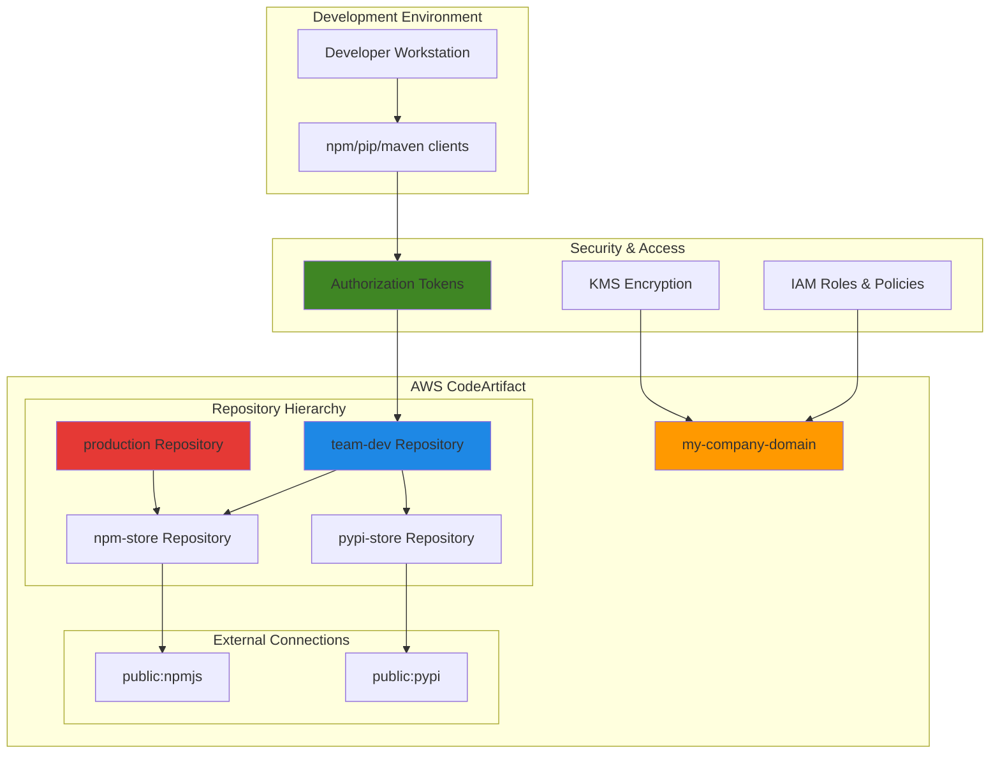

# Artifact Management with CodeArtifact

## Problem

Development teams struggle with managing software dependencies and proprietary packages across multiple projects and environments. Organizations face challenges securing artifact repositories, controlling access to packages, and ensuring consistent artifact versions across development, staging, and production environments. Public repositories like npm, PyPI, and Maven Central create security concerns and potential supply chain vulnerabilities when used directly without proper governance and caching strategies.

## Solution

AWS CodeArtifact provides a secure, scalable, and fully managed artifact repository service that integrates with popular package managers. This solution creates a centralized artifact management system with hierarchical repositories, external connections to public repositories, and fine-grained access controls. The architecture supports both private package distribution and secure consumption of open-source dependencies through upstream repositories and external connections.

## Architecture Diagram



## Prerequisites

1. AWS account with CodeArtifact service permissions
2. AWS CLI v2 installed and configured (or AWS CloudShell)
3. Node.js and npm installed (for testing npm packages)
4. Python and pip installed (for testing Python packages)
5. Basic understanding of package management concepts
6. Estimated cost: $0.024 per GB stored + $0.06 per 1,000 requests (includes Free Tier: 2GB storage + 100,000 requests monthly)

> **Note**: CodeArtifact charges for storage and requests. Most testing scenarios remain within free tier limits of 2GB storage and 100,000 requests per month.

> **Warning**: Always configure proper IAM policies before production use. Overly permissive policies can expose sensitive packages or allow unauthorized publishing. See [CodeArtifact IAM documentation](https://docs.aws.amazon.com/codeartifact/latest/ug/security-iam.html) for security best practices.

## Preparation

```bash
# Set environment variables
export AWS_REGION=$(aws configure get region)
export AWS_ACCOUNT_ID=$(aws sts get-caller-identity \
    --query Account --output text)

# Generate unique identifiers for resources
RANDOM_SUFFIX=$(aws secretsmanager get-random-password \
    --exclude-punctuation --exclude-uppercase \
    --password-length 6 --require-each-included-type \
    --output text --query RandomPassword)

# Set domain and repository names
export DOMAIN_NAME="my-company-domain-${RANDOM_SUFFIX}"
export NPM_STORE_REPO="npm-store"
export PYPI_STORE_REPO="pypi-store"
export TEAM_REPO="team-dev"
export PROD_REPO="production"

echo "Domain: ${DOMAIN_NAME}"
echo "AWS Account: ${AWS_ACCOUNT_ID}"
echo "Region: ${AWS_REGION}"
```

## Steps

1. **Create CodeArtifact Domain**:

   A CodeArtifact domain serves as the top-level container for your artifact repositories and provides a namespace for organizing packages across your organization. Domains enable centralized management of authentication, authorization, and encryption policies while supporting cross-repository package sharing. Understanding domain concepts is fundamental to implementing enterprise-grade artifact management strategies following [AWS Well-Architected Framework](https://docs.aws.amazon.com/wellarchitected/latest/framework/welcome.html) principles.

   ```bash
   # Create the domain for artifact management
   aws codeartifact create-domain \
       --domain ${DOMAIN_NAME} \
       --region ${AWS_REGION}
   
   # Store domain owner for later use
   export DOMAIN_OWNER=${AWS_ACCOUNT_ID}
   
   echo "✅ Created CodeArtifact domain: ${DOMAIN_NAME}"
   ```

   The domain is now established and ready to host multiple repositories with shared governance policies. This foundational step enables all subsequent repository creation and establishes the security boundary for your artifact management infrastructure with automatic KMS encryption for data at rest.

2. **Create Repository Hierarchy**:

   Repository hierarchies enable sophisticated package promotion workflows and governance controls essential for enterprise development. This tiered approach separates package sources (external connections), development repositories (team collaboration), and production repositories (deployment-ready artifacts). The hierarchy design supports security scanning, quality gates, and approval processes that ensure only vetted packages reach production environments.

   ```bash
   # Create npm store repository with external connection
   aws codeartifact create-repository \
       --domain ${DOMAIN_NAME} \
       --domain-owner ${DOMAIN_OWNER} \
       --repository ${NPM_STORE_REPO} \
       --description "npm packages from public registry"
   
   # Create pypi store repository  
   aws codeartifact create-repository \
       --domain ${DOMAIN_NAME} \
       --domain-owner ${DOMAIN_OWNER} \
       --repository ${PYPI_STORE_REPO} \
       --description "Python packages from PyPI"
   
   # Create team development repository
   aws codeartifact create-repository \
       --domain ${DOMAIN_NAME} \
       --domain-owner ${DOMAIN_OWNER} \
       --repository ${TEAM_REPO} \
       --description "Team development artifacts"
   
   # Create production repository
   aws codeartifact create-repository \
       --domain ${DOMAIN_NAME} \
       --domain-owner ${DOMAIN_OWNER} \
       --repository ${PROD_REPO} \
       --description "Production-ready artifacts"
   
   echo "✅ Created repository hierarchy"
   ```

   The multi-tier repository structure is now established, providing clear separation between public packages, development artifacts, and production-ready code. This architecture enables controlled package promotion workflows and supports implementing security scanning and approval gates at each tier.

3. **Configure External Connections**:

   External connections provide secure access to public package repositories while maintaining organizational control and caching benefits. Instead of developers directly accessing npm or PyPI, packages are cached in your private repositories, improving build reliability and enabling security scanning. This approach reduces dependency on external services while maintaining access to the full ecosystem of open-source packages. Learn more about [external connections](https://docs.aws.amazon.com/codeartifact/latest/ug/external-connection.html) and their security benefits.

   ```bash
   # Add external connection to npm public registry
   aws codeartifact associate-external-connection \
       --domain ${DOMAIN_NAME} \
       --domain-owner ${DOMAIN_OWNER} \
       --repository ${NPM_STORE_REPO} \
       --external-connection "public:npmjs"
   
   # Add external connection to PyPI public registry
   aws codeartifact associate-external-connection \
       --domain ${DOMAIN_NAME} \
       --domain-owner ${DOMAIN_OWNER} \
       --repository ${PYPI_STORE_REPO} \
       --external-connection "public:pypi"
   
   echo "✅ Configured external connections to public registries"
   ```

   External connections are now active, enabling secure access to public packages through your private repositories. When packages are requested, CodeArtifact will fetch and cache them locally, reducing external dependencies and improving build performance while maintaining package availability.

4. **Setup Repository Upstream Relationships**:

   Upstream repository relationships create the package resolution hierarchy that enables sophisticated package management workflows. When a package is requested, CodeArtifact searches the current repository first, then upstream repositories, and finally external connections. This design supports package promotion workflows, version management, and security controls by ensuring packages flow through proper validation channels. Understanding [upstream repository concepts](https://docs.aws.amazon.com/codeartifact/latest/ug/repos-upstream.html) is crucial for implementing enterprise package governance.

   ```bash
   # Configure team repository with upstream connections
   aws codeartifact update-repository \
       --domain ${DOMAIN_NAME} \
       --domain-owner ${DOMAIN_OWNER} \
       --repository ${TEAM_REPO} \
       --upstreams repositoryName=${NPM_STORE_REPO} \
         repositoryName=${PYPI_STORE_REPO}
   
   # Configure production repository with upstream to team repo
   aws codeartifact update-repository \
       --domain ${DOMAIN_NAME} \
       --domain-owner ${DOMAIN_OWNER} \
       --repository ${PROD_REPO} \
       --upstreams repositoryName=${TEAM_REPO}
   
   echo "✅ Configured upstream repository relationships"
   ```

   The package resolution hierarchy is now configured, creating clear pathways for package requests and enabling controlled promotion workflows. This structure ensures that development teams can access both public packages and internal packages while production environments only consume approved, tested packages.

5. **Create IAM Policies for Repository Access**:

   IAM policies implement the principle of least privilege by granting specific permissions for different use cases and environments. Development teams need read/write access to development repositories, while production deployments require only read access to production repositories. These policies demonstrate how to implement role-based access controls that align with software development lifecycle security requirements. Review [IAM best practices](https://docs.aws.amazon.com/IAM/latest/UserGuide/best-practices.html) for additional security guidance.

   ```bash
   # Create developer policy for team repository
   cat > dev-policy.json << EOF
   {
       "Version": "2012-10-17",
       "Statement": [
           {
               "Effect": "Allow",
               "Action": [
                   "codeartifact:GetAuthorizationToken",
                   "codeartifact:GetRepositoryEndpoint",
                   "codeartifact:ReadFromRepository",
                   "codeartifact:PublishPackageVersion",
                   "codeartifact:PutPackageMetadata"
               ],
               "Resource": [
                   "arn:aws:codeartifact:${AWS_REGION}:${AWS_ACCOUNT_ID}:domain/${DOMAIN_NAME}",
                   "arn:aws:codeartifact:${AWS_REGION}:${AWS_ACCOUNT_ID}:repository/${DOMAIN_NAME}/${TEAM_REPO}",
                   "arn:aws:codeartifact:${AWS_REGION}:${AWS_ACCOUNT_ID}:repository/${DOMAIN_NAME}/${NPM_STORE_REPO}",
                   "arn:aws:codeartifact:${AWS_REGION}:${AWS_ACCOUNT_ID}:repository/${DOMAIN_NAME}/${PYPI_STORE_REPO}",
                   "arn:aws:codeartifact:${AWS_REGION}:${AWS_ACCOUNT_ID}:package/${DOMAIN_NAME}/${TEAM_REPO}/*"
               ]
           },
           {
               "Effect": "Allow",
               "Action": "sts:GetServiceBearerToken",
               "Resource": "*",
               "Condition": {
                   "StringEquals": {
                       "sts:AWSServiceName": "codeartifact.amazonaws.com"
                   }
               }
           }
       ]
   }
   EOF
   
   # Create production policy for read-only access
   cat > prod-policy.json << EOF
   {
       "Version": "2012-10-17",
       "Statement": [
           {
               "Effect": "Allow",
               "Action": [
                   "codeartifact:GetAuthorizationToken",
                   "codeartifact:GetRepositoryEndpoint",
                   "codeartifact:ReadFromRepository"
               ],
               "Resource": [
                   "arn:aws:codeartifact:${AWS_REGION}:${AWS_ACCOUNT_ID}:domain/${DOMAIN_NAME}",
                   "arn:aws:codeartifact:${AWS_REGION}:${AWS_ACCOUNT_ID}:repository/${DOMAIN_NAME}/${PROD_REPO}",
                   "arn:aws:codeartifact:${AWS_REGION}:${AWS_ACCOUNT_ID}:package/${DOMAIN_NAME}/${PROD_REPO}/*"
               ]
           },
           {
               "Effect": "Allow",
               "Action": "sts:GetServiceBearerToken",
               "Resource": "*",
               "Condition": {
                   "StringEquals": {
                       "sts:AWSServiceName": "codeartifact.amazonaws.com"
                   }
               }
           }
       ]
   }
   EOF
   
   echo "✅ Created IAM policies for repository access"
   ```

   IAM policies are now defined with appropriate permissions for different access patterns. These policies can be attached to roles or users to implement secure, role-based access to artifact repositories while maintaining the principle of least privilege.

6. **Configure Package Manager Authentication**:

   Authentication tokens provide temporary, secure access to CodeArtifact repositories and automatically configure package managers to use your private repositories instead of public ones. The login command generates time-limited tokens (12 hours by default) and updates package manager configurations, eliminating the need for long-lived credentials. This approach supports automated CI/CD workflows while maintaining security through token rotation. Learn more about [CodeArtifact authentication](https://docs.aws.amazon.com/codeartifact/latest/ug/tokens-authentication.html) and token management.

   ```bash
   # Configure npm to use CodeArtifact
   aws codeartifact login \
       --tool npm \
       --domain ${DOMAIN_NAME} \
       --domain-owner ${DOMAIN_OWNER} \
       --repository ${TEAM_REPO}
   
   # Configure pip to use CodeArtifact  
   aws codeartifact login \
       --tool pip \
       --domain ${DOMAIN_NAME} \
       --domain-owner ${DOMAIN_OWNER} \
       --repository ${TEAM_REPO}
   
   echo "✅ Configured npm and pip authentication"
   ```

   Package managers are now authenticated and configured to use your private repositories. The generated tokens provide secure, temporary access that will automatically expire after 12 hours, requiring periodic re-authentication for enhanced security.

7. **Test Package Installation from Public Repositories**:

   Testing package installation validates the entire artifact management workflow and demonstrates how packages flow through the repository hierarchy. When you request a package, CodeArtifact first checks local caches, then upstream repositories, and finally external connections to public registries. This process improves build reliability by reducing dependency on external services while maintaining access to the complete ecosystem of open-source packages.

   ```bash
   # Test npm package installation (lodash from npmjs)
   npm install lodash
   
   # Test pip package installation (requests from PyPI)
   pip install requests
   
   echo "✅ Successfully installed packages from public repositories"
   ```

   Packages are now cached in your private repositories, demonstrating successful integration with public registries. Future requests for these packages will be served from your cache, improving build performance and reducing external dependencies.

8. **Create and Publish Custom Package**:

   Publishing custom packages demonstrates the complete package lifecycle from development to distribution. This capability enables organizations to share proprietary code, utilities, and libraries across teams while maintaining security and version control. Package publishing supports both manual and automated workflows, enabling integration with CI/CD pipelines for continuous package delivery.

   ```bash
   # Create a simple npm package for testing
   mkdir my-custom-package && cd my-custom-package
   
   cat > package.json << EOF
   {
       "name": "my-company-utils",
       "version": "1.0.0",
       "description": "Custom utility functions",
       "main": "index.js",
       "scripts": {
           "test": "echo \"Error: no test specified\" && exit 1"
       },
       "keywords": ["utils", "company"],
       "author": "Development Team",
       "license": "MIT"
   }
   EOF
   
   cat > index.js << EOF
   module.exports = {
       greet: function(name) {
           return "Hello, " + name + "!";
       },
       version: function() {
           return "1.0.0";
       }
   };
   EOF
   
   # Publish the package to CodeArtifact
   npm publish
   
   cd ..
   
   echo "✅ Created and published custom package"
   ```

   Your custom package is now published and available in the team repository. This demonstrates how organizations can distribute proprietary code while maintaining security and access controls through private repositories.

9. **Copy Package to Production Repository**:

   Package promotion workflows enable controlled deployment of tested packages to production environments. The copy operation creates immutable package versions in production repositories, ensuring that production deployments use only approved, tested packages. This approach supports security scanning, quality gates, and compliance requirements by creating clear separation between development and production package versions.

   ```bash
   # Copy the custom package to production repository
   aws codeartifact copy-package-versions \
       --domain ${DOMAIN_NAME} \
       --source-repository ${TEAM_REPO} \
       --destination-repository ${PROD_REPO} \
       --format npm \
       --package my-company-utils \
       --versions '["1.0.0"]'
   
   echo "✅ Copied package to production repository"
   ```

   The package is now promoted to the production repository, demonstrating how tested packages can be safely deployed to production environments through controlled promotion workflows.

10. **Configure Repository Permissions**:

    Repository-level permissions provide fine-grained access control beyond IAM policies, enabling resource-based access management and cross-account sharing scenarios. These policies complement IAM permissions and support complex organizational structures where different teams or AWS accounts need varying levels of access to specific repositories.

    ```bash
    # Create repository policy for team access
    cat > team-repo-policy.json << EOF
    {
        "Version": "2012-10-17",
        "Statement": [
            {
                "Effect": "Allow",
                "Principal": {
                    "AWS": "arn:aws:iam::${AWS_ACCOUNT_ID}:root"
                },
                "Action": [
                    "codeartifact:ReadFromRepository",
                    "codeartifact:PublishPackageVersion",
                    "codeartifact:PutPackageMetadata"
                ],
                "Resource": "*"
            }
        ]
    }
    EOF
    
    # Apply repository policy
    aws codeartifact put-repository-permissions-policy \
        --domain ${DOMAIN_NAME} \
        --domain-owner ${DOMAIN_OWNER} \
        --repository ${TEAM_REPO} \
        --policy-document file://team-repo-policy.json
    
    echo "✅ Configured repository permissions"
    ```

    Repository permissions are now configured, enabling fine-grained access control at the repository level. This complements IAM policies and provides additional security controls for managing access to specific repositories.

## Validation & Testing

1. **Verify Domain and Repository Creation**:

   ```bash
   # List domains
   aws codeartifact list-domains \
       --query "domains[?name=='${DOMAIN_NAME}']"
   
   # List repositories in domain
   aws codeartifact list-repositories-in-domain \
       --domain ${DOMAIN_NAME} \
       --domain-owner ${DOMAIN_OWNER}
   ```

   Expected output: JSON showing domain and all created repositories with their configurations.

2. **Test Package Retrieval**:

   ```bash
   # List packages in team repository
   aws codeartifact list-packages \
       --domain ${DOMAIN_NAME} \
       --domain-owner ${DOMAIN_OWNER} \
       --repository ${TEAM_REPO}
   
   # Get package details
   aws codeartifact describe-package-version \
       --domain ${DOMAIN_NAME} \
       --domain-owner ${DOMAIN_OWNER} \
       --repository ${TEAM_REPO} \
       --format npm \
       --package my-company-utils \
       --package-version 1.0.0
   ```

   Expected output: Lists showing cached public packages and your custom package.

3. **Test Authentication Token**:

   ```bash
   # Get authorization token
   export CODEARTIFACT_AUTH_TOKEN=$(aws codeartifact get-authorization-token \
       --domain ${DOMAIN_NAME} \
       --domain-owner ${DOMAIN_OWNER} \
       --query authorizationToken --output text)
   
   echo "Token length: ${#CODEARTIFACT_AUTH_TOKEN}"
   ```

   Expected output: Token length should be several hundred characters.

4. **Verify Repository Endpoints**:

   ```bash
   # Test repository endpoints
   aws codeartifact get-repository-endpoint \
       --domain ${DOMAIN_NAME} \
       --domain-owner ${DOMAIN_OWNER} \
       --repository ${TEAM_REPO} \
       --format npm
   
   aws codeartifact get-repository-endpoint \
       --domain ${DOMAIN_NAME} \
       --domain-owner ${DOMAIN_OWNER} \
       --repository ${TEAM_REPO} \
       --format pypi
   ```

   Expected output: Repository endpoint URLs for npm and pypi formats.

## Cleanup

1. **Remove Package Manager Configurations**:

   ```bash
   # Reset npm configuration
   npm config delete registry
   npm config delete @mycompany:registry
   
   # Reset pip configuration (if pip config command exists)
   pip config unset global.index-url 2>/dev/null || true
   pip config unset global.trusted-host 2>/dev/null || true
   
   echo "✅ Reset package manager configurations"
   ```

2. **Delete Custom Package and Local Files**:

   ```bash
   # Remove local package directory
   rm -rf my-custom-package
   
   # Remove policy files
   rm -f dev-policy.json prod-policy.json team-repo-policy.json
   
   echo "✅ Cleaned up local files"
   ```

3. **Delete Repository Policies**:

   ```bash
   # Remove repository permissions policy
   aws codeartifact delete-repository-permissions-policy \
       --domain ${DOMAIN_NAME} \
       --domain-owner ${DOMAIN_OWNER} \
       --repository ${TEAM_REPO}
   
   echo "✅ Deleted repository policies"
   ```

4. **Delete Repositories**:

   ```bash
   # Delete production repository
   aws codeartifact delete-repository \
       --domain ${DOMAIN_NAME} \
       --domain-owner ${DOMAIN_OWNER} \
       --repository ${PROD_REPO}
   
   # Delete team repository
   aws codeartifact delete-repository \
       --domain ${DOMAIN_NAME} \
       --domain-owner ${DOMAIN_OWNER} \
       --repository ${TEAM_REPO}
   
   # Delete npm store repository
   aws codeartifact delete-repository \
       --domain ${DOMAIN_NAME} \
       --domain-owner ${DOMAIN_OWNER} \
       --repository ${NPM_STORE_REPO}
   
   # Delete pypi store repository
   aws codeartifact delete-repository \
       --domain ${DOMAIN_NAME} \
       --domain-owner ${DOMAIN_OWNER} \
       --repository ${PYPI_STORE_REPO}
   
   echo "✅ Deleted all repositories"
   ```

5. **Delete Domain**:

   ```bash
   # Delete the CodeArtifact domain
   aws codeartifact delete-domain \
       --domain ${DOMAIN_NAME} \
       --domain-owner ${DOMAIN_OWNER}
   
   echo "✅ Deleted CodeArtifact domain"
   ```

6. **Clean Environment Variables**:

   ```bash
   # Unset environment variables
   unset DOMAIN_NAME NPM_STORE_REPO PYPI_STORE_REPO TEAM_REPO PROD_REPO
   unset DOMAIN_OWNER CODEARTIFACT_AUTH_TOKEN
   
   echo "✅ Cleaned up environment variables"
   ```

## Discussion

AWS CodeArtifact addresses critical challenges in enterprise artifact management by providing a centralized, secure repository service that integrates seamlessly with existing development workflows. The hierarchical repository structure enables sophisticated package promotion workflows, where packages can be tested in development repositories before being promoted to production environments following [AWS Well-Architected Framework](https://docs.aws.amazon.com/wellarchitected/latest/framework/welcome.html) principles.

The upstream repository feature creates a powerful caching and governance layer. When developers request packages, CodeArtifact checks local repositories first, then upstream repositories, and finally external connections. This approach reduces dependency on external services while maintaining access to the full ecosystem of open-source packages. The external connections feature ensures that commonly used packages are cached locally, improving build performance and reliability while supporting the Reliability pillar of the Well-Architected Framework.

Security is enhanced through fine-grained IAM integration and repository policies that implement the Security pillar principles. Organizations can control who can publish packages, consume packages, and manage repository configurations. The integration with AWS KMS provides encryption at rest, while authorization tokens ensure secure access during package operations. Repository policies enable cross-account sharing scenarios, allowing organizations to maintain separate AWS accounts for different environments while sharing approved packages.

The cost model is particularly attractive for organizations with variable artifact usage patterns. Unlike traditional artifact repositories that require dedicated infrastructure, CodeArtifact scales automatically and charges only for storage ($0.024/GB) and requests ($0.06/1,000 requests). The service's integration with other AWS services, such as [CodeBuild](https://docs.aws.amazon.com/codebuild/latest/userguide/welcome.html) and [CodePipeline](https://docs.aws.amazon.com/codepipeline/latest/userguide/welcome.html), creates comprehensive DevOps workflows that can automate package publishing and deployment processes.

> **Tip**: Use repository naming conventions that reflect your promotion workflow, such as "team-dev", "integration-test", and "production" to clearly indicate the intended usage and access patterns. Consider implementing automated promotion policies using AWS CodePipeline to enforce quality gates and approval processes following [DevOps best practices](https://docs.aws.amazon.com/wellarchitected/latest/operational-excellence-pillar/welcome.html).

## Challenge

Extend this solution by implementing these enhancements:

1. **Multi-Region Artifact Distribution**: Configure CodeArtifact repositories in multiple AWS regions with cross-region replication strategies for global development teams and improved disaster recovery.

2. **Automated Package Scanning**: Integrate with Amazon Inspector or third-party security scanning tools to automatically scan packages for vulnerabilities before allowing them in production repositories.

3. **CI/CD Integration**: Create CodePipeline workflows that automatically publish packages to CodeArtifact after successful builds and tests, implementing automated promotion between repository tiers.

4. **Package Lifecycle Management**: Implement automated policies using Lambda functions to archive old package versions, manage retention periods, and cleanup unused packages to optimize storage costs.

5. **Advanced Analytics and Monitoring**: Create CloudWatch dashboards to track package usage, download patterns, and repository health metrics for better visibility into artifact consumption patterns and cost optimization opportunities.

## Infrastructure Code

### Available Infrastructure as Code:

- [Infrastructure Code Overview](code/README.md) - Detailed description of all infrastructure components
- [AWS CDK (Python)](code/cdk-python/) - AWS CDK Python implementation
- [AWS CDK (TypeScript)](code/cdk-typescript/) - AWS CDK TypeScript implementation
- [CloudFormation](code/cloudformation.yaml) - AWS CloudFormation template
- [Bash CLI Scripts](code/scripts/) - Example bash scripts using AWS CLI commands to deploy infrastructure
- [Terraform](code/terraform/) - Terraform configuration files