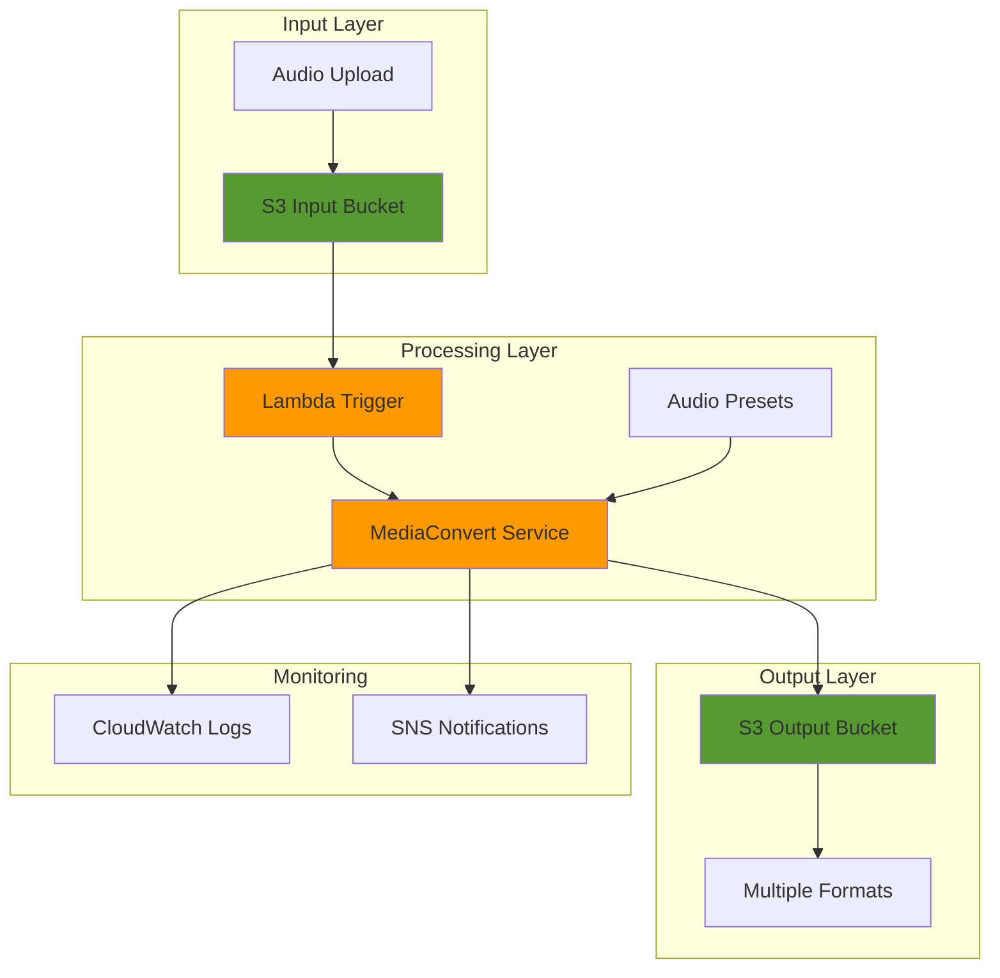

# Audio Processing Pipelines with MediaConvert

## Problem

Media companies and content creators often struggle with manual audio processing workflows that require significant time and resources to convert audio files between different formats, apply enhancements, and prepare content for various distribution channels. Traditional solutions involve expensive hardware or software licenses, lack scalability for batch processing, and don't integrate well with cloud-based workflows, resulting in bottlenecks that delay content delivery and increase operational costs.

## Solution

AWS Elemental MediaConvert provides a serverless, file-based video and audio processing service that automates audio format conversion, enhancement, and distribution preparation. This solution creates an automated audio processing pipeline that triggers when audio files are uploaded to S3, processes them through MediaConvert with customizable audio presets, and outputs multiple formats for different use cases while maintaining high quality and cost efficiency.

## Architecture Diagram



## Prerequisites

1. AWS account with appropriate permissions for MediaConvert, S3, Lambda, and IAM
2. AWS CLI v2 installed and configured (or AWS CloudShell)
3. Basic understanding of audio formats (MP3, AAC, FLAC, WAV)
4. Basic knowledge of AWS Lambda and S3 event notifications
5. Estimated cost: $5-15 for testing (MediaConvert processing + S3 storage)

> **Note**: MediaConvert charges based on the duration of audio processed and output formats generated. Pricing varies by region and audio complexity.

## Preparation

```bash
# Set environment variables
export AWS_REGION=$(aws configure get region)
export AWS_ACCOUNT_ID=$(aws sts get-caller-identity \
    --query Account --output text)

# Generate unique identifiers for resources
RANDOM_SUFFIX=$(aws secretsmanager get-random-password \
    --exclude-punctuation --exclude-uppercase \
    --password-length 6 --require-each-included-type \
    --output text --query RandomPassword)

export BUCKET_INPUT="audio-processing-input-${RANDOM_SUFFIX}"
export BUCKET_OUTPUT="audio-processing-output-${RANDOM_SUFFIX}"
export LAMBDA_FUNCTION="audio-processing-trigger-${RANDOM_SUFFIX}"
export MEDIACONVERT_ROLE="MediaConvertRole-${RANDOM_SUFFIX}"
export SNS_TOPIC="audio-processing-notifications-${RANDOM_SUFFIX}"

# Create S3 buckets for input and output
aws s3 mb s3://${BUCKET_INPUT} --region ${AWS_REGION}
aws s3 mb s3://${BUCKET_OUTPUT} --region ${AWS_REGION}

echo "✅ Created S3 buckets: ${BUCKET_INPUT} and ${BUCKET_OUTPUT}"

# Create SNS topic for notifications
SNS_TOPIC_ARN=$(aws sns create-topic \
    --name ${SNS_TOPIC} \
    --output text --query TopicArn)

export SNS_TOPIC_ARN

echo "✅ Created SNS topic: ${SNS_TOPIC_ARN}"
```

## Steps

1. **Create IAM Role for MediaConvert**:

   MediaConvert requires an IAM service role to securely access your S3 buckets and other AWS resources on your behalf. [IAM roles](https://docs.aws.amazon.com/IAM/latest/UserGuide/id_roles.html) provide temporary, secure credentials without hardcoding secrets in your applications, following the principle of least privilege. This role enables MediaConvert to read source files from your input bucket, write processed files to your output bucket, and send notifications to SNS topics when jobs complete or fail.

   ```bash
   # Create trust policy for MediaConvert
   cat > mediaconvert-trust-policy.json << EOF
   {
       "Version": "2012-10-17",
       "Statement": [
           {
               "Effect": "Allow",
               "Principal": {
                   "Service": "mediaconvert.amazonaws.com"
               },
               "Action": "sts:AssumeRole"
           }
       ]
   }
   EOF
   
   # Create the MediaConvert service role
   aws iam create-role \
       --role-name ${MEDIACONVERT_ROLE} \
       --assume-role-policy-document file://mediaconvert-trust-policy.json
   
   # Create policy for MediaConvert to access S3 and SNS
   cat > mediaconvert-policy.json << EOF
   {
       "Version": "2012-10-17",
       "Statement": [
           {
               "Effect": "Allow",
               "Action": [
                   "s3:GetObject",
                   "s3:PutObject",
                   "s3:DeleteObject",
                   "s3:ListBucket"
               ],
               "Resource": [
                   "arn:aws:s3:::${BUCKET_INPUT}",
                   "arn:aws:s3:::${BUCKET_INPUT}/*",
                   "arn:aws:s3:::${BUCKET_OUTPUT}",
                   "arn:aws:s3:::${BUCKET_OUTPUT}/*"
               ]
           },
           {
               "Effect": "Allow",
               "Action": [
                   "sns:Publish"
               ],
               "Resource": "${SNS_TOPIC_ARN}"
           }
       ]
   }
   EOF
   
   # Attach the policy to the role
   aws iam put-role-policy \
       --role-name ${MEDIACONVERT_ROLE} \
       --policy-name MediaConvertS3SNSPolicy \
       --policy-document file://mediaconvert-policy.json
   
   # Get the role ARN
   MEDIACONVERT_ROLE_ARN=$(aws iam get-role \
       --role-name ${MEDIACONVERT_ROLE} \
       --query Role.Arn --output text)
   
   export MEDIACONVERT_ROLE_ARN
   
   echo "✅ Created MediaConvert role: ${MEDIACONVERT_ROLE_ARN}"
   ```

   The MediaConvert service role is now established with precisely the permissions needed for audio processing workflows. This security foundation ensures that MediaConvert can access only the specific S3 buckets and SNS topics required for your pipeline, maintaining operational security while enabling automated processing capabilities.

2. **Get MediaConvert Endpoint**:

   [AWS Elemental MediaConvert](https://docs.aws.amazon.com/mediaconvert/latest/ug/what-is.html) operates through region-specific endpoints that optimize performance and comply with data locality requirements. Unlike global services, MediaConvert uses dedicated endpoints in each region to ensure low latency and high throughput for media processing workloads. Retrieving the correct endpoint is essential for all subsequent MediaConvert API calls and job submissions.

   ```bash
   # Get the MediaConvert endpoint for your region
   MEDIACONVERT_ENDPOINT=$(aws mediaconvert describe-endpoints \
       --region ${AWS_REGION} \
       --query Endpoints[0].Url --output text)
   
   export MEDIACONVERT_ENDPOINT
   
   echo "✅ MediaConvert endpoint: ${MEDIACONVERT_ENDPOINT}"
   ```

   The MediaConvert endpoint is now configured and ready for job processing. This region-specific endpoint ensures optimal performance for your audio processing workloads and enables all subsequent MediaConvert operations to route to the appropriate infrastructure.

3. **Create Audio Processing Job Template**:

   Job templates in MediaConvert standardize processing workflows and ensure consistent output quality across all audio files. This template defines multiple output groups (MP3, AAC, FLAC) to create different format versions simultaneously, enabling distribution across various platforms and use cases. The template approach promotes operational efficiency by eliminating manual configuration for each job while maintaining precise control over audio quality, bitrates, and codec-specific settings.

   ```bash
   # Create job template for audio processing
   cat > audio-job-template.json << EOF
   {
       "Name": "AudioProcessingTemplate-${RANDOM_SUFFIX}",
       "Description": "Template for processing audio files with multiple output formats",
       "Settings": {
           "OutputGroups": [
               {
                   "Name": "MP3_Output",
                   "OutputGroupSettings": {
                       "Type": "FILE_GROUP_SETTINGS",
                       "FileGroupSettings": {
                           "Destination": "s3://${BUCKET_OUTPUT}/mp3/"
                       }
                   },
                   "Outputs": [
                       {
                           "NameModifier": "_mp3",
                           "ContainerSettings": {
                               "Container": "MP3"
                           },
                           "AudioDescriptions": [
                               {
                                   "AudioTypeControl": "FOLLOW_INPUT",
                                   "CodecSettings": {
                                       "Codec": "MP3",
                                       "Mp3Settings": {
                                           "Bitrate": 128000,
                                           "Channels": 2,
                                           "RateControlMode": "CBR",
                                           "SampleRate": 44100
                                       }
                                   }
                               }
                           ]
                       }
                   ]
               },
               {
                   "Name": "AAC_Output",
                   "OutputGroupSettings": {
                       "Type": "FILE_GROUP_SETTINGS",
                       "FileGroupSettings": {
                           "Destination": "s3://${BUCKET_OUTPUT}/aac/"
                       }
                   },
                   "Outputs": [
                       {
                           "NameModifier": "_aac",
                           "ContainerSettings": {
                               "Container": "MP4"
                           },
                           "AudioDescriptions": [
                               {
                                   "AudioTypeControl": "FOLLOW_INPUT",
                                   "CodecSettings": {
                                       "Codec": "AAC",
                                       "AacSettings": {
                                           "Bitrate": 128000,
                                           "CodingMode": "CODING_MODE_2_0",
                                           "SampleRate": 44100
                                       }
                                   }
                               }
                           ]
                       }
                   ]
               },
               {
                   "Name": "FLAC_Output",
                   "OutputGroupSettings": {
                       "Type": "FILE_GROUP_SETTINGS",
                       "FileGroupSettings": {
                           "Destination": "s3://${BUCKET_OUTPUT}/flac/"
                       }
                   },
                   "Outputs": [
                       {
                           "NameModifier": "_flac",
                           "ContainerSettings": {
                               "Container": "FLAC"
                           },
                           "AudioDescriptions": [
                               {
                                   "AudioTypeControl": "FOLLOW_INPUT",
                                   "CodecSettings": {
                                       "Codec": "FLAC",
                                       "FlacSettings": {
                                           "Channels": 2,
                                           "SampleRate": 44100
                                       }
                                   }
                               }
                           ]
                       }
                   ]
               }
           ],
           "Inputs": [
               {
                   "FileInput": "s3://${BUCKET_INPUT}/",
                   "AudioSelectors": {
                       "Audio Selector 1": {
                           "Tracks": [1],
                           "DefaultSelection": "DEFAULT"
                       }
                   }
               }
           ]
       }
   }
   EOF
   
   # Create the job template
   TEMPLATE_ARN=$(aws mediaconvert create-job-template \
       --endpoint-url ${MEDIACONVERT_ENDPOINT} \
       --cli-input-json file://audio-job-template.json \
       --query JobTemplate.Arn --output text)
   
   export TEMPLATE_ARN
   
   echo "✅ Created job template: ${TEMPLATE_ARN}"
   ```

   The job template is now ready to process audio files with standardized settings that produce professional-quality outputs. This template enables consistent processing across your entire audio library while supporting multiple distribution formats, ensuring your content reaches audiences on web platforms (MP3), mobile applications (AAC), and high-fidelity systems (FLAC).

4. **Create Lambda Function for Processing Trigger**:

   [AWS Lambda](https://docs.aws.amazon.com/lambda/latest/dg/with-s3.html) enables event-driven architecture by automatically triggering MediaConvert jobs when audio files are uploaded to S3. This serverless approach eliminates the need for constantly running infrastructure, scales automatically based on workload, and ensures immediate processing without manual intervention. The Lambda function validates file types, constructs MediaConvert job parameters, and handles error scenarios, providing a robust automation layer for your audio processing pipeline.

   ```bash
   # Create Lambda function code
   cat > lambda_function.py << 'EOF'
   import json
   import boto3
   import os
   from urllib.parse import unquote_plus
   
   def lambda_handler(event, context):
       # Initialize MediaConvert client
       mediaconvert = boto3.client('mediaconvert', 
           endpoint_url=os.environ['MEDIACONVERT_ENDPOINT'])
       
       # Get S3 event information
       for record in event['Records']:
           bucket = record['s3']['bucket']['name']
           key = unquote_plus(record['s3']['object']['key'])
           
           # Only process audio files
           if not key.lower().endswith(('.mp3', '.wav', '.flac', '.m4a', '.aac')):
               print(f"Skipping non-audio file: {key}")
               continue
           
           # Create MediaConvert job
           job_settings = {
               "JobTemplate": os.environ['TEMPLATE_ARN'],
               "Role": os.environ['MEDIACONVERT_ROLE_ARN'],
               "Settings": {
                   "Inputs": [
                       {
                           "FileInput": f"s3://{bucket}/{key}",
                           "AudioSelectors": {
                               "Audio Selector 1": {
                                   "Tracks": [1],
                                   "DefaultSelection": "DEFAULT"
                               }
                           }
                       }
                   ]
               },
               "StatusUpdateInterval": "SECONDS_60"
           }
           
           try:
               response = mediaconvert.create_job(**job_settings)
               job_id = response['Job']['Id']
               
               print(f"Created MediaConvert job {job_id} for {key}")
               
               return {
                   'statusCode': 200,
                   'body': json.dumps({
                       'message': f'Successfully started processing job {job_id}',
                       'jobId': job_id
                   })
               }
           except Exception as e:
               print(f"Error creating MediaConvert job: {str(e)}")
               return {
                   'statusCode': 500,
                   'body': json.dumps({
                       'error': str(e)
                   })
               }
   EOF
   
   # Create deployment package
   zip lambda-function.zip lambda_function.py
   
   # Create Lambda execution role
   cat > lambda-trust-policy.json << EOF
   {
       "Version": "2012-10-17",
       "Statement": [
           {
               "Effect": "Allow",
               "Principal": {
                   "Service": "lambda.amazonaws.com"
               },
               "Action": "sts:AssumeRole"
           }
       ]
   }
   EOF
   
   # Create the Lambda role
   aws iam create-role \
       --role-name ${LAMBDA_FUNCTION}-role \
       --assume-role-policy-document file://lambda-trust-policy.json
   
   # Attach basic Lambda execution policy
   aws iam attach-role-policy \
       --role-name ${LAMBDA_FUNCTION}-role \
       --policy-arn arn:aws:iam::aws:policy/service-role/AWSLambdaBasicExecutionRole
   
   # Create policy for Lambda to access MediaConvert
   cat > lambda-policy.json << EOF
   {
       "Version": "2012-10-17",
       "Statement": [
           {
               "Effect": "Allow",
               "Action": [
                   "mediaconvert:CreateJob",
                   "mediaconvert:GetJob",
                   "mediaconvert:ListJobs"
               ],
               "Resource": "*"
           },
           {
               "Effect": "Allow",
               "Action": [
                   "iam:PassRole"
               ],
               "Resource": "${MEDIACONVERT_ROLE_ARN}"
           }
       ]
   }
   EOF
   
   # Attach MediaConvert policy to Lambda role
   aws iam put-role-policy \
       --role-name ${LAMBDA_FUNCTION}-role \
       --policy-name MediaConvertAccess \
       --policy-document file://lambda-policy.json
   
   # Get Lambda role ARN
   LAMBDA_ROLE_ARN=$(aws iam get-role \
       --role-name ${LAMBDA_FUNCTION}-role \
       --query Role.Arn --output text)
   
   # Wait for role to be available
   sleep 10
   
   # Create Lambda function with latest Python runtime
   aws lambda create-function \
       --function-name ${LAMBDA_FUNCTION} \
       --runtime python3.12 \
       --role ${LAMBDA_ROLE_ARN} \
       --handler lambda_function.lambda_handler \
       --zip-file fileb://lambda-function.zip \
       --timeout 300 \
       --environment Variables="{MEDIACONVERT_ENDPOINT=${MEDIACONVERT_ENDPOINT},TEMPLATE_ARN=${TEMPLATE_ARN},MEDIACONVERT_ROLE_ARN=${MEDIACONVERT_ROLE_ARN}}"
   
   echo "✅ Created Lambda function: ${LAMBDA_FUNCTION}"
   ```

   The Lambda function is now deployed and ready to orchestrate MediaConvert jobs. This serverless trigger ensures that every audio file uploaded to your input bucket automatically initiates processing, creating a seamless workflow that transforms manual operations into automated, scalable processes that handle varying workloads efficiently.

5. **Configure S3 Event Notification**:

   [S3 Event Notifications](https://docs.aws.amazon.com/AmazonS3/latest/userguide/EventNotifications.html) create the critical link between file uploads and processing automation. By configuring notifications for specific file types, you ensure that only audio files trigger processing workflows, preventing unnecessary costs and errors from non-audio uploads. This integration pattern enables real-time processing that scales seamlessly from single files to hundreds of concurrent uploads without requiring infrastructure management.

   ```bash
   # Add Lambda permission for S3 to invoke function
   aws lambda add-permission \
       --function-name ${LAMBDA_FUNCTION} \
       --principal s3.amazonaws.com \
       --statement-id s3-trigger \
       --action lambda:InvokeFunction \
       --source-arn arn:aws:s3:::${BUCKET_INPUT}
   
   # Create S3 notification configuration
   cat > s3-notification.json << EOF
   {
       "LambdaConfigurations": [
           {
               "Id": "AudioProcessingTrigger",
               "LambdaFunctionArn": "arn:aws:lambda:${AWS_REGION}:${AWS_ACCOUNT_ID}:function:${LAMBDA_FUNCTION}",
               "Events": ["s3:ObjectCreated:*"],
               "Filter": {
                   "Key": {
                       "FilterRules": [
                           {
                               "Name": "suffix",
                               "Value": ".mp3"
                           }
                       ]
                   }
               }
           },
           {
               "Id": "AudioProcessingTriggerWAV",
               "LambdaFunctionArn": "arn:aws:lambda:${AWS_REGION}:${AWS_ACCOUNT_ID}:function:${LAMBDA_FUNCTION}",
               "Events": ["s3:ObjectCreated:*"],
               "Filter": {
                   "Key": {
                       "FilterRules": [
                           {
                               "Name": "suffix",
                               "Value": ".wav"
                           }
                       ]
                   }
               }
           },
           {
               "Id": "AudioProcessingTriggerFLAC",
               "LambdaFunctionArn": "arn:aws:lambda:${AWS_REGION}:${AWS_ACCOUNT_ID}:function:${LAMBDA_FUNCTION}",
               "Events": ["s3:ObjectCreated:*"],
               "Filter": {
                   "Key": {
                       "FilterRules": [
                           {
                               "Name": "suffix",
                               "Value": ".flac"
                           }
                       ]
                   }
               }
           }
       ]
   }
   EOF
   
   # Apply notification configuration to S3 bucket
   aws s3api put-bucket-notification-configuration \
       --bucket ${BUCKET_INPUT} \
       --notification-configuration file://s3-notification.json
   
   echo "✅ Configured S3 event notifications for audio processing"
   ```

   S3 event notifications are now configured to automatically trigger Lambda functions for audio file uploads. This event-driven integration creates a responsive processing pipeline that activates only when needed, ensuring cost efficiency while maintaining immediate processing capabilities for time-sensitive content workflows.

6. **Create CloudWatch Dashboard for Monitoring**:

   Operational visibility is essential for maintaining reliable audio processing pipelines at scale. CloudWatch dashboards provide real-time metrics for MediaConvert job success rates, Lambda function performance, and processing throughput, enabling proactive identification of bottlenecks and operational issues. This monitoring foundation supports SLA compliance, cost optimization, and capacity planning for production workloads.

   ```bash
   # Create CloudWatch dashboard for monitoring
   cat > dashboard.json << EOF
   {
       "widgets": [
           {
               "type": "metric",
               "x": 0,
               "y": 0,
               "width": 12,
               "height": 6,
               "properties": {
                   "metrics": [
                       [ "AWS/MediaConvert", "JobsCompleted" ],
                       [ ".", "JobsErrored" ],
                       [ ".", "JobsSubmitted" ]
                   ],
                   "period": 300,
                   "stat": "Sum",
                   "region": "${AWS_REGION}",
                   "title": "MediaConvert Jobs"
               }
           },
           {
               "type": "metric",
               "x": 12,
               "y": 0,
               "width": 12,
               "height": 6,
               "properties": {
                   "metrics": [
                       [ "AWS/Lambda", "Invocations", "FunctionName", "${LAMBDA_FUNCTION}" ],
                       [ ".", "Errors", ".", "." ],
                       [ ".", "Duration", ".", "." ]
                   ],
                   "period": 300,
                   "stat": "Sum",
                   "region": "${AWS_REGION}",
                   "title": "Lambda Function Metrics"
               }
           }
       ]
   }
   EOF
   
   # Create the dashboard
   aws cloudwatch put-dashboard \
       --dashboard-name "AudioProcessingPipeline-${RANDOM_SUFFIX}" \
       --dashboard-body file://dashboard.json
   
   echo "✅ Created CloudWatch dashboard for monitoring"
   ```

   The CloudWatch dashboard is now providing comprehensive visibility into your audio processing pipeline. This centralized monitoring enables rapid identification of performance trends, resource utilization patterns, and potential issues, ensuring your pipeline maintains optimal performance and reliability as processing volumes scale.

7. **Create Audio Enhancement Preset**:

   Audio enhancement presets enable advanced processing capabilities including loudness normalization, dynamic range optimization, and quality improvements that ensure professional broadcast standards. The ITU-R BS.1770-2 loudness standard implemented in this preset maintains consistent audio levels across content, crucial for streaming platforms and broadcast applications where volume consistency directly impacts user experience.

   ```bash
   # Create preset for audio enhancement
   cat > enhanced-audio-preset.json << EOF
   {
       "Name": "EnhancedAudioPreset-${RANDOM_SUFFIX}",
       "Description": "Preset for enhanced audio processing with loudness normalization",
       "Settings": {
           "ContainerSettings": {
               "Container": "MP4"
           },
           "AudioDescriptions": [
               {
                   "AudioTypeControl": "FOLLOW_INPUT",
                   "CodecSettings": {
                       "Codec": "AAC",
                       "AacSettings": {
                           "Bitrate": 192000,
                           "CodingMode": "CODING_MODE_2_0",
                           "SampleRate": 48000,
                           "Specification": "MPEG4"
                       }
                   },
                   "AudioNormalizationSettings": {
                       "Algorithm": "ITU_BS_1770_2",
                       "AlgorithmControl": "CORRECT_AUDIO",
                       "LoudnessLogging": "LOG",
                       "PeakCalculation": "TRUE_PEAK",
                       "TargetLkfs": -23.0
                   }
               }
           ]
       }
   }
   EOF
   
   # Create the preset
   PRESET_ARN=$(aws mediaconvert create-preset \
       --endpoint-url ${MEDIACONVERT_ENDPOINT} \
       --cli-input-json file://enhanced-audio-preset.json \
       --query Preset.Arn --output text)
   
   export PRESET_ARN
   
   echo "✅ Created enhanced audio preset: ${PRESET_ARN}"
   ```

   The enhanced audio preset is now available for professional-grade processing that meets broadcast and streaming platform requirements. This preset ensures your audio content maintains consistent quality and loudness levels, essential for professional distribution across multiple platforms and formats.

8. **Test the Pipeline with Sample Audio**:

   Testing validates the complete pipeline integration and ensures all components work together seamlessly. This verification step confirms that S3 uploads trigger Lambda functions correctly, MediaConvert jobs execute successfully, and output files are delivered to the designated locations with expected quality and format specifications.

   ```bash
   # Create a test audio file placeholder
   echo "Testing audio processing pipeline..."
   
   # Create a simple test marker file for the pipeline
   echo "Audio processing test file" > test-audio.txt
   
   # Rename to audio extension to trigger processing
   mv test-audio.txt test-audio.wav
   
   # Upload test file to trigger processing
   aws s3 cp test-audio.wav s3://${BUCKET_INPUT}/
   
   echo "✅ Uploaded test file to trigger processing"
   echo "Monitor the pipeline through CloudWatch dashboard or AWS Console"
   echo "For real testing, upload an actual audio file:"
   echo "aws s3 cp your-audio-file.mp3 s3://${BUCKET_INPUT}/"
   ```

   The pipeline test demonstrates the complete automation workflow from upload to processing. You can now monitor job progress through the CloudWatch dashboard and verify that processed audio files appear in the output bucket with the expected formats and quality settings, confirming your pipeline is ready for production workloads.

## Validation & Testing

1. **Verify S3 bucket setup and permissions**:

   ```bash
   # Check input bucket
   aws s3 ls s3://${BUCKET_INPUT}
   
   # Check output bucket
   aws s3 ls s3://${BUCKET_OUTPUT}
   
   # Verify bucket notification configuration
   aws s3api get-bucket-notification-configuration \
       --bucket ${BUCKET_INPUT}
   ```

   Expected output: Should show the Lambda notification configurations for audio file types.

2. **Test Lambda function invocation**:

   ```bash
   # Check Lambda function logs
   aws logs describe-log-groups \
       --log-group-name-prefix "/aws/lambda/${LAMBDA_FUNCTION}"
   
   # Get recent log events (if any exist)
   aws logs describe-log-streams \
       --log-group-name "/aws/lambda/${LAMBDA_FUNCTION}" \
       --order-by LastEventTime --descending \
       --max-items 5
   ```

3. **Monitor MediaConvert jobs**:

   ```bash
   # List recent MediaConvert jobs
   aws mediaconvert list-jobs \
       --endpoint-url ${MEDIACONVERT_ENDPOINT} \
       --max-results 10
   
   # Check job template exists
   aws mediaconvert get-job-template \
       --endpoint-url ${MEDIACONVERT_ENDPOINT} \
       --name "AudioProcessingTemplate-${RANDOM_SUFFIX}"
   ```

4. **Test audio processing with real audio file**:

   ```bash
   # Instructions for testing with real audio
   echo "Upload an actual audio file (MP3, WAV, FLAC) to test:"
   echo "aws s3 cp your-audio-file.mp3 s3://${BUCKET_INPUT}/"
   
   # Monitor processing
   echo "Monitor progress with:"
   echo "aws logs tail /aws/lambda/${LAMBDA_FUNCTION} --follow"
   ```

## Cleanup

1. **Remove S3 event notifications**:

   ```bash
   # Remove S3 notification configuration
   aws s3api put-bucket-notification-configuration \
       --bucket ${BUCKET_INPUT} \
       --notification-configuration '{}'
   
   echo "✅ Removed S3 event notifications"
   ```

2. **Delete Lambda function and role**:

   ```bash
   # Delete Lambda function
   aws lambda delete-function \
       --function-name ${LAMBDA_FUNCTION}
   
   # Delete Lambda role policies
   aws iam delete-role-policy \
       --role-name ${LAMBDA_FUNCTION}-role \
       --policy-name MediaConvertAccess
   
   # Detach managed policy
   aws iam detach-role-policy \
       --role-name ${LAMBDA_FUNCTION}-role \
       --policy-arn arn:aws:iam::aws:policy/service-role/AWSLambdaBasicExecutionRole
   
   # Delete Lambda role
   aws iam delete-role \
       --role-name ${LAMBDA_FUNCTION}-role
   
   echo "✅ Deleted Lambda function and role"
   ```

3. **Delete MediaConvert resources**:

   ```bash
   # Delete job template
   aws mediaconvert delete-job-template \
       --endpoint-url ${MEDIACONVERT_ENDPOINT} \
       --name "AudioProcessingTemplate-${RANDOM_SUFFIX}"
   
   # Delete preset
   aws mediaconvert delete-preset \
       --endpoint-url ${MEDIACONVERT_ENDPOINT} \
       --name "EnhancedAudioPreset-${RANDOM_SUFFIX}"
   
   echo "✅ Deleted MediaConvert template and preset"
   ```

4. **Delete IAM role and policies**:

   ```bash
   # Delete MediaConvert role policy
   aws iam delete-role-policy \
       --role-name ${MEDIACONVERT_ROLE} \
       --policy-name MediaConvertS3SNSPolicy
   
   # Delete MediaConvert role
   aws iam delete-role \
       --role-name ${MEDIACONVERT_ROLE}
   
   echo "✅ Deleted MediaConvert IAM role"
   ```

5. **Delete S3 buckets and contents**:

   ```bash
   # Delete all objects in buckets
   aws s3 rm s3://${BUCKET_INPUT} --recursive
   aws s3 rm s3://${BUCKET_OUTPUT} --recursive
   
   # Delete buckets
   aws s3 rb s3://${BUCKET_INPUT}
   aws s3 rb s3://${BUCKET_OUTPUT}
   
   echo "✅ Deleted S3 buckets and contents"
   ```

6. **Delete CloudWatch dashboard and SNS topic**:

   ```bash
   # Delete CloudWatch dashboard
   aws cloudwatch delete-dashboards \
       --dashboard-names "AudioProcessingPipeline-${RANDOM_SUFFIX}"
   
   # Delete SNS topic
   aws sns delete-topic \
       --topic-arn ${SNS_TOPIC_ARN}
   
   # Clean up local files
   rm -f *.json *.py *.zip *.txt *.wav
   
   echo "✅ Deleted monitoring resources and cleaned up local files"
   ```

## Discussion

AWS Elemental MediaConvert provides a robust, serverless solution for audio processing that eliminates the need for managing infrastructure while offering professional-grade audio processing capabilities. The service supports over 20 audio formats and codecs, making it ideal for media companies that need to deliver content across multiple platforms and devices. The pay-per-use pricing model ensures cost efficiency, especially for variable workloads following the [AWS Well-Architected Framework](https://docs.aws.amazon.com/wellarchitected/latest/framework/welcome.html) principles of cost optimization.

The architecture implemented in this recipe leverages event-driven processing, where S3 object creation events automatically trigger Lambda functions that initiate MediaConvert jobs. This approach ensures immediate processing of uploaded audio files without manual intervention. The multiple output formats (MP3, AAC, FLAC) provide flexibility for different use cases: MP3 for web streaming, AAC for mobile applications, and FLAC for high-quality archival storage. This follows AWS best practices for [serverless application architecture](https://docs.aws.amazon.com/lambda/latest/dg/best-practices.html).

Audio normalization is a critical feature implemented through the ITU-R BS.1770-2 standard, which ensures consistent loudness across different audio content. This is particularly important for streaming platforms and broadcast applications where audio level consistency enhances user experience. The preset system allows for standardized processing while maintaining the flexibility to customize parameters for specific content requirements, supporting the reliability pillar of the Well-Architected Framework.

The integration with CloudWatch provides comprehensive monitoring and logging capabilities, enabling teams to track processing metrics, identify bottlenecks, and optimize costs. The dashboard visualization helps operations teams maintain visibility into the pipeline's performance and troubleshoot issues quickly, supporting operational excellence through automated monitoring and alerting as described in the [MediaConvert monitoring documentation](https://docs.aws.amazon.com/mediaconvert/latest/ug/monitoring-mediaconvert.html).

> **Tip**: Use MediaConvert's audio analysis features to automatically detect and correct audio issues like silence, loudness inconsistencies, and format incompatibilities before processing.

## Challenge

Extend this solution by implementing these enhancements:

1. **Advanced Audio Enhancement**: Implement noise reduction, dynamic range compression, and EQ adjustments using MediaConvert's advanced audio processing features with custom presets for different content types (speech, music, podcasts).

2. **Multi-Language Audio Processing**: Add support for audio track separation and processing of multi-language content, including subtitle synchronization and audio description tracks for accessibility compliance.

3. **Real-time Audio Quality Analysis**: Integrate Amazon Transcribe to analyze audio content and automatically select optimal processing parameters based on content type, speaker count, and background noise levels.

4. **Cost Optimization Engine**: Implement intelligent job scheduling that analyzes audio characteristics and automatically selects the most cost-effective processing options, including reserved capacity management for high-volume workflows.

5. **Advanced Workflow Orchestration**: Use AWS Step Functions to create complex audio processing workflows that include quality validation, metadata extraction, content delivery network distribution, and integration with digital asset management systems.

## Infrastructure Code

### Available Infrastructure as Code:

- [Infrastructure Code Overview](code/README.md) - Detailed description of all infrastructure components
- [AWS CDK (Python)](code/cdk-python/) - AWS CDK Python implementation
- [AWS CDK (TypeScript)](code/cdk-typescript/) - AWS CDK TypeScript implementation
- [CloudFormation](code/cloudformation.yaml) - AWS CloudFormation template
- [Bash CLI Scripts](code/scripts/) - Example bash scripts using AWS CLI commands to deploy infrastructure
- [Terraform](code/terraform/) - Terraform configuration files