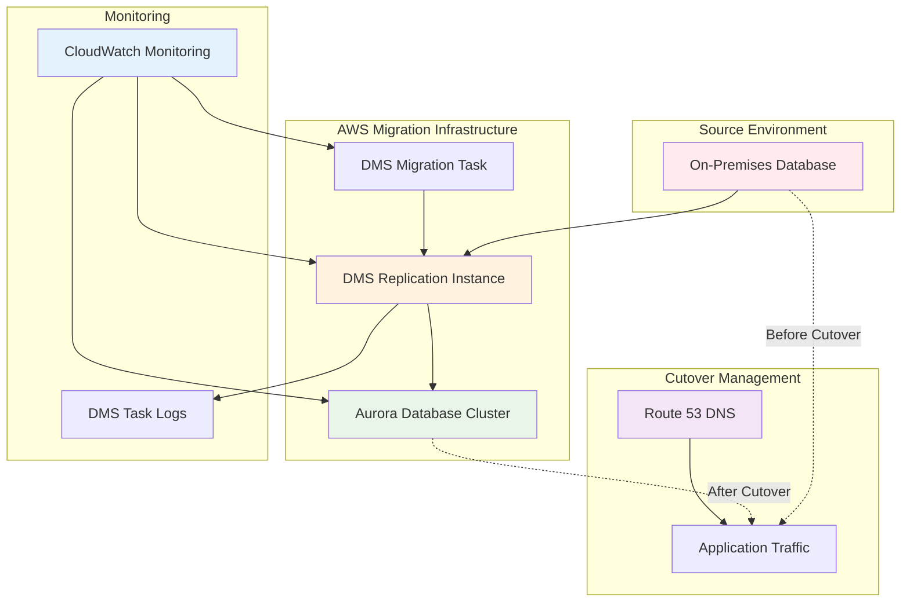

# Aurora Migration with Minimal Downtime using DMS and Route 53

## Problem

Your organization runs critical business applications with on-premises databases that experience increasing load and maintenance overhead. You need to migrate these databases to Amazon Aurora for better performance, availability, and reduced operational burden, but you cannot afford application downtime or data loss during the migration process. Traditional migration approaches involving database dumps and restores can result in hours of downtime, which is unacceptable for business-critical systems that require 24/7 availability.

## Solution

Implement a near-zero downtime database migration using AWS Database Migration Service (DMS) for continuous data replication and Amazon Aurora as the target database. This solution uses DMS to perform an initial full data load followed by ongoing change data capture (CDC) to keep the target database synchronized with the source. The migration process includes data validation, performance optimization, and a controlled DNS-based cutover process using Route 53 to minimize business impact to under 5 minutes.

## Architecture Diagram



## Prerequisites

1. On-premises database (MySQL, PostgreSQL, Oracle, or SQL Server) with network connectivity to AWS
2. AWS account with VPC configured for database access and administrative permissions
3. Source database configured for CDC (binary logging enabled for MySQL, supplemental logging for Oracle)
4. Network connectivity between source database and AWS (VPN, Direct Connect, or secure Internet gateway)
5. Database administrator access to both source and target systems with appropriate privileges
6. Estimated cost: $75-300 depending on replication instance size, Aurora instance class, and migration duration

> **Note**: For production migrations, ensure you have tested this process in a development environment first. Review [AWS DMS Best Practices](https://docs.aws.amazon.com/dms/latest/userguide/CHAP_BestPractices.html) for additional guidance on optimizing migration performance.

## Preparation

```bash
# Set AWS environment variables
export AWS_REGION=$(aws configure get region)
export AWS_ACCOUNT_ID=$(aws sts get-caller-identity \
    --query Account --output text)

# Generate unique identifiers for resources
RANDOM_SUFFIX=$(aws secretsmanager get-random-password \
    --exclude-punctuation --exclude-uppercase \
    --password-length 6 --require-each-included-type \
    --output text --query RandomPassword)
export RANDOM_SUFFIX

# Set resource configurations
export DB_INSTANCE_CLASS="db.r6g.large"
export REPLICATION_INSTANCE_CLASS="dms.t3.medium"

echo "✅ AWS environment configured with region: $AWS_REGION"
```

## Steps

### 1. Create VPC Infrastructure for Migration

Aurora requires a secure, isolated network environment with subnets spanning multiple Availability Zones for high availability. This VPC will provide the foundation for both Aurora and DMS resources while maintaining security through controlled access.

```bash
# Create VPC for database resources
VPC_ID=$(aws ec2 create-vpc --cidr-block 10.0.0.0/16 \
    --tag-specifications \
    'ResourceType=vpc,Tags=[{Key=Name,Value=aurora-migration-vpc}]' \
    --query Vpc.VpcId --output text)
export VPC_ID

# Enable DNS hostnames for proper name resolution
aws ec2 modify-vpc-attribute --vpc-id $VPC_ID --enable-dns-hostnames

# Create subnets in different AZs for high availability
SUBNET_1_ID=$(aws ec2 create-subnet --vpc-id $VPC_ID \
    --cidr-block 10.0.1.0/24 --availability-zone ${AWS_REGION}a \
    --tag-specifications \
    'ResourceType=subnet,Tags=[{Key=Name,Value=aurora-subnet-1}]' \
    --query Subnet.SubnetId --output text)
export SUBNET_1_ID

SUBNET_2_ID=$(aws ec2 create-subnet --vpc-id $VPC_ID \
    --cidr-block 10.0.2.0/24 --availability-zone ${AWS_REGION}b \
    --tag-specifications \
    'ResourceType=subnet,Tags=[{Key=Name,Value=aurora-subnet-2}]' \
    --query Subnet.SubnetId --output text)
export SUBNET_2_ID

echo "✅ VPC infrastructure created"
```

### 2. Configure Security Groups and Network Access

Security groups act as virtual firewalls controlling network access to Aurora and DMS resources. These configurations follow AWS security best practices by applying the principle of least privilege and enabling only necessary database ports between components.

```bash
# Create security group for Aurora cluster
AURORA_SG_ID=$(aws ec2 create-security-group \
    --group-name aurora-migration-sg \
    --description "Security group for Aurora cluster" \
    --vpc-id $VPC_ID \
    --tag-specifications \
    'ResourceType=security-group,Tags=[{Key=Name,Value=aurora-migration-sg}]' \
    --query GroupId --output text)
export AURORA_SG_ID

# Create security group for DMS replication instance
DMS_SG_ID=$(aws ec2 create-security-group \
    --group-name dms-replication-sg \
    --description "Security group for DMS replication instance" \
    --vpc-id $VPC_ID \
    --tag-specifications \
    'ResourceType=security-group,Tags=[{Key=Name,Value=dms-replication-sg}]' \
    --query GroupId --output text)
export DMS_SG_ID

# Configure security group rules for database access
aws ec2 authorize-security-group-ingress \
    --group-id $AURORA_SG_ID \
    --protocol tcp --port 3306 \
    --source-group $DMS_SG_ID

# Allow DMS outbound access to source database
aws ec2 authorize-security-group-egress \
    --group-id $DMS_SG_ID \
    --protocol tcp --port 3306 \
    --cidr 0.0.0.0/0

echo "✅ Security groups configured"
```

### 3. Create Database Subnet Groups and Parameter Groups

Database subnet groups define which subnets Aurora can use across multiple Availability Zones. Parameter groups allow customization of database engine settings to optimize performance for migration workloads.

```bash
# Create database subnet group for Aurora
aws rds create-db-subnet-group \
    --db-subnet-group-name aurora-migration-subnet-group \
    --db-subnet-group-description "Subnet group for Aurora migration" \
    --subnet-ids $SUBNET_1_ID $SUBNET_2_ID \
    --tags Key=Name,Value=aurora-migration-subnet-group

# Create Aurora cluster parameter group with optimized settings
aws rds create-db-cluster-parameter-group \
    --db-cluster-parameter-group-name aurora-migration-cluster-pg \
    --db-parameter-group-family aurora-mysql8.0 \
    --description "Parameter group for Aurora migration cluster"

# Optimize parameter group for migration performance
aws rds modify-db-cluster-parameter-group \
    --db-cluster-parameter-group-name aurora-migration-cluster-pg \
    --parameters \
    ParameterName=innodb_buffer_pool_size,ParameterValue="{DBInstanceClassMemory*3/4}",ApplyMethod=pending-reboot \
    ParameterName=max_connections,ParameterValue=1000,ApplyMethod=pending-reboot

echo "✅ Database subnet group and parameter group created"
```

### 4. Generate Secure Credentials and Create Aurora Cluster

AWS Secrets Manager generates cryptographically secure passwords, eliminating the risk of weak passwords during migration. Aurora provides automatic backups, encryption, and high availability features essential for production databases.

```bash
# Generate secure password for Aurora master user
AURORA_MASTER_PASSWORD=$(aws secretsmanager get-random-password \
    --exclude-punctuation --password-length 16 \
    --require-each-included-type --output text \
    --query RandomPassword)
export AURORA_MASTER_PASSWORD

# Create Aurora database cluster
AURORA_CLUSTER_ID="aurora-migration-$RANDOM_SUFFIX"

aws rds create-db-cluster \
    --db-cluster-identifier $AURORA_CLUSTER_ID \
    --engine aurora-mysql \
    --engine-version 8.0.mysql_aurora.3.07.1 \
    --master-username admin \
    --master-user-password $AURORA_MASTER_PASSWORD \
    --database-name migrationdb \
    --vpc-security-group-ids $AURORA_SG_ID \
    --db-subnet-group-name aurora-migration-subnet-group \
    --db-cluster-parameter-group-name aurora-migration-cluster-pg \
    --backup-retention-period 7 \
    --preferred-backup-window "03:00-04:00" \
    --preferred-maintenance-window "sun:04:00-sun:05:00" \
    --enable-cloudwatch-logs-exports error general slowquery \
    --storage-encrypted \
    --tags Key=Name,Value=$AURORA_CLUSTER_ID \
        Key=Purpose,Value=migration-target

export AURORA_CLUSTER_ID

echo "✅ Aurora cluster creation initiated"
```

### 5. Create Aurora Database Instances

Aurora clusters require database instances to handle read and write operations. Creating both a primary (writer) and reader instance provides load distribution capabilities and prepares the cluster for production workloads.

```bash
# Create primary Aurora instance for write operations
aws rds create-db-instance \
    --db-instance-identifier ${AURORA_CLUSTER_ID}-primary \
    --db-instance-class $DB_INSTANCE_CLASS \
    --engine aurora-mysql \
    --db-cluster-identifier $AURORA_CLUSTER_ID \
    --publicly-accessible \
    --tags Key=Name,Value=${AURORA_CLUSTER_ID}-primary

# Create read replica for load distribution
aws rds create-db-instance \
    --db-instance-identifier ${AURORA_CLUSTER_ID}-reader \
    --db-instance-class $DB_INSTANCE_CLASS \
    --engine aurora-mysql \
    --db-cluster-identifier $AURORA_CLUSTER_ID \
    --publicly-accessible \
    --tags Key=Name,Value=${AURORA_CLUSTER_ID}-reader

# Wait for Aurora cluster to become available
echo "Waiting for Aurora cluster to become available..."
aws rds wait db-cluster-available --db-cluster-identifier $AURORA_CLUSTER_ID

echo "✅ Aurora instances created and cluster is available"
```

### 6. Set Up DMS IAM Roles and Replication Infrastructure

DMS requires specific IAM roles to manage VPC resources and perform replication tasks. The replication instance serves as the compute resource that performs the actual data migration between source and target databases.

```bash
# Create IAM trust policy for DMS VPC role
cat > dms-vpc-trust-policy.json << 'EOF'
{
  "Version": "2012-10-17",
  "Statement": [
    {
      "Effect": "Allow",
      "Principal": {
        "Service": "dms.amazonaws.com"
      },
      "Action": "sts:AssumeRole"
    }
  ]
}
EOF

# Create DMS VPC role for network resource management
aws iam create-role \
    --role-name dms-vpc-role \
    --assume-role-policy-document file://dms-vpc-trust-policy.json

aws iam attach-role-policy \
    --role-name dms-vpc-role \
    --policy-arn arn:aws:iam::aws:policy/service-role/AmazonDMSVPCManagementRole

# Create DMS replication subnet group
aws dms create-replication-subnet-group \
    --replication-subnet-group-identifier dms-migration-subnet-group \
    --replication-subnet-group-description "DMS subnet group for migration" \
    --subnet-ids $SUBNET_1_ID $SUBNET_2_ID \
    --tags Key=Name,Value=dms-migration-subnet-group

echo "✅ DMS IAM roles and subnet group created"
```

### 7. Create and Configure DMS Replication Instance

The DMS replication instance performs the heavy lifting of data migration. Multi-AZ deployment provides high availability during the migration process, ensuring the migration can continue even if one Availability Zone experiences issues.

```bash
# Create DMS replication instance
DMS_REPLICATION_INSTANCE_ID="dms-migration-$RANDOM_SUFFIX"

aws dms create-replication-instance \
    --replication-instance-identifier $DMS_REPLICATION_INSTANCE_ID \
    --replication-instance-class $REPLICATION_INSTANCE_CLASS \
    --allocated-storage 100 \
    --vpc-security-group-ids $DMS_SG_ID \
    --replication-subnet-group-identifier dms-migration-subnet-group \
    --multi-az \
    --publicly-accessible \
    --tags Key=Name,Value=$DMS_REPLICATION_INSTANCE_ID \
        Key=Purpose,Value=database-migration

export DMS_REPLICATION_INSTANCE_ID

# Wait for replication instance to become available
echo "Waiting for DMS replication instance to become available..."
aws dms wait replication-instance-available \
    --replication-instance-identifier $DMS_REPLICATION_INSTANCE_ID

echo "✅ DMS replication instance is ready"
```

### 8. Configure Source and Target Database Endpoints

DMS endpoints define the connection parameters for source and target databases. The Aurora target endpoint uses optimized connection attributes to maximize data loading performance during migration.

```bash
# Get Aurora cluster endpoint information
AURORA_ENDPOINT=$(aws rds describe-db-clusters \
    --db-cluster-identifier $AURORA_CLUSTER_ID \
    --query 'DBClusters[0].Endpoint' --output text)
export AURORA_ENDPOINT

AURORA_PORT=$(aws rds describe-db-clusters \
    --db-cluster-identifier $AURORA_CLUSTER_ID \
    --query 'DBClusters[0].Port' --output text)
export AURORA_PORT

# Create source database endpoint (customize for your source database)
SOURCE_ENDPOINT_ID="source-mysql-$RANDOM_SUFFIX"

aws dms create-endpoint \
    --endpoint-identifier $SOURCE_ENDPOINT_ID \
    --endpoint-type source \
    --engine-name mysql \
    --server-name "your-source-server.example.com" \
    --port 3306 \
    --username "your-source-username" \
    --password "your-source-password" \
    --database-name "your-source-database" \
    --extra-connection-attributes "heartbeatEnable=true;heartbeatFrequency=1" \
    --tags Key=Name,Value=$SOURCE_ENDPOINT_ID

export SOURCE_ENDPOINT_ID

# Create Aurora target endpoint with performance optimizations
TARGET_ENDPOINT_ID="target-aurora-$RANDOM_SUFFIX"

aws dms create-endpoint \
    --endpoint-identifier $TARGET_ENDPOINT_ID \
    --endpoint-type target \
    --engine-name aurora-mysql \
    --server-name $AURORA_ENDPOINT \
    --port $AURORA_PORT \
    --username admin \
    --password $AURORA_MASTER_PASSWORD \
    --database-name migrationdb \
    --extra-connection-attributes "parallelLoadThreads=8;maxFileSize=512000" \
    --tags Key=Name,Value=$TARGET_ENDPOINT_ID

export TARGET_ENDPOINT_ID

echo "✅ DMS endpoints created"
```

### 9. Test Database Connectivity

Testing endpoint connectivity before starting migration ensures that network configuration and credentials are correct. This prevents migration failures due to connectivity issues.

```bash
# Get replication instance ARN for connection testing
REPLICATION_INSTANCE_ARN=$(aws dms describe-replication-instances \
    --query "ReplicationInstances[?ReplicationInstanceIdentifier=='$DMS_REPLICATION_INSTANCE_ID'].ReplicationInstanceArn" \
    --output text)

# Test source endpoint connectivity
SOURCE_ENDPOINT_ARN=$(aws dms describe-endpoints \
    --query "Endpoints[?EndpointIdentifier=='$SOURCE_ENDPOINT_ID'].EndpointArn" \
    --output text)

aws dms test-connection \
    --replication-instance-arn $REPLICATION_INSTANCE_ARN \
    --endpoint-arn $SOURCE_ENDPOINT_ARN

# Test target endpoint connectivity
TARGET_ENDPOINT_ARN=$(aws dms describe-endpoints \
    --query "Endpoints[?EndpointIdentifier=='$TARGET_ENDPOINT_ID'].EndpointArn" \
    --output text)

aws dms test-connection \
    --replication-instance-arn $REPLICATION_INSTANCE_ARN \
    --endpoint-arn $TARGET_ENDPOINT_ARN

echo "✅ Endpoint connectivity tests initiated"
```

### 10. Create Migration Task Configuration

Table mappings and task settings control which data gets migrated and how the migration performs. These optimized settings are specifically tuned for Aurora targets to maximize throughput and ensure data integrity.

```bash
# Create table mapping configuration for selective migration
cat > table-mappings.json << 'EOF'
{
  "rules": [
    {
      "rule-type": "selection",
      "rule-id": "1",
      "rule-name": "1",
      "object-locator": {
        "schema-name": "%",
        "table-name": "%"
      },
      "rule-action": "include"
    },
    {
      "rule-type": "transformation",
      "rule-id": "2",
      "rule-name": "2",
      "rule-target": "schema",
      "object-locator": {
        "schema-name": "%"
      },
      "rule-action": "rename",
      "value": "migrationdb"
    }
  ]
}
EOF

# Create optimized task settings for Aurora migration
cat > task-settings.json << 'EOF'
{
  "TargetMetadata": {
    "TargetSchema": "",
    "SupportLobs": true,
    "FullLobMode": false,
    "LobChunkSize": 0,
    "LimitedSizeLobMode": true,
    "LobMaxSize": 32,
    "InlineLobMaxSize": 0,
    "LoadMaxFileSize": 0,
    "ParallelLoadThreads": 0,
    "ParallelLoadBufferSize": 0,
    "BatchApplyEnabled": true,
    "TaskRecoveryTableEnabled": false,
    "ParallelApplyThreads": 8,
    "ParallelApplyBufferSize": 1000,
    "ParallelApplyQueuesPerThread": 4
  },
  "FullLoadSettings": {
    "TargetTablePrepMode": "DROP_AND_CREATE",
    "CreatePkAfterFullLoad": false,
    "StopTaskCachedChangesApplied": false,
    "StopTaskCachedChangesNotApplied": false,
    "MaxFullLoadSubTasks": 8,
    "TransactionConsistencyTimeout": 600,
    "CommitRate": 10000
  },
  "Logging": {
    "EnableLogging": true,
    "LogComponents": [
      {
        "Id": "SOURCE_UNLOAD",
        "Severity": "LOGGER_SEVERITY_DEFAULT"
      },
      {
        "Id": "TARGET_LOAD",
        "Severity": "LOGGER_SEVERITY_DEFAULT"
      },
      {
        "Id": "SOURCE_CAPTURE",
        "Severity": "LOGGER_SEVERITY_DEFAULT"
      },
      {
        "Id": "TARGET_APPLY",
        "Severity": "LOGGER_SEVERITY_DEFAULT"
      }
    ]
  },
  "ValidationSettings": {
    "EnableValidation": true,
    "ValidationMode": "ROW_LEVEL",
    "ThreadCount": 5,
    "PartitionSize": 10000,
    "FailureMaxCount": 10000,
    "TableFailureMaxCount": 1000,
    "ValidationOnly": false
  },
  "ErrorBehavior": {
    "DataErrorPolicy": "LOG_ERROR",
    "DataTruncationErrorPolicy": "LOG_ERROR",
    "DataErrorEscalationPolicy": "SUSPEND_TABLE",
    "TableErrorPolicy": "SUSPEND_TABLE",
    "RecoverableErrorCount": -1,
    "RecoverableErrorInterval": 5,
    "ApplyErrorDeletePolicy": "IGNORE_RECORD",
    "ApplyErrorInsertPolicy": "LOG_ERROR",
    "ApplyErrorUpdatePolicy": "LOG_ERROR",
    "FullLoadIgnoreConflicts": true
  }
}
EOF

echo "✅ Migration task configuration files created"
```

> **Warning**: Ensure your source database has binary logging enabled (for MySQL) or appropriate CDC configuration for other database engines before starting the migration task. Verify CDC is properly configured by checking your database logs.

### 11. Create and Start Migration Task

The migration task orchestrates the entire data migration process, performing both full load and CDC operations. Full-load-and-cdc migration type ensures minimal downtime by continuously replicating changes during the initial data load.

```bash
# Create the DMS migration task
MIGRATION_TASK_ID="migration-task-$RANDOM_SUFFIX"

aws dms create-replication-task \
    --replication-task-identifier $MIGRATION_TASK_ID \
    --source-endpoint-arn $SOURCE_ENDPOINT_ARN \
    --target-endpoint-arn $TARGET_ENDPOINT_ARN \
    --replication-instance-arn $REPLICATION_INSTANCE_ARN \
    --migration-type full-load-and-cdc \
    --table-mappings file://table-mappings.json \
    --replication-task-settings file://task-settings.json \
    --tags Key=Name,Value=$MIGRATION_TASK_ID

export MIGRATION_TASK_ID

# Start the replication task
MIGRATION_TASK_ARN=$(aws dms describe-replication-tasks \
    --query "ReplicationTasks[?ReplicationTaskIdentifier=='$MIGRATION_TASK_ID'].ReplicationTaskArn" \
    --output text)

aws dms start-replication-task \
    --replication-task-arn $MIGRATION_TASK_ARN \
    --start-replication-task-type start-replication

echo "✅ Migration task created and started"
```

### 12. Monitor Migration Progress

Continuous monitoring ensures migration proceeds successfully and identifies any issues before cutover. Table statistics provide detailed insight into migration progress per table, while task status shows overall migration health.

```bash
# Monitor overall task status
aws dms describe-replication-tasks \
    --filters Name=replication-task-id,Values=$MIGRATION_TASK_ID \
    --query 'ReplicationTasks[0].[ReplicationTaskIdentifier,Status,ReplicationTaskStats]'

# Monitor detailed table statistics
aws dms describe-table-statistics \
    --replication-task-arn $MIGRATION_TASK_ARN \
    --query 'TableStatistics[*].[SchemaName,TableName,TableState,FullLoadRows,Inserts,Updates,Deletes,ValidationState]'

echo "Migration in progress. Monitor status regularly before proceeding to cutover."
```

### 13. Prepare DNS-Based Cutover Infrastructure

Route 53 DNS management enables rapid cutover with minimal application changes. Creating a private hosted zone allows controlled redirection of database traffic from the source to Aurora using DNS CNAMEs.

```bash
# Create Route 53 private hosted zone for DNS cutover
HOSTED_ZONE_ID=$(aws route53 create-hosted-zone \
    --name internal.migration.local \
    --vpc VPCRegion=$AWS_REGION,VPCId=$VPC_ID \
    --caller-reference migration-$(date +%s) \
    --hosted-zone-config \
    Comment="Private DNS zone for database migration cutover",PrivateZone=true \
    --query 'HostedZone.Id' --output text | sed 's|/hostedzone/||')
export HOSTED_ZONE_ID

# Prepare DNS record for cutover to Aurora
cat > dns-record-aurora.json << EOF
{
  "Changes": [
    {
      "Action": "UPSERT",
      "ResourceRecordSet": {
        "Name": "app-db.internal.migration.local",
        "Type": "CNAME",
        "TTL": 60,
        "ResourceRecords": [
          {
            "Value": "$AURORA_ENDPOINT"
          }
        ]
      }
    }
  ]
}
EOF

echo "✅ DNS cutover infrastructure prepared"
```

## Validation & Testing

### Pre-Cutover Validation

```bash
# Verify Aurora cluster is accessible
mysql -h $AURORA_ENDPOINT -u admin -p$AURORA_MASTER_PASSWORD \
    -e "SELECT VERSION(), @@hostname;" 2>/dev/null

echo "Aurora endpoint: $AURORA_ENDPOINT:$AURORA_PORT"

# Check CDC replication lag
aws dms describe-replication-tasks \
    --filters Name=replication-task-id,Values=$MIGRATION_TASK_ID \
    --query 'ReplicationTasks[0].ReplicationTaskStats'

# Verify data validation status
aws dms describe-table-statistics \
    --replication-task-arn $MIGRATION_TASK_ARN \
    --query 'TableStatistics[?ValidationState!=`ValidationPassed`]'

echo "Review validation results before proceeding with cutover"
```

### Cutover Process

```bash
# Wait for CDC synchronization (monitor until lag is minimal)
echo "Monitoring CDC lag before cutover..."
while true; do
  LAG=$(aws dms describe-table-statistics \
      --replication-task-arn $MIGRATION_TASK_ARN \
      --query 'length(TableStatistics[?ValidationState!=`ValidationPassed`])' \
      --output text)
  echo "Tables with validation issues: $LAG"
  if [ "$LAG" -eq "0" ]; then
    echo "✅ All tables validated - ready for cutover"
    break
  fi
  sleep 30
done

# Perform DNS cutover (the actual cutover moment)
aws route53 change-resource-record-sets \
    --hosted-zone-id $HOSTED_ZONE_ID \
    --change-batch file://dns-record-aurora.json

echo "✅ DNS cutover completed - applications now use Aurora"
```

**Expected Results:**
- Full load phase completes successfully with all tables migrated
- CDC phase shows minimal lag (< 5 seconds) before cutover  
- Data validation passes for all tables with zero discrepancies
- Application cutover completed in under 5 minutes total downtime
- DNS propagation enables automatic application failover to Aurora

> **Note**: Actual cutover downtime depends on DNS TTL settings and application connection pooling behavior. Using shorter TTL values (60 seconds) minimizes switchover time.

## Cleanup

```bash
# Stop and delete DMS replication task
aws dms stop-replication-task --replication-task-arn $MIGRATION_TASK_ARN

aws dms wait replication-task-stopped --replication-task-arn $MIGRATION_TASK_ARN

aws dms delete-replication-task --replication-task-arn $MIGRATION_TASK_ARN

# Delete DMS endpoints and replication instance
aws dms delete-endpoint --endpoint-arn $SOURCE_ENDPOINT_ARN
aws dms delete-endpoint --endpoint-arn $TARGET_ENDPOINT_ARN

aws dms delete-replication-instance \
    --replication-instance-identifier $DMS_REPLICATION_INSTANCE_ID

aws dms delete-replication-subnet-group \
    --replication-subnet-group-identifier dms-migration-subnet-group

# Delete Aurora cluster and instances
aws rds delete-db-instance \
    --db-instance-identifier ${AURORA_CLUSTER_ID}-primary \
    --skip-final-snapshot

aws rds delete-db-instance \
    --db-instance-identifier ${AURORA_CLUSTER_ID}-reader \
    --skip-final-snapshot

aws rds wait db-instance-deleted \
    --db-instance-identifier ${AURORA_CLUSTER_ID}-primary

aws rds wait db-instance-deleted \
    --db-instance-identifier ${AURORA_CLUSTER_ID}-reader

aws rds delete-db-cluster \
    --db-cluster-identifier $AURORA_CLUSTER_ID \
    --skip-final-snapshot

# Delete database infrastructure
aws rds delete-db-subnet-group \
    --db-subnet-group-name aurora-migration-subnet-group

aws rds delete-db-cluster-parameter-group \
    --db-cluster-parameter-group-name aurora-migration-cluster-pg

# Delete Route 53 hosted zone
aws route53 delete-hosted-zone --id /hostedzone/$HOSTED_ZONE_ID

# Delete VPC infrastructure
aws ec2 delete-security-group --group-id $AURORA_SG_ID
aws ec2 delete-security-group --group-id $DMS_SG_ID
aws ec2 delete-subnet --subnet-id $SUBNET_1_ID
aws ec2 delete-subnet --subnet-id $SUBNET_2_ID
aws ec2 delete-vpc --vpc-id $VPC_ID

# Delete IAM roles
aws iam detach-role-policy \
    --role-name dms-vpc-role \
    --policy-arn arn:aws:iam::aws:policy/service-role/AmazonDMSVPCManagementRole

aws iam delete-role --role-name dms-vpc-role

# Clean up local files
rm -f *.json

echo "✅ All resources cleaned up"
```

## Discussion

This migration approach demonstrates the power of AWS Database Migration Service for achieving near-zero downtime database migrations to Amazon Aurora. The key to minimal downtime lies in the combination of DMS's continuous data capture (CDC) capabilities and DNS-based cutover strategies. DMS performs an initial full load of your database while simultaneously capturing ongoing changes, ensuring no data loss during the migration process.

Amazon Aurora provides significant advantages over traditional database deployments including automated backups, point-in-time recovery, automatic storage scaling up to 128 TB, and built-in high availability across multiple Availability Zones. Aurora MySQL version 3 offers up to 5x better performance than traditional MySQL deployments, especially for read-heavy workloads when combined with read replicas and parallel query capabilities.

The DNS cutover strategy using Route 53 private hosted zones enables minimal application changes during migration. By using short TTL values (60 seconds), you can achieve sub-minute cutover times, reducing business impact to mere seconds of connectivity disruption rather than hours of maintenance windows. This approach works especially well with connection pooling in applications, as new connections automatically route to the new database endpoint.

For production migrations, implement additional monitoring using CloudWatch alarms to track DMS task progress and Aurora performance metrics. Consider maintaining your source database in read-only mode for a period after cutover to enable quick rollback if issues arise. The validation features in DMS provide confidence in data integrity throughout the migration process through row-level validation and ongoing CDC monitoring.

> **Tip**: For large databases (>1TB), consider using AWS Snowball Edge for the initial data transfer to reduce network transfer time, then use DMS for ongoing CDC replication to achieve cutover.

**Sources:**
- [AWS Database Migration Service User Guide](https://docs.aws.amazon.com/dms/latest/userguide/Welcome.html)
- [Amazon Aurora User Guide](https://docs.aws.amazon.com/AmazonRDS/latest/AuroraUserGuide/CHAP_AuroraOverview.html)
- [DMS Best Practices](https://docs.aws.amazon.com/dms/latest/userguide/CHAP_BestPractices.html)
- [Aurora MySQL Version 3 Features](https://docs.aws.amazon.com/AmazonRDS/latest/AuroraUserGuide/AuroraMySQL.MySQL80.html)

## Challenge

Extend this migration solution with these advanced capabilities:

1. **Multi-Region Aurora Global Database**: Implement Aurora Global Database for disaster recovery across AWS regions with automated failover using Route 53 health checks
2. **AWS Secrets Manager Integration**: Replace hardcoded passwords with Secrets Manager for automatic password rotation and enhanced security during migration
3. **Aurora Serverless v2**: Configure Aurora Serverless v2 for automatic scaling based on workload demands, reducing costs during low-activity periods
4. **Advanced Monitoring**: Implement comprehensive monitoring using CloudWatch custom metrics, AWS X-Ray tracing, and Performance Insights for database performance optimization
5. **Blue/Green Deployment**: Create a sophisticated blue/green deployment pattern with automated rollback capabilities using AWS Lambda and CloudFormation

## Infrastructure Code

### Available Infrastructure as Code:

- [Infrastructure Code Overview](code/README.md) - Detailed description of all infrastructure components
- [AWS CDK (Python)](code/cdk-python/) - AWS CDK Python implementation
- [AWS CDK (TypeScript)](code/cdk-typescript/) - AWS CDK TypeScript implementation
- [CloudFormation](code/cloudformation.yaml) - AWS CloudFormation template
- [Bash CLI Scripts](code/scripts/) - Example bash scripts using AWS CLI commands to deploy infrastructure
- [Terraform](code/terraform/) - Terraform configuration files