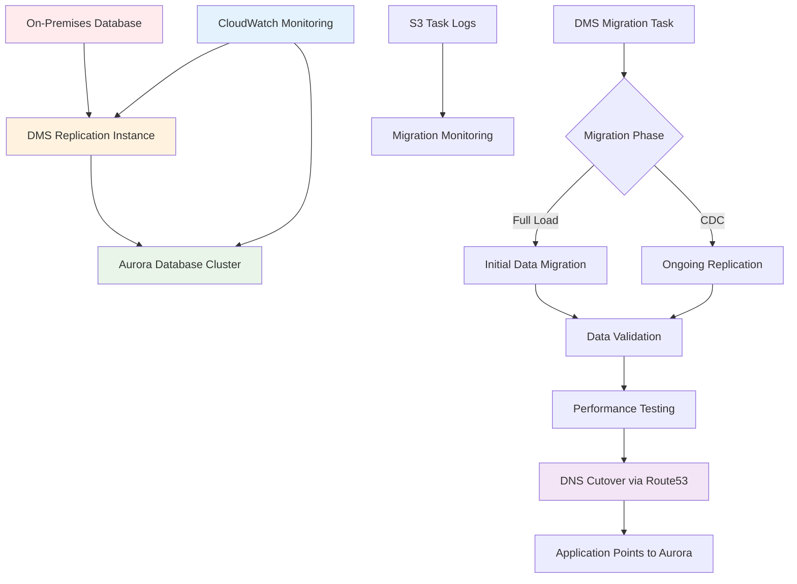

# Aurora Migration with Minimal Downtime

## Problem

Your organization runs critical business applications with on-premises databases that experience increasing load and maintenance overhead. You need to migrate these databases to Amazon Aurora for better performance, availability, and reduced operational burden, but you cannot afford application downtime or data loss during the migration process. Traditional migration approaches involving database dumps and restores can result in hours of downtime, which is unacceptable for business-critical systems.

## Solution

Implement a near-zero downtime database migration using AWS Database Migration Service (DMS) for continuous data replication and Amazon Aurora as the target database, as shown in Figure 1. This solution uses DMS to perform an initial full data load followed by ongoing change data capture (CDC) to keep the target database synchronized with the source. The migration process includes data validation, performance optimization, and a controlled cutover process to minimize business impact.



## Prerequisites

- On-premises database (MySQL, PostgreSQL, Oracle, or SQL Server) with network connectivity to AWS
- AWS account with VPC configured for database access
- Source database configured for CDC (binary logging, supplemental logging, etc.)
- Network connectivity between source database and AWS (VPN, Direct Connect, or Internet)
- Database administrator access to both source and target systems
- Estimated cost: $50-200 depending on replication instance size and duration

## Preparation

1. Set up environment variables for consistent resource naming:

   ```bash
   export AWS_ACCOUNT_ID=$(aws sts get-caller-identity \
   	--query Account --output text)
   export AWS_REGION=$(aws configure get region)
   export MIGRATION_SUFFIX=$(aws secretsmanager get-random-password \
   	--exclude-punctuation --exclude-uppercase \
   	--password-length 6 --require-each-included-type \
   	--output text --query RandomPassword)
   export DB_INSTANCE_CLASS="db.r6g.large"
   export REPLICATION_INSTANCE_CLASS="dms.t3.medium"
   ```

2. Create VPC and security infrastructure for secure database access:

   ```bash
   # Create VPC for database resources
   # This isolated network provides secure communication between DMS and Aurora
   VPC_ID=$(aws ec2 create-vpc --cidr-block 10.0.0.0/16 \
   	--tag-specifications \
   	'ResourceType=vpc,Tags=[{Key=Name,Value=aurora-migration-vpc}]' \
   	--query Vpc.VpcId --output text)
   export VPC_ID

   # Create subnets in different AZs for high availability
   # Aurora requires subnets in at least two Availability Zones
   SUBNET_1_ID=$(aws ec2 create-subnet --vpc-id $VPC_ID \
   	--cidr-block 10.0.1.0/24 --availability-zone ${AWS_REGION}a \
   	--tag-specifications \
   	'ResourceType=subnet,Tags=[{Key=Name,Value=aurora-subnet-1}]' \
   	--query Subnet.SubnetId --output text)
   export SUBNET_1_ID

   SUBNET_2_ID=$(aws ec2 create-subnet --vpc-id $VPC_ID \
   	--cidr-block 10.0.2.0/24 --availability-zone ${AWS_REGION}b \
   	--tag-specifications \
   	'ResourceType=subnet,Tags=[{Key=Name,Value=aurora-subnet-2}]' \
   	--query Subnet.SubnetId --output text)
   export SUBNET_2_ID
   ```

3. Create database subnet group for Aurora:

   ```bash
   # Database subnet groups define which subnets your database can use
   # Aurora uses this to place database instances across multiple AZs
   aws rds create-db-subnet-group \
   	--db-subnet-group-name aurora-migration-subnet-group \
   	--db-subnet-group-description "Subnet group for Aurora migration" \
   	--subnet-ids $SUBNET_1_ID $SUBNET_2_ID \
   	--tags Key=Name,Value=aurora-migration-subnet-group
   ```

4. Create security groups for database and DMS access:

   ```bash
   # Security group for Aurora
   # This controls network access to your Aurora cluster
   AURORA_SG_ID=$(aws ec2 create-security-group \
   	--group-name aurora-migration-sg \
   	--description "Security group for Aurora cluster" \
   	--vpc-id $VPC_ID \
   	--tag-specifications \
   	'ResourceType=security-group,Tags=[{Key=Name,Value=aurora-migration-sg}]' \
   	--query GroupId --output text)
   export AURORA_SG_ID

   # Security group for DMS replication instance
   # DMS needs network access to both source and target databases
   DMS_SG_ID=$(aws ec2 create-security-group \
   	--group-name dms-replication-sg \
   	--description "Security group for DMS replication instance" \
   	--vpc-id $VPC_ID \
   	--tag-specifications \
   	'ResourceType=security-group,Tags=[{Key=Name,Value=dms-replication-sg}]' \
   	--query GroupId --output text)
   export DMS_SG_ID
   ```

> **Note**: Security groups act as virtual firewalls controlling inbound and outbound traffic. For production migrations, apply the principle of least privilege by allowing only specific IP ranges and ports. Learn more about [DMS network security](https://docs.aws.amazon.com/dms/latest/userguide/CHAP_Security.html).

5. Configure security group rules for database access:

   ```bash
   # Allow DMS to access Aurora
   # This permits the replication instance to connect to Aurora on port 3306
   aws ec2 authorize-security-group-ingress \
   	--group-id $AURORA_SG_ID \
   	--protocol tcp --port 3306 \
   	--source-group $DMS_SG_ID

   # Allow outbound access from DMS to source database
   # Note: Adjust port and CIDR based on your source database
   aws ec2 authorize-security-group-egress \
   	--group-id $DMS_SG_ID \
   	--protocol tcp --port 3306 \
   	--cidr 0.0.0.0/0
   ```

6. Generate secure passwords for Aurora:

   ```bash
   # Use AWS Secrets Manager to generate cryptographically secure passwords
   # This eliminates the risk of weak passwords in your migration
   AURORA_MASTER_PASSWORD=$(aws secretsmanager get-random-password \
   	--exclude-punctuation --password-length 16 \
   	--require-each-included-type --output text \
   	--query RandomPassword)
   export AURORA_MASTER_PASSWORD
   ```

## Steps

### Step 1: Create Aurora Database Cluster

1. Create Aurora cluster parameter group with optimized settings:

   ```bash
   # Parameter groups control database engine settings
   # We'll optimize these settings for migration performance
   aws rds create-db-cluster-parameter-group \
   	--db-cluster-parameter-group-name aurora-migration-cluster-pg \
   	--db-parameter-group-family aurora-mysql8.0 \
   	--description "Parameter group for Aurora migration cluster"

   # Optimize for migration performance
   # These settings improve write throughput during data loading
   aws rds modify-db-cluster-parameter-group \
   	--db-cluster-parameter-group-name aurora-migration-cluster-pg \
   	--parameters \
   	ParameterName=innodb_buffer_pool_size,ParameterValue="{DBInstanceClassMemory*3/4}",ApplyMethod=pending-reboot \
   	ParameterName=max_connections,ParameterValue=1000,ApplyMethod=pending-reboot
   ```

2. Create the Aurora database cluster:

   ```bash
   AURORA_CLUSTER_ID="aurora-migration-$MIGRATION_SUFFIX"

   # Create Aurora cluster with enhanced security and monitoring
   # Aurora provides automatic backups, encryption, and high availability
   aws rds create-db-cluster \
   	--db-cluster-identifier $AURORA_CLUSTER_ID \
   	--engine aurora-mysql \
   	--engine-version 8.0.mysql_aurora.3.02.0 \
   	--master-username admin \
   	--master-user-password $AURORA_MASTER_PASSWORD \
   	--database-name migrationdb \
   	--vpc-security-group-ids $AURORA_SG_ID \
   	--db-subnet-group-name aurora-migration-subnet-group \
   	--db-cluster-parameter-group-name aurora-migration-cluster-pg \
   	--backup-retention-period 7 \
   	--preferred-backup-window "03:00-04:00" \
   	--preferred-maintenance-window "sun:04:00-sun:05:00" \
   	--enable-cloudwatch-logs-exports error general slowquery \
   	--tags Key=Name,Value=$AURORA_CLUSTER_ID \
   		Key=Purpose,Value=migration-target

   export AURORA_CLUSTER_ID
   ```

3. Create Aurora database instances:

   ```bash
   # Primary instance
   # This handles all write operations during migration
   aws rds create-db-instance \
   	--db-instance-identifier ${AURORA_CLUSTER_ID}-primary \
   	--db-instance-class $DB_INSTANCE_CLASS \
   	--engine aurora-mysql \
   	--db-cluster-identifier $AURORA_CLUSTER_ID \
   	--publicly-accessible \
   	--tags Key=Name,Value=${AURORA_CLUSTER_ID}-primary

   # Read replica for load distribution
   # This can handle read queries during and after migration
   aws rds create-db-instance \
   	--db-instance-identifier ${AURORA_CLUSTER_ID}-reader \
   	--db-instance-class $DB_INSTANCE_CLASS \
   	--engine aurora-mysql \
   	--db-cluster-identifier $AURORA_CLUSTER_ID \
   	--publicly-accessible \
   	--tags Key=Name,Value=${AURORA_CLUSTER_ID}-reader
   ```

### Step 2: Set Up DMS Replication Infrastructure

1. Create IAM roles for DMS service:

   ```bash
   # DMS VPC role (required for VPC configurations)
   # This role allows DMS to create and manage network resources
   cat > dms-vpc-trust-policy.json << 'EOF'
   {
     "Version": "2012-10-17",
     "Statement": [
       {
         "Effect": "Allow",
         "Principal": {
           "Service": "dms.amazonaws.com"
         },
         "Action": "sts:AssumeRole"
       }
     ]
   }
   EOF

   aws iam create-role \
   	--role-name dms-vpc-role \
   	--assume-role-policy-document file://dms-vpc-trust-policy.json

   aws iam attach-role-policy \
   	--role-name dms-vpc-role \
   	--policy-arn arn:aws:iam::aws:policy/service-role/AmazonDMSVPCManagementRole
   ```

2. Create DMS replication subnet group:

   ```bash
   # Replication subnet groups specify which subnets DMS can use
   # Similar to database subnet groups, but for DMS replication instances
   aws dms create-replication-subnet-group \
   	--replication-subnet-group-identifier dms-migration-subnet-group \
   	--replication-subnet-group-description "DMS subnet group for migration" \
   	--subnet-ids $SUBNET_1_ID $SUBNET_2_ID \
   	--tags Key=Name,Value=dms-migration-subnet-group
   ```

3. Create DMS replication instance:

   ```bash
   DMS_REPLICATION_INSTANCE_ID="dms-migration-$MIGRATION_SUFFIX"

   # Create the replication instance that performs the actual data migration
   # Multi-AZ provides high availability during the migration process
   aws dms create-replication-instance \
   	--replication-instance-identifier $DMS_REPLICATION_INSTANCE_ID \
   	--replication-instance-class $REPLICATION_INSTANCE_CLASS \
   	--allocated-storage 100 \
   	--vpc-security-group-ids $DMS_SG_ID \
   	--replication-subnet-group-identifier dms-migration-subnet-group \
   	--multi-az \
   	--publicly-accessible \
   	--tags Key=Name,Value=$DMS_REPLICATION_INSTANCE_ID \
   		Key=Purpose,Value=database-migration

   export DMS_REPLICATION_INSTANCE_ID
   ```

4. Wait for replication instance to become available:

   ```bash
   # Wait for the replication instance to be ready before proceeding
   # This typically takes 5-10 minutes
   aws dms wait replication-instance-available \
   	--replication-instance-identifier $DMS_REPLICATION_INSTANCE_ID
   ```

### Step 3: Configure Source and Target Endpoints

1. Get Aurora cluster endpoint information:

   ```bash
   # Retrieve the Aurora cluster endpoint for DMS configuration
   # DMS will connect to this endpoint to replicate data
   AURORA_ENDPOINT=$(aws rds describe-db-clusters \
   	--db-cluster-identifier $AURORA_CLUSTER_ID \
   	--query 'DBClusters[0].Endpoint' --output text)
   export AURORA_ENDPOINT

   AURORA_PORT=$(aws rds describe-db-clusters \
   	--db-cluster-identifier $AURORA_CLUSTER_ID \
   	--query 'DBClusters[0].Port' --output text)
   export AURORA_PORT
   ```

2. Create source database endpoint (adjust parameters for your database):

   ```bash
   # Example for MySQL source - modify for your database type
   # Replace these values with your actual source database details
   SOURCE_ENDPOINT_ID="source-mysql-$MIGRATION_SUFFIX"

   aws dms create-endpoint \
   	--endpoint-identifier $SOURCE_ENDPOINT_ID \
   	--endpoint-type source \
   	--engine-name mysql \
   	--server-name "your-source-server.example.com" \
   	--port 3306 \
   	--username "your-source-username" \
   	--password "your-source-password" \
   	--database-name "your-source-database" \
   	--extra-connection-attributes "heartbeatEnable=true;heartbeatFrequency=1" \
   	--tags Key=Name,Value=$SOURCE_ENDPOINT_ID

   export SOURCE_ENDPOINT_ID
   ```

3. Create Aurora target endpoint:

   ```bash
   TARGET_ENDPOINT_ID="target-aurora-$MIGRATION_SUFFIX"

   # Configure the Aurora target endpoint
   # Extra connection attributes optimize performance for Aurora
   aws dms create-endpoint \
   	--endpoint-identifier $TARGET_ENDPOINT_ID \
   	--endpoint-type target \
   	--engine-name aurora-mysql \
   	--server-name $AURORA_ENDPOINT \
   	--port $AURORA_PORT \
   	--username admin \
   	--password $AURORA_MASTER_PASSWORD \
   	--database-name migrationdb \
   	--extra-connection-attributes "parallelLoadThreads=8;maxFileSize=512000" \
   	--tags Key=Name,Value=$TARGET_ENDPOINT_ID

   export TARGET_ENDPOINT_ID
   ```

4. Test endpoint connections:

   ```bash
   # Test source endpoint connectivity
   # This verifies network connectivity and credentials before starting migration
   aws dms test-connection \
   	--replication-instance-arn \
   	$(aws dms describe-replication-instances \
   	--query "ReplicationInstances[?ReplicationInstanceIdentifier=='$DMS_REPLICATION_INSTANCE_ID'].ReplicationInstanceArn" --output text) \
   	--endpoint-arn \
   	$(aws dms describe-endpoints \
   	--query "Endpoints[?EndpointIdentifier=='$SOURCE_ENDPOINT_ID'].EndpointArn" --output text)

   # Test target endpoint connectivity
   aws dms test-connection \
   	--replication-instance-arn \
   	$(aws dms describe-replication-instances \
   	--query "ReplicationInstances[?ReplicationInstanceIdentifier=='$DMS_REPLICATION_INSTANCE_ID'].ReplicationInstanceArn" --output text) \
   	--endpoint-arn \
   	$(aws dms describe-endpoints \
   	--query "Endpoints[?EndpointIdentifier=='$TARGET_ENDPOINT_ID'].EndpointArn" --output text)
   ```

### Step 4: Create and Configure Migration Task

1. Create table mapping configuration for selective migration:

   ```bash
   # Table mappings define which objects to migrate and any transformations
   # This example migrates all tables and renames the schema
   cat > table-mappings.json << 'EOF'
   {
     "rules": [
       {
         "rule-type": "selection",
         "rule-id": "1",
         "rule-name": "1",
         "object-locator": {
           "schema-name": "%",
           "table-name": "%"
         },
         "rule-action": "include"
       },
       {
         "rule-type": "transformation",
         "rule-id": "2",
         "rule-name": "2",
         "rule-target": "schema",
         "object-locator": {
           "schema-name": "%"
         },
         "rule-action": "rename",
         "value": "migrationdb"
       }
     ]
   }
   EOF
   ```

2. Create migration task settings with optimization:

   ```bash
   # Task settings control migration behavior and performance
   # These settings are optimized for Aurora targets
   cat > task-settings.json << 'EOF'
   {
     "TargetMetadata": {
       "TargetSchema": "",
       "SupportLobs": true,
       "FullLobMode": false,
       "LobChunkSize": 0,
       "LimitedSizeLobMode": true,
       "LobMaxSize": 32,
       "InlineLobMaxSize": 0,
       "LoadMaxFileSize": 0,
       "ParallelLoadThreads": 0,
       "ParallelLoadBufferSize": 0,
       "BatchApplyEnabled": true,
       "TaskRecoveryTableEnabled": false,
       "ParallelApplyThreads": 8,
       "ParallelApplyBufferSize": 1000,
       "ParallelApplyQueuesPerThread": 4
     },
     "FullLoadSettings": {
       "TargetTablePrepMode": "DROP_AND_CREATE",
       "CreatePkAfterFullLoad": false,
       "StopTaskCachedChangesApplied": false,
       "StopTaskCachedChangesNotApplied": false,
       "MaxFullLoadSubTasks": 8,
       "TransactionConsistencyTimeout": 600,
       "CommitRate": 10000
     },
     "Logging": {
       "EnableLogging": true,
       "LogComponents": [
         {
           "Id": "SOURCE_UNLOAD",
           "Severity": "LOGGER_SEVERITY_DEFAULT"
         },
         {
           "Id": "TARGET_LOAD",
           "Severity": "LOGGER_SEVERITY_DEFAULT"
         },
         {
           "Id": "SOURCE_CAPTURE",
           "Severity": "LOGGER_SEVERITY_DEFAULT"
         },
         {
           "Id": "TARGET_APPLY",
           "Severity": "LOGGER_SEVERITY_DEFAULT"
         },
         {
           "Id": "TASK_MANAGER",
           "Severity": "LOGGER_SEVERITY_DEFAULT"
         }
       ],
       "CloudWatchLogGroup": null,
       "CloudWatchLogStream": null
     },
     "ControlTablesSettings": {
       "historyTimeslotInMinutes": 5,
       "ControlSchema": "",
       "HistoryTimeslotInMinutes": 5,
       "HistoryTableEnabled": false,
       "SuspendedTablesTableEnabled": false,
       "StatusTableEnabled": false
     },
     "StreamBufferSettings": {
       "StreamBufferCount": 3,
       "StreamBufferSizeInMB": 8,
       "CtrlStreamBufferSizeInMB": 5
     },
     "ChangeProcessingDdlHandlingPolicy": {
       "HandleSourceTableDropped": true,
       "HandleSourceTableTruncated": true,
       "HandleSourceTableAltered": true
     },
     "ErrorBehavior": {
       "DataErrorPolicy": "LOG_ERROR",
       "DataTruncationErrorPolicy": "LOG_ERROR",
       "DataErrorEscalationPolicy": "SUSPEND_TABLE",
       "DataErrorEscalationCount": 0,
       "TableErrorPolicy": "SUSPEND_TABLE",
       "TableErrorEscalationPolicy": "STOP_TASK",
       "TableErrorEscalationCount": 0,
       "RecoverableErrorCount": -1,
       "RecoverableErrorInterval": 5,
       "RecoverableErrorThrottling": true,
       "RecoverableErrorThrottlingMax": 1800,
       "ApplyErrorDeletePolicy": "IGNORE_RECORD",
       "ApplyErrorInsertPolicy": "LOG_ERROR",
       "ApplyErrorUpdatePolicy": "LOG_ERROR",
       "ApplyErrorEscalationPolicy": "LOG_ERROR",
       "ApplyErrorEscalationCount": 0,
       "FullLoadIgnoreConflicts": true
     },
     "ChangeProcessingTuning": {
       "BatchApplyPreserveTransaction": true,
       "BatchApplyTimeoutMin": 1,
       "BatchApplyTimeoutMax": 30,
       "BatchApplyMemoryLimit": 500,
       "BatchSplitSize": 0,
       "MinTransactionSize": 1000,
       "CommitTimeout": 1,
       "MemoryLimitTotal": 1024,
       "MemoryKeepTime": 60,
       "StatementCacheSize": 50
     },
     "ValidationSettings": {
       "EnableValidation": true,
       "ValidationMode": "ROW_LEVEL",
       "ThreadCount": 5,
       "PartitionSize": 10000,
       "FailureMaxCount": 10000,
       "RecordFailureDelayLimitInMinutes": 0,
       "RecordSuspendDelayInMinutes": 30,
       "MaxKeyColumnSize": 8096,
       "TableFailureMaxCount": 1000,
       "ValidationOnly": false,
       "HandleCollationDiff": false,
       "RecordFailureDelayInMinutes": 5,
       "SkipLobColumns": false,
       "ValidationPartialLobSize": 0,
       "ValidationQueryCdcDelaySeconds": 0
     }
   }
   EOF
   ```

> **Warning**: Ensure your source database has binary logging enabled (for MySQL) or appropriate CDC configuration for other database engines before starting the migration task.

3. Create the migration task:

   ```bash
   MIGRATION_TASK_ID="migration-task-$MIGRATION_SUFFIX"

   # Get ARNs for the source and target endpoints
   SOURCE_ENDPOINT_ARN=$(aws dms describe-endpoints \
   	--query "Endpoints[?EndpointIdentifier=='$SOURCE_ENDPOINT_ID'].EndpointArn" \
   	--output text)
   TARGET_ENDPOINT_ARN=$(aws dms describe-endpoints \
   	--query "Endpoints[?EndpointIdentifier=='$TARGET_ENDPOINT_ID'].EndpointArn" \
   	--output text)
   REPLICATION_INSTANCE_ARN=$(aws dms describe-replication-instances \
   	--query "ReplicationInstances[?ReplicationInstanceIdentifier=='$DMS_REPLICATION_INSTANCE_ID'].ReplicationInstanceArn" \
   	--output text)

   # Create the migration task with full-load and CDC
   # This approach minimizes downtime by continuously replicating changes
   aws dms create-replication-task \
   	--replication-task-identifier $MIGRATION_TASK_ID \
   	--source-endpoint-arn $SOURCE_ENDPOINT_ARN \
   	--target-endpoint-arn $TARGET_ENDPOINT_ARN \
   	--replication-instance-arn $REPLICATION_INSTANCE_ARN \
   	--migration-type full-load-and-cdc \
   	--table-mappings file://table-mappings.json \
   	--replication-task-settings file://task-settings.json \
   	--tags Key=Name,Value=$MIGRATION_TASK_ID

   export MIGRATION_TASK_ID
   ```

### Step 5: Execute Migration and Monitor Progress

1. Start the migration task:

   ```bash
   # Start the replication task to begin data migration
   # The task will first perform a full load, then switch to CDC mode
   aws dms start-replication-task \
   	--replication-task-arn \
   	$(aws dms describe-replication-tasks \
   	--query "ReplicationTasks[?ReplicationTaskIdentifier=='$MIGRATION_TASK_ID'].ReplicationTaskArn" --output text) \
   	--start-replication-task-type start-replication
   ```

2. Monitor migration progress:

   ```bash
   # Check task status to monitor migration progress
   # Watch for the task to move from "running" to "ready" status
   aws dms describe-replication-tasks \
   	--filters Name=replication-task-id,Values=$MIGRATION_TASK_ID \
   	--query 'ReplicationTasks[0].[ReplicationTaskIdentifier,Status,ReplicationTaskStats]'

   # Monitor table statistics to see detailed progress per table
   aws dms describe-table-statistics \
   	--replication-task-arn \
   	$(aws dms describe-replication-tasks \
   	--query "ReplicationTasks[?ReplicationTaskIdentifier=='$MIGRATION_TASK_ID'].ReplicationTaskArn" --output text) \
   	--query 'TableStatistics[*].[SchemaName,TableName,TableState,FullLoadRows,Inserts,Updates,Deletes,ValidationState]'
   ```

### Step 6: Prepare for Cutover

1. Create Route 53 hosted zone for DNS management:

   ```bash
   # Create a private hosted zone for DNS-based cutover
   # This allows you to redirect traffic to Aurora without application changes
   HOSTED_ZONE_ID=$(aws route53 create-hosted-zone \
   	--name db.example.com \
   	--caller-reference migration-$(date +%s) \
   	--hosted-zone-config \
   	Comment="DNS zone for database migration cutover" \
   	--query 'HostedZone.Id' --output text)
   export HOSTED_ZONE_ID
   ```

2. Create initial DNS record pointing to source database:

   ```bash
   # Create initial DNS record that points to your source database
   # Applications should be configured to use this DNS name
   cat > dns-record-source.json << 'EOF'
   {
     "Changes": [
       {
         "Action": "CREATE",
         "ResourceRecordSet": {
           "Name": "app-db.db.example.com",
           "Type": "CNAME",
           "TTL": 60,
           "ResourceRecords": [
             {
               "Value": "SOURCE_DB_HOSTNAME"
             }
           ]
         }
       }
     ]
   }
   EOF

   # Replace with actual source database hostname
   sed "s/SOURCE_DB_HOSTNAME/your-source-server.example.com/g" \
   	dns-record-source.json > dns-record-source-final.json

   aws route53 change-resource-record-sets \
   	--hosted-zone-id $HOSTED_ZONE_ID \
   	--change-batch file://dns-record-source-final.json
   ```

3. Prepare cutover DNS record for Aurora:

   ```bash
   # Prepare the DNS record that will redirect traffic to Aurora
   # This will be applied during the cutover window
   cat > dns-record-aurora.json << 'EOF'
   {
     "Changes": [
       {
         "Action": "UPSERT",
         "ResourceRecordSet": {
           "Name": "app-db.db.example.com",
           "Type": "CNAME",
           "TTL": 60,
           "ResourceRecords": [
             {
               "Value": "AURORA_ENDPOINT"
             }
           ]
         }
       }
     ]
   }
   EOF

   sed "s/AURORA_ENDPOINT/$AURORA_ENDPOINT/g" \
   	dns-record-aurora.json > dns-record-aurora-final.json
   ```

## Validation & Testing

### Pre-Cutover Validation

1. Verify data consistency between source and target:

   ```bash
   # Check table row counts (example query)
   echo "Verify table row counts match between source and Aurora"
   echo "Source tables should match Aurora tables in migrationdb schema"

   # Connect to Aurora and verify data
   mysql -h $AURORA_ENDPOINT -u admin -p$AURORA_MASTER_PASSWORD \
   	-e "SELECT COUNT(*) FROM migrationdb.your_table_name;"
   ```

2. Monitor CDC lag and validation status:

   ```bash
   # Check CDC latency to ensure minimal lag before cutover
   aws dms describe-replication-tasks \
   	--filters Name=replication-task-id,Values=$MIGRATION_TASK_ID \
   	--query 'ReplicationTasks[0].ReplicationTaskStats.ElapsedTimeMillis'

   # Check validation results to ensure data integrity
   aws dms describe-table-statistics \
   	--replication-task-arn \
   	$(aws dms describe-replication-tasks \
   	--query "ReplicationTasks[?ReplicationTaskIdentifier=='$MIGRATION_TASK_ID'].ReplicationTaskArn" --output text) \
   	--query 'TableStatistics[?ValidationState!=`ValidationPassed`]'
   ```

3. Perform application testing against Aurora:

   ```bash
   echo "Test application connectivity to Aurora endpoint"
   echo "Aurora endpoint: $AURORA_ENDPOINT:$AURORA_PORT"
   echo "Test read/write operations and performance"
   ```

### Cutover Process

1. Stop application writes to source database (maintenance window)

2. Wait for CDC to catch up completely:

   ```bash
   # Monitor until CDC lag is minimal
   # This ensures all changes have been replicated to Aurora
   while true; do
     LAG=$(aws dms describe-table-statistics \
     	--replication-task-arn \
     	$(aws dms describe-replication-tasks \
     	--query "ReplicationTasks[?ReplicationTaskIdentifier=='$MIGRATION_TASK_ID'].ReplicationTaskArn" --output text) \
     	--query 'TableStatistics[0].CdcInserts' --output text)
     echo "CDC operations pending: $LAG"
     if [ "$LAG" -eq "0" ]; then
       echo "CDC synchronized - ready for cutover"
       break
       fi
     sleep 10
   done
   ```

3. Perform DNS cutover to point to Aurora:

   ```bash
   # Update DNS to redirect traffic to Aurora
   # This is the actual cutover moment
   aws route53 change-resource-record-sets \
   	--hosted-zone-id $HOSTED_ZONE_ID \
   	--change-batch file://dns-record-aurora-final.json
   ```

4. Resume application operations and monitor

### Expected Results

- Full load phase completes successfully with all tables migrated
- CDC phase shows minimal lag (< 1 second) before cutover
- Data validation passes for all tables with zero discrepancies
- Application cutover completed in under 5 minutes total downtime
- DNS propagation enables automatic application failover to Aurora

> **Note**: The actual cutover downtime depends on DNS TTL settings and application connection pooling. Using shorter TTL values (60 seconds) minimizes switchover time.

## Cleanup

1. Stop and delete the DMS replication task:

   ```bash
   REPLICATION_TASK_ARN=$(aws dms describe-replication-tasks \
   	--query "ReplicationTasks[?ReplicationTaskIdentifier=='$MIGRATION_TASK_ID'].ReplicationTaskArn" --output text)

   aws dms stop-replication-task \
   	--replication-task-arn $REPLICATION_TASK_ARN

   aws dms wait replication-task-stopped \
   	--replication-task-arn $REPLICATION_TASK_ARN

   aws dms delete-replication-task \
   	--replication-task-arn $REPLICATION_TASK_ARN
   ```

2. Delete DMS endpoints:

   ```bash
   aws dms delete-endpoint --endpoint-arn $SOURCE_ENDPOINT_ARN
   aws dms delete-endpoint --endpoint-arn $TARGET_ENDPOINT_ARN
   ```

3. Delete DMS replication instance:

   ```bash
   aws dms delete-replication-instance \
   	--replication-instance-identifier $DMS_REPLICATION_INSTANCE_ID
   ```

4. Delete DMS subnet group:

   ```bash
   aws dms delete-replication-subnet-group \
   	--replication-subnet-group-identifier dms-migration-subnet-group
   ```

5. Delete Aurora database cluster and instances:

   ```bash
   # Delete instances first
   aws rds delete-db-instance \
   	--db-instance-identifier ${AURORA_CLUSTER_ID}-primary \
   	--skip-final-snapshot

   aws rds delete-db-instance \
   	--db-instance-identifier ${AURORA_CLUSTER_ID}-reader \
   	--skip-final-snapshot

   # Wait for instances to be deleted
   aws rds wait db-instance-deleted \
   	--db-instance-identifier ${AURORA_CLUSTER_ID}-primary

   aws rds wait db-instance-deleted \
   	--db-instance-identifier ${AURORA_CLUSTER_ID}-reader

   # Delete cluster
   aws rds delete-db-cluster \
   	--db-cluster-identifier $AURORA_CLUSTER_ID \
   	--skip-final-snapshot
   ```

6. Delete database subnet group and parameter group:

   ```bash
   aws rds delete-db-subnet-group \
   	--db-subnet-group-name aurora-migration-subnet-group

   aws rds delete-db-cluster-parameter-group \
   	--db-cluster-parameter-group-name aurora-migration-cluster-pg
   ```

7. Delete Route 53 hosted zone:

   ```bash
   aws route53 delete-hosted-zone --id $HOSTED_ZONE_ID
   ```

8. Delete VPC infrastructure:

   ```bash
   # Delete security groups
   aws ec2 delete-security-group --group-id $AURORA_SG_ID
   aws ec2 delete-security-group --group-id $DMS_SG_ID

   # Delete subnets
   aws ec2 delete-subnet --subnet-id $SUBNET_1_ID
   aws ec2 delete-subnet --subnet-id $SUBNET_2_ID

   # Delete VPC
   aws ec2 delete-vpc --vpc-id $VPC_ID
   ```

9. Delete IAM roles:

   ```bash
   aws iam detach-role-policy \
   	--role-name dms-vpc-role \
   	--policy-arn arn:aws:iam::aws:policy/service-role/AmazonDMSVPCManagementRole

   aws iam delete-role --role-name dms-vpc-role
   ```

10. Clean up local configuration files:

    ```bash
    rm -f *.json
    ```

## Discussion

This migration approach demonstrates the power of AWS Database Migration Service for achieving near-zero downtime database migrations to Amazon Aurora. The key to minimal downtime lies in the combination of DMS's continuous data capture (CDC) capabilities and DNS-based cutover strategies. DMS performs an initial full load of your database while simultaneously capturing ongoing changes, ensuring no data loss during the migration process.

Amazon Aurora provides significant advantages over traditional database deployments including automated backups, point-in-time recovery, automatic storage scaling, and built-in high availability across multiple Availability Zones. Aurora's performance optimizations can often provide 3-5x better performance than traditional MySQL deployments, especially for read-heavy workloads when combined with read replicas.

The DNS cutover strategy using Route 53 enables you to minimize application changes during migration. By using short TTL values, you can achieve sub-minute cutover times, reducing business impact to mere seconds of connectivity disruption rather than hours of maintenance windows. This approach works especially well with connection pooling in applications, as new connections automatically route to the new database endpoint.

For production migrations, consider implementing additional monitoring and rollback capabilities. CloudWatch alarms can track DMS task progress and database performance metrics. Implement automated rollback procedures by maintaining your source database in read-only mode for a period after cutover, allowing quick reversal if issues arise.

The validation features in DMS provide confidence in data integrity throughout the migration process. Row-level validation ensures that data transferred correctly, while ongoing CDC monitoring helps identify any replication lag that could impact cutover timing.

Sources:

- [AWS Database Migration Service User Guide](https://docs.aws.amazon.com/dms/latest/userguide/Welcome.html)
- [Amazon Aurora User Guide](https://docs.aws.amazon.com/AmazonRDS/latest/AuroraUserGuide/CHAP_AuroraOverview.html)
- [DMS Best Practices](https://docs.aws.amazon.com/dms/latest/userguide/CHAP_BestPractices.html)

## Challenge

Extend this migration to implement a multi-region Aurora Global Database setup for disaster recovery. Configure cross-region read replicas and implement automated failover using Route 53 health checks. Consider adding AWS Secrets Manager integration for password rotation and enhanced security during the migration process.

## Infrastructure Code

*Infrastructure code will be generated after recipe approval.*