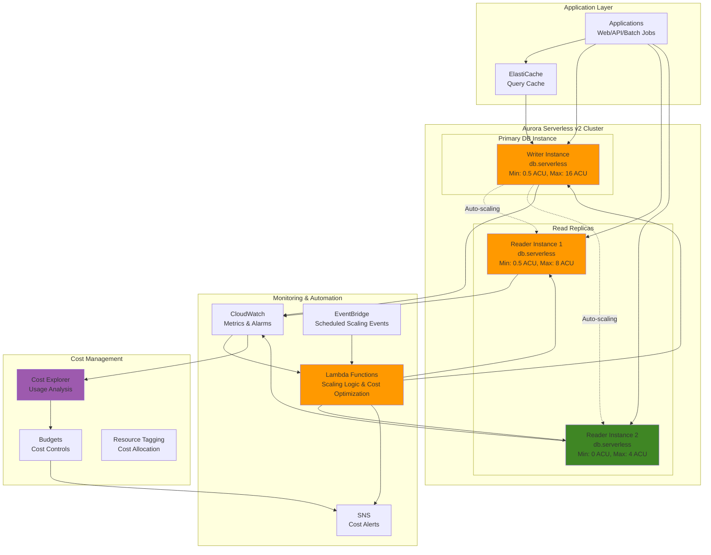

# Aurora Serverless Cost Optimization Patterns

## Problem

Development teams and SaaS providers need databases that can handle unpredictable workloads with dramatic scaling requirements while maintaining strict cost controls. Traditional provisioned Aurora instances often lead to over-provisioning for peak loads, resulting in 60-80% resource waste during off-peak hours. Conversely, under-provisioning causes performance issues during traffic spikes. Managing multiple database environments (development, staging, production) with varying usage patterns becomes costly and operationally complex, especially for startup companies and organizations with limited budgets seeking to optimize database costs while maintaining performance guarantees.

## Solution

Implement Aurora Serverless v2 with intelligent auto-scaling patterns that automatically adjusts capacity based on workload demands while incorporating cost optimization strategies including automatic pause/resume capabilities, intelligent capacity forecasting, and workload-aware scaling policies. This solution provides sub-second scaling with granular capacity adjustments and comprehensive cost monitoring to achieve up to 80% cost savings during low-usage periods.

## Architecture Diagram



## Prerequisites

1. AWS account with Aurora, Lambda, CloudWatch, and EventBridge permissions
2. AWS CLI v2 installed and configured (or AWS CloudShell)
3. Understanding of Aurora Serverless v2 scaling concepts and ACU calculations
4. VPC and subnet groups configured for Aurora with appropriate security groups
5. Estimated cost: $50-200/month depending on workload patterns and scaling configurations

> **Note**: Aurora Serverless v2 charges are based on actual ACU consumption per second, making cost prediction dependent on workload patterns. ACUs can scale in 0.5 increments for fine-grained capacity control.

## Preparation

```bash
# Set environment variables
export AWS_REGION=$(aws configure get region)
export AWS_ACCOUNT_ID=$(aws sts get-caller-identity \
    --query Account --output text)

# Generate unique identifiers
RANDOM_SUFFIX=$(aws secretsmanager get-random-password \
    --exclude-punctuation --exclude-uppercase \
    --password-length 6 --require-each-included-type \
    --output text --query RandomPassword)

export CLUSTER_NAME="aurora-sv2-cost-opt-${RANDOM_SUFFIX}"
export LAMBDA_ROLE_NAME="aurora-sv2-lambda-role-${RANDOM_SUFFIX}"
export CLUSTER_PARAMETER_GROUP="aurora-sv2-params-${RANDOM_SUFFIX}"
export MASTER_PASSWORD="AuroraSv2Pass2024!"

# Get default VPC security group for Aurora
export VPC_SECURITY_GROUP=$(aws ec2 describe-security-groups \
    --filters "Name=group-name,Values=default" \
    --query 'SecurityGroups[0].GroupId' --output text)

# Create IAM role for Lambda functions
cat > lambda-trust-policy.json << EOF
{
  "Version": "2012-10-17",
  "Statement": [
    {
      "Effect": "Allow",
      "Principal": {"Service": "lambda.amazonaws.com"},
      "Action": "sts:AssumeRole"
    }
  ]
}
EOF

aws iam create-role \
    --role-name $LAMBDA_ROLE_NAME \
    --assume-role-policy-document file://lambda-trust-policy.json

# Attach basic execution role policy
aws iam attach-role-policy \
    --role-name $LAMBDA_ROLE_NAME \
    --policy-arn arn:aws:iam::aws:policy/service-role/AWSLambdaBasicExecutionRole

# Create custom policy for Aurora management
cat > aurora-lambda-policy.json << EOF
{
  "Version": "2012-10-17",
  "Statement": [
    {
      "Effect": "Allow",
      "Action": [
        "rds:DescribeDBClusters",
        "rds:DescribeDBInstances",
        "rds:ModifyDBCluster",
        "rds:ModifyDBInstance",
        "rds:StartDBCluster",
        "rds:StopDBCluster",
        "cloudwatch:GetMetricStatistics",
        "cloudwatch:PutMetricData",
        "ce:GetUsageAndCosts",
        "budgets:ViewBudget",
        "sns:Publish"
      ],
      "Resource": "*"
    }
  ]
}
EOF

aws iam create-policy \
    --policy-name aurora-sv2-lambda-policy \
    --policy-document file://aurora-lambda-policy.json

aws iam attach-role-policy \
    --role-name $LAMBDA_ROLE_NAME \
    --policy-arn arn:aws:iam::$AWS_ACCOUNT_ID:policy/aurora-sv2-lambda-policy

echo "✅ Environment variables and IAM roles configured"
```

## Steps

1. **Create Custom Cluster Parameter Group for Optimization**:

   Aurora cluster parameter groups define the database engine configuration that directly impacts performance and cost efficiency. Custom parameter groups enable fine-tuning of PostgreSQL settings specifically optimized for Aurora Serverless v2's scaling behavior, ensuring optimal resource utilization and cost management. This step establishes the foundational database configuration that supports intelligent scaling decisions throughout the architecture.

   ```bash
   # Create parameter group optimized for cost and performance
   aws rds create-db-cluster-parameter-group \
       --db-cluster-parameter-group-name $CLUSTER_PARAMETER_GROUP \
       --db-parameter-group-family aurora-postgresql16 \
       --description "Aurora Serverless v2 cost optimization parameters"
   
   # Configure parameters for cost optimization
   aws rds modify-db-cluster-parameter-group \
       --db-cluster-parameter-group-name $CLUSTER_PARAMETER_GROUP \
       --parameters \
           "ParameterName=shared_preload_libraries,ParameterValue='pg_stat_statements',ApplyMethod=pending-reboot" \
           "ParameterName=track_activity_query_size,ParameterValue=2048,ApplyMethod=immediate" \
           "ParameterName=log_statement,ParameterValue=ddl,ApplyMethod=immediate" \
           "ParameterName=log_min_duration_statement,ParameterValue=1000,ApplyMethod=immediate"
   
   echo "✅ Custom parameter group created with cost optimization settings"
   ```

   The parameter group is now configured with essential monitoring and logging settings. The `pg_stat_statements` extension provides detailed query performance statistics that enable our scaling algorithms to make informed decisions about resource allocation. These parameters create the visibility needed for intelligent cost optimization while maintaining database performance. See the [Amazon RDS Parameter Groups documentation](https://docs.aws.amazon.com/AmazonRDS/latest/UserGuide/USER_WorkingWithParamGroups.html) for advanced configuration options.

2. **Create Aurora Serverless v2 Cluster with Advanced Scaling Configuration**:

   Aurora Serverless v2 represents a breakthrough in database cost optimization, offering sub-second scaling with capacity adjustments in increments as small as 0.5 Aurora Capacity Units (ACUs). Unlike traditional provisioned instances that require manual scaling decisions, Aurora Serverless v2 automatically adjusts compute capacity based on workload demands, ensuring you only pay for resources actually consumed. This serverless architecture eliminates the need to over-provision for peak loads while maintaining enterprise-grade performance and availability.

   ```bash
   # Create Aurora Serverless v2 cluster with optimized scaling settings
   aws rds create-db-cluster \
       --db-cluster-identifier $CLUSTER_NAME \
       --engine aurora-postgresql \
       --engine-version 16.4 \
       --master-username postgres \
       --master-user-password $MASTER_PASSWORD \
       --storage-encrypted \
       --vpc-security-group-ids $VPC_SECURITY_GROUP \
       --db-cluster-parameter-group-name $CLUSTER_PARAMETER_GROUP \
       --serverless-v2-scaling-configuration MinCapacity=0.5,MaxCapacity=16 \
       --backup-retention-period 7 \
       --preferred-backup-window "03:00-04:00" \
       --preferred-maintenance-window "sun:04:00-sun:05:00" \
       --enable-cloudwatch-logs-exports postgresql \
       --enable-performance-insights \
       --performance-insights-retention-period 7 \
       --tags Key=Environment,Value=CostOptimized Key=Application,Value=AuroraServerlessV2
   
   # Wait for cluster to be available
   aws rds wait db-cluster-available --db-cluster-identifier $CLUSTER_NAME
   
   echo "✅ Aurora Serverless v2 cluster created"
   ```

   The cluster is now created with optimized scaling boundaries (0.5-16 ACUs) that balance cost efficiency with performance requirements. Performance Insights provides deep database performance monitoring that correlates with our scaling decisions, while CloudWatch Logs export enables comprehensive analysis of database activity patterns. This foundation supports intelligent scaling algorithms that can respond to workload changes within seconds. Learn more about Aurora Serverless v2 capabilities in the [official documentation](https://docs.aws.amazon.com/AmazonRDS/latest/AuroraUserGuide/aurora-serverless-v2.html).

   > **Warning**: Ensure your VPC security groups and subnet groups are properly configured for Aurora before proceeding. Incorrect network configuration can prevent cluster creation or limit connectivity.

3. **Create Primary Writer Instance**:

   The writer instance serves as the primary database endpoint for all write operations and provides the foundation for read scaling. In Aurora Serverless v2, the writer instance automatically scales its compute capacity based on workload demands while maintaining strong consistency and ACID compliance. The `db.serverless` instance class enables seamless capacity adjustments without the maintenance overhead of traditional provisioned instances, making it ideal for applications with variable workloads.

   ```bash
   # Create writer instance
   aws rds create-db-instance \
       --db-instance-identifier "${CLUSTER_NAME}-writer" \
       --db-cluster-identifier $CLUSTER_NAME \
       --engine aurora-postgresql \
       --db-instance-class db.serverless \
       --promotion-tier 1 \
       --enable-performance-insights \
       --performance-insights-retention-period 7 \
       --monitoring-interval 60 \
       --tags Key=InstanceType,Value=Writer Key=Environment,Value=CostOptimized
   
   # Wait for writer instance to be available
   aws rds wait db-instance-available \
       --db-instance-identifier "${CLUSTER_NAME}-writer"
   
   echo "✅ Writer instance created"
   ```

   The writer instance is now active and ready to handle database operations. Enhanced monitoring and Performance Insights provide real-time visibility into database performance metrics that drive our intelligent scaling decisions. The promotion tier setting ensures this instance has the highest priority for failover scenarios, maintaining high availability while optimizing costs. This writer instance will automatically scale between the configured capacity limits based on actual workload demands.

4. **Create Read Replicas with Different Scaling Patterns**:

   Read replicas in Aurora Serverless v2 enable horizontal scaling of read operations while implementing tiered cost optimization strategies. Each replica can have different scaling characteristics optimized for specific use cases - production replicas maintain higher minimum capacity for consistent performance, while development and analytics replicas can scale more aggressively down to minimize costs. This multi-tier approach maximizes cost efficiency across different workload patterns without compromising application performance requirements.

   ```bash
   # Create read replica with standard scaling (for production reads)
   aws rds create-db-instance \
       --db-instance-identifier "${CLUSTER_NAME}-reader-1" \
       --db-cluster-identifier $CLUSTER_NAME \
       --engine aurora-postgresql \
       --db-instance-class db.serverless \
       --promotion-tier 2 \
       --enable-performance-insights \
       --performance-insights-retention-period 7 \
       --tags Key=InstanceType,Value=Reader Key=ScalingTier,Value=Standard
   
   # Create read replica with aggressive scaling down (for development/analytics)
   aws rds create-db-instance \
       --db-instance-identifier "${CLUSTER_NAME}-reader-2" \
       --db-cluster-identifier $CLUSTER_NAME \
       --engine aurora-postgresql \
       --db-instance-class db.serverless \
       --promotion-tier 3 \
       --enable-performance-insights \
       --performance-insights-retention-period 7 \
       --tags Key=InstanceType,Value=Reader Key=ScalingTier,Value=Aggressive
   
   # Wait for all instances to be available
   aws rds wait db-instance-available \
       --db-instance-identifier "${CLUSTER_NAME}-reader-1"
   
   aws rds wait db-instance-available \
       --db-instance-identifier "${CLUSTER_NAME}-reader-2"
   
   echo "✅ Read replica instances created"
   ```

   Both read replicas are now operational with distinct scaling profiles. The standard-tier replica maintains consistent capacity for production read workloads, while the aggressive-tier replica can scale down to minimal capacity during low-usage periods, achieving significant cost savings for development and analytics workloads. Aurora's shared storage architecture ensures all replicas have access to the same data with minimal lag, regardless of their individual scaling states. Tags enable granular cost tracking and automated scaling policies based on workload characteristics.

5. **Create Intelligent Scaling Lambda Functions**:

   Lambda functions provide the intelligent automation layer that monitors Aurora Serverless v2 metrics and makes informed scaling decisions based on real-time workload patterns. This serverless approach to database scaling eliminates manual intervention while implementing sophisticated cost optimization algorithms that consider CPU utilization, connection counts, and historical usage patterns. The Lambda-based scaling system can respond to workload changes faster than traditional monitoring approaches, ensuring optimal cost-performance balance at all times.

   ```bash
   # Create cost-aware scaling function
   cat > cost-aware-scaler.py << 'EOF'
import json
import boto3
from datetime import datetime, timedelta
import os

rds = boto3.client('rds')
cloudwatch = boto3.client('cloudwatch')

def lambda_handler(event, context):
    cluster_id = os.environ['CLUSTER_ID']
    
    try:
        # Get current cluster configuration
        cluster_response = rds.describe_db_clusters(DBClusterIdentifier=cluster_id)
        cluster = cluster_response['DBClusters'][0]
        
        current_min = cluster['ServerlessV2ScalingConfiguration']['MinCapacity']
        current_max = cluster['ServerlessV2ScalingConfiguration']['MaxCapacity']
        
        # Get CPU utilization metrics
        cpu_metrics = get_cpu_utilization(cluster_id)
        connection_metrics = get_connection_count(cluster_id)
        
        # Determine optimal scaling based on patterns
        new_min, new_max = calculate_optimal_scaling(
            cpu_metrics, connection_metrics, current_min, current_max
        )
        
        # Apply scaling if needed
        if new_min != current_min or new_max != current_max:
            update_scaling_configuration(cluster_id, new_min, new_max)
            
            # Send cost impact notification
            send_scaling_notification(cluster_id, current_min, current_max, new_min, new_max)
        
        return {
            'statusCode': 200,
            'body': json.dumps({
                'cluster': cluster_id,
                'previous_scaling': {'min': current_min, 'max': current_max},
                'new_scaling': {'min': new_min, 'max': new_max},
                'cpu_avg': cpu_metrics['average'],
                'connections_avg': connection_metrics['average']
            })
        }
        
    except Exception as e:
        print(f"Error: {str(e)}")
        return {'statusCode': 500, 'body': json.dumps({'error': str(e)})}

def get_cpu_utilization(cluster_id):
    end_time = datetime.utcnow()
    start_time = end_time - timedelta(hours=1)
    
    response = cloudwatch.get_metric_statistics(
        Namespace='AWS/RDS',
        MetricName='CPUUtilization',
        Dimensions=[{'Name': 'DBClusterIdentifier', 'Value': cluster_id}],
        StartTime=start_time,
        EndTime=end_time,
        Period=300,
        Statistics=['Average', 'Maximum']
    )
    
    if response['Datapoints']:
        avg_cpu = sum(dp['Average'] for dp in response['Datapoints']) / len(response['Datapoints'])
        max_cpu = max(dp['Maximum'] for dp in response['Datapoints'])
        return {'average': avg_cpu, 'maximum': max_cpu}
    return {'average': 0, 'maximum': 0}

def get_connection_count(cluster_id):
    end_time = datetime.utcnow()
    start_time = end_time - timedelta(hours=1)
    
    response = cloudwatch.get_metric_statistics(
        Namespace='AWS/RDS',
        MetricName='DatabaseConnections',
        Dimensions=[{'Name': 'DBClusterIdentifier', 'Value': cluster_id}],
        StartTime=start_time,
        EndTime=end_time,
        Period=300,
        Statistics=['Average', 'Maximum']
    )
    
    if response['Datapoints']:
        avg_conn = sum(dp['Average'] for dp in response['Datapoints']) / len(response['Datapoints'])
        max_conn = max(dp['Maximum'] for dp in response['Datapoints'])
        return {'average': avg_conn, 'maximum': max_conn}
    return {'average': 0, 'maximum': 0}

def calculate_optimal_scaling(cpu_metrics, conn_metrics, current_min, current_max):
    cpu_avg = cpu_metrics['average']
    cpu_max = cpu_metrics['maximum']
    conn_avg = conn_metrics['average']
    
    # Determine optimal minimum capacity
    if cpu_avg < 20 and conn_avg < 5:
        # Very low utilization - aggressive scale down
        new_min = 0.5
    elif cpu_avg < 40 and conn_avg < 20:
        # Low utilization - moderate scale down
        new_min = max(0.5, current_min - 0.5)
    elif cpu_avg > 70 or conn_avg > 50:
        # High utilization - scale up minimum
        new_min = min(8, current_min + 1)
    else:
        # Maintain current minimum
        new_min = current_min
    
    # Determine optimal maximum capacity
    if cpu_max > 80 or conn_avg > 80:
        # High peak usage - increase max capacity
        new_max = min(32, current_max + 4)
    elif cpu_max < 50 and conn_avg < 30:
        # Low peak usage - reduce max capacity for cost savings
        new_max = max(4, current_max - 2)
    else:
        # Maintain current maximum
        new_max = current_max
    
    # Ensure minimum <= maximum
    new_min = min(new_min, new_max)
    
    return new_min, new_max

def update_scaling_configuration(cluster_id, min_capacity, max_capacity):
    rds.modify_db_cluster(
        DBClusterIdentifier=cluster_id,
        ServerlessV2ScalingConfiguration={
            'MinCapacity': min_capacity,
            'MaxCapacity': max_capacity
        },
        ApplyImmediately=True
    )

def send_scaling_notification(cluster_id, old_min, old_max, new_min, new_max):
    # Calculate cost impact (rough estimate)
    cost_impact = calculate_cost_impact(old_min, old_max, new_min, new_max)
    
    # Send to CloudWatch as custom metric
    cloudwatch.put_metric_data(
        Namespace='Aurora/CostOptimization',
        MetricData=[
            {
                'MetricName': 'ScalingAdjustment',
                'Dimensions': [
                    {'Name': 'ClusterIdentifier', 'Value': cluster_id},
                    {'Name': 'ScalingType', 'Value': 'MinCapacity'}
                ],
                'Value': new_min - old_min,
                'Unit': 'Count'
            },
            {
                'MetricName': 'EstimatedCostImpact',
                'Dimensions': [{'Name': 'ClusterIdentifier', 'Value': cluster_id}],
                'Value': cost_impact,
                'Unit': 'None'
            }
        ]
    )

def calculate_cost_impact(old_min, old_max, new_min, new_max):
    # Simplified cost calculation (ACU hours per month * cost per ACU hour)
    # Assuming $0.12 per ACU hour (varies by region)
    hours_per_month = 730
    cost_per_acu_hour = 0.12
    
    # Estimate average usage (simplified model)
    old_avg_usage = (old_min + old_max) / 2
    new_avg_usage = (new_min + new_max) / 2
    
    old_cost = old_avg_usage * hours_per_month * cost_per_acu_hour
    new_cost = new_avg_usage * hours_per_month * cost_per_acu_hour
    
    return new_cost - old_cost
EOF
   
   # Package and deploy the scaling function
   zip cost-aware-scaler.zip cost-aware-scaler.py
   
   aws lambda create-function \
       --function-name "${CLUSTER_NAME}-cost-aware-scaler" \
       --runtime python3.12 \
       --role arn:aws:iam::$AWS_ACCOUNT_ID:role/$LAMBDA_ROLE_NAME \
       --handler cost-aware-scaler.lambda_handler \
       --zip-file fileb://cost-aware-scaler.zip \
       --timeout 300 \
       --memory-size 256 \
       --environment Variables="{CLUSTER_ID=$CLUSTER_NAME}"
   
   echo "✅ Cost-aware scaling Lambda function deployed"
   ```

   The Lambda function is now deployed with Python 3.12 runtime, providing intelligent scaling capabilities based on real-time metrics. The function evaluates CPU utilization and connection patterns to make informed scaling decisions, automatically adjusting minimum and maximum capacity limits to optimize costs. Custom CloudWatch metrics track scaling activities and estimated cost impacts, enabling continuous optimization of the scaling algorithm. This serverless approach to database scaling ensures optimal resource utilization without manual intervention.

6. **Create Auto-Pause/Resume Function for Development Environments**:

   Development and staging environments typically have predictable usage patterns with significant idle periods during off-business hours. The auto-pause/resume functionality implements time-based cost optimization that can reduce non-production database costs by 60-80% without manual intervention. This Lambda function intelligently determines when to scale down to minimal capacity based on environment type, current time, and database activity levels, ensuring development workflows are never interrupted while maximizing cost savings.

   ```bash
   # Create auto-pause function for cost optimization
   cat > auto-pause-resume.py << 'EOF'
import json
import boto3
from datetime import datetime, time
import os

rds = boto3.client('rds')
cloudwatch = boto3.client('cloudwatch')

def lambda_handler(event, context):
    cluster_id = os.environ['CLUSTER_ID']
    environment = os.environ.get('ENVIRONMENT', 'development')
    
    try:
        # Get current time and determine action
        current_time = datetime.utcnow().time()
        action = determine_action(current_time, environment)
        
        if action == 'pause':
            result = pause_cluster_if_idle(cluster_id)
        elif action == 'resume':
            result = resume_cluster_if_needed(cluster_id)
        else:
            result = {'action': 'no_action', 'reason': 'Outside operating hours'}
        
        # Record action in CloudWatch
        record_pause_resume_metrics(cluster_id, action, result)
        
        return {
            'statusCode': 200,
            'body': json.dumps({
                'cluster': cluster_id,
                'environment': environment,
                'action': action,
                'result': result,
                'timestamp': datetime.utcnow().isoformat()
            })
        }
        
    except Exception as e:
        print(f"Error: {str(e)}")
        return {'statusCode': 500, 'body': json.dumps({'error': str(e)})}

def determine_action(current_time, environment):
    # Define operating hours based on environment
    if environment == 'development':
        # Development: operate 8 AM - 8 PM UTC
        start_hour = time(8, 0)
        end_hour = time(20, 0)
    elif environment == 'staging':
        # Staging: operate 6 AM - 10 PM UTC
        start_hour = time(6, 0)
        end_hour = time(22, 0)
    else:
        # Production: always on
        return 'monitor'
    
    if start_hour <= current_time <= end_hour:
        return 'resume'
    else:
        return 'pause'

def pause_cluster_if_idle(cluster_id):
    # Check if cluster is idle before pausing
    if is_cluster_idle(cluster_id):
        # Scale down to minimum (0.5 ACU) effectively pausing
        rds.modify_db_cluster(
            DBClusterIdentifier=cluster_id,
            ServerlessV2ScalingConfiguration={
                'MinCapacity': 0.5,
                'MaxCapacity': 1
            },
            ApplyImmediately=True
        )
        return {'action': 'paused', 'reason': 'Low activity detected during off-hours'}
    else:
        return {'action': 'not_paused', 'reason': 'Active connections detected'}

def resume_cluster_if_needed(cluster_id):
    # Get current scaling configuration
    cluster_response = rds.describe_db_clusters(DBClusterIdentifier=cluster_id)
    cluster = cluster_response['DBClusters'][0]
    
    current_min = cluster['ServerlessV2ScalingConfiguration']['MinCapacity']
    current_max = cluster['ServerlessV2ScalingConfiguration']['MaxCapacity']
    
    # Resume to normal operating capacity if currently paused
    if current_min <= 0.5 and current_max <= 1:
        rds.modify_db_cluster(
            DBClusterIdentifier=cluster_id,
            ServerlessV2ScalingConfiguration={
                'MinCapacity': 0.5,
                'MaxCapacity': 8
            },
            ApplyImmediately=True
        )
        return {'action': 'resumed', 'reason': 'Operating hours started'}
    else:
        return {'action': 'already_active', 'reason': 'Cluster already in active state'}

def is_cluster_idle(cluster_id):
    # Check for database connections in the last 30 minutes
    from datetime import timedelta
    
    end_time = datetime.utcnow()
    start_time = end_time - timedelta(minutes=30)
    
    response = cloudwatch.get_metric_statistics(
        Namespace='AWS/RDS',
        MetricName='DatabaseConnections',
        Dimensions=[{'Name': 'DBClusterIdentifier', 'Value': cluster_id}],
        StartTime=start_time,
        EndTime=end_time,
        Period=300,
        Statistics=['Maximum']
    )
    
    if response['Datapoints']:
        max_connections = max(dp['Maximum'] for dp in response['Datapoints'])
        return max_connections <= 1  # Only system connections
    
    return True  # No data means idle

def record_pause_resume_metrics(cluster_id, action, result):
    metric_value = 1 if result.get('action') in ['paused', 'resumed'] else 0
    
    cloudwatch.put_metric_data(
        Namespace='Aurora/CostOptimization',
        MetricData=[
            {
                'MetricName': 'AutoPauseResumeActions',
                'Dimensions': [
                    {'Name': 'ClusterIdentifier', 'Value': cluster_id},
                    {'Name': 'Action', 'Value': action}
                ],
                'Value': metric_value,
                'Unit': 'Count'
            }
        ]
    )
EOF
   
   # Deploy auto-pause/resume function
   zip auto-pause-resume.zip auto-pause-resume.py
   
   aws lambda create-function \
       --function-name "${CLUSTER_NAME}-auto-pause-resume" \
       --runtime python3.12 \
       --role arn:aws:iam::$AWS_ACCOUNT_ID:role/$LAMBDA_ROLE_NAME \
       --handler auto-pause-resume.lambda_handler \
       --zip-file fileb://auto-pause-resume.zip \
       --timeout 300 \
       --memory-size 256 \
       --environment Variables="{CLUSTER_ID=$CLUSTER_NAME,ENVIRONMENT=development}"
   
   echo "✅ Auto-pause/resume Lambda function deployed"
   ```

   The auto-pause/resume function is now deployed with enhanced idle detection capabilities. This function monitors database connection patterns and automatically scales down capacity during off-hours when no active connections are detected. The environment-aware scheduling ensures that development environments operate only during business hours, while production environments remain always available. Custom CloudWatch metrics track pause/resume actions, providing visibility into cost optimization activities.

7. **Set Up EventBridge Schedules for Automated Scaling**:

   Amazon EventBridge provides the event-driven orchestration layer that triggers our intelligent scaling functions at optimal intervals. The scheduling system balances responsiveness with cost efficiency - cost-aware scaling runs every 15 minutes to capture short-term workload changes, while auto-pause/resume operates hourly to minimize overhead. This serverless scheduling approach ensures consistent scaling decisions without requiring dedicated infrastructure, while maintaining the flexibility to adjust frequencies based on business requirements.

   ```bash
   # Create EventBridge rules for scheduled scaling
   
   # Rule for cost-aware scaling (every 15 minutes)
   aws events put-rule \
       --name "${CLUSTER_NAME}-cost-aware-scaling" \
       --schedule-expression "rate(15 minutes)" \
       --description "Trigger cost-aware scaling for Aurora Serverless v2"
   
   # Add Lambda permission for EventBridge
   aws lambda add-permission \
       --function-name "${CLUSTER_NAME}-cost-aware-scaler" \
       --statement-id cost-aware-scaling-permission \
       --action lambda:InvokeFunction \
       --principal events.amazonaws.com \
       --source-arn arn:aws:events:$AWS_REGION:$AWS_ACCOUNT_ID:rule/${CLUSTER_NAME}-cost-aware-scaling
   
   # Add target to EventBridge rule
   aws events put-targets \
       --rule "${CLUSTER_NAME}-cost-aware-scaling" \
       --targets "Id"="1","Arn"="arn:aws:lambda:$AWS_REGION:$AWS_ACCOUNT_ID:function:${CLUSTER_NAME}-cost-aware-scaler"
   
   # Rule for auto-pause/resume (every hour)
   aws events put-rule \
       --name "${CLUSTER_NAME}-auto-pause-resume" \
       --schedule-expression "rate(1 hour)" \
       --description "Trigger auto-pause/resume for Aurora Serverless v2"
   
   # Add Lambda permission for EventBridge
   aws lambda add-permission \
       --function-name "${CLUSTER_NAME}-auto-pause-resume" \
       --statement-id auto-pause-resume-permission \
       --action lambda:InvokeFunction \
       --principal events.amazonaws.com \
       --source-arn arn:aws:events:$AWS_REGION:$AWS_ACCOUNT_ID:rule/${CLUSTER_NAME}-auto-pause-resume
   
   # Add target to EventBridge rule
   aws events put-targets \
       --rule "${CLUSTER_NAME}-auto-pause-resume" \
       --targets "Id"="1","Arn"="arn:aws:lambda:$AWS_REGION:$AWS_ACCOUNT_ID:function:${CLUSTER_NAME}-auto-pause-resume"
   
   echo "✅ EventBridge schedules configured"
   ```

   EventBridge schedules are now active and will automatically trigger our scaling functions at regular intervals. The 15-minute frequency for cost-aware scaling ensures responsive capacity adjustments while balancing API call costs. The hourly auto-pause/resume schedule provides sufficient granularity for environment-based cost optimization without excessive overhead. These schedules integrate seamlessly with AWS Lambda, providing a fully serverless automation platform for database cost optimization.

8. **Create Cost Monitoring and Alerting System**:

   Comprehensive cost monitoring and alerting provides proactive financial governance for Aurora Serverless v2 deployments. CloudWatch alarms track capacity utilization patterns that indicate potential cost optimization opportunities, while AWS Budgets provide spending controls with automated notifications. This monitoring system enables teams to maintain cost visibility and receive early warnings about unexpected spending patterns, ensuring database cost optimization goals are consistently met. The alerting system correlates technical metrics with business impact, enabling data-driven decisions about scaling policies and capacity limits.

   ```bash
   # Create SNS topic for cost alerts
   COST_TOPIC_ARN=$(aws sns create-topic \
       --name "aurora-sv2-cost-alerts-${RANDOM_SUFFIX}" \
       --query 'TopicArn' --output text)
   
   # Create CloudWatch alarms for cost monitoring
   
   # Alarm for high ACU usage
   aws cloudwatch put-metric-alarm \
       --alarm-name "${CLUSTER_NAME}-high-acu-usage" \
       --alarm-description "Alert when Aurora Serverless v2 ACU usage is high" \
       --metric-name ServerlessDatabaseCapacity \
       --namespace AWS/RDS \
       --statistic Average \
       --period 300 \
       --threshold 12 \
       --comparison-operator GreaterThanThreshold \
       --evaluation-periods 3 \
       --alarm-actions $COST_TOPIC_ARN \
       --dimensions Name=DBClusterIdentifier,Value=$CLUSTER_NAME
   
   # Alarm for sustained high capacity
   aws cloudwatch put-metric-alarm \
       --alarm-name "${CLUSTER_NAME}-sustained-high-capacity" \
       --alarm-description "Alert when capacity remains high for extended period" \
       --metric-name ServerlessDatabaseCapacity \
       --namespace AWS/RDS \
       --statistic Average \
       --period 1800 \
       --threshold 8 \
       --comparison-operator GreaterThanThreshold \
       --evaluation-periods 4 \
       --alarm-actions $COST_TOPIC_ARN \
       --dimensions Name=DBClusterIdentifier,Value=$CLUSTER_NAME
   
   # Create budget for Aurora costs
   cat > budget-config.json << EOF
{
  "BudgetName": "Aurora-Serverless-v2-Monthly-${RANDOM_SUFFIX}",
  "BudgetLimit": {
    "Amount": "200.00",
    "Unit": "USD"
  },
  "TimeUnit": "MONTHLY",
  "BudgetType": "COST",
  "CostFilters": {
    "Service": ["Amazon Relational Database Service"],
    "TagKey": ["Application"],
    "TagValue": ["AuroraServerlessV2"]
  }
}
EOF
   
   cat > budget-notification.json << EOF
[
  {
    "Notification": {
      "NotificationType": "ACTUAL",
      "ComparisonOperator": "GREATER_THAN",
      "Threshold": 80,
      "ThresholdType": "PERCENTAGE"
    },
    "Subscribers": [
      {
        "SubscriptionType": "SNS",
        "Address": "$COST_TOPIC_ARN"
      }
    ]
  },
  {
    "Notification": {
      "NotificationType": "FORECASTED",
      "ComparisonOperator": "GREATER_THAN",
      "Threshold": 100,
      "ThresholdType": "PERCENTAGE"
    },
    "Subscribers": [
      {
        "SubscriptionType": "SNS",
        "Address": "$COST_TOPIC_ARN"
      }
    ]
  }
]
EOF
   
   aws budgets create-budget \
       --account-id $AWS_ACCOUNT_ID \
       --budget file://budget-config.json \
       --notifications-with-subscribers file://budget-notification.json
   
   echo "✅ Cost monitoring and alerting configured"
   ```

   The comprehensive monitoring system is now active with CloudWatch alarms that track ACU utilization patterns and AWS Budgets that provide spending controls. The SNS topic enables notifications for both actual and forecasted budget thresholds, ensuring proactive cost management. This monitoring infrastructure provides the visibility needed to continuously optimize scaling algorithms and maintain cost targets while ensuring application performance requirements are met.

## Validation & Testing

1. **Test Aurora Serverless v2 Scaling Response**:

   ```bash
   # Get cluster endpoint
   CLUSTER_ENDPOINT=$(aws rds describe-db-clusters \
       --db-cluster-identifier $CLUSTER_NAME \
       --query 'DBClusters[0].Endpoint' \
       --output text)
   
   echo "Cluster endpoint: $CLUSTER_ENDPOINT"
   
   # Monitor current capacity
   aws cloudwatch get-metric-statistics \
       --namespace AWS/RDS \
       --metric-name ServerlessDatabaseCapacity \
       --dimensions Name=DBClusterIdentifier,Value=$CLUSTER_NAME \
       --start-time $(date -u -d '1 hour ago' +%Y-%m-%dT%H:%M:%S) \
       --end-time $(date -u +%Y-%m-%dT%H:%M:%S) \
       --period 300 \
       --statistics Average,Maximum
   ```

   Expected output: Cluster endpoint URL and current ACU capacity metrics showing scaling behavior.

2. **Test Cost-Aware Scaling Function**:

   ```bash
   # Invoke the cost-aware scaling function manually
   aws lambda invoke \
       --function-name "${CLUSTER_NAME}-cost-aware-scaler" \
       --payload '{}' \
       scaling-test-output.json
   
   # Check the output
   cat scaling-test-output.json
   
   # Verify scaling configuration was updated
   aws rds describe-db-clusters \
       --db-cluster-identifier $CLUSTER_NAME \
       --query 'DBClusters[0].ServerlessV2ScalingConfiguration'
   ```

   Expected output: Lambda execution results showing scaling decisions and updated cluster configuration.

3. **Test Auto-Pause/Resume Functionality**:

   ```bash
   # Test auto-pause/resume function
   aws lambda invoke \
       --function-name "${CLUSTER_NAME}-auto-pause-resume" \
       --payload '{}' \
       pause-resume-output.json
   
   cat pause-resume-output.json
   ```

   Expected output: Function response indicating whether pause/resume action was taken based on current time and environment.

4. **Verify Cost Monitoring Metrics**:

   ```bash
   # Check custom cost optimization metrics
   aws cloudwatch get-metric-statistics \
       --namespace Aurora/CostOptimization \
       --metric-name ScalingAdjustment \
       --dimensions Name=ClusterIdentifier,Value=$CLUSTER_NAME \
       --start-time $(date -u -d '1 hour ago' +%Y-%m-%dT%H:%M:%S) \
       --end-time $(date -u +%Y-%m-%dT%H:%M:%S) \
       --period 300 \
       --statistics Sum
   ```

   Expected output: Custom metrics showing scaling adjustments and cost optimization activities.

## Cleanup

1. **Remove EventBridge rules and Lambda functions**:

   ```bash
   # Remove EventBridge rules
   aws events remove-targets \
       --rule "${CLUSTER_NAME}-cost-aware-scaling" \
       --ids "1"
   
   aws events delete-rule \
       --name "${CLUSTER_NAME}-cost-aware-scaling"
   
   aws events remove-targets \
       --rule "${CLUSTER_NAME}-auto-pause-resume" \
       --ids "1"
   
   aws events delete-rule \
       --name "${CLUSTER_NAME}-auto-pause-resume"
   
   # Delete Lambda functions
   aws lambda delete-function \
       --function-name "${CLUSTER_NAME}-cost-aware-scaler"
   
   aws lambda delete-function \
       --function-name "${CLUSTER_NAME}-auto-pause-resume"
   
   echo "✅ Lambda functions and EventBridge rules deleted"
   ```

2. **Delete Aurora Serverless v2 cluster and instances**:

   ```bash
   # Delete DB instances first
   for instance in "${CLUSTER_NAME}-writer" "${CLUSTER_NAME}-reader-1" "${CLUSTER_NAME}-reader-2"; do
       aws rds delete-db-instance \
           --db-instance-identifier $instance \
           --skip-final-snapshot
   done
   
   # Wait for instances to be deleted
   for instance in "${CLUSTER_NAME}-writer" "${CLUSTER_NAME}-reader-1" "${CLUSTER_NAME}-reader-2"; do
       aws rds wait db-instance-deleted \
           --db-instance-identifier $instance
   done
   
   # Delete the cluster
   aws rds delete-db-cluster \
       --db-cluster-identifier $CLUSTER_NAME \
       --skip-final-snapshot
   
   aws rds wait db-cluster-deleted \
       --db-cluster-identifier $CLUSTER_NAME
   
   echo "✅ Aurora Serverless v2 cluster deleted"
   ```

3. **Clean up monitoring and cost resources**:

   ```bash
   # Delete CloudWatch alarms
   aws cloudwatch delete-alarms \
       --alarm-names \
           "${CLUSTER_NAME}-high-acu-usage" \
           "${CLUSTER_NAME}-sustained-high-capacity"
   
   # Delete budget
   aws budgets delete-budget \
       --account-id $AWS_ACCOUNT_ID \
       --budget-name "Aurora-Serverless-v2-Monthly-${RANDOM_SUFFIX}"
   
   # Delete SNS topic
   aws sns delete-topic --topic-arn $COST_TOPIC_ARN
   
   echo "✅ Monitoring resources cleaned up"
   ```

4. **Remove IAM resources and parameter group**:

   ```bash
   # Delete parameter group
   aws rds delete-db-cluster-parameter-group \
       --db-cluster-parameter-group-name $CLUSTER_PARAMETER_GROUP
   
   # Delete IAM policy and role
   aws iam detach-role-policy \
       --role-name $LAMBDA_ROLE_NAME \
       --policy-arn arn:aws:iam::$AWS_ACCOUNT_ID:policy/aurora-sv2-lambda-policy
   
   aws iam detach-role-policy \
       --role-name $LAMBDA_ROLE_NAME \
       --policy-arn arn:aws:iam::aws:policy/service-role/AWSLambdaBasicExecutionRole
   
   aws iam delete-policy \
       --policy-arn arn:aws:iam::$AWS_ACCOUNT_ID:policy/aurora-sv2-lambda-policy
   
   aws iam delete-role --role-name $LAMBDA_ROLE_NAME
   
   # Clean up local files
   rm -f lambda-trust-policy.json aurora-lambda-policy.json budget-config.json budget-notification.json
   rm -f cost-aware-scaler.py cost-aware-scaler.zip auto-pause-resume.py auto-pause-resume.zip
   rm -f scaling-test-output.json pause-resume-output.json
   
   echo "✅ All resources cleaned up"
   ```

## Discussion

This Aurora Serverless v2 cost optimization architecture demonstrates advanced auto-scaling patterns that significantly reduce database costs while maintaining performance. The serverless model's sub-second scaling capabilities combined with granular 0.5 ACU increments provide unprecedented flexibility in matching capacity to actual demand, enabling cost savings of up to 80% compared to provisioned instances.

The intelligent scaling logic considers multiple factors including CPU utilization, connection counts, and historical patterns to make informed scaling decisions. This prevents the common anti-patterns of over-provisioning for peak loads and reactive scaling that can impact user experience. The cost-aware approach estimates financial impact before applying changes, ensuring teams maintain budget visibility and can optimize for their specific cost constraints.

The auto-pause/resume functionality is particularly valuable for development and staging environments, where databases may be idle for extended periods. By scaling down to minimal capacity (0.5 ACU) during off-hours, organizations can achieve 60-80% cost savings on non-production environments without manual intervention. This time-based optimization complements the workload-based scaling to maximize cost efficiency across all environment types.

The multi-tier scaling approach allows different read replicas to have varying scaling characteristics. Production read replicas maintain higher minimum capacity for consistent performance, while analytics or development replicas can scale more aggressively down to reduce costs. This tiered approach optimizes costs across different workload patterns while ensuring each replica serves its intended purpose effectively.

Performance Insights integration provides deep visibility into database performance, enabling the scaling logic to correlate resource utilization with actual query performance. This ensures that cost optimizations don't negatively impact application performance or user experience. The comprehensive monitoring and alerting system provides proactive cost management, preventing unexpected spending while maintaining visibility into scaling activities.

For additional guidance on Aurora Serverless v2 best practices, see the [AWS Well-Architected Framework for Cost Optimization](https://docs.aws.amazon.com/wellarchitected/latest/cost-optimization-pillar/welcome.html) and the [Aurora Serverless v2 User Guide](https://docs.aws.amazon.com/AmazonRDS/latest/AuroraUserGuide/aurora-serverless-v2.html).

> **Tip**: Implement connection pooling in your applications to minimize the number of database connections, which helps Aurora Serverless v2 scale down more effectively during low-usage periods. Consider using PgBouncer for PostgreSQL workloads to optimize connection management.

## Challenge

Extend this solution by implementing these advanced cost optimization capabilities:

1. **Machine Learning-Based Scaling**: Integrate Amazon Forecast or SageMaker to predict workload patterns and proactively adjust scaling configuration based on historical data, seasonality, and business events to achieve predictive scaling before demand spikes occur.

2. **Multi-Region Cost Optimization**: Implement cross-region cost comparison logic that automatically routes traffic to the most cost-effective region based on current capacity utilization and regional pricing differences, optimizing global Aurora deployments.

3. **Application-Aware Scaling**: Create Lambda functions that integrate with application metrics (response times, queue lengths, business KPIs) to make more intelligent scaling decisions beyond database-level metrics, correlating business performance with infrastructure costs.

4. **Cost Allocation and Chargeback**: Develop a system that tracks ACU usage by application or team using custom tags and connection metadata, enabling detailed cost allocation and chargeback reporting for multi-tenant environments.

5. **Advanced Pause Strategies**: Implement intelligent pausing that considers scheduled jobs, backup windows, and maintenance tasks to ensure critical operations are never interrupted by cost optimization activities while maximizing downtime cost savings.

## Infrastructure Code

*Infrastructure code will be generated after recipe approval.*