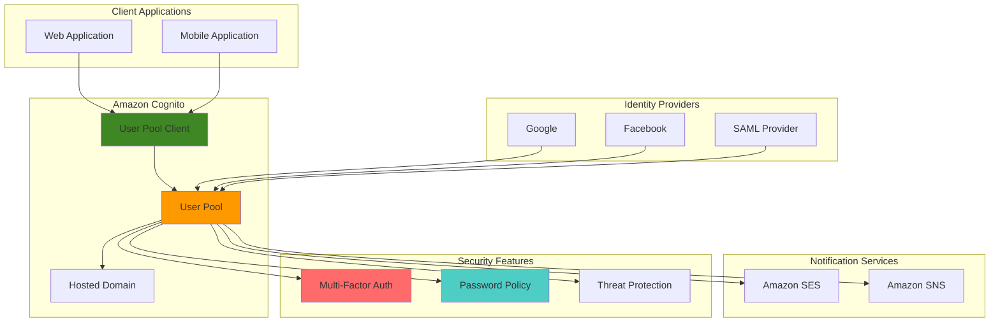

# Authenticating Users with Cognito User Pools

## Problem

E-commerce platforms and mobile applications struggle with implementing secure, scalable user authentication systems that support multiple sign-in methods, enforce strong password policies, and provide seamless user experience across web and mobile channels. Traditional authentication systems require significant development effort, security expertise, and ongoing maintenance to handle user registration, password resets, multi-factor authentication, and social identity provider integration while ensuring compliance with security best practices.

## Solution

Amazon Cognito User Pools provides a fully managed user directory service that handles user registration, authentication, and account management with built-in security features. This solution implements comprehensive user authentication with multi-factor authentication, social identity providers, custom password policies, and seamless integration with web and mobile applications through OpenID Connect and OAuth 2.0 standards.

## Architecture Diagram



## Prerequisites

1. AWS account with administrative permissions for Cognito, IAM, SES, and SNS
2. AWS CLI v2 installed and configured (or AWS CloudShell)
3. Basic understanding of authentication flows and OAuth 2.0
4. Domain name for custom authentication pages (optional)
5. Estimated cost: $10-20/month for moderate usage (first 50,000 MAUs free)

> **Note**: Amazon Cognito pricing is based on Monthly Active Users (MAUs). The first 50,000 MAUs are free each month, making it cost-effective for small to medium applications.

## Preparation

```bash
# Set environment variables
export AWS_REGION=$(aws configure get region)
export AWS_ACCOUNT_ID=$(aws sts get-caller-identity \
    --query Account --output text)

# Generate unique identifiers for resources
RANDOM_SUFFIX=$(aws secretsmanager get-random-password \
    --exclude-punctuation --exclude-uppercase \
    --password-length 6 --require-each-included-type \
    --output text --query RandomPassword)

export USER_POOL_NAME="ecommerce-users-${RANDOM_SUFFIX}"
export CLIENT_NAME="ecommerce-web-client-${RANDOM_SUFFIX}"
export DOMAIN_PREFIX="ecommerce-auth-${RANDOM_SUFFIX}"

echo "User Pool Name: $USER_POOL_NAME"
echo "Client Name: $CLIENT_NAME" 
echo "Domain Prefix: $DOMAIN_PREFIX"
```

## Steps

1. **Create User Pool with Security Policies**:

   Amazon Cognito User Pools serve as the foundation for user authentication and management in modern applications. By creating a user pool with comprehensive security policies, we establish a secure user directory that enforces strong password requirements, multi-factor authentication options, and device tracking. This configuration ensures that user accounts are protected against common security threats while maintaining flexibility for different authentication scenarios.

   ```bash
   # Create user pool with comprehensive configuration
   USER_POOL_ID=$(aws cognito-idp create-user-pool \
       --pool-name "$USER_POOL_NAME" \
       --policies '{
           "PasswordPolicy": {
               "MinimumLength": 12,
               "RequireUppercase": true,
               "RequireLowercase": true,
               "RequireNumbers": true,
               "RequireSymbols": true,
               "TemporaryPasswordValidityDays": 1
           }
       }' \
       --username-attributes email \
       --auto-verified-attributes email \
       --mfa-configuration OPTIONAL \
       --enabled-mfas SOFTWARE_TOKEN_MFA SMS_MFA \
       --device-configuration '{
           "ChallengeRequiredOnNewDevice": true,
           "DeviceOnlyRememberedOnUserPrompt": false
       }' \
       --admin-create-user-config '{
           "AllowAdminCreateUserOnly": false,
           "UnusedAccountValidityDays": 7
       }' \
       --user-attribute-update-settings '{
           "AttributesRequireVerificationBeforeUpdate": ["email"]
       }' \
       --verification-message-template '{
           "DefaultEmailOption": "CONFIRM_WITH_LINK",
           "EmailSubject": "Welcome to ECommerce - Verify Your Email",
           "EmailMessage": "Please click the link to verify your email: {##Verify Email##}",
           "EmailSubjectByLink": "Welcome to ECommerce - Verify Your Email",
           "EmailMessageByLink": "Please click the link to verify your email: {##Verify Email##}"
       }' \
       --query 'UserPool.Id' --output text)
   
   echo "✅ Created User Pool: $USER_POOL_ID"
   ```

   The user pool is now created with robust security policies including a 12-character minimum password length with complexity requirements, optional multi-factor authentication supporting both TOTP apps and SMS, and device tracking that challenges users on new devices. The email-based username configuration simplifies user registration while maintaining security through verification requirements.

2. **Configure Advanced Security Features**:

   Cognito's advanced security features provide automated threat detection and response capabilities that protect user accounts from compromise. These features leverage AWS's machine learning models to identify suspicious authentication patterns, compromised credentials, and potential account takeover attempts. By enabling these protections, the user pool gains enterprise-grade security without requiring custom implementation.

   ```bash
   # Enable advanced security features
   aws cognito-idp put-user-pool-add-ons \
       --user-pool-id "$USER_POOL_ID" \
       --user-pool-add-ons AdvancedSecurityMode=ENFORCED
   
   # Set up threat protection configuration
   aws cognito-idp set-risk-configuration \
       --user-pool-id "$USER_POOL_ID" \
       --compromised-credentials-risk-configuration '{
           "EventFilter": ["SIGN_IN", "PASSWORD_CHANGE", "SIGN_UP"],
           "Actions": {
               "EventAction": "BLOCK"
           }
       }' \
       --account-takeover-risk-configuration '{
           "NotifyConfiguration": {
               "From": "noreply@example.com",
               "Subject": "Security Alert for Your Account",
               "HtmlBody": "<p>We detected suspicious activity on your account.</p>",
               "TextBody": "We detected suspicious activity on your account."
           },
           "Actions": {
               "LowAction": {
                   "Notify": true,
                   "EventAction": "NO_ACTION"
               },
               "MediumAction": {
                   "Notify": true,
                   "EventAction": "MFA_IF_CONFIGURED"
               },
               "HighAction": {
                   "Notify": true,
                   "EventAction": "BLOCK"
               }
           }
       }'
   
   echo "✅ Enabled advanced security features"
   ```

   Advanced security is now actively monitoring all authentication events. The system will automatically block sign-in attempts using compromised credentials and implement risk-based authentication that adapts security requirements based on threat levels. Users will receive notifications about suspicious activities, enhancing account security transparency.

3. **Create User Pool Client with OAuth Configuration**:

   User pool clients serve as the bridge between applications and the Cognito user pool, defining how applications authenticate users and what information they can access. Configuring OAuth 2.0 flows and OpenID Connect scopes ensures compatibility with modern web frameworks and mobile SDKs while maintaining security through proper token management and callback URL restrictions.

   ```bash
   # Create user pool client with OAuth flows
   CLIENT_ID=$(aws cognito-idp create-user-pool-client \
       --user-pool-id "$USER_POOL_ID" \
       --client-name "$CLIENT_NAME" \
       --generate-secret \
       --refresh-token-validity 30 \
       --access-token-validity 60 \
       --id-token-validity 60 \
       --token-validity-units AccessToken=minutes,IdToken=minutes,RefreshToken=days \
       --read-attributes email,email_verified,name,family_name,given_name,phone_number \
       --write-attributes email,name,family_name,given_name,phone_number \
       --explicit-auth-flows ALLOW_USER_SRP_AUTH,ALLOW_REFRESH_TOKEN_AUTH,ALLOW_USER_PASSWORD_AUTH \
       --supported-identity-providers COGNITO \
       --callback-urls https://localhost:3000/callback,https://example.com/callback \
       --logout-urls https://localhost:3000/logout,https://example.com/logout \
       --allowed-o-auth-flows code,implicit \
       --allowed-o-auth-scopes openid,email,profile \
       --allowed-o-auth-flows-user-pool-client \
       --prevent-user-existence-errors ENABLED \
       --enable-token-revocation \
       --auth-session-validity 3 \
       --query 'UserPoolClient.ClientId' --output text)
   
   echo "✅ Created User Pool Client: $CLIENT_ID"
   ```

   The client configuration now supports both authorization code and implicit OAuth flows, enabling secure authentication for server-side and single-page applications. Token validity periods are optimized for security with short-lived access tokens (60 minutes) and longer refresh tokens (30 days), while token revocation support ensures compromised sessions can be immediately terminated.

4. **Set Up Hosted UI Domain**:

   The Cognito hosted UI provides a ready-to-use authentication interface that handles the complexity of user flows including sign-up, sign-in, password reset, and MFA enrollment. By establishing a custom domain prefix, applications can maintain brand consistency while leveraging AWS's secure, scalable authentication infrastructure without building custom UI components.

   ```bash
   # Create user pool domain for hosted UI
   aws cognito-idp create-user-pool-domain \
       --user-pool-id "$USER_POOL_ID" \
       --domain "$DOMAIN_PREFIX"
   
   # Wait for domain to be active
   aws cognito-idp describe-user-pool-domain \
       --domain "$DOMAIN_PREFIX" \
       --query 'DomainDescription.Status'
   
   echo "✅ Created hosted UI domain: https://${DOMAIN_PREFIX}.auth.${AWS_REGION}.amazoncognito.com"
   ```

   The hosted UI is now accessible at a unique URL that applications can redirect users to for authentication. This eliminates the need to implement complex authentication UI logic while ensuring compliance with security best practices and providing a responsive experience across devices.

5. **Configure Google Social Identity Provider**:

   Social identity provider integration enables users to authenticate using their existing accounts from popular platforms, reducing registration friction and password fatigue. Google authentication is particularly valuable for consumer applications as it provides a trusted, familiar sign-in option while Cognito handles the OAuth flow complexity and attribute mapping between Google profiles and user pool attributes.

   ```bash
   # Note: This requires Google OAuth credentials
   # For demo purposes, we'll show the command structure
   
   # Create Google identity provider (requires actual Google credentials)
   cat > google-idp-config.json << EOF
   {
       "UserPoolId": "$USER_POOL_ID",
       "ProviderName": "Google",
       "ProviderType": "Google",
       "ProviderDetails": {
           "client_id": "your-google-client-id.apps.googleusercontent.com",
           "client_secret": "your-google-client-secret",
           "authorize_scopes": "openid email profile"
       },
       "AttributeMapping": {
           "email": "email",
           "given_name": "given_name",
           "family_name": "family_name",
           "name": "name"
       }
   }
   EOF
   
   echo "✅ Google IDP configuration prepared (requires actual credentials)"
   ```

   This configuration template demonstrates how to map Google user attributes to Cognito user pool attributes, ensuring seamless data flow when users sign in with Google. In production, you would obtain OAuth credentials from the Google Developer Console and configure the redirect URIs to match your Cognito domain.

6. **Create User Groups for Role-Based Access**:

   User groups in Cognito enable role-based access control (RBAC) by organizing users into logical collections with different permission levels. This approach simplifies authorization logic in applications by allowing permission checks based on group membership rather than individual user attributes, supporting common patterns like admin/user separation and tiered customer access.

   ```bash
   # Create admin group
   aws cognito-idp create-group \
       --user-pool-id "$USER_POOL_ID" \
       --group-name "Administrators" \
       --description "Administrator users with full access" \
       --precedence 1
   
   # Create customer group
   aws cognito-idp create-group \
       --user-pool-id "$USER_POOL_ID" \
       --group-name "Customers" \
       --description "Regular customer users" \
       --precedence 10
   
   # Create premium customer group
   aws cognito-idp create-group \
       --user-pool-id "$USER_POOL_ID" \
       --group-name "PremiumCustomers" \
       --description "Premium customer users with enhanced features" \
       --precedence 5
   
   echo "✅ Created user groups for role-based access"
   ```

   The group hierarchy is established with precedence values that determine which group takes priority when users belong to multiple groups. Administrators have the highest precedence (1), followed by premium customers (5), and regular customers (10), enabling fine-grained access control in applications through JWT token claims.

7. **Configure Email and SMS Settings**:

   Reliable message delivery is crucial for authentication workflows including verification emails, password resets, and MFA codes. Integrating Amazon SES for email and SNS for SMS ensures high deliverability rates while providing detailed analytics and compliance with communication regulations. These services scale automatically to handle authentication traffic spikes during peak usage periods.

   ```bash
   # Configure SES for email delivery (requires verified SES domain)
   aws cognito-idp update-user-pool \
       --user-pool-id "$USER_POOL_ID" \
       --email-configuration EmailSendingAccount=DEVELOPER,SourceArn="arn:aws:ses:${AWS_REGION}:${AWS_ACCOUNT_ID}:identity/noreply@example.com",ReplyToEmailAddress="support@example.com"
   
   # Configure SNS for SMS delivery
   SNS_ROLE_ARN=$(aws iam get-role \
       --role-name CognitoSNSRole \
       --query 'Role.Arn' --output text 2>/dev/null || echo "")
   
   if [ -z "$SNS_ROLE_ARN" ]; then
       # Create SNS role for Cognito
       aws iam create-role \
           --role-name CognitoSNSRole \
           --assume-role-policy-document '{
               "Version": "2012-10-17",
               "Statement": [{
                   "Effect": "Allow",
                   "Principal": {"Service": "cognito-idp.amazonaws.com"},
                   "Action": "sts:AssumeRole"
               }]
           }'
       
       aws iam attach-role-policy \
           --role-name CognitoSNSRole \
           --policy-arn "arn:aws:iam::aws:policy/AmazonSNSFullAccess"
       
       SNS_ROLE_ARN=$(aws iam get-role \
           --role-name CognitoSNSRole \
           --query 'Role.Arn' --output text)
   fi
   
   # Update user pool with SNS configuration
   aws cognito-idp update-user-pool \
       --user-pool-id "$USER_POOL_ID" \
       --sms-configuration SnsCallerArn="$SNS_ROLE_ARN",ExternalId="cognito-${USER_POOL_ID}"
   
   echo "✅ Configured email and SMS delivery settings"
   ```

   The messaging configuration now supports both email and SMS channels with proper IAM permissions. The SES integration enables custom email templates and sender addresses while SNS handles global SMS delivery with automatic failover and delivery tracking, ensuring users receive critical authentication messages reliably.

8. **Create Test Users and Enable MFA**:

   Creating test users with different group memberships allows immediate validation of the authentication system and role-based access controls. By programmatically creating users with temporary passwords and group assignments, we can verify the complete authentication flow including password policies, group-based permissions, and multi-factor authentication enrollment.

   ```bash
   # Create admin test user
   aws cognito-idp admin-create-user \
       --user-pool-id "$USER_POOL_ID" \
       --username "admin@example.com" \
       --user-attributes Name=email,Value=admin@example.com Name=name,Value="Admin User" Name=given_name,Value="Admin" Name=family_name,Value="User" \
       --message-action SUPPRESS \
       --temporary-password "TempPass123!"
   
   # Add admin user to Administrators group
   aws cognito-idp admin-add-user-to-group \
       --user-pool-id "$USER_POOL_ID" \
       --username "admin@example.com" \
       --group-name "Administrators"
   
   # Create customer test user
   aws cognito-idp admin-create-user \
       --user-pool-id "$USER_POOL_ID" \
       --username "customer@example.com" \
       --user-attributes Name=email,Value=customer@example.com Name=name,Value="Customer User" Name=given_name,Value="Customer" Name=family_name,Value="User" \
       --message-action SUPPRESS \
       --temporary-password "TempPass123!"
   
   # Add customer user to Customers group
   aws cognito-idp admin-add-user-to-group \
       --user-pool-id "$USER_POOL_ID" \
       --username "customer@example.com" \
       --group-name "Customers"
   
   echo "✅ Created test users and assigned to groups"
   ```

   Test users are now provisioned with appropriate group memberships and temporary passwords. The message suppression prevents automatic emails during testing, while the group assignments demonstrate how JWT tokens will include group claims that applications can use for authorization decisions.

9. **Configure Custom Attributes**:

   Custom attributes extend the user profile schema to support business-specific data requirements without maintaining a separate user database. These attributes can store subscription tiers, preferences, or metadata that applications need for personalization and business logic. The custom attributes are included in ID tokens for seamless application access.

   ```bash
   # Add custom attributes for business logic
   aws cognito-idp add-custom-attributes \
       --user-pool-id "$USER_POOL_ID" \
       --custom-attributes \
           Name="customer_tier",AttributeDataType="String",DeveloperOnlyAttribute=false,Required=false,StringAttributeConstraints="{MinLength=1,MaxLength=20}" \
           Name="last_login",AttributeDataType="DateTime",DeveloperOnlyAttribute=false,Required=false \
           Name="subscription_status",AttributeDataType="String",DeveloperOnlyAttribute=false,Required=false,StringAttributeConstraints="{MinLength=1,MaxLength=50}"
   
   echo "✅ Added custom attributes for business logic"
   ```

   The user pool schema now includes business-specific attributes that applications can read and write through the Cognito API. These attributes are included in ID tokens, enabling client applications to access user metadata without additional API calls, improving performance and reducing latency in user experiences.

10. **Generate Client Credentials and Configuration**:

    Providing applications with properly formatted configuration ensures smooth integration with the authentication system. By generating a configuration file with all necessary endpoints and credentials, development teams can quickly implement authentication without manually constructing URLs or searching for resource identifiers, reducing integration errors and accelerating deployment.

    ```bash
    # Get client secret for server-side applications
    CLIENT_SECRET=$(aws cognito-idp describe-user-pool-client \
        --user-pool-id "$USER_POOL_ID" \
        --client-id "$CLIENT_ID" \
        --query 'UserPoolClient.ClientSecret' --output text)
    
    # Create configuration file for applications
    cat > cognito-config.json << EOF
    {
        "UserPoolId": "$USER_POOL_ID",
        "ClientId": "$CLIENT_ID",
        "ClientSecret": "$CLIENT_SECRET",
        "Region": "$AWS_REGION",
        "HostedUIUrl": "https://${DOMAIN_PREFIX}.auth.${AWS_REGION}.amazoncognito.com",
        "LoginUrl": "https://${DOMAIN_PREFIX}.auth.${AWS_REGION}.amazoncognito.com/login?client_id=${CLIENT_ID}&response_type=code&scope=openid+email+profile&redirect_uri=https://localhost:3000/callback",
        "LogoutUrl": "https://${DOMAIN_PREFIX}.auth.${AWS_REGION}.amazoncognito.com/logout?client_id=${CLIENT_ID}&logout_uri=https://localhost:3000/logout"
    }
    EOF
    
    echo "✅ Generated client configuration file: cognito-config.json"
    ```

    The configuration file contains all endpoints and credentials needed for application integration, including pre-constructed OAuth URLs with proper parameters. Development teams can use this configuration directly in their applications, ensuring consistent authentication implementation across different environments and platforms.

## Validation & Testing

1. **Verify User Pool Configuration**:

   ```bash
   # Check user pool details
   aws cognito-idp describe-user-pool \
       --user-pool-id "$USER_POOL_ID" \
       --query '{
           Name: UserPool.Name,
           Id: UserPool.Id,
           MfaConfiguration: UserPool.MfaConfiguration,
           PasswordPolicy: UserPool.Policies.PasswordPolicy,
           AutoVerifiedAttributes: UserPool.AutoVerifiedAttributes
       }'
   ```

   Expected output: Shows user pool with MFA enabled and strong password policy.

2. **Test User Authentication Flow**:

   ```bash
   # Initiate authentication for test user
   CHALLENGE_RESPONSE=$(aws cognito-idp admin-initiate-auth \
       --user-pool-id "$USER_POOL_ID" \
       --client-id "$CLIENT_ID" \
       --auth-flow ADMIN_NO_SRP_AUTH \
       --auth-parameters USERNAME=admin@example.com,PASSWORD="TempPass123!" \
       --query 'ChallengeName' --output text)
   
   echo "Challenge Required: $CHALLENGE_RESPONSE"
   ```

3. **Verify User Groups and Permissions**:

   ```bash
   # List users in each group
   aws cognito-idp list-users-in-group \
       --user-pool-id "$USER_POOL_ID" \
       --group-name "Administrators" \
       --query 'Users[].Username'
   
   aws cognito-idp list-users-in-group \
       --user-pool-id "$USER_POOL_ID" \
       --group-name "Customers" \
       --query 'Users[].Username'
   ```

4. **Test Hosted UI Access**:

   ```bash
   # Display hosted UI URLs for manual testing
   echo "Login URL: https://${DOMAIN_PREFIX}.auth.${AWS_REGION}.amazoncognito.com/login?client_id=${CLIENT_ID}&response_type=code&scope=openid+email+profile&redirect_uri=https://localhost:3000/callback"
   echo "Test credentials - Username: admin@example.com, Password: TempPass123!"
   ```

## Cleanup

1. **Remove User Pool Domain**:

   ```bash
   # Delete hosted UI domain
   aws cognito-idp delete-user-pool-domain \
       --domain "$DOMAIN_PREFIX"
   
   echo "✅ Deleted user pool domain"
   ```

2. **Delete User Pool Client**:

   ```bash
   # Delete user pool client
   aws cognito-idp delete-user-pool-client \
       --user-pool-id "$USER_POOL_ID" \
       --client-id "$CLIENT_ID"
   
   echo "✅ Deleted user pool client"
   ```

3. **Remove IAM Role for SNS**:

   ```bash
   # Detach policy and delete IAM role
   aws iam detach-role-policy \
       --role-name CognitoSNSRole \
       --policy-arn "arn:aws:iam::aws:policy/AmazonSNSFullAccess"
   
   aws iam delete-role --role-name CognitoSNSRole
   
   echo "✅ Deleted SNS IAM role"
   ```

4. **Delete User Pool**:

   ```bash
   # Delete user pool (this removes all users and groups)
   aws cognito-idp delete-user-pool \
       --user-pool-id "$USER_POOL_ID"
   
   echo "✅ Deleted user pool and all associated resources"
   ```

5. **Clean up local files**:

   ```bash
   # Remove configuration files
   rm -f cognito-config.json google-idp-config.json
   
   # Clear environment variables
   unset USER_POOL_NAME CLIENT_NAME DOMAIN_PREFIX USER_POOL_ID CLIENT_ID
   
   echo "✅ Cleaned up local configuration files"
   ```

## Discussion

Amazon Cognito User Pools provides a comprehensive authentication solution that eliminates the complexity of building secure user management systems from scratch. The implementation demonstrates several key architectural decisions that enhance security and user experience while following AWS Well-Architected Framework principles.

The password policy configuration enforces strong authentication credentials with minimum length requirements, character complexity, and limited temporary password validity. Multi-factor authentication support through both software tokens (TOTP) and SMS provides layered security, while the device tracking capabilities help detect suspicious sign-in attempts from new devices. The advanced security features, including adaptive authentication and compromised credential detection, automatically respond to potential threats without requiring manual intervention.

Social identity provider integration enables users to sign in with existing accounts from Google, Facebook, or enterprise SAML providers, reducing registration friction while maintaining security. The OAuth 2.0 and OpenID Connect compliance ensures compatibility with modern web and mobile applications, while the hosted UI provides a customizable authentication experience that reduces development effort. According to the [AWS Cognito User Pools documentation](https://docs.aws.amazon.com/cognito/latest/developerguide/cognito-user-pools.html), user pools can scale to hundreds of millions of users with consistent performance and availability.

The user group implementation supports role-based access control, allowing applications to implement fine-grained permissions based on user membership. Custom attributes enable storing business-specific user data directly within the user pool, eliminating the need for separate user profile databases while maintaining data integrity and security compliance.

> **Tip**: Use Lambda triggers to customize authentication flows, automatically assign users to groups based on email domains, or integrate with external systems during sign-up and sign-in processes. The [AWS Cognito Lambda triggers documentation](https://docs.aws.amazon.com/cognito/latest/developerguide/cognito-user-pools-working-with-lambda-triggers.html) provides comprehensive guidance for extending Cognito functionality.

## Challenge

Extend this authentication solution by implementing these enhancements:

1. **Lambda Trigger Integration**: Create pre-sign-up and post-confirmation Lambda functions to automatically assign user groups based on email domain and send welcome emails through SES
2. **Custom Authentication Flow**: Implement a challenge-based authentication flow using Lambda triggers for additional security requirements like security questions or device fingerprinting
3. **SAML Enterprise Integration**: Configure SAML 2.0 identity provider integration with Active Directory Federation Services (ADFS) or Okta for enterprise single sign-on
4. **API Gateway Integration**: Build a serverless API using API Gateway with Cognito authorizers to demonstrate token-based API access control with user pool groups
5. **Cross-Region User Pool Replication**: Implement a disaster recovery strategy using Lambda functions to replicate user data and configurations across multiple AWS regions

## Infrastructure Code

### Available Infrastructure as Code:

- [Infrastructure Code Overview](code/README.md) - Detailed description of all infrastructure components
- [AWS CDK (Python)](code/cdk-python/) - AWS CDK Python implementation
- [AWS CDK (TypeScript)](code/cdk-typescript/) - AWS CDK TypeScript implementation
- [CloudFormation](code/cloudformation.yaml) - AWS CloudFormation template
- [Bash CLI Scripts](code/scripts/) - Example bash scripts using AWS CLI commands to deploy infrastructure
- [Terraform](code/terraform/) - Terraform configuration files