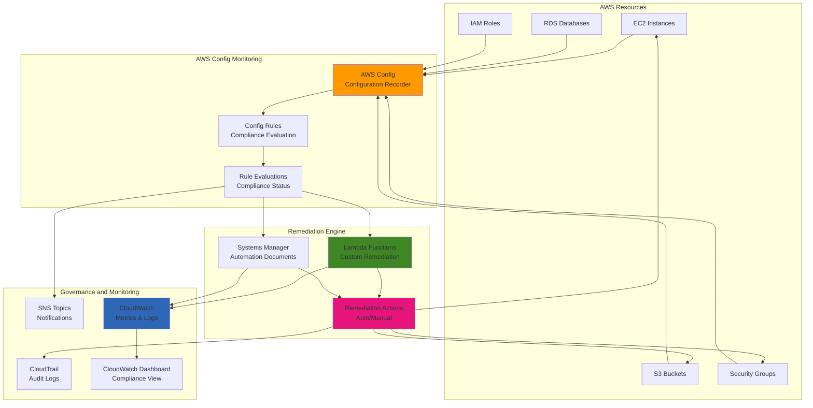

# Auto-Remediation with Config and Lambda

## Problem

Your organization needs to maintain compliance across hundreds or thousands of AWS resources, but manual remediation of configuration drift and policy violations is time-consuming, error-prone, and doesn't scale. Security and compliance teams struggle to keep up with the constant changes in cloud infrastructure, leading to prolonged exposure to security risks and compliance violations. You need a solution that can automatically detect configuration issues, evaluate compliance against organizational policies, and remediate violations without human intervention while maintaining audit trails and governance controls.

## Solution

Implement automated compliance remediation using AWS Config for continuous monitoring and evaluation, combined with AWS Lambda functions for custom remediation actions and AWS Systems Manager for standardized automation. This solution provides real-time compliance monitoring, automatic remediation of common violations, customizable rules for organization-specific requirements, and comprehensive audit trails. The architecture includes escalation procedures for complex issues, cost optimization through targeted remediation, and integration with existing security and governance workflows.

## Architecture Diagram



## Prerequisites

1. AWS account with permissions for Config, Lambda, Systems Manager, and IAM
2. AWS CLI v2 installed and configured with appropriate credentials
3. Understanding of AWS Config rules and compliance concepts
4. Basic knowledge of Lambda functions and Systems Manager automation
5. Estimated cost: $30-100/month depending on resource count and rule evaluations

> **Note**: AWS Config charges for configuration items recorded and rule evaluations. Monitor usage and optimize rules to control costs while maintaining compliance coverage. See the [AWS Config pricing documentation](https://aws.amazon.com/config/pricing/) for detailed cost information.

## Preparation

```bash
# Set environment variables
export AWS_REGION=$(aws configure get region)
export AWS_ACCOUNT_ID=$(aws sts get-caller-identity \
    --query Account --output text)

# Generate unique identifiers for resources
RANDOM_SUFFIX=$(aws secretsmanager get-random-password \
    --exclude-punctuation --exclude-uppercase \
    --password-length 6 --require-each-included-type \
    --output text --query RandomPassword)

export CONFIG_ROLE_NAME="AWSConfigRole-${RANDOM_SUFFIX}"
export LAMBDA_ROLE_NAME="ConfigRemediationRole-${RANDOM_SUFFIX}"
export S3_BUCKET_NAME="aws-config-bucket-${RANDOM_SUFFIX}"
export SNS_TOPIC_NAME="config-compliance-alerts-${RANDOM_SUFFIX}"

echo "✅ Environment prepared"
echo "Config Role: ${CONFIG_ROLE_NAME}"
echo "Lambda Role: ${LAMBDA_ROLE_NAME}"
echo "S3 Bucket: ${S3_BUCKET_NAME}"
```

## Steps

1. **Set up AWS Config with configuration recorder**:

   AWS Config serves as the foundation of our compliance monitoring system by providing continuous tracking of resource configurations and changes. The configuration recorder captures detailed snapshots of AWS resources, enabling compliance evaluation against organizational policies. This step establishes the core monitoring infrastructure that will detect configuration drift and trigger remediation workflows when violations occur.

   ```bash
   # Create S3 bucket for Config
   aws s3 mb s3://${S3_BUCKET_NAME} --region ${AWS_REGION}
   
   # Create bucket policy for AWS Config
   cat > config-bucket-policy.json << EOF
   {
       "Version": "2012-10-17",
       "Statement": [
           {
               "Sid": "AWSConfigBucketPermissionsCheck",
               "Effect": "Allow",
               "Principal": {
                   "Service": "config.amazonaws.com"
               },
               "Action": "s3:GetBucketAcl",
               "Resource": "arn:aws:s3:::${S3_BUCKET_NAME}",
               "Condition": {
                   "StringEquals": {
                       "AWS:SourceAccount": "${AWS_ACCOUNT_ID}"
                   }
               }
           },
           {
               "Sid": "AWSConfigBucketExistenceCheck",
               "Effect": "Allow",
               "Principal": {
                   "Service": "config.amazonaws.com"
               },
               "Action": "s3:ListBucket",
               "Resource": "arn:aws:s3:::${S3_BUCKET_NAME}",
               "Condition": {
                   "StringEquals": {
                       "AWS:SourceAccount": "${AWS_ACCOUNT_ID}"
                   }
               }
           },
           {
               "Sid": "AWSConfigBucketDelivery",
               "Effect": "Allow",
               "Principal": {
                   "Service": "config.amazonaws.com"
               },
               "Action": "s3:PutObject",
               "Resource": "arn:aws:s3:::${S3_BUCKET_NAME}/AWSLogs/${AWS_ACCOUNT_ID}/Config/*",
               "Condition": {
                   "StringEquals": {
                       "s3:x-amz-acl": "bucket-owner-full-control",
                       "AWS:SourceAccount": "${AWS_ACCOUNT_ID}"
                   }
               }
           }
       ]
   }
   EOF
   
   aws s3api put-bucket-policy \
       --bucket ${S3_BUCKET_NAME} \
       --policy file://config-bucket-policy.json
   
   # Create IAM role for AWS Config
   cat > config-trust-policy.json << EOF
   {
       "Version": "2012-10-17",
       "Statement": [
           {
               "Effect": "Allow",
               "Principal": {
                   "Service": "config.amazonaws.com"
               },
               "Action": "sts:AssumeRole"
           }
       ]
   }
   EOF
   
   aws iam create-role \
       --role-name ${CONFIG_ROLE_NAME} \
       --assume-role-policy-document file://config-trust-policy.json
   
   # Attach AWS managed policy for Config
   aws iam attach-role-policy \
       --role-name ${CONFIG_ROLE_NAME} \
       --policy-arn arn:aws:iam::aws:policy/service-role/ConfigRole
   
   # Get Config role ARN
   CONFIG_ROLE_ARN=$(aws iam get-role \
       --role-name ${CONFIG_ROLE_NAME} \
       --query 'Role.Arn' --output text)
   
   # Create configuration recorder
   aws configservice put-configuration-recorder \
       --configuration-recorder '{
           "name": "default",
           "roleARN": "'${CONFIG_ROLE_ARN}'",
           "recordingGroup": {
               "allSupported": true,
               "includeGlobalResourceTypes": true
           }
       }'
   
   # Create delivery channel
   aws configservice put-delivery-channel \
       --delivery-channel '{
           "name": "default",
           "s3BucketName": "'${S3_BUCKET_NAME}'"
       }'
   
   # Start configuration recorder
   aws configservice start-configuration-recorder \
       --configuration-recorder-name default
   
   echo "✅ Set up AWS Config with configuration recorder"
   ```

   AWS Config is now actively monitoring all supported resource types across your account, providing the continuous visibility required for automated compliance. The configuration recorder captures resource configurations in near real-time, while the delivery channel ensures all configuration data is stored securely in S3 for audit trails and historical analysis. This foundation enables immediate detection of policy violations and provides the trigger mechanism for our remediation workflows.

2. **Create Lambda function for security group remediation**:

   Lambda functions provide the serverless compute foundation for custom remediation logic, enabling automated responses to compliance violations without managing infrastructure. The principle of least privilege is critical for remediation functions - they need precisely the permissions required to correct violations while maintaining security boundaries. IAM roles with carefully scoped policies ensure that remediation actions are both effective and secure.

   ```bash
   # Create IAM role for Lambda remediation functions
   cat > lambda-trust-policy.json << EOF
   {
       "Version": "2012-10-17",
       "Statement": [
           {
               "Effect": "Allow",
               "Principal": {
                   "Service": "lambda.amazonaws.com"
               },
               "Action": "sts:AssumeRole"
           }
       ]
   }
   EOF
   
   aws iam create-role \
       --role-name ${LAMBDA_ROLE_NAME} \
       --assume-role-policy-document file://lambda-trust-policy.json
   
   # Create policy for Lambda remediation functions
   cat > lambda-remediation-policy.json << EOF
   {
       "Version": "2012-10-17",
       "Statement": [
           {
               "Effect": "Allow",
               "Action": [
                   "logs:CreateLogGroup",
                   "logs:CreateLogStream",
                   "logs:PutLogEvents"
               ],
               "Resource": "*"
           },
           {
               "Effect": "Allow",
               "Action": [
                   "ec2:DescribeSecurityGroups",
                   "ec2:AuthorizeSecurityGroupIngress",
                   "ec2:RevokeSecurityGroupIngress",
                   "ec2:AuthorizeSecurityGroupEgress",
                   "ec2:RevokeSecurityGroupEgress",
                   "ec2:CreateTags"
               ],
               "Resource": "*"
           },
           {
               "Effect": "Allow",
               "Action": [
                   "s3:GetBucketAcl",
                   "s3:GetBucketPolicy",
                   "s3:PutBucketAcl",
                   "s3:PutBucketPolicy",
                   "s3:DeleteBucketPolicy",
                   "s3:PutPublicAccessBlock"
               ],
               "Resource": "*"
           },
           {
               "Effect": "Allow",
               "Action": [
                   "config:PutEvaluations"
               ],
               "Resource": "*"
           },
           {
               "Effect": "Allow",
               "Action": [
                   "sns:Publish"
               ],
               "Resource": "*"
           }
       ]
   }
   EOF
   
   aws iam create-policy \
       --policy-name "${LAMBDA_ROLE_NAME}-Policy" \
       --policy-document file://lambda-remediation-policy.json
   
   LAMBDA_POLICY_ARN=$(aws iam list-policies \
       --query "Policies[?PolicyName=='${LAMBDA_ROLE_NAME}-Policy'].Arn" \
       --output text)
   
   aws iam attach-role-policy \
       --role-name ${LAMBDA_ROLE_NAME} \
       --policy-arn ${LAMBDA_POLICY_ARN}
   
   # Get Lambda role ARN
   LAMBDA_ROLE_ARN=$(aws iam get-role \
       --role-name ${LAMBDA_ROLE_NAME} \
       --query 'Role.Arn' --output text)
   
   echo "✅ Created IAM roles for Config and Lambda"
   ```

   The IAM roles are now established with least-privilege permissions following AWS security best practices. The Config service role enables continuous monitoring across all resource types, while the Lambda execution role provides targeted permissions for security group remediation and notification publishing. These roles form the security foundation that enables automated remediation while maintaining proper access controls and audit trails.

3. **Create Lambda function to remediate open security groups**:

   Security groups control network access to AWS resources and represent one of the most critical security controls in cloud infrastructure. Unrestricted inbound access (0.0.0.0/0) creates significant security vulnerabilities by exposing resources to the entire internet. This Lambda function implements intelligent remediation logic that automatically removes dangerous rules while preserving legitimate access patterns, reducing security exposure from hours or days to minutes.

   ```bash
   # Create security group remediation function
   cat > sg-remediation-function.py << 'EOF'
   import json
   import boto3
   import logging
   import os
   from datetime import datetime
   from botocore.exceptions import ClientError
   
   logger = logging.getLogger()
   logger.setLevel(logging.INFO)
   
   ec2 = boto3.client('ec2')
   sns = boto3.client('sns')
   
   def lambda_handler(event, context):
       """
       Remediate security groups that allow unrestricted access (0.0.0.0/0)
       """
       
       try:
           # Parse the Config rule evaluation
           config_item = event['configurationItem']
           resource_id = config_item['resourceId']
           resource_type = config_item['resourceType']
           
           logger.info(f"Processing remediation for {resource_type}: {resource_id}")
           
           if resource_type != 'AWS::EC2::SecurityGroup':
               return {
                   'statusCode': 400,
                   'body': json.dumps('This function only handles Security Groups')
               }
           
           # Get security group details
           response = ec2.describe_security_groups(GroupIds=[resource_id])
           security_group = response['SecurityGroups'][0]
           
           remediation_actions = []
           
           # Check inbound rules for unrestricted access
           for rule in security_group['IpPermissions']:
               for ip_range in rule.get('IpRanges', []):
                   if ip_range.get('CidrIp') == '0.0.0.0/0':
                       # Remove unrestricted inbound rule
                       try:
                           ec2.revoke_security_group_ingress(
                               GroupId=resource_id,
                               IpPermissions=[rule]
                           )
                           remediation_actions.append(f"Removed unrestricted inbound rule: {rule}")
                           logger.info(f"Removed unrestricted inbound rule from {resource_id}")
                       except ClientError as e:
                           logger.error(f"Failed to remove inbound rule: {e}")
           
           # Add tag to indicate remediation
           ec2.create_tags(
               Resources=[resource_id],
               Tags=[
                   {
                       'Key': 'AutoRemediated',
                       'Value': 'true'
                   },
                   {
                       'Key': 'RemediationDate',
                       'Value': datetime.now().isoformat()
                   }
               ]
           )
           
           # Send notification if remediation occurred
           if remediation_actions:
               message = {
                   'resource_id': resource_id,
                   'resource_type': resource_type,
                   'remediation_actions': remediation_actions,
                   'timestamp': datetime.now().isoformat()
               }
               
               # Publish to SNS topic (if configured)
               topic_arn = os.environ.get('SNS_TOPIC_ARN')
               if topic_arn:
                   sns.publish(
                       TopicArn=topic_arn,
                       Subject=f'Security Group Auto-Remediation: {resource_id}',
                       Message=json.dumps(message, indent=2)
                   )
           
           return {
               'statusCode': 200,
               'body': json.dumps({
                   'message': 'Remediation completed',
                   'resource_id': resource_id,
                   'actions_taken': len(remediation_actions)
               })
           }
           
       except Exception as e:
           logger.error(f"Error in remediation: {e}")
           return {
               'statusCode': 500,
               'body': json.dumps(f'Error: {str(e)}')
           }
   EOF
   
   # Create deployment package
   zip sg-remediation-function.zip sg-remediation-function.py
   
   # Create Lambda function
   aws lambda create-function \
       --function-name "SecurityGroupRemediation-${RANDOM_SUFFIX}" \
       --runtime python3.12 \
       --role ${LAMBDA_ROLE_ARN} \
       --handler sg-remediation-function.lambda_handler \
       --zip-file fileb://sg-remediation-function.zip \
       --timeout 60 \
       --description "Auto-remediate security groups with unrestricted access"
   
   SG_LAMBDA_ARN=$(aws lambda get-function \
       --function-name "SecurityGroupRemediation-${RANDOM_SUFFIX}" \
       --query 'Configuration.FunctionArn' --output text)
   
   echo "✅ Created security group remediation Lambda function"
   echo "Function ARN: ${SG_LAMBDA_ARN}"
   ```

   The remediation function is now deployed and ready to respond to Config rule violations. The function implements comprehensive error handling, detailed logging, and notification capabilities to ensure transparency in all remediation actions. By automatically tagging remediated resources and publishing notifications, the function maintains audit trails while enabling rapid response to security violations that could otherwise expose critical infrastructure to attack.

4. **Create Config rules with auto-remediation**:

   Config rules define the compliance policies that your organization requires, automatically evaluating resource configurations against security and operational standards. AWS provides pre-built managed rules for common compliance requirements, eliminating the need to develop custom evaluation logic for standard security controls. These rules continuously monitor your environment and trigger compliance evaluations whenever resource configurations change.

   ```bash
   # Create Config rule for security groups with unrestricted access
   aws configservice put-config-rule \
       --config-rule '{
           "ConfigRuleName": "security-group-ssh-restricted",
           "Description": "Checks if security groups allow unrestricted SSH access",
           "Source": {
               "Owner": "AWS",
               "SourceIdentifier": "INCOMING_SSH_DISABLED"
           },
           "Scope": {
               "ComplianceResourceTypes": [
                   "AWS::EC2::SecurityGroup"
               ]
           }
       }'
   
   # Create Config rule for S3 bucket public access
   aws configservice put-config-rule \
       --config-rule '{
           "ConfigRuleName": "s3-bucket-public-access-prohibited",
           "Description": "Checks if S3 buckets allow public access",
           "Source": {
               "Owner": "AWS",
               "SourceIdentifier": "S3_BUCKET_PUBLIC_ACCESS_PROHIBITED"
           },
           "Scope": {
               "ComplianceResourceTypes": [
                   "AWS::S3::Bucket"
               ]
           }
       }'
   
   # Wait for rules to be created
   sleep 30
   
   echo "✅ Created Config rules for compliance monitoring"
   ```

   The Config rules are now actively evaluating resource compliance across your account, providing real-time assessment of security posture. These rules serve as the detection layer that identifies violations and initiates remediation workflows. The continuous evaluation ensures that compliance drift is detected immediately, enabling rapid response before security vulnerabilities can be exploited or compliance violations accumulate.

5. **Set up auto-remediation configuration**:

   Auto-remediation configuration connects compliance detection with automated corrective actions, creating a complete closed-loop system for maintaining security posture. Systems Manager automation documents provide standardized, repeatable remediation procedures that can be executed consistently across environments. SNS integration ensures that all remediation actions are transparent and traceable, supporting audit requirements and operational awareness.

   ```bash
   # Create SNS topic for notifications
   SNS_TOPIC_ARN=$(aws sns create-topic \
       --name ${SNS_TOPIC_NAME} \
       --query 'TopicArn' --output text)
   
   # Update Lambda function with SNS topic ARN
   aws lambda update-function-configuration \
       --function-name "SecurityGroupRemediation-${RANDOM_SUFFIX}" \
       --environment Variables="{SNS_TOPIC_ARN=${SNS_TOPIC_ARN}}"
   
   # Create Systems Manager automation document for S3 remediation
   cat > s3-remediation-document.json << EOF
   {
       "schemaVersion": "0.3",
       "description": "Remediate S3 bucket public access",
       "assumeRole": "${LAMBDA_ROLE_ARN}",
       "parameters": {
           "BucketName": {
               "type": "String",
               "description": "Name of the S3 bucket to remediate"
           }
       },
       "mainSteps": [
           {
               "name": "RemediateS3PublicAccess",
               "action": "aws:executeAwsApi",
               "inputs": {
                   "Service": "s3",
                   "Api": "PutPublicAccessBlock",
                   "BucketName": "{{ BucketName }}",
                   "PublicAccessBlockConfiguration": {
                       "BlockPublicAcls": true,
                       "IgnorePublicAcls": true,
                       "BlockPublicPolicy": true,
                       "RestrictPublicBuckets": true
                   }
               }
           }
       ]
   }
   EOF
   
   # Create SSM document
   aws ssm create-document \
       --name "S3-RemediatePublicAccess-${RANDOM_SUFFIX}" \
       --document-type "Automation" \
       --document-format JSON \
       --content file://s3-remediation-document.json
   
   # Set up auto-remediation for security group rule
   aws configservice put-remediation-configurations \
       --remediation-configurations '[
           {
               "ConfigRuleName": "security-group-ssh-restricted",
               "TargetType": "SSM_DOCUMENT",
               "TargetId": "AWSConfigRemediation-RemoveUnrestrictedSourceInSecurityGroup",
               "TargetVersion": "1",
               "Parameters": {
                   "AutomationAssumeRole": {
                       "StaticValue": {
                           "Values": ["'${LAMBDA_ROLE_ARN}'"]
                       }
                   },
                   "GroupId": {
                       "ResourceValue": {
                           "Value": "RESOURCE_ID"
                       }
                   }
               },
               "Automatic": true,
               "MaximumAutomaticAttempts": 3
           }
       ]'
   
   echo "✅ Configured auto-remediation for Config rules"
   ```

   The auto-remediation system is now fully operational, creating a self-healing infrastructure that automatically corrects compliance violations. The integration between Config rules, Systems Manager automation, and Lambda functions provides multiple remediation pathways depending on the complexity and risk level of violations. This automated approach reduces mean time to remediation from hours or days to minutes while maintaining comprehensive audit trails for compliance reporting.

6. **Create CloudWatch dashboard for compliance monitoring**:

   Operational visibility is essential for managing automated compliance systems, providing real-time insights into system health, remediation effectiveness, and compliance trends. CloudWatch dashboards consolidate metrics from Config, Lambda, and other services into unified views that enable proactive monitoring and rapid troubleshooting. This observability ensures that automated systems continue operating effectively and that compliance objectives are being met consistently.

   ```bash
   # Create CloudWatch dashboard
   cat > compliance-dashboard.json << EOF
   {
       "widgets": [
           {
               "type": "metric",
               "x": 0,
               "y": 0,
               "width": 12,
               "height": 6,
               "properties": {
                   "metrics": [
                       [ "AWS/Config", "ComplianceByConfigRule", "ConfigRuleName", "security-group-ssh-restricted", "ComplianceType", "COMPLIANT" ],
                       [ "...", "NON_COMPLIANT" ],
                       [ "...", "s3-bucket-public-access-prohibited", ".", "COMPLIANT" ],
                       [ "...", "NON_COMPLIANT" ]
                   ],
                   "period": 300,
                   "stat": "Maximum",
                   "region": "${AWS_REGION}",
                   "title": "Config Rule Compliance Status"
               }
           },
           {
               "type": "metric",
               "x": 0,
               "y": 6,
               "width": 12,
               "height": 6,
               "properties": {
                   "metrics": [
                       [ "AWS/Lambda", "Invocations", "FunctionName", "SecurityGroupRemediation-${RANDOM_SUFFIX}" ],
                       [ ".", "Errors", ".", "." ],
                       [ ".", "Duration", ".", "." ]
                   ],
                   "period": 300,
                   "stat": "Sum",
                   "region": "${AWS_REGION}",
                   "title": "Remediation Function Metrics"
               }
           }
       ]
   }
   EOF
   
   # Create dashboard
   aws cloudwatch put-dashboard \
       --dashboard-name "Config-Compliance-Dashboard-${RANDOM_SUFFIX}" \
       --dashboard-body file://compliance-dashboard.json
   
   echo "✅ Created CloudWatch dashboard for compliance monitoring"
   ```

   The compliance dashboard provides comprehensive visibility into your automated remediation system, enabling proactive monitoring of compliance status and remediation effectiveness. Real-time metrics help identify trends, detect system issues, and demonstrate compliance posture to stakeholders. This operational foundation ensures that your self-healing infrastructure continues operating optimally while providing the transparency required for effective governance and audit processes.

## Validation & Testing

1. **Verify Config setup and rule evaluation**:

   ```bash
   # Check Config recorder status
   aws configservice describe-configuration-recorders \
       --query 'ConfigurationRecorders[*].[name,recordingGroup.allSupported]'
   
   # Check Config rules
   aws configservice describe-config-rules \
       --query 'ConfigRules[*].[ConfigRuleName,ConfigRuleState]' \
       --output table
   
   # Get compliance summary
   aws configservice get-compliance-summary-by-config-rule \
       --query 'ComplianceSummary'
   ```

   Expected output: Configuration recorder should show "default" with allSupported as true, Config rules should be in "ACTIVE" state, and compliance summary should show evaluation counts.

2. **Test remediation by creating non-compliant resource**:

   ```bash
   # Create a test security group with unrestricted SSH access
   TEST_SG_ID=$(aws ec2 create-security-group \
       --group-name "test-sg-${RANDOM_SUFFIX}" \
       --description "Test security group for Config remediation" \
       --query 'GroupId' --output text)
   
   # Add unrestricted SSH rule
   aws ec2 authorize-security-group-ingress \
       --group-id ${TEST_SG_ID} \
       --protocol tcp \
       --port 22 \
       --cidr 0.0.0.0/0
   
   echo "Created test security group: ${TEST_SG_ID}"
   echo "Waiting for Config evaluation and remediation..."
   sleep 60
   
   # Check if rule was remediated
   aws ec2 describe-security-groups \
       --group-ids ${TEST_SG_ID} \
       --query 'SecurityGroups[0].IpPermissions'
   ```

   Expected output: After Config evaluation, the unrestricted SSH rule should be automatically removed by the remediation system.

3. **Monitor remediation execution**:

   ```bash
   # Check remediation execution status
   aws configservice describe-remediation-execution-status \
       --config-rule-name "security-group-ssh-restricted" \
       --query 'RemediationExecutionStatuses[*].[ResourceKey.resourceId,State,StepDetails[*].Name]'
   
   # Check Lambda function logs
   aws logs describe-log-groups \
       --log-group-name-prefix "/aws/lambda/SecurityGroupRemediation" \
       --query 'logGroups[0].logGroupName' --output text | \
   xargs -I {} aws logs describe-log-streams \
       --log-group-name {} \
       --order-by LastEventTime --descending \
       --max-items 1 \
       --query 'logStreams[0].logStreamName' --output text | \
   xargs -I {} aws logs get-log-events \
       --log-group-name "/aws/lambda/SecurityGroupRemediation-${RANDOM_SUFFIX}" \
       --log-stream-name {} \
       --limit 10 \
       --query 'events[*].message'
   ```

   Expected output: Remediation execution should show successful completion, and Lambda logs should contain detailed information about the remediation actions taken.

## Cleanup

1. **Delete test resources and Config rules**:

   ```bash
   # Delete test security group
   if [ ! -z "$TEST_SG_ID" ]; then
       aws ec2 delete-security-group --group-id ${TEST_SG_ID}
       echo "✅ Deleted test security group"
   fi
   
   # Delete Config rules
   aws configservice delete-config-rule \
       --config-rule-name "security-group-ssh-restricted"
   
   aws configservice delete-config-rule \
       --config-rule-name "s3-bucket-public-access-prohibited"
   
   # Delete remediation configurations
   aws configservice delete-remediation-configuration \
       --config-rule-name "security-group-ssh-restricted"
   
   echo "✅ Deleted Config rules and remediation configurations"
   ```

2. **Clean up Lambda and automation resources**:

   ```bash
   # Delete Lambda function
   aws lambda delete-function \
       --function-name "SecurityGroupRemediation-${RANDOM_SUFFIX}"
   
   # Delete SSM document
   aws ssm delete-document \
       --name "S3-RemediatePublicAccess-${RANDOM_SUFFIX}"
   
   # Delete SNS topic
   aws sns delete-topic --topic-arn ${SNS_TOPIC_ARN}
   
   # Delete CloudWatch dashboard
   aws cloudwatch delete-dashboards \
       --dashboard-names "Config-Compliance-Dashboard-${RANDOM_SUFFIX}"
   
   echo "✅ Cleaned up Lambda and automation resources"
   ```

3. **Remove Config setup**:

   ```bash
   # Stop configuration recorder
   aws configservice stop-configuration-recorder \
       --configuration-recorder-name default
   
   # Delete delivery channel
   aws configservice delete-delivery-channel \
       --delivery-channel-name default
   
   # Delete configuration recorder
   aws configservice delete-configuration-recorder \
       --configuration-recorder-name default
   
   # Delete S3 bucket
   aws s3 rm s3://${S3_BUCKET_NAME} --recursive
   aws s3 rb s3://${S3_BUCKET_NAME}
   
   echo "✅ Removed Config setup"
   ```

4. **Clean up IAM roles and policies**:

   ```bash
   # Detach and delete Lambda role
   aws iam detach-role-policy \
       --role-name ${LAMBDA_ROLE_NAME} \
       --policy-arn ${LAMBDA_POLICY_ARN}
   
   aws iam delete-policy --policy-arn ${LAMBDA_POLICY_ARN}
   aws iam delete-role --role-name ${LAMBDA_ROLE_NAME}
   
   # Detach and delete Config role
   aws iam detach-role-policy \
       --role-name ${CONFIG_ROLE_NAME} \
       --policy-arn arn:aws:iam::aws:policy/service-role/ConfigRole
   
   aws iam delete-role --role-name ${CONFIG_ROLE_NAME}
   
   # Clean up local files
   rm -f config-bucket-policy.json config-trust-policy.json
   rm -f lambda-trust-policy.json lambda-remediation-policy.json
   rm -f sg-remediation-function.py sg-remediation-function.zip
   rm -f s3-remediation-document.json compliance-dashboard.json
   
   echo "✅ Cleaned up all resources"
   ```

## Discussion

AWS Config with automated remediation provides a powerful framework for maintaining compliance and security posture across cloud infrastructure. The solution demonstrates how to combine Config's continuous monitoring capabilities with Lambda functions and Systems Manager automation to create self-healing infrastructure that automatically corrects configuration drift and policy violations.

The key advantage of this approach is the reduction in mean time to remediation (MTTR) for security and compliance issues. Instead of waiting for manual intervention, violations are detected and corrected within minutes of occurrence. The integration with CloudWatch and SNS provides comprehensive visibility and alerting, while the audit trail through CloudTrail ensures all remediation actions are logged for compliance purposes according to the [AWS Well-Architected Framework](https://docs.aws.amazon.com/wellarchitected/latest/framework/welcome.html).

Cost optimization comes through targeted remediation that prevents security incidents and compliance violations that could result in significant financial and reputational costs. The automated approach also reduces operational overhead by eliminating manual remediation tasks, allowing teams to focus on strategic initiatives rather than reactive maintenance. This follows AWS operational excellence principles by implementing automation for common operational tasks.

The solution architecture follows AWS security best practices by implementing least-privilege IAM policies, encryption for data at rest in S3, and comprehensive logging through CloudTrail. The Lambda function uses error handling and defensive programming practices to ensure reliability and transparency in remediation actions.

> **Warning**: Test remediation actions thoroughly in non-production environments before enabling automatic remediation in production. Some remediation actions may impact application functionality if not properly configured. Review the [AWS Config remediation best practices](https://docs.aws.amazon.com/config/latest/developerguide/setup-autoremediation.html) for guidance on safe implementation.

> **Tip**: Use AWS Config aggregators to extend compliance monitoring across multiple accounts and regions. This enables organization-wide governance while maintaining centralized visibility into compliance status and remediation activities.

## Challenge

Extend this solution by implementing these enhancements:

1. **Advanced Remediation Logic**: Create sophisticated remediation workflows that consider business context, maintenance windows, and approval processes for critical resources using Step Functions and EventBridge
2. **Multi-Account Governance**: Implement organization-wide compliance monitoring and remediation across multiple AWS accounts using Config aggregators and cross-account roles with AWS Organizations
3. **Custom Compliance Rules**: Develop custom Config rules using Lambda functions to evaluate organization-specific compliance requirements and industry standards like SOC 2 or PCI DSS
4. **Integration with ITSM**: Connect the remediation system with IT Service Management tools like ServiceNow to create tickets, track changes, and manage approval workflows
5. **Predictive Compliance**: Use Amazon Forecast or SageMaker to predict potential compliance violations based on configuration trends and proactively remediate before violations occur

## Infrastructure Code

### Available Infrastructure as Code:

- [Infrastructure Code Overview](code/README.md) - Detailed description of all infrastructure components
- [AWS CDK (Python)](code/cdk-python/) - AWS CDK Python implementation
- [AWS CDK (TypeScript)](code/cdk-typescript/) - AWS CDK TypeScript implementation
- [CloudFormation](code/cloudformation.yaml) - AWS CloudFormation template
- [Bash CLI Scripts](code/scripts/) - Example bash scripts using AWS CLI commands to deploy infrastructure
- [Terraform](code/terraform/) - Terraform configuration files