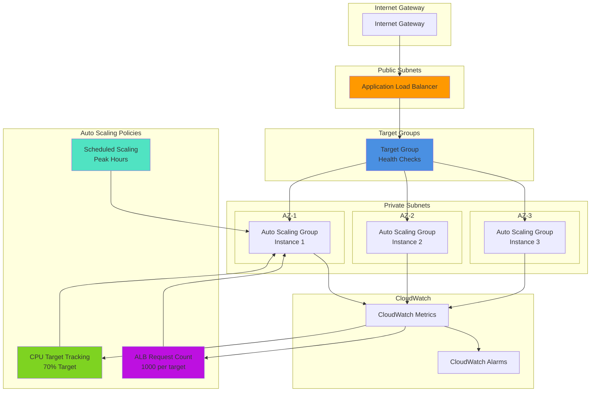

# Auto Scaling with Application Load Balancers and Target Groups

## Problem

Organizations running web applications face unpredictable traffic patterns that require dynamic resource scaling to maintain performance while controlling costs. Manual scaling approaches are reactive, error-prone, and cannot respond quickly enough to sudden traffic spikes or efficiently scale down during low-demand periods. Traditional load balancing setups often lack sophisticated health checking and traffic distribution capabilities needed for modern cloud-native applications.

## Solution

Implement comprehensive auto scaling using EC2 Auto Scaling Groups integrated with Application Load Balancers and target groups to create a resilient, self-healing infrastructure. This solution combines automated instance lifecycle management with intelligent load distribution, health-based traffic routing, and multiple scaling policies. The architecture uses target tracking scaling policies based on CloudWatch metrics to maintain optimal performance levels while minimizing costs through automatic scale-in during low demand periods.

## Architecture Diagram



## Prerequisites

1. AWS account with permissions for EC2, Auto Scaling, ELB, and CloudWatch
2. AWS CLI v2 installed and configured (or AWS CloudShell)
3. Existing VPC with public and private subnets across multiple AZs
4. Basic understanding of load balancing and auto scaling concepts
5. Estimated cost: $20-50 for testing resources (EC2 instances, load balancer)

> **Note**: This recipe creates resources across multiple Availability Zones for high availability

## Preparation

```bash
# Set environment variables
export AWS_REGION=$(aws configure get region)
export AWS_ACCOUNT_ID=$(aws sts get-caller-identity \
    --query Account --output text)

# Generate unique identifiers for resources
RANDOM_SUFFIX=$(aws secretsmanager get-random-password \
    --exclude-punctuation --exclude-uppercase \
    --password-length 6 --require-each-included-type \
    --output text --query RandomPassword)

export ASG_NAME="web-app-asg-${RANDOM_SUFFIX}"
export ALB_NAME="web-app-alb-${RANDOM_SUFFIX}"
export TG_NAME="web-app-targets-${RANDOM_SUFFIX}"
export LT_NAME="web-app-template-${RANDOM_SUFFIX}"
export SG_NAME="web-app-sg-${RANDOM_SUFFIX}"

# Get VPC and subnet information (modify these based on your environment)
export VPC_ID=$(aws ec2 describe-vpcs \
    --filters "Name=is-default,Values=true" \
    --query 'Vpcs[0].VpcId' --output text)

# Get subnets across multiple AZs
export SUBNET_IDS=$(aws ec2 describe-subnets \
    --filters "Name=vpc-id,Values=$VPC_ID" \
              "Name=default-for-az,Values=true" \
    --query 'Subnets[*].SubnetId' --output text | tr '\t' ',')

echo "VPC ID: $VPC_ID"
echo "Subnet IDs: $SUBNET_IDS"
echo "ASG Name: $ASG_NAME"
```

## Steps

1. **Create Security Group for Web Application**:

   Security Groups act as virtual firewalls that control inbound and outbound traffic to your EC2 instances. In an auto scaling environment, properly configured security groups are essential for maintaining consistent security posture across dynamically launched instances. This security group will allow web traffic while restricting access to only necessary ports, implementing the principle of least privilege that's fundamental to [AWS security best practices](https://docs.aws.amazon.com/security/latest/userguide/security_iam_service-with-iam.html).

   ```bash
   # Create security group for web servers
   SG_ID=$(aws ec2 create-security-group \
       --group-name $SG_NAME \
       --description "Security group for auto-scaled web application" \
       --vpc-id $VPC_ID \
       --query GroupId --output text)
   
   # Allow HTTP traffic from load balancer
   aws ec2 authorize-security-group-ingress \
       --group-id $SG_ID \
       --protocol tcp \
       --port 80 \
       --cidr 0.0.0.0/0
   
   # Allow HTTPS traffic from load balancer
   aws ec2 authorize-security-group-ingress \
       --group-id $SG_ID \
       --protocol tcp \
       --port 443 \
       --cidr 0.0.0.0/0
   
   # Allow SSH access (for troubleshooting)
   aws ec2 authorize-security-group-ingress \
       --group-id $SG_ID \
       --protocol tcp \
       --port 22 \
       --cidr 0.0.0.0/0
   
   export SG_ID
   echo "✅ Created security group: $SG_ID"
   ```

   The security group is now configured to allow web traffic (HTTP/HTTPS) and administrative access (SSH). This configuration enables the Application Load Balancer to route traffic to instances while maintaining security boundaries. All instances launched by the Auto Scaling Group will inherit these security rules, ensuring consistent protection across the fleet.

2. **Create Launch Template for Auto Scaling Group**:

   Launch templates define the configuration blueprint for all instances launched by your Auto Scaling Group, ensuring consistency across your fleet. Unlike the older launch configurations, [launch templates support versioning and advanced features](https://docs.aws.amazon.com/autoscaling/ec2/userguide/launch-templates.html) like mixed instance types and multiple subnets. This template includes user data that automatically configures a web server with monitoring capabilities, eliminating manual setup and ensuring every instance starts with identical configuration.

   ```bash
   # Create user data script for web server setup
   cat > user-data.sh << 'EOF'
   #!/bin/bash
   yum update -y
   yum install -y httpd
   systemctl start httpd
   systemctl enable httpd
   
   # Create a simple web page with instance metadata
   cat > /var/www/html/index.html << 'HTML'
   <!DOCTYPE html>
   <html>
   <head>
       <title>Auto Scaling Demo</title>
       <style>
           body { font-family: Arial, sans-serif; margin: 40px; }
           .container { max-width: 800px; margin: 0 auto; }
           .metric { background: #f0f0f0; padding: 20px; margin: 10px 0; border-radius: 5px; }
       </style>
   </head>
   <body>
       <div class="container">
           <h1>Auto Scaling Demo Application</h1>
           <div class="metric">
               <h3>Instance Information</h3>
               <p><strong>Instance ID:</strong> <span id="instance-id">Loading...</span></p>
               <p><strong>Availability Zone:</strong> <span id="az">Loading...</span></p>
               <p><strong>Instance Type:</strong> <span id="instance-type">Loading...</span></p>
               <p><strong>Local IP:</strong> <span id="local-ip">Loading...</span></p>
               <p><strong>Server Time:</strong> <span id="server-time"></span></p>
           </div>
           <div class="metric">
               <h3>Load Test</h3>
               <button onclick="generateLoad()">Generate CPU Load (30s)</button>
               <p><strong>Status:</strong> <span id="load-status">Ready</span></p>
           </div>
       </div>
       
       <script>
           // Fetch instance metadata
           async function fetchMetadata() {
               try {
                   const token = await fetch('http://169.254.169.254/latest/api/token', {
                       method: 'PUT',
                       headers: {'X-aws-ec2-metadata-token-ttl-seconds': '21600'}
                   }).then(r => r.text());
                   
                   const headers = {'X-aws-ec2-metadata-token': token};
                   
                   const instanceId = await fetch('http://169.254.169.254/latest/meta-data/instance-id', {headers}).then(r => r.text());
                   const az = await fetch('http://169.254.169.254/latest/meta-data/placement/availability-zone', {headers}).then(r => r.text());
                   const instanceType = await fetch('http://169.254.169.254/latest/meta-data/instance-type', {headers}).then(r => r.text());
                   const localIp = await fetch('http://169.254.169.254/latest/meta-data/local-ipv4', {headers}).then(r => r.text());
                   
                   document.getElementById('instance-id').textContent = instanceId;
                   document.getElementById('az').textContent = az;
                   document.getElementById('instance-type').textContent = instanceType;
                   document.getElementById('local-ip').textContent = localIp;
               } catch (error) {
                   console.error('Error fetching metadata:', error);
               }
           }
           
           // Generate CPU load for testing auto scaling
           function generateLoad() {
               document.getElementById('load-status').textContent = 'Generating high CPU load...';
               
               // Start multiple CPU-intensive tasks
               const workers = [];
               for (let i = 0; i < 4; i++) {
                   workers.push(new Worker('data:application/javascript,let start=Date.now();while(Date.now()-start<30000){Math.random();}'));
               }
               
               setTimeout(() => {
                   workers.forEach(worker => worker.terminate());
                   document.getElementById('load-status').textContent = 'Load test completed';
               }, 30000);
           }
           
           // Update server time every second
           function updateTime() {
               document.getElementById('server-time').textContent = new Date().toLocaleString();
           }
           
           // Initialize
           fetchMetadata();
           updateTime();
           setInterval(updateTime, 1000);
       </script>
   </body>
   </html>
   HTML
   EOF
   
   # Base64 encode user data
   USER_DATA=$(base64 -w 0 user-data.sh)
   
   # Create launch template
   aws ec2 create-launch-template \
       --launch-template-name $LT_NAME \
       --launch-template-data "{
           \"ImageId\": \"$(aws ec2 describe-images \
               --owners amazon \
               --filters 'Name=name,Values=amzn2-ami-hvm-*-x86_64-gp2' \
                        'Name=state,Values=available' \
               --query 'Images | sort_by(@, &CreationDate) | [-1].ImageId' \
               --output text)\",
           \"InstanceType\": \"t3.micro\",
           \"SecurityGroupIds\": [\"$SG_ID\"],
           \"UserData\": \"$USER_DATA\",
           \"TagSpecifications\": [{
               \"ResourceType\": \"instance\",
               \"Tags\": [
                   {\"Key\": \"Name\", \"Value\": \"AutoScaling-WebServer\"},
                   {\"Key\": \"Environment\", \"Value\": \"demo\"}
               ]
           }],
           \"MetadataOptions\": {
               \"HttpTokens\": \"required\",
               \"HttpPutResponseHopLimit\": 2
           }
       }"
   
   echo "✅ Created launch template: $LT_NAME"
   ```

   The launch template now contains all configuration needed to launch web servers automatically. The user data script installs Apache, creates a demo web page with instance metadata, and includes CPU load testing functionality. The template also configures [IMDSv2 (Instance Metadata Service version 2)](https://docs.aws.amazon.com/AWSEC2/latest/UserGuide/configuring-instance-metadata-service.html) for enhanced security, requiring tokens for metadata access. This template serves as the foundation for consistent, automated instance deployment across your Auto Scaling Group.

3. **Create Application Load Balancer**:

   An [Application Load Balancer (ALB)](https://docs.aws.amazon.com/elasticloadbalancing/latest/application/introduction.html) operates at the application layer (Layer 7) and provides advanced routing capabilities beyond simple round-robin distribution. ALBs integrate seamlessly with Auto Scaling Groups to automatically register and deregister instances, ensuring traffic only reaches healthy targets. The ALB will distribute incoming requests across multiple Availability Zones, providing both load distribution and high availability for your application.

   ```bash
   # Create Application Load Balancer
   ALB_ARN=$(aws elbv2 create-load-balancer \
       --name $ALB_NAME \
       --subnets $(echo $SUBNET_IDS | tr ',' ' ') \
       --security-groups $SG_ID \
       --scheme internet-facing \
       --type application \
       --ip-address-type ipv4 \
       --query 'LoadBalancers[0].LoadBalancerArn' --output text)
   
   # Get the DNS name for testing
   ALB_DNS=$(aws elbv2 describe-load-balancers \
       --load-balancer-arns $ALB_ARN \
       --query 'LoadBalancers[0].DNSName' --output text)
   
   export ALB_ARN
   export ALB_DNS
   echo "✅ Created Application Load Balancer: $ALB_DNS"
   ```

   The Application Load Balancer is now active and ready to receive traffic. The ALB spans multiple Availability Zones and will automatically distribute incoming requests across healthy targets. The DNS name provided will be your application's public endpoint, offering built-in redundancy and scalability. The load balancer will work with the Auto Scaling Group to maintain optimal performance as capacity changes.

4. **Create Target Group with Health Checks**:

   [Target groups](https://docs.aws.amazon.com/elasticloadbalancing/latest/application/load-balancer-target-groups.html) define how the load balancer routes requests to registered targets and determines target health. The health check configuration is critical for auto scaling because it determines when instances are ready to receive traffic and when they should be replaced. The aggressive health check settings ensure rapid detection of unhealthy instances, enabling quick replacement and maintaining application availability.

   ```bash
   # Create target group
   TG_ARN=$(aws elbv2 create-target-group \
       --name $TG_NAME \
       --protocol HTTP \
       --port 80 \
       --vpc-id $VPC_ID \
       --target-type instance \
       --health-check-protocol HTTP \
       --health-check-path "/" \
       --health-check-interval-seconds 30 \
       --health-check-timeout-seconds 5 \
       --healthy-threshold-count 2 \
       --unhealthy-threshold-count 3 \
       --matcher HttpCode=200 \
       --query 'TargetGroups[0].TargetGroupArn' --output text)
   
   # Configure target group attributes for better auto scaling integration
   aws elbv2 modify-target-group-attributes \
       --target-group-arn $TG_ARN \
       --attributes \
           Key=deregistration_delay.timeout_seconds,Value=30 \
           Key=stickiness.enabled,Value=false
   
   export TG_ARN
   echo "✅ Created target group: $TG_ARN"
   ```

   The target group is configured with optimized health checks and connection draining settings. The 30-second deregistration delay allows existing connections to complete gracefully during scale-in events, preventing dropped connections. Disabled stickiness ensures even load distribution across instances, which is important for auto scaling scenarios where instances frequently launch and terminate.

5. **Create Load Balancer Listener**:

   Listeners check for connection requests using the protocol and port you configure, and forward requests to target groups based on rules you define. This HTTP listener on port 80 provides the entry point for your application traffic. In production environments, you would typically add HTTPS listeners with SSL certificates for secure communication, but HTTP simplifies our demonstration while maintaining the same scaling principles.

   ```bash
   # Create listener for the load balancer
   aws elbv2 create-listener \
       --load-balancer-arn $ALB_ARN \
       --protocol HTTP \
       --port 80 \
       --default-actions Type=forward,TargetGroupArn=$TG_ARN
   
   echo "✅ Created load balancer listener"
   ```

   The listener is now active and will forward all HTTP traffic on port 80 to your target group. This completes the load balancing configuration, creating a pathway from the internet to your future Auto Scaling Group instances. The listener will automatically discover and route traffic to healthy instances as they join and leave the target group.

6. **Create Auto Scaling Group with Target Group Integration**:

   The [Auto Scaling Group](https://docs.aws.amazon.com/autoscaling/ec2/userguide/auto-scaling-groups.html) manages the lifecycle of EC2 instances, automatically launching replacements for unhealthy instances and scaling capacity based on demand. Integration with the target group enables ELB health checks, where the load balancer determines instance health based on application response rather than just EC2 system checks. This provides more accurate health assessment and faster response to application-level failures.

   ```bash
   # Create Auto Scaling Group
   aws autoscaling create-auto-scaling-group \
       --auto-scaling-group-name $ASG_NAME \
       --launch-template "LaunchTemplateName=$LT_NAME,Version=\$Latest" \
       --min-size 2 \
       --max-size 8 \
       --desired-capacity 2 \
       --target-group-arns $TG_ARN \
       --health-check-type ELB \
       --health-check-grace-period 300 \
       --vpc-zone-identifier $SUBNET_IDS \
       --default-cooldown 300 \
       --tags \
           Key=Name,Value=AutoScaling-Demo,PropagateAtLaunch=true \
           Key=Environment,Value=demo,PropagateAtLaunch=true
   
   echo "✅ Created Auto Scaling Group: $ASG_NAME"
   
   # Wait for instances to launch and become healthy
   echo "Waiting for instances to launch and pass health checks..."
   sleep 60
   ```

   The Auto Scaling Group is now managing instance lifecycle across multiple Availability Zones. The 5-minute health check grace period allows instances time to fully initialize before health assessments begin. ELB health checks ensure that only instances successfully serving web traffic receive requests, providing application-level health validation beyond basic EC2 system checks.

7. **Configure Target Tracking Scaling Policies**:

   [Target tracking scaling policies](https://docs.aws.amazon.com/autoscaling/ec2/userguide/as-scaling-target-tracking.html) automatically adjust capacity to maintain a specified target value for a metric. This approach is more sophisticated than simple step scaling because it calculates the optimal number of instances needed and adjusts cooldown periods dynamically. The dual-metric approach using both CPU utilization and request count provides comprehensive scaling that responds to different types of load patterns.

   ```bash
   # Create CPU utilization target tracking policy
   cat > cpu-target-tracking.json << EOF
   {
       "TargetValue": 70.0,
       "PredefinedMetricSpecification": {
           "PredefinedMetricType": "ASGAverageCPUUtilization"
       },
       "ScaleOutCooldown": 300,
       "ScaleInCooldown": 300,
       "DisableScaleIn": false
   }
   EOF
   
   aws autoscaling put-scaling-policy \
       --auto-scaling-group-name $ASG_NAME \
       --policy-name "cpu-target-tracking-policy" \
       --policy-type "TargetTrackingScaling" \
       --target-tracking-configuration file://cpu-target-tracking.json
   
   # Create ALB request count target tracking policy
   # Get the ALB suffix from the ALB ARN
   ALB_SUFFIX=$(echo $ALB_ARN | cut -d/ -f2-)
   
   # Get the target group suffix from the target group ARN 
   TG_SUFFIX=$(echo $TG_ARN | cut -d: -f6 | cut -d/ -f2-)
   
   # Construct resource label in correct format: app/alb-name/alb-id/targetgroup/tg-name/tg-id
   RESOURCE_LABEL="${ALB_SUFFIX}/${TG_SUFFIX}"
   
   cat > alb-target-tracking.json << EOF
   {
       "TargetValue": 1000.0,
       "PredefinedMetricSpecification": {
           "PredefinedMetricType": "ALBRequestCountPerTarget",
           "ResourceLabel": "$RESOURCE_LABEL"
       },
       "ScaleOutCooldown": 300,
       "ScaleInCooldown": 300,
       "DisableScaleIn": false
   }
   EOF
   
   aws autoscaling put-scaling-policy \
       --auto-scaling-group-name $ASG_NAME \
       --policy-name "alb-request-count-policy" \
       --policy-type "TargetTrackingScaling" \
       --target-tracking-configuration file://alb-target-tracking.json
   
   echo "✅ Created target tracking scaling policies"
   ```

   Two target tracking policies are now active: CPU-based scaling maintains 70% average utilization across instances, while request-based scaling maintains 1000 requests per target per minute. These policies work together to provide responsive scaling based on both compute demand and application load. The Auto Scaling service will automatically calculate and execute scaling actions to maintain these targets, providing hands-off capacity management.

8. **Create Scheduled Scaling Actions**:

   Scheduled scaling actions proactively adjust capacity based on predictable traffic patterns, complementing reactive scaling policies. This approach reduces response time during known peak periods by pre-scaling infrastructure before demand increases. Scheduled actions are particularly valuable for applications with regular traffic patterns, such as business applications with higher daytime usage or e-commerce sites with evening traffic spikes.

   ```bash
   # Scale up during business hours (9 AM UTC)
   aws autoscaling put-scheduled-update-group-action \
       --auto-scaling-group-name $ASG_NAME \
       --scheduled-action-name "scale-up-business-hours" \
       --recurrence "0 9 * * MON-FRI" \
       --min-size 3 \
       --max-size 10 \
       --desired-capacity 4
   
   # Scale down after business hours (6 PM UTC)
   aws autoscaling put-scheduled-update-group-action \
       --auto-scaling-group-name $ASG_NAME \
       --scheduled-action-name "scale-down-after-hours" \
       --recurrence "0 18 * * MON-FRI" \
       --min-size 1 \
       --max-size 8 \
       --desired-capacity 2
   
   echo "✅ Created scheduled scaling actions"
   ```

   Scheduled scaling is now configured to automatically increase capacity during business hours and reduce it afterward. This proactive approach ensures adequate capacity is available before peak periods begin, reducing response time and improving user experience. The combination of scheduled and reactive scaling provides comprehensive capacity management that handles both predictable and unexpected load patterns.

9. **Configure CloudWatch Monitoring and Alarms**:

   CloudWatch provides the observability foundation for auto scaling by collecting metrics and triggering alarms when thresholds are exceeded. [Detailed monitoring](https://docs.aws.amazon.com/autoscaling/ec2/userguide/ec2-auto-scaling-cloudwatch-monitoring.html) at 1-minute intervals enables faster scaling responses compared to basic 5-minute monitoring. The comprehensive metric collection provides visibility into scaling group health and performance, while alarms enable proactive notification of potential issues before they impact users.

   ```bash
   # Enable detailed monitoring for Auto Scaling Group
   aws autoscaling enable-metrics-collection \
       --auto-scaling-group-name $ASG_NAME \
       --granularity "1Minute" \
       --metrics "GroupMinSize" "GroupMaxSize" "GroupDesiredCapacity" \
                "GroupInServiceInstances" "GroupPendingInstances" \
                "GroupStandbyInstances" "GroupTerminatingInstances" \
                "GroupTotalInstances"
   
   # Create CloudWatch alarm for high CPU utilization
   aws cloudwatch put-metric-alarm \
       --alarm-name "${ASG_NAME}-high-cpu" \
       --alarm-description "High CPU utilization across Auto Scaling Group" \
       --metric-name CPUUtilization \
       --namespace AWS/EC2 \
       --statistic Average \
       --period 300 \
       --threshold 80 \
       --comparison-operator GreaterThanThreshold \
       --evaluation-periods 2 \
       --dimensions Name=AutoScalingGroupName,Value=$ASG_NAME
   
   # Create CloudWatch alarm for unhealthy target count
   ALB_FULL_NAME=$(echo $ALB_ARN | cut -d/ -f2- | cut -d/ -f1-2)
   TG_FULL_NAME=$(echo $TG_ARN | cut -d: -f6)
   
   aws cloudwatch put-metric-alarm \
       --alarm-name "${ASG_NAME}-unhealthy-targets" \
       --alarm-description "Unhealthy targets in target group" \
       --metric-name UnHealthyHostCount \
       --namespace AWS/ApplicationELB \
       --statistic Average \
       --period 60 \
       --threshold 1 \
       --comparison-operator GreaterThanOrEqualToThreshold \
       --evaluation-periods 2 \
       --dimensions Name=TargetGroup,Value=${TG_FULL_NAME} \
                    Name=LoadBalancer,Value=${ALB_FULL_NAME}
   
   echo "✅ Configured CloudWatch monitoring and alarms"
   ```

   CloudWatch monitoring is now actively collecting detailed metrics from your Auto Scaling Group and load balancer. The alarms will notify you of high CPU utilization or unhealthy targets, enabling proactive intervention when needed. This monitoring foundation provides the data necessary for scaling decisions and operational visibility into your application's performance and health.

10. **Test Auto Scaling Functionality**:

    Testing validates that all components work together correctly and provides baseline performance data for optimization. The demo web page includes a CPU load generator that simulates high-demand scenarios, enabling you to observe auto scaling behavior in real-time. This testing phase helps you understand scaling response times and validate that your configuration meets performance requirements.

    ```bash
    # Display current Auto Scaling Group status
    echo "=== Current Auto Scaling Group Status ==="
    aws autoscaling describe-auto-scaling-groups \
        --auto-scaling-group-names $ASG_NAME \
        --query 'AutoScalingGroups[0].[MinSize,DesiredCapacity,MaxSize]' \
        --output table
    
    # Display running instances
    echo "=== Running Instances ==="
    aws autoscaling describe-auto-scaling-instances \
        --query 'AutoScalingInstances[?AutoScalingGroupName==`'$ASG_NAME'`].[InstanceId,LifecycleState,HealthStatus,AvailabilityZone]' \
        --output table
    
    # Check target group health
    echo "=== Target Group Health Status ==="
    aws elbv2 describe-target-health \
        --target-group-arn $TG_ARN \
        --query 'TargetHealthDescriptions[*].[Target.Id,TargetHealth.State,TargetHealth.Description]' \
        --output table
    
    # Test load balancer endpoint
    echo "=== Testing Load Balancer Endpoint ==="
    echo "Load Balancer URL: http://$ALB_DNS"
    
    # Wait for ALB to be ready and test
    echo "Waiting for load balancer to become active..."
    aws elbv2 wait load-balancer-available --load-balancer-arns $ALB_ARN
    
    echo "Testing connectivity (may take a few minutes for DNS propagation):"
    for i in {1..3}; do
        echo "Test $i:"
        curl -s --connect-timeout 10 "http://$ALB_DNS" | grep -o '<title>.*</title>' || echo "Connection attempt $i failed"
        sleep 5
    done
    
    echo "✅ Auto Scaling setup complete and tested"
    ```

    Your auto scaling infrastructure is now fully operational and tested. The load balancer is distributing traffic across healthy instances, scaling policies are monitoring metrics and ready to respond to load changes, and monitoring provides visibility into system performance. You can now generate load using the web interface to observe scaling behavior in action.

## Validation & Testing

1. **Verify Auto Scaling Group Configuration**:

   ```bash
   # Check Auto Scaling Group details
   aws autoscaling describe-auto-scaling-groups \
       --auto-scaling-group-names $ASG_NAME \
       --query 'AutoScalingGroups[0].[AutoScalingGroupName,MinSize,MaxSize,DesiredCapacity,HealthCheckType,HealthCheckGracePeriod]' \
       --output table
   
   # Verify scaling policies
   aws autoscaling describe-policies \
       --auto-scaling-group-name $ASG_NAME \
       --query 'ScalingPolicies[*].[PolicyName,PolicyType,TargetTrackingConfiguration.TargetValue]' \
       --output table
   ```

   Expected output: Shows ASG with 2-8 capacity range, ELB health checks, and target tracking policies

2. **Test Load Distribution**:

   ```bash
   # Test multiple requests to verify load distribution
   echo "Testing load distribution across instances:"
   for i in {1..10}; do
       echo -n "Request $i: "
       curl -s "http://$ALB_DNS" | grep -o 'Instance ID.*Loading' | head -1 || echo "Failed"
       sleep 1
   done
   ```

   Expected behavior: Requests should be distributed across different instance IDs

3. **Verify Health Check Configuration**:

   ```bash
   # Check target group health check settings
   aws elbv2 describe-target-groups \
       --target-group-arns $TG_ARN \
       --query 'TargetGroups[0].[HealthCheckPath,HealthCheckIntervalSeconds,HealthyThresholdCount,UnhealthyThresholdCount]' \
       --output table
   
   # Monitor target health over time
   echo "Monitoring target health (Ctrl+C to stop):"
   while true; do
       aws elbv2 describe-target-health \
           --target-group-arn $TG_ARN \
           --query 'TargetHealthDescriptions[*].[Target.Id,TargetHealth.State]' \
           --output table
       sleep 30
   done
   ```

4. **Test Scaling Trigger**:

   ```bash
   # Generate load to trigger auto scaling
   echo "Generating load to test auto scaling..."
   echo "Visit http://$ALB_DNS and click 'Generate CPU Load' on multiple instances"
   echo "Monitor scaling activity:"
   
   # Watch scaling activities
   aws autoscaling describe-scaling-activities \
       --auto-scaling-group-name $ASG_NAME \
       --max-items 5 \
       --query 'Activities[*].[ActivityId,StatusCode,Description,StartTime]' \
       --output table
   ```

## Cleanup

1. **Delete Auto Scaling Group and Launch Template**:

   ```bash
   # Set desired capacity to 0
   aws autoscaling update-auto-scaling-group \
       --auto-scaling-group-name $ASG_NAME \
       --min-size 0 \
       --desired-capacity 0
   
   # Wait for instances to terminate
   echo "Waiting for instances to terminate..."
   sleep 60
   
   # Delete scheduled actions
   aws autoscaling delete-scheduled-action \
       --auto-scaling-group-name $ASG_NAME \
       --scheduled-action-name "scale-up-business-hours"
   
   aws autoscaling delete-scheduled-action \
       --auto-scaling-group-name $ASG_NAME \
       --scheduled-action-name "scale-down-after-hours"
   
   # Delete Auto Scaling Group
   aws autoscaling delete-auto-scaling-group \
       --auto-scaling-group-name $ASG_NAME \
       --force-delete
   
   # Delete launch template
   aws ec2 delete-launch-template \
       --launch-template-name $LT_NAME
   
   echo "✅ Deleted Auto Scaling Group and Launch Template"
   ```

2. **Delete Load Balancer and Target Group**:

   ```bash
   # Delete load balancer
   aws elbv2 delete-load-balancer \
       --load-balancer-arn $ALB_ARN
   
   # Wait for load balancer deletion
   echo "Waiting for load balancer to be deleted..."
   aws elbv2 wait load-balancer-deleted \
       --load-balancer-arns $ALB_ARN
   
   # Delete target group
   aws elbv2 delete-target-group \
       --target-group-arn $TG_ARN
   
   echo "✅ Deleted load balancer and target group"
   ```

3. **Delete CloudWatch Alarms**:

   ```bash
   # Delete CloudWatch alarms
   aws cloudwatch delete-alarms \
       --alarm-names "${ASG_NAME}-high-cpu" "${ASG_NAME}-unhealthy-targets"
   
   echo "✅ Deleted CloudWatch alarms"
   ```

4. **Delete Security Group**:

   ```bash
   # Delete security group
   aws ec2 delete-security-group \
       --group-id $SG_ID
   
   echo "✅ Deleted security group"
   ```

5. **Clean up local files**:

   ```bash
   # Remove temporary files
   rm -f user-data.sh cpu-target-tracking.json alb-target-tracking.json
   
   echo "✅ Cleaned up local files"
   ```

## Discussion

This recipe demonstrates a comprehensive auto scaling architecture that combines multiple AWS services to create a resilient, self-healing web application infrastructure. The solution addresses key challenges in modern cloud applications including automatic capacity management, intelligent load distribution, and proactive health monitoring.

**Auto Scaling Integration** with Application Load Balancers provides sophisticated traffic management capabilities beyond simple round-robin distribution. The ELB health check integration ensures that only healthy instances receive traffic, while the deregistration delay allows graceful connection draining during scale-in events. This prevents service disruption during automated scaling activities and maintains application availability. For more details, see the [AWS Well-Architected Framework reliability pillar](https://docs.aws.amazon.com/wellarchitected/latest/reliability-pillar/welcome.html).

**Target Tracking Scaling Policies** offer a significant improvement over traditional step scaling approaches by automatically calculating the required capacity changes to maintain target metrics. The CPU utilization policy responds to compute demand, while the ALB request count policy scales based on actual application load. This dual-metric approach provides more responsive scaling that adapts to different traffic patterns and application behaviors. The [target tracking scaling documentation](https://docs.aws.amazon.com/autoscaling/ec2/userguide/as-scaling-target-tracking.html) provides comprehensive guidance on optimizing these policies.

**Scheduled Scaling Actions** complement reactive scaling policies by proactively adjusting capacity based on predictable traffic patterns. This approach reduces response time during known peak periods and helps optimize costs by scaling down during low-demand hours. The combination of scheduled and reactive scaling creates a comprehensive capacity management strategy that handles both predictable and unexpected load changes, following [AWS cost optimization best practices](https://docs.aws.amazon.com/wellarchitected/latest/cost-optimization-pillar/welcome.html).

The architecture demonstrates AWS best practices including multi-AZ deployment for high availability, security group isolation, and comprehensive monitoring integration. The launch template approach enables consistent instance configuration while supporting rolling updates and blue-green deployment strategies for application updates.

> **Tip**: Monitor your scaling metrics over several weeks to optimize target values and cooldown periods based on your actual traffic patterns and application performance characteristics.

> **Warning**: Always test scaling policies in a staging environment before applying to production workloads, as aggressive scaling can impact application performance and costs.

## Challenge

Extend this solution by implementing these enhancements:

1. **Predictive Scaling**: Implement [AWS Auto Scaling predictive scaling](https://docs.aws.amazon.com/autoscaling/ec2/userguide/ec2-auto-scaling-predictive-scaling.html) to forecast traffic patterns and pre-scale infrastructure before demand increases, reducing response time during traffic spikes.

2. **Multi-Tier Auto Scaling**: Extend the architecture to include application and database tiers with separate Auto Scaling Groups, implementing cross-tier scaling coordination using Lambda functions and CloudWatch events.

3. **Blue-Green Deployment Integration**: Implement automated blue-green deployments using multiple target groups and Route 53 weighted routing to enable zero-downtime application updates with automatic rollback capabilities.

4. **Cost Optimization**: Add [Spot Instance integration](https://docs.aws.amazon.com/autoscaling/ec2/userguide/auto-scaling-mixed-instances-groups.html) with mixed instance types and sizes, implementing intelligent bid management and fallback strategies to maximize cost savings while maintaining availability.

5. **Advanced Health Checks**: Implement custom health check endpoints with application-specific metrics, database connectivity validation, and dependency service availability checks to improve scaling decision accuracy.

## Infrastructure Code

### Available Infrastructure as Code:

- [Infrastructure Code Overview](code/README.md) - Detailed description of all infrastructure components
- [AWS CDK (Python)](code/cdk-python/) - AWS CDK Python implementation
- [AWS CDK (TypeScript)](code/cdk-typescript/) - AWS CDK TypeScript implementation
- [CloudFormation](code/cloudformation.yaml) - AWS CloudFormation template
- [Bash CLI Scripts](code/scripts/) - Example bash scripts using AWS CLI commands to deploy infrastructure
- [Terraform](code/terraform/) - Terraform configuration files