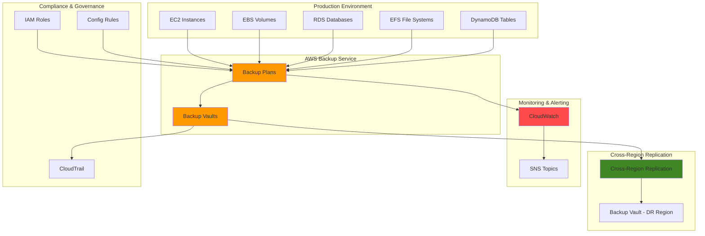

# Automated Backup Solutions with AWS Backup

## Problem

Organizations struggle with inconsistent backup practices across their AWS infrastructure, leading to potential data loss and compliance violations. Manual backup processes are error-prone, time-consuming, and fail to meet business continuity requirements. Without centralized backup management, enterprises face challenges in maintaining regulatory compliance, achieving recovery time objectives (RTO), and ensuring comprehensive data protection across multiple AWS services and regions.

## Solution

AWS Backup provides a fully managed, centralized backup service that automates data protection across AWS services. This solution implements policy-based backup plans with automated scheduling, cross-region replication, and compliance monitoring. By leveraging AWS Backup's centralized management, organizations can standardize backup policies, reduce operational overhead, and ensure consistent data protection across their entire AWS infrastructure.

## Architecture Diagram



## Prerequisites

1. AWS account with appropriate permissions for AWS Backup, IAM, CloudWatch, and SNS
2. AWS CLI v2 installed and configured (or AWS CloudShell)
3. Basic understanding of AWS services and backup concepts
4. Existing AWS resources (EC2, RDS, EFS, or DynamoDB) to back up
5. Estimated cost: $0.50-$5.00 per backup depending on data volume and retention

## Preparation

```bash
# Set environment variables
export AWS_REGION=$(aws configure get region)
export AWS_ACCOUNT_ID=$(aws sts get-caller-identity \
    --query Account --output text)
export DR_REGION="us-east-1"

# Generate unique identifiers for resources
RANDOM_SUFFIX=$(aws secretsmanager get-random-password \
    --exclude-punctuation --exclude-uppercase \
    --password-length 6 --require-each-included-type \
    --output text --query RandomPassword)

export BACKUP_PLAN_NAME="enterprise-backup-plan-${RANDOM_SUFFIX}"
export BACKUP_VAULT_NAME="enterprise-backup-vault-${RANDOM_SUFFIX}"
export DR_BACKUP_VAULT_NAME="dr-backup-vault-${RANDOM_SUFFIX}"
export BACKUP_ROLE_NAME="AWSBackupDefaultServiceRole"
export SNS_TOPIC_NAME="backup-notifications-${RANDOM_SUFFIX}"

# Create SNS topic for backup notifications
aws sns create-topic \
    --name ${SNS_TOPIC_NAME} \
    --region ${AWS_REGION}

export SNS_TOPIC_ARN=$(aws sns get-topic-attributes \
    --topic-arn "arn:aws:sns:${AWS_REGION}:${AWS_ACCOUNT_ID}:${SNS_TOPIC_NAME}" \
    --query 'Attributes.TopicArn' --output text)

echo "Setup complete - SNS Topic: ${SNS_TOPIC_ARN}"
```

## Steps

1. **Create backup vaults for primary and disaster recovery regions**:

   AWS Backup requires secure storage containers called backup vaults to organize and protect recovery points. These vaults provide encryption, access controls, and regional isolation for backup data. Establishing both primary and disaster recovery vaults enables geographic distribution of backups, ensuring business continuity even during regional failures. This foundational step creates the secure infrastructure necessary for automated backup operations across your AWS environment.

   ```bash
   # Create primary backup vault
   aws backup create-backup-vault \
       --backup-vault-name ${BACKUP_VAULT_NAME} \
       --encryption-key-id alias/aws/backup \
       --region ${AWS_REGION}
   
   # Create disaster recovery backup vault
   aws backup create-backup-vault \
       --backup-vault-name ${DR_BACKUP_VAULT_NAME} \
       --encryption-key-id alias/aws/backup \
       --region ${DR_REGION}
   
   echo "✅ Created backup vaults in primary and DR regions"
   ```

   The backup vaults are now established with enterprise-grade encryption and access controls. This dual-region approach provides the foundation for [cross-region backup replication](https://docs.aws.amazon.com/aws-backup/latest/devguide/cross-region-backup.html), enabling recovery capabilities that meet stringent business continuity requirements.

2. **Create IAM service role for AWS Backup**:

   AWS Backup operates as a service on your behalf, requiring appropriate IAM permissions to access and backup your AWS resources. The service role establishes the security foundation that enables AWS Backup to perform operations across multiple AWS services while maintaining the principle of least privilege. This role configuration is essential for enabling automated backup operations while ensuring security compliance and audit requirements are met.

   ```bash
   # Create trust policy for AWS Backup service
   cat > backup-trust-policy.json << 'EOF'
   {
       "Version": "2012-10-17",
       "Statement": [
           {
               "Effect": "Allow",
               "Principal": {
                   "Service": "backup.amazonaws.com"
               },
               "Action": "sts:AssumeRole"
           }
       ]
   }
   EOF
   
   # Create IAM role for AWS Backup
   aws iam create-role \
       --role-name ${BACKUP_ROLE_NAME} \
       --assume-role-policy-document file://backup-trust-policy.json \
       --description "Service role for AWS Backup"
   
   # Attach AWS managed backup policy
   aws iam attach-role-policy \
       --role-name ${BACKUP_ROLE_NAME} \
       --policy-arn arn:aws:iam::aws:policy/service-role/AWSBackupServiceRolePolicyForBackup
   
   # Attach restore policy
   aws iam attach-role-policy \
       --role-name ${BACKUP_ROLE_NAME} \
       --policy-arn arn:aws:iam::aws:policy/service-role/AWSBackupServiceRolePolicyForRestores
   
   echo "✅ Created IAM service role for AWS Backup"
   ```

   > **Note**: The AWS Backup service role requires specific permissions to access and backup various AWS resources. The service automatically assumes this role when performing backup operations. Learn more about [AWS Backup IAM service roles](https://docs.aws.amazon.com/aws-backup/latest/devguide/iam-service-roles.html).

3. **Create comprehensive backup plan with multiple schedules**:

   Backup plans define the comprehensive strategy for protecting your data through automated scheduling, retention policies, and cross-region replication. Multiple backup schedules accommodate different business requirements - daily backups for operational recovery and weekly backups for longer-term retention. The plan also configures automatic cross-region copying for disaster recovery scenarios, ensuring business continuity capabilities that meet enterprise recovery time objectives (RTO) and recovery point objectives (RPO).

   ```bash
   # Create backup plan with daily and weekly schedules
   cat > backup-plan.json << EOF
   {
       "BackupPlan": {
           "BackupPlanName": "${BACKUP_PLAN_NAME}",
           "Rules": [
               {
                   "RuleName": "DailyBackups",
                   "TargetBackupVault": "${BACKUP_VAULT_NAME}",
                   "ScheduleExpression": "cron(0 2 ? * * *)",
                   "StartWindowMinutes": 60,
                   "CompletionWindowMinutes": 120,
                   "Lifecycle": {
                       "DeleteAfterDays": 30
                   },
                   "RecoveryPointTags": {
                       "BackupType": "Daily",
                       "Environment": "Production"
                   },
                   "CopyActions": [
                       {
                           "DestinationBackupVaultArn": "arn:aws:backup:${DR_REGION}:${AWS_ACCOUNT_ID}:backup-vault:${DR_BACKUP_VAULT_NAME}",
                           "Lifecycle": {
                               "DeleteAfterDays": 30
                           }
                       }
                   ]
               },
               {
                   "RuleName": "WeeklyBackups",
                   "TargetBackupVault": "${BACKUP_VAULT_NAME}",
                   "ScheduleExpression": "cron(0 3 ? * SUN *)",
                   "StartWindowMinutes": 60,
                   "CompletionWindowMinutes": 240,
                   "Lifecycle": {
                       "DeleteAfterDays": 90
                   },
                   "RecoveryPointTags": {
                       "BackupType": "Weekly",
                       "Environment": "Production"
                   },
                   "CopyActions": [
                       {
                           "DestinationBackupVaultArn": "arn:aws:backup:${DR_REGION}:${AWS_ACCOUNT_ID}:backup-vault:${DR_BACKUP_VAULT_NAME}",
                           "Lifecycle": {
                               "DeleteAfterDays": 90
                           }
                       }
                   ]
               }
           ]
       }
   }
   EOF
   
   # Create the backup plan
   aws backup create-backup-plan \
       --backup-plan file://backup-plan.json \
       --region ${AWS_REGION}
   
   export BACKUP_PLAN_ID=$(aws backup list-backup-plans \
       --query "BackupPlansList[?BackupPlanName=='${BACKUP_PLAN_NAME}'].BackupPlanId" \
       --output text)
   
   echo "✅ Created backup plan: ${BACKUP_PLAN_ID}"
   ```

   The backup plan now orchestrates automated protection across your infrastructure with intelligent lifecycle management. Cross-region replication provides geographic redundancy, while the multi-schedule approach balances operational recovery needs with cost optimization. This configuration follows [AWS Backup best practices](https://docs.aws.amazon.com/aws-backup/latest/devguide/creating-a-backup-plan.html) for enterprise data protection strategies.

4. **Create backup selections to assign resources**:

   Backup selections bridge the gap between backup plans and actual AWS resources through intelligent tag-based targeting. This approach enables dynamic resource inclusion based on metadata, ensuring that new resources are automatically protected when they receive appropriate tags. Tag-based selections eliminate manual resource management overhead while providing granular control over which resources receive backup protection. This strategy scales efficiently across large environments and supports consistent governance practices.

   ```bash
   # Create backup selection for EC2 instances
   cat > backup-selection.json << EOF
   {
       "BackupSelection": {
           "SelectionName": "ProductionResources",
           "IamRoleArn": "arn:aws:iam::${AWS_ACCOUNT_ID}:role/${BACKUP_ROLE_NAME}",
           "Resources": [
               "*"
           ],
           "Conditions": {
               "StringEquals": {
                   "aws:ResourceTag/Environment": [
                       "Production"
                   ]
               }
           },
           "NotResources": []
       }
   }
   EOF
   
   # Create backup selection
   aws backup create-backup-selection \
       --backup-plan-id ${BACKUP_PLAN_ID} \
       --backup-selection file://backup-selection.json \
       --region ${AWS_REGION}
   
   echo "✅ Created backup selection for production resources"
   ```

   > **Tip**: Backup selections use resource tags to dynamically include resources in backup plans. This tag-based approach ensures new resources with the correct tags are automatically included in backups without manual configuration. Consider implementing a [consistent tagging strategy](https://docs.aws.amazon.com/whitepapers/latest/tagging-best-practices/tagging-best-practices.html) across your organization.

5. **Set up CloudWatch monitoring and alarms**:

   Proactive monitoring transforms backup operations from reactive to predictive by identifying issues before they impact business continuity. CloudWatch metrics provide visibility into backup job success rates, storage utilization, and operational performance. Automated alerting through SNS enables immediate response to backup failures or capacity issues, reducing the risk of data loss and ensuring service level agreement compliance. This monitoring foundation supports operational excellence and regulatory audit requirements.

   ```bash
   # Create CloudWatch alarm for backup job failures
   aws cloudwatch put-metric-alarm \
       --alarm-name "AWS-Backup-Job-Failures" \
       --alarm-description "Alert when backup jobs fail" \
       --metric-name "NumberOfBackupJobsFailed" \
       --namespace "AWS/Backup" \
       --statistic "Sum" \
       --period 300 \
       --threshold 1 \
       --comparison-operator "GreaterThanOrEqualToThreshold" \
       --evaluation-periods 1 \
       --alarm-actions "${SNS_TOPIC_ARN}" \
       --treat-missing-data "notBreaching"
   
   # Create CloudWatch alarm for backup vault usage
   aws cloudwatch put-metric-alarm \
       --alarm-name "AWS-Backup-Storage-Usage" \
       --alarm-description "Alert when backup storage exceeds threshold" \
       --metric-name "BackupVaultSizeBytes" \
       --namespace "AWS/Backup" \
       --statistic "Average" \
       --period 3600 \
       --threshold 107374182400 \
       --comparison-operator "GreaterThanThreshold" \
       --evaluation-periods 1 \
       --alarm-actions "${SNS_TOPIC_ARN}" \
       --dimensions Name=BackupVaultName,Value=${BACKUP_VAULT_NAME}
   
   echo "✅ Created CloudWatch alarms for backup monitoring"
   ```

   Proactive monitoring through CloudWatch metrics helps detect backup failures and storage issues before they impact business operations. These alarms integrate with SNS for immediate notification to operations teams.

6. **Configure backup vault notifications**:

   Real-time event notifications provide operational visibility and enable automated workflow integration for backup operations. Vault-level notifications capture all backup, restore, and copy activities, creating an audit trail that supports compliance requirements and operational monitoring. These events can trigger downstream automation, such as updating change management systems or initiating validation workflows, enhancing the overall backup ecosystem integration.

   ```bash
   # Create backup vault notification policy
   cat > vault-notification-policy.json << EOF
   {
       "BackupVaultName": "${BACKUP_VAULT_NAME}",
       "SNSTopicArn": "${SNS_TOPIC_ARN}",
       "BackupVaultEvents": [
           "BACKUP_JOB_STARTED",
           "BACKUP_JOB_COMPLETED",
           "BACKUP_JOB_FAILED",
           "RESTORE_JOB_STARTED",
           "RESTORE_JOB_COMPLETED",
           "RESTORE_JOB_FAILED",
           "COPY_JOB_STARTED",
           "COPY_JOB_SUCCESSFUL",
           "COPY_JOB_FAILED"
       ]
   }
   EOF
   
   # Set backup vault notification configuration
   aws backup put-backup-vault-notifications \
       --backup-vault-name ${BACKUP_VAULT_NAME} \
       --sns-topic-arn ${SNS_TOPIC_ARN} \
       --backup-vault-events BACKUP_JOB_STARTED BACKUP_JOB_COMPLETED BACKUP_JOB_FAILED \
           RESTORE_JOB_STARTED RESTORE_JOB_COMPLETED RESTORE_JOB_FAILED \
           COPY_JOB_STARTED COPY_JOB_SUCCESSFUL COPY_JOB_FAILED
   
   echo "✅ Configured backup vault notifications"
   ```

   Backup vault events provide real-time visibility into backup and restore operations. These notifications can trigger automated workflows or alert stakeholders about critical backup activities.

7. **Create backup compliance monitoring**:

   Compliance monitoring ensures backup strategies meet regulatory requirements and organizational policies through automated validation. AWS Config rules continuously assess backup plan configurations against defined standards, providing governance oversight and audit evidence. This automated compliance checking reduces manual overhead while ensuring consistent adherence to data protection requirements across the enterprise infrastructure.

   ```bash
   # Create custom Config rule for backup compliance
   cat > backup-compliance-rule.json << 'EOF'
   {
       "ConfigRuleName": "backup-plan-min-frequency-and-min-retention-check",
       "Description": "Checks whether a backup plan has a backup rule that satisfies the required frequency and retention period",
       "Source": {
           "Owner": "AWS",
           "SourceIdentifier": "BACKUP_PLAN_MIN_FREQUENCY_AND_MIN_RETENTION_CHECK"
       },
       "InputParameters": "{\"requiredFrequencyValue\":\"1\",\"requiredRetentionDays\":\"35\",\"requiredFrequencyUnit\":\"days\"}"
   }
   EOF
   
   # Create Config rule (if Config is enabled)
   aws configservice put-config-rule \
       --config-rule file://backup-compliance-rule.json \
       --region ${AWS_REGION} 2>/dev/null || echo "Config service not available or not configured"
   
   echo "✅ Created backup compliance monitoring rule"
   ```

8. **Test automated recovery by creating a test restore**:

   Backup validation through automated restore testing provides confidence in recovery capabilities and identifies potential issues before they impact critical business operations. Regular restore testing validates not only backup integrity but also the entire recovery process, including access permissions, network connectivity, and application dependencies. Automated testing reduces manual effort while ensuring disaster recovery procedures remain effective as infrastructure evolves.

   ```bash
   # Wait for first backup to complete (this may take several minutes)
   echo "Waiting for backup jobs to initialize..."
   sleep 30
   
   # List backup jobs to verify they're running
   aws backup list-backup-jobs \
       --by-backup-vault-name ${BACKUP_VAULT_NAME} \
       --max-results 10 \
       --region ${AWS_REGION}
   
   # Create automated restore testing plan
   cat > restore-testing-plan.json << EOF
   {
       "RestoreTestingPlanName": "automated-restore-test-${RANDOM_SUFFIX}",
       "ScheduleExpression": "cron(0 4 ? * MON *)",
       "RecoveryPointSelection": {
           "Algorithm": "LATEST_WITHIN_WINDOW",
           "RecoveryPointTypes": [
               "SNAPSHOT"
           ],
           "IncludeVaults": [
               "${BACKUP_VAULT_NAME}"
           ]
       }
   }
   EOF
   
   # Create restore testing plan
   aws backup create-restore-testing-plan \
       --restore-testing-plan file://restore-testing-plan.json \
       --region ${AWS_REGION} 2>/dev/null || echo "Restore testing not available in this region"
   
   echo "✅ Created automated restore testing plan"
   ```

   Automated restore testing validates backup integrity and helps ensure recovery procedures work correctly. Regular testing builds confidence in disaster recovery capabilities and identifies issues before they impact business operations.

9. **Set up backup reporting and compliance dashboard**:

   Comprehensive reporting transforms backup operations from reactive monitoring to strategic insights through detailed analytics and compliance tracking. Backup reports provide stakeholders with visibility into protection coverage, success rates, storage utilization, and cost optimization opportunities. These insights support data-driven decisions about backup strategy, resource allocation, and compliance posture, enabling continuous improvement of data protection practices.

   ```bash
   # Create backup reporting plan
   cat > backup-report-plan.json << EOF
   {
       "ReportPlanName": "backup-compliance-report-${RANDOM_SUFFIX}",
       "ReportPlanDescription": "Monthly backup compliance report",
       "ReportDeliveryChannel": {
           "S3BucketName": "aws-backup-reports-${AWS_ACCOUNT_ID}-${AWS_REGION}",
           "S3KeyPrefix": "backup-reports/",
           "Formats": [
               "CSV",
               "JSON"
           ]
       },
       "ReportSetting": {
           "ReportTemplate": "BACKUP_JOB_REPORT"
       }
   }
   EOF
   
   # Create S3 bucket for backup reports
   aws s3 mb s3://aws-backup-reports-${AWS_ACCOUNT_ID}-${AWS_REGION} \
       --region ${AWS_REGION} 2>/dev/null || echo "S3 bucket already exists"
   
   # Create backup report plan
   aws backup create-report-plan \
       --report-plan file://backup-report-plan.json \
       --region ${AWS_REGION} 2>/dev/null || echo "Backup reporting not available in this region"
   
   echo "✅ Created backup reporting configuration"
   ```

   Backup reporting provides insights into backup compliance, job success rates, and storage utilization. These reports support audit requirements and help optimize backup strategies based on actual usage patterns.

10. **Configure backup vault access policies for security**:

    Backup security requires defense-in-depth strategies that protect against both accidental deletion and malicious attacks such as ransomware. Vault access policies create additional security layers beyond IAM permissions, implementing immutability controls that prevent unauthorized backup deletion. These policies are especially critical for regulatory compliance and ransomware protection, ensuring that backup data remains available for recovery even when primary systems are compromised.

    ```bash
    # Create backup vault access policy
    cat > vault-access-policy.json << EOF
    {
        "Version": "2012-10-17",
        "Statement": [
            {
                "Sid": "DenyDeleteBackupVault",
                "Effect": "Deny",
                "Principal": "*",
                "Action": [
                    "backup:DeleteBackupVault",
                    "backup:DeleteRecoveryPoint",
                    "backup:UpdateRecoveryPointLifecycle"
                ],
                "Resource": "*",
                "Condition": {
                    "StringNotEquals": {
                        "aws:userid": [
                            "${AWS_ACCOUNT_ID}:root"
                        ]
                    }
                }
            }
        ]
    }
    EOF
    
    # Apply access policy to backup vault
    aws backup put-backup-vault-access-policy \
        --backup-vault-name ${BACKUP_VAULT_NAME} \
        --policy file://vault-access-policy.json \
        --region ${AWS_REGION}
    
    echo "✅ Applied security policies to backup vault"
    ```

   The vault access policies now provide immutable backup protection that complements your overall security posture. This configuration aligns with [AWS security best practices](https://docs.aws.amazon.com/aws-backup/latest/devguide/security.html) and regulatory frameworks that require backup data immutability for compliance and ransomware protection.

## Validation & Testing

1. **Verify backup plan configuration**:

   ```bash
   # Check backup plan details
   aws backup get-backup-plan \
       --backup-plan-id ${BACKUP_PLAN_ID} \
       --region ${AWS_REGION}
   
   # List backup selections
   aws backup list-backup-selections \
       --backup-plan-id ${BACKUP_PLAN_ID} \
       --region ${AWS_REGION}
   ```

   Expected output: Backup plan details with daily and weekly rules, cross-region copy actions, and resource selections.

2. **Test backup vault accessibility**:

   ```bash
   # Verify backup vaults in both regions
   aws backup list-backup-vaults \
       --region ${AWS_REGION}
   
   aws backup list-backup-vaults \
       --region ${DR_REGION}
   ```

   Expected output: Both backup vaults should be listed with encryption enabled.

3. **Monitor backup job execution**:

   ```bash
   # Check backup job status
   aws backup list-backup-jobs \
       --by-backup-vault-name ${BACKUP_VAULT_NAME} \
       --region ${AWS_REGION}
   
   # Check copy job status for cross-region replication
   aws backup list-copy-jobs \
       --by-destination-vault-arn "arn:aws:backup:${DR_REGION}:${AWS_ACCOUNT_ID}:backup-vault:${DR_BACKUP_VAULT_NAME}" \
       --region ${AWS_REGION}
   ```

   Expected output: Backup jobs should show "COMPLETED" status, and copy jobs should show successful replication.

4. **Test CloudWatch monitoring**:

   ```bash
   # Check CloudWatch metrics for backup jobs
   aws cloudwatch get-metric-statistics \
       --namespace AWS/Backup \
       --metric-name NumberOfBackupJobsCompleted \
       --start-time $(date -u -d '1 hour ago' +%Y-%m-%dT%H:%M:%S) \
       --end-time $(date -u +%Y-%m-%dT%H:%M:%S) \
       --period 3600 \
       --statistics Sum \
       --region ${AWS_REGION}
   ```

   Expected output: Metric data showing completed backup jobs.

5. **Verify cross-region backup replication**:

   ```bash
   # List recovery points in DR region
   aws backup list-recovery-points-by-backup-vault \
       --backup-vault-name ${DR_BACKUP_VAULT_NAME} \
       --region ${DR_REGION}
   ```

   Expected output: Recovery points should be present in the DR region backup vault.

## Cleanup

1. **Remove backup selections and plans**:

   ```bash
   # Delete backup selections
   SELECTION_ID=$(aws backup list-backup-selections \
       --backup-plan-id ${BACKUP_PLAN_ID} \
       --query 'BackupSelectionsList[0].SelectionId' \
       --output text)
   
   aws backup delete-backup-selection \
       --backup-plan-id ${BACKUP_PLAN_ID} \
       --selection-id ${SELECTION_ID} \
       --region ${AWS_REGION}
   
   # Delete backup plan
   aws backup delete-backup-plan \
       --backup-plan-id ${BACKUP_PLAN_ID} \
       --region ${AWS_REGION}
   
   echo "✅ Deleted backup plan and selections"
   ```

2. **Remove backup vaults after clearing recovery points**:

   ```bash
   # Note: You must manually delete recovery points first
   echo "Manual step: Delete all recovery points from backup vaults before proceeding"
   
   # Delete backup vaults (will fail if recovery points exist)
   aws backup delete-backup-vault \
       --backup-vault-name ${BACKUP_VAULT_NAME} \
       --region ${AWS_REGION} 2>/dev/null || echo "Vault contains recovery points"
   
   aws backup delete-backup-vault \
       --backup-vault-name ${DR_BACKUP_VAULT_NAME} \
       --region ${DR_REGION} 2>/dev/null || echo "Vault contains recovery points"
   
   echo "✅ Attempted to delete backup vaults"
   ```

3. **Clean up monitoring and reporting resources**:

   ```bash
   # Delete CloudWatch alarms
   aws cloudwatch delete-alarms \
       --alarm-names "AWS-Backup-Job-Failures" "AWS-Backup-Storage-Usage" \
       --region ${AWS_REGION}
   
   # Delete SNS topic
   aws sns delete-topic \
       --topic-arn ${SNS_TOPIC_ARN} \
       --region ${AWS_REGION}
   
   # Delete S3 bucket for reports
   aws s3 rb s3://aws-backup-reports-${AWS_ACCOUNT_ID}-${AWS_REGION} \
       --force --region ${AWS_REGION} 2>/dev/null || echo "S3 bucket cleanup failed"
   
   echo "✅ Cleaned up monitoring resources"
   ```

4. **Remove IAM roles and policies**:

   ```bash
   # Detach policies from IAM role
   aws iam detach-role-policy \
       --role-name ${BACKUP_ROLE_NAME} \
       --policy-arn arn:aws:iam::aws:policy/service-role/AWSBackupServiceRolePolicyForBackup
   
   aws iam detach-role-policy \
       --role-name ${BACKUP_ROLE_NAME} \
       --policy-arn arn:aws:iam::aws:policy/service-role/AWSBackupServiceRolePolicyForRestores
   
   # Delete IAM role
   aws iam delete-role \
       --role-name ${BACKUP_ROLE_NAME}
   
   echo "✅ Cleaned up IAM resources"
   ```

5. **Remove local configuration files**:

   ```bash
   # Clean up local JSON files
   rm -f backup-trust-policy.json backup-plan.json backup-selection.json \
         vault-notification-policy.json backup-compliance-rule.json \
         restore-testing-plan.json backup-report-plan.json vault-access-policy.json
   
   echo "✅ Cleaned up local configuration files"
   ```

## Discussion

AWS Backup provides a comprehensive solution for centralizing and automating backup operations across multiple AWS services. The implementation demonstrates several key architectural patterns that enhance data protection and operational efficiency.

The policy-based approach enables organizations to define backup requirements once and automatically apply them across resources using tags. This eliminates the need for service-specific backup configurations and ensures consistent protection policies. Cross-region replication adds an additional layer of disaster recovery capability, automatically copying backups to geographically separated regions to protect against regional failures.

The integration with CloudWatch and SNS creates a proactive monitoring system that alerts administrators to backup failures or capacity issues. This monitoring approach, combined with automated restore testing, helps organizations maintain confidence in their backup and recovery capabilities. The compliance monitoring through AWS Config rules ensures that backup policies meet regulatory requirements and organizational standards.

Cost optimization is achieved through intelligent lifecycle management, automatically transitioning older backups to cheaper storage classes and deleting expired recovery points. The reporting capabilities provide visibility into backup compliance and storage utilization, enabling data-driven decisions about backup strategy and resource allocation.

> **Tip**: Use backup vault lock features to create immutable backups that cannot be deleted before their retention period expires, providing additional protection against ransomware and accidental deletions.

## Challenge

Extend this solution by implementing these enhancements:

1. **Multi-Account Backup Management**: Configure cross-account backup sharing using AWS Organizations and implement centralized backup governance across multiple AWS accounts with automated policy distribution.

2. **Advanced Restore Testing**: Create Lambda functions that automatically validate restored resources by running health checks and functional tests, integrating with your CI/CD pipeline for comprehensive disaster recovery validation.

3. **Cost Optimization Automation**: Implement intelligent lifecycle management using Lambda and CloudWatch Events to automatically adjust backup retention based on resource criticality, usage patterns, and compliance requirements.

4. **Hybrid Backup Integration**: Extend the solution to include on-premises resources using AWS Backup Gateway, creating a unified backup strategy that spans cloud and on-premises infrastructure.

5. **Compliance Automation**: Integrate with AWS Security Hub and AWS Audit Manager to automatically generate compliance reports and remediate backup policy violations across your organization.

## Infrastructure Code

*Infrastructure code will be generated after recipe approval.*