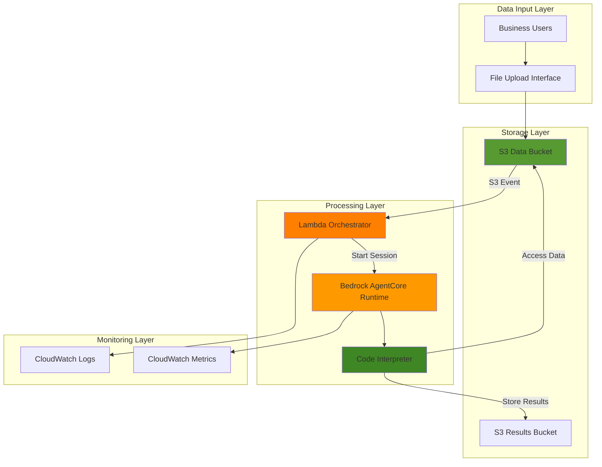

# Automated Data Analysis with Bedrock AgentCore Runtime

## Problem

Organizations struggle with manual data analysis workflows that require data scientists to repeatedly perform similar analytical tasks on uploaded datasets. Teams face bottlenecks when business users need quick insights from CSV files, Excel spreadsheets, or JSON datasets but lack the technical expertise to write analysis code. This manual process delays decision-making and prevents organizations from scaling their data analysis capabilities to meet growing business demands.

## Solution

Build an automated data analysis system using AWS Bedrock AgentCore Runtime with Code Interpreter to process datasets uploaded to S3 and generate insights automatically. Lambda functions orchestrate the workflow by triggering AgentCore sessions when new files are uploaded, while CloudWatch provides comprehensive monitoring of the AI agent's analysis activities. This serverless approach scales automatically and provides enterprise-grade security for sensitive data analysis workloads.

## Architecture Diagram



## Prerequisites

1. AWS account with appropriate permissions for Bedrock AgentCore, Lambda, S3, and CloudWatch
2. AWS CLI v2 installed and configured (or AWS CloudShell)
3. Basic understanding of AI agents and serverless architectures
4. Familiarity with Python programming for Lambda functions
5. Estimated cost: $5-15 per month for typical usage (varies based on data processing volume)

> **Note**: Bedrock AgentCore is currently in preview and may require account allowlisting. Contact AWS Support if you need access to the service.

## Preparation

```bash
# Set environment variables
export AWS_REGION=$(aws configure get region)
export AWS_ACCOUNT_ID=$(aws sts get-caller-identity \
    --query Account --output text)

# Generate unique identifiers for resources
RANDOM_SUFFIX=$(aws secretsmanager get-random-password \
    --exclude-punctuation --exclude-uppercase \
    --password-length 6 --require-each-included-type \
    --output text --query RandomPassword)

# Set resource names
export DATA_BUCKET_NAME="data-analysis-input-${RANDOM_SUFFIX}"
export RESULTS_BUCKET_NAME="data-analysis-results-${RANDOM_SUFFIX}"
export LAMBDA_FUNCTION_NAME="data-analysis-orchestrator-${RANDOM_SUFFIX}"
export IAM_ROLE_NAME="DataAnalysisOrchestratorRole-${RANDOM_SUFFIX}"

echo "✅ AWS environment configured"
echo "Data Bucket: ${DATA_BUCKET_NAME}"
echo "Results Bucket: ${RESULTS_BUCKET_NAME}"
```

## Steps

1. **Create S3 Buckets for Data Storage**:

   S3 provides the foundational storage layer for our automated data analysis pipeline with 99.999999999% (11 9's) durability. We'll create separate buckets for input data and analysis results to maintain clear data flow and enable proper access controls. The input bucket will trigger our Lambda orchestrator when new datasets are uploaded, while the results bucket stores the AI-generated insights and visualizations.

   ```bash
   # Create S3 bucket for input data
   aws s3 mb s3://${DATA_BUCKET_NAME} --region ${AWS_REGION}
   
   # Create S3 bucket for analysis results
   aws s3 mb s3://${RESULTS_BUCKET_NAME} --region ${AWS_REGION}
   
   # Enable versioning for data protection
   aws s3api put-bucket-versioning \
       --bucket ${DATA_BUCKET_NAME} \
       --versioning-configuration Status=Enabled
   
   aws s3api put-bucket-versioning \
       --bucket ${RESULTS_BUCKET_NAME} \
       --versioning-configuration Status=Enabled
   
   # Enable server-side encryption
   aws s3api put-bucket-encryption \
       --bucket ${DATA_BUCKET_NAME} \
       --server-side-encryption-configuration \
       'Rules=[{ApplyServerSideEncryptionByDefault:{SSEAlgorithm:AES256}}]'
   
   aws s3api put-bucket-encryption \
       --bucket ${RESULTS_BUCKET_NAME} \
       --server-side-encryption-configuration \
       'Rules=[{ApplyServerSideEncryptionByDefault:{SSEAlgorithm:AES256}}]'
   
   echo "✅ S3 buckets created with versioning and encryption enabled"
   ```

   The buckets now provide secure, scalable storage for both raw datasets and processed analysis results. Versioning ensures data integrity and enables recovery from accidental modifications, while encryption protects sensitive data at rest.

2. **Create IAM Role for Lambda Function**:

   The Lambda function requires comprehensive permissions to orchestrate the data analysis workflow, following the AWS Well-Architected Framework's security pillar. This includes reading from S3, invoking Bedrock AgentCore services, and writing logs to CloudWatch. Following the principle of least privilege, we'll create a role with only the necessary permissions for our specific use case.

   ```bash
   # Create trust policy for Lambda
   cat > lambda-trust-policy.json << EOF
   {
       "Version": "2012-10-17",
       "Statement": [
           {
               "Effect": "Allow",
               "Principal": {
                   "Service": "lambda.amazonaws.com"
               },
               "Action": "sts:AssumeRole"
           }
       ]
   }
   EOF
   
   # Create IAM role
   aws iam create-role \
       --role-name ${IAM_ROLE_NAME} \
       --assume-role-policy-document file://lambda-trust-policy.json
   
   # Attach basic Lambda execution policy
   aws iam attach-role-policy \
       --role-name ${IAM_ROLE_NAME} \
       --policy-arn arn:aws:iam::aws:policy/service-role/AWSLambdaBasicExecutionRole
   
   echo "✅ IAM role created for Lambda function"
   ```

3. **Create Custom IAM Policy for AgentCore and S3 Access**:

   Our Lambda function needs specific permissions to interact with Bedrock AgentCore and access our S3 buckets. This custom policy provides the exact permissions needed while maintaining security best practices through resource-specific access controls and following AWS IAM best practices.

   ```bash
   # Create custom policy for AgentCore and S3 access
   cat > custom-permissions-policy.json << EOF
   {
       "Version": "2012-10-17",
       "Statement": [
           {
               "Effect": "Allow",
               "Action": [
                   "bedrock-agentcore:CreateCodeInterpreter",
                   "bedrock-agentcore:StartCodeInterpreterSession",
                   "bedrock-agentcore:InvokeCodeInterpreter",
                   "bedrock-agentcore:StopCodeInterpreterSession",
                   "bedrock-agentcore:DeleteCodeInterpreter",
                   "bedrock-agentcore:ListCodeInterpreters",
                   "bedrock-agentcore:GetCodeInterpreter",
                   "bedrock-agentcore:GetCodeInterpreterSession"
               ],
               "Resource": "*"
           },
           {
               "Effect": "Allow",
               "Action": [
                   "s3:GetObject",
                   "s3:PutObject",
                   "s3:DeleteObject"
               ],
               "Resource": [
                   "arn:aws:s3:::${DATA_BUCKET_NAME}/*",
                   "arn:aws:s3:::${RESULTS_BUCKET_NAME}/*"
               ]
           },
           {
               "Effect": "Allow",
               "Action": [
                   "s3:ListBucket"
               ],
               "Resource": [
                   "arn:aws:s3:::${DATA_BUCKET_NAME}",
                   "arn:aws:s3:::${RESULTS_BUCKET_NAME}"
               ]
           }
       ]
   }
   EOF
   
   # Create and attach the custom policy
   aws iam create-policy \
       --policy-name DataAnalysisOrchestratorPolicy-${RANDOM_SUFFIX} \
       --policy-document file://custom-permissions-policy.json
   
   aws iam attach-role-policy \
       --role-name ${IAM_ROLE_NAME} \
       --policy-arn arn:aws:iam::${AWS_ACCOUNT_ID}:policy/DataAnalysisOrchestratorPolicy-${RANDOM_SUFFIX}
   
   # Wait for IAM role propagation
   echo "⏳ Waiting for IAM role propagation..."
   sleep 10
   
   echo "✅ Custom IAM policy created and attached"
   ```

4. **Create Lambda Function for Workflow Orchestration**:

   The Lambda function serves as the intelligent orchestrator that bridges S3 events with Bedrock AgentCore sessions. This serverless approach provides automatic scaling, cost efficiency through pay-per-invocation pricing, and seamless integration with AWS services. When new data files are uploaded, this function analyzes the file type, creates appropriate AgentCore sessions, and coordinates the analysis workflow while handling errors and logging progress.

   ```bash
   # Create the Lambda function code
   cat > data_analysis_orchestrator.py << 'EOF'
   import json
   import boto3
   import logging
   import os
   import time
   from urllib.parse import unquote_plus
   
   # Configure logging
   logger = logging.getLogger()
   logger.setLevel(logging.INFO)
   
   # Initialize AWS clients
   s3 = boto3.client('s3')
   bedrock_agentcore = boto3.client('bedrock-agentcore')
   
   def lambda_handler(event, context):
       """
       Orchestrates automated data analysis using Bedrock AgentCore
       """
       try:
           # Parse S3 event
           for record in event['Records']:
               bucket_name = record['s3']['bucket']['name']
               object_key = unquote_plus(record['s3']['object']['key'])
               
               logger.info(f"Processing file: {object_key} from bucket: {bucket_name}")
               
               # Generate analysis based on file type
               file_extension = object_key.split('.')[-1].lower()
               analysis_code = generate_analysis_code(file_extension, bucket_name, object_key)
               
               # Create AgentCore session and execute analysis
               session_response = bedrock_agentcore.start_code_interpreter_session(
                   codeInterpreterIdentifier='aws.codeinterpreter.v1',
                   name=f'DataAnalysis-{int(time.time())}',
                   sessionTimeoutSeconds=900
               )
               session_id = session_response['sessionId']
               
               logger.info(f"Started AgentCore session: {session_id}")
               
               # Execute the analysis code
               execution_response = bedrock_agentcore.invoke_code_interpreter(
                   codeInterpreterIdentifier='aws.codeinterpreter.v1',
                   sessionId=session_id,
                   name='executeCode',
                   arguments={
                       'language': 'python',
                       'code': analysis_code
                   }
               )
               
               logger.info(f"Analysis execution completed for {object_key}")
               
               # Store results metadata
               results_key = f"analysis-results/{object_key.replace('.', '_')}_analysis.json"
               result_metadata = {
                   'source_file': object_key,
                   'session_id': session_id,
                   'analysis_timestamp': context.aws_request_id,
                   'execution_status': 'completed',
                   'execution_response': execution_response
               }
               
               s3.put_object(
                   Bucket=os.environ['RESULTS_BUCKET_NAME'],
                   Key=results_key,
                   Body=json.dumps(result_metadata, indent=2),
                   ContentType='application/json'
               )
               
               # Clean up session
               bedrock_agentcore.stop_code_interpreter_session(
                   codeInterpreterIdentifier='aws.codeinterpreter.v1',
                   sessionId=session_id
               )
               
           return {
               'statusCode': 200,
               'body': json.dumps('Analysis completed successfully')
           }
           
       except Exception as e:
           logger.error(f"Error processing analysis: {str(e)}")
           return {
               'statusCode': 500,
               'body': json.dumps(f'Error: {str(e)}')
           }
   
   def generate_analysis_code(file_type, bucket_name, object_key):
       """
       Generate appropriate analysis code based on file type
       """
       base_code = f"""
   import pandas as pd
   import matplotlib.pyplot as plt
   import boto3
   import io
   
   # Download the file from S3
   s3 = boto3.client('s3')
   obj = s3.get_object(Bucket='{bucket_name}', Key='{object_key}')
   """
       
       if file_type in ['csv']:
           analysis_code = base_code + """
   # Read CSV file
   df = pd.read_csv(io.BytesIO(obj['Body'].read()))
   
   # Perform comprehensive analysis
   print("Dataset Overview:")
   print(f"Shape: {df.shape}")
   print(f"Columns: {list(df.columns)}")
   print("\\nDataset Info:")
   print(df.info())
   print("\\nStatistical Summary:")
   print(df.describe())
   print("\\nMissing Values:")
   print(df.isnull().sum())
   
   # Generate basic visualizations if numeric columns exist
   numeric_cols = df.select_dtypes(include=['number']).columns
   if len(numeric_cols) > 0:
       plt.figure(figsize=(12, 8))
       for i, col in enumerate(numeric_cols[:4], 1):
           plt.subplot(2, 2, i)
           plt.hist(df[col].dropna(), bins=20, alpha=0.7)
           plt.title(f'Distribution of {col}')
           plt.xlabel(col)
           plt.ylabel('Frequency')
       plt.tight_layout()
       plt.savefig('/tmp/data_analysis.png', dpi=150, bbox_inches='tight')
       print("\\nVisualization saved as data_analysis.png")
   
   print("\\nAnalysis completed successfully!")
   """
       elif file_type in ['json']:
           analysis_code = base_code + """
   # Read JSON file
   import json
   data = json.loads(obj['Body'].read().decode('utf-8'))
   
   # Analyze JSON structure
   print("JSON Data Analysis:")
   print(f"Data type: {type(data)}")
   if isinstance(data, dict):
       print(f"Keys: {list(data.keys())}")
   elif isinstance(data, list):
       print(f"List length: {len(data)}")
       if len(data) > 0:
           print(f"First item type: {type(data[0])}")
           if isinstance(data[0], dict):
               print(f"Sample keys: {list(data[0].keys())}")
   
   print("\\nJSON analysis completed!")
   """
       else:
           analysis_code = base_code + """
   # Generic file analysis
   print(f"File size: {obj['ContentLength']} bytes")
   print(f"Content type: {obj.get('ContentType', 'Unknown')}")
   print("\\nGeneric file analysis completed!")
   """
       
       return analysis_code
   EOF
   
   # Package the Lambda function
   zip -r lambda-function.zip data_analysis_orchestrator.py
   
   # Get IAM role ARN
   IAM_ROLE_ARN=$(aws iam get-role \
       --role-name ${IAM_ROLE_NAME} \
       --query 'Role.Arn' --output text)
   
   # Create Lambda function
   aws lambda create-function \
       --function-name ${LAMBDA_FUNCTION_NAME} \
       --runtime python3.11 \
       --role ${IAM_ROLE_ARN} \
       --handler data_analysis_orchestrator.lambda_handler \
       --zip-file fileb://lambda-function.zip \
       --timeout 300 \
       --memory-size 512 \
       --environment Variables='{
           "RESULTS_BUCKET_NAME":"'${RESULTS_BUCKET_NAME}'"
       }'
   
   echo "✅ Lambda function created successfully"
   ```

   The Lambda function is now deployed with comprehensive data analysis capabilities. It automatically detects file types and applies appropriate analysis techniques, from statistical summaries for CSV files to structure analysis for JSON data, while maintaining efficient resource utilization through serverless execution.

5. **Configure S3 Event Trigger for Lambda**:

   Connecting S3 events to our Lambda function creates the automated, event-driven workflow that triggers analysis whenever new datasets are uploaded. This architecture pattern ensures immediate processing without manual intervention while maintaining efficient resource utilization through serverless execution and following AWS Well-Architected Framework principles for operational excellence.

   ```bash
   # Add permission for S3 to invoke Lambda
   aws lambda add-permission \
       --function-name ${LAMBDA_FUNCTION_NAME} \
       --principal s3.amazonaws.com \
       --action lambda:InvokeFunction \
       --statement-id s3-trigger-permission \
       --source-arn arn:aws:s3:::${DATA_BUCKET_NAME}
   
   # Create S3 event notification configuration
   cat > s3-notification-config.json << EOF
   {
       "LambdaConfigurations": [
           {
               "Id": "DataAnalysisObjectCreated",
               "LambdaFunctionArn": "arn:aws:lambda:${AWS_REGION}:${AWS_ACCOUNT_ID}:function:${LAMBDA_FUNCTION_NAME}",
               "Events": ["s3:ObjectCreated:*"],
               "Filter": {
                   "Key": {
                       "FilterRules": [
                           {
                               "Name": "prefix",
                               "Value": "datasets/"
                           }
                       ]
                   }
               }
           }
       ]
   }
   EOF
   
   # Configure S3 bucket notification
   aws s3api put-bucket-notification-configuration \
       --bucket ${DATA_BUCKET_NAME} \
       --notification-configuration file://s3-notification-config.json
   
   echo "✅ S3 event trigger configured for Lambda function"
   ```

6. **Create CloudWatch Dashboard for Monitoring**:

   CloudWatch provides essential monitoring capabilities for our AI-powered data analysis pipeline, supporting the AWS Well-Architected Framework's operational excellence pillar. The dashboard visualizes Lambda execution metrics, error rates, and AgentCore session activities, enabling proactive monitoring and troubleshooting of the automated analysis workflow while providing visibility into system performance and costs.

   ```bash
   # Create CloudWatch dashboard configuration
   cat > dashboard-config.json << EOF
   {
       "widgets": [
           {
               "type": "metric",
               "x": 0,
               "y": 0,
               "width": 12,
               "height": 6,
               "properties": {
                   "metrics": [
                       ["AWS/Lambda", "Invocations", "FunctionName", "${LAMBDA_FUNCTION_NAME}"],
                       [".", "Duration", ".", "."],
                       [".", "Errors", ".", "."]
                   ],
                   "period": 300,
                   "stat": "Sum",
                   "region": "${AWS_REGION}",
                   "title": "Data Analysis Lambda Metrics"
               }
           },
           {
               "type": "log",
               "x": 0,
               "y": 6,
               "width": 12,
               "height": 6,
               "properties": {
                   "query": "SOURCE '/aws/lambda/${LAMBDA_FUNCTION_NAME}'\n| fields @timestamp, @message\n| filter @message like /Processing file/\n| sort @timestamp desc\n| limit 20",
                   "region": "${AWS_REGION}",
                   "title": "Recent Analysis Activities"
               }
           }
       ]
   }
   EOF
   
   # Create CloudWatch dashboard
   aws cloudwatch put-dashboard \
       --dashboard-name "DataAnalysisAutomation-${RANDOM_SUFFIX}" \
       --dashboard-body file://dashboard-config.json
   
   echo "✅ CloudWatch dashboard created for monitoring"
   ```

7. **Create Sample Dataset and Test the System**:

   Testing our automated data analysis system validates the complete workflow from file upload through AI-powered analysis to results generation. We'll create a representative dataset that demonstrates the system's capabilities across different data types and analysis scenarios, ensuring our serverless architecture functions correctly end-to-end.

   ```bash
   # Create sample CSV dataset
   cat > sample-dataset.csv << EOF
   product_id,category,price,quantity_sold,customer_rating,sales_date
   1,Electronics,299.99,45,4.5,2024-01-15
   2,Books,19.99,123,4.2,2024-01-16
   3,Clothing,79.99,67,4.1,2024-01-17
   4,Electronics,199.99,89,4.8,2024-01-18
   5,Books,24.99,156,4.0,2024-01-19
   6,Home,45.99,78,4.3,2024-01-20
   7,Electronics,149.99,234,4.6,2024-01-21
   8,Clothing,29.99,445,3.9,2024-01-22
   9,Books,34.99,67,4.4,2024-01-23
   10,Electronics,89.99,123,4.2,2024-01-24
   EOF
   
   # Upload dataset to trigger analysis
   aws s3 cp sample-dataset.csv s3://${DATA_BUCKET_NAME}/datasets/
   
   # Wait for processing
   echo "⏳ Waiting 60 seconds for analysis to complete..."
   sleep 60
   
   # Check Lambda function logs
   aws logs describe-log-groups \
       --log-group-name-prefix "/aws/lambda/${LAMBDA_FUNCTION_NAME}"
   
   echo "✅ Sample dataset uploaded and analysis triggered"
   ```

## Validation & Testing

1. **Verify Lambda Function Execution**:

   ```bash
   # Check recent Lambda invocations
   aws logs filter-log-events \
       --log-group-name "/aws/lambda/${LAMBDA_FUNCTION_NAME}" \
       --start-time $(date -d '10 minutes ago' +%s)000 \
       --filter-pattern "Processing file"
   ```

   Expected output: Log entries showing successful file processing and AgentCore session creation.

2. **Validate Analysis Results Storage**:

   ```bash
   # List generated analysis results
   aws s3 ls s3://${RESULTS_BUCKET_NAME}/analysis-results/ --recursive
   
   # Download and examine results
   aws s3 cp s3://${RESULTS_BUCKET_NAME}/analysis-results/ ./results/ --recursive
   cat results/*.json
   ```

   Expected output: JSON files containing analysis metadata and session information.

3. **Test Different File Types**:

   ```bash
   # Create and upload JSON test file
   echo '{"sales": [{"product": "laptop", "amount": 1299}, {"product": "mouse", "amount": 25}]}' > test-data.json
   aws s3 cp test-data.json s3://${DATA_BUCKET_NAME}/datasets/
   
   # Monitor processing
   aws logs tail "/aws/lambda/${LAMBDA_FUNCTION_NAME}" --follow
   ```

## Cleanup

1. **Remove S3 Event Notification**:

   ```bash
   # Remove S3 bucket notification configuration
   aws s3api put-bucket-notification-configuration \
       --bucket ${DATA_BUCKET_NAME} \
       --notification-configuration '{}'
   
   echo "✅ S3 event notifications removed"
   ```

2. **Delete Lambda Function and Permissions**:

   ```bash
   # Delete Lambda function
   aws lambda delete-function --function-name ${LAMBDA_FUNCTION_NAME}
   
   echo "✅ Lambda function deleted"
   ```

3. **Remove IAM Roles and Policies**:

   ```bash
   # Detach policies from role
   aws iam detach-role-policy \
       --role-name ${IAM_ROLE_NAME} \
       --policy-arn arn:aws:iam::aws:policy/service-role/AWSLambdaBasicExecutionRole
   
   aws iam detach-role-policy \
       --role-name ${IAM_ROLE_NAME} \
       --policy-arn arn:aws:iam::${AWS_ACCOUNT_ID}:policy/DataAnalysisOrchestratorPolicy-${RANDOM_SUFFIX}
   
   # Delete custom policy
   aws iam delete-policy \
       --policy-arn arn:aws:iam::${AWS_ACCOUNT_ID}:policy/DataAnalysisOrchestratorPolicy-${RANDOM_SUFFIX}
   
   # Delete IAM role
   aws iam delete-role --role-name ${IAM_ROLE_NAME}
   
   echo "✅ IAM resources cleaned up"
   ```

4. **Delete S3 Buckets and Contents**:

   ```bash
   # Empty and delete S3 buckets
   aws s3 rm s3://${DATA_BUCKET_NAME} --recursive
   aws s3 rb s3://${DATA_BUCKET_NAME}
   
   aws s3 rm s3://${RESULTS_BUCKET_NAME} --recursive
   aws s3 rb s3://${RESULTS_BUCKET_NAME}
   
   echo "✅ S3 buckets deleted"
   ```

5. **Remove CloudWatch Dashboard**:

   ```bash
   # Delete CloudWatch dashboard
   aws cloudwatch delete-dashboards \
       --dashboard-names "DataAnalysisAutomation-${RANDOM_SUFFIX}"
   
   # Clean up local files
   rm -f lambda-trust-policy.json custom-permissions-policy.json \
         s3-notification-config.json dashboard-config.json \
         data_analysis_orchestrator.py lambda-function.zip \
         sample-dataset.csv test-data.json
   
   echo "✅ CloudWatch dashboard and local files cleaned up"
   ```

## Discussion

This automated data analysis solution demonstrates the power of combining AWS Bedrock AgentCore with event-driven serverless architecture to create intelligent, scalable data processing workflows. Amazon Bedrock AgentCore Runtime provides enterprise-grade AI agent capabilities with secure code execution in isolated sandbox environments, making it ideal for analyzing sensitive business data without compromising security while following AWS Well-Architected Framework principles.

The solution leverages several key AWS architectural patterns. The event-driven architecture using S3 and Lambda creates a responsive system that processes data immediately upon upload, eliminating manual intervention and reducing time-to-insight. The serverless approach ensures cost efficiency by charging only for actual processing time, while automatically scaling to handle varying workloads from single file uploads to batch processing scenarios. This aligns with the cost optimization pillar of the AWS Well-Architected Framework.

Security considerations are paramount in this implementation following AWS security best practices. Bedrock AgentCore's sandboxed execution environment ensures that AI-generated code cannot access unauthorized resources or compromise system security. The IAM roles follow the principle of least privilege, granting only necessary permissions for S3 access and AgentCore operations. Data encryption in transit and at rest through S3's built-in security features protects sensitive information throughout the analysis pipeline, supporting the security pillar of the Well-Architected Framework.

The monitoring and observability features through CloudWatch provide essential operational insights supporting operational excellence. Organizations can track analysis completion rates, identify processing bottlenecks, and monitor costs across the entire workflow. This visibility enables proactive optimization and ensures reliable operation in production environments while maintaining performance efficiency through automated scaling and resource optimization.

> **Tip**: For large-scale deployments, consider implementing AWS Step Functions to orchestrate complex multi-step analysis workflows and add error handling with retry logic for improved reliability. See the [AWS Step Functions documentation](https://docs.aws.amazon.com/step-functions/latest/dg/welcome.html) for implementation guidance.

**Documentation Sources:**
- [Amazon Bedrock AgentCore Developer Guide](https://docs.aws.amazon.com/bedrock-agentcore/latest/devguide/what-is-bedrock-agentcore.html)
- [AWS Lambda Event-Driven Architectures](https://docs.aws.amazon.com/lambda/latest/dg/concepts-event-driven-architectures.html)
- [Amazon S3 Event Notifications](https://docs.aws.amazon.com/lambda/latest/dg/with-s3.html)
- [AWS Well-Architected Framework - Serverless Applications](https://docs.aws.amazon.com/wellarchitected/latest/serverless-applications-lens/welcome.html)
- [CloudWatch Monitoring for Lambda Functions](https://docs.aws.amazon.com/lambda/latest/dg/monitoring-cloudwatchlogs.html)

## Challenge

Extend this automated data analysis solution with these enhancements:

1. **Multi-Model Analysis Pipeline**: Integrate Amazon Bedrock foundation models for natural language report generation alongside the numerical analysis, creating human-readable insights from the AgentCore results.

2. **Advanced Data Quality Validation**: Implement AWS Glue DataBrew for automated data profiling and quality checks before triggering AgentCore analysis, ensuring reliable results from clean datasets.

3. **Real-time Dashboard Integration**: Connect the analysis results to Amazon QuickSight for automated dashboard updates, enabling business users to visualize insights through interactive charts and reports.

4. **Workflow Orchestration with Step Functions**: Replace the single Lambda function with AWS Step Functions to create a sophisticated workflow that handles data validation, multiple analysis types, result aggregation, and notification delivery.

5. **Enterprise Integration Patterns**: Add Amazon EventBridge integration for publishing analysis completion events to downstream systems, enabling enterprise-wide data integration and automated business process triggers.

## Infrastructure Code

### Available Infrastructure as Code:

- [Infrastructure Code Overview](code/README.md) - Detailed description of all infrastructure components
- [AWS CDK (Python)](code/cdk-python/) - AWS CDK Python implementation
- [AWS CDK (TypeScript)](code/cdk-typescript/) - AWS CDK TypeScript implementation
- [CloudFormation](code/cloudformation.yaml) - AWS CloudFormation template
- [Bash CLI Scripts](code/scripts/) - Example bash scripts using AWS CLI commands to deploy infrastructure
- [Terraform](code/terraform/) - Terraform configuration files