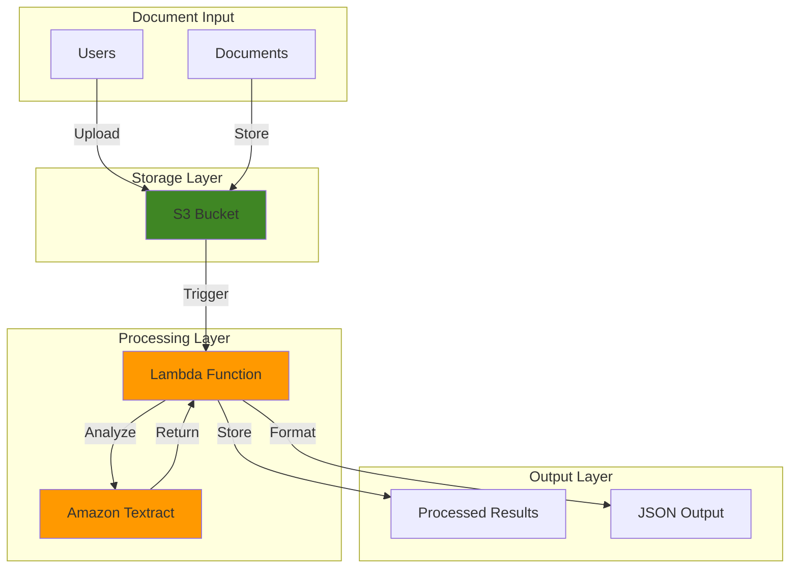

# Automated Document Extraction with Textract

## Problem

Organizations process thousands of documents daily containing critical business information trapped in PDFs, images, and forms. Manual data extraction is error-prone, time-consuming, and doesn't scale with business growth. Traditional OCR solutions struggle with complex layouts, tables, and handwritten text, creating bottlenecks in document-intensive workflows.

## Solution

Amazon Textract uses machine learning to automatically extract text, handwriting, and structured data from documents without manual template configuration. Combined with S3 for storage and Lambda for processing automation, this creates a scalable document processing pipeline that handles various document types and formats with high accuracy.

## Architecture Diagram



## Prerequisites

1. AWS account with permissions for S3, Lambda, and Textract services
2. AWS CLI v2 installed and configured (or AWS CloudShell)
3. Basic understanding of document processing and OCR concepts
4. Sample documents (PDFs, images) for testing - supported formats: JPEG, PNG, PDF, TIFF
5. Estimated cost: $5-10 for testing (S3 storage, Lambda execution, Textract API calls)

> **Note**: Textract supports files up to 10 MB for synchronous operations and up to 500 MB for asynchronous operations. PDF and TIFF files are limited to 1 page for synchronous operations.

## Preparation

```bash
# Set environment variables
export AWS_REGION=$(aws configure get region)
export AWS_ACCOUNT_ID=$(aws sts get-caller-identity \
    --query Account --output text)

# Generate unique identifiers for resources
RANDOM_SUFFIX=$(aws secretsmanager get-random-password \
    --exclude-punctuation --exclude-uppercase \
    --password-length 6 --require-each-included-type \
    --output text --query RandomPassword)

export BUCKET_NAME="textract-documents-${RANDOM_SUFFIX}"
export LAMBDA_FUNCTION_NAME="textract-processor-${RANDOM_SUFFIX}"
export ROLE_NAME="TextractProcessorRole-${RANDOM_SUFFIX}"

echo "Bucket Name: ${BUCKET_NAME}"
echo "Lambda Function: ${LAMBDA_FUNCTION_NAME}"
echo "IAM Role: ${ROLE_NAME}"
```

## Steps

1. **Create S3 Bucket for Document Storage**:

   Amazon S3 provides the durable, scalable storage foundation for our document processing pipeline. With 99.999999999% (11 9's) durability, S3 ensures document integrity while its event-driven architecture enables automatic processing when documents are uploaded.

   ```bash
   # Create the S3 bucket for document storage
   aws s3 mb s3://${BUCKET_NAME} --region ${AWS_REGION}
   
   # Enable versioning for document history tracking
   aws s3api put-bucket-versioning \
       --bucket ${BUCKET_NAME} \
       --versioning-configuration Status=Enabled
   
   # Enable server-side encryption for security
   aws s3api put-bucket-encryption \
       --bucket ${BUCKET_NAME} \
       --server-side-encryption-configuration \
       'Rules=[{ApplyServerSideEncryptionByDefault:{SSEAlgorithm:AES256}}]'
   
   echo "✅ S3 bucket created: ${BUCKET_NAME}"
   ```

   The bucket is now ready to receive documents and will automatically trigger processing workflows. Versioning ensures we maintain document history for audit trails and reprocessing capabilities while encryption protects sensitive document content.

2. **Create IAM Role for Lambda Function**:

   IAM roles enable secure, temporary credential delegation following the principle of least privilege. This ensures our Lambda function accesses only the specific AWS resources needed for document processing operations while maintaining strong security boundaries.

   ```bash
   # Create trust policy for Lambda service
   cat > trust-policy.json << 'EOF'
   {
       "Version": "2012-10-17",
       "Statement": [
           {
               "Effect": "Allow",
               "Principal": {
                   "Service": "lambda.amazonaws.com"
               },
               "Action": "sts:AssumeRole"
           }
       ]
   }
   EOF
   
   # Create the IAM role
   aws iam create-role \
       --role-name ${ROLE_NAME} \
       --assume-role-policy-document file://trust-policy.json
   
   echo "✅ IAM role created: ${ROLE_NAME}"
   ```

   The role foundation is established and ready for policy attachment. This security layer enables our Lambda function to interact with AWS services using temporary, rotatable credentials that follow AWS security best practices.

3. **Attach Required Permissions to IAM Role**:

   Granular permissions ensure our function can read from S3, call Textract APIs, and write logs to CloudWatch while maintaining security boundaries. These permissions follow AWS Well-Architected Framework security principles for document processing workloads.

   ```bash
   # Attach basic Lambda execution role for CloudWatch logging
   aws iam attach-role-policy \
       --role-name ${ROLE_NAME} \
       --policy-arn arn:aws:iam::aws:policy/service-role/AWSLambdaBasicExecutionRole
   
   # Create custom policy for S3 and Textract access
   cat > textract-policy.json << EOF
   {
       "Version": "2012-10-17",
       "Statement": [
           {
               "Effect": "Allow",
               "Action": [
                   "s3:GetObject",
                   "s3:PutObject"
               ],
               "Resource": "arn:aws:s3:::${BUCKET_NAME}/*"
           },
           {
               "Effect": "Allow",
               "Action": [
                   "textract:DetectDocumentText",
                   "textract:AnalyzeDocument"
               ],
               "Resource": "*"
           }
       ]
   }
   EOF
   
   # Create and attach the custom policy
   aws iam create-policy \
       --policy-name TextractProcessorPolicy-${RANDOM_SUFFIX} \
       --policy-document file://textract-policy.json
   
   aws iam attach-role-policy \
       --role-name ${ROLE_NAME} \
       --policy-arn arn:aws:iam::${AWS_ACCOUNT_ID}:policy/TextractProcessorPolicy-${RANDOM_SUFFIX}
   
   echo "✅ Permissions configured for S3 and Textract access"
   ```

   The role now has precisely the permissions needed for document processing operations. This configuration enables secure interaction with both S3 storage and Textract analysis services while preventing access to unauthorized resources.

4. **Create Lambda Function Code**:

   AWS Lambda provides serverless compute that automatically scales based on document processing demand. Our function orchestrates the Textract analysis workflow with intelligent error handling, confidence scoring, and structured output generation for downstream applications.

   ```bash
   # Create the Lambda function code
   cat > lambda_function.py << 'EOF'
   import json
   import boto3
   import urllib.parse
   import logging
   from botocore.exceptions import ClientError
   
   # Configure logging
   logger = logging.getLogger()
   logger.setLevel(logging.INFO)
   
   def lambda_handler(event, context):
       """
       Process documents uploaded to S3 using Amazon Textract
       """
       # Initialize AWS clients
       s3_client = boto3.client('s3')
       textract_client = boto3.client('textract')
       
       try:
           # Get the S3 bucket and object key from the event
           bucket = event['Records'][0]['s3']['bucket']['name']
           key = urllib.parse.unquote_plus(
               event['Records'][0]['s3']['object']['key'], 
               encoding='utf-8'
           )
           
           logger.info(f"Processing document: {key} from bucket: {bucket}")
           
           # Get object metadata for file size validation
           try:
               obj_metadata = s3_client.head_object(Bucket=bucket, Key=key)
               file_size = obj_metadata['ContentLength']
               
               # Check file size limit (10 MB for synchronous operations)
               if file_size > 10 * 1024 * 1024:
                   raise ValueError(f"File size {file_size} bytes exceeds 10 MB limit")
                   
           except ClientError as e:
               logger.error(f"Failed to get object metadata: {e}")
               raise
           
           # Call Textract to analyze the document
           response = textract_client.detect_document_text(
               Document={
                   'S3Object': {
                       'Bucket': bucket,
                       'Name': key
                   }
               }
           )
           
           # Extract text and metadata from the response
           extracted_text = ""
           confidence_scores = []
           word_count = 0
           line_count = 0
           
           for block in response['Blocks']:
               if block['BlockType'] == 'LINE':
                   extracted_text += block['Text'] + '\n'
                   confidence_scores.append(block['Confidence'])
                   line_count += 1
               elif block['BlockType'] == 'WORD':
                   word_count += 1
           
           # Calculate average confidence
           avg_confidence = sum(confidence_scores) / len(confidence_scores) if confidence_scores else 0
           
           # Prepare comprehensive results
           results = {
               'document': key,
               'extracted_text': extracted_text.strip(),
               'statistics': {
                   'average_confidence': round(avg_confidence, 2),
                   'total_blocks': len(response['Blocks']),
                   'line_count': line_count,
                   'word_count': word_count,
                   'file_size_bytes': file_size
               },
               'processing_status': 'completed',
               'timestamp': context.aws_request_id,
               'textract_job_id': response.get('JobId', 'synchronous_operation')
           }
           
           # Save results back to S3
           results_key = f"results/{key.split('/')[-1]}_results.json"
           s3_client.put_object(
               Bucket=bucket,
               Key=results_key,
               Body=json.dumps(results, indent=2),
               ContentType='application/json',
               ServerSideEncryption='AES256'
           )
           
           logger.info(f"Results saved to: {results_key}")
           logger.info(f"Average confidence: {avg_confidence}%, Words: {word_count}, Lines: {line_count}")
           
           return {
               'statusCode': 200,
               'body': json.dumps({
                   'message': 'Document processed successfully',
                   'results_location': f"s3://{bucket}/{results_key}",
                   'confidence': avg_confidence,
                   'statistics': results['statistics']
               })
           }
           
       except Exception as e:
           logger.error(f"Error processing document: {str(e)}")
           return {
               'statusCode': 500,
               'body': json.dumps({
                   'error': str(e),
                   'message': 'Document processing failed',
                   'document': key if 'key' in locals() else 'unknown'
               })
           }
   EOF
   
   # Package the function code
   zip lambda-function.zip lambda_function.py
   
   echo "✅ Lambda function code created and packaged"
   ```

   The function code implements intelligent document processing logic with comprehensive error handling, detailed statistics, and structured logging. This serverless approach automatically scales to handle varying document processing loads without infrastructure management.

5. **Deploy Lambda Function**:

   Deploying the Lambda function establishes our serverless document processing engine using the latest Python 3.12 runtime. The function will automatically respond to S3 events and orchestrate Textract analysis, creating a fully automated document processing pipeline.

   ```bash
   # Wait for IAM role propagation
   sleep 15
   
   # Create the Lambda function with latest Python runtime
   aws lambda create-function \
       --function-name ${LAMBDA_FUNCTION_NAME} \
       --runtime python3.12 \
       --role arn:aws:iam::${AWS_ACCOUNT_ID}:role/${ROLE_NAME} \
       --handler lambda_function.lambda_handler \
       --zip-file fileb://lambda-function.zip \
       --timeout 60 \
       --memory-size 512 \
       --environment Variables='{LOG_LEVEL=INFO}' \
       --description "Automated document processing with Textract"
   
   echo "✅ Lambda function deployed: ${LAMBDA_FUNCTION_NAME}"
   ```

   The function is now active with enhanced memory allocation (512MB) for better performance and detailed logging configuration. This setup can handle most document types efficiently while maintaining cost optimization through pay-per-invocation pricing.

6. **Configure S3 Event Notification**:

   S3 event notifications create the trigger mechanism that automatically initiates document processing when files are uploaded. This event-driven architecture ensures immediate processing without manual intervention, polling mechanisms, or infrastructure management overhead.

   ```bash
   # Get Lambda function ARN
   LAMBDA_ARN=$(aws lambda get-function \
       --function-name ${LAMBDA_FUNCTION_NAME} \
       --query 'Configuration.FunctionArn' \
       --output text)
   
   # Add permission for S3 to invoke Lambda
   aws lambda add-permission \
       --function-name ${LAMBDA_FUNCTION_NAME} \
       --principal s3.amazonaws.com \
       --action lambda:InvokeFunction \
       --statement-id s3-trigger-permission \
       --source-arn arn:aws:s3:::${BUCKET_NAME}
   
   # Create notification configuration with file type filtering
   cat > notification-config.json << EOF
   {
       "LambdaConfigurations": [
           {
               "Id": "DocumentProcessingTrigger",
               "LambdaFunctionArn": "${LAMBDA_ARN}",
               "Events": ["s3:ObjectCreated:*"],
               "Filter": {
                   "Key": {
                       "FilterRules": [
                           {
                               "Name": "prefix",
                               "Value": "documents/"
                           },
                           {
                               "Name": "suffix",
                               "Value": ".pdf"
                           }
                       ]
                   }
               }
           },
           {
               "Id": "ImageProcessingTrigger",
               "LambdaFunctionArn": "${LAMBDA_ARN}",
               "Events": ["s3:ObjectCreated:*"],
               "Filter": {
                   "Key": {
                       "FilterRules": [
                           {
                               "Name": "prefix",
                               "Value": "documents/"
                           },
                           {
                               "Name": "suffix",
                               "Value": ".jpg"
                           }
                       ]
                   }
               }
           }
       ]
   }
   EOF
   
   # Apply the notification configuration
   aws s3api put-bucket-notification-configuration \
       --bucket ${BUCKET_NAME} \
       --notification-configuration file://notification-config.json
   
   echo "✅ S3 event notification configured for documents/ prefix"
   ```

   The event-driven pipeline is now complete with intelligent file filtering. Documents uploaded to the "documents/" prefix with supported extensions will automatically trigger Textract processing, creating a seamless automation workflow that scales based on demand.

> **Note**: Amazon Textract provides industry-leading accuracy for text extraction and supports JPEG, PNG, PDF, and TIFF formats. For production environments, consider using Textract's asynchronous APIs for large documents (>10 MB). See [Amazon Textract Documentation](https://docs.aws.amazon.com/textract/) for advanced features like table and form extraction.

## Validation & Testing

1. Create test document folders and upload sample documents:

   ```bash
   # Create documents folder structure in S3
   aws s3api put-object \
       --bucket ${BUCKET_NAME} \
       --key documents/ \
       --body /dev/null
   
   # Create a comprehensive test document
   cat > test-document.txt << 'EOF'
   BUSINESS INVOICE
   
   Invoice Number: INV-2025-001
   Date: July 23, 2025
   
   Bill To:
   Customer Name: Tech Solutions Inc.
   Address: 123 Main Street, Seattle, WA 98101
   
   Services:
   - Software Development: $5,000.00
   - Technical Consulting: $2,500.00
   - System Integration: $1,500.00
   
   Total Amount: $9,000.00
   Payment Due: August 23, 2025
   EOF
   
   # Upload test documents
   aws s3 cp test-document.txt s3://${BUCKET_NAME}/documents/test-document.pdf
   
   echo "✅ Test document uploaded"
   ```

2. Monitor Lambda function execution and logs:

   ```bash
   # Wait for processing to complete
   sleep 20
   
   # Get the latest log stream
   LOG_GROUP="/aws/lambda/${LAMBDA_FUNCTION_NAME}"
   LATEST_STREAM=$(aws logs describe-log-streams \
       --log-group-name ${LOG_GROUP} \
       --order-by LastEventTime \
       --descending \
       --limit 1 \
       --query 'logStreams[0].logStreamName' \
       --output text)
   
   # Retrieve recent log events
   if [ "$LATEST_STREAM" != "None" ]; then
       aws logs get-log-events \
           --log-group-name ${LOG_GROUP} \
           --log-stream-name ${LATEST_STREAM} \
           --query 'events[].message' \
           --output text
   fi
   
   echo "✅ Check CloudWatch logs for processing details"
   ```

3. Verify processing results:

   ```bash
   # List all results in S3
   aws s3 ls s3://${BUCKET_NAME}/results/ --recursive
   
   # Download and examine results
   aws s3 cp s3://${BUCKET_NAME}/results/test-document.pdf_results.json ./
   
   # Display formatted results
   if [ -f "test-document.pdf_results.json" ]; then
       echo "=== Processing Results ==="
       cat test-document.pdf_results.json | \
           python3 -c "import sys, json; print(json.dumps(json.load(sys.stdin), indent=2))"
   fi
   ```

   Expected output: JSON file containing extracted text, confidence scores, word/line counts, and comprehensive processing metadata.

4. Test error handling with invalid file:

   ```bash
   # Create an invalid file to test error handling
   echo "This is not a valid document format" > invalid-file.xyz
   aws s3 cp invalid-file.xyz s3://${BUCKET_NAME}/documents/
   
   # Wait and check logs for error handling
   sleep 10
   echo "✅ Error handling test completed"
   ```

## Cleanup

1. Remove S3 bucket and all contents:

   ```bash
   # Remove all objects from bucket
   aws s3 rm s3://${BUCKET_NAME} --recursive
   
   # Delete the bucket
   aws s3 rb s3://${BUCKET_NAME}
   
   echo "✅ S3 bucket and contents deleted"
   ```

2. Delete Lambda function and permissions:

   ```bash
   # Delete the Lambda function
   aws lambda delete-function \
       --function-name ${LAMBDA_FUNCTION_NAME}
   
   echo "✅ Lambda function deleted"
   ```

3. Remove IAM role and attached policies:

   ```bash
   # Detach policies from role
   aws iam detach-role-policy \
       --role-name ${ROLE_NAME} \
       --policy-arn arn:aws:iam::aws:policy/service-role/AWSLambdaBasicExecutionRole
   
   aws iam detach-role-policy \
       --role-name ${ROLE_NAME} \
       --policy-arn arn:aws:iam::${AWS_ACCOUNT_ID}:policy/TextractProcessorPolicy-${RANDOM_SUFFIX}
   
   # Delete custom policy
   aws iam delete-policy \
       --policy-arn arn:aws:iam::${AWS_ACCOUNT_ID}:policy/TextractProcessorPolicy-${RANDOM_SUFFIX}
   
   # Delete IAM role
   aws iam delete-role --role-name ${ROLE_NAME}
   
   echo "✅ IAM resources cleaned up"
   ```

4. Remove local files and environment variables:

   ```bash
   # Clean up local files
   rm -f lambda_function.py lambda-function.zip trust-policy.json 
   rm -f textract-policy.json notification-config.json 
   rm -f test-document.txt test-document.pdf_results.json invalid-file.xyz
   
   # Unset environment variables
   unset BUCKET_NAME LAMBDA_FUNCTION_NAME ROLE_NAME RANDOM_SUFFIX
   
   echo "✅ Local files and environment cleaned up"
   ```

## Discussion

Amazon Textract revolutionizes document processing by leveraging machine learning to extract text, handwriting, and structured data from documents without requiring manual template configuration. Unlike traditional OCR solutions that struggle with complex layouts and varying document formats, Textract's ML models automatically adapt to different document types, providing consistent accuracy across PDFs, images, and forms. The service supports multiple languages including English, French, German, Italian, Portuguese, and Spanish, making it suitable for global document processing workflows.

The serverless architecture demonstrated in this recipe provides several key advantages for document processing workloads following AWS Well-Architected Framework principles. Lambda functions automatically scale based on document volume, eliminating the need for capacity planning and infrastructure management while providing cost optimization through pay-per-invocation pricing. S3 event notifications create an efficient event-driven workflow that processes documents immediately upon upload, reducing latency and manual intervention. This combination enables organizations to process thousands of documents daily without operational overhead.

Security and compliance considerations are built into this architecture through IAM roles and least-privilege access patterns. Documents remain encrypted in S3 with AES-256 server-side encryption, and processing occurs within AWS's secure infrastructure. For regulated industries, additional controls like VPC isolation, AWS KMS encryption, and comprehensive audit logging through CloudTrail can be easily integrated into this foundation. The architecture also supports compliance frameworks like HIPAA, SOC 2, and GDPR through AWS's shared responsibility model.

> **Tip**: For production deployments, implement dead letter queues for failed processing attempts and CloudWatch alarms for monitoring processing success rates. Consider using AWS X-Ray for distributed tracing to monitor end-to-end document processing performance. See [AWS Lambda Best Practices](https://docs.aws.amazon.com/lambda/latest/dg/best-practices.html) for additional optimization guidance.

Cost optimization becomes natural with this serverless approach, as you only pay for actual document processing time rather than idle infrastructure. Textract pricing is based on pages analyzed ($1.50 per 1,000 pages for synchronous text detection), making costs predictable and directly tied to business value. For high-volume scenarios, consider batching documents or using Textract's asynchronous APIs to optimize both performance and costs while taking advantage of bulk processing discounts.

## Challenge

Extend this solution by implementing these enhancements:

1. **Advanced Document Analysis**: Implement table and form extraction using Textract's AnalyzeDocument API with TABLES and FORMS features for structured data extraction, enabling extraction of key-value pairs and tabular data.

2. **Multi-Format Support**: Add document format detection and conversion capabilities using AWS services like Amazon Textract's AnalyzeExpense API for invoices and receipts, or integrate with Amazon Comprehend for document classification.

3. **Confidence-Based Routing**: Implement logic to route low-confidence extractions to human review queues using Amazon SQS for queuing and Amazon SNS for notifications, creating a hybrid human-AI workflow.

4. **Real-Time Processing Dashboard**: Create a web interface using Amazon API Gateway, AWS AppSync, and Amazon DynamoDB to track processing status and view extracted content in real-time with WebSocket support.

5. **Enterprise Integration**: Connect the pipeline to downstream systems like document management systems, ERP platforms, or data lakes using Amazon EventBridge for event routing and AWS Step Functions for complex workflow orchestration.

## Infrastructure Code

*Infrastructure code will be generated after recipe approval.*