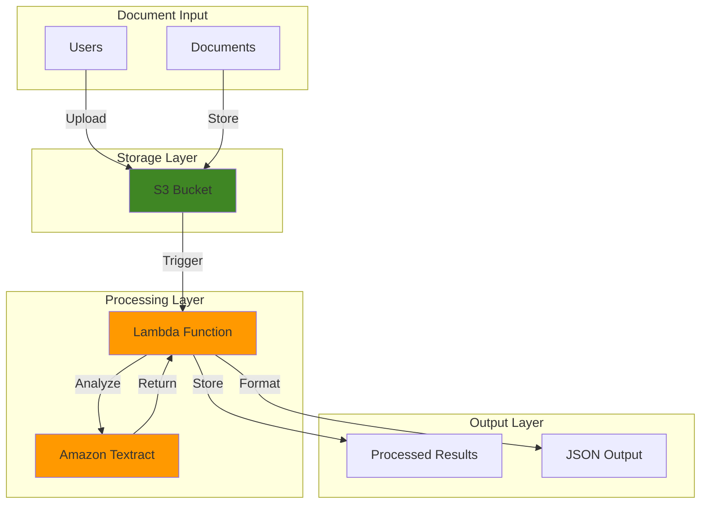

# Automated Document Extraction with Textract

## Problem

Organizations process thousands of documents daily containing critical business information trapped in PDFs, images, and forms. Manual data extraction is error-prone, time-consuming, and doesn't scale with business growth. Traditional OCR solutions struggle with complex layouts, tables, and handwritten text, creating bottlenecks in document-intensive workflows.

## Solution

Amazon Textract uses machine learning to automatically extract text, handwriting, and structured data from documents without manual template configuration. Combined with S3 for storage and Lambda for processing automation, this creates a scalable document processing pipeline that handles various document types and formats with high accuracy.

## Architecture Diagram



## Prerequisites

1. AWS account with permissions for S3, Lambda, and Textract services
2. AWS CLI v2 installed and configured (or AWS CloudShell)
3. Basic understanding of document processing and OCR concepts
4. Sample documents (PDFs, images) for testing
5. Estimated cost: $5-10 for testing (S3 storage, Lambda execution, Textract API calls)

## Preparation

```bash
# Set environment variables
export AWS_REGION=$(aws configure get region)
export AWS_ACCOUNT_ID=$(aws sts get-caller-identity \
    --query Account --output text)

# Generate unique identifiers for resources
RANDOM_SUFFIX=$(aws secretsmanager get-random-password \
    --exclude-punctuation --exclude-uppercase \
    --password-length 6 --require-each-included-type \
    --output text --query RandomPassword)

export BUCKET_NAME="textract-documents-${RANDOM_SUFFIX}"
export LAMBDA_FUNCTION_NAME="textract-processor-${RANDOM_SUFFIX}"
export ROLE_NAME="TextractProcessorRole-${RANDOM_SUFFIX}"

echo "Bucket Name: ${BUCKET_NAME}"
echo "Lambda Function: ${LAMBDA_FUNCTION_NAME}"
echo "IAM Role: ${ROLE_NAME}"
```

## Steps

1. **Create S3 Bucket for Document Storage**:

   Amazon S3 provides the durable, scalable storage foundation for our document processing pipeline. S3's event-driven architecture enables automatic processing when documents are uploaded, while its security features ensure document confidentiality throughout the workflow.

   ```bash
   # Create the S3 bucket for document storage
   aws s3 mb s3://${BUCKET_NAME} --region ${AWS_REGION}
   
   # Enable versioning for document history tracking
   aws s3api put-bucket-versioning \
       --bucket ${BUCKET_NAME} \
       --versioning-configuration Status=Enabled
   
   echo "✅ S3 bucket created: ${BUCKET_NAME}"
   ```

   The bucket is now ready to receive documents and will automatically trigger processing workflows. Versioning ensures we maintain document history for audit trails and reprocessing capabilities.

2. **Create IAM Role for Lambda Function**:

   IAM roles enable secure, temporary credential delegation without hardcoding secrets in application code. This principle of least privilege ensures our Lambda function accesses only the specific AWS resources it needs for document processing operations.

   ```bash
   # Create trust policy for Lambda service
   cat > trust-policy.json << 'EOF'
   {
       "Version": "2012-10-17",
       "Statement": [
           {
               "Effect": "Allow",
               "Principal": {
                   "Service": "lambda.amazonaws.com"
               },
               "Action": "sts:AssumeRole"
           }
       ]
   }
   EOF
   
   # Create the IAM role
   aws iam create-role \
       --role-name ${ROLE_NAME} \
       --assume-role-policy-document file://trust-policy.json
   
   echo "✅ IAM role created: ${ROLE_NAME}"
   ```

   The role foundation is established and ready for policy attachment. This security layer enables our Lambda function to interact with AWS services using temporary, rotatable credentials.

3. **Attach Required Permissions to IAM Role**:

   Granular permissions ensure our function can read from S3, call Textract APIs, and write logs to CloudWatch while maintaining security boundaries. These permissions follow AWS security best practices for document processing workloads.

   ```bash
   # Attach basic Lambda execution role
   aws iam attach-role-policy \
       --role-name ${ROLE_NAME} \
       --policy-arn arn:aws:iam::aws:policy/service-role/AWSLambdaBasicExecutionRole
   
   # Create custom policy for S3 and Textract access
   cat > textract-policy.json << EOF
   {
       "Version": "2012-10-17",
       "Statement": [
           {
               "Effect": "Allow",
               "Action": [
                   "s3:GetObject",
                   "s3:PutObject"
               ],
               "Resource": "arn:aws:s3:::${BUCKET_NAME}/*"
           },
           {
               "Effect": "Allow",
               "Action": [
                   "textract:DetectDocumentText",
                   "textract:AnalyzeDocument"
               ],
               "Resource": "*"
           }
       ]
   }
   EOF
   
   # Create and attach the custom policy
   aws iam create-policy \
       --policy-name TextractProcessorPolicy-${RANDOM_SUFFIX} \
       --policy-document file://textract-policy.json
   
   aws iam attach-role-policy \
       --role-name ${ROLE_NAME} \
       --policy-arn arn:aws:iam::${AWS_ACCOUNT_ID}:policy/TextractProcessorPolicy-${RANDOM_SUFFIX}
   
   echo "✅ Permissions configured for S3 and Textract access"
   ```

   The role now has precisely the permissions needed for document processing operations. This configuration enables secure interaction with both S3 storage and Textract analysis services.

4. **Create Lambda Function Code**:

   AWS Lambda provides serverless compute that automatically scales based on document processing demand. Our function will orchestrate the Textract analysis workflow, handling various document types and extracting structured data for downstream applications.

   ```bash
   # Create the Lambda function code
   cat > lambda_function.py << 'EOF'
   import json
   import boto3
   import urllib.parse
   
   def lambda_handler(event, context):
       """
       Process documents uploaded to S3 using Amazon Textract
       """
       # Initialize AWS clients
       s3_client = boto3.client('s3')
       textract_client = boto3.client('textract')
       
       try:
           # Get the S3 bucket and object key from the event
           bucket = event['Records'][0]['s3']['bucket']['name']
           key = urllib.parse.unquote_plus(
               event['Records'][0]['s3']['object']['key'], 
               encoding='utf-8'
           )
           
           print(f"Processing document: {key} from bucket: {bucket}")
           
           # Call Textract to analyze the document
           response = textract_client.detect_document_text(
               Document={
                   'S3Object': {
                       'Bucket': bucket,
                       'Name': key
                   }
               }
           )
           
           # Extract text from the response
           extracted_text = ""
           confidence_scores = []
           
           for block in response['Blocks']:
               if block['BlockType'] == 'LINE':
                   extracted_text += block['Text'] + '\n'
                   confidence_scores.append(block['Confidence'])
           
           # Calculate average confidence
           avg_confidence = sum(confidence_scores) / len(confidence_scores) if confidence_scores else 0
           
           # Prepare results
           results = {
               'document': key,
               'extracted_text': extracted_text.strip(),
               'average_confidence': round(avg_confidence, 2),
               'total_blocks': len(response['Blocks']),
               'processing_status': 'completed'
           }
           
           # Save results back to S3
           results_key = f"results/{key.split('/')[-1]}_results.json"
           s3_client.put_object(
               Bucket=bucket,
               Key=results_key,
               Body=json.dumps(results, indent=2),
               ContentType='application/json'
           )
           
           print(f"Results saved to: {results_key}")
           print(f"Average confidence: {avg_confidence}%")
           
           return {
               'statusCode': 200,
               'body': json.dumps({
                   'message': 'Document processed successfully',
                   'results_location': f"s3://{bucket}/{results_key}",
                   'confidence': avg_confidence
               })
           }
           
       except Exception as e:
           print(f"Error processing document: {str(e)}")
           return {
               'statusCode': 500,
               'body': json.dumps({
                   'error': str(e),
                   'message': 'Document processing failed'
               })
           }
   EOF
   
   # Package the function code
   zip lambda-function.zip lambda_function.py
   
   echo "✅ Lambda function code created and packaged"
   ```

   The function code implements intelligent document processing logic with error handling and confidence scoring. This serverless approach automatically scales to handle varying document processing loads without infrastructure management.

5. **Deploy Lambda Function**:

   Deploying the Lambda function establishes our serverless document processing engine. The function will automatically respond to S3 events and orchestrate Textract analysis, creating a fully automated document processing pipeline.

   ```bash
   # Wait for IAM role propagation
   sleep 10
   
   # Create the Lambda function
   aws lambda create-function \
       --function-name ${LAMBDA_FUNCTION_NAME} \
       --runtime python3.9 \
       --role arn:aws:iam::${AWS_ACCOUNT_ID}:role/${ROLE_NAME} \
       --handler lambda_function.lambda_handler \
       --zip-file fileb://lambda-function.zip \
       --timeout 60 \
       --memory-size 256
   
   echo "✅ Lambda function deployed: ${LAMBDA_FUNCTION_NAME}"
   ```

   The function is now active and ready to process documents. With 60-second timeout and 256MB memory, it can handle most document types efficiently while maintaining cost optimization.

6. **Configure S3 Event Notification**:

   S3 event notifications create the trigger mechanism that automatically initiates document processing when files are uploaded. This event-driven architecture ensures immediate processing without manual intervention or polling mechanisms.

   ```bash
   # Get Lambda function ARN
   LAMBDA_ARN=$(aws lambda get-function \
       --function-name ${LAMBDA_FUNCTION_NAME} \
       --query 'Configuration.FunctionArn' \
       --output text)
   
   # Add permission for S3 to invoke Lambda
   aws lambda add-permission \
       --function-name ${LAMBDA_FUNCTION_NAME} \
       --principal s3.amazonaws.com \
       --action lambda:InvokeFunction \
       --statement-id s3-trigger-permission \
       --source-arn arn:aws:s3:::${BUCKET_NAME}
   
   # Create notification configuration
   cat > notification-config.json << EOF
   {
       "LambdaConfigurations": [
           {
               "Id": "ObjectCreateEvents",
               "LambdaFunctionArn": "${LAMBDA_ARN}",
               "Events": ["s3:ObjectCreated:*"],
               "Filter": {
                   "Key": {
                       "FilterRules": [
                           {
                               "Name": "prefix",
                               "Value": "documents/"
                           }
                       ]
                   }
               }
           }
       ]
   }
   EOF
   
   # Apply the notification configuration
   aws s3api put-bucket-notification-configuration \
       --bucket ${BUCKET_NAME} \
       --notification-configuration file://notification-config.json
   
   echo "✅ S3 event notification configured for documents/ prefix"
   ```

   The event-driven pipeline is now complete. Documents uploaded to the "documents/" prefix will automatically trigger Textract processing, creating a seamless automation workflow.

> **Note**: Amazon Textract provides industry-leading accuracy for text extraction and supports various document formats including PDFs, images, and forms. For production environments, consider using Textract's asynchronous APIs for large documents. See [Amazon Textract Documentation](https://docs.aws.amazon.com/textract/) for advanced features like table and form extraction.

## Validation & Testing

1. Create a test document folder and upload a sample document:

   ```bash
   # Create documents folder in S3
   aws s3api put-object \
       --bucket ${BUCKET_NAME} \
       --key documents/ \
       --body /dev/null
   
   # Upload a test document (replace with your document path)
   echo "This is a test document for Textract processing." > test-document.txt
   aws s3 cp test-document.txt s3://${BUCKET_NAME}/documents/
   
   echo "✅ Test document uploaded"
   ```

2. Monitor Lambda function execution:

   ```bash
   # Wait for processing to complete
   sleep 15
   
   # Check Lambda function logs
   aws logs describe-log-groups \
       --log-group-name-prefix /aws/lambda/${LAMBDA_FUNCTION_NAME}
   
   echo "✅ Check CloudWatch logs for processing details"
   ```

3. Verify results were created:

   ```bash
   # List results in S3
   aws s3 ls s3://${BUCKET_NAME}/results/
   
   # Download and view results
   aws s3 cp s3://${BUCKET_NAME}/results/test-document.txt_results.json ./
   cat test-document.txt_results.json
   ```

   Expected output: JSON file containing extracted text, confidence scores, and processing metadata.

## Cleanup

1. Remove S3 bucket and contents:

   ```bash
   # Remove all objects from bucket
   aws s3 rm s3://${BUCKET_NAME} --recursive
   
   # Delete the bucket
   aws s3 rb s3://${BUCKET_NAME}
   
   echo "✅ S3 bucket deleted"
   ```

2. Delete Lambda function:

   ```bash
   # Delete the Lambda function
   aws lambda delete-function \
       --function-name ${LAMBDA_FUNCTION_NAME}
   
   echo "✅ Lambda function deleted"
   ```

3. Remove IAM role and policies:

   ```bash
   # Detach policies from role
   aws iam detach-role-policy \
       --role-name ${ROLE_NAME} \
       --policy-arn arn:aws:iam::aws:policy/service-role/AWSLambdaBasicExecutionRole
   
   aws iam detach-role-policy \
       --role-name ${ROLE_NAME} \
       --policy-arn arn:aws:iam::${AWS_ACCOUNT_ID}:policy/TextractProcessorPolicy-${RANDOM_SUFFIX}
   
   # Delete custom policy
   aws iam delete-policy \
       --policy-arn arn:aws:iam::${AWS_ACCOUNT_ID}:policy/TextractProcessorPolicy-${RANDOM_SUFFIX}
   
   # Delete IAM role
   aws iam delete-role --role-name ${ROLE_NAME}
   
   echo "✅ IAM resources cleaned up"
   ```

4. Remove local files:

   ```bash
   # Clean up local files
   rm -f lambda_function.py lambda-function.zip trust-policy.json textract-policy.json notification-config.json test-document.txt test-document.txt_results.json
   
   echo "✅ Local files cleaned up"
   ```

## Discussion

Amazon Textract revolutionizes document processing by leveraging machine learning to extract text, handwriting, and structured data from documents without requiring manual template configuration. Unlike traditional OCR solutions that struggle with complex layouts and varying document formats, Textract's ML models automatically adapt to different document types, providing consistent accuracy across PDFs, images, and forms.

The serverless architecture demonstrated in this recipe provides several key advantages for document processing workloads. Lambda functions automatically scale based on document volume, eliminating the need for capacity planning and infrastructure management. S3 event notifications create an efficient event-driven workflow that processes documents immediately upon upload, reducing latency and manual intervention. This combination enables organizations to process thousands of documents daily without operational overhead.

Security and compliance considerations are built into this architecture through IAM roles and least-privilege access patterns. Documents remain encrypted in S3, and processing occurs within AWS's secure infrastructure. For regulated industries, additional controls like VPC isolation, KMS encryption, and audit logging can be easily integrated into this foundation.

> **Tip**: For production deployments, consider implementing dead letter queues for failed processing attempts and CloudWatch alarms for monitoring processing success rates. This ensures robust error handling and operational visibility.

Cost optimization becomes natural with this serverless approach, as you only pay for actual document processing time rather than idle infrastructure. Textract pricing is based on pages analyzed, making costs predictable and directly tied to business value. For high-volume scenarios, consider batching documents or using Textract's asynchronous APIs to optimize both performance and costs.

## Challenge

Extend this solution by implementing these enhancements:

1. **Advanced Document Analysis**: Implement table and form extraction using Textract's AnalyzeDocument API with TABLES and FORMS features for structured data extraction.

2. **Multi-Format Support**: Add document format detection and conversion capabilities to handle Word documents, Excel files, and other formats before Textract processing.

3. **Confidence-Based Routing**: Implement logic to route low-confidence extractions to human review queues using Amazon SQS and SNS notifications.

4. **Real-Time Processing Dashboard**: Create a web interface using API Gateway and DynamoDB to track processing status and view extracted content in real-time.

5. **Enterprise Integration**: Connect the pipeline to downstream systems like document management systems, ERP platforms, or data lakes using EventBridge and Step Functions orchestration.

## Infrastructure Code

*Infrastructure code will be generated after recipe approval.*