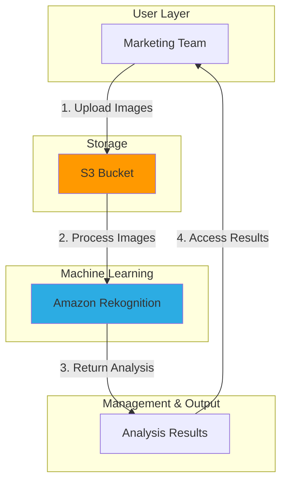

# Automated Image Analysis with ML

## Problem

A marketing team needs to analyze thousands of product images to identify objects, scenes, and text. Manual analysis is time-consuming, inconsistent, and delays campaigns. The team needs an automated solution that can quickly analyze images at scale to extract meaningful insights without requiring specialized machine learning expertise.

## Solution

We'll build an image analysis solution using Amazon Rekognition that automatically detects objects, scenes, text, and unsafe content in images. By leveraging Amazon S3 for storage and Amazon Rekognition's pre-trained machine learning models, the marketing team can analyze images at scale without machine learning expertise, improving campaign efficiency and content relevance.

## Architecture Diagram



## Prerequisites

1. An AWS account with appropriate permissions for Amazon Rekognition and Amazon S3
2. AWS CLI v2 installed and configured ([Installation instructions](https://docs.aws.amazon.com/cli/latest/userguide/getting-started-install.html))
3. Basic knowledge of AWS CLI commands and JSON format
4. Sample images for analysis (JPG or PNG format)
5. Estimated cost: Less than $1 USD for analyzing about 100 images (Rekognition charges $1 per 1,000 images)

> **Note**: Free tier includes 5,000 images processed per month for the first 12 months

## Preparation

```bash
# Set environment variables
export AWS_REGION=$(aws configure get region)
export AWS_ACCOUNT_ID=$(aws sts get-caller-identity \
    --query Account --output text)

# Generate unique identifier for S3 bucket
RANDOM_SUFFIX=$(aws secretsmanager get-random-password \
    --exclude-punctuation --exclude-uppercase \
    --password-length 6 --require-each-included-type \
    --output text --query RandomPassword)

# Set the S3 bucket name using the random suffix
export BUCKET_NAME="rekognition-images-${RANDOM_SUFFIX}"

# Create S3 bucket for storing images
aws s3 mb s3://${BUCKET_NAME} --region ${AWS_REGION}

# Create a directory for sample images and results
mkdir -p ~/rekognition-demo/images
mkdir -p ~/rekognition-demo/results

echo "✅ Preparation complete. Created S3 bucket: ${BUCKET_NAME}"
```

## Steps

1. **Upload Sample Images to S3**:

   This step uploads your images to S3 so that Amazon Rekognition can access them. S3 serves as a secure, scalable storage platform that integrates seamlessly with Rekognition's APIs. The bucket structure we're creating organizes images in a dedicated folder, making it easier to manage multiple projects.

   ```bash
   # Upload your sample images to S3 bucket
   # Replace with the path to your image files
   aws s3 cp ~/path/to/your/images/ s3://${BUCKET_NAME}/images/ \
       --recursive

   # Alternatively, you can use a sample image from a public URL
   # Download sample image
   curl -o ~/rekognition-demo/images/sample.jpg \
       https://images.pexels.com/photos/3184418/pexels-photo-3184418.jpeg
   
   # Upload the sample image to S3
   aws s3 cp ~/rekognition-demo/images/sample.jpg \
       s3://${BUCKET_NAME}/images/
   
   echo "✅ Images uploaded to S3 bucket: ${BUCKET_NAME}"
   ```

   The images are now stored in S3 and ready for analysis. Amazon Rekognition can now access these images directly from the S3 bucket, enabling efficient processing without transferring large files through API calls.

2. **Detect Labels (Objects and Scenes)**:

   Label detection identifies objects, concepts, activities, and scenes in images. Rekognition's pre-trained models can recognize thousands of common objects like vehicles, animals, furniture, and activities. The confidence scores help you filter results based on your accuracy requirements for production applications.

   ```bash
   # Set the image name
   IMAGE_NAME="sample.jpg"
   
   # Detect labels in the image
   aws rekognition detect-labels \
       --image "{'S3Object':{'Bucket':'${BUCKET_NAME}','Name':'images/${IMAGE_NAME}'}}" \
       --features GENERAL_LABELS \
       --settings "{'GeneralLabels':{'LabelInclusionFilters':[],'LabelExclusionFilters':[],'LabelCategoryInclusionFilters':[],'LabelCategoryExclusionFilters':[]}}" \
       --region ${AWS_REGION} > ~/rekognition-demo/results/labels-result.json
   
   # Display the top 5 labels detected
   echo "Top 5 labels detected:"
   cat ~/rekognition-demo/results/labels-result.json | \
       jq -r '.Labels | sort_by(-.Confidence) | .[0:5] | .[] | "\(.Name): \(.Confidence | floor)%"'
   
   echo "✅ Label detection complete"
   ```

3. **Detect Text in Images**:

   Amazon Rekognition's text detection uses Optical Character Recognition (OCR) to extract text from images. This is particularly useful for analyzing product packaging, signage, documents, or any images containing textual information. The service can detect both machine-printed and handwritten text.

   ```bash
   # Detect text in the image
   aws rekognition detect-text \
       --image "{'S3Object':{'Bucket':'${BUCKET_NAME}','Name':'images/${IMAGE_NAME}'}}" \
       --region ${AWS_REGION} > ~/rekognition-demo/results/text-result.json
   
   # Display detected text
   echo "Text detected in image:"
   cat ~/rekognition-demo/results/text-result.json | \
       jq -r '.TextDetections | .[] | select(.Type=="LINE") | .DetectedText'
   
   echo "✅ Text detection complete"
   ```

   > **Tip**: Text detection works best with high-contrast text against solid backgrounds. For complex layouts, consider preprocessing images to improve text extraction accuracy. See [Amazon Rekognition text detection best practices](https://docs.aws.amazon.com/rekognition/latest/dg/text-detection.html).

4. **Analyze for Unsafe Content**:

   Content moderation automatically detects potentially inappropriate content including explicit nudity, suggestive content, violence, and other unsafe materials. This feature is essential for platforms that allow user-generated content or need to ensure brand-safe advertising placements.

   ```bash
   # Detect unsafe content in the image
   aws rekognition detect-moderation-labels \
       --image "{'S3Object':{'Bucket':'${BUCKET_NAME}','Name':'images/${IMAGE_NAME}'}}" \
       --region ${AWS_REGION} > ~/rekognition-demo/results/moderation-result.json
   
   # Check if unsafe content was detected
   UNSAFE_CONTENT=$(cat ~/rekognition-demo/results/moderation-result.json | \
       jq -r '.ModerationLabels | length')
   
   if [ $UNSAFE_CONTENT -eq 0 ]; then
       echo "No unsafe content detected in the image"
   else
       echo "Warning: Unsafe content detected:"
       cat ~/rekognition-demo/results/moderation-result.json | \
           jq -r '.ModerationLabels[] | "\(.Name): \(.Confidence | floor)%"'
   fi
   
   echo "✅ Content moderation analysis complete"
   ```

5. **Process Multiple Images**:

   Scaling image analysis to handle multiple images efficiently is crucial for production workloads. This step demonstrates how to create a reusable script that can process entire image collections, applying the same analysis operations to each image. This batch processing approach reduces manual effort and ensures consistent analysis across all your content.

   ```bash
   # Create a script to analyze multiple images
   cat > ~/rekognition-demo/analyze-images.sh << 'EOF'
   #!/bin/bash
   
   # Get environment variables
   BUCKET_NAME=$1
   AWS_REGION=$2
   OUTPUT_DIR=$3
   
   # Get the list of images
   IMAGES=$(aws s3 ls s3://${BUCKET_NAME}/images/ | awk '{print $4}')
   
   # Process each image
   for IMAGE in $IMAGES; do
       if [[ $IMAGE == *.jpg || $IMAGE == *.jpeg || $IMAGE == *.png ]]; then
           echo "Analyzing image: $IMAGE"
           
           # Create output directory for this image
           mkdir -p ${OUTPUT_DIR}/${IMAGE}
           
           # Detect labels
           aws rekognition detect-labels \
               --image "{'S3Object':{'Bucket':'${BUCKET_NAME}','Name':'images/${IMAGE}'}}" \
               --features GENERAL_LABELS \
               --region ${AWS_REGION} > ${OUTPUT_DIR}/${IMAGE}/labels.json
           
           # Detect text
           aws rekognition detect-text \
               --image "{'S3Object':{'Bucket':'${BUCKET_NAME}','Name':'images/${IMAGE}'}}" \
               --region ${AWS_REGION} > ${OUTPUT_DIR}/${IMAGE}/text.json
           
           echo "✅ Analysis completed for $IMAGE"
       fi
   done
   
   echo "✅ All images analyzed successfully"
   EOF
   
   # Make the script executable
   chmod +x ~/rekognition-demo/analyze-images.sh
   
   # Run the script for all images
   ~/rekognition-demo/analyze-images.sh \
       ${BUCKET_NAME} \
       ${AWS_REGION} \
       ~/rekognition-demo/results
   
   echo "✅ Batch image analysis complete"
   ```

   The batch processing script is now configured and has processed all images in your S3 bucket. This automated approach scales efficiently to handle hundreds or thousands of images, organizing results in a structured directory format that makes it easy to access individual image analysis data programmatically.

   When processing large batches in production, be mindful of [API rate limits](https://docs.aws.amazon.com/rekognition/latest/dg/limits.html) and consider implementing exponential backoff and retry logic.

6. **Create a Summary Report**:

   Converting raw JSON analysis results into a human-readable format is essential for business stakeholders who need to understand the insights extracted from images. This step creates a comprehensive markdown report that summarizes all detected objects, scenes, and text across your entire image collection, making the analysis results accessible to non-technical team members.

   ```bash
   # Create a script to generate a summary report
   cat > ~/rekognition-demo/generate-report.sh << 'EOF'
   #!/bin/bash
   
   # Get parameters
   RESULTS_DIR=$1
   
   # Create report file
   REPORT_FILE="${RESULTS_DIR}/analysis-report.md"
   
   # Create report header
   echo "# Image Analysis Report" > ${REPORT_FILE}
   echo "Generated on: $(date)" >> ${REPORT_FILE}
   echo "" >> ${REPORT_FILE}
   
   # Process each image result
   for IMAGE_DIR in ${RESULTS_DIR}/*; do
       if [ -d "${IMAGE_DIR}" ]; then
           IMAGE_NAME=$(basename ${IMAGE_DIR})
           echo "## Image: ${IMAGE_NAME}" >> ${REPORT_FILE}
           
           # Add label analysis
           echo "### Detected Objects and Scenes" >> ${REPORT_FILE}
           echo "" >> ${REPORT_FILE}
           
           if [ -f "${IMAGE_DIR}/labels.json" ]; then
               TOP_LABELS=$(cat ${IMAGE_DIR}/labels.json | \
                   jq -r '.Labels | sort_by(-.Confidence) | .[0:5] | .[] | "- \(.Name): \(.Confidence | floor)%"')
               echo "${TOP_LABELS}" >> ${REPORT_FILE}
           else
               echo "- No label analysis available" >> ${REPORT_FILE}
           fi
           
           echo "" >> ${REPORT_FILE}
           
           # Add text analysis
           echo "### Detected Text" >> ${REPORT_FILE}
           echo "" >> ${REPORT_FILE}
           
           if [ -f "${IMAGE_DIR}/text.json" ]; then
               TEXT=$(cat ${IMAGE_DIR}/text.json | \
                   jq -r '.TextDetections | .[] | select(.Type=="LINE") | "- \(.DetectedText)"')
               
               if [ -z "${TEXT}" ]; then
                   echo "- No text detected" >> ${REPORT_FILE}
               else
                   echo "${TEXT}" >> ${REPORT_FILE}
               fi
           else
               echo "- No text analysis available" >> ${REPORT_FILE}
           fi
           
           echo "" >> ${REPORT_FILE}
           echo "---" >> ${REPORT_FILE}
           echo "" >> ${REPORT_FILE}
       fi
   done
   
   echo "Report generated at: ${REPORT_FILE}"
   EOF
   
   # Make the script executable
   chmod +x ~/rekognition-demo/generate-report.sh
   
   # Generate the report
   ~/rekognition-demo/generate-report.sh ~/rekognition-demo/results
   
   echo "✅ Analysis report generated"
   ```

   The comprehensive analysis report is now available, providing a business-friendly summary of all image analysis results. This formatted report enables stakeholders to quickly understand content insights, identify trends across image collections, and make data-driven decisions about content strategy and campaign optimization.

## Validation & Testing

1. Verify the S3 bucket was created and images were uploaded:

   ```bash
   # Verify S3 bucket creation
   aws s3 ls | grep ${BUCKET_NAME}
   
   # List uploaded images
   aws s3 ls s3://${BUCKET_NAME}/images/
   ```

   Expected output: List of your uploaded images

2. Review the label detection results:

   ```bash
   # Check if the results file exists
   ls -l ~/rekognition-demo/results/
   
   # View the labels detected in a sample image
   cat ~/rekognition-demo/results/labels-result.json | jq '.Labels | .[0:3]'
   ```

   Expected output: JSON data showing detected labels with confidence scores

3. Examine the generated analysis report:

   ```bash
   # View the report
   cat ~/rekognition-demo/results/analysis-report.md
   ```

   Expected output: A Markdown report with sections for each image showing detected labels and text

## Cleanup

1. Remove the objects from the S3 bucket:

   ```bash
   # Delete all objects in the bucket
   aws s3 rm s3://${BUCKET_NAME} --recursive
   
   echo "✅ Removed all objects from bucket"
   ```

2. Delete the S3 bucket:

   ```bash
   # Delete the S3 bucket
   aws s3 rb s3://${BUCKET_NAME}
   
   echo "✅ Deleted S3 bucket: ${BUCKET_NAME}"
   ```

3. Clean up local files (optional):

   ```bash
   # Remove local directories
   rm -rf ~/rekognition-demo
   
   echo "✅ Removed local files"
   ```

## Discussion

Amazon Rekognition simplifies image analysis by providing pre-trained machine learning models that can detect objects, scenes, text, and content moderation in images without requiring any machine learning expertise. This service is perfect for businesses that need to process large volumes of images efficiently and extract meaningful insights.

The solution we built demonstrates three key capabilities of Amazon Rekognition: label detection for identifying objects and scenes, text detection for extracting text from images, and content moderation for identifying inappropriate content. These features can be combined to create powerful applications for various use cases such as content moderation, visual search, and automated image categorization.

One important consideration when using Amazon Rekognition is confidence scores. Every detection comes with a confidence percentage indicating how sure the model is about the prediction. In production applications, you may want to filter results based on a minimum confidence threshold (typically 70-90%) to ensure high accuracy. This approach reduces false positives and improves the relevance of the analysis results.

> **Tip**: For better performance with large image collections, consider using asynchronous operations with Amazon SQS to process images in parallel or implement event-triggered processing using Amazon S3 events and AWS Lambda.

The architecture we used follows AWS best practices by separating storage (S3) from processing (Rekognition) and presenting the results in a useful format. This separation of concerns allows each component to scale independently and makes the solution more maintainable.

## Challenge

Extend this solution by implementing these enhancements:

1. Create an AWS Lambda function that automatically triggers image analysis when new images are uploaded to the S3 bucket using S3 event notifications.

2. Store the analysis results in Amazon DynamoDB to create a searchable database of image content and enable querying images by detected objects or text.

3. Implement a simple web interface using Amazon API Gateway and AWS Lambda to allow users to upload images and view analysis results in real-time.

4. Add face detection capabilities to identify the presence of people in images and analyze attributes like age range, emotions, and gender using the `detect-faces` API.

5. Create an advanced content classification system by combining Rekognition with Amazon Comprehend to analyze both visual content and extracted text, enabling more sophisticated content categorization.

## Infrastructure Code

*Infrastructure code will be generated after recipe approval.*