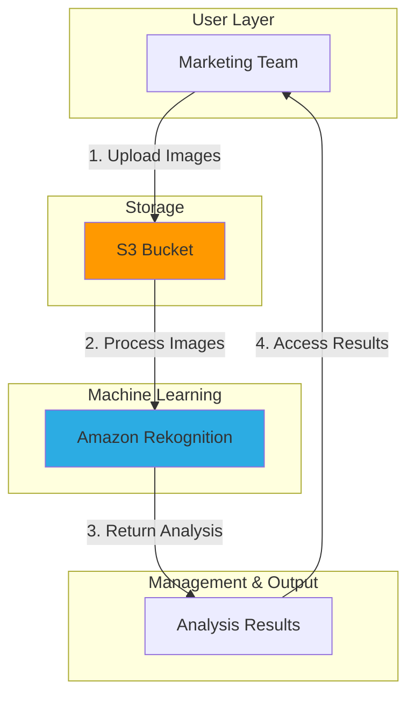

# Automated Image Analysis with ML

## Problem

A marketing team needs to analyze thousands of product images to identify objects, scenes, and text. Manual analysis is time-consuming, inconsistent, and delays campaigns. The team needs an automated solution that can quickly analyze images at scale to extract meaningful insights without requiring specialized machine learning expertise.

## Solution

We'll build an image analysis solution using Amazon Rekognition that automatically detects objects, scenes, text, and unsafe content in images. By leveraging Amazon S3 for storage and Amazon Rekognition's pre-trained machine learning models, the marketing team can analyze images at scale without machine learning expertise, improving campaign efficiency and content relevance.

## Architecture Diagram



## Prerequisites

1. AWS account with appropriate permissions for Amazon Rekognition and Amazon S3
2. AWS CLI v2 installed and configured ([Installation instructions](https://docs.aws.amazon.com/cli/latest/userguide/getting-started-install.html))
3. Basic knowledge of AWS CLI commands and JSON format
4. Sample images for analysis (JPG or PNG format)
5. Estimated cost: $1 per 1,000 images analyzed (Free tier: 5,000 images per month for first 12 months)

> **Note**: Amazon Rekognition pricing includes $1.00 per 1,000 images for object and scene detection, text detection, and content moderation. Review [Amazon Rekognition pricing](https://aws.amazon.com/rekognition/pricing/) for current rates.

## Preparation

```bash
# Set environment variables
export AWS_REGION=$(aws configure get region)
export AWS_ACCOUNT_ID=$(aws sts get-caller-identity \
    --query Account --output text)

# Generate unique identifier for S3 bucket
RANDOM_SUFFIX=$(aws secretsmanager get-random-password \
    --exclude-punctuation --exclude-uppercase \
    --password-length 6 --require-each-included-type \
    --output text --query RandomPassword)

# Set the S3 bucket name using the random suffix
export BUCKET_NAME="rekognition-images-${RANDOM_SUFFIX}"

# Create S3 bucket with versioning and encryption
aws s3 mb s3://${BUCKET_NAME} --region ${AWS_REGION}

aws s3api put-bucket-versioning \
    --bucket ${BUCKET_NAME} \
    --versioning-configuration Status=Enabled

aws s3api put-bucket-encryption \
    --bucket ${BUCKET_NAME} \
    --server-side-encryption-configuration \
    'Rules=[{ApplyServerSideEncryptionByDefault:{SSEAlgorithm:AES256}}]'

# Create local directories for sample images and results
mkdir -p ~/rekognition-demo/images
mkdir -p ~/rekognition-demo/results

echo "✅ Preparation complete. Created S3 bucket: ${BUCKET_NAME}"
```

## Steps

1. **Upload Sample Images to S3**:

   Amazon S3 provides highly durable object storage with 99.999999999% (11 9's) durability, making it the ideal foundation for our image analysis workflow. S3 serves as a secure, scalable storage platform that integrates seamlessly with Rekognition's APIs, enabling efficient processing without transferring large files through API calls.

   ```bash
   # Upload your sample images to S3 bucket
   # Replace with the path to your image files
   aws s3 cp ~/path/to/your/images/ s3://${BUCKET_NAME}/images/ \
       --recursive

   # Alternatively, download and use a sample image
   curl -o ~/rekognition-demo/images/sample.jpg \
       "https://images.pexels.com/photos/3184418/pexels-photo-3184418.jpeg"
   
   # Upload the sample image to S3
   aws s3 cp ~/rekognition-demo/images/sample.jpg \
       s3://${BUCKET_NAME}/images/
   
   echo "✅ Images uploaded to S3 bucket: ${BUCKET_NAME}"
   ```

   The images are now stored in S3 and ready for analysis. Amazon Rekognition can access these images directly from the S3 bucket, enabling efficient processing while maintaining security through IAM permissions and S3 access controls.

2. **Detect Labels (Objects and Scenes)**:

   Amazon Rekognition's label detection uses deep learning models trained on millions of images to identify thousands of objects, concepts, activities, and scenes. The service provides confidence scores (0-100%) that help you filter results based on your accuracy requirements for production applications.

   ```bash
   # Set the image name
   IMAGE_NAME="sample.jpg"
   
   # Detect labels in the image using simplified syntax
   aws rekognition detect-labels \
       --image "S3Object={Bucket=${BUCKET_NAME},Name=images/${IMAGE_NAME}}" \
       --max-labels 10 \
       --min-confidence 75 \
       --region ${AWS_REGION} > ~/rekognition-demo/results/labels-result.json
   
   # Display the top 5 labels detected with confidence scores
   echo "Top 5 labels detected:"
   cat ~/rekognition-demo/results/labels-result.json | \
       jq -r '.Labels | sort_by(-.Confidence) | .[0:5] | .[] | "\(.Name): \(.Confidence | floor)%"'
   
   echo "✅ Label detection complete"
   ```

   The label detection results include hierarchical relationships between objects (e.g., "Car" is a child of "Vehicle"). This enables sophisticated filtering and categorization for business applications like automated inventory management or content classification.

3. **Detect Text in Images**:

   Amazon Rekognition's text detection capability uses Optical Character Recognition (OCR) to extract both machine-printed and handwritten text from images. This feature supports multiple languages and can handle various text orientations, making it ideal for analyzing product packaging, signage, documents, or any images containing textual information.

   ```bash
   # Detect text in the image
   aws rekognition detect-text \
       --image "S3Object={Bucket=${BUCKET_NAME},Name=images/${IMAGE_NAME}}" \
       --region ${AWS_REGION} > ~/rekognition-demo/results/text-result.json
   
   # Display detected text with confidence scores
   echo "Text detected in image:"
   cat ~/rekognition-demo/results/text-result.json | \
       jq -r '.TextDetections[] | select(.Type=="LINE") | "\(.DetectedText) (Confidence: \(.Confidence | floor)%)"'
   
   echo "✅ Text detection complete"
   ```

   Text detection works optimally with high-contrast text against solid backgrounds. The service returns both individual words and complete lines of text, along with bounding box coordinates that enable precise text localization within images.

   > **Tip**: For improved text extraction accuracy on complex layouts, consider preprocessing images to enhance contrast or resolution. Review [Amazon Rekognition text detection best practices](https://docs.aws.amazon.com/rekognition/latest/dg/text-detection.html) for optimization techniques.

4. **Analyze for Unsafe Content**:

   Amazon Rekognition's content moderation automatically detects potentially inappropriate content using machine learning models trained to identify explicit nudity, suggestive content, violence, and other unsafe materials. This capability is essential for platforms handling user-generated content or ensuring brand-safe advertising placements.

   ```bash
   # Detect unsafe content in the image
   aws rekognition detect-moderation-labels \
       --image "S3Object={Bucket=${BUCKET_NAME},Name=images/${IMAGE_NAME}}" \
       --min-confidence 60 \
       --region ${AWS_REGION} > ~/rekognition-demo/results/moderation-result.json
   
   # Check if unsafe content was detected
   UNSAFE_CONTENT=$(cat ~/rekognition-demo/results/moderation-result.json | \
       jq -r '.ModerationLabels | length')
   
   if [ $UNSAFE_CONTENT -eq 0 ]; then
       echo "No unsafe content detected in the image"
   else
       echo "Warning: Unsafe content detected:"
       cat ~/rekognition-demo/results/moderation-result.json | \
           jq -r '.ModerationLabels[] | "\(.Name): \(.Confidence | floor)%"'
   fi
   
   echo "✅ Content moderation analysis complete"
   ```

   Content moderation results include hierarchical labels (e.g., "Explicit Nudity" with subcategories) and confidence scores. In production applications, establish appropriate confidence thresholds based on your content policies and risk tolerance.

5. **Process Multiple Images**:

   Scaling image analysis to handle multiple images efficiently is crucial for production workloads. This batch processing approach demonstrates how to create a reusable script that processes entire image collections, applying consistent analysis operations while organizing results in a structured format.

   ```bash
   # Create a script to analyze multiple images
   cat > ~/rekognition-demo/analyze-images.sh << 'EOF'
   #!/bin/bash
   
   # Get environment variables
   BUCKET_NAME=$1
   AWS_REGION=$2
   OUTPUT_DIR=$3
   
   # Validate inputs
   if [ -z "$BUCKET_NAME" ] || [ -z "$AWS_REGION" ] || [ -z "$OUTPUT_DIR" ]; then
       echo "Usage: $0 <bucket_name> <aws_region> <output_dir>"
       exit 1
   fi
   
   # Get the list of images from S3
   IMAGES=$(aws s3 ls s3://${BUCKET_NAME}/images/ | awk '{print $4}')
   
   # Process each image
   for IMAGE in $IMAGES; do
       if [[ $IMAGE == *.jpg || $IMAGE == *.jpeg || $IMAGE == *.png ]]; then
           echo "Analyzing image: $IMAGE"
           
           # Create output directory for this image
           mkdir -p ${OUTPUT_DIR}/${IMAGE}
           
           # Detect labels with error handling
           aws rekognition detect-labels \
               --image "S3Object={Bucket=${BUCKET_NAME},Name=images/${IMAGE}}" \
               --max-labels 10 \
               --min-confidence 75 \
               --region ${AWS_REGION} > ${OUTPUT_DIR}/${IMAGE}/labels.json \
               || echo "Error: Label detection failed for $IMAGE"
           
           # Detect text with error handling
           aws rekognition detect-text \
               --image "S3Object={Bucket=${BUCKET_NAME},Name=images/${IMAGE}}" \
               --region ${AWS_REGION} > ${OUTPUT_DIR}/${IMAGE}/text.json \
               || echo "Error: Text detection failed for $IMAGE"
           
           # Brief pause to respect API rate limits
           sleep 0.1
           
           echo "✅ Analysis completed for $IMAGE"
       fi
   done
   
   echo "✅ All images analyzed successfully"
   EOF
   
   # Make the script executable
   chmod +x ~/rekognition-demo/analyze-images.sh
   
   # Run the script for all images
   ~/rekognition-demo/analyze-images.sh \
       ${BUCKET_NAME} \
       ${AWS_REGION} \
       ~/rekognition-demo/results
   
   echo "✅ Batch image analysis complete"
   ```

   The batch processing script includes error handling and rate limiting to ensure reliable operation at scale. When processing large batches in production, consider implementing exponential backoff and retry logic as described in the [Amazon Rekognition API quotas documentation](https://docs.aws.amazon.com/rekognition/latest/dg/limits.html).

6. **Create a Summary Report**:

   Converting raw JSON analysis results into human-readable formats is essential for business stakeholders who need to understand insights extracted from images. This comprehensive markdown report summarizes detected objects, scenes, and text across your entire image collection, making analysis results accessible to non-technical team members.

   ```bash
   # Create a script to generate a summary report
   cat > ~/rekognition-demo/generate-report.sh << 'EOF'
   #!/bin/bash
   
   # Get parameters
   RESULTS_DIR=$1
   
   if [ -z "$RESULTS_DIR" ]; then
       echo "Usage: $0 <results_directory>"
       exit 1
   fi
   
   # Create report file
   REPORT_FILE="${RESULTS_DIR}/analysis-report.md"
   
   # Create report header
   echo "# Image Analysis Report" > ${REPORT_FILE}
   echo "Generated on: $(date)" >> ${REPORT_FILE}
   echo "" >> ${REPORT_FILE}
   echo "## Summary" >> ${REPORT_FILE}
   echo "" >> ${REPORT_FILE}
   
   # Count total images processed
   IMAGE_COUNT=$(find ${RESULTS_DIR} -mindepth 1 -maxdepth 1 -type d | wc -l)
   echo "Total images analyzed: ${IMAGE_COUNT}" >> ${REPORT_FILE}
   echo "" >> ${REPORT_FILE}
   
   # Process each image result
   for IMAGE_DIR in ${RESULTS_DIR}/*; do
       if [ -d "${IMAGE_DIR}" ]; then
           IMAGE_NAME=$(basename ${IMAGE_DIR})
           echo "## Image: ${IMAGE_NAME}" >> ${REPORT_FILE}
           
           # Add label analysis
           echo "### Detected Objects and Scenes" >> ${REPORT_FILE}
           echo "" >> ${REPORT_FILE}
           
           if [ -f "${IMAGE_DIR}/labels.json" ]; then
               TOP_LABELS=$(cat ${IMAGE_DIR}/labels.json | \
                   jq -r '.Labels | sort_by(-.Confidence) | .[0:5] | .[] | "- \(.Name): \(.Confidence | floor)%"')
               echo "${TOP_LABELS}" >> ${REPORT_FILE}
           else
               echo "- No label analysis available" >> ${REPORT_FILE}
           fi
           
           echo "" >> ${REPORT_FILE}
           
           # Add text analysis
           echo "### Detected Text" >> ${REPORT_FILE}
           echo "" >> ${REPORT_FILE}
           
           if [ -f "${IMAGE_DIR}/text.json" ]; then
               TEXT=$(cat ${IMAGE_DIR}/text.json | \
                   jq -r '.TextDetections[] | select(.Type=="LINE") | "- \(.DetectedText)"')
               
               if [ -z "${TEXT}" ]; then
                   echo "- No text detected" >> ${REPORT_FILE}
               else
                   echo "${TEXT}" >> ${REPORT_FILE}
               fi
           else
               echo "- No text analysis available" >> ${REPORT_FILE}
           fi
           
           echo "" >> ${REPORT_FILE}
           echo "---" >> ${REPORT_FILE}
           echo "" >> ${REPORT_FILE}
       fi
   done
   
   echo "Report generated at: ${REPORT_FILE}"
   EOF
   
   # Make the script executable
   chmod +x ~/rekognition-demo/generate-report.sh
   
   # Generate the report
   ~/rekognition-demo/generate-report.sh ~/rekognition-demo/results
   
   echo "✅ Analysis report generated"
   ```

   The comprehensive analysis report provides a business-friendly summary of all image analysis results, enabling stakeholders to quickly understand content insights, identify trends across image collections, and make data-driven decisions about content strategy and campaign optimization.

## Validation & Testing

1. Verify the S3 bucket was created and images were uploaded:

   ```bash
   # Verify S3 bucket creation and security settings
   aws s3 ls | grep ${BUCKET_NAME}
   
   # Check bucket encryption status
   aws s3api get-bucket-encryption --bucket ${BUCKET_NAME}
   
   # List uploaded images
   aws s3 ls s3://${BUCKET_NAME}/images/
   ```

   Expected output: List of your uploaded images and confirmation of encryption settings

2. Review the label detection results:

   ```bash
   # Check if the results file exists
   ls -l ~/rekognition-demo/results/
   
   # View the labels detected in a sample image
   cat ~/rekognition-demo/results/labels-result.json | \
       jq '.Labels | .[0:3] | .[] | {Name, Confidence}'
   ```

   Expected output: JSON data showing detected labels with confidence scores above your threshold

3. Test text detection accuracy:

   ```bash
   # View detected text with confidence scores
   cat ~/rekognition-demo/results/text-result.json | \
       jq '.TextDetections[] | select(.Type=="LINE") | {DetectedText, Confidence}'
   ```

   Expected output: Extracted text with confidence percentages

4. Examine the generated analysis report:

   ```bash
   # View the comprehensive report
   cat ~/rekognition-demo/results/analysis-report.md
   ```

   Expected output: A formatted Markdown report with sections for each image showing detected labels and text

## Cleanup

1. Remove all objects from the S3 bucket:

   ```bash
   # Delete all objects in the bucket
   aws s3 rm s3://${BUCKET_NAME} --recursive
   
   echo "✅ Removed all objects from bucket"
   ```

2. Delete the S3 bucket:

   ```bash
   # Delete the S3 bucket
   aws s3 rb s3://${BUCKET_NAME}
   
   echo "✅ Deleted S3 bucket: ${BUCKET_NAME}"
   ```

3. Clean up local files and environment variables:

   ```bash
   # Remove local directories
   rm -rf ~/rekognition-demo
   
   # Clear environment variables
   unset BUCKET_NAME RANDOM_SUFFIX IMAGE_NAME
   
   echo "✅ Removed local files and cleared environment"
   ```

## Discussion

Amazon Rekognition simplifies image analysis by providing pre-trained machine learning models that can detect objects, scenes, text, and content moderation in images without requiring any machine learning expertise. Built on the same deep learning technology that Amazon uses to analyze billions of images daily, Rekognition delivers enterprise-grade accuracy and performance for businesses that need to process large volumes of images efficiently.

The solution we built demonstrates four key capabilities: label detection for identifying objects and scenes, text detection for extracting textual content, content moderation for identifying inappropriate material, and batch processing for handling multiple images at scale. These features can be combined to create powerful applications for various use cases including automated content categorization, visual search engines, compliance monitoring, and marketing campaign optimization.

One critical consideration when using Amazon Rekognition is confidence score thresholds. Every detection includes a confidence percentage (0-100%) indicating the model's certainty about the prediction. In production applications, establish minimum confidence thresholds based on your accuracy requirements - typically 70-90% for business applications where false positives must be minimized. This approach ensures high-quality results while maintaining operational efficiency.

The architecture follows AWS Well-Architected Framework principles by implementing security best practices (S3 encryption, least privilege access), reliability through error handling, and cost optimization through efficient API usage. The separation of storage (S3) from processing (Rekognition) enables independent scaling and simplifies maintenance while providing a foundation for more complex workflows involving AWS Lambda, Amazon SQS, or Amazon EventBridge.

> **Note**: For enhanced performance with large image collections, consider implementing asynchronous processing using Amazon SQS for job queuing and AWS Lambda for event-driven processing. Review the [AWS Well-Architected Framework](https://docs.aws.amazon.com/wellarchitected/latest/framework/welcome.html) for additional architectural guidance.

## Challenge

Extend this solution by implementing these enhancements:

1. Create an AWS Lambda function that automatically triggers image analysis when new images are uploaded to the S3 bucket using S3 event notifications, enabling real-time processing workflows.

2. Store analysis results in Amazon DynamoDB to create a searchable database of image content, enabling complex queries like finding all images containing specific objects or text patterns.

3. Implement a web interface using Amazon API Gateway and AWS Lambda to allow users to upload images through a browser and view analysis results in real-time with visual overlays showing detected objects.

4. Add face detection and analysis capabilities using the `detect-faces` API to identify demographic attributes, emotions, and face comparison for advanced content classification and personalization.

5. Create an advanced content classification system by combining Rekognition with Amazon Comprehend to analyze both visual content and extracted text, enabling sophisticated content categorization and sentiment analysis across multimedia content.

## Infrastructure Code

*Infrastructure code will be generated after recipe approval.*