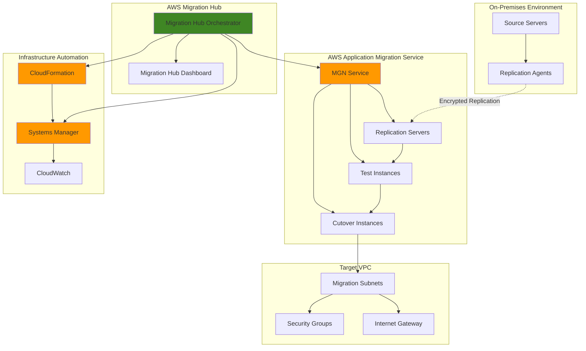

# Automated Application Migration Workflows with MGN and Migration Hub Orchestrator

## Problem

Organizations planning to migrate on-premises applications to AWS often face complex coordination challenges between assessment, replication, testing, and cutover phases, leading to extended migration timelines, coordination errors, and business disruption. Manual migration processes require extensive coordination between teams, increase the risk of configuration drift, and make it difficult to execute migrations at scale while maintaining consistent quality and minimizing downtime windows.

## Solution

AWS Application Migration Service (MGN) combined with Migration Hub Orchestrator provides a comprehensive automation platform that coordinates lift-and-shift migrations from assessment through cutover. This solution leverages MGN's continuous replication capabilities with Orchestrator's workflow automation to create repeatable, traceable migration processes that can scale across hundreds of servers while maintaining strict quality controls and minimal business disruption.

## Architecture Diagram



## Prerequisites

1. AWS account with Administrative permissions for MGN, Migration Hub, CloudFormation, and Systems Manager
2. AWS CLI v2 installed and configured (or AWS CloudShell)
3. On-premises servers with network connectivity to AWS (TCP 443 outbound)
4. Basic understanding of VPC networking and security group configuration
5. Knowledge of application dependencies and migration requirements
6. Estimated cost: $150-300 for replication servers, storage, and data transfer during testing

> **Note**: This recipe assumes source servers can reach AWS over HTTPS (port 443). For environments requiring private connectivity, configure AWS PrivateLink or VPN connections before proceeding.

## Preparation

```bash
# Set environment variables
export AWS_REGION=$(aws configure get region)
export AWS_ACCOUNT_ID=$(aws sts get-caller-identity \
    --query Account --output text)

# Generate unique identifiers for resources
RANDOM_SUFFIX=$(aws secretsmanager get-random-password \
    --exclude-punctuation --exclude-uppercase \
    --password-length 8 --require-each-included-type \
    --output text --query RandomPassword)

export MIGRATION_PROJECT_NAME="migration-project-${RANDOM_SUFFIX}"
export VPC_NAME="migration-vpc-${RANDOM_SUFFIX}"
export IAM_ROLE_NAME="MGNServiceRole-${RANDOM_SUFFIX}"

# Create Migration Hub home region (required for MGN integration)
aws migrationhub config create-home-region-control \
    --home-region ${AWS_REGION} \
    --target ${AWS_ACCOUNT_ID} || echo "Home region already configured"

echo "✅ Migration environment variables configured"
echo "Project: ${MIGRATION_PROJECT_NAME}"
echo "Region: ${AWS_REGION}"
```

## Steps

1. **Initialize AWS Application Migration Service**:

   AWS Application Migration Service requires one-time initialization to create the necessary IAM roles, replication templates, and launch configurations that will govern how your migration operates. This initialization process follows the [AWS Application Migration Service API initialization process](https://docs.aws.amazon.com/mgn/latest/ug/mgn-initialize-api.html) by creating service-linked roles and templates required for continuous block-level replication. MGN uses continuous replication to minimize downtime and ensures data consistency throughout the migration process while providing the foundation for both testing and production cutover scenarios.

   ```bash
   # Initialize MGN service in the region
   aws mgn initialize-service --region ${AWS_REGION}
   
   # Wait for initialization to complete and get template ID
   sleep 30
   export MGN_TEMPLATE_ID=$(aws mgn describe-replication-configuration-templates \
       --region ${AWS_REGION} \
       --query 'ReplicationConfigurationTemplates[0].ReplicationConfigurationTemplateID' \
       --output text)
   
   echo "✅ MGN initialized with template ID: ${MGN_TEMPLATE_ID}"
   ```

   MGN is now ready to accept replication agents and begin the migration process. The default replication template provides baseline settings for data transfer, encryption, and instance configuration that can be customized based on your specific migration requirements. This establishes the foundation for continuous replication and launch operations that support both testing and production cutover scenarios.

2. **Create Migration Hub Orchestrator Workflow Template**:

   Migration Hub Orchestrator enables automated execution of complex migration workflows by orchestrating multiple AWS services and custom scripts. Creating a custom workflow template establishes the automated sequence of migration steps, from initial assessment through final cutover validation. This orchestration capability eliminates manual coordination errors and ensures consistent execution patterns across multiple application migration projects. The template defines both automated AWS-managed steps and manual validation checkpoints where human oversight is required.

   ```bash
   # Create Orchestrator workflow definition
   cat > migration-workflow.json << 'EOF'
   {
     "name": "AutomatedMigrationWorkflow",
     "description": "Automated end-to-end migration workflow using MGN",
     "templateSource": {
       "workflowSteps": [
         {
           "stepId": "step1",
           "name": "ValidateSourceConnectivity",
           "description": "Verify source server connectivity and prerequisites",
           "stepActionType": "AUTOMATED",
           "owner": "AWS_MANAGED"
         },
         {
           "stepId": "step2", 
           "name": "ConfigureReplication",
           "description": "Deploy and configure MGN replication agents",
           "stepActionType": "AUTOMATED",
           "owner": "AWS_MANAGED"
         },
         {
           "stepId": "step3",
           "name": "MonitorDataReplication", 
           "description": "Monitor initial sync and ongoing replication",
           "stepActionType": "AUTOMATED",
           "owner": "AWS_MANAGED"
         },
         {
           "stepId": "step4",
           "name": "ExecuteTestLaunch",
           "description": "Launch test instances for validation",
           "stepActionType": "AUTOMATED", 
           "owner": "AWS_MANAGED"
         },
         {
           "stepId": "step5",
           "name": "ValidateTestInstances",
           "description": "Perform automated testing and validation",
           "stepActionType": "MANUAL",
           "owner": "CUSTOMER"
         },
         {
           "stepId": "step6",
           "name": "ExecuteCutover",
           "description": "Perform final cutover to production instances",
           "stepActionType": "AUTOMATED",
           "owner": "AWS_MANAGED"
         }
       ]
     }
   }
   EOF
   
   # Create the custom migration template
   aws migrationhub-orchestrator create-template \
       --template-name "AutomatedMigrationWorkflow-${RANDOM_SUFFIX}" \
       --template-description "Automated MGN migration workflow" \
       --template-source file://migration-workflow.json
   
   export TEMPLATE_ID=$(aws migrationhub-orchestrator list-templates \
       --query "TemplateSummary[?Name=='AutomatedMigrationWorkflow-${RANDOM_SUFFIX}'].Id" \
       --output text)
   
   echo "✅ Migration workflow template created successfully"
   echo "Template ID: ${TEMPLATE_ID}"
   ```

   The workflow template now provides a structured approach to migration that can be applied across multiple application migration projects. This template ensures consistency, traceability, and reduces the risk of human error during complex migration operations. The combination of automated AWS-managed steps with manual validation points provides the right balance of efficiency and control for enterprise migration scenarios.

3. **Create VPC Infrastructure for Migration Targets**:

   A properly configured VPC provides the secure, isolated environment where migrated applications will operate. This step establishes the network foundation with appropriate subnets, security groups, and connectivity options that support both the migration process and ongoing operations. The VPC design follows [AWS VPC security best practices](https://docs.aws.amazon.com/vpc/latest/userguide/vpc-security-best-practices.html) with separate public and private subnets to enable proper network segmentation. This infrastructure supports the MGN replication process while providing the production networking environment for cutover instances.

   ```bash
   # Create VPC for migration targets
   VPC_ID=$(aws ec2 create-vpc \
       --cidr-block 10.0.0.0/16 \
       --tag-specifications \
       "ResourceType=vpc,Tags=[{Key=Name,Value=${VPC_NAME}},{Key=Purpose,Value=Migration}]" \
       --query 'Vpc.VpcId' --output text)
   
   # Enable DNS hostnames for VPC (required for proper networking)
   aws ec2 modify-vpc-attribute \
       --vpc-id ${VPC_ID} \
       --enable-dns-hostnames
   
   # Create public and private subnets for migrated instances
   PUBLIC_SUBNET_ID=$(aws ec2 create-subnet \
       --vpc-id ${VPC_ID} \
       --cidr-block 10.0.1.0/24 \
       --availability-zone ${AWS_REGION}a \
       --tag-specifications \
       "ResourceType=subnet,Tags=[{Key=Name,Value=Migration-Public-${RANDOM_SUFFIX}}]" \
       --query 'Subnet.SubnetId' --output text)
   
   PRIVATE_SUBNET_ID=$(aws ec2 create-subnet \
       --vpc-id ${VPC_ID} \
       --cidr-block 10.0.2.0/24 \
       --availability-zone ${AWS_REGION}b \
       --tag-specifications \
       "ResourceType=subnet,Tags=[{Key=Name,Value=Migration-Private-${RANDOM_SUFFIX}}]" \
       --query 'Subnet.SubnetId' --output text)
   
   # Create and attach Internet Gateway for public connectivity
   IGW_ID=$(aws ec2 create-internet-gateway \
       --tag-specifications \
       "ResourceType=internet-gateway,Tags=[{Key=Name,Value=Migration-IGW-${RANDOM_SUFFIX}}]" \
       --query 'InternetGateway.InternetGatewayId' --output text)
   
   aws ec2 attach-internet-gateway \
       --vpc-id ${VPC_ID} \
       --internet-gateway-id ${IGW_ID}
   
   # Configure route table for public subnet
   ROUTE_TABLE_ID=$(aws ec2 create-route-table \
       --vpc-id ${VPC_ID} \
       --tag-specifications \
       "ResourceType=route-table,Tags=[{Key=Name,Value=Migration-Public-RT-${RANDOM_SUFFIX}}]" \
       --query 'RouteTable.RouteTableId' --output text)
   
   aws ec2 create-route \
       --route-table-id ${ROUTE_TABLE_ID} \
       --destination-cidr-block 0.0.0.0/0 \
       --gateway-id ${IGW_ID}
   
   aws ec2 associate-route-table \
       --subnet-id ${PUBLIC_SUBNET_ID} \
       --route-table-id ${ROUTE_TABLE_ID}
   
   echo "✅ Migration VPC infrastructure created"
   echo "VPC ID: ${VPC_ID}"
   echo "Public Subnet: ${PUBLIC_SUBNET_ID}"
   echo "Private Subnet: ${PRIVATE_SUBNET_ID}"
   ```

   The VPC infrastructure is now established with secure networking that supports both migration operations and production workloads. This configuration provides the foundation for deploying migrated applications with appropriate network isolation and connectivity. The dual-subnet design enables flexible deployment options where applications can be placed in private subnets for security while maintaining public subnet access for administrative and monitoring purposes.

4. **Configure MGN Launch Templates and Security Groups**:

   Launch templates define how MGN will configure target EC2 instances during test launches and cutover operations. These templates specify instance types, security settings, networking configurations, and post-launch automation scripts. Proper launch template configuration ensures migrated instances are deployed with consistent, secure configurations that meet operational requirements. Security groups provide network-level access control that follows the [principle of least privilege](https://docs.aws.amazon.com/IAM/latest/UserGuide/best-practices.html#grant-least-privilege) while enabling necessary application connectivity.

   ```bash
   # Create security group for migrated instances
   MIGRATION_SG_ID=$(aws ec2 create-security-group \
       --group-name "migration-sg-${RANDOM_SUFFIX}" \
       --description "Security group for migrated instances" \
       --vpc-id ${VPC_ID} \
       --tag-specifications \
       "ResourceType=security-group,Tags=[{Key=Name,Value=Migration-SG-${RANDOM_SUFFIX}}]" \
       --query 'GroupId' --output text)
   
   # Configure security group rules (customize based on application requirements)
   aws ec2 authorize-security-group-ingress \
       --group-id ${MIGRATION_SG_ID} \
       --protocol tcp \
       --port 22 \
       --cidr 10.0.0.0/16
   
   aws ec2 authorize-security-group-ingress \
       --group-id ${MIGRATION_SG_ID} \
       --protocol tcp \
       --port 80 \
       --cidr 0.0.0.0/0
   
   aws ec2 authorize-security-group-ingress \
       --group-id ${MIGRATION_SG_ID} \
       --protocol tcp \
       --port 443 \
       --cidr 0.0.0.0/0
   
   # Update default replication configuration template
   aws mgn update-replication-configuration-template \
       --replication-configuration-template-id ${MGN_TEMPLATE_ID} \
       --replication-servers-security-groups-i-ds ${MIGRATION_SG_ID} \
       --staging-area-subnet-id ${PRIVATE_SUBNET_ID}
   
   echo "✅ MGN launch templates and security groups configured"
   echo "Security Group: ${MIGRATION_SG_ID}"
   ```

   Launch templates are now configured to deploy migrated instances into the appropriate subnets with proper security controls. These templates ensure consistent deployment patterns and can be customized for different application tiers or compliance requirements. The security group configuration provides the network access control foundation while the staging area configuration ensures replication servers operate in the secure private subnet environment.

5. **Set Up Automated Monitoring and Alerting**:

   Comprehensive monitoring provides visibility into migration progress, replication health, and potential issues that require attention. CloudWatch integration enables automated alerting, performance tracking, and operational insights throughout the migration lifecycle. This monitoring foundation supports both migration operations and ongoing application management by providing real-time dashboards and proactive alerting when intervention is needed. The monitoring setup includes both metrics and log-based analysis to provide comprehensive operational visibility following [AWS CloudWatch best practices](https://docs.aws.amazon.com/AmazonCloudWatch/latest/monitoring/Best_Practices_CloudWatch.html).

   ```bash
   # Create CloudWatch dashboard for migration monitoring
   cat > migration-dashboard.json << EOF
   {
     "widgets": [
       {
         "type": "metric",
         "width": 12,
         "height": 6,
         "properties": {
           "metrics": [
             ["AWS/MGN", "TotalSourceServers"],
             ["AWS/MGN", "HealthySourceServers"],
             ["AWS/MGN", "ReplicationProgress"]
           ],
           "period": 300,
           "stat": "Average",
           "region": "${AWS_REGION}",
           "title": "MGN Migration Status"
         }
       },
       {
         "type": "log",
         "width": 12,
         "height": 6,
         "properties": {
           "query": "SOURCE '/aws/migrationhub-orchestrator' | fields @timestamp, message\\n| filter message like /ERROR/\\n| sort @timestamp desc\\n| limit 20",
           "region": "${AWS_REGION}",
           "title": "Migration Errors"
         }
       }
     ]
   }
   EOF
   
   aws cloudwatch put-dashboard \
       --dashboard-name "Migration-Dashboard-${RANDOM_SUFFIX}" \
       --dashboard-body file://migration-dashboard.json
   
   # Create CloudWatch alarm for replication issues
   aws cloudwatch put-metric-alarm \
       --alarm-name "MGN-Replication-Health-${RANDOM_SUFFIX}" \
       --alarm-description "Alert when MGN replication encounters issues" \
       --metric-name "HealthySourceServers" \
       --namespace "AWS/MGN" \
       --statistic "Average" \
       --period 300 \
       --evaluation-periods 2 \
       --threshold 1 \
       --comparison-operator "LessThanThreshold" \
       --treat-missing-data "breaching"
   
   echo "✅ Migration monitoring and alerting configured"
   ```

   CloudWatch monitoring is now active and will provide real-time visibility into migration progress and health metrics. The dashboard provides centralized views of migration status while the alarms enable proactive issue detection and resolution throughout the migration process. This monitoring setup ensures that migration teams can quickly identify and respond to replication issues or workflow problems that could impact migration timelines.

6. **Create Systems Manager Automation for Post-Migration Tasks**:

   Systems Manager Automation enables standardized post-migration configuration tasks such as application service startup, configuration updates, and validation testing. These automation documents ensure consistent post-migration procedures and reduce the manual effort required to bring migrated applications online. This automation is crucial for achieving rapid recovery times and consistent application configuration across all migrated instances. The automation follows [AWS Systems Manager best practices](https://docs.aws.amazon.com/systems-manager/latest/userguide/systems-manager-best-practices.html) and includes comprehensive validation steps to ensure applications are properly configured and operational after migration.

   ```bash
   # Create SSM document for post-migration automation
   cat > post-migration-automation.json << 'EOF'
   {
     "schemaVersion": "0.3",
     "description": "Post-migration automation tasks",
     "assumeRole": "{{ AutomationAssumeRole }}",
     "parameters": {
       "InstanceId": {
         "type": "String",
         "description": "EC2 Instance ID for post-migration tasks"
       },
       "AutomationAssumeRole": {
         "type": "String",
         "description": "IAM role for automation execution"
       }
     },
     "mainSteps": [
       {
         "name": "WaitForInstanceReady",
         "action": "aws:waitForAwsResourceProperty",
         "inputs": {
           "Service": "ec2",
           "Api": "DescribeInstanceStatus",
           "InstanceIds": ["{{ InstanceId }}"],
           "PropertySelector": "$.InstanceStatuses[0].InstanceStatus.Status",
           "DesiredValues": ["ok"]
         }
       },
       {
         "name": "ConfigureCloudWatchAgent", 
         "action": "aws:runCommand",
         "inputs": {
           "DocumentName": "AWS-ConfigureAWSPackage",
           "InstanceIds": ["{{ InstanceId }}"],
           "Parameters": {
             "action": "Install",
             "name": "AmazonCloudWatchAgent"
           }
         }
       },
       {
         "name": "ValidateServices",
         "action": "aws:runCommand", 
         "inputs": {
           "DocumentName": "AWS-RunShellScript",
           "InstanceIds": ["{{ InstanceId }}"],
           "Parameters": {
             "commands": [
               "#!/bin/bash",
               "systemctl status sshd",
               "curl -f http://localhost/health || echo 'Application health check failed'"
             ]
           }
         }
       }
     ]
   }
   EOF
   
   aws ssm create-document \
       --name "PostMigrationAutomation-${RANDOM_SUFFIX}" \
       --document-type "Automation" \
       --document-format "JSON" \
       --content file://post-migration-automation.json
   
   echo "✅ Post-migration automation configured"
   ```

   Systems Manager automation is now ready to execute standardized post-migration tasks. This automation ensures consistent application startup procedures and validation testing across all migrated instances. The automation document provides a framework that can be extended with additional validation steps, monitoring agent installation, and application-specific configuration tasks required for successful migration completion.

7. **Create Migration Hub Orchestrator Workflow Instance**:

   The workflow instance represents a specific migration project execution using the template created earlier. This instance tracks the progress of individual migration activities, manages step dependencies, and provides centralized visibility into the migration status. Workflow instances enable parallel execution of multiple migration projects while maintaining organized tracking and reporting. The instance configuration includes all the infrastructure parameters needed to execute the migration workflow with the resources created in previous steps.

   ```bash
   # Create workflow instance for a specific migration project
   WORKFLOW_ID=$(aws migrationhub-orchestrator create-workflow \
       --name "${MIGRATION_PROJECT_NAME}" \
       --description "Automated migration workflow for ${MIGRATION_PROJECT_NAME}" \
       --template-id "${TEMPLATE_ID}" \
       --application-configuration-id "${MIGRATION_PROJECT_NAME}" \
       --input-parameters '{
         "region": "'${AWS_REGION}'",
         "targetVpcId": "'${VPC_ID}'",
         "targetSubnetId": "'${PRIVATE_SUBNET_ID}'",
         "securityGroupId": "'${MIGRATION_SG_ID}'"
       }' \
       --step-targets '[
         {
           "stepId": "step1",
           "inputs": {
             "region": "'${AWS_REGION}'"
           }
         }
       ]' \
       --query 'Id' --output text)
   
   echo "✅ Migration workflow instance created: ${WORKFLOW_ID}"
   
   # Get workflow status
   aws migrationhub-orchestrator get-workflow \
       --id ${WORKFLOW_ID} \
       --query '[Name, Status, Description]' \
       --output table
   ```

   The migration workflow instance is now active and ready to coordinate the migration process. This workflow will orchestrate all migration activities and provide centralized tracking of progress and status across the entire migration lifecycle. The workflow instance serves as the central coordination point that connects the automation template with the specific infrastructure resources and migration targets for this project.

## Validation & Testing

1. **Verify MGN Service Initialization**:

   ```bash
   # Check MGN service status and configuration
   aws mgn describe-replication-configuration-templates \
       --region ${AWS_REGION} \
       --query 'ReplicationConfigurationTemplates[0].[ReplicationConfigurationTemplateID,ReplicationServerInstanceType,ReplicationServersSecurityGroupsIDs]' \
       --output table
   ```

   Expected output: Table showing template ID, instance type (usually t3.small), and security group IDs.

2. **Test VPC Network Configuration**:

   ```bash
   # Verify VPC and subnet configuration
   aws ec2 describe-vpcs \
       --vpc-ids ${VPC_ID} \
       --query 'Vpcs[0].[VpcId,State,CidrBlock]' \
       --output table
   
   # Test internet connectivity for public subnet
   aws ec2 describe-route-tables \
       --filters "Name=vpc-id,Values=${VPC_ID}" \
       --query 'RouteTables[?Associations[?SubnetId==`'${PUBLIC_SUBNET_ID}'`]].Routes[?DestinationCidrBlock==`0.0.0.0/0`]' \
       --output table
   ```

   Expected output: VPC in 'available' state with correct CIDR block and route to internet gateway.

3. **Validate Workflow Template Creation**:

   ```bash
   # Check Migration Hub Orchestrator workflow status
   aws migrationhub-orchestrator get-workflow \
       --id ${WORKFLOW_ID} \
       --query '[Id,Name,Status,WorkflowSteps[].Name]' \
       --output table
   ```

   Expected output: Workflow in 'READY' or 'ACTIVE' status with all defined steps visible.

4. **Test CloudWatch Dashboard and Monitoring**:

   ```bash
   # Verify dashboard creation
   aws cloudwatch get-dashboard \
       --dashboard-name "Migration-Dashboard-${RANDOM_SUFFIX}" \
       --query 'DashboardBody' \
       --output text | jq .
   ```

   Expected output: JSON dashboard configuration with migration metrics and log queries.

## Cleanup

1. **Stop and clean up Migration Hub Orchestrator workflow**:

   ```bash
   # Stop the workflow if running
   aws migrationhub-orchestrator stop-workflow \
       --id ${WORKFLOW_ID} || echo "Workflow not running"
   
   # Delete the workflow instance
   aws migrationhub-orchestrator delete-workflow \
       --id ${WORKFLOW_ID}
   
   echo "✅ Workflow instance deleted"
   ```

2. **Remove CloudWatch resources**:

   ```bash
   # Delete CloudWatch dashboard
   aws cloudwatch delete-dashboards \
       --dashboard-names "Migration-Dashboard-${RANDOM_SUFFIX}"
   
   # Delete CloudWatch alarms
   aws cloudwatch delete-alarms \
       --alarm-names "MGN-Replication-Health-${RANDOM_SUFFIX}"
   
   echo "✅ CloudWatch resources removed"
   ```

3. **Delete Systems Manager documents**:

   ```bash
   # Delete SSM automation document
   aws ssm delete-document \
       --name "PostMigrationAutomation-${RANDOM_SUFFIX}"
   
   echo "✅ Systems Manager documents deleted"
   ```

4. **Remove VPC infrastructure**:

   ```bash
   # Detach and delete internet gateway
   aws ec2 detach-internet-gateway \
       --vpc-id ${VPC_ID} \
       --internet-gateway-id ${IGW_ID}
   
   aws ec2 delete-internet-gateway \
       --internet-gateway-id ${IGW_ID}
   
   # Delete security groups
   aws ec2 delete-security-group \
       --group-id ${MIGRATION_SG_ID}
   
   # Delete subnets
   aws ec2 delete-subnet --subnet-id ${PUBLIC_SUBNET_ID}
   aws ec2 delete-subnet --subnet-id ${PRIVATE_SUBNET_ID}
   
   # Delete route table
   aws ec2 delete-route-table --route-table-id ${ROUTE_TABLE_ID}
   
   # Delete VPC
   aws ec2 delete-vpc --vpc-id ${VPC_ID}
   
   echo "✅ VPC infrastructure deleted"
   ```

5. **Clean up workflow templates and local files**:

   ```bash
   # Delete Migration Hub Orchestrator template
   aws migrationhub-orchestrator delete-template \
       --template-id "${TEMPLATE_ID}"
   
   # Clean up local files
   rm -f migration-workflow.json migration-dashboard.json \
       post-migration-automation.json
   
   echo "✅ All migration resources cleaned up"
   ```

## Discussion

Building automated application migration workflows with AWS Application Migration Service and Migration Hub Orchestrator creates a powerful platform for executing large-scale lift-and-shift migrations with minimal manual intervention and consistent quality. This architecture addresses the key challenges of migration coordination by providing automated workflow orchestration, continuous replication monitoring, and standardized deployment procedures that reduce both migration time and business risk. The solution follows enterprise migration patterns that have been proven effective across thousands of production migrations and aligns with the [AWS Well-Architected Framework](https://docs.aws.amazon.com/wellarchitected/latest/framework/welcome.html) principles.

The integration between MGN and Migration Hub Orchestrator provides several architectural advantages that align with AWS Well-Architected Framework pillars. MGN handles the technical complexity of continuous block-level replication, maintaining near real-time synchronization between source and target environments while minimizing application downtime through its innovative continuous data protection approach. Migration Hub Orchestrator adds workflow automation and coordination capabilities, ensuring that migration activities follow defined sequences, include proper validation checkpoints, and maintain audit trails for compliance requirements. For comprehensive migration planning guidance, see the [AWS Application Migration Service User Guide](https://docs.aws.amazon.com/mgn/latest/ug/) and [Migration Hub Orchestrator documentation](https://docs.aws.amazon.com/migrationhub-orchestrator/latest/userguide/).

From an operational perspective, this automated approach significantly reduces the coordination overhead typical of manual migration processes while improving reliability and repeatability. The workflow templates ensure consistent execution across multiple migration waves, while CloudWatch integration provides real-time visibility into replication health, migration progress, and potential issues requiring attention. Systems Manager automation handles post-migration configuration tasks, reducing the time required to bring applications online and ensuring consistent security and operational configurations. This approach supports the [Migration Hub best practices](https://docs.aws.amazon.com/migrationhub/latest/ug/best-practices.html) for large-scale migration programs and enables organizations to achieve migration velocity at enterprise scale.

Security and compliance considerations are integral to this migration architecture, following the security pillar of the Well-Architected Framework. MGN provides encryption in transit and at rest for all replication traffic, while VPC isolation ensures migrated applications operate in secure, controlled environments that meet enterprise security standards. The workflow automation includes validation checkpoints that can enforce security scanning, compliance verification, and operational readiness testing before allowing migrations to proceed to production cutover. For detailed security guidance, consult the [AWS Application Migration Service security documentation](https://docs.aws.amazon.com/mgn/latest/ug/security.html) and [AWS Well-Architected Migration Lens](https://docs.aws.amazon.com/wellarchitected/latest/migration-lens/welcome.html).

> **Tip**: Use Migration Hub Orchestrator's step grouping capabilities to create parallel execution paths for independent application components, significantly reducing overall migration timeline while maintaining proper dependency management and orchestration control.

## Challenge

Extend this migration automation solution by implementing these advanced capabilities:

1. **Multi-Region Disaster Recovery Integration**: Configure cross-region replication using MGN's disaster recovery capabilities to create automated failover workflows that can be triggered during planned maintenance or unexpected outages, providing comprehensive business continuity.

2. **Application Dependency Mapping**: Integrate with AWS Application Discovery Service to automatically identify application dependencies and create migration workflows that respect inter-application communication patterns and startup sequences for complex distributed applications.

3. **Automated Testing and Validation**: Expand the Systems Manager automation to include comprehensive application testing, performance benchmarking, and automated rollback procedures that can validate migration success before cutover completion.

4. **Cost Optimization Analytics**: Implement CloudWatch custom metrics and Cost Explorer integration to provide real-time migration cost tracking, right-sizing recommendations, and post-migration cost optimization opportunities.

5. **Hybrid Cloud Integration**: Extend the migration workflows to support hybrid architectures where some components remain on-premises, requiring automated configuration of site-to-site VPN connections and hybrid networking solutions.

## Infrastructure Code

### Available Infrastructure as Code:

- [Infrastructure Code Overview](code/README.md) - Detailed description of all infrastructure components
- [AWS CDK (Python)](code/cdk-python/) - AWS CDK Python implementation
- [AWS CDK (TypeScript)](code/cdk-typescript/) - AWS CDK TypeScript implementation
- [CloudFormation](code/cloudformation.yaml) - AWS CloudFormation template
- [Bash CLI Scripts](code/scripts/) - Example bash scripts using AWS CLI commands to deploy infrastructure
- [Terraform](code/terraform/) - Terraform configuration files