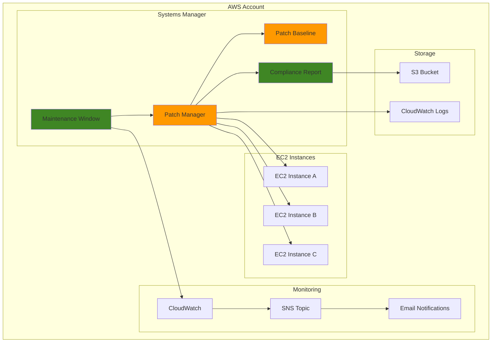

# Automated Patching with Systems Manager

## Problem

Organizations struggle with maintaining consistent security patches across their fleet of EC2 instances, often leading to security vulnerabilities and compliance issues. Manual patching processes are time-consuming, error-prone, and difficult to scale across hundreds or thousands of instances. Without proper maintenance windows, patch installations can disrupt business operations during critical hours, causing downtime and lost productivity.

## Solution

AWS Systems Manager Patch Manager provides automated patching capabilities with customizable maintenance windows, allowing you to define when patches are applied across your infrastructure. This solution creates scheduled maintenance windows with custom patch baselines, automated compliance reporting, and integration with monitoring systems to ensure your instances remain secure and compliant while minimizing operational disruption.

## Architecture Diagram



## Prerequisites

1. AWS account with Systems Manager permissions for EC2 instances
2. AWS CLI v2 installed and configured (or AWS CloudShell)
3. Basic understanding of EC2 instances and patching concepts
4. EC2 instances with SSM Agent installed and proper IAM roles
5. Estimated cost: $0.10-$2.00 per instance per month for Systems Manager operations

> **Note**: Systems Manager core features are free, but you pay for EC2 instance hours and CloudWatch usage. Advanced features like Patch Manager operations are included at no additional cost. The cron expression `cron(0 2 ? * SUN *)` schedules patching for 2 AM UTC every Sunday - adjust this timing based on your maintenance schedules. For cron expression syntax, see the [AWS Systems Manager User Guide](https://docs.aws.amazon.com/systems-manager/latest/userguide/reference-cron-and-rate-expressions.html).

## Preparation

```bash
# Set environment variables
export AWS_REGION=$(aws configure get region)
export AWS_ACCOUNT_ID=$(aws sts get-caller-identity \
    --query Account --output text)

# Generate unique identifiers for resources
RANDOM_SUFFIX=$(aws secretsmanager get-random-password \
    --exclude-punctuation --exclude-uppercase \
    --password-length 6 --require-each-included-type \
    --output text --query RandomPassword)

export PATCH_BASELINE_NAME="custom-baseline-${RANDOM_SUFFIX}"
export MAINTENANCE_WINDOW_NAME="patch-window-${RANDOM_SUFFIX}"
export S3_BUCKET_NAME="patch-reports-${AWS_ACCOUNT_ID}-${RANDOM_SUFFIX}"
export SNS_TOPIC_NAME="patch-notifications-${RANDOM_SUFFIX}"

# Create S3 bucket for patch reports
aws s3 mb s3://${S3_BUCKET_NAME} --region ${AWS_REGION}

# Create SNS topic for notifications
aws sns create-topic --name ${SNS_TOPIC_NAME} \
    --region ${AWS_REGION}

export SNS_TOPIC_ARN=$(aws sns list-topics \
    --query "Topics[?contains(TopicArn, '${SNS_TOPIC_NAME}')].TopicArn" \
    --output text)

echo "✅ Preparation complete with resources:"
echo "   - S3 Bucket: ${S3_BUCKET_NAME}"
echo "   - SNS Topic: ${SNS_TOPIC_ARN}"
```

## Steps

1. **Create Custom Patch Baseline**:

   Patch baselines serve as the foundation for your automated patching strategy by defining which patches are approved for installation across your infrastructure. AWS Systems Manager Patch Manager uses these baselines to determine patch eligibility based on classification, severity, and approval criteria. Custom baselines provide granular control over patch deployment, ensuring only vetted patches that meet your organization's security and stability requirements are applied to production systems.

   ```bash
   # Create a custom patch baseline for Linux instances
   aws ssm create-patch-baseline \
       --name ${PATCH_BASELINE_NAME} \
       --description "Custom patch baseline for production instances" \
       --operating-system AMAZON_LINUX_2 \
       --approval-rules Rules='[{
           "PatchRules": [{
               "PatchFilterGroup": {
                   "PatchFilters": [{
                       "Key": "CLASSIFICATION",
                       "Values": ["Security", "Bugfix", "Critical"]
                   }]
               },
               "ApproveAfterDays": 7,
               "ComplianceLevel": "CRITICAL"
           }]
       }]' \
       --approved-patches-compliance-level CRITICAL
   
   # Store the baseline ID
   export PATCH_BASELINE_ID=$(aws ssm describe-patch-baselines \
       --filters "Key=Name,Values=${PATCH_BASELINE_NAME}" \
       --query "BaselineIdentities[0].BaselineId" \
       --output text)
   
   echo "✅ Created patch baseline: ${PATCH_BASELINE_ID}"
   ```

   The patch baseline is now configured with approval rules that automatically approve Security, Bugfix, and Critical patches after a 7-day delay. This delay allows time for testing in non-production environments before patches are deployed to production systems. For comprehensive patch baseline configuration, see the [AWS Systems Manager Patch Manager documentation](https://docs.aws.amazon.com/systems-manager/latest/userguide/patch-manager-create-a-patch-baseline.html).

2. **Create IAM Role for Maintenance Window**:

   IAM roles enable secure, temporary credential delegation without hardcoding secrets in your automation workflows. The maintenance window role follows the principle of least privilege, granting only the specific permissions required for Systems Manager to execute patching operations on your behalf. This security model ensures that patching activities are performed with appropriate authorization while maintaining audit trails for compliance requirements.

   ```bash
   # Create trust policy for maintenance window role
   cat > maintenance-window-trust-policy.json << EOF
   {
       "Version": "2012-10-17",
       "Statement": [
           {
               "Effect": "Allow",
               "Principal": {
                   "Service": "ssm.amazonaws.com"
               },
               "Action": "sts:AssumeRole"
           }
       ]
   }
   EOF
   
   # Create the IAM role
   aws iam create-role \
       --role-name MaintenanceWindowRole-${RANDOM_SUFFIX} \
       --assume-role-policy-document file://maintenance-window-trust-policy.json
   
   # Attach required policies
   aws iam attach-role-policy \
       --role-name MaintenanceWindowRole-${RANDOM_SUFFIX} \
       --policy-arn arn:aws:iam::aws:policy/service-role/AmazonSSMMaintenanceWindowRole
   
   # Get the role ARN
   export MW_ROLE_ARN=$(aws iam get-role \
       --role-name MaintenanceWindowRole-${RANDOM_SUFFIX} \
       --query "Role.Arn" --output text)
   
   echo "✅ Created maintenance window role: ${MW_ROLE_ARN}"
   ```

   The IAM role is now established with the necessary trust relationship and permissions for Systems Manager operations. This role enables secure automation of patching tasks while maintaining proper access controls and audit capabilities.

3. **Create Maintenance Window**:

   Maintenance windows define the schedule for when patching operations can occur. The cron expression controls the exact timing, while duration and cutoff parameters manage how long the window stays open and when new tasks stop being initiated.

   ```bash
   # Create maintenance window scheduled for weekly patching
   aws ssm create-maintenance-window \
       --name ${MAINTENANCE_WINDOW_NAME} \
       --description "Weekly patching maintenance window" \
       --schedule "cron(0 2 ? * SUN *)" \
       --duration 4 \
       --cutoff 1 \
       --schedule-timezone "UTC" \
       --allow-unassociated-targets
   
   # Store the maintenance window ID
   export MAINTENANCE_WINDOW_ID=$(aws ssm describe-maintenance-windows \
       --filters "Key=Name,Values=${MAINTENANCE_WINDOW_NAME}" \
       --query "WindowIdentities[0].WindowId" \
       --output text)
   
   echo "✅ Created maintenance window: ${MAINTENANCE_WINDOW_ID}"
   ```

4. **Register Maintenance Window Targets**:

   Target registration defines which EC2 instances participate in maintenance window operations using tag-based selection criteria. This approach provides flexible, dynamic targeting that automatically includes new instances matching the specified tags without manual configuration updates. Tag-based targeting enables consistent patch management across auto-scaling environments and simplifies operational overhead for large instance fleets.

   ```bash
   # Register EC2 instances with specific tags as targets
   aws ssm register-target-with-maintenance-window \
       --window-id ${MAINTENANCE_WINDOW_ID} \
       --target-type Instance \
       --targets Key=tag:Environment,Values=Production \
       --resource-type INSTANCE \
       --name "ProductionInstances"
   
   # Store the target ID
   export TARGET_ID=$(aws ssm describe-maintenance-window-targets \
       --window-id ${MAINTENANCE_WINDOW_ID} \
       --query "Targets[0].WindowTargetId" \
       --output text)
   
   echo "✅ Registered targets: ${TARGET_ID}"
   ```

   Instances tagged with Environment=Production are now registered as targets for the maintenance window. This tag-based approach ensures that only appropriate instances receive patches during the scheduled maintenance window, providing operational control and reducing the risk of unintended patch deployments.

5. **Register Patch Management Task**:

   The patch management task executes the actual patching operation during the maintenance window. Concurrency and error threshold settings ensure controlled rollout, preventing system-wide issues if patches cause problems on individual instances.

   ```bash
   # Register patching task with the maintenance window
   aws ssm register-task-with-maintenance-window \
       --window-id ${MAINTENANCE_WINDOW_ID} \
       --target-type Instance \
       --targets Key=WindowTargetIds,Values=${TARGET_ID} \
       --task-type RUN_COMMAND \
       --task-arn "AWS-RunPatchBaseline" \
       --service-role-arn ${MW_ROLE_ARN} \
       --name "PatchingTask" \
       --description "Install patches using custom baseline" \
       --max-concurrency "50%" \
       --max-errors "10%" \
       --priority 1 \
       --task-parameters '{
           "BaselineOverride": ["'"${PATCH_BASELINE_ID}"'"],
           "Operation": ["Install"]
       }' \
       --logging-info S3BucketName=${S3_BUCKET_NAME},S3KeyPrefix=patch-logs
   
   echo "✅ Registered patching task with maintenance window"
   ```

   > **Warning**: The max-concurrency setting of 50% means half your instances will be patched simultaneously. For critical production systems, consider reducing this to 25% or lower to minimize impact. Monitor the max-errors threshold carefully - exceeding 10% failed patches may indicate serious compatibility issues requiring investigation.

6. **Create Patch Compliance Monitoring**:

   CloudWatch monitoring and SNS notifications provide proactive visibility into patch compliance status across your infrastructure. Automated alerting ensures that compliance issues are detected quickly, enabling rapid response to security vulnerabilities or failed patch installations. This monitoring capability is essential for maintaining security posture and meeting compliance requirements in regulated environments.

   ```bash
   # Create CloudWatch alarm for patch compliance
   aws cloudwatch put-metric-alarm \
       --alarm-name "PatchComplianceAlarm-${RANDOM_SUFFIX}" \
       --alarm-description "Monitor patch compliance status" \
       --metric-name "ComplianceByPatchGroup" \
       --namespace "AWS/SSM-PatchCompliance" \
       --statistic Maximum \
       --period 3600 \
       --threshold 1 \
       --comparison-operator LessThanThreshold \
       --evaluation-periods 1 \
       --alarm-actions ${SNS_TOPIC_ARN} \
       --dimensions Name=PatchGroup,Value=Production
   
   echo "✅ Created patch compliance monitoring"
   ```

   The CloudWatch alarm will trigger SNS notifications when patch compliance falls below the configured threshold, providing immediate visibility into potential security or operational issues. This proactive monitoring enables rapid response to patch management problems before they impact business operations.

7. **Set Up Automated Patch Scanning**:

   Regular patch scanning provides continuous visibility into patch compliance without making changes to systems. This proactive approach helps identify security vulnerabilities and plan maintenance activities before patches accumulate.

   ```bash
   # Create a separate maintenance window for patch scanning
   aws ssm create-maintenance-window \
       --name "scan-window-${RANDOM_SUFFIX}" \
       --description "Daily patch scanning window" \
       --schedule "cron(0 1 * * ? *)" \
       --duration 2 \
       --cutoff 1 \
       --schedule-timezone "UTC" \
       --allow-unassociated-targets
   
   # Get the scan window ID
   export SCAN_WINDOW_ID=$(aws ssm describe-maintenance-windows \
       --filters "Key=Name,Values=scan-window-${RANDOM_SUFFIX}" \
       --query "WindowIdentities[0].WindowId" \
       --output text)
   
   # Register targets for scanning
   aws ssm register-target-with-maintenance-window \
       --window-id ${SCAN_WINDOW_ID} \
       --target-type Instance \
       --targets Key=tag:Environment,Values=Production \
       --resource-type INSTANCE \
       --name "ScanTargets"
   
   # Get scan target ID
   export SCAN_TARGET_ID=$(aws ssm describe-maintenance-window-targets \
       --window-id ${SCAN_WINDOW_ID} \
       --query "Targets[0].WindowTargetId" \
       --output text)
   
   # Register scanning task
   aws ssm register-task-with-maintenance-window \
       --window-id ${SCAN_WINDOW_ID} \
       --target-type Instance \
       --targets Key=WindowTargetIds,Values=${SCAN_TARGET_ID} \
       --task-type RUN_COMMAND \
       --task-arn "AWS-RunPatchBaseline" \
       --service-role-arn ${MW_ROLE_ARN} \
       --name "ScanningTask" \
       --description "Scan for missing patches" \
       --max-concurrency "100%" \
       --max-errors "5%" \
       --priority 1 \
       --task-parameters '{
           "BaselineOverride": ["'"${PATCH_BASELINE_ID}"'"],
           "Operation": ["Scan"]
       }' \
       --logging-info S3BucketName=${S3_BUCKET_NAME},S3KeyPrefix=scan-logs
   
   echo "✅ Created automated patch scanning"
   ```

   > **Tip**: Patch scanning runs at 100% concurrency since it's read-only and doesn't impact system operations. The daily schedule ensures you have current compliance data before each weekly patching cycle. For comprehensive patch management best practices, see the [AWS Systems Manager documentation](https://docs.aws.amazon.com/systems-manager/latest/userguide/patch-manager.html).

8. **Configure Patch Group Association**:

   Patch groups provide organizational structure for managing different patching policies across various environments and instance types. By associating instances with specific patch groups, you can apply different patch baselines, schedules, and approval criteria based on business requirements. This segregation enables tailored patch management strategies for development, staging, and production environments while maintaining centralized oversight.

   ```bash
   # Associate patch baseline with a patch group
   aws ssm register-patch-baseline-for-patch-group \
       --baseline-id ${PATCH_BASELINE_ID} \
       --patch-group "Production"
   
   # Verify patch group association
   aws ssm describe-patch-groups \
       --query "Mappings[?PatchGroup=='Production']"
   
   echo "✅ Associated patch baseline with Production patch group"
   ```

   The patch baseline is now linked to the Production patch group, ensuring that instances in this group receive patches according to the defined approval criteria and maintenance schedule. This association enables consistent patch management policies across all production systems.

## Validation & Testing

1. **Verify Maintenance Window Configuration**:

   ```bash
   # Check maintenance window details
   aws ssm describe-maintenance-windows \
       --filters "Key=Name,Values=${MAINTENANCE_WINDOW_NAME}" \
       --query "WindowIdentities[0]"
   
   # Verify targets are registered
   aws ssm describe-maintenance-window-targets \
       --window-id ${MAINTENANCE_WINDOW_ID}
   
   # Check registered tasks
   aws ssm describe-maintenance-window-tasks \
       --window-id ${MAINTENANCE_WINDOW_ID}
   ```

   Expected output: JSON showing configured maintenance window, targets, and tasks.

2. **Test Patch Baseline Compliance**:

   ```bash
   # Check patch compliance for instances
   aws ssm describe-instance-patch-states \
       --query "InstancePatchStates[*].[InstanceId,PatchGroup,BaselineId,OperationEndTime]" \
       --output table
   
   # Generate compliance report
   aws ssm list-compliance-items \
       --resource-type "ManagedInstance" \
       --query "ComplianceItems[?ComplianceType=='Patch']" \
       --output table
   ```

3. **Verify Monitoring Setup**:

   ```bash
   # Check CloudWatch alarm status
   aws cloudwatch describe-alarms \
       --alarm-names "PatchComplianceAlarm-${RANDOM_SUFFIX}" \
       --query "MetricAlarms[0].[AlarmName,StateValue,StateReason]" \
       --output table
   
   # Test SNS notification
   aws sns publish \
       --topic-arn ${SNS_TOPIC_ARN} \
       --message "Test patch notification" \
       --subject "Patch Management Test"
   ```

## Cleanup

1. **Remove Maintenance Windows**:

   ```bash
   # Delete maintenance window tasks first
   TASK_IDS=$(aws ssm describe-maintenance-window-tasks \
       --window-id ${MAINTENANCE_WINDOW_ID} \
       --query "Tasks[*].WindowTaskId" \
       --output text)
   
   for task_id in ${TASK_IDS}; do
       aws ssm deregister-task-from-maintenance-window \
           --window-id ${MAINTENANCE_WINDOW_ID} \
           --window-task-id ${task_id}
   done
   
   # Delete targets
   aws ssm deregister-target-from-maintenance-window \
       --window-id ${MAINTENANCE_WINDOW_ID} \
       --window-target-id ${TARGET_ID}
   
   # Delete maintenance windows
   aws ssm delete-maintenance-window --window-id ${MAINTENANCE_WINDOW_ID}
   aws ssm delete-maintenance-window --window-id ${SCAN_WINDOW_ID}
   
   echo "✅ Deleted maintenance windows"
   ```

2. **Remove Patch Baseline and Associations**:

   ```bash
   # Deregister patch baseline from patch group
   aws ssm deregister-patch-baseline-for-patch-group \
       --baseline-id ${PATCH_BASELINE_ID} \
       --patch-group "Production"
   
   # Delete custom patch baseline
   aws ssm delete-patch-baseline --baseline-id ${PATCH_BASELINE_ID}
   
   echo "✅ Deleted patch baseline"
   ```

3. **Remove Monitoring Resources**:

   ```bash
   # Delete CloudWatch alarm
   aws cloudwatch delete-alarms \
       --alarm-names "PatchComplianceAlarm-${RANDOM_SUFFIX}"
   
   # Delete SNS topic
   aws sns delete-topic --topic-arn ${SNS_TOPIC_ARN}
   
   echo "✅ Deleted monitoring resources"
   ```

4. **Remove Supporting Resources**:

   ```bash
   # Delete IAM role
   aws iam detach-role-policy \
       --role-name MaintenanceWindowRole-${RANDOM_SUFFIX} \
       --policy-arn arn:aws:iam::aws:policy/service-role/AmazonSSMMaintenanceWindowRole
   
   aws iam delete-role --role-name MaintenanceWindowRole-${RANDOM_SUFFIX}
   
   # Empty and delete S3 bucket
   aws s3 rm s3://${S3_BUCKET_NAME} --recursive
   aws s3 rb s3://${S3_BUCKET_NAME}
   
   # Clean up local files
   rm -f maintenance-window-trust-policy.json
   
   echo "✅ Cleanup complete"
   ```

## Discussion

AWS Systems Manager Patch Manager provides a comprehensive solution for automating patch management across your infrastructure. The key architectural components work together to ensure consistent, reliable patching operations while maintaining operational control.

Custom patch baselines allow you to define precise criteria for which patches get approved for installation. The approval rules can be configured to automatically approve patches based on classification (Security, Bugfix, Critical) and severity levels, with configurable approval delays to allow for testing. This approach ensures that only appropriate patches are installed while maintaining security posture.

Maintenance windows provide the scheduling framework that determines when patching operations occur. By separating scanning operations from installation operations, you can maintain continuous visibility into patch compliance while controlling when potentially disruptive installations happen. The rate control settings (concurrency and error thresholds) help ensure that patching operations don't overwhelm your infrastructure or cause widespread service disruption.

The integration with CloudWatch and SNS enables proactive monitoring and alerting on patch compliance status. This monitoring capability is essential for maintaining security compliance and operational visibility across large fleets of instances. The compliance reporting features can generate detailed reports that are useful for security audits and compliance verification.

> **Tip**: Use patch groups to organize instances with similar patching requirements. For example, separate development, staging, and production environments into different patch groups with different approval criteria and maintenance window schedules.

## Challenge

Extend this solution by implementing these enhancements:

1. **Multi-Environment Patching Strategy**: Create separate patch baselines and maintenance windows for development, staging, and production environments with different approval criteria and schedules.

2. **Custom Patch Approval Workflow**: Implement a Lambda-based approval workflow that integrates with your change management system before patches are approved for installation.

3. **Advanced Compliance Reporting**: Build a comprehensive dashboard using QuickSight that aggregates patch compliance data across multiple AWS accounts and regions.

4. **Automated Rollback Capability**: Implement automated rollback functionality using Systems Manager Automation documents that can revert instances to previous states if patch installation causes issues.

5. **Integration with Third-Party Tools**: Extend the solution to integrate with external vulnerability scanners and security information and event management (SIEM) systems for enhanced security monitoring.

## Infrastructure Code

*Infrastructure code will be generated after recipe approval.*