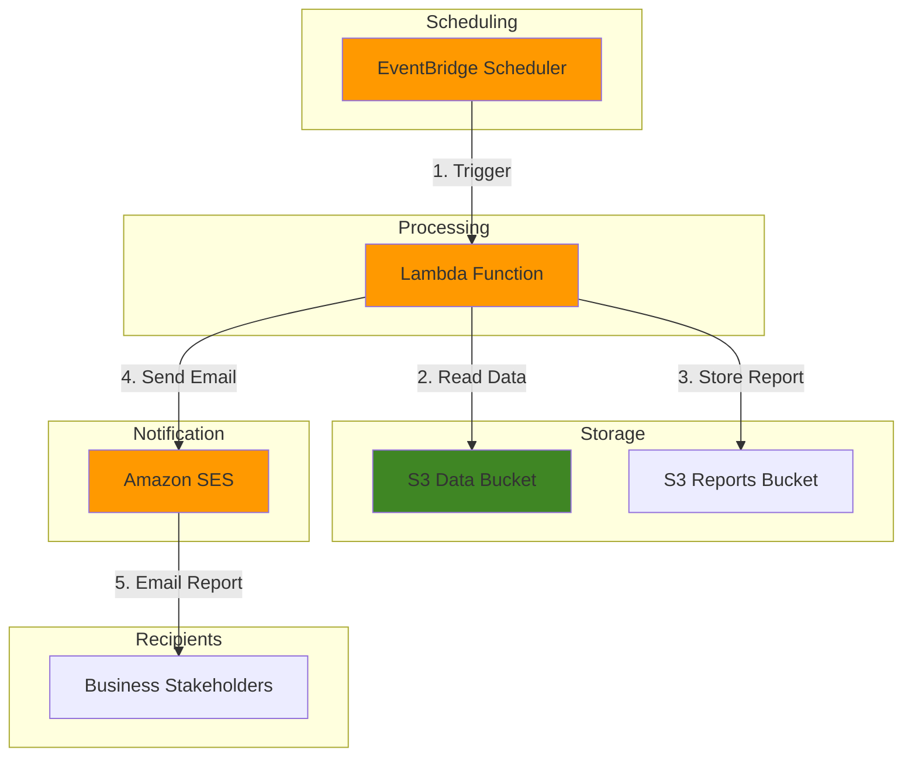

# Automated Report Generation with EventBridge Scheduler

## Problem

Organizations need to generate and distribute regular business reports from data stored in S3, but manual report generation is time-consuming and prone to delays. Teams struggle to maintain consistent reporting schedules, leading to missed deadlines and stakeholders receiving outdated information that impacts decision-making.

## Solution

Create an automated reporting system using EventBridge Scheduler to trigger Lambda functions that process S3 data and generate reports on a defined schedule. This serverless solution ensures consistent report delivery while reducing operational overhead and providing scalable, cost-effective automation.

## Architecture Diagram



## Prerequisites

1. AWS account with appropriate permissions for EventBridge Scheduler, Lambda, S3, and SES
2. AWS CLI installed and configured (version 2.0 or later)
3. Basic understanding of Python and serverless computing concepts
4. Verified email address in Amazon SES for sending reports
5. Estimated cost: $0.50-$2.00 per month for typical usage patterns

> **Note**: This solution follows AWS Well-Architected Framework principles by using serverless services for automatic scaling and cost optimization. Review the [AWS Well-Architected Framework](https://docs.aws.amazon.com/wellarchitected/latest/framework/welcome.html) for additional guidance.

## Preparation

```bash
# Set AWS environment variables
export AWS_REGION=$(aws configure get region)
export AWS_ACCOUNT_ID=$(aws sts get-caller-identity \
    --query Account --output text)

# Generate unique identifiers for resources
RANDOM_SUFFIX=$(aws secretsmanager get-random-password \
    --exclude-punctuation --exclude-uppercase \
    --password-length 6 --require-each-included-type \
    --output text --query RandomPassword)

# Set resource names
export DATA_BUCKET="report-data-${RANDOM_SUFFIX}"
export REPORTS_BUCKET="report-output-${RANDOM_SUFFIX}"
export LAMBDA_FUNCTION="report-generator-${RANDOM_SUFFIX}"
export SCHEDULE_NAME="daily-reports-${RANDOM_SUFFIX}"
export VERIFIED_EMAIL="your-verified-email@example.com"

echo "✅ AWS environment configured with region: ${AWS_REGION}"
```

## Steps

1. **Create S3 Buckets for Data Storage and Report Output**:

   Amazon S3 provides highly durable object storage with 99.999999999% (11 9's) durability, making it ideal for storing both source data and generated reports. Creating separate buckets for data and reports establishes clear data organization and enables different access patterns and lifecycle policies for each use case.

   ```bash
   # Create bucket for source data
   aws s3 mb s3://${DATA_BUCKET} --region ${AWS_REGION}
   
   # Create bucket for generated reports
   aws s3 mb s3://${REPORTS_BUCKET} --region ${AWS_REGION}
   
   # Enable versioning on both buckets for data protection
   aws s3api put-bucket-versioning \
       --bucket ${DATA_BUCKET} \
       --versioning-configuration Status=Enabled
   
   aws s3api put-bucket-versioning \
       --bucket ${REPORTS_BUCKET} \
       --versioning-configuration Status=Enabled
   
   echo "✅ S3 buckets created: ${DATA_BUCKET} and ${REPORTS_BUCKET}"
   ```

   The buckets now provide enterprise-grade durability and versioning for data protection. This foundation supports scalable data storage and retrieval patterns required for automated report generation while maintaining complete data history through versioning.

2. **Upload Sample Data to S3**:

   Sample data provides the foundation for report generation and testing. Creating structured CSV data simulates real-world business scenarios with sales and inventory information, enabling immediate testing of the complete reporting pipeline.

   ```bash
   # Create sample sales data for testing
   cat > sample_sales.csv << 'EOF'
   Date,Product,Sales,Region
   2025-01-01,Product A,1000,North
   2025-01-01,Product B,1500,South
   2025-01-02,Product A,1200,North
   2025-01-02,Product B,800,South
   2025-01-03,Product A,1100,North
   2025-01-03,Product B,1300,South
   EOF
   
   # Upload sales data to S3
   aws s3 cp sample_sales.csv s3://${DATA_BUCKET}/sales/
   
   # Create sample inventory data for comprehensive reporting
   cat > sample_inventory.csv << 'EOF'
   Product,Stock,Warehouse,Last_Updated
   Product A,250,Warehouse 1,2025-01-03
   Product B,180,Warehouse 1,2025-01-03
   Product A,300,Warehouse 2,2025-01-03
   Product B,220,Warehouse 2,2025-01-03
   EOF
   
   # Upload inventory data to S3
   aws s3 cp sample_inventory.csv s3://${DATA_BUCKET}/inventory/
   
   echo "✅ Sample data uploaded to S3 bucket"
   ```

   The sample data now provides a realistic foundation for report generation, simulating business scenarios with sales and inventory information that demonstrates the system's ability to process and correlate multiple data sources into meaningful reports.

3. **Create IAM Role for Lambda Function**:

   The Lambda execution role defines permissions following AWS security best practices and the principle of least privilege. This role enables the Lambda function to read from S3 buckets, send emails via SES, and write CloudWatch logs for monitoring and troubleshooting.

   ```bash
   # Create trust policy for Lambda service
   cat > lambda-trust-policy.json << 'EOF'
   {
     "Version": "2012-10-17",
     "Statement": [
       {
         "Effect": "Allow",
         "Principal": {
           "Service": "lambda.amazonaws.com"
         },
         "Action": "sts:AssumeRole"
       }
     ]
   }
   EOF
   
   # Create IAM role
   aws iam create-role \
       --role-name ReportGeneratorRole \
       --assume-role-policy-document file://lambda-trust-policy.json
   
   # Attach AWS managed policy for basic Lambda execution
   aws iam attach-role-policy \
       --role-name ReportGeneratorRole \
       --policy-arn arn:aws:iam::aws:policy/service-role/AWSLambdaBasicExecutionRole
   
   # Create custom policy for S3 and SES access
   cat > lambda-permissions-policy.json << EOF
   {
     "Version": "2012-10-17",
     "Statement": [
       {
         "Effect": "Allow",
         "Action": [
           "s3:GetObject",
           "s3:PutObject",
           "s3:ListBucket"
         ],
         "Resource": [
           "arn:aws:s3:::${DATA_BUCKET}",
           "arn:aws:s3:::${DATA_BUCKET}/*",
           "arn:aws:s3:::${REPORTS_BUCKET}",
           "arn:aws:s3:::${REPORTS_BUCKET}/*"
         ]
       },
       {
         "Effect": "Allow",
         "Action": [
           "ses:SendEmail",
           "ses:SendRawEmail"
         ],
         "Resource": "*"
       }
     ]
   }
   EOF
   
   # Create and attach custom policy
   aws iam create-policy \
       --policy-name ReportGeneratorPolicy \
       --policy-document file://lambda-permissions-policy.json
   
   aws iam attach-role-policy \
       --role-name ReportGeneratorRole \
       --policy-arn arn:aws:iam::${AWS_ACCOUNT_ID}:policy/ReportGeneratorPolicy
   
   echo "✅ IAM role created with least-privilege permissions"
   ```

   The IAM role now provides secure, least-privilege access to required AWS services, enabling the Lambda function to operate within defined security boundaries while maintaining full functionality for report generation, storage, and distribution.

4. **Create Lambda Function for Report Generation**:

   AWS Lambda provides serverless compute that automatically scales based on demand, making it perfect for scheduled report generation. The function processes S3 data, generates comprehensive reports, and sends them via email, all without server management overhead or capacity planning.

   ```bash
   # Create Lambda function code with comprehensive report generation
   cat > report_generator.py << 'EOF'
   import boto3
   import csv
   import json
   import os
   from datetime import datetime
   from email.mime.multipart import MIMEMultipart
   from email.mime.text import MIMEText
   from email.mime.base import MIMEBase
   from email import encoders
   import io
   
   def lambda_handler(event, context):
       s3 = boto3.client('s3')
       ses = boto3.client('ses')
       
       data_bucket = os.environ['DATA_BUCKET']
       reports_bucket = os.environ['REPORTS_BUCKET']
       email_address = os.environ['EMAIL_ADDRESS']
       
       try:
           # Read sales data from S3
           response = s3.get_object(Bucket=data_bucket, Key='sales/sample_sales.csv')
           sales_data = response['Body'].read().decode('utf-8')
           
           # Read inventory data from S3
           response = s3.get_object(Bucket=data_bucket, Key='inventory/sample_inventory.csv')
           inventory_data = response['Body'].read().decode('utf-8')
           
           # Generate comprehensive report
           report_content = generate_report(sales_data, inventory_data)
           
           # Save report to S3 with timestamp
           report_key = f"reports/daily_report_{datetime.now().strftime('%Y%m%d_%H%M%S')}.csv"
           s3.put_object(
               Bucket=reports_bucket,
               Key=report_key,
               Body=report_content,
               ContentType='text/csv'
           )
           
           # Send email notification with report attachment
           send_email_report(ses, email_address, report_content, report_key)
           
           return {
               'statusCode': 200,
               'body': json.dumps(f'Report generated successfully: {report_key}')
           }
           
       except Exception as e:
           print(f"Error generating report: {str(e)}")
           return {
               'statusCode': 500,
               'body': json.dumps(f'Error generating report: {str(e)}')
           }
   
   def generate_report(sales_data, inventory_data):
       # Process sales data and calculate totals
       sales_reader = csv.DictReader(io.StringIO(sales_data))
       sales_summary = {}
       
       for row in sales_reader:
           product = row['Product']
           sales = int(row['Sales'])
           if product not in sales_summary:
               sales_summary[product] = 0
           sales_summary[product] += sales
       
       # Process inventory data and calculate totals
       inventory_reader = csv.DictReader(io.StringIO(inventory_data))
       inventory_summary = {}
       
       for row in inventory_reader:
           product = row['Product']
           stock = int(row['Stock'])
           if product not in inventory_summary:
               inventory_summary[product] = 0
           inventory_summary[product] += stock
       
       # Generate combined business report
       output = io.StringIO()
       writer = csv.writer(output)
       writer.writerow(['Product', 'Total Sales', 'Total Inventory', 'Sales Ratio'])
       
       for product in sales_summary:
           total_sales = sales_summary[product]
           total_inventory = inventory_summary.get(product, 0)
           sales_ratio = total_sales / total_inventory if total_inventory > 0 else 0
           writer.writerow([product, total_sales, total_inventory, f"{sales_ratio:.2f}"])
       
       return output.getvalue()
   
   def send_email_report(ses, email_address, report_content, report_key):
       subject = f"Daily Business Report - {datetime.now().strftime('%Y-%m-%d')}"
       
       msg = MIMEMultipart()
       msg['From'] = email_address
       msg['To'] = email_address
       msg['Subject'] = subject
       
       body = f"""
       Dear Team,
       
       Please find attached the daily business report generated on {datetime.now().strftime('%Y-%m-%d %H:%M:%S')}.
       
       Report includes:
       - Sales summary by product
       - Inventory levels by product
       - Sales ratio analysis
       
       This report has been automatically generated and stored in S3 at: {report_key}
       
       Best regards,
       Automated Reporting System
       """
       
       msg.attach(MIMEText(body, 'plain'))
       
       # Attach CSV report
       attachment = MIMEBase('application', 'octet-stream')
       attachment.set_payload(report_content.encode())
       encoders.encode_base64(attachment)
       attachment.add_header(
           'Content-Disposition',
           f'attachment; filename=daily_report_{datetime.now().strftime("%Y%m%d")}.csv'
       )
       msg.attach(attachment)
       
       # Send email using SES
       ses.send_raw_email(
           Source=email_address,
           Destinations=[email_address],
           RawMessage={'Data': msg.as_string()}
       )
   EOF
   
   # Create deployment package
   zip function.zip report_generator.py
   
   # Create Lambda function with appropriate timeout and memory
   aws lambda create-function \
       --function-name ${LAMBDA_FUNCTION} \
       --runtime python3.12 \
       --role arn:aws:iam::${AWS_ACCOUNT_ID}:role/ReportGeneratorRole \
       --handler report_generator.lambda_handler \
       --zip-file fileb://function.zip \
       --timeout 300 \
       --memory-size 512 \
       --environment Variables="{DATA_BUCKET=${DATA_BUCKET},REPORTS_BUCKET=${REPORTS_BUCKET},EMAIL_ADDRESS=${VERIFIED_EMAIL}}"
   
   echo "✅ Lambda function created with report generation capabilities"
   ```

   The Lambda function now provides comprehensive report generation capabilities, combining data processing, business logic, file storage, and email notification in a single serverless solution that scales automatically based on demand while maintaining cost efficiency through pay-per-execution pricing.

5. **Create EventBridge Scheduler for Automated Execution**:

   Amazon EventBridge Scheduler provides a serverless, fully managed scheduling service that triggers Lambda functions with precise timing control. This service eliminates the need for server-based cron jobs while providing flexible scheduling options, built-in retry logic, and automatic scaling.

   ```bash
   # Create IAM role for EventBridge Scheduler
   cat > scheduler-trust-policy.json << 'EOF'
   {
     "Version": "2012-10-17",
     "Statement": [
       {
         "Effect": "Allow",
         "Principal": {
           "Service": "scheduler.amazonaws.com"
         },
         "Action": "sts:AssumeRole"
       }
     ]
   }
   EOF
   
   aws iam create-role \
       --role-name EventBridgeSchedulerRole \
       --assume-role-policy-document file://scheduler-trust-policy.json
   
   # Create policy for Lambda function invocation
   cat > scheduler-permissions-policy.json << EOF
   {
     "Version": "2012-10-17",
     "Statement": [
       {
         "Effect": "Allow",
         "Action": [
           "lambda:InvokeFunction"
         ],
         "Resource": "arn:aws:lambda:${AWS_REGION}:${AWS_ACCOUNT_ID}:function:${LAMBDA_FUNCTION}"
       }
     ]
   }
   EOF
   
   aws iam create-policy \
       --policy-name EventBridgeSchedulerPolicy \
       --policy-document file://scheduler-permissions-policy.json
   
   aws iam attach-role-policy \
       --role-name EventBridgeSchedulerRole \
       --policy-arn arn:aws:iam::${AWS_ACCOUNT_ID}:policy/EventBridgeSchedulerPolicy
   
   # Create EventBridge schedule for daily execution at 9 AM UTC
   aws scheduler create-schedule \
       --name ${SCHEDULE_NAME} \
       --schedule-expression "cron(0 9 * * ? *)" \
       --target "{\"Arn\":\"arn:aws:lambda:${AWS_REGION}:${AWS_ACCOUNT_ID}:function:${LAMBDA_FUNCTION}\",\"RoleArn\":\"arn:aws:iam::${AWS_ACCOUNT_ID}:role/EventBridgeSchedulerRole\"}" \
       --flexible-time-window "{\"Mode\":\"OFF\"}" \
       --description "Daily business report generation"
   
   echo "✅ EventBridge schedule created for daily execution at 9 AM UTC"
   ```

   The EventBridge Scheduler now provides reliable, serverless scheduling that automatically triggers report generation daily at 9 AM UTC. The service includes built-in error handling, retry capabilities, and monitoring through CloudWatch metrics, ensuring consistent report delivery without operational overhead.

6. **Configure Email Verification in SES**:

   Amazon SES requires email address verification to prevent spam, ensure deliverability, and maintain sender reputation. Email verification establishes sender identity and enables email sending capabilities for the automated reporting system while protecting against unauthorized use.

   ```bash
   # Verify email identity in SES
   aws ses verify-email-identity --email-address ${VERIFIED_EMAIL}
   
   # Check current verification status
   aws ses get-identity-verification-attributes \
       --identities ${VERIFIED_EMAIL}
   
   echo "✅ Email verification initiated for ${VERIFIED_EMAIL}"
   echo "📧 Please check your email and click the verification link"
   echo "Note: Reports will not be sent until email verification is complete"
   ```

   Email verification is now initiated through SES. The automated reporting system will be able to send emails once verification is complete, establishing a secure and compliant communication channel for report distribution to business stakeholders.

## Validation & Testing

1. **Test Lambda Function Execution**:

   ```bash
   # Invoke Lambda function manually to test report generation
   aws lambda invoke \
       --function-name ${LAMBDA_FUNCTION} \
       --payload '{}' \
       response.json
   
   # Check execution result
   cat response.json
   ```

   Expected output: `{"statusCode": 200, "body": "\"Report generated successfully: reports/daily_report_YYYYMMDD_HHMMSS.csv\""}`

2. **Verify Report Generation in S3**:

   ```bash
   # List generated reports in S3
   aws s3 ls s3://${REPORTS_BUCKET}/reports/
   
   # Download and examine the latest report
   LATEST_REPORT=$(aws s3 ls s3://${REPORTS_BUCKET}/reports/ \
       --query 'sort_by(Contents, &LastModified)[-1].Key' \
       --output text)
   
   aws s3 cp s3://${REPORTS_BUCKET}/${LATEST_REPORT} ./latest_report.csv
   cat latest_report.csv
   ```

   Expected output: CSV file with Product, Total Sales, Total Inventory, and Sales Ratio columns containing processed business data

3. **Verify EventBridge Schedule Status**:

   ```bash
   # Check schedule configuration and status
   aws scheduler get-schedule --name ${SCHEDULE_NAME}
   
   # Verify schedule is active
   aws scheduler get-schedule --name ${SCHEDULE_NAME} \
       --query 'State' --output text
   ```

   Expected output: `ENABLED`

4. **Test Email Verification Status**:

   ```bash
   # Check SES email verification status
   aws ses get-identity-verification-attributes \
       --identities ${VERIFIED_EMAIL} \
       --query 'VerificationAttributes.*.VerificationStatus' \
       --output text
   ```

   Expected output: `Success` (after email verification is complete)

## Cleanup

1. **Delete EventBridge Schedule**:

   ```bash
   # Delete the schedule
   aws scheduler delete-schedule --name ${SCHEDULE_NAME}
   
   echo "✅ EventBridge schedule deleted"
   ```

2. **Delete Lambda Function**:

   ```bash
   # Delete Lambda function
   aws lambda delete-function --function-name ${LAMBDA_FUNCTION}
   
   echo "✅ Lambda function deleted"
   ```

3. **Remove S3 Buckets and Contents**:

   ```bash
   # Empty and delete S3 buckets
   aws s3 rm s3://${DATA_BUCKET} --recursive
   aws s3 rb s3://${DATA_BUCKET}
   
   aws s3 rm s3://${REPORTS_BUCKET} --recursive
   aws s3 rb s3://${REPORTS_BUCKET}
   
   echo "✅ S3 buckets deleted"
   ```

4. **Delete IAM Roles and Policies**:

   ```bash
   # Detach and delete Lambda role policies
   aws iam detach-role-policy \
       --role-name ReportGeneratorRole \
       --policy-arn arn:aws:iam::aws:policy/service-role/AWSLambdaBasicExecutionRole
   
   aws iam detach-role-policy \
       --role-name ReportGeneratorRole \
       --policy-arn arn:aws:iam::${AWS_ACCOUNT_ID}:policy/ReportGeneratorPolicy
   
   aws iam delete-policy \
       --policy-arn arn:aws:iam::${AWS_ACCOUNT_ID}:policy/ReportGeneratorPolicy
   
   aws iam delete-role --role-name ReportGeneratorRole
   
   # Delete EventBridge Scheduler role and policy
   aws iam detach-role-policy \
       --role-name EventBridgeSchedulerRole \
       --policy-arn arn:aws:iam::${AWS_ACCOUNT_ID}:policy/EventBridgeSchedulerPolicy
   
   aws iam delete-policy \
       --policy-arn arn:aws:iam::${AWS_ACCOUNT_ID}:policy/EventBridgeSchedulerPolicy
   
   aws iam delete-role --role-name EventBridgeSchedulerRole
   
   # Clean up local files
   rm -f lambda-trust-policy.json lambda-permissions-policy.json
   rm -f scheduler-trust-policy.json scheduler-permissions-policy.json
   rm -f report_generator.py function.zip response.json
   rm -f sample_sales.csv sample_inventory.csv latest_report.csv
   
   echo "✅ All AWS resources and local files cleaned up"
   ```

## Discussion

This automated reporting solution demonstrates the power of serverless architecture for business process automation. EventBridge Scheduler provides precise timing control with built-in retry logic and error handling, while Lambda offers cost-effective compute that scales automatically from zero to thousands of concurrent executions based on demand. The combination eliminates server management overhead, reduces operational costs, and ensures reliable report generation and delivery.

The solution leverages S3's exceptional durability (99.999999999% - 11 9's) and scalability for both data storage and report archival, creating a comprehensive data management foundation that can handle growth from gigabytes to petabytes. The separation of data and reports buckets enables different access patterns, security policies, and lifecycle management strategies, optimizing costs while maintaining clear data organization and governance.

Amazon SES integration provides enterprise-grade email delivery with advanced features including bounce handling, reputation management, and detailed delivery analytics. The service's programmatic API enables complex email scenarios including HTML formatting, attachments, and personalized content. For production environments, SES can be moved out of the sandbox to support higher sending volumes and broader recipient domains, making it suitable for enterprise-scale report distribution.

Security implementation follows AWS Well-Architected Framework principles through IAM roles with least-privilege access, encryption at rest in S3, and secure API communications over HTTPS. The solution provides a strong foundation that can be extended with additional security measures such as VPC endpoints for private service communication, AWS KMS encryption for sensitive data, and comprehensive audit logging through CloudTrail.

> **Tip**: Monitor Lambda execution and set up CloudWatch alarms for failed report generation to ensure business continuity. Use CloudWatch Logs Insights to analyze report generation patterns and optimize performance.

**Documentation Sources:**
- [EventBridge Scheduler User Guide](https://docs.aws.amazon.com/scheduler/latest/UserGuide/what-is-scheduler.html)
- [Lambda Developer Guide - EventBridge Integration](https://docs.aws.amazon.com/lambda/latest/dg/with-eventbridge-scheduler.html)
- [SES Developer Guide - Sending Email Programmatically](https://docs.aws.amazon.com/ses/latest/dg/send-an-email-using-sdk-programmatically.html)
- [S3 User Guide - Object Storage](https://docs.aws.amazon.com/AmazonS3/latest/userguide/Welcome.html)
- [IAM User Guide - Best Practices](https://docs.aws.amazon.com/IAM/latest/UserGuide/best-practices.html)

## Challenge

Extend this solution by implementing these enhancements:

1. **Multi-format Report Generation**: Modify the Lambda function to generate reports in multiple formats (PDF, Excel, JSON) using libraries like ReportLab or openpyxl, and allow recipients to specify their preferred format through parameter store configuration.

2. **Advanced Scheduling Options**: Implement multiple EventBridge schedules for different report types (daily, weekly, monthly) with different data sources, processing logic, and recipient lists, demonstrating the flexibility of serverless scheduling.

3. **Data Visualization Integration**: Add Amazon QuickSight integration to generate dashboard-style reports with charts and visualizations, then embed these graphics directly in email notifications for enhanced business intelligence.

4. **Error Handling and Monitoring**: Implement comprehensive error handling with SNS notifications to administrators when report generation fails, including automatic retry logic, escalation procedures, and detailed error reporting through CloudWatch.

5. **Dynamic Data Discovery**: Extend the solution to automatically discover and process new data files in S3 using S3 event notifications, enabling real-time report generation when new data arrives rather than relying solely on scheduled execution.

## Infrastructure Code

*Infrastructure code will be generated after recipe approval.*