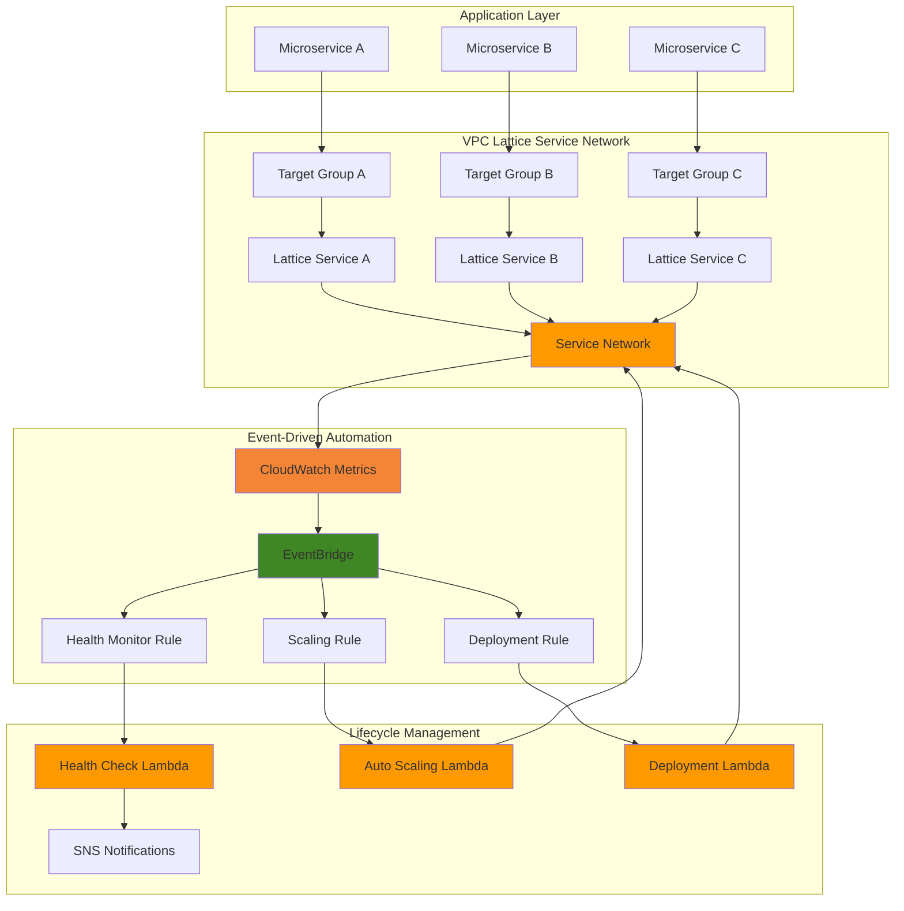

# Automated Service Lifecycle with VPC Lattice and EventBridge

## Problem

Enterprise organizations managing complex microservice architectures face significant challenges in manually deploying, monitoring, and scaling services across multiple VPCs and accounts. Traditional approaches require manual intervention for service registration, health monitoring, and lifecycle management, leading to increased operational overhead, slower incident response times, and potential service outages that impact business operations and customer experience.

## Solution

Implement an automated service lifecycle management system using VPC Lattice for service networking, EventBridge for event routing, and Lambda for orchestration. This solution automatically detects service deployments, monitors health metrics via CloudWatch, and triggers appropriate lifecycle actions such as scaling, failover, or remediation based on real-time service events, reducing operational overhead and improving service reliability.

## Architecture Diagram



## Prerequisites

1. AWS account with appropriate permissions for VPC Lattice, EventBridge, Lambda, and CloudWatch
2. AWS CLI installed and configured (or CloudShell access)
3. Basic knowledge of microservices architecture and event-driven patterns
4. Understanding of VPC networking concepts and service discovery
5. Estimated cost: $25-50 per month for testing environment (varies by usage)

> **Note**: This configuration follows AWS Well-Architected Framework principles for operational excellence and reliability. Review [AWS Well-Architected Framework](https://docs.aws.amazon.com/wellarchitected/latest/framework/welcome.html) for additional guidance.

## Preparation

```bash
# Set environment variables
export AWS_REGION=$(aws configure get region)
export AWS_ACCOUNT_ID=$(aws sts get-caller-identity \
    --query Account --output text)

# Generate unique identifiers for resources
RANDOM_SUFFIX=$(aws secretsmanager get-random-password \
    --exclude-punctuation --exclude-uppercase \
    --password-length 6 --require-each-included-type \
    --output text --query RandomPassword)

# Define resource names
export SERVICE_NETWORK_NAME="microservices-network-${RANDOM_SUFFIX}"
export EVENTBRIDGE_BUS_NAME="service-lifecycle-bus-${RANDOM_SUFFIX}"
export LAMBDA_ROLE_NAME="service-lifecycle-role-${RANDOM_SUFFIX}"
export LOG_GROUP_NAME="/aws/vpclattice/service-lifecycle-${RANDOM_SUFFIX}"

# Create CloudWatch Log Group for VPC Lattice access logs
aws logs create-log-group \
    --log-group-name ${LOG_GROUP_NAME} \
    --retention-in-days 7

# Create IAM role for Lambda functions
aws iam create-role \
    --role-name ${LAMBDA_ROLE_NAME} \
    --assume-role-policy-document '{
        "Version": "2012-10-17",
        "Statement": [
            {
                "Effect": "Allow",
                "Principal": {
                    "Service": "lambda.amazonaws.com"
                },
                "Action": "sts:AssumeRole"
            }
        ]
    }'

# Attach necessary policies
aws iam attach-role-policy \
    --role-name ${LAMBDA_ROLE_NAME} \
    --policy-arn arn:aws:iam::aws:policy/service-role/AWSLambdaBasicExecutionRole

aws iam attach-role-policy \
    --role-name ${LAMBDA_ROLE_NAME} \
    --policy-arn arn:aws:iam::aws:policy/VPCLatticeFullAccess

aws iam attach-role-policy \
    --role-name ${LAMBDA_ROLE_NAME} \
    --policy-arn arn:aws:iam::aws:policy/CloudWatchFullAccess

echo "✅ AWS environment configured with unique suffix: ${RANDOM_SUFFIX}"
```

## Steps

1. **Create VPC Lattice Service Network**:

   VPC Lattice provides application-layer networking that simplifies service discovery and communication across VPCs and accounts. The service network acts as a logical boundary for microservices, enabling consistent connectivity, monitoring, and security policies without complex network configuration.

   ```bash
   # Create VPC Lattice service network
   SERVICE_NETWORK_ID=$(aws vpc-lattice create-service-network \
       --name ${SERVICE_NETWORK_NAME} \
       --auth-type AWS_IAM \
       --query 'id' --output text)
   
   # Get the CloudWatch Log Group ARN for access logs
   LOG_GROUP_ARN=$(aws logs describe-log-groups \
       --log-group-name-prefix ${LOG_GROUP_NAME} \
       --query 'logGroups[0].arn' --output text)
   
   # Enable access logs for the service network
   aws vpc-lattice create-access-log-subscription \
       --resource-identifier ${SERVICE_NETWORK_ID} \
       --destination-arn ${LOG_GROUP_ARN}
   
   echo "✅ VPC Lattice service network created: ${SERVICE_NETWORK_ID}"
   ```

   The service network now provides the foundation for microservice communication with built-in observability and security controls, enabling automated lifecycle management through centralized monitoring and event generation.

2. **Create Custom EventBridge Bus**:

   EventBridge enables decoupled, event-driven architecture by routing service lifecycle events to appropriate targets. Creating a custom event bus provides dedicated event processing for microservice lifecycle events, improving organization and reducing cross-application interference.

   ```bash
   # Create custom EventBridge bus for service lifecycle events
   aws events create-event-bus \
       --name ${EVENTBRIDGE_BUS_NAME}
   
   # Get EventBridge bus ARN for later use
   EVENTBRIDGE_BUS_ARN=$(aws events describe-event-bus \
       --name ${EVENTBRIDGE_BUS_NAME} \
       --query 'Arn' --output text)
   
   echo "✅ EventBridge custom bus created: ${EVENTBRIDGE_BUS_NAME}"
   ```

   The custom event bus enables isolated event processing for service lifecycle management, providing better security, monitoring, and governance compared to using the default event bus.

3. **Create Service Health Monitoring Lambda Function**:

   This Lambda function monitors VPC Lattice service health metrics and publishes lifecycle events to EventBridge. The serverless approach provides cost-effective, automatic scaling while maintaining low latency for critical health monitoring operations.

   ```bash
   # Create health monitoring Lambda function code
   cat > health_monitor.py << 'EOF'
import json
import boto3
import os
from datetime import datetime, timedelta

def lambda_handler(event, context):
    lattice = boto3.client('vpc-lattice')
    cloudwatch = boto3.client('cloudwatch')
    eventbridge = boto3.client('events')
    
    service_network_id = os.environ['SERVICE_NETWORK_ID']
    event_bus_name = os.environ['EVENT_BUS_NAME']
    
    try:
        # Get service network services
        services = lattice.list_services(
            serviceNetworkIdentifier=service_network_id
        )
        
        for service in services.get('items', []):
            service_id = service['id']
            service_name = service['name']
            
            # Get CloudWatch metrics for service health
            end_time = datetime.utcnow()
            start_time = end_time - timedelta(minutes=5)
            
            metrics = cloudwatch.get_metric_statistics(
                Namespace='AWS/VpcLattice',
                MetricName='RequestCount',
                Dimensions=[
                    {'Name': 'ServiceId', 'Value': service_id}
                ],
                StartTime=start_time,
                EndTime=end_time,
                Period=300,
                Statistics=['Sum']
            )
            
            # Determine service health based on metrics
            request_count = sum([point['Sum'] for point in metrics['Datapoints']])
            health_status = 'healthy' if request_count > 0 else 'unhealthy'
            
            # Publish service health event
            event_detail = {
                'serviceId': service_id,
                'serviceName': service_name,
                'healthStatus': health_status,
                'requestCount': request_count,
                'timestamp': datetime.utcnow().isoformat()
            }
            
            eventbridge.put_events(
                Entries=[
                    {
                        'Source': 'vpc-lattice.health-monitor',
                        'DetailType': 'Service Health Check',
                        'Detail': json.dumps(event_detail),
                        'EventBusName': event_bus_name
                    }
                ]
            )
        
        return {'statusCode': 200, 'body': 'Health check completed'}
        
    except Exception as e:
        print(f"Error in health monitoring: {str(e)}")
        return {'statusCode': 500, 'body': f"Error: {str(e)}"}
EOF
   
   # Package Lambda function
   zip -r health_monitor.zip health_monitor.py
   
   # Create Lambda function with latest Python runtime
   HEALTH_LAMBDA_ARN=$(aws lambda create-function \
       --function-name service-health-monitor-${RANDOM_SUFFIX} \
       --runtime python3.12 \
       --role arn:aws:iam::${AWS_ACCOUNT_ID}:role/${LAMBDA_ROLE_NAME} \
       --handler health_monitor.lambda_handler \
       --zip-file fileb://health_monitor.zip \
       --timeout 60 \
       --memory-size 256 \
       --environment Variables="{SERVICE_NETWORK_ID=${SERVICE_NETWORK_ID},EVENT_BUS_NAME=${EVENTBRIDGE_BUS_NAME}}" \
       --query 'FunctionArn' --output text)
   
   echo "✅ Health monitoring Lambda function created: ${HEALTH_LAMBDA_ARN}"
   ```

   The health monitoring function now actively monitors VPC Lattice services and generates real-time health events, enabling proactive lifecycle management and rapid response to service issues.

4. **Create Auto-Scaling Lambda Function**:

   This function responds to service health events and implements scaling decisions based on predefined thresholds. The event-driven scaling approach provides faster response times compared to traditional metric-based scaling while maintaining fine-grained control over scaling decisions.

   ```bash
   # Create auto-scaling Lambda function code
   cat > auto_scaler.py << 'EOF'
import json
import boto3
import os

def lambda_handler(event, context):
    lattice = boto3.client('vpc-lattice')
    ecs = boto3.client('ecs')
    
    try:
        # Parse EventBridge event
        detail = json.loads(event['detail']) if isinstance(event['detail'], str) else event['detail']
        service_id = detail['serviceId']
        service_name = detail['serviceName']
        health_status = detail['healthStatus']
        request_count = detail['requestCount']
        
        print(f"Processing scaling event for service: {service_name}")
        print(f"Health status: {health_status}, Request count: {request_count}")
        
        # Get target groups for the service
        target_groups = lattice.list_target_groups(
            serviceIdentifier=service_id
        )
        
        for tg in target_groups.get('items', []):
            tg_id = tg['id']
            
            # Get current target count
            targets = lattice.list_targets(
                targetGroupIdentifier=tg_id
            )
            current_count = len(targets.get('items', []))
            
            # Determine scaling action
            if health_status == 'unhealthy' and current_count < 5:
                # Scale up if unhealthy and below max capacity
                print(f"Triggering scale-up for target group: {tg_id}")
                # In real implementation, trigger ECS/ASG scaling
                
            elif health_status == 'healthy' and request_count < 10 and current_count > 1:
                # Scale down if healthy with low traffic
                print(f"Triggering scale-down for target group: {tg_id}")
                # In real implementation, trigger ECS/ASG scaling
        
        return {'statusCode': 200, 'body': 'Scaling evaluation completed'}
        
    except Exception as e:
        print(f"Error in auto-scaling: {str(e)}")
        return {'statusCode': 500, 'body': f"Error: {str(e)}"}
EOF
   
   # Package and create auto-scaling Lambda function
   zip -r auto_scaler.zip auto_scaler.py
   
   AUTOSCALE_LAMBDA_ARN=$(aws lambda create-function \
       --function-name service-auto-scaler-${RANDOM_SUFFIX} \
       --runtime python3.12 \
       --role arn:aws:iam::${AWS_ACCOUNT_ID}:role/${LAMBDA_ROLE_NAME} \
       --handler auto_scaler.lambda_handler \
       --zip-file fileb://auto_scaler.zip \
       --timeout 60 \
       --memory-size 256 \
       --query 'FunctionArn' --output text)
   
   echo "✅ Auto-scaling Lambda function created: ${AUTOSCALE_LAMBDA_ARN}"
   ```

   The auto-scaling function enables intelligent, event-driven scaling decisions that respond faster than traditional CloudWatch alarms while providing more sophisticated logic for scaling operations.

5. **Create EventBridge Rules for Lifecycle Management**:

   EventBridge rules enable precise event filtering and routing to appropriate Lambda functions. This pattern-based approach ensures that lifecycle events trigger the correct automation workflows while maintaining loose coupling between system components.

   ```bash
   # Create rule for service health monitoring events
   aws events put-rule \
       --event-bus-name ${EVENTBRIDGE_BUS_NAME} \
       --name health-monitoring-rule-${RANDOM_SUFFIX} \
       --event-pattern '{
           "source": ["vpc-lattice.health-monitor"],
           "detail-type": ["Service Health Check"],
           "detail": {
               "healthStatus": ["unhealthy", "healthy"]
           }
       }' \
       --state ENABLED
   
   # Add Lambda target to health monitoring rule
   aws events put-targets \
       --event-bus-name ${EVENTBRIDGE_BUS_NAME} \
       --rule health-monitoring-rule-${RANDOM_SUFFIX} \
       --targets Id=1,Arn=${AUTOSCALE_LAMBDA_ARN}
   
   # Grant EventBridge permission to invoke Lambda
   aws lambda add-permission \
       --function-name service-auto-scaler-${RANDOM_SUFFIX} \
       --statement-id eventbridge-invoke-${RANDOM_SUFFIX} \
       --action lambda:InvokeFunction \
       --principal events.amazonaws.com \
       --source-arn arn:aws:events:${AWS_REGION}:${AWS_ACCOUNT_ID}:rule/${EVENTBRIDGE_BUS_NAME}/health-monitoring-rule-${RANDOM_SUFFIX}
   
   echo "✅ EventBridge rules configured for lifecycle management"
   ```

   The EventBridge rules now provide sophisticated event routing that enables precise lifecycle automation based on service health, performance metrics, and deployment events.

6. **Create CloudWatch Scheduled Health Checks**:

   Scheduled health checks provide regular service monitoring that complements real-time event processing. This approach ensures comprehensive service visibility and enables proactive issue detection before customer impact occurs.

   ```bash
   # Create CloudWatch Events rule for scheduled health checks
   aws events put-rule \
       --name scheduled-health-check-${RANDOM_SUFFIX} \
       --schedule-expression "rate(5 minutes)" \
       --state ENABLED
   
   # Add Lambda target for scheduled health checks
   aws events put-targets \
       --rule scheduled-health-check-${RANDOM_SUFFIX} \
       --targets Id=1,Arn=${HEALTH_LAMBDA_ARN}
   
   # Grant permission for CloudWatch Events to invoke Lambda
   aws lambda add-permission \
       --function-name service-health-monitor-${RANDOM_SUFFIX} \
       --statement-id cloudwatch-scheduled-${RANDOM_SUFFIX} \
       --action lambda:InvokeFunction \
       --principal events.amazonaws.com \
       --source-arn arn:aws:events:${AWS_REGION}:${AWS_ACCOUNT_ID}:rule/scheduled-health-check-${RANDOM_SUFFIX}
   
   echo "✅ Scheduled health checks configured"
   ```

   The scheduled health checks ensure continuous service monitoring with automated lifecycle management, providing comprehensive visibility into service health and performance across the entire microservice ecosystem.

7. **Create CloudWatch Dashboard for Monitoring**:

   A centralized dashboard provides visual monitoring of service lifecycle metrics and automation effectiveness. This observability layer enables teams to understand system behavior, track automation performance, and make informed decisions about service management.

   ```bash
   # Create CloudWatch dashboard for service lifecycle monitoring
   aws cloudwatch put-dashboard \
       --dashboard-name "ServiceLifecycle-${RANDOM_SUFFIX}" \
       --dashboard-body '{
           "widgets": [
               {
                   "type": "metric",
                   "x": 0,
                   "y": 0,
                   "width": 12,
                   "height": 6,
                   "properties": {
                       "metrics": [
                           ["AWS/VpcLattice", "RequestCount"],
                           ["AWS/VpcLattice", "ResponseTime"],
                           ["AWS/VpcLattice", "TargetResponseTime"]
                       ],
                       "period": 300,
                       "stat": "Average",
                       "region": "'${AWS_REGION}'",
                       "title": "VPC Lattice Service Metrics"
                   }
               },
               {
                   "type": "log",
                   "x": 0,
                   "y": 6,
                   "width": 12,
                   "height": 6,
                   "properties": {
                       "query": "SOURCE \"/aws/lambda/service-health-monitor-'${RANDOM_SUFFIX}'\" | fields @timestamp, @message | sort @timestamp desc | limit 20",
                       "region": "'${AWS_REGION}'",
                       "title": "Health Monitor Logs"
                   }
               }
           ]
       }'
   
   echo "✅ CloudWatch dashboard created for service lifecycle monitoring"
   ```

   The dashboard provides real-time visibility into service performance, health status, and automation activities, enabling efficient monitoring and troubleshooting of the automated lifecycle management system.

## Validation & Testing

1. **Verify VPC Lattice Service Network**:

   ```bash
   # Check service network status
   aws vpc-lattice get-service-network \
       --service-network-identifier ${SERVICE_NETWORK_ID}
   ```

   Expected output: Service network details with "ACTIVE" status and access log subscription enabled.

2. **Test EventBridge Event Flow**:

   ```bash
   # Manually trigger health monitoring Lambda
   aws lambda invoke \
       --function-name service-health-monitor-${RANDOM_SUFFIX} \
       --payload '{}' \
       response.json
   
   # Check response
   cat response.json
   ```

   Expected output: Successful Lambda execution with health check results.

3. **Verify EventBridge Rules**:

   ```bash
   # List EventBridge rules
   aws events list-rules \
       --event-bus-name ${EVENTBRIDGE_BUS_NAME}
   
   # Check rule targets
   aws events list-targets-by-rule \
       --event-bus-name ${EVENTBRIDGE_BUS_NAME} \
       --rule health-monitoring-rule-${RANDOM_SUFFIX}
   ```

   Expected output: Active rules with proper Lambda function targets configured.

4. **Monitor CloudWatch Logs**:

   ```bash
   # Check Lambda function logs
   aws logs describe-log-groups \
       --log-group-name-prefix /aws/lambda/service-health-monitor
   
   # View recent log events
   aws logs filter-log-events \
       --log-group-name /aws/lambda/service-health-monitor-${RANDOM_SUFFIX} \
       --start-time $(date -d '5 minutes ago' +%s)000
   ```

   Expected output: Log entries showing successful health monitoring and event publishing.

## Cleanup

1. **Remove CloudWatch Dashboard**:

   ```bash
   # Delete CloudWatch dashboard
   aws cloudwatch delete-dashboards \
       --dashboard-names "ServiceLifecycle-${RANDOM_SUFFIX}"
   
   echo "✅ CloudWatch dashboard deleted"
   ```

2. **Remove EventBridge Configuration**:

   ```bash
   # Remove EventBridge rule targets
   aws events remove-targets \
       --event-bus-name ${EVENTBRIDGE_BUS_NAME} \
       --rule health-monitoring-rule-${RANDOM_SUFFIX} \
       --ids 1
   
   aws events remove-targets \
       --rule scheduled-health-check-${RANDOM_SUFFIX} \
       --ids 1
   
   # Delete EventBridge rules
   aws events delete-rule \
       --event-bus-name ${EVENTBRIDGE_BUS_NAME} \
       --name health-monitoring-rule-${RANDOM_SUFFIX}
   
   aws events delete-rule \
       --name scheduled-health-check-${RANDOM_SUFFIX}
   
   # Delete custom event bus
   aws events delete-event-bus \
       --name ${EVENTBRIDGE_BUS_NAME}
   
   echo "✅ EventBridge configuration removed"
   ```

3. **Remove Lambda Functions**:

   ```bash
   # Delete Lambda functions
   aws lambda delete-function \
       --function-name service-health-monitor-${RANDOM_SUFFIX}
   
   aws lambda delete-function \
       --function-name service-auto-scaler-${RANDOM_SUFFIX}
   
   # Clean up local files
   rm -f health_monitor.py health_monitor.zip \
         auto_scaler.py auto_scaler.zip response.json
   
   echo "✅ Lambda functions removed"
   ```

4. **Remove VPC Lattice Resources**:

   ```bash
   # Delete access log subscription first
   ACCESS_LOG_ID=$(aws vpc-lattice list-access-log-subscriptions \
       --resource-identifier ${SERVICE_NETWORK_ID} \
       --query 'items[0].id' --output text)
   
   if [ "${ACCESS_LOG_ID}" != "None" ]; then
       aws vpc-lattice delete-access-log-subscription \
           --access-log-subscription-identifier ${ACCESS_LOG_ID}
   fi
   
   # Delete VPC Lattice service network
   aws vpc-lattice delete-service-network \
       --service-network-identifier ${SERVICE_NETWORK_ID}
   
   echo "✅ VPC Lattice service network deleted"
   ```

5. **Remove CloudWatch and IAM Resources**:

   ```bash
   # Delete CloudWatch Log Group
   aws logs delete-log-group \
       --log-group-name ${LOG_GROUP_NAME}
   
   # Detach policies from IAM role
   aws iam detach-role-policy \
       --role-name ${LAMBDA_ROLE_NAME} \
       --policy-arn arn:aws:iam::aws:policy/service-role/AWSLambdaBasicExecutionRole
   
   aws iam detach-role-policy \
       --role-name ${LAMBDA_ROLE_NAME} \
       --policy-arn arn:aws:iam::aws:policy/VPCLatticeFullAccess
   
   aws iam detach-role-policy \
       --role-name ${LAMBDA_ROLE_NAME} \
       --policy-arn arn:aws:iam::aws:policy/CloudWatchFullAccess
   
   # Delete IAM role
   aws iam delete-role \
       --role-name ${LAMBDA_ROLE_NAME}
   
   echo "✅ CloudWatch and IAM resources cleaned up"
   ```

## Discussion

This automated service lifecycle management solution demonstrates how VPC Lattice, EventBridge, and Lambda work together to create intelligent, event-driven microservice operations. VPC Lattice acts as the application networking layer, providing service discovery, load balancing, and observability without requiring complex network configurations or service mesh sidecars. The service network abstraction simplifies connectivity across VPCs and accounts while maintaining security and performance.

EventBridge serves as the central nervous system for lifecycle events, enabling loose coupling between monitoring, decision-making, and action components. The custom event bus provides isolation and governance for service lifecycle events, while event patterns ensure precise routing to appropriate automation functions. This event-driven approach enables faster response times compared to traditional polling-based monitoring systems.

The Lambda-based automation functions provide serverless execution of lifecycle management tasks, automatically scaling based on event volume while maintaining cost efficiency. The health monitoring function generates rich event data by combining VPC Lattice metrics with CloudWatch insights, while the auto-scaling function implements intelligent scaling decisions based on service health and performance patterns. This serverless approach eliminates the need to manage dedicated infrastructure for lifecycle management operations.

The solution follows AWS Well-Architected Framework principles by implementing comprehensive monitoring, automated recovery mechanisms, and cost-optimized serverless architectures. The integration with CloudWatch provides detailed observability into both service performance and automation effectiveness, enabling continuous improvement of lifecycle management policies. Access logging through CloudWatch Logs enables audit trails and troubleshooting capabilities that are essential for production environments.

> **Tip**: Consider implementing gradual scaling policies and circuit breaker patterns in the auto-scaling Lambda function to prevent cascading failures during high-traffic scenarios.

For production environments, enhance this solution by adding SNS notifications for critical events, implementing approval workflows for major scaling decisions, and integrating with AWS Systems Manager for configuration management. The architecture can be extended to support blue-green deployments, canary releases, and cross-region failover scenarios by leveraging VPC Lattice's multi-region capabilities and EventBridge's cross-region event replication.

**Documentation References:**
- [Amazon VPC Lattice User Guide](https://docs.aws.amazon.com/vpc-lattice/latest/ug/what-is-vpc-lattice.html)
- [Amazon EventBridge User Guide](https://docs.aws.amazon.com/eventbridge/latest/userguide/eb-what-is.html)
- [CloudWatch Metrics for VPC Lattice](https://docs.aws.amazon.com/vpc-lattice/latest/ug/monitoring-cloudwatch.html)
- [EventBridge Event Patterns](https://docs.aws.amazon.com/eventbridge/latest/userguide/eb-event-patterns.html)
- [AWS Well-Architected Framework](https://docs.aws.amazon.com/wellarchitected/latest/framework/welcome.html)
- [VPC Lattice Access Logs](https://docs.aws.amazon.com/vpc-lattice/latest/ug/monitoring-access-logs.html)

## Challenge

Extend this solution by implementing these enhancements:

1. **Multi-Region Failover**: Implement cross-region service failover using VPC Lattice service network endpoints and EventBridge cross-region replication to ensure high availability during regional outages.

2. **Advanced Health Checks**: Create custom health check functions that monitor application-specific metrics beyond basic request counts, including database connectivity, external service dependencies, and business logic validation.

3. **Canary Deployment Automation**: Build automated canary deployment capabilities that gradually shift traffic to new service versions based on error rates, latency metrics, and business KPIs, with automatic rollback triggers.

4. **Cost Optimization Automation**: Develop intelligent cost optimization that automatically rightsizes target groups, implements spot instance strategies, and optimizes service configurations based on historical usage patterns and cost analytics.

5. **Security Compliance Monitoring**: Integrate AWS Config and Security Hub to automatically verify service configurations against security policies, implement automated remediation for compliance violations, and generate compliance reports for audit purposes.

## Infrastructure Code

### Available Infrastructure as Code:

- [Infrastructure Code Overview](code/README.md) - Detailed description of all infrastructure components
- [AWS CDK (Python)](code/cdk-python/) - AWS CDK Python implementation
- [AWS CDK (TypeScript)](code/cdk-typescript/) - AWS CDK TypeScript implementation
- [CloudFormation](code/cloudformation.yaml) - AWS CloudFormation template
- [Bash CLI Scripts](code/scripts/) - Example bash scripts using AWS CLI commands to deploy infrastructure
- [Terraform](code/terraform/) - Terraform configuration files