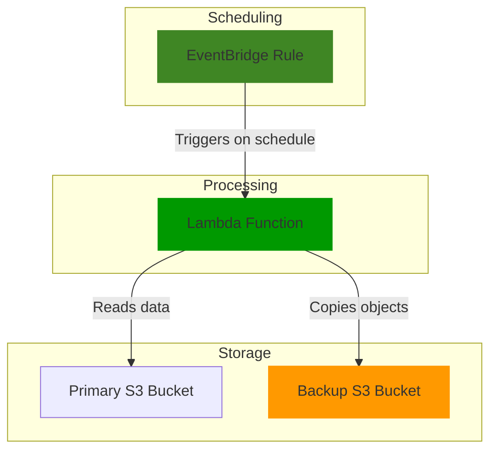

# Automating Backups with S3 and EventBridge

## Problem

Organizations need reliable backup solutions to protect critical data from accidental deletion, corruption, or disaster scenarios. Manual backup processes are error-prone, often forgotten, and don't scale well as data volumes grow. IT administrators need an automated, scheduled backup system that requires minimal maintenance while ensuring data is consistently protected.

Small to medium-sized businesses particularly struggle with implementing reliable backup strategies that balance cost-effectiveness with robust protection. Without automated backups, these organizations risk data loss that could severely impact business continuity and customer trust.

## Solution

This recipe demonstrates how to implement automated, scheduled backups using Amazon S3, EventBridge, and Lambda. S3's durability, versioning capabilities, and lifecycle policies make it an ideal backup target. EventBridge provides precise scheduling control, while Lambda handles the automation logic.

The solution creates a primary S3 bucket for your working data and a separate backup bucket with versioning enabled. An EventBridge rule triggers a Lambda function on a customizable schedule, which then copies objects from the primary bucket to the backup bucket. Lifecycle policies automatically transition older backups to cost-effective storage classes and can eventually expire them based on your retention requirements.

## Architecture Diagram



## Prerequisites

1. AWS account with permissions to create S3 buckets, Lambda functions, and EventBridge rules
2. AWS CLI v2 installed and configured
3. Basic knowledge of AWS services and command line operations
4. No existing resources required
5. Estimated cost: <$5/month for a small backup solution (varies based on data volume and storage class choices)

> **Note**: S3 charges are based on storage used, request pricing, and data transfer. This solution uses minimal compute resources, keeping costs low for small to medium datasets.

## Preparation

```bash
# Set environment variables
export AWS_REGION=$(aws configure get region)
export AWS_ACCOUNT_ID=$(aws sts get-caller-identity \
    --query Account --output text)

# Generate unique identifiers for resource names
export RANDOM_SUFFIX=$(aws secretsmanager get-random-password \
    --exclude-punctuation --exclude-uppercase \
    --password-length 6 --require-each-included-type \
    --output text --query RandomPassword)

# Set bucket names (must be globally unique)
export PRIMARY_BUCKET="primary-data-${RANDOM_SUFFIX}"
export BACKUP_BUCKET="backup-data-${RANDOM_SUFFIX}"

# Set Lambda function and role names
export LAMBDA_FUNCTION_NAME="s3-backup-function-${RANDOM_SUFFIX}"
export LAMBDA_ROLE_NAME="s3-backup-lambda-role-${RANDOM_SUFFIX}"

# Create a directory for our files
mkdir -p s3-backup-demo
cd s3-backup-demo
```

## Steps

1. **Create Primary and Backup S3 Buckets**:

   S3 buckets serve as the foundation of our backup solution. The primary bucket holds your working data, while the backup bucket stores copies for protection. We create them in the same region to minimize transfer costs and latency during backup operations.

   ```bash
   # Create the primary bucket
   aws s3api create-bucket \
       --bucket ${PRIMARY_BUCKET} \
       --region ${AWS_REGION} \
       --create-bucket-configuration LocationConstraint=${AWS_REGION}
   
   # Create the backup bucket
   aws s3api create-bucket \
       --bucket ${BACKUP_BUCKET} \
       --region ${AWS_REGION} \
       --create-bucket-configuration LocationConstraint=${AWS_REGION}
   
   echo "✅ Created primary bucket: ${PRIMARY_BUCKET}"
   echo "✅ Created backup bucket: ${BACKUP_BUCKET}"
   ```

2. **Enable Versioning and Configure Lifecycle Policy on Backup Bucket**:

   Versioning protects against accidental overwrites and provides point-in-time recovery capabilities. The lifecycle policy automatically manages storage costs by transitioning older backups to less expensive storage classes while eventually expiring very old backups to prevent unlimited storage growth.

   ```bash
   # Enable versioning on the backup bucket
   aws s3api put-bucket-versioning \
       --bucket ${BACKUP_BUCKET} \
       --versioning-configuration Status=Enabled
   
   # Create lifecycle policy JSON file
   cat > lifecycle-policy.json << EOF
   {
     "Rules": [
       {
         "ID": "BackupRetentionRule",
         "Status": "Enabled",
         "Prefix": "",
         "Transitions": [
           {
             "Days": 30,
             "StorageClass": "STANDARD_IA"
           },
           {
             "Days": 90,
             "StorageClass": "GLACIER"
           }
         ],
         "Expiration": {
           "Days": 365
         }
       }
     ]
   }
   EOF
   
   # Apply lifecycle policy to backup bucket
   aws s3api put-bucket-lifecycle-configuration \
       --bucket ${BACKUP_BUCKET} \
       --lifecycle-configuration file://lifecycle-policy.json
   
   echo "✅ Enabled versioning on backup bucket"
   echo "✅ Applied lifecycle policy to backup bucket"
   ```

   > **Note**: This lifecycle policy transitions backups to Standard-IA after 30 days (cheaper for infrequent access), then to Glacier after 90 days (lowest cost for archival), and deletes them after 365 days. Adjust these timeframes based on your retention requirements. Learn more about [S3 Storage Classes](https://docs.aws.amazon.com/AmazonS3/latest/userguide/storage-class-intro.html).

3. **Create IAM Role for Lambda**:

   The Lambda function needs specific permissions to read from the primary bucket, write to the backup bucket, and create CloudWatch logs for monitoring. Following the principle of least privilege, we grant only the minimum permissions required for the backup operation.

   ```bash
   # Create trust policy document
   cat > trust-policy.json << EOF
   {
     "Version": "2012-10-17",
     "Statement": [
       {
         "Effect": "Allow",
         "Principal": {
           "Service": "lambda.amazonaws.com"
         },
         "Action": "sts:AssumeRole"
       }
     ]
   }
   EOF
   
   # Create the IAM role
   aws iam create-role \
       --role-name ${LAMBDA_ROLE_NAME} \
       --assume-role-policy-document file://trust-policy.json
   
   # Create policy document allowing S3 operations and logging
   cat > s3-permissions.json << EOF
   {
     "Version": "2012-10-17",
     "Statement": [
       {
         "Effect": "Allow",
         "Action": [
           "s3:GetObject",
           "s3:ListBucket"
         ],
         "Resource": [
           "arn:aws:s3:::${PRIMARY_BUCKET}",
           "arn:aws:s3:::${PRIMARY_BUCKET}/*"
         ]
       },
       {
         "Effect": "Allow",
         "Action": [
           "s3:PutObject",
           "s3:ListBucket"
         ],
         "Resource": [
           "arn:aws:s3:::${BACKUP_BUCKET}",
           "arn:aws:s3:::${BACKUP_BUCKET}/*"
         ]
       },
       {
         "Effect": "Allow",
         "Action": [
           "logs:CreateLogGroup",
           "logs:CreateLogStream",
           "logs:PutLogEvents"
         ],
         "Resource": "arn:aws:logs:*:*:*"
       }
     ]
   }
   EOF
   
   # Attach policy to role
   aws iam put-role-policy \
       --role-name ${LAMBDA_ROLE_NAME} \
       --policy-name S3BackupPermissions \
       --policy-document file://s3-permissions.json
   
   echo "✅ Created and configured IAM role for Lambda"
   ```

4. **Create Lambda Function**:

   The Lambda function implements the core backup logic, iterating through all objects in the primary bucket and copying them to the backup bucket. The function uses pagination to handle buckets with large numbers of objects and includes logging for monitoring backup operations.

   ```bash
   # Create Lambda function code
   cat > lambda_function.py << EOF
   import boto3
   import os
   import time
   
   def lambda_handler(event, context):
       # Get bucket names from environment variables
       source_bucket = os.environ['SOURCE_BUCKET']
       destination_bucket = os.environ['DESTINATION_BUCKET']
       
       # Initialize S3 client
       s3 = boto3.client('s3')
       
       # Get current timestamp for logging
       timestamp = time.strftime("%Y-%m-%d-%H-%M-%S")
       print(f"Starting backup process at {timestamp}")
       
       # List objects in source bucket
       objects = []
       paginator = s3.get_paginator('list_objects_v2')
       for page in paginator.paginate(Bucket=source_bucket):
           if 'Contents' in page:
               objects.extend(page['Contents'])
       
       # Copy each object to the destination bucket
       copied_count = 0
       for obj in objects:
           key = obj['Key']
           copy_source = {'Bucket': source_bucket, 'Key': key}
           
           print(f"Copying {key} to backup bucket")
           s3.copy_object(
               CopySource=copy_source,
               Bucket=destination_bucket,
               Key=key
           )
           copied_count += 1
       
       print(f"Backup completed. Copied {copied_count} objects.")
       return {
           'statusCode': 200,
           'body': f'Successfully backed up {copied_count} objects'
       }
   EOF
   
   # Zip the Lambda function code
   zip lambda_function.zip lambda_function.py
   
   # Create the Lambda function
   aws lambda create-function \
       --function-name ${LAMBDA_FUNCTION_NAME} \
       --runtime python3.9 \
       --handler lambda_function.lambda_handler \
       --role arn:aws:iam::${AWS_ACCOUNT_ID}:role/${LAMBDA_ROLE_NAME} \
       --zip-file fileb://lambda_function.zip \
       --environment "Variables={SOURCE_BUCKET=${PRIMARY_BUCKET},DESTINATION_BUCKET=${BACKUP_BUCKET}}" \
       --timeout 60 \
       --memory-size 128
   
   echo "✅ Created Lambda function: ${LAMBDA_FUNCTION_NAME}"
   ```

5. **Set Up EventBridge Schedule Rule**:

   EventBridge provides reliable, cron-based scheduling that triggers our backup function at specified intervals. The daily 1:00 AM UTC schedule is ideal for most backup scenarios, running during low-usage hours to minimize impact on production workloads.

   ```bash
   # Create EventBridge rule to run daily at 1:00 AM UTC
   aws events put-rule \
       --name "DailyS3BackupRule-${RANDOM_SUFFIX}" \
       --schedule-expression "cron(0 1 * * ? *)" \
       --description "Trigger S3 backup function daily at 1:00 AM UTC"
   
   # Add permission for EventBridge to invoke Lambda function
   aws lambda add-permission \
       --function-name ${LAMBDA_FUNCTION_NAME} \
       --statement-id "EventBridgeInvoke-${RANDOM_SUFFIX}" \
       --action lambda:InvokeFunction \
       --principal events.amazonaws.com \
       --source-arn arn:aws:events:${AWS_REGION}:${AWS_ACCOUNT_ID}:rule/DailyS3BackupRule-${RANDOM_SUFFIX}
   
   # Create target for the rule
   aws events put-targets \
       --rule "DailyS3BackupRule-${RANDOM_SUFFIX}" \
       --targets "Id"="1","Arn"="arn:aws:lambda:${AWS_REGION}:${AWS_ACCOUNT_ID}:function:${LAMBDA_FUNCTION_NAME}"
   
   echo "✅ Created EventBridge schedule rule"
   ```

   > **Warning**: EventBridge cron expressions use UTC time. Remember to account for your local time zone when setting backup schedules. For example, if you want backups to run at 1:00 AM EST, set the cron expression to run at 6:00 AM UTC.

6. **Upload Sample Data to Primary Bucket**:

   ```bash
   # Create sample files
   echo "This is sample file 1" > sample-file-1.txt
   echo "This is sample file 2" > sample-file-2.txt
   echo "This is sample file 3" > sample-file-3.txt
   
   # Upload files to primary bucket
   aws s3 cp sample-file-1.txt s3://${PRIMARY_BUCKET}/
   aws s3 cp sample-file-2.txt s3://${PRIMARY_BUCKET}/
   aws s3 cp sample-file-3.txt s3://${PRIMARY_BUCKET}/
   
   echo "✅ Uploaded sample files to primary bucket"
   ```

7. **Test the Backup Function**:

   Manual testing validates that our backup function works correctly before relying on the automated schedule. This step helps identify any configuration issues early and provides confidence in the backup system's reliability.

   ```bash
   # Invoke Lambda function manually to test
   aws lambda invoke \
       --function-name ${LAMBDA_FUNCTION_NAME} \
       --payload '{}' \
       response.json
   
   # Check if the function executed successfully
   cat response.json
   
   echo "✅ Tested Lambda backup function"
   ```

## Validation & Testing

1. **Verify files were copied to the backup bucket**:

   ```bash
   # List objects in both buckets
   echo "Primary bucket contents:"
   aws s3 ls s3://${PRIMARY_BUCKET}/
   
   echo "Backup bucket contents:"
   aws s3 ls s3://${BACKUP_BUCKET}/
   ```

   Expected output: Both buckets should show the three sample files we created

2. **Verify backup process by modifying a file and running the backup again**:

   ```bash
   # Update a file in the primary bucket
   echo "This is an updated version of file 1" > updated-file-1.txt
   aws s3 cp updated-file-1.txt s3://${PRIMARY_BUCKET}/sample-file-1.txt
   
   # Run backup function again
   aws lambda invoke \
       --function-name ${LAMBDA_FUNCTION_NAME} \
       --payload '{}' \
       response.json
   
   # Check backup bucket for updated file
   aws s3api get-object \
       --bucket ${BACKUP_BUCKET} \
       --key sample-file-1.txt \
       backup-file-1.txt
   
   # View the contents of the retrieved file
   cat backup-file-1.txt
   ```

   Expected output: The contents of backup-file-1.txt should be "This is an updated version of file 1"

3. **Verify versioning is working in the backup bucket**:

   ```bash
   # List versions of a file in the backup bucket
   aws s3api list-object-versions \
       --bucket ${BACKUP_BUCKET} \
       --prefix sample-file-1.txt
   ```

   Expected output: There should be at least two versions of sample-file-1.txt

## Cleanup

1. **Delete files uploaded to both S3 buckets**:

   ```bash
   # Delete files from primary bucket
   aws s3 rm s3://${PRIMARY_BUCKET} --recursive
   
   # Delete all versions of files from backup bucket
   aws s3api list-object-versions \
       --bucket ${BACKUP_BUCKET} \
       --output json \
       --query '{Objects: Versions[].{Key:Key,VersionId:VersionId}}' > versions.json
   
   # Format the output for deletion
   sed -i.bak 's/"Objects"/"Delete"/' versions.json
   
   # Delete all versions
   aws s3api delete-objects \
       --bucket ${BACKUP_BUCKET} \
       --delete file://versions.json
   
   echo "✅ Deleted files from both buckets"
   ```

2. **Delete EventBridge rule and Lambda target**:

   ```bash
   # Remove target from rule
   aws events remove-targets \
       --rule "DailyS3BackupRule-${RANDOM_SUFFIX}" \
       --ids "1"
   
   # Delete the rule
   aws events delete-rule \
       --name "DailyS3BackupRule-${RANDOM_SUFFIX}"
   
   echo "✅ Deleted EventBridge rule"
   ```

3. **Delete Lambda function**:

   ```bash
   aws lambda delete-function \
       --function-name ${LAMBDA_FUNCTION_NAME}
   
   echo "✅ Deleted Lambda function"
   ```

4. **Delete IAM role and policy**:

   ```bash
   # Delete role policy
   aws iam delete-role-policy \
       --role-name ${LAMBDA_ROLE_NAME} \
       --policy-name S3BackupPermissions
   
   # Delete role
   aws iam delete-role \
       --role-name ${LAMBDA_ROLE_NAME}
   
   echo "✅ Deleted IAM role"
   ```

5. **Delete S3 buckets**:

   ```bash
   # Delete both buckets
   aws s3api delete-bucket \
       --bucket ${PRIMARY_BUCKET}
   
   aws s3api delete-bucket \
       --bucket ${BACKUP_BUCKET}
   
   echo "✅ Deleted S3 buckets"
   ```

6. **Clean up local files**:

   ```bash
   # Remove all local files created
   cd ..
   rm -rf s3-backup-demo
   
   echo "✅ Removed local files"
   ```

## Discussion

This recipe implements a simple yet effective automated backup solution using Amazon S3. The architecture leverages S3's high durability (99.999999999% or "11 nines") to ensure backups are reliably preserved. The backup bucket's versioning feature provides an additional layer of protection by maintaining multiple versions of each file, allowing you to recover from accidental deletions or unwanted changes.

The lifecycle policy demonstrates S3's storage class transition capabilities, which help optimize costs while maintaining accessibility to your backups. As backups age, they are automatically moved to less expensive storage classes, reducing storage costs without manual intervention. The Standard-IA (Infrequent Access) tier is ideal for backups that may need to be accessed occasionally but not frequently, while Glacier is perfect for long-term archival storage that is rarely accessed.

The EventBridge scheduling offers flexibility in determining when backups run. You can easily modify the cron expression to run backups at different frequencies or times. For example, changing to `cron(0 */4 * * ? *)` would run the backup every 4 hours, while `cron(0 1 ? * MON-FRI *)` would run only on weekdays.

## Challenge

Extend this solution by implementing these enhancements:

1. **Add a notification system** that sends an email via Amazon SNS when the backup process completes, including a summary of backed-up files and any errors encountered.

2. **Implement a cross-region backup strategy** by creating a second backup bucket in a different AWS region and updating the Lambda function to copy objects to both destinations for geographic redundancy.

3. **Enhance the backup process to be more selective** by implementing a tagging system that only backs up objects with specific tags or prefixes, allowing for a more targeted backup strategy.

4. **Create a restore function** that can recover specific files or entire directories from the backup bucket to the primary bucket based on a specific date or version, simplifying the recovery process.

## Infrastructure Code

*Infrastructure code will be generated after recipe approval.*