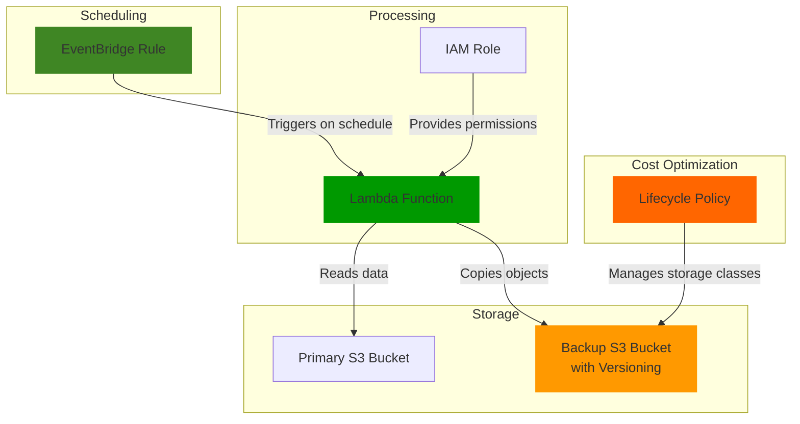

# Automating Backups with S3 Lifecycle Policies

## Problem

Organizations need reliable backup solutions to protect critical data from accidental deletion, corruption, or disaster scenarios. Manual backup processes are error-prone, often forgotten, and don't scale well as data volumes grow. IT administrators need an automated, scheduled backup system that requires minimal maintenance while ensuring data is consistently protected.

Small to medium-sized businesses particularly struggle with implementing reliable backup strategies that balance cost-effectiveness with robust protection. Without automated backups, these organizations risk data loss that could severely impact business continuity and customer trust.

## Solution

This recipe demonstrates how to implement automated, scheduled backups using Amazon S3, EventBridge, and Lambda. S3's durability, versioning capabilities, and lifecycle policies make it an ideal backup target. EventBridge provides precise scheduling control, while Lambda handles the automation logic.

The solution creates a primary S3 bucket for your working data and a separate backup bucket with versioning enabled. An EventBridge rule triggers a Lambda function on a customizable schedule, which then copies objects from the primary bucket to the backup bucket. Lifecycle policies automatically transition older backups to cost-effective storage classes and can eventually expire them based on your retention requirements.

## Architecture Diagram



## Prerequisites

1. AWS account with permissions to create S3 buckets, Lambda functions, EventBridge rules, and IAM roles
2. AWS CLI v2 installed and configured (or AWS CloudShell)
3. Basic knowledge of AWS services and command line operations
4. No existing resources required
5. Estimated cost: <$5/month for a small backup solution (varies based on data volume and storage class choices)

> **Note**: S3 charges are based on storage used, request pricing, and data transfer. This solution uses minimal compute resources, keeping costs low for small to medium datasets.

## Preparation

```bash
# Set environment variables
export AWS_REGION=$(aws configure get region)
export AWS_ACCOUNT_ID=$(aws sts get-caller-identity \
    --query Account --output text)

# Generate unique identifiers for resource names
export RANDOM_SUFFIX=$(aws secretsmanager get-random-password \
    --exclude-punctuation --exclude-uppercase \
    --password-length 6 --require-each-included-type \
    --output text --query RandomPassword)

# Set bucket names (must be globally unique)
export PRIMARY_BUCKET="primary-data-${RANDOM_SUFFIX}"
export BACKUP_BUCKET="backup-data-${RANDOM_SUFFIX}"

# Set Lambda function and role names
export LAMBDA_FUNCTION_NAME="s3-backup-function-${RANDOM_SUFFIX}"
export LAMBDA_ROLE_NAME="s3-backup-lambda-role-${RANDOM_SUFFIX}"

# Create a directory for our files
mkdir -p s3-backup-demo
cd s3-backup-demo

echo "✅ Environment configured for backup solution setup"
```

## Steps

1. **Create Primary and Backup S3 Buckets**:

   S3 buckets serve as the foundation of our backup solution, providing 99.999999999% (11 9's) durability. The primary bucket holds your working data, while the backup bucket stores copies for protection. We create them in the same region to minimize transfer costs and latency during backup operations.

   ```bash
   # Create the primary bucket (us-east-1 doesn't need LocationConstraint)
   if [ "$AWS_REGION" = "us-east-1" ]; then
       aws s3api create-bucket --bucket ${PRIMARY_BUCKET}
       aws s3api create-bucket --bucket ${BACKUP_BUCKET}
   else
       aws s3api create-bucket \
           --bucket ${PRIMARY_BUCKET} \
           --create-bucket-configuration LocationConstraint=${AWS_REGION}
       
       aws s3api create-bucket \
           --bucket ${BACKUP_BUCKET} \
           --create-bucket-configuration LocationConstraint=${AWS_REGION}
   fi
   
   echo "✅ Created primary bucket: ${PRIMARY_BUCKET}"
   echo "✅ Created backup bucket: ${BACKUP_BUCKET}"
   ```

2. **Enable Versioning and Configure Lifecycle Policy on Backup Bucket**:

   Versioning protects against accidental overwrites and provides point-in-time recovery capabilities. The lifecycle policy automatically manages storage costs by transitioning older backups to less expensive storage classes while eventually expiring very old backups to prevent unlimited storage growth.

   ```bash
   # Enable versioning on the backup bucket
   aws s3api put-bucket-versioning \
       --bucket ${BACKUP_BUCKET} \
       --versioning-configuration Status=Enabled
   
   # Create lifecycle policy JSON file
   cat > lifecycle-policy.json << EOF
   {
     "Rules": [
       {
         "ID": "BackupRetentionRule",
         "Status": "Enabled",
         "Filter": {
           "Prefix": ""
         },
         "Transitions": [
           {
             "Days": 30,
             "StorageClass": "STANDARD_IA"
           },
           {
             "Days": 90,
             "StorageClass": "GLACIER"
           },
           {
             "Days": 180,
             "StorageClass": "DEEP_ARCHIVE"
           }
         ],
         "Expiration": {
           "Days": 2555
         }
       }
     ]
   }
   EOF
   
   # Apply lifecycle policy to backup bucket
   aws s3api put-bucket-lifecycle-configuration \
       --bucket ${BACKUP_BUCKET} \
       --lifecycle-configuration file://lifecycle-policy.json
   
   echo "✅ Enabled versioning on backup bucket"
   echo "✅ Applied lifecycle policy to backup bucket"
   ```

   > **Note**: This lifecycle policy transitions backups to Standard-IA after 30 days (cheaper for infrequent access), then to Glacier after 90 days, Deep Archive after 180 days (lowest cost for archival), and deletes them after 7 years. Adjust these timeframes based on your retention requirements. Learn more about [S3 Storage Classes](https://docs.aws.amazon.com/AmazonS3/latest/userguide/storage-class-intro.html).

3. **Create IAM Role for Lambda**:

   The Lambda function needs specific permissions to read from the primary bucket, write to the backup bucket, and create CloudWatch logs for monitoring. Following the AWS Well-Architected principle of least privilege, we grant only the minimum permissions required for the backup operation.

   ```bash
   # Create trust policy document
   cat > trust-policy.json << EOF
   {
     "Version": "2012-10-17",
     "Statement": [
       {
         "Effect": "Allow",
         "Principal": {
           "Service": "lambda.amazonaws.com"
         },
         "Action": "sts:AssumeRole"
       }
     ]
   }
   EOF
   
   # Create the IAM role
   aws iam create-role \
       --role-name ${LAMBDA_ROLE_NAME} \
       --assume-role-policy-document file://trust-policy.json
   
   # Create policy document allowing S3 operations and logging
   cat > s3-permissions.json << EOF
   {
     "Version": "2012-10-17",
     "Statement": [
       {
         "Effect": "Allow",
         "Action": [
           "s3:GetObject",
           "s3:ListBucket"
         ],
         "Resource": [
           "arn:aws:s3:::${PRIMARY_BUCKET}",
           "arn:aws:s3:::${PRIMARY_BUCKET}/*"
         ]
       },
       {
         "Effect": "Allow",
         "Action": [
           "s3:PutObject",
           "s3:ListBucket"
         ],
         "Resource": [
           "arn:aws:s3:::${BACKUP_BUCKET}",
           "arn:aws:s3:::${BACKUP_BUCKET}/*"
         ]
       },
       {
         "Effect": "Allow",
         "Action": [
           "logs:CreateLogGroup",
           "logs:CreateLogStream",
           "logs:PutLogEvents"
         ],
         "Resource": "arn:aws:logs:${AWS_REGION}:${AWS_ACCOUNT_ID}:*"
       }
     ]
   }
   EOF
   
   # Attach policy to role
   aws iam put-role-policy \
       --role-name ${LAMBDA_ROLE_NAME} \
       --policy-name S3BackupPermissions \
       --policy-document file://s3-permissions.json
   
   # Wait for role to propagate
   sleep 10
   
   echo "✅ Created and configured IAM role for Lambda"
   ```

4. **Create Lambda Function**:

   The Lambda function implements the core backup logic, iterating through all objects in the primary bucket and copying them to the backup bucket. The function uses pagination to handle buckets with large numbers of objects and includes comprehensive logging for monitoring backup operations.

   ```bash
   # Create Lambda function code
   cat > lambda_function.py << EOF
   import boto3
   import os
   import time
   import json
   from botocore.exceptions import ClientError
   
   def lambda_handler(event, context):
       """
       AWS Lambda function to backup S3 objects from source to destination bucket
       """
       # Get bucket names from environment variables
       source_bucket = os.environ.get('SOURCE_BUCKET')
       destination_bucket = os.environ.get('DESTINATION_BUCKET')
       
       if not source_bucket or not destination_bucket:
           raise ValueError("SOURCE_BUCKET and DESTINATION_BUCKET environment variables must be set")
       
       # Initialize S3 client
       s3 = boto3.client('s3')
       
       # Get current timestamp for logging
       timestamp = time.strftime("%Y-%m-%d-%H-%M-%S")
       print(f"Starting backup process at {timestamp}")
       print(f"Source bucket: {source_bucket}")
       print(f"Destination bucket: {destination_bucket}")
       
       try:
           # List objects in source bucket with pagination
           objects = []
           paginator = s3.get_paginator('list_objects_v2')
           
           for page in paginator.paginate(Bucket=source_bucket):
               if 'Contents' in page:
                   objects.extend(page['Contents'])
           
           print(f"Found {len(objects)} objects to backup")
           
           # Copy each object to the destination bucket
           copied_count = 0
           errors = []
           
           for obj in objects:
               key = obj['Key']
               copy_source = {'Bucket': source_bucket, 'Key': key}
               
               try:
                   print(f"Copying {key} to backup bucket")
                   s3.copy_object(
                       CopySource=copy_source,
                       Bucket=destination_bucket,
                       Key=key,
                       MetadataDirective='COPY'
                   )
                   copied_count += 1
               except ClientError as e:
                   error_msg = f"Failed to copy {key}: {str(e)}"
                   print(error_msg)
                   errors.append(error_msg)
           
           # Log final results
           completion_time = time.strftime("%Y-%m-%d-%H-%M-%S")
           print(f"Backup completed at {completion_time}")
           print(f"Successfully copied {copied_count} out of {len(objects)} objects")
           
           if errors:
               print(f"Encountered {len(errors)} errors:")
               for error in errors:
                   print(f"  - {error}")
           
           return {
               'statusCode': 200,
               'body': json.dumps({
                   'message': f'Backup completed successfully',
                   'objects_found': len(objects),
                   'objects_copied': copied_count,
                   'errors': len(errors),
                   'timestamp': completion_time
               })
           }
           
       except Exception as e:
           error_msg = f"Backup process failed: {str(e)}"
           print(error_msg)
           return {
               'statusCode': 500,
               'body': json.dumps({
                   'message': 'Backup process failed',
                   'error': str(e),
                   'timestamp': time.strftime("%Y-%m-%d-%H-%M-%S")
               })
           }
   EOF
   
   # Zip the Lambda function code
   zip lambda_function.zip lambda_function.py
   
   # Create the Lambda function
   aws lambda create-function \
       --function-name ${LAMBDA_FUNCTION_NAME} \
       --runtime python3.12 \
       --handler lambda_function.lambda_handler \
       --role arn:aws:iam::${AWS_ACCOUNT_ID}:role/${LAMBDA_ROLE_NAME} \
       --zip-file fileb://lambda_function.zip \
       --environment "Variables={SOURCE_BUCKET=${PRIMARY_BUCKET},DESTINATION_BUCKET=${BACKUP_BUCKET}}" \
       --timeout 300 \
       --memory-size 256 \
       --description "Automated S3 backup function"
   
   echo "✅ Created Lambda function: ${LAMBDA_FUNCTION_NAME}"
   ```

5. **Set Up EventBridge Schedule Rule**:

   EventBridge provides reliable, cron-based scheduling that triggers our backup function at specified intervals. The daily 2:00 AM UTC schedule is ideal for most backup scenarios, running during low-usage hours to minimize impact on production workloads.

   ```bash
   # Create EventBridge rule to run daily at 2:00 AM UTC
   aws events put-rule \
       --name "DailyS3BackupRule-${RANDOM_SUFFIX}" \
       --schedule-expression "cron(0 2 * * ? *)" \
       --description "Trigger S3 backup function daily at 2:00 AM UTC" \
       --state ENABLED
   
   # Add permission for EventBridge to invoke Lambda function
   aws lambda add-permission \
       --function-name ${LAMBDA_FUNCTION_NAME} \
       --statement-id "EventBridgeInvoke-${RANDOM_SUFFIX}" \
       --action lambda:InvokeFunction \
       --principal events.amazonaws.com \
       --source-arn arn:aws:events:${AWS_REGION}:${AWS_ACCOUNT_ID}:rule/DailyS3BackupRule-${RANDOM_SUFFIX}
   
   # Create target for the rule
   aws events put-targets \
       --rule "DailyS3BackupRule-${RANDOM_SUFFIX}" \
       --targets "Id"="1","Arn"="arn:aws:lambda:${AWS_REGION}:${AWS_ACCOUNT_ID}:function:${LAMBDA_FUNCTION_NAME}"
   
   echo "✅ Created EventBridge schedule rule"
   ```

   > **Warning**: EventBridge cron expressions use UTC time. Remember to account for your local time zone when setting backup schedules. For example, if you want backups to run at 2:00 AM EST, set the cron expression to run at 7:00 AM UTC.

6. **Upload Sample Data to Primary Bucket**:

   Creating sample data allows us to test the backup functionality and verify that our automated system works correctly. This step simulates real-world data that would typically exist in your primary bucket.

   ```bash
   # Create sample files with different content
   echo "This is sample file 1 - $(date)" > sample-file-1.txt
   echo "This is sample file 2 - $(date)" > sample-file-2.txt
   echo "This is sample file 3 - $(date)" > sample-file-3.txt
   
   # Create a subdirectory structure
   mkdir -p data/logs
   echo "Application log entry - $(date)" > data/logs/app.log
   echo "System configuration data" > data/config.json
   
   # Upload files to primary bucket
   aws s3 cp sample-file-1.txt s3://${PRIMARY_BUCKET}/
   aws s3 cp sample-file-2.txt s3://${PRIMARY_BUCKET}/
   aws s3 cp sample-file-3.txt s3://${PRIMARY_BUCKET}/
   aws s3 cp data/logs/app.log s3://${PRIMARY_BUCKET}/data/logs/
   aws s3 cp data/config.json s3://${PRIMARY_BUCKET}/data/
   
   echo "✅ Uploaded sample files to primary bucket"
   ```

7. **Test the Backup Function**:

   Manual testing validates that our backup function works correctly before relying on the automated schedule. This step helps identify any configuration issues early and provides confidence in the backup system's reliability.

   ```bash
   # Invoke Lambda function manually to test
   aws lambda invoke \
       --function-name ${LAMBDA_FUNCTION_NAME} \
       --payload '{}' \
       --log-type Tail \
       response.json
   
   # Check if the function executed successfully
   echo "Lambda response:"
   cat response.json | jq '.'
   
   # Check CloudWatch logs for detailed execution information
   echo ""
   echo "Recent log events:"
   aws logs describe-log-groups \
       --log-group-name-prefix "/aws/lambda/${LAMBDA_FUNCTION_NAME}" \
       --query "logGroups[0].logGroupName" \
       --output text | xargs -I {} \
       aws logs describe-log-streams \
       --log-group-name {} \
       --order-by LastEventTime \
       --descending \
       --max-items 1 \
       --query "logStreams[0].logStreamName" \
       --output text | xargs -I {} \
       aws logs get-log-events \
       --log-group-name "/aws/lambda/${LAMBDA_FUNCTION_NAME}" \
       --log-stream-name {} \
       --limit 10
   
   echo "✅ Tested Lambda backup function"
   ```

## Validation & Testing

1. **Verify files were copied to the backup bucket**:

   ```bash
   # List objects in both buckets
   echo "Primary bucket contents:"
   aws s3 ls s3://${PRIMARY_BUCKET}/ --recursive
   
   echo ""
   echo "Backup bucket contents:"
   aws s3 ls s3://${BACKUP_BUCKET}/ --recursive
   ```

   Expected output: Both buckets should show the same files with similar timestamps

2. **Verify backup process by modifying a file and running the backup again**:

   ```bash
   # Update a file in the primary bucket
   echo "This is an updated version of file 1 - $(date)" > updated-file-1.txt
   aws s3 cp updated-file-1.txt s3://${PRIMARY_BUCKET}/sample-file-1.txt
   
   # Run backup function again
   aws lambda invoke \
       --function-name ${LAMBDA_FUNCTION_NAME} \
       --payload '{}' \
       response2.json
   
   # Check backup bucket for updated file
   aws s3api get-object \
       --bucket ${BACKUP_BUCKET} \
       --key sample-file-1.txt \
       backup-file-1.txt
   
   # View the contents of the retrieved file
   echo "Contents of backed up file:"
   cat backup-file-1.txt
   ```

   Expected output: The contents of backup-file-1.txt should show the updated content with timestamp

3. **Verify versioning is working in the backup bucket**:

   ```bash
   # List versions of a file in the backup bucket
   aws s3api list-object-versions \
       --bucket ${BACKUP_BUCKET} \
       --prefix sample-file-1.txt
   ```

   Expected output: There should be at least two versions of sample-file-1.txt showing the version history

4. **Test lifecycle policy configuration**:

   ```bash
   # Verify lifecycle policy is applied
   aws s3api get-bucket-lifecycle-configuration \
       --bucket ${BACKUP_BUCKET}
   ```

   Expected output: JSON configuration showing the lifecycle rules we created

## Cleanup

1. **Delete files from both S3 buckets**:

   ```bash
   # Delete files from primary bucket
   aws s3 rm s3://${PRIMARY_BUCKET} --recursive
   
   # Delete all versions and delete markers from backup bucket
   aws s3api list-object-versions \
       --bucket ${BACKUP_BUCKET} \
       --output json \
       --query '{Objects: Versions[?Key != null].{Key:Key,VersionId:VersionId}}' > versions.json
   
   aws s3api list-object-versions \
       --bucket ${BACKUP_BUCKET} \
       --output json \
       --query '{Objects: DeleteMarkers[?Key != null].{Key:Key,VersionId:VersionId}}' > delete-markers.json
   
   # Delete all versions if they exist
   if [ -s versions.json ] && [ "$(cat versions.json | jq '.Objects | length')" -gt 0 ]; then
       aws s3api delete-objects \
           --bucket ${BACKUP_BUCKET} \
           --delete file://versions.json
   fi
   
   # Delete all delete markers if they exist
   if [ -s delete-markers.json ] && [ "$(cat delete-markers.json | jq '.Objects | length')" -gt 0 ]; then
       aws s3api delete-objects \
           --bucket ${BACKUP_BUCKET} \
           --delete file://delete-markers.json
   fi
   
   echo "✅ Deleted all files and versions from both buckets"
   ```

2. **Delete EventBridge rule and Lambda target**:

   ```bash
   # Remove target from rule
   aws events remove-targets \
       --rule "DailyS3BackupRule-${RANDOM_SUFFIX}" \
       --ids "1"
   
   # Delete the rule
   aws events delete-rule \
       --name "DailyS3BackupRule-${RANDOM_SUFFIX}"
   
   echo "✅ Deleted EventBridge rule"
   ```

3. **Delete Lambda function**:

   ```bash
   # Delete Lambda function
   aws lambda delete-function \
       --function-name ${LAMBDA_FUNCTION_NAME}
   
   echo "✅ Deleted Lambda function"
   ```

4. **Delete IAM role and policy**:

   ```bash
   # Delete role policy
   aws iam delete-role-policy \
       --role-name ${LAMBDA_ROLE_NAME} \
       --policy-name S3BackupPermissions
   
   # Delete role
   aws iam delete-role \
       --role-name ${LAMBDA_ROLE_NAME}
   
   echo "✅ Deleted IAM role and policy"
   ```

5. **Delete S3 buckets**:

   ```bash
   # Delete both buckets
   aws s3api delete-bucket \
       --bucket ${PRIMARY_BUCKET}
   
   aws s3api delete-bucket \
       --bucket ${BACKUP_BUCKET}
   
   echo "✅ Deleted S3 buckets"
   ```

6. **Clean up local files**:

   ```bash
   # Remove all local files created
   cd ..
   rm -rf s3-backup-demo
   
   echo "✅ Removed local files and directories"
   ```

## Discussion

This recipe implements a robust automated backup solution leveraging AWS's managed services for reliability and cost optimization. The architecture follows AWS Well-Architected Framework principles, particularly focusing on reliability, cost optimization, and security pillars.

Amazon S3's industry-leading durability (99.999999999% or "11 nines") ensures your backups are preserved even if multiple AWS facilities experience issues simultaneously. The backup bucket's versioning feature provides an additional layer of protection by maintaining multiple versions of each file, enabling point-in-time recovery from accidental deletions or unwanted changes. This versioning capability is crucial for compliance requirements and operational recovery scenarios.

The lifecycle policy demonstrates S3's intelligent storage class transitions, automatically optimizing costs while maintaining data accessibility. Objects transition from Standard storage to Standard-IA after 30 days (40% cost reduction), then to Glacier after 90 days (68% cost reduction), and finally to Deep Archive after 180 days (77% cost reduction). This automated tiering significantly reduces long-term storage costs without manual intervention. Learn more about storage classes at [S3 Storage Classes documentation](https://docs.aws.amazon.com/AmazonS3/latest/userguide/storage-class-intro.html).

EventBridge's serverless scheduling eliminates the need for dedicated servers to run backup jobs, while providing enterprise-grade reliability and monitoring capabilities. The cron-based scheduling offers flexibility - you can easily modify schedules for different backup frequencies such as `cron(0 */6 * * ? *)` for every 6 hours or `cron(0 2 ? * MON-FRI *)` for weekdays only. For more scheduling patterns, refer to the [EventBridge schedule expressions documentation](https://docs.aws.amazon.com/eventbridge/latest/userguide/eb-create-rule-schedule.html).

> **Tip**: Monitor your backup jobs using CloudWatch Logs and set up CloudWatch Alarms to notify you of backup failures. This proactive monitoring approach aligns with AWS operational excellence best practices.

## Challenge

Extend this solution by implementing these enhancements:

1. **Add SNS notifications** that send detailed emails when backups complete, including success/failure status, number of files processed, and any errors encountered using Amazon SNS.

2. **Implement cross-region backup strategy** by creating a second backup bucket in a different AWS region and updating the Lambda function to replicate to both locations for disaster recovery and geographic redundancy.

3. **Create selective backup filtering** by implementing object tagging or prefix-based rules that only backup specific file types or directories, reducing storage costs and backup time for large datasets.

4. **Build a restore function** that can recover specific files or entire directory structures from the backup bucket to the primary bucket based on timestamps or version IDs, including a web interface for non-technical users.

5. **Add backup encryption** using AWS KMS customer-managed keys for both in-transit and at-rest encryption, meeting enterprise security and compliance requirements.

## Infrastructure Code

### Available Infrastructure as Code:

- [Infrastructure Code Overview](code/README.md) - Detailed description of all infrastructure components
- [AWS CDK (Python)](code/cdk-python/) - AWS CDK Python implementation
- [AWS CDK (TypeScript)](code/cdk-typescript/) - AWS CDK TypeScript implementation
- [CloudFormation](code/cloudformation.yaml) - AWS CloudFormation template
- [Bash CLI Scripts](code/scripts/) - Example bash scripts using AWS CLI commands to deploy infrastructure
- [Terraform](code/terraform/) - Terraform configuration files