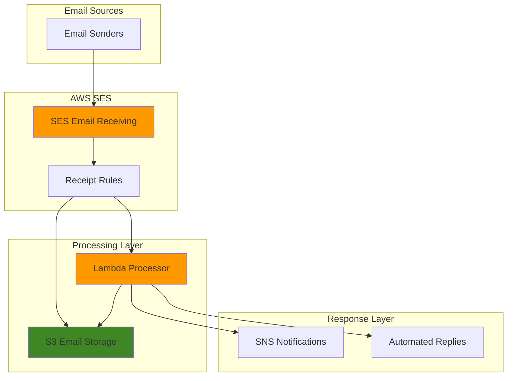

# Automating Email Processing with SES and Lambda

## Problem

Modern businesses receive hundreds of emails daily containing support requests, invoices, and documents that require immediate processing and routing. Manual email processing creates bottlenecks, delays response times, and increases operational costs. Organizations need automated systems to parse email content, extract attachments, categorize messages, and trigger appropriate business workflows without human intervention.

## Solution

Build a serverless email processing system using AWS SES for receiving emails and Lambda functions for automated processing. This solution automatically handles incoming emails, extracts content and attachments, processes them based on predefined rules, and sends automated responses or forwards messages to appropriate teams, significantly reducing manual workload and improving response times.

## Architecture Diagram



## Prerequisites

1. AWS account with SES, Lambda, S3, and SNS permissions
2. AWS CLI v2 installed and configured (or AWS CloudShell)
3. A verified domain in Amazon SES (email receiving is domain-based)
4. Basic understanding of email processing and MIME formats
5. Estimated cost: $2-5 per month for moderate email volume (1,000 emails)

> **Note**: SES email receiving is only available in specific AWS regions (US East 1, US West 2, and Europe West 1). Check the [AWS SES documentation](https://docs.aws.amazon.com/ses/latest/dg/regions.html) for current region availability.

## Preparation

```bash
# Set environment variables
export AWS_REGION=$(aws configure get region)
export AWS_ACCOUNT_ID=$(aws sts get-caller-identity \
    --query Account --output text)

# Generate unique identifiers for resources
RANDOM_SUFFIX=$(aws secretsmanager get-random-password \
    --exclude-punctuation --exclude-uppercase \
    --password-length 6 --require-each-included-type \
    --output text --query RandomPassword)

export DOMAIN_NAME="example.com"  # Replace with your verified domain
export BUCKET_NAME="email-processing-${RANDOM_SUFFIX}"
export FUNCTION_NAME="email-processor-${RANDOM_SUFFIX}"
export SNS_TOPIC_NAME="email-notifications-${RANDOM_SUFFIX}"

# Create S3 bucket for email storage with encryption
aws s3 mb s3://${BUCKET_NAME} --region ${AWS_REGION}

aws s3api put-bucket-encryption \
    --bucket ${BUCKET_NAME} \
    --server-side-encryption-configuration \
    'Rules=[{ApplyServerSideEncryptionByDefault:{SSEAlgorithm:AES256}}]'

# Create SNS topic for notifications
SNS_TOPIC_ARN=$(aws sns create-topic \
    --name ${SNS_TOPIC_NAME} \
    --query TopicArn --output text)

echo "SNS Topic ARN: ${SNS_TOPIC_ARN}"
echo "✅ Foundation resources created"
```

## Steps

1. **Create IAM Role for Lambda Function**:

   IAM roles provide secure, temporary credential delegation that follows the principle of least privilege. For our email processing system, the Lambda function needs specific permissions to interact with S3 for email storage, SES for sending replies, and SNS for notifications. This security foundation ensures our serverless function can perform its duties without exposing long-term credentials, following AWS security best practices.

   ```bash
   # Create trust policy for Lambda
   cat > lambda-trust-policy.json << 'EOF'
   {
     "Version": "2012-10-17",
     "Statement": [
       {
         "Effect": "Allow",
         "Principal": {
           "Service": "lambda.amazonaws.com"
         },
         "Action": "sts:AssumeRole"
       }
     ]
   }
   EOF
   
   # Create the IAM role
   aws iam create-role \
       --role-name EmailProcessorRole-${RANDOM_SUFFIX} \
       --assume-role-policy-document file://lambda-trust-policy.json
   
   export LAMBDA_ROLE_ARN="arn:aws:iam::${AWS_ACCOUNT_ID}:role/EmailProcessorRole-${RANDOM_SUFFIX}"
   
   echo "✅ Created IAM role: ${LAMBDA_ROLE_ARN}"
   ```

   The IAM role is now established with the proper trust relationship, enabling AWS Lambda to assume this role when executing our email processing function. This role will serve as the security boundary for all AWS service interactions, ensuring compliance with the AWS Well-Architected Framework's security pillar.

2. **Attach Necessary Policies to Lambda Role**:

   AWS Lambda requires specific permissions to access S3 buckets for email storage, SES for sending automated replies, and SNS for team notifications. We'll attach both AWS managed policies for basic Lambda functionality and a custom policy that grants precise permissions for our email processing workflow, ensuring security while enabling full functionality according to the principle of least privilege.

   ```bash
   # Attach basic Lambda execution policy
   aws iam attach-role-policy \
       --role-name EmailProcessorRole-${RANDOM_SUFFIX} \
       --policy-arn arn:aws:iam::aws:policy/service-role/AWSLambdaBasicExecutionRole
   
   # Create custom policy for S3, SES, and SNS access
   cat > email-processor-policy.json << EOF
   {
     "Version": "2012-10-17",
     "Statement": [
       {
         "Effect": "Allow",
         "Action": [
           "s3:GetObject",
           "s3:PutObject",
           "s3:DeleteObject"
         ],
         "Resource": "arn:aws:s3:::${BUCKET_NAME}/*"
       },
       {
         "Effect": "Allow",
         "Action": [
           "ses:SendEmail",
           "ses:SendRawEmail"
         ],
         "Resource": "arn:aws:ses:${AWS_REGION}:${AWS_ACCOUNT_ID}:identity/*"
       },
       {
         "Effect": "Allow",
         "Action": [
           "sns:Publish"
         ],
         "Resource": "${SNS_TOPIC_ARN}"
       }
     ]
   }
   EOF
   
   # Create and attach the custom policy
   aws iam create-policy \
       --policy-name EmailProcessorPolicy-${RANDOM_SUFFIX} \
       --policy-document file://email-processor-policy.json
   
   aws iam attach-role-policy \
       --role-name EmailProcessorRole-${RANDOM_SUFFIX} \
       --policy-arn arn:aws:iam::${AWS_ACCOUNT_ID}:policy/EmailProcessorPolicy-${RANDOM_SUFFIX}
   
   echo "✅ Attached policies to Lambda role"
   ```

   The Lambda function now has the minimum required permissions to operate effectively. This security configuration enables email processing, storage operations, and notification delivery while maintaining the principle of least privilege and following AWS IAM best practices for secure cross-service communication.

3. **Create Lambda Function for Email Processing**:

   AWS Lambda provides serverless compute that automatically scales to handle email volume without managing infrastructure. Our function will parse incoming emails, analyze content for intelligent routing, and trigger appropriate business workflows. The code implements sophisticated email processing logic including support ticket creation, invoice handling, and automated response generation using Python's built-in email parsing capabilities.

   ```bash
   # Create Lambda function code
   cat > email-processor.py << 'EOF'
   import json
   import boto3
   import email
   import os
   import logging
   from email.mime.text import MIMEText
   from email.mime.multipart import MIMEMultipart
   from botocore.exceptions import ClientError
   
   # Configure logging
   logger = logging.getLogger()
   logger.setLevel(logging.INFO)
   
   s3 = boto3.client('s3')
   ses = boto3.client('ses')
   sns = boto3.client('sns')
   
   def lambda_handler(event, context):
       """Main Lambda handler for processing SES email events"""
       try:
           # Parse SES event
           ses_event = event['Records'][0]['ses']
           message_id = ses_event['mail']['messageId']
           receipt = ses_event['receipt']
           
           logger.info(f"Processing email with message ID: {message_id}")
           
           # Get email from S3 if stored there
           bucket_name = os.environ.get('BUCKET_NAME')
           
           # Get email object from S3
           s3_key = f"emails/{message_id}"
           response = s3.get_object(Bucket=bucket_name, Key=s3_key)
           raw_email = response['Body'].read()
           
           # Parse email
           email_message = email.message_from_bytes(raw_email)
           
           # Extract email details
           sender = email_message.get('From', 'Unknown')
           subject = email_message.get('Subject', 'No Subject')
           recipient = receipt['recipients'][0] if receipt['recipients'] else 'Unknown'
           
           logger.info(f"Email from: {sender}, Subject: {subject}")
           
           # Process email based on subject or content
           if 'support' in subject.lower():
               process_support_email(sender, subject, email_message)
           elif 'invoice' in subject.lower():
               process_invoice_email(sender, subject, email_message)
           else:
               process_general_email(sender, subject, email_message)
           
           # Send notification
           notify_processing_complete(message_id, sender, subject)
           
           return {'statusCode': 200, 'body': 'Email processed successfully'}
           
       except ClientError as e:
           logger.error(f"AWS service error processing email: {str(e)}")
           return {'statusCode': 500, 'body': f'AWS Error: {str(e)}'}
       except Exception as e:
           logger.error(f"Error processing email: {str(e)}")
           return {'statusCode': 500, 'body': f'Error: {str(e)}'}
   
   def process_support_email(sender, subject, email_message):
       """Process support-related emails with ticket creation"""
       logger.info(f"Processing support email from: {sender}")
       
       # Generate ticket ID
       ticket_id = f"TICKET-{hash(sender) % 10000:04d}"
       
       # Send auto-reply
       reply_subject = f"Re: {subject} - Ticket Created [{ticket_id}]"
       reply_body = f"""Thank you for contacting our support team.

Your support ticket has been created and assigned ID: {ticket_id}

We will respond within 24 hours during business hours.

Best regards,
Support Team

---
This is an automated response. Please do not reply to this email.
       """
       
       send_reply(sender, reply_subject, reply_body)
       
       # Notify support team via SNS
       sns.publish(
           TopicArn=os.environ.get('SNS_TOPIC_ARN'),
           Subject=f"New Support Ticket: {ticket_id}",
           Message=f"Ticket ID: {ticket_id}\nFrom: {sender}\nSubject: {subject}\n\nPlease check the email processing system for details."
       )
       
       logger.info(f"Support ticket {ticket_id} created and notifications sent")
   
   def process_invoice_email(sender, subject, email_message):
       """Process invoice-related emails with confirmation"""
       logger.info(f"Processing invoice email from: {sender}")
       
       # Generate invoice reference
       invoice_ref = f"INV-{hash(sender) % 10000:04d}"
       
       # Send confirmation
       reply_subject = f"Invoice Received: {subject} [Ref: {invoice_ref}]"
       reply_body = f"""We have received your invoice.

Reference Number: {invoice_ref}
Invoice will be processed within 5 business days.

If you have any questions, please contact our accounts payable team.

Accounts Payable Team

---
This is an automated response. Please do not reply to this email.
       """
       
       send_reply(sender, reply_subject, reply_body)
       logger.info(f"Invoice {invoice_ref} processed and confirmation sent")
   
   def process_general_email(sender, subject, email_message):
       """Process general emails with acknowledgment"""
       logger.info(f"Processing general email from: {sender}")
       
       # Send general acknowledgment
       reply_subject = f"Re: {subject} - Message Received"
       reply_body = f"""Thank you for your email.

We have received your message and will respond appropriately within 2 business days.

If this is an urgent matter, please contact us directly at our support number.

Best regards,
Customer Service Team

---
This is an automated response. Please do not reply to this email.
       """
       
       send_reply(sender, reply_subject, reply_body)
       logger.info(f"General email acknowledgment sent to: {sender}")
   
   def send_reply(to_email, subject, body):
       """Send automated reply via SES with error handling"""
       try:
           from_email = os.environ.get('FROM_EMAIL', 'noreply@example.com')
           
           ses.send_email(
               Source=from_email,
               Destination={'ToAddresses': [to_email]},
               Message={
                   'Subject': {'Data': subject},
                   'Body': {'Text': {'Data': body}}
               }
           )
           logger.info(f"Reply sent successfully to: {to_email}")
       except ClientError as e:
           logger.error(f"Failed to send reply to {to_email}: {str(e)}")
       except Exception as e:
           logger.error(f"Error sending reply: {str(e)}")
   
   def notify_processing_complete(message_id, sender, subject):
       """Send processing notification via SNS"""
       try:
           sns.publish(
               TopicArn=os.environ.get('SNS_TOPIC_ARN'),
               Subject="Email Processed Successfully",
               Message=f"Message ID: {message_id}\nFrom: {sender}\nSubject: {subject}\nProcessed at: {context.aws_request_id if 'context' in globals() else 'Unknown'}"
           )
           logger.info(f"Processing notification sent for message: {message_id}")
       except Exception as e:
           logger.error(f"Failed to send processing notification: {str(e)}")
   EOF
   
   # Package the function
   zip email-processor.zip email-processor.py
   
   echo "✅ Created Lambda function code with improved error handling"
   ```

   The Lambda function code is now packaged and ready for deployment. This intelligent email processor includes comprehensive error handling, structured logging, and can handle multiple email types with proper ticket generation and reference numbers, providing the automation core for our serverless email system.

4. **Deploy Lambda Function**:

   Deploying the Lambda function creates a serverless compute resource that AWS manages entirely, providing automatic scaling, fault tolerance, and cost optimization. The function configuration includes environment variables for seamless integration with other AWS services and appropriate timeout and memory settings for email processing workloads. We're using Python 3.12 for the latest features and security updates.

   ```bash
   # Wait for IAM role propagation
   sleep 10
   
   # Create Lambda function with updated runtime
   aws lambda create-function \
       --function-name ${FUNCTION_NAME} \
       --runtime python3.12 \
       --role ${LAMBDA_ROLE_ARN} \
       --handler email-processor.lambda_handler \
       --zip-file fileb://email-processor.zip \
       --timeout 60 \
       --memory-size 256 \
       --environment Variables="{
           BUCKET_NAME=${BUCKET_NAME},
           SNS_TOPIC_ARN=${SNS_TOPIC_ARN},
           FROM_EMAIL=noreply@${DOMAIN_NAME}
       }" \
       --description "Automated email processing for SES incoming emails"
   
   # Get function ARN
   LAMBDA_ARN=$(aws lambda get-function \
       --function-name ${FUNCTION_NAME} \
       --query Configuration.FunctionArn --output text)
   
   echo "✅ Deployed Lambda function: ${LAMBDA_ARN}"
   ```

   The Lambda function is now live and ready to process emails. AWS will automatically manage scaling, availability, and execution environment, ensuring reliable email processing regardless of volume fluctuations. The function uses the latest Python runtime for enhanced security and performance.

5. **Grant SES Permission to Invoke Lambda**:

   AWS SES needs explicit permission to invoke our Lambda function when emails arrive. This cross-service permission enables the event-driven architecture where email receipt automatically triggers processing logic, creating a seamless automated workflow without manual intervention. We specify the source account for additional security.

   ```bash
   # Add permission for SES to invoke Lambda
   aws lambda add-permission \
       --function-name ${FUNCTION_NAME} \
       --statement-id ses-invoke-${RANDOM_SUFFIX} \
       --action lambda:InvokeFunction \
       --principal ses.amazonaws.com \
       --source-account ${AWS_ACCOUNT_ID}
   
   echo "✅ Granted SES permission to invoke Lambda function"
   ```

   SES can now automatically invoke our Lambda function upon email receipt, establishing the critical event-driven connection that enables real-time email processing and immediate business workflow activation with proper security controls in place.

6. **Configure SES Domain for Email Receiving**:

   Amazon SES email receiving requires domain verification and proper DNS configuration to ensure email security and delivery reliability. The MX record configuration directs incoming emails to AWS infrastructure, while domain verification proves ownership and enables legitimate email processing. This step is essential for establishing trust and preventing email spoofing.

   ```bash
   # Verify domain for receiving (if not already done)
   aws ses verify-domain-identity --domain ${DOMAIN_NAME}
   
   # Get verification status
   aws ses get-identity-verification-attributes \
       --identities ${DOMAIN_NAME}
   
   # Display MX record information
   echo ""
   echo "IMPORTANT: Add this MX record to your domain's DNS configuration:"
   echo "=========================================================="
   echo "Record Type: MX"
   echo "Priority: 10"
   echo "Value: inbound-smtp.${AWS_REGION}.amazonaws.com"
   echo "TTL: 300 (or your domain's default)"
   echo ""
   echo "For domain: ${DOMAIN_NAME}"
   echo "=========================================================="
   echo ""
   
   # Wait for user confirmation
   read -p "Press Enter after adding the MX record and waiting for DNS propagation (5-10 minutes)..."
   
   echo "✅ Domain verification initiated"
   ```

   Domain verification is now in progress, establishing the foundation for secure email receiving. Once DNS propagation completes, your domain will be ready to receive and process emails through the AWS SES infrastructure with proper authentication and security measures in place.

7. **Create SES Receipt Rule Set and Rules**:

   SES receipt rules define how incoming emails are processed, enabling sophisticated routing and action triggers. Our rule set will simultaneously store emails in S3 for persistence and invoke Lambda for real-time processing, creating a robust email handling system that ensures no messages are lost while enabling immediate automated responses and compliance with data retention requirements.

   ```bash
   # Create rule set
   aws ses create-receipt-rule-set \
       --rule-set-name EmailProcessingRuleSet-${RANDOM_SUFFIX}
   
   # Set as active rule set
   aws ses set-active-receipt-rule-set \
       --rule-set-name EmailProcessingRuleSet-${RANDOM_SUFFIX}
   
   # Create receipt rule for email processing
   cat > receipt-rule.json << EOF
   {
     "Name": "EmailProcessingRule-${RANDOM_SUFFIX}",
     "Enabled": true,
     "TlsPolicy": "Require",
     "Recipients": [
       "support@${DOMAIN_NAME}", 
       "invoices@${DOMAIN_NAME}",
       "info@${DOMAIN_NAME}"
     ],
     "Actions": [
       {
         "S3Action": {
           "BucketName": "${BUCKET_NAME}",
           "ObjectKeyPrefix": "emails/"
         }
       },
       {
         "LambdaAction": {
           "FunctionArn": "${LAMBDA_ARN}",
           "InvocationType": "Event"
         }
       }
     ]
   }
   EOF
   
   # Create the receipt rule
   aws ses create-receipt-rule \
       --rule-set-name EmailProcessingRuleSet-${RANDOM_SUFFIX} \
       --rule file://receipt-rule.json
   
   echo "✅ Created SES receipt rules for email processing"
   ```

   The SES receipt rules are now active and will automatically process incoming emails according to our defined logic. This configuration requires TLS encryption for enhanced security, ensures reliable email capture, storage, and processing trigger activation for all supported email addresses.

8. **Subscribe to SNS Topic for Notifications**:

   Amazon SNS enables real-time notifications to keep teams informed about email processing activities and system events. By subscribing to the topic, relevant stakeholders receive immediate alerts about support tickets, invoice processing, and system status, ensuring rapid response to business-critical communications and maintaining operational visibility.

   ```bash
   # Subscribe email for notifications (replace with your email)
   EMAIL_FOR_NOTIFICATIONS="your-email@example.com"  # Replace this
   
   aws sns subscribe \
       --topic-arn ${SNS_TOPIC_ARN} \
       --protocol email \
       --notification-endpoint ${EMAIL_FOR_NOTIFICATIONS}
   
   echo "Check your email and confirm the SNS subscription"
   echo "✅ SNS notification subscription created"
   ```

   The notification system is now fully configured, providing real-time visibility into email processing activities. Team members will receive immediate alerts about important emails, enabling rapid response to customer inquiries and business requests while maintaining full audit trails.

## Validation & Testing

1. **Test Email Processing System**:

   ```bash
   # Send a test support email (from external email client)
   echo "Send an email to support@${DOMAIN_NAME} with subject containing 'Support'"
   echo "Expected: Automated reply with ticket number and SNS notification"
   
   # Check S3 for stored emails
   aws s3 ls s3://${BUCKET_NAME}/emails/ --recursive
   ```

   Expected output: List of email files stored in S3 with message IDs

2. **Verify Lambda Function Execution**:

   ```bash
   # Check Lambda function logs
   aws logs describe-log-groups \
       --log-group-name-prefix "/aws/lambda/${FUNCTION_NAME}"
   
   # Get recent log events (last hour)
   aws logs filter-log-events \
       --log-group-name "/aws/lambda/${FUNCTION_NAME}" \
       --start-time $(date -d '1 hour ago' +%s)000 \
       --filter-pattern "ERROR"
   ```

3. **Test Different Email Types**:

   ```bash
   echo "Test different email scenarios:"
   echo "1. Send email to support@${DOMAIN_NAME} with 'Support Request' in subject"
   echo "2. Send email to invoices@${DOMAIN_NAME} with 'Invoice' in subject"  
   echo "3. Send general email to info@${DOMAIN_NAME}"
   echo "4. Verify automated replies and processing logic for each type"
   ```

4. **Monitor Processing Metrics**:

   ```bash
   # Check Lambda invocation metrics
   aws cloudwatch get-metric-statistics \
       --namespace AWS/Lambda \
       --metric-name Invocations \
       --dimensions Name=FunctionName,Value=${FUNCTION_NAME} \
       --start-time $(date -u -d '1 hour ago' +%Y-%m-%dT%H:%M:%S) \
       --end-time $(date -u +%Y-%m-%dT%H:%M:%S) \
       --period 300 \
       --statistics Sum
   ```

## Cleanup

1. **Remove SES Configuration**:

   ```bash
   # Delete receipt rule
   aws ses delete-receipt-rule \
       --rule-set-name EmailProcessingRuleSet-${RANDOM_SUFFIX} \
       --rule-name EmailProcessingRule-${RANDOM_SUFFIX}
   
   # Delete rule set
   aws ses delete-receipt-rule-set \
       --rule-set-name EmailProcessingRuleSet-${RANDOM_SUFFIX}
   
   echo "✅ Deleted SES receipt rules"
   ```

2. **Delete Lambda Function and Permissions**:

   ```bash
   # Delete Lambda function
   aws lambda delete-function --function-name ${FUNCTION_NAME}
   
   echo "✅ Deleted Lambda function"
   ```

3. **Remove IAM Role and Policies**:

   ```bash
   # Detach policies
   aws iam detach-role-policy \
       --role-name EmailProcessorRole-${RANDOM_SUFFIX} \
       --policy-arn arn:aws:iam::aws:policy/service-role/AWSLambdaBasicExecutionRole
   
   aws iam detach-role-policy \
       --role-name EmailProcessorRole-${RANDOM_SUFFIX} \
       --policy-arn arn:aws:iam::${AWS_ACCOUNT_ID}:policy/EmailProcessorPolicy-${RANDOM_SUFFIX}
   
   # Delete custom policy
   aws iam delete-policy \
       --policy-arn arn:aws:iam::${AWS_ACCOUNT_ID}:policy/EmailProcessorPolicy-${RANDOM_SUFFIX}
   
   # Delete role
   aws iam delete-role --role-name EmailProcessorRole-${RANDOM_SUFFIX}
   
   echo "✅ Deleted IAM role and policies"
   ```

4. **Clean Up S3 and SNS Resources**:

   ```bash
   # Empty and delete S3 bucket
   aws s3 rm s3://${BUCKET_NAME} --recursive
   aws s3 rb s3://${BUCKET_NAME}
   
   # Delete SNS topic
   aws sns delete-topic --topic-arn ${SNS_TOPIC_ARN}
   
   # Clean up local files
   rm -f lambda-trust-policy.json email-processor-policy.json \
         receipt-rule.json email-processor.py email-processor.zip
   
   echo "✅ Cleaned up all resources"
   ```

## Discussion

This serverless email processing system demonstrates how AWS SES and Lambda can work together to create a fully automated email handling solution that follows AWS Well-Architected Framework principles. The architecture leverages SES receipt rules to trigger multiple actions simultaneously: storing emails in S3 for persistence and invoking Lambda functions for real-time processing, ensuring both immediate response and data durability.

The Lambda function showcases intelligent email routing based on content analysis, automatically categorizing emails by subject line and applying different processing logic. Support emails trigger ticket creation with unique identifiers and team notifications, while invoice emails initiate accounts payable workflows with reference tracking. This pattern can be extended to handle complex business rules, integrate with CRM systems, or trigger multi-step approval processes using AWS Step Functions.

The solution's serverless nature ensures cost efficiency and automatic scaling according to AWS's operational excellence pillar. You only pay for emails processed and Lambda execution time, making it ideal for businesses with variable email volumes. The modular design allows easy extension - additional Lambda functions can be added for specialized processing, and external integrations can be built using the stored email data in S3. Security is enhanced through IAM role-based access, encrypted S3 storage, and TLS-required email reception.

> **Warning**: Ensure your domain's MX record points to the correct AWS SES endpoint for your region to avoid email delivery failures. See the [AWS SES receiving email documentation](https://docs.aws.amazon.com/ses/latest/dg/receiving-email-mx-record.html) for region-specific endpoints.

> **Tip**: Use SES configuration sets to track email delivery metrics and bounce rates for your automated replies. Monitor Lambda function performance using CloudWatch metrics and consider implementing dead letter queues for failed processing attempts. See [AWS SES Configuration Sets](https://docs.aws.amazon.com/ses/latest/DeveloperGuide/using-configuration-sets.html) for detailed guidance.

## Challenge

Extend this solution by implementing these enhancements:

1. **Advanced Content Processing**: Integrate Amazon Textract to extract text from PDF attachments and Amazon Comprehend for sentiment analysis of email content, enabling more sophisticated routing decisions
2. **Intelligent Routing**: Use Amazon SageMaker to train machine learning models that classify emails more accurately and route them to appropriate teams based on content analysis rather than just subject line keywords  
3. **Workflow Integration**: Connect with AWS Step Functions to orchestrate complex multi-step business processes triggered by specific email types, including approval workflows and escalation procedures
4. **Security Enhancement**: Implement email encryption/decryption using AWS KMS for sensitive content and add virus scanning capabilities using Amazon Macie for data loss prevention
5. **Dashboard and Analytics**: Build a real-time dashboard using Amazon QuickSight to visualize email processing metrics, response times, volume trends, and customer satisfaction scores

## Infrastructure Code

### Available Infrastructure as Code:

- [Infrastructure Code Overview](code/README.md) - Detailed description of all infrastructure components
- [AWS CDK (Python)](code/cdk-python/) - AWS CDK Python implementation
- [AWS CDK (TypeScript)](code/cdk-typescript/) - AWS CDK TypeScript implementation
- [CloudFormation](code/cloudformation.yaml) - AWS CloudFormation template
- [Bash CLI Scripts](code/scripts/) - Example bash scripts using AWS CLI commands to deploy infrastructure
- [Terraform](code/terraform/) - Terraform configuration files