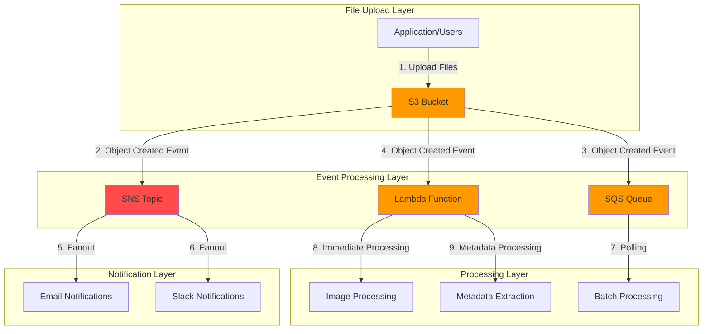

# Automating File Processing with S3 Event Notifications

## Problem

Media companies and content platforms handle thousands of uploaded files daily, requiring immediate processing workflows for transcoding, thumbnail generation, and metadata extraction. Manual processing creates bottlenecks, increases operational costs, and delays content delivery to end users. Without automated event-driven processing, organizations struggle to maintain real-time workflows and miss critical business opportunities while accumulating technical debt.

## Solution

Create an event-driven architecture using S3 event notifications to trigger automated processing workflows. S3 will publish events to multiple destinations including Lambda functions for immediate processing, SQS queues for decoupled batch processing, and SNS topics for multi-subscriber notifications. This approach enables real-time file processing, maintains system resilience through decoupling, and provides scalable workflow orchestration.

## Architecture Diagram



## Prerequisites

1. AWS account with permissions for S3, Lambda, SNS, SQS, and IAM
2. AWS CLI v2 installed and configured (or AWS CloudShell)
3. Basic understanding of event-driven architectures and JSON
4. Knowledge of AWS IAM roles and policies
5. Estimated cost: $5-15/month for moderate usage (1000+ file uploads)

> **Note**: S3 event notifications are designed to be delivered at least once and typically arrive within seconds but can occasionally take longer.

## Preparation

```bash
# Set environment variables
export AWS_REGION=$(aws configure get region)
export AWS_ACCOUNT_ID=$(aws sts get-caller-identity \
    --query Account --output text)

# Generate unique identifiers for resources
RANDOM_SUFFIX=$(aws secretsmanager get-random-password \
    --exclude-punctuation --exclude-uppercase \
    --password-length 6 --require-each-included-type \
    --output text --query RandomPassword)

export BUCKET_NAME="file-processing-demo-${RANDOM_SUFFIX}"
export SNS_TOPIC_NAME="file-processing-notifications-${RANDOM_SUFFIX}"
export SQS_QUEUE_NAME="file-processing-queue-${RANDOM_SUFFIX}"
export LAMBDA_FUNCTION_NAME="file-processor-${RANDOM_SUFFIX}"

# Create S3 bucket
aws s3 mb s3://${BUCKET_NAME} --region ${AWS_REGION}

echo "✅ Created S3 bucket: ${BUCKET_NAME}"
```

## Steps

1. **Create SNS Topic for Notifications**:

   Amazon SNS (Simple Notification Service) provides a fully managed pub/sub messaging service that enables fan-out patterns for distributing messages to multiple subscribers. In our event-driven architecture, SNS acts as the central hub for broadcasting S3 events to multiple downstream systems like email notifications, Slack integrations, or other processing services. This decoupling pattern ensures that adding new subscribers doesn't require modifying the S3 event configuration.

   ```bash
   # Create SNS topic
   SNS_TOPIC_ARN=$(aws sns create-topic \
       --name ${SNS_TOPIC_NAME} \
       --query TopicArn --output text)
   
   echo "✅ Created SNS topic: ${SNS_TOPIC_ARN}"
   
   # Subscribe to topic with email (replace with your email)
   aws sns subscribe \
       --topic-arn ${SNS_TOPIC_ARN} \
       --protocol email \
       --notification-endpoint your-email@example.com
   
   echo "✅ Email subscription created (check your inbox to confirm)"
   ```

   The SNS topic is now established and ready to receive S3 events. Email subscriptions require confirmation to prevent spam, which follows AWS security best practices. This messaging foundation enables real-time notifications to stakeholders when files are uploaded, supporting business requirements for immediate awareness of content updates.

2. **Create SQS Queue for Batch Processing**:

   Amazon SQS (Simple Queue Service) provides reliable, scalable message queuing that enables asynchronous processing patterns. Unlike direct Lambda invocation, SQS decouples file processing from S3 events, allowing for batch processing, retry logic, and handling traffic spikes without overwhelming downstream systems. SQS guarantees at-least-once delivery and can handle millions of messages, making it ideal for high-volume file processing scenarios.

   ```bash
   # Create SQS queue
   SQS_QUEUE_URL=$(aws sqs create-queue \
       --queue-name ${SQS_QUEUE_NAME} \
       --query QueueUrl --output text)
   
   # Get queue ARN
   SQS_QUEUE_ARN=$(aws sqs get-queue-attributes \
       --queue-url ${SQS_QUEUE_URL} \
       --attribute-names QueueArn \
       --query 'Attributes.QueueArn' --output text)
   
   echo "✅ Created SQS queue: ${SQS_QUEUE_ARN}"
   ```

   The SQS queue is now configured and ready to buffer S3 events for batch processing. This queue-based approach provides resilience against processing failures and enables horizontal scaling of worker instances based on queue depth. The queue ARN will be used later to configure S3 event notifications and establish proper IAM permissions.

3. **Create IAM Role for Lambda Function**:

   IAM (Identity and Access Management) roles enable secure, temporary credential delegation without embedding access keys in application code. For Lambda functions, roles define what AWS services and resources the function can access, following the principle of least privilege. The trust policy specifies that only the Lambda service can assume this role, preventing unauthorized access while enabling the function to interact with other AWS services on your behalf.

   ```bash
   # Create trust policy for Lambda
   cat > /tmp/lambda-trust-policy.json << EOF
   {
       "Version": "2012-10-17",
       "Statement": [
           {
               "Effect": "Allow",
               "Principal": {
                   "Service": "lambda.amazonaws.com"
               },
               "Action": "sts:AssumeRole"
           }
       ]
   }
   EOF
   
   # Create IAM role
   aws iam create-role \
       --role-name ${LAMBDA_FUNCTION_NAME}-role \
       --assume-role-policy-document file:///tmp/lambda-trust-policy.json
   
   # Attach basic execution policy
   aws iam attach-role-policy \
       --role-name ${LAMBDA_FUNCTION_NAME}-role \
       --policy-arn arn:aws:iam::aws:policy/service-role/AWSLambdaBasicExecutionRole
   
   echo "✅ Created Lambda execution role"
   ```

   The IAM role is now configured with basic Lambda execution permissions, including CloudWatch Logs access for monitoring and debugging. This security foundation ensures your Lambda function can write logs while maintaining strict access controls. The managed policy provides standard permissions needed for Lambda function execution without granting excessive privileges.

4. **Create Lambda Function for File Processing**:

   AWS Lambda provides serverless compute that automatically scales from zero to thousands of concurrent executions based on incoming events. Lambda functions are ideal for event-driven file processing because they eliminate server management, provide automatic scaling, and offer cost-effective pay-per-invocation pricing. The function processes S3 events in real-time, enabling immediate response to file uploads for time-sensitive workflows like content moderation or real-time analytics.

   ```bash
   # Create Lambda function code
   cat > /tmp/file-processor.py << 'EOF'
   import json
   import boto3
   import urllib.parse
   from datetime import datetime
   
   def lambda_handler(event, context):
       print(f"Received event: {json.dumps(event)}")
       
       for record in event['Records']:
           # Parse S3 event
           bucket = record['s3']['bucket']['name']
           key = urllib.parse.unquote_plus(record['s3']['object']['key'])
           size = record['s3']['object']['size']
           event_name = record['eventName']
           
           print(f"Processing {event_name} for {key} in bucket {bucket}")
           print(f"File size: {size} bytes")
           
           # Simulate processing based on file type
           if key.lower().endswith(('.jpg', '.jpeg', '.png', '.gif')):
               print("Processing image file - would trigger image processing")
           elif key.lower().endswith(('.mp4', '.mov', '.avi')):
               print("Processing video file - would trigger video transcoding")
           elif key.lower().endswith(('.pdf', '.doc', '.docx')):
               print("Processing document - would extract metadata")
           else:
               print("Unknown file type - logging for review")
           
           # Log processing completion
           print(f"Completed processing {key} at {datetime.now()}")
       
       return {
           'statusCode': 200,
           'body': json.dumps('File processing completed successfully')
       }
   EOF
   
   # Create deployment package
   cd /tmp && zip function.zip file-processor.py
   
   # Create Lambda function
   LAMBDA_ROLE_ARN="arn:aws:iam::${AWS_ACCOUNT_ID}:role/${LAMBDA_FUNCTION_NAME}-role"
   
   aws lambda create-function \
       --function-name ${LAMBDA_FUNCTION_NAME} \
       --runtime python3.13 \
       --role ${LAMBDA_ROLE_ARN} \
       --handler file-processor.lambda_handler \
       --zip-file fileb://function.zip \
       --timeout 30 \
       --memory-size 128
   
   echo "✅ Created Lambda function: ${LAMBDA_FUNCTION_NAME}"
   ```

   The Lambda function is now deployed and ready to process S3 events. The function demonstrates file type detection and routing logic, which is essential for content-aware processing workflows. With a 30-second timeout and 128MB memory allocation, this function can handle lightweight processing tasks efficiently while maintaining cost optimization for high-volume scenarios.

5. **Configure SNS Topic Policy for S3 Event Publishing**:

   Resource-based policies in AWS define who can access a specific resource and what actions they can perform. For S3 event notifications to work with SNS, the topic must explicitly grant the S3 service permission to publish messages. The policy includes a condition that restricts access to only your specific S3 bucket, preventing unauthorized services from publishing to your topic and ensuring security isolation.

   ```bash
   # Create SNS topic policy
   cat > /tmp/sns-policy.json << EOF
   {
       "Version": "2012-10-17",
       "Statement": [
           {
               "Effect": "Allow",
               "Principal": {
                   "Service": "s3.amazonaws.com"
               },
               "Action": "SNS:Publish",
               "Resource": "${SNS_TOPIC_ARN}",
               "Condition": {
                   "ArnEquals": {
                       "aws:SourceArn": "arn:aws:s3:::${BUCKET_NAME}"
                   }
               }
           }
       ]
   }
   EOF
   
   # Apply SNS topic policy
   aws sns set-topic-attributes \
       --topic-arn ${SNS_TOPIC_ARN} \
       --attribute-name Policy \
       --attribute-value file:///tmp/sns-policy.json
   
   echo "✅ Configured SNS topic policy"
   ```

   The SNS topic policy is now configured to accept messages from your S3 bucket. This cross-service permission is essential for event-driven architectures and demonstrates the principle of least privilege by restricting access to only the necessary AWS services and specific resources.

6. **Configure SQS Queue Policy for S3 Event Delivery**:

   Similar to SNS, SQS queues require explicit permission for S3 to deliver messages. This queue policy enables S3 to send event notifications directly to the SQS queue, supporting asynchronous processing patterns where messages can be processed at a controlled rate. The policy ensures that only your specific S3 bucket can send messages, maintaining security boundaries and preventing cross-contamination from other sources.

   ```bash
   # Create SQS queue policy
   cat > /tmp/sqs-policy.json << EOF
   {
       "Version": "2012-10-17",
       "Statement": [
           {
               "Effect": "Allow",
               "Principal": {
                   "Service": "s3.amazonaws.com"
               },
               "Action": "SQS:SendMessage",
               "Resource": "${SQS_QUEUE_ARN}",
               "Condition": {
                   "ArnEquals": {
                       "aws:SourceArn": "arn:aws:s3:::${BUCKET_NAME}"
                   }
               }
           }
       ]
   }
   EOF
   
   # Apply SQS queue policy
   aws sqs set-queue-attributes \
       --queue-url ${SQS_QUEUE_URL} \
       --attributes file:///tmp/sqs-policy.json
   
   echo "✅ Configured SQS queue policy"
   ```

   The SQS queue policy is now established, enabling reliable message delivery from S3. This configuration supports batch processing scenarios where worker applications can poll the queue at their own pace, providing buffer capacity during traffic spikes and enabling graceful handling of processing failures through message retry mechanisms.

7. **Grant S3 Permission to Invoke Lambda Function**:

   Lambda function permissions work differently from other AWS services, using resource-based policies attached directly to the function rather than separate IAM policies. This permission grants the S3 service the ability to invoke your Lambda function, enabling direct, synchronous processing of S3 events. The source ARN restriction ensures that only your specific S3 bucket can trigger the function, providing security isolation and preventing unauthorized invocations.

   ```bash
   # Add Lambda permission for S3
   aws lambda add-permission \
       --function-name ${LAMBDA_FUNCTION_NAME} \
       --principal s3.amazonaws.com \
       --action lambda:InvokeFunction \
       --statement-id s3-trigger-permission \
       --source-arn arn:aws:s3:::${BUCKET_NAME}
   
   echo "✅ Granted S3 permission to invoke Lambda"
   ```

   The Lambda function permission is now configured, completing the authorization chain needed for S3 to directly invoke your function. This synchronous integration pattern enables real-time processing with minimal latency, ideal for immediate response requirements like content validation or real-time analytics updates.

8. **Configure S3 Event Notifications with Intelligent Routing**:

   S3 event notifications enable real-time responses to bucket events by publishing messages to configured destinations. This configuration demonstrates sophisticated event routing using prefix-based filters, allowing different file upload locations to trigger different processing workflows. The `s3:ObjectCreated:*` event captures all object creation methods (PUT, POST, COPY, multipart upload completion), ensuring comprehensive coverage for various upload scenarios.

   ```bash
   # Create notification configuration
   cat > /tmp/notification-config.json << EOF
   {
       "TopicConfigurations": [
           {
               "Id": "file-upload-notification",
               "TopicArn": "${SNS_TOPIC_ARN}",
               "Events": ["s3:ObjectCreated:*"],
               "Filter": {
                   "Key": {
                       "FilterRules": [
                           {
                               "Name": "prefix",
                               "Value": "uploads/"
                           }
                       ]
                   }
               }
           }
       ],
       "QueueConfigurations": [
           {
               "Id": "batch-processing-queue",
               "QueueArn": "${SQS_QUEUE_ARN}",
               "Events": ["s3:ObjectCreated:*"],
               "Filter": {
                   "Key": {
                       "FilterRules": [
                           {
                               "Name": "prefix",
                               "Value": "batch/"
                           }
                       ]
                   }
               }
           }
       ],
       "LambdaConfigurations": [
           {
               "Id": "immediate-processing",
               "LambdaFunctionArn": "arn:aws:lambda:${AWS_REGION}:${AWS_ACCOUNT_ID}:function:${LAMBDA_FUNCTION_NAME}",
               "Events": ["s3:ObjectCreated:*"],
               "Filter": {
                   "Key": {
                       "FilterRules": [
                           {
                               "Name": "prefix",
                               "Value": "immediate/"
                           }
                       ]
                   }
               }
           }
       ]
   }
   EOF
   
   # Apply notification configuration
   aws s3api put-bucket-notification-configuration \
       --bucket ${BUCKET_NAME} \
       --notification-configuration file:///tmp/notification-config.json
   
   echo "✅ Configured S3 event notifications"
   ```

   The S3 event notification configuration is now active, creating intelligent routing based on upload location. Files uploaded to `uploads/` trigger SNS notifications for broad awareness, `batch/` files queue for controlled processing, and `immediate/` files invoke Lambda for real-time processing. This pattern enables sophisticated workflow management without complex application logic.

9. **Create Test Directory Structure for Event Routing**:

   S3 uses object keys (filenames) to organize data and enable prefix-based filtering for event notifications. Creating directory structures using empty objects with trailing slashes establishes clear organizational patterns and prepares the bucket for testing different event routing scenarios. This structure mirrors real-world usage where different upload workflows require different processing behaviors.

   ```bash
   # Create test directories in S3
   aws s3api put-object --bucket ${BUCKET_NAME} --key uploads/
   aws s3api put-object --bucket ${BUCKET_NAME} --key batch/
   aws s3api put-object --bucket ${BUCKET_NAME} --key immediate/
   
   echo "✅ Created test directory structure"
   ```

   The directory structure is now established, providing clear separation between different processing workflows. This organization enables testing of the event routing logic and demonstrates how prefix-based filtering can support sophisticated file processing architectures in production environments.

10. **Set Up CloudWatch Log Group for Comprehensive Monitoring**:

    CloudWatch Logs provides centralized logging and monitoring for AWS services, enabling real-time visibility into function execution, error tracking, and performance analysis. While Lambda automatically creates log groups, pre-creating them ensures consistent logging configuration and enables setting retention policies to manage costs. Comprehensive logging is essential for debugging event-driven architectures where processing occurs across multiple services.

    ```bash
    # Create CloudWatch log group for Lambda
    aws logs create-log-group \
        --log-group-name /aws/lambda/${LAMBDA_FUNCTION_NAME}
    
    echo "✅ Created CloudWatch log group for monitoring"
    ```

    The CloudWatch log group is now configured to capture Lambda execution logs. This monitoring foundation enables troubleshooting of processing workflows, performance optimization based on execution metrics, and compliance auditing through comprehensive event logging across the entire event-driven architecture.

## Validation & Testing

1. **Test SNS Notification Workflow**:

   ```bash
   # Create test file and upload to uploads/ prefix
   echo "Test file for SNS notification" > /tmp/test-sns.txt
   
   aws s3 cp /tmp/test-sns.txt s3://${BUCKET_NAME}/uploads/test-sns.txt
   
   # Check SNS topic for messages
   aws sns get-topic-attributes \
       --topic-arn ${SNS_TOPIC_ARN} \
       --query 'Attributes.SubscriptionsConfirmed'
   ```

   Expected output: You should receive an email notification about the file upload.

2. **Test SQS Queue Processing**:

   ```bash
   # Upload file to batch/ prefix
   echo "Test file for SQS processing" > /tmp/test-sqs.txt
   
   aws s3 cp /tmp/test-sqs.txt s3://${BUCKET_NAME}/batch/test-sqs.txt
   
   # Check SQS queue for messages
   aws sqs receive-message \
       --queue-url ${SQS_QUEUE_URL} \
       --max-number-of-messages 1
   ```

   Expected output: JSON message containing S3 event details.

3. **Test Lambda Function Processing**:

   ```bash
   # Upload file to immediate/ prefix
   echo "Test file for Lambda processing" > /tmp/test-lambda.txt
   
   aws s3 cp /tmp/test-lambda.txt s3://${BUCKET_NAME}/immediate/test-lambda.txt
   
   # Check Lambda function logs
   aws logs describe-log-streams \
       --log-group-name /aws/lambda/${LAMBDA_FUNCTION_NAME} \
       --order-by LastEventTime --descending
   ```

   Expected output: Log stream information showing recent Lambda executions.

4. **Test Event Filtering**:

   ```bash
   # Upload file to root (should not trigger notifications)
   echo "Test file for root upload" > /tmp/test-root.txt
   
   aws s3 cp /tmp/test-root.txt s3://${BUCKET_NAME}/test-root.txt
   
   # Verify no notifications were sent
   echo "✅ Event filtering working correctly"
   ```

## Cleanup

1. **Remove S3 event notification configuration**:

   ```bash
   # Remove notification configuration
   aws s3api put-bucket-notification-configuration \
       --bucket ${BUCKET_NAME} \
       --notification-configuration '{}'
   
   echo "✅ Removed S3 event notifications"
   ```

2. **Delete Lambda function and role**:

   ```bash
   # Delete Lambda function
   aws lambda delete-function \
       --function-name ${LAMBDA_FUNCTION_NAME}
   
   # Detach and delete IAM role
   aws iam detach-role-policy \
       --role-name ${LAMBDA_FUNCTION_NAME}-role \
       --policy-arn arn:aws:iam::aws:policy/service-role/AWSLambdaBasicExecutionRole
   
   aws iam delete-role \
       --role-name ${LAMBDA_FUNCTION_NAME}-role
   
   echo "✅ Deleted Lambda function and role"
   ```

3. **Delete SQS queue**:

   ```bash
   # Delete SQS queue
   aws sqs delete-queue --queue-url ${SQS_QUEUE_URL}
   
   echo "✅ Deleted SQS queue"
   ```

4. **Delete SNS topic**:

   ```bash
   # Delete SNS topic
   aws sns delete-topic --topic-arn ${SNS_TOPIC_ARN}
   
   echo "✅ Deleted SNS topic"
   ```

5. **Delete S3 bucket and contents**:

   ```bash
   # Empty and delete S3 bucket
   aws s3 rm s3://${BUCKET_NAME} --recursive
   aws s3 rb s3://${BUCKET_NAME}
   
   echo "✅ Deleted S3 bucket and contents"
   ```

6. **Delete CloudWatch log group**:

   ```bash
   # Delete CloudWatch log group
   aws logs delete-log-group \
       --log-group-name /aws/lambda/${LAMBDA_FUNCTION_NAME}
   
   echo "✅ Deleted CloudWatch log group"
   ```

## Discussion

S3 event notifications provide a powerful foundation for building event-driven architectures that can scale automatically with your workload. The key architectural decision involves choosing the right destination for each use case: Lambda for immediate processing and low-latency workflows, SQS for reliable batch processing and decoupling, and SNS for fan-out patterns where multiple subscribers need the same event data. This design follows the [AWS Well-Architected Framework](https://docs.aws.amazon.com/wellarchitected/latest/framework/welcome.html) principles for operational excellence and reliability.

Event filtering using prefixes and suffixes allows you to create sophisticated routing rules without complex application logic. This approach reduces costs by only triggering processing for relevant files and enables different workflows for different file types or business processes. The at-least-once delivery guarantee ensures reliability, but your processing logic should be idempotent to handle potential duplicate events, as documented in the [S3 Event Notifications User Guide](https://docs.aws.amazon.com/AmazonS3/latest/userguide/EventNotifications.html).

Cost optimization becomes critical at scale, as each S3 event generates charges for the destination service. Consider using S3 Storage Classes and Lifecycle policies to automatically transition files to cheaper storage tiers after processing. Monitor CloudWatch metrics to identify bottlenecks and adjust Lambda concurrency limits or SQS visibility timeouts based on your processing requirements. The [AWS Lambda performance optimization guide](https://docs.aws.amazon.com/lambda/latest/dg/best-practices.html) provides comprehensive strategies for optimizing serverless workloads.

Security considerations include implementing least-privilege IAM policies, encrypting sensitive data in transit and at rest, and using VPC endpoints for private communication between services. For production deployments, consider using dead letter queues for failed processing attempts and implementing comprehensive logging and monitoring with AWS X-Ray for distributed tracing, as recommended in the [AWS Lambda security best practices](https://docs.aws.amazon.com/lambda/latest/dg/lambda-security.html).

> **Tip**: Use S3 Transfer Acceleration for faster uploads from distant geographic locations, and enable S3 Event Notifications for bucket-level operations to monitor administrative actions.

> **Warning**: S3 event notifications are delivered at least once, meaning your processing logic must be idempotent to handle potential duplicate events gracefully.

## Challenge

Extend this solution by implementing these enhancements:

1. **Add file type-specific processing** by creating separate Lambda functions for image, video, and document processing, each with specialized libraries and longer timeout values.

2. **Implement dead letter queues** for both SQS and Lambda to handle failed processing attempts with automatic retry logic and alerting.

3. **Create a processing status dashboard** using DynamoDB to track file processing states and API Gateway with Lambda to expose status endpoints.

4. **Add cross-region replication** for disaster recovery by setting up S3 Cross-Region Replication with event notifications in secondary regions.

5. **Implement content validation** using Amazon Macie to scan uploaded files for sensitive data and automatically quarantine or encrypt files based on classification results.

## Infrastructure Code

### Available Infrastructure as Code:

- [Infrastructure Code Overview](code/README.md) - Detailed description of all infrastructure components
- [AWS CDK (Python)](code/cdk-python/) - AWS CDK Python implementation
- [AWS CDK (TypeScript)](code/cdk-typescript/) - AWS CDK TypeScript implementation
- [CloudFormation](code/cloudformation.yaml) - AWS CloudFormation template
- [Bash CLI Scripts](code/scripts/) - Example bash scripts using AWS CLI commands to deploy infrastructure
- [Terraform](code/terraform/) - Terraform configuration files